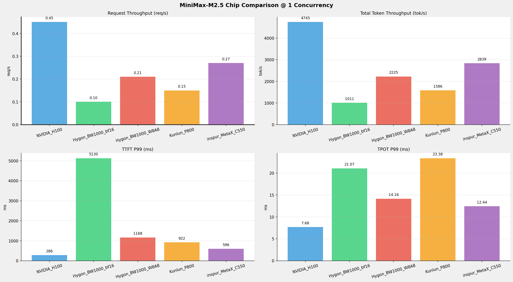
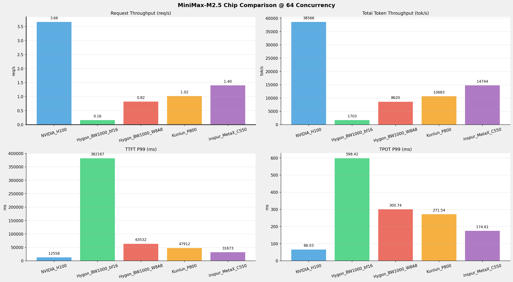
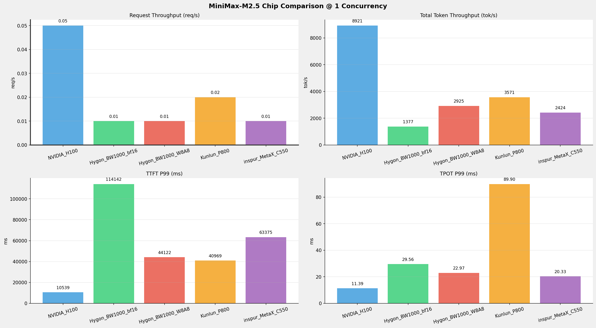
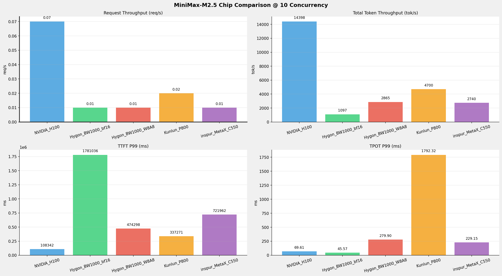

# MiniMax-M2.5模型在不同芯片下的benchmark基准测试报告

---
## 测试环境

### 硬件规格

| 组件 \ 规格            | 英伟达                                        | 海光                                  | 昆仑芯                                          | 沐曦                                     | 备注     |
|--------------------|--------------------------------------------|-------------------------------------|----------------------------------------------|----------------------------------------|--------|
| **节点数量**           | 1 台                                        | 1 台                                 | 1台                                           | 1 台                                    | 确认     |
| **芯片型号**           | H100                                       | BW1000                              | P800 OAM                                     | MetaX-C550                             | 确认     |
| **芯片数量**           | 8 张                                        | 8 张                                 | 8 张                                          | 8 张                                    | 确认     |
| **单卡算力 FP16/BF16** | 1979 TFLOPS （官方理论值）                        | 待确认                                 | 待确认                                          | 待确认                                    | ⚠️ 待确认 |
| **单卡算力 FP32**      | 67 TFLOPS （官方理论值）                          | 待确认                                 | 待确认                                          | 待确认                                    | ⚠️ 待确认 |
| **单卡算力 FP64**      | 34 TFLOPS （官方理论值）                          | 待确认                                 | 待确认                                          | 待确认                                    | ⚠️ 待确认 |
| **单卡显存**           | 80GB                                       | 64GB                                | 96GB                                         | 64GB                                   | 确认     |
| **显存类型**           | HBM3                                       | 待确认                                 | 待确认                                          | HBM2e                                  | ⚠️ 待确认 |
| **显存带宽**           | 3.35 TB/s                                  | 待确认                                 | 待确认                                          | 待确认                                    | ⚠️ 待确认 |
| **单卡功耗**           | 700 W                                      | 200 W                               | 400 W                                        | 450 W                                  | 确认     |
| **卡间互联**           | NVLink 4.0                                 | HSM                                 | XPULink (XL) + PCIe Gen4 x16（跨 NUMA 显示 SYS）  | MetaXLink                              | 确认     |
| **CPU**            | Intel(R) Xeon(R) Platinum 8468 (192核)      | Hygon C86 (128核)                    | Intel Xeon Platinum 8563C (208核)             | Intel(R) Xeon(R) Platinum 8480+ (224核) | 确认     |
| **系统内存**           | 2.0 TiB                                    | 503 GiB                             | 2.0 TiB                                      | 1.8 TiB                                | 确认     |
| **本地存储**           | 894GB 系统盘 + 7TB*4 缓存盘 + 7TB 容器盘 + 25TB 扩展盘 | 437G系统盘 + 1.7TiB (G73M1T9R-C-GD308) | 446.6G + NVMe 4 x 3.5T (Intel SSDPF2KX038T1) | 446.6GB + NVMe 4 x 7T                  | 确认     |


### 软件栈

| 组件\版本             | 英伟达                   | 海光                              | 昆仑芯                                      | 沐曦                                 | 说明                |
|-------------------|-----------------------|---------------------------------|------------------------------------------|------------------------------------|-------------------|
| **操作系统**          | Ubuntu 22.04.5 LTS    | Ubuntu 22.04.5 LTS              | Ubuntu 22.04.5 LTS                       | Ubuntu 20.04.1                     | 芯片所在物理机系统         |
| **显卡驱动**          | 570.133.20/580.126.09 | 6.3.22-V1.2.0                   | Kunlun / XPU Driver 5.0.21.26            | Kernel Mode Driver Version: 3.6.11 | 驱动信息              |
| **Toolkit**       | release 12.9          | DTK-26.04-beta-0130-ubuntu20.04 | XPU Container Runtime Hook version 1.0.5 | MACA Version: 3.5.3.23             | CUDA Toolkit版本    |
| **Docker**        | -                     | 28.0.4                          | 28.4.0                                   | 28.1.1                             | 容器运行时             |
| **containerd**    | 2.2.0                 | 2.1.1                           | 1.7.28                                   | -                                  | K8S 容器运行时（CRI）    |
| **Kubernetes**    | 1.34.2                | 1.33                            | v1.28.2                                  | -                                  | 单节点 All-in-One 部署 |
| **Device Plugin** | 0.14.5                | v2.4.0                          | xpu-device-plugin v5.0.0-alpha.2         | -                                  | K8S GPU 资源管理      |
| **多卡通信库**         | NCCL                  | DTK内置RCCL                       | 无单独查询版本                                  | MCCLl                              | 多卡通信库             |


### 部署方式

| **平台类别**                 | **部署方式**   |
|--------------------------|------------|
| **NVIDIA_H100**          | K8S部署      |
| **Hygon_BW1000**         | Docker容器部署 |
| **Kunlun_P800**          | Docker容器部署 |
| **MetaX_C550**           | Docker容器部署 |


### 模型配置信息

| 参数名称                        | **NVIDIA_H100** | **Hygon_BW1000**                               | **Hygon_BW1000**              | **Kunlun_P800**                | **MetaX_C550**      |
|-----------------------------|-----------------|------------------------------------------------|-------------------------------|--------------------------------|---------------------|
| **model_name**              | MiniMax-M2.5    | MiniMax-M2.5-bf16                              | MiniMax-M2.5-W8A8             | MiniMax-M2.5-W8A8-INT8-Dynamic | MiniMax-M2.5-W8A8   |
| **quantization_config**     | FP8             | bf16                                           | int-8                         | int-8                          | int-8               |
| **model_size**              | 215G            | 427G                                           | 215G                          | 215G                           | 215G                |
| **max_position_embeddings** | 196608          | 196608                                         | 196608                        | 196608                         | 196608              |
| **temperature**             | 1.0             | N/A                                            | N/A                           | 1.0                            | N/A                 |
| **top_k**                   | 40              | N/A                                            | N/A                           | 40                             | 40                  |
| **top_p**                   | 0.95            | N/A                                            | N/A                           | 0.95                           | 0.95                |
| **transformers_version**    | 4.46.1          | 4.46.1                                         | 4.57.6                        | 4.46.1                         | 4.57.6              |
| **vllm_version**            | 0.20.0          | 0.11.0+das.opt1.rc2.dtk2604.20260128.g0bf89b0c | 0.15.1+das.opt1.alpha.dtk2604 | 0.11.0                         | -                   |
| **sglang_version**          | -               | -                                              | -                             | -                              | 0.5.9+maca3.5.3.204 |
| **python_version**          | 3.12.3          | 3.10.12                                        | 3.10.12                       | 3.10.10                        | 3.10.12             |


### 推理框架主要启动参数

| 参数名称                        | **NVIDIA_H100** | **Hygon_BW1000**  | **Hygon_BW1000**  | **Kunlun_P800**                                                                                                                                                                                                                                                                                                                                                                   | **MetaX_C550**        |
|-----------------------------|-----------------|-------------------|-------------------|-----------------------------------------------------------------------------------------------------------------------------------------------------------------------------------------------------------------------------------------------------------------------------------------------------------------------------------------------------------------------------------|-------------------|
| **Model Name**              | MiniMax-M2.5    | MiniMax-M2.5-bf16 | MiniMax-M2.5-W8A8 | MiniMax-M2.5-W8A8-INT8-Dynamic                                                                                                                                                                                                                                                                                                                                                    | MiniMax-M2.5-W8A8 |
| **Max Model Len**           | 196608          | 196608            | 196608            | 196608                                                                                                                                                                                                                                                                                                                                                                            | 196608            |
| **Max Num Seqs**            | 64              | 64                | 64                | 64                                                                                                                                                                                                                                                                                                                                                                                | 64                |
| **Max Num Batched Tokens**  | 8192            | default           | default           | 8192                                                                                                                                                                                                                                                                                                                                                                              | -                 |
| **Block Size**              | default         | default           | default           | 128                                                                                                                                                                                                                                                                                                                                                                               | -                 |
| **Gpu Memory Utilization**  | 0.85            | 0.9               | 0.9               | 0.95                                                                                                                                                                                                                                                                                                                                                                              | 0.9               |
| **Compilation Config**      | -               | -                 | -                 | {"splitting_ops":["vllm.unified_attention",<br/>"vllm.unified_attention_with_output",<br/>"vllm.unified_attention_with_output_kunlun",<br/>"vllm.mamba_mixer2",<br/>"vllm.mamba_mixer",<br/>"vllm.short_conv",<br/>"vllm.linear_attention",<br/>"vllm.plamo2_mamba_mixer",<br/>"vllm.gdn_attention",<br/>"vllm.sparse_attn_indexer",<br/>"vllm.sparse_attn_indexer_vllm_kunlun"]} | -                 |
| **Dtype**                   | default         | bfloat16          | bfloat16          | auto                                                                                                                                                                                                                                                                                                                                                                              | -                 |
| **Dp**                      | 1               | 1                 | 1                 | 1                                                                                                                                                                                                                                                                                                                                                                                 | 1                 |
| **Tp**                      | 8               | 8                 | 8                 | 8                                                                                                                                                                                                                                                                                                                                                                                 | 8                 |
| **Pp**                      | 1               | 1                 | 1                 | 1                                                                                                                                                                                                                                                                                                                                                                                 | 1                 |
| **Reasoning Parser**        | minimax_m2      | minimax_m2        | minimax_m2        | minimax_m2                                                                                                                                                                                                                                                                                                                                                                        | minimax           |
| **Tool Call Parser**        | minimax_m2      | minimax_m2        | minimax_m2        | minimax_m2                                                                                                                                                                                                                                                                                                                                                                        | minimax-m2        |
| **Enable Auto Tool Choice** | True            | True              | True              | True                                                                                                                                                                                                                                                                                                                                                                              | True              |
| **Enable Export Parallel**  | True            | True              | True              | False                                                                                                                                                                                                                                                                                                                                                                             | -                 |

>各芯片平台的Minimax_M2.5模型的详细部署脚本参见本文档的《附录一》


## 测试场景一： 短上下文长度性能比对
    
### 📊 测试概览

| 项目            | 配置                                                                                                                                                                                                 | 备注  |
|---------------|----------------------------------------------------------------------------------------------------------------------------------------------------------------------------------------------------|-----|
| **数据集**       | random                                                                                                                                                                                             |     |
| **并发数**       | 1, 64                                                                                                                                                                                              |     |
| **总请求数**      | 320                                                                                                                                                                                                |     |
| **请求输入上下文长度** | 10240（10k）                                                                                                                                                                                         |     |
| **请求输出上下文长度** | 256（0.25k）                                                                                                                                                                                         |     |
| **被测芯片和模型**   | NVIDIA_H100：MiniMax-M2.5-FP8 <br/> Hygon_BW1000: MiniMax-M2.5-bf16 <br/>Hygon_BW1000: MiniMax-M2.5-W8A8 <br/>Kunlun_P800: MiniMax-M2.5-W8A8-INT8-Dynamic <br/>inspur_MetaX_C550: MiniMax-M2.5-W8A8 |     |


---

### 📊 芯片性能对比柱状图


**1并发**



**64并发**




---

### 📈 各芯片平台不同并发级别各指标性能对比详情

#### 请求吞吐量（Request throughput (req/s)）

| 并发数 | NVIDIA_H100(基准) | Hygon_BW1000_bf16 | 相对基准   | Hygon_BW1000_W8A8 | 相对基准   | Kunlun_P800 | 相对基准   | inspur_MetaX_C550 | 相对基准   |
|-----|-----------------|-------------------|--------|-------------------|--------|-------------|--------|-------------------|--------|
| 1   | 0.45            | 0.10              | -77.8% | 0.21              | -53.3% | 0.15        | -66.7% | 0.27              | -40.0% |
| 64  | 3.66            | 0.16              | -95.6% | 0.82              | -77.6% | 1.02        | -72.1% | 1.40              | -61.7% |


#### 输出token吞吐量（Output token throughput (tok/s)）

| 并发数 | NVIDIA_H100(基准) | Hygon_BW1000_bf16 | 相对基准   | Hygon_BW1000_W8A8 | 相对基准   | Kunlun_P800 | 相对基准   | inspur_MetaX_C550 | 相对基准   |
|-----|-----------------|-------------------|--------|-------------------|--------|-------------|--------|-------------------|--------|
| 1   | 115.31          | 24.66             | -78.6% | 54.28             | -52.9% | 37.20       | -67.7% | 69.26             | -39.9% |
| 64  | 937.16          | 41.54             | -95.6% | 210.25            | -77.6% | 253.92      | -72.9% | 359.62            | -61.6% |


#### 总token吞吐量（Total token throughput (tok/s)）

| 并发数 | NVIDIA_H100(基准) | Hygon_BW1000_bf16 | 相对基准   | Hygon_BW1000_W8A8 | 相对基准   | Kunlun_P800 | 相对基准   | inspur_MetaX_C550 | 相对基准   |
|-----|-----------------|-------------------|--------|-------------------|--------|-------------|--------|-------------------|--------|
| 1   | 4745.14         | 1010.87           | -78.7% | 2225.40           | -53.1% | 1585.87     | -66.6% | 2839.48           | -40.2% |
| 64  | 38566.45        | 1702.94           | -95.6% | 8620.30           | -77.6% | 10682.97    | -72.3% | 14744.38          | -61.8% |


#### 首token延迟（P99 TTFT (ms)）

| 并发数 | NVIDIA_H100(基准) | Hygon_BW1000_bf16 | 相对基准     | Hygon_BW1000_W8A8 | 相对基准    | Kunlun_P800 | 相对基准    | inspur_MetaX_C550 | 相对基准    |
|-----|-----------------|-------------------|----------|-------------------|---------|-------------|---------|-------------------|---------|
| 1   | 286.01          | 5130.17           | +1693.7% | 1168.49           | +308.5% | 921.76      | +222.3% | 596.38            | +108.5% |
| 64  | 12557.76        | 382166.79         | +2943.3% | 63531.55          | +405.9% | 47912.19    | +281.5% | 31672.66          | +152.2% |


#### 每token生成时间（P99 TPOT (ms)）

| 并发数 | NVIDIA_H100(基准) | Hygon_BW1000_bf16 | 相对基准    | Hygon_BW1000_W8A8 | 相对基准    | Kunlun_P800 | 相对基准    | inspur_MetaX_C550 | 相对基准    |
|-----|-----------------|-------------------|---------|-------------------|---------|-------------|---------|-------------------|---------|
| 1   | 7.68            | 21.07             | +174.3% | 14.16             | +84.4%  | 23.38       | +204.4% | 12.44             | +62.0%  |
| 64  | 66.03           | 598.42            | +806.3% | 300.74            | +355.5% | 271.54      | +311.2% | 174.61            | +164.4% |


#### token间延迟（P99 ITL (ms)）

| 并发数 | NVIDIA_H100(基准) | Hygon_BW1000_bf16 | 相对基准    | Hygon_BW1000_W8A8 | 相对基准    | Kunlun_P800 | 相对基准    | inspur_MetaX_C550 | 相对基准   |
|-----|-----------------|-------------------|---------|-------------------|---------|-------------|---------|-------------------|--------|
| 1   | 8.57            | 32.03             | +273.7% | 20.17             | +135.4% | 24.07       | +180.9% | 14.88             | +73.6% |
| 64  | 170.95          | 160.09            | -6.4%   | 64.72             | -62.1%  | 635.84      | +271.9% | 57.22             | -66.5% |


---

## 测试场景二： 超长上下文长度性能比对

### 📊 测试概览

| 项目            | 配置                            | 备注  |
|---------------|-------------------------------|-----|
| **数据集**       | random                        |     |
| **并发数**       | 1, 10    |     |
| **总请求数**      | 100                           |     |
| **请求输入上下文长度** | 194560（190k）                    |     |
| **请求输出上下文长度** | 1024（1k）                    |     |
| **被测芯片**      | NVIDIA_H100：MiniMax-M2.5-FP8 <br/> Hygon_BW1000: MiniMax-M2.5-bf16 <br/>Hygon_BW1000: MiniMax-M2.5-W8A8 <br/>Kunlun_P800: MiniMax-M2.5-W8A8-INT8-Dynamic <br/>inspur_MetaX_C550: MiniMax-M2.5-W8A8 |     |

### 📊 芯片性能对比柱状图


**1并发**



**10并发**




### 📈 各芯片平台不同并发级别各指标性能对比详情

#### 请求吞吐量（Request throughput (req/s)）

| 并发数 | NVIDIA_H100(基准) | Hygon_BW1000_bf16 | 相对基准   | Hygon_BW1000_W8A8 | 相对基准   | Kunlun_P800 | 相对基准   | inspur_MetaX_C550 | 相对基准   |
|-----|-----------------|-------------------|--------|-------------------|--------|-------------|--------|-------------------|--------|
| 1   | 0.05            | 0.01              | -80.0% | 0.01              | -80.0% | 0.02        | -60.0% | 0.01              | -80.0% |
| 10  | 0.07            | 0.01              | -85.7% | 0.01              | -85.7% | 0.02        | -71.4% | 0.01              | -85.7% |


#### 输出token吞吐量（Output token throughput (tok/s)）

| 并发数 | NVIDIA_H100(基准) | Hygon_BW1000_bf16 | 相对基准   | Hygon_BW1000_W8A8 | 相对基准   | Kunlun_P800 | 相对基准   | inspur_MetaX_C550 | 相对基准   |
|-----|-----------------|-------------------|--------|-------------------|--------|-------------|--------|-------------------|--------|
| 1   | 46.70           | 7.21              | -84.6% | 15.31             | -67.2% | 2.92        | -93.7% | 12.69             | -72.8% |
| 10  | 75.37           | 5.74              | -92.4% | 15.00             | -80.1% | 3.70        | -95.1% | 14.34             | -81.0% |


#### 总token吞吐量（Total token throughput (tok/s)）

| 并发数 | NVIDIA_H100(基准) | Hygon_BW1000_bf16 | 相对基准   | Hygon_BW1000_W8A8 | 相对基准   | Kunlun_P800 | 相对基准   | inspur_MetaX_C550 | 相对基准   |
|-----|-----------------|-------------------|--------|-------------------|--------|-------------|--------|-------------------|--------|
| 1   | 8921.40         | 1376.58           | -84.6% | 2924.75           | -67.2% | 3571.06     | -60.0% | 2424.14           | -72.8% |
| 10  | 14398.41        | 1096.76           | -92.4% | 2865.09           | -80.1% | 4699.60     | -67.4% | 2739.59           | -81.0% |


#### 首token延迟（P99 TTFT (ms)）

| 并发数 | NVIDIA_H100(基准) | Hygon_BW1000_bf16 | 相对基准     | Hygon_BW1000_W8A8 | 相对基准    | Kunlun_P800 | 相对基准    | inspur_MetaX_C550 | 相对基准    |
|-----|-----------------|-------------------|----------|-------------------|---------|-------------|---------|-------------------|---------|
| 1   | 10539.10        | 114142.41         | +983.0%  | 44121.71          | +318.6% | 40968.87    | +288.7% | 63374.54          | +501.3% |
| 10  | 108342.29       | 1781035.71        | +1543.9% | 474297.92         | +337.8% | 337270.92   | +211.3% | 721962.01         | +566.4% |


#### 每token生成时间（P99 TPOT (ms)）

| 并发数 | NVIDIA_H100(基准) | Hygon_BW1000_bf16 | 相对基准    | Hygon_BW1000_W8A8 | 相对基准    | Kunlun_P800 | 相对基准     | inspur_MetaX_C550 | 相对基准    |
|-----|-----------------|-------------------|---------|-------------------|---------|-------------|----------|-------------------|---------|
| 1   | 11.39           | 29.56             | +159.5% | 22.97             | +101.7% | 89.90       | +689.3%  | 20.33             | +78.5%  |
| 10  | 69.61           | 45.57             | -34.5%  | 279.90            | +302.1% | 1792.32     | +2474.8% | 229.15            | +229.2% |


#### token间延迟（P99 ITL (ms)）

| 并发数 | NVIDIA_H100(基准) | Hygon_BW1000_bf16 | 相对基准    | Hygon_BW1000_W8A8 | 相对基准    | Kunlun_P800 | 相对基准    | inspur_MetaX_C550 | 相对基准   |
|-----|-----------------|-------------------|---------|-------------------|---------|-------------|---------|-------------------|--------|
| 1   | 22.97           | 53.91             | +134.7% | 32.12             | +39.8%  | 93.69       | +307.9% | 24.42             | +6.3%  |
| 10  | 639.97          | 55.14             | -91.4%  | 4012.34           | +527.0% | 2848.90     | +345.2% | 46.84             | -92.7% |


> vllm bench serve性能测试脚本见本报告《附录二》

---

---

## 附录一

### NVIDIA_H100平台Minimax-M2.5模型部署

```shell
export TORCH_CUDA_ARCH_LIST="9.0+PTX"
export OMP_NUM_THREADS=8

export PYTHONHASHSEED=0
export PYTHONUNBUFFERED=1
export VLLM_NO_USAGE_STATS=1
export VLLM_LOGGING_LEVEL=INFO
export NCCL_IB_DISABLE=0
export NCCL_IB_HCA=ib7s400p0,ib7s400p1
export NCCL_SOCKET_IFNAME=eth0 #bond0
export GLOO_SOCKET_IFNAME=eth0 #bond0

MODEL_PATH=/userdata/llms/MiniMax/MiniMax-M2.5
MODEL_ID="minimax-m2.5 minmax-m25"
API_KEY=abc123
#MAX_LEN=$(( 1024 * 196 ))
MAX_LEN=196608
MAX_SEQ=64
MAX_BS=8192

DP=1
TP=8
PP=1

CG="$(seq -s ' ' 1 15) $(seq -s ' ' 16 4 31) $(seq -s ' ' 32 8 256)"
TAG=$(gen_ofile)
log_file=$TAG-tp$TP-pp$PP.log
echo log_file: $log_file

export LMCACHE_USE_EXPERIMENTAL=True
export LMCACHE_CONFIG_FILE="/userdata/bin/lmcache_mm25.yaml" 

set -x

vllm serve  $MODEL_PATH \
        --max-model-len $MAX_LEN \
        --max-num-seqs $MAX_SEQ \
        --max-num-batched-tokens $MAX_BS \
        --trust-remote-code \
        --gpu-memory-utilization 0.85 \
        --disable-log-requests \
        --disable-uvicorn-access-log \
        --port 8080 \
        --host 0.0.0.0 \
        --served-model-name $MODEL_ID \
        -dp $DP -tp $TP -pp $PP \
        --enable-expert-parallel \
        --enable-auto-tool-choice --tool-call-parser minimax_m2 --reasoning-parser minimax_m2 \
        --cudagraph-capture-sizes $CG \
        2>&1 |  tee -a $log_file
```

---

### Hygon_BW1000平台Minimax-M2.5-bf16模型部署

```shell
vllm serve /data/models/MiniMax-M2.5-bf16  \
  -tp 8  \
  --trust-remote-code \
  --disable-log-requests \
  --port 8080 \
  --max-num-seqs 64 \
  --max-model-len 196608 \
  --gpu-memory-utilization 0.9 \
  --dtype bfloat16 \
  --served-model-name minimax-m2.5 \
  --enable-expert-parallel \
  --enable-auto-tool-choice \
  --tool-call-parser minimax_m2
```
---

### Hygon_BW1000平台Minimax-M2.5-W8A8模型部署

```shell
vllm serve /data/models/MiniMax-M2.5-W8A8  \
  -tp 8  \
  --trust-remote-code \
  --disable-log-requests \
  --port 8080 \
  --max-num-seqs 64 \
  --max-model-len 196608 \
  --gpu-memory-utilization 0.9 \
  --dtype bfloat16 \
  --served-model-name minimax-m2.5 \
  -cc '{"pass_config": {"fuse_act_quant": false}}' \
  --enable-auto-tool-choice \
  --tool-call-parser minimax_m2
```

---

### Kunlun_P800平台MiniMax-M2.5-W8A8-INT8-Dynamic模型部署

```shell
source /root/miniconda/bin/activate python310_torch25_cuda

unset XPU_DUMMY_EVENT
export XPU_VISIBLE_DEVICES=0,1,2,3,4,5,6,7
export XPU_USE_FAST_SWIGLU=1
export XFT_USE_FAST_SWIGLU=1
export XMLIR_CUDNN_ENABLED=1
export XPU_USE_DEFAULT_CTX=1
export XMLIR_FORCE_USE_XPU_GRAPH=1
export XMLIR_ENABLE_MOCK_TORCH_COMPILE=false
export VLLM_USE_V1=1
export USE_ORI_ROPE=1
export VLLM_USE_TRITON_FLASH_ATTN=
export VLLM_ATTENTION_BACKEND=FLASH_ATTN
export VLLM_KUNLUN_DISABLE_TRITON=1
export XMLIR_MATMUL_FAST_MODE=1

python -m vllm.entrypoints.openai.api_server \
        --host 0.0.0.0 \
        --port 8080    \
        --model /data/MiniMax-M2.5-W8A8-INT8-Dynamic \
        --served-model-name  minimax-m2.5 \
        --gpu-memory-utilization 0.95    \
        --trust-remote-code    \
        --max-model-len 196608    \
        --tensor-parallel-size 8   \
        --dtype auto     \
        --max_num_seqs 64  \
        --max_num_batched_tokens 8192   \
        --block-size 128    \
        --distributed-executor-backend mp   \
        --enable-auto-tool-choice \
        --tool-call-parser minimax_m2 \
        --reasoning-parser minimax_m2 \
        --compilation-config '{"splitting_ops":["vllm.unified_attention","vllm.unified_attention_with_output","vllm.unified_attention_with_output_kunlun","vllm.mamba_mixer2","vllm.mamba_mixer","vllm.short_conv","vllm.linear_attention","vllm.plamo2_mamba_mixer","vllm.gdn_attention","vllm.sparse_attn_indexer","vllm.sparse_attn_indexer_vllm_kunlun"]}'
```

---

### MetaX_C550平台Minimax-M2.5-W8A8模型部署

```shell
#!/bin/bash
# 10.130.70.2 
# 10.130.70.1

mx-smi -r -i all

export PYTORCH_CUDA_ALLOC_CONF=expandable_segments:True,max_split_size_mb:128
export GLOO_SOCKET_IFNAME=ens12f0
export MCCL_SOCKET_IFNAM=ens12f0
export MCCL_IB_HCA=mlx5_0,mlx5_1,mlx5_2,mlx5_3,mlx5_4,mlx5_5,mlx5_6,mlx5_7
export TRITON_ENABLE_MACAP_OPT_MOVE_DOT_OPERANDS_OUT_LOOP=1
export TRITON_ENABLE_MACAP_CHAIN_DOT_OPT=1

# 通用环境变量
export MACA_SMALL_PAGESIZE_ENABLE=1
export TRITON_ENABLE_MACA_OPT_MOVE_DOT_OPERANDS_OUT_LOOP=1
export TRITON_ENABLE_MACA_CHAIN_DOT_OPT=1

# BF16、W8A8-TP2DP8/TP4DP4
export PYTORCH_ENABLE_PG_HIGH_PRIORITY_STREAM=1
export MACA_QUEUE_SCHEDULE_POLICY=1
export MACA_DIRECT_DISPATCH=1


# 启用Flash_mla的优化（必须按照4.2.1操作更新flashmla）
export MX_ENABLE_FLASH_MLA_OPT=1

# add form 0.5.9
export TORCH_CUDA_ARCH_LIST="8.0 8.6+PTX"

service ssh restart

model_name=MiniMax-M2.5-W8A8
model_path="/data/data_shared/${model_name}"
log_file=./log-sglang-server-master-${model_name}.log

python3 -m sglang.launch_server \
    --model-path $model_path \
    --trust-remote-code \
    --attention-backend flashinfer \
    --quantization w8a8_int8 \
    --served-model-name minimax-m2.5 \
    --tp-size 8 \
    --context-length 196608 \
    --max-running-requests 64 \
    --dist-init-addr 10.130.70.1:36555 \
    --host 0.0.0.0 \
    --port 8000 \
    --nnodes 1 \
    --node-rank 0   \
    --disable-radix-cach \
    --disable-chunked-prefix-cache \
    --tool-call-parser minimax-m2 \
    --reasoning-parser minimax-append-think \
    --mem-fraction-static 0.9 2>&1  | tee -a  ${log_file}

```

## 附录二 性能测试脚本

### vllm bench serve测试脚本
```shell
vllm bench serve
  --backend openai-chat
  --endpoint /v1/chat/completions
  --dataset-name random
  --random-input-len 10240
  --random-output-len 256
  --model ${MODEL_PATH}
  --trust-remote-code
  --base-url ${BASE_URL}
  --num-prompts 320
  --max-concurrency 1
  --temperature 0.7
  --seed 123
  --metric_percentiles 95,99
  --served-model-name ${MODEL}
  --ready-check-timeout-sec 30
```

### sglang bench serve测试脚本

```shell
python3 -m sglang.bench_serving \
  --backend sglang \
  --dataset-name random \
  --dataset-path /home/workspace/ShareGPT_V3_unfiltered_cleaned_split.json \
  --random-range-ratio 1.0 \
  --host 0.0.0.0 \
  --port 8000 \
  --random-input-len 10240 \
  --random-output-len 256 \
  --max-concurrency 1 \
  --num-prompt 320
```
---

---

<div align="center">
*报告生成时间: 2026-06-09*
</div>
