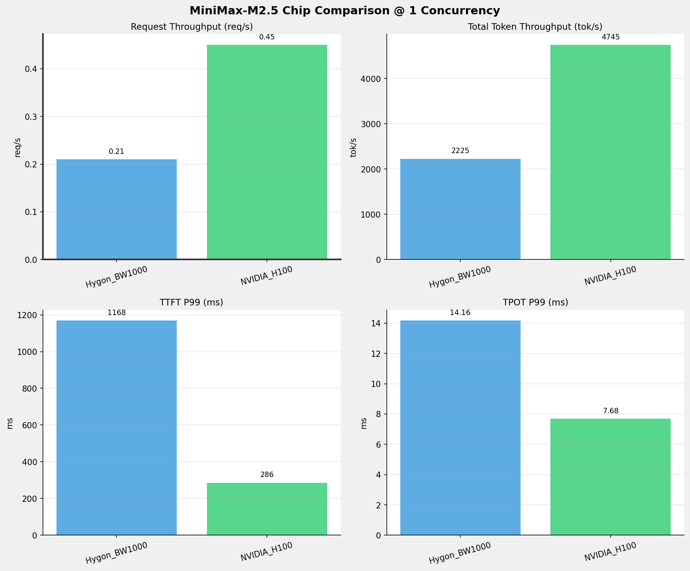
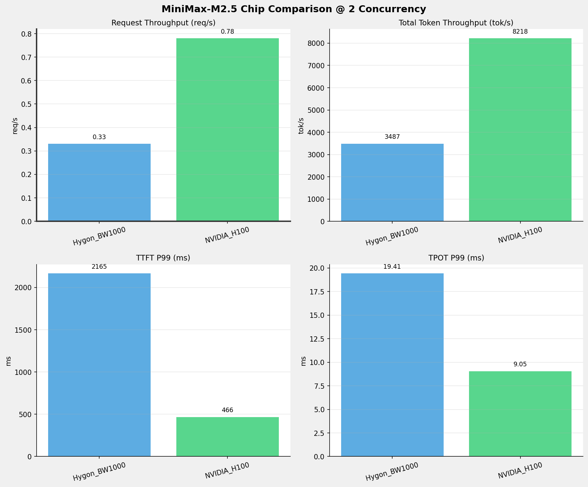
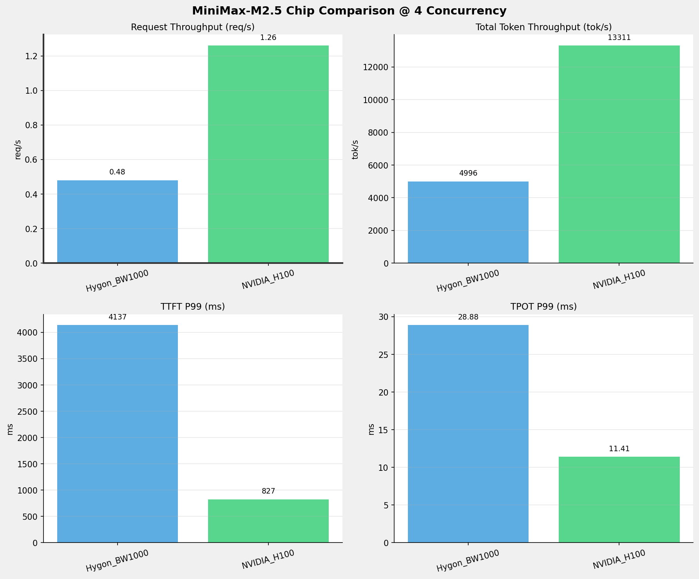
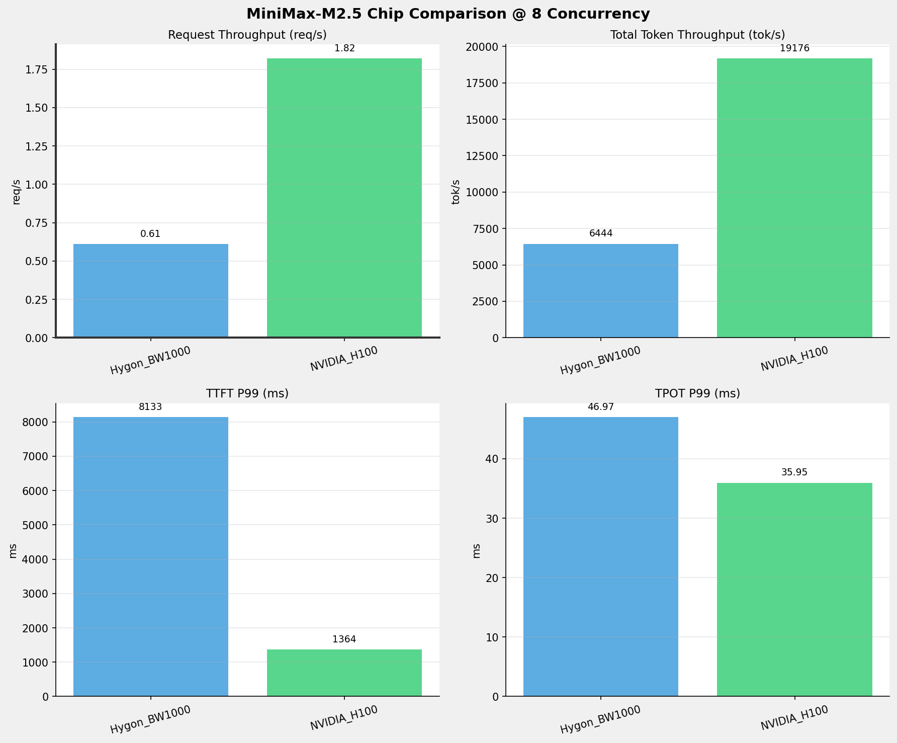
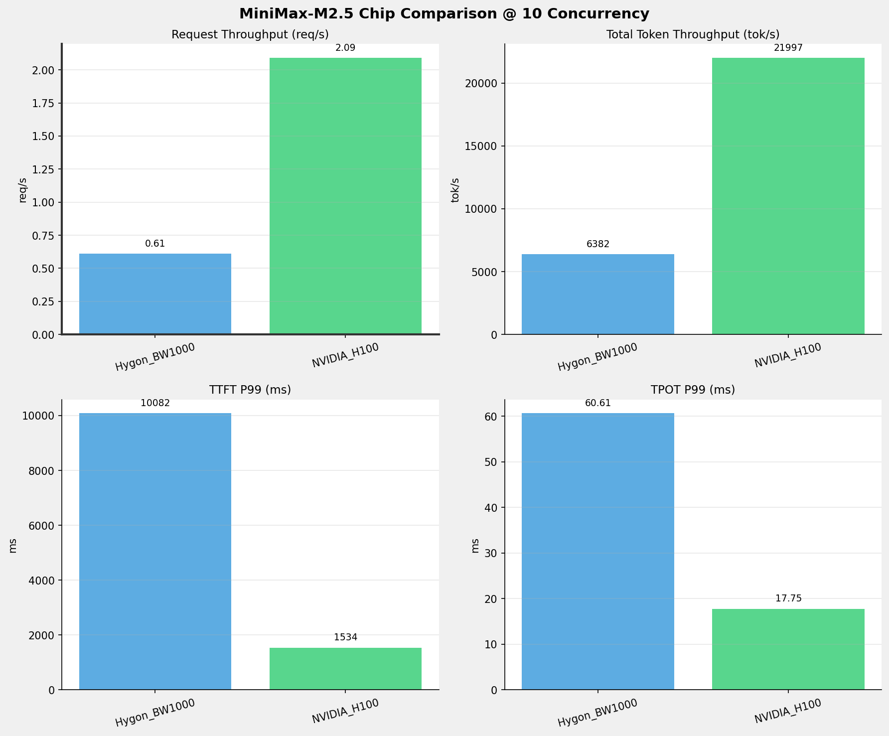
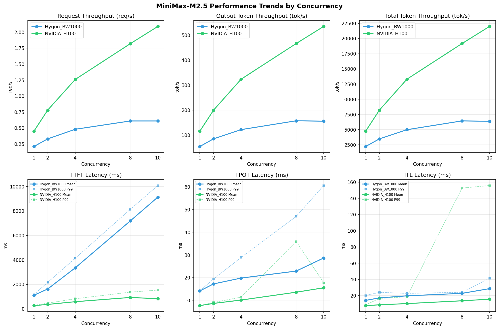

# MiniMax-M2.5模型在不同芯片下的benchmark基准测试报告

**测试日期：** 2026-05-06

---

## 测试场景
在固定请求数，输入上下文和输出上下文长度下，使用vllm bench serve工具对并发数逐级增加场景的性能基准验证。并对比同一模型在不同芯片环境上的性能指标。

**主要采集指标**：

| 指标                  | 单位         | 含义                                 |
|---------------------|------------|------------------------------------|
| TTFT                | ms         | Time To First Token，首 token 延迟     |
| TPOT                | ms/token   | Time Per Output Token，每 token 生成时间 |
| Throughput          | tokens/s   | 系统总吞吐                              |
| QPS                 | requests/s | 请求吞吐                               |
| P50/P95/P99 Latency | ms         | 延迟分位数                              |
    
## 📊 测试概览

| 项目            | 配置                                     | 备注  |
|---------------|----------------------------------------|-----|
| **数据集**       | random                                 |     |
| **并发数**       | 1, 2, 4, 8, 10, 16, 32, 64, 80, 128    |     |
| **总请求数**      | 320                                    |     |
| **请求输入上下文长度** | 10240（10k）                             |     |
| **请求输出上下文长度** | 256（0.25k）                             |     |
| **模型**        | MiniMax-M2.5                           |     |
| **被测芯片**      | Hygon_BW1000, NVIDIA_H100 |     |

---

## 🤖 芯片和模型配置信息

| 芯片名称                        | **Hygon_BW1000** | **NVIDIA_H100** |
|-----------------------------|-------------------------------|-------------------------------|
| **model_name** | MiniMax-M2.5-W8A8 | MiniMax-M2.5 |
| **quantization_config** | int-8 | FP16 |
| **model_size** | 215G | 215G |
| **max_position_embeddings** | 196608 | 196608 |
| **temperature** | N/A | N/A |
| **top_k** | N/A | N/A |
| **top_p** | N/A | N/A |
| **transformers_version** | 4.57.6 | 4.46.1 |
| **vllm_version** | 0.15.1+das.opt1.alpha.dtk2604 | 0.15.1 |
| **python_version** | 3.10.12 | 3.12.3 |

---

## 🤖 vLLM启动配置信息

| 参数名称                   | **Hygon_BW1000** | **NVIDIA_H100** |
|------------------------|------------------|------------------|
| model_name | MiniMax-M2.5-W8A8 | MiniMax-M2.5 |
| max-model-len | 196608 | 196608 |
| max-num-seqs | 64 | 10 |
| max-num-batched-tokens | default | 8192 |
| gpu-memory-utilization | 0.9 | 0.85 |
| dtype | bfloat16 | default |
| block_size | default | default |
| dp | 1 | 1 |
| tp | 8 | 8 |
| pp | 1 | 1 |
| enable-export-parallel | True | True |
| enable-auto-tool-choice | True | True |
| tool-call-parser | minimax_m2 | minimax_m2 |
| reasoning-parser | minimax_m2 (不生效) | minimax_m2 |

- **Hygon_BW1000**: 海光芯片专家并行配置
- **NVIDIA_H100**: 英伟达H100标准配置

---

## 📊 芯片性能对比柱状图

---

## 📈 性能趋势对比图 (所有芯片)

---

## 📈 各并发级别性能对比详情

### 1 并发

#### 服务基准结果

| 指标 | Hygon_BW1000 | NVIDIA_H100 |
|------|----------- | -----------|
| 成功请求数 | 320 | 320 |
| 失败请求数 | 0 | 0 |
| 测试持续时间 (s) | 1509.26 | 710.45 |
| 总输入 tokens | 3276800 | 3289280 |
| 总生成 tokens | 81920 | 81920 |
| **请求吞吐量 (req/s)** | 0.21 | **0.45** ⭐ |
| **输出 token 吞吐量 (tok/s)** | 54.28 | **115.31** ⭐ |
| 峰值输出 token 吞吐量 (tok/s) | 72.00 | **132.00** ⭐ |
| 峰值并发请求数 | 2.00 | 2.00 |
| **总 token 吞吐量 (tok/s)** | 2225.40 | **4745.14** ⭐ |

#### 首Token延迟 (TTFT)

| 指标 | Hygon_BW1000 | NVIDIA_H100 |
|------|----------- | -----------|
| 平均 TTFT (ms) | 1112.21 | **264.19** ⭐ |
| 中位 TTFT (ms) | 1111.97 | **264.45** ⭐ |
| P95 TTFT (ms) | 1127.95 | **275.76** ⭐ |
| P99 TTFT (ms) | 1168.49 | **286.01** ⭐ |

#### 每Token生成时间 (TPOT)

| 指标 | Hygon_BW1000 | NVIDIA_H100 |
|------|----------- | -----------|
| 平均 TPOT (ms) | 14.13 | **7.67** ⭐ |
| 中位 TPOT (ms) | 14.13 | **7.67** ⭐ |
| P95 TPOT (ms) | 14.15 | **7.68** ⭐ |
| P99 TPOT (ms) | 14.16 | **7.68** ⭐ |

#### Token间延迟 (ITL)

| 指标 | Hygon_BW1000 | NVIDIA_H100 |
|------|----------- | -----------|
| 平均 ITL (ms) | 14.14 | **7.70** ⭐ |
| 中位 ITL (ms) | 14.13 | **7.69** ⭐ |
| P95 ITL (ms) | 14.47 | **7.83** ⭐ |
| P99 ITL (ms) | 20.17 | **8.57** ⭐ |

---

### 2 并发

#### 服务基准结果

| 指标 | Hygon_BW1000 | NVIDIA_H100 |
|------|----------- | -----------|
| 成功请求数 | 320 | 320 |
| 失败请求数 | 0 | 0 |
| 测试持续时间 (s) | 963.16 | 410.23 |
| 总输入 tokens | 3276800 | 3289280 |
| 总生成 tokens | 81920 | 81920 |
| **请求吞吐量 (req/s)** | 0.33 | **0.78** ⭐ |
| **输出 token 吞吐量 (tok/s)** | 85.05 | **199.70** ⭐ |
| 峰值输出 token 吞吐量 (tok/s) | 136.00 | **244.00** ⭐ |
| 峰值并发请求数 | 4.00 | 4.00 |
| **总 token 吞吐量 (tok/s)** | 3487.19 | **8217.92** ⭐ |

#### 首Token延迟 (TTFT)

| 指标 | Hygon_BW1000 | NVIDIA_H100 |
|------|----------- | -----------|
| 平均 TTFT (ms) | 1623.93 | **360.79** ⭐ |
| 中位 TTFT (ms) | 1153.37 | **284.36** ⭐ |
| P95 TTFT (ms) | 2156.14 | **463.55** ⭐ |
| P99 TTFT (ms) | 2165.32 | **466.40** ⭐ |

#### 每Token生成时间 (TPOT)

| 指标 | Hygon_BW1000 | NVIDIA_H100 |
|------|----------- | -----------|
| 平均 TPOT (ms) | 17.24 | **8.64** ⭐ |
| 中位 TPOT (ms) | 17.15 | **8.65** ⭐ |
| P95 TPOT (ms) | 19.37 | **9.04** ⭐ |
| P99 TPOT (ms) | 19.41 | **9.05** ⭐ |

#### Token间延迟 (ITL)

| 指标 | Hygon_BW1000 | NVIDIA_H100 |
|------|----------- | -----------|
| 平均 ITL (ms) | 17.23 | **8.68** ⭐ |
| 中位 ITL (ms) | 15.20 | **8.28** ⭐ |
| P95 ITL (ms) | 16.13 | **8.46** ⭐ |
| P99 ITL (ms) | 24.07 | **16.54** ⭐ |

---

### 4 并发

#### 服务基准结果

| 指标 | Hygon_BW1000 | NVIDIA_H100 |
|------|----------- | -----------|
| 成功请求数 | 320 | 320 |
| 失败请求数 | 0 | 0 |
| 测试持续时间 (s) | 672.34 | 253.27 |
| 总输入 tokens | 3276800 | 3289280 |
| 总生成 tokens | 81920 | 81920 |
| **请求吞吐量 (req/s)** | 0.48 | **1.26** ⭐ |
| **输出 token 吞吐量 (tok/s)** | 121.84 | **323.45** ⭐ |
| 峰值输出 token 吞吐量 (tok/s) | 247.00 | **436.00** ⭐ |
| 峰值并发请求数 | 8.00 | 8.00 |
| **总 token 吞吐量 (tok/s)** | 4995.56 | **13310.92** ⭐ |

#### 首Token延迟 (TTFT)

| 指标 | Hygon_BW1000 | NVIDIA_H100 |
|------|----------- | -----------|
| 平均 TTFT (ms) | 3351.54 | **584.15** ⭐ |
| 中位 TTFT (ms) | 4115.92 | **582.44** ⭐ |
| P95 TTFT (ms) | 4129.04 | **821.10** ⭐ |
| P99 TTFT (ms) | 4137.09 | **826.89** ⭐ |

#### 每Token生成时间 (TPOT)

| 指标 | Hygon_BW1000 | NVIDIA_H100 |
|------|----------- | -----------|
| 平均 TPOT (ms) | 19.81 | **10.12** ⭐ |
| 中位 TPOT (ms) | 16.93 | **10.02** ⭐ |
| P95 TPOT (ms) | 28.78 | **11.39** ⭐ |
| P99 TPOT (ms) | 28.88 | **11.41** ⭐ |

#### Token间延迟 (ITL)

| 指标 | Hygon_BW1000 | NVIDIA_H100 |
|------|----------- | -----------|
| 平均 ITL (ms) | 19.76 | **10.20** ⭐ |
| 中位 ITL (ms) | 16.86 | **9.24** ⭐ |
| P95 ITL (ms) | 17.85 | **9.57** ⭐ |
| P99 ITL (ms) | 22.80 | **18.61** ⭐ |

---

### 8 并发

#### 服务基准结果

| 指标 | Hygon_BW1000 | NVIDIA_H100 |
|------|----------- | -----------|
| 成功请求数 | 320 | 320 |
| 失败请求数 | 0 | 0 |
| 测试持续时间 (s) | 521.20 | 175.80 |
| 总输入 tokens | 3276800 | 3289280 |
| 总生成 tokens | 81920 | 81920 |
| **请求吞吐量 (req/s)** | 0.61 | **1.82** ⭐ |
| **输出 token 吞吐量 (tok/s)** | 157.18 | **465.99** ⭐ |
| 峰值输出 token 吞吐量 (tok/s) | 424.00 | **760.00** ⭐ |
| 峰值并发请求数 | 16.00 | 16.00 |
| **总 token 吞吐量 (tok/s)** | 6444.25 | **19176.39** ⭐ |

#### 首Token延迟 (TTFT)

| 指标 | Hygon_BW1000 | NVIDIA_H100 |
|------|----------- | -----------|
| 平均 TTFT (ms) | 7190.37 | **931.63** ⭐ |
| 中位 TTFT (ms) | 8083.99 | **935.84** ⭐ |
| P95 TTFT (ms) | 8094.81 | **1245.61** ⭐ |
| P99 TTFT (ms) | 8133.44 | **1364.44** ⭐ |

#### 每Token生成时间 (TPOT)

| 指标 | Hygon_BW1000 | NVIDIA_H100 |
|------|----------- | -----------|
| 平均 TPOT (ms) | 22.89 | **13.58** ⭐ |
| 中位 TPOT (ms) | 19.52 | **13.24** ⭐ |
| P95 TPOT (ms) | 46.86 | **15.59** ⭐ |
| P99 TPOT (ms) | 46.97 | **35.95** ⭐ |

#### Token间延迟 (ITL)

| 指标 | Hygon_BW1000 | NVIDIA_H100 |
|------|----------- | -----------|
| 平均 ITL (ms) | 22.82 | **13.66** ⭐ |
| 中位 ITL (ms) | 19.56 | **10.60** ⭐ |
| P95 ITL (ms) | 20.53 | **11.15** ⭐ |
| P99 ITL (ms) | **24.15** ⭐ | 152.68 |

---

### 10 并发

#### 服务基准结果

| 指标 | Hygon_BW1000 | NVIDIA_H100 |
|------|----------- | -----------|
| 成功请求数 | 320 | 320 |
| 失败请求数 | 0 | 0 |
| 测试持续时间 (s) | 526.27 | 153.26 |
| 总输入 tokens | 3276800 | 3289280 |
| 总生成 tokens | 81920 | 81920 |
| **请求吞吐量 (req/s)** | 0.61 | **2.09** ⭐ |
| **输出 token 吞吐量 (tok/s)** | 155.66 | **534.52** ⭐ |
| 峰值输出 token 吞吐量 (tok/s) | 420.00 | **900.00** ⭐ |
| 峰值并发请求数 | 20.00 | 19.00 |
| **总 token 吞吐量 (tok/s)** | 6382.12 | **21996.95** ⭐ |

#### 首Token延迟 (TTFT)

| 指标 | Hygon_BW1000 | NVIDIA_H100 |
|------|----------- | -----------|
| 平均 TTFT (ms) | 9132.16 | **827.89** ⭐ |
| 中位 TTFT (ms) | 10065.22 | **875.37** ⭐ |
| P95 TTFT (ms) | 10076.09 | **1309.06** ⭐ |
| P99 TTFT (ms) | 10081.63 | **1534.23** ⭐ |

#### 每Token生成时间 (TPOT)

| 指标 | Hygon_BW1000 | NVIDIA_H100 |
|------|----------- | -----------|
| 平均 TPOT (ms) | 28.67 | **15.52** ⭐ |
| 中位 TPOT (ms) | 25.19 | **15.31** ⭐ |
| P95 TPOT (ms) | 60.21 | **17.71** ⭐ |
| P99 TPOT (ms) | 60.61 | **17.75** ⭐ |

#### Token间延迟 (ITL)

| 指标 | Hygon_BW1000 | NVIDIA_H100 |
|------|----------- | -----------|
| 平均 ITL (ms) | 28.65 | **15.60** ⭐ |
| 中位 ITL (ms) | 25.20 | **11.23** ⭐ |
| P95 ITL (ms) | 26.22 | **12.43** ⭐ |
| P99 ITL (ms) | **41.33** ⭐ | 155.84 |

---

---

## 📝 分析总结

### 1. 吞吐量性能对比

**请求吞吐量 (QPS)**: 在低并发(1-1)场景下，NVIDIA_H100 表现最佳，平均 0.45 req/s；
在中并发(2-2)场景下，NVIDIA_H100 表现最佳，平均 0.78 req/s；
在高并发(10-8)场景下，NVIDIA_H100 表现最佳，平均 1.72 req/s。

**Token吞吐量**: NVIDIA_H100 在8并发时达到最高吞吐量 21997 tok/s。

### 2. 首Token延迟 (TTFT) 对比

**低并发(1-1)**: NVIDIA_H100 TTFT最优，平均 286ms

**高并发(10-8)**: NVIDIA_H100 TTFT最优，平均 1242ms

### 3. Token生成时间 (TPOT) 对比

**最优表现**: NVIDIA_H100 在各并发下TPOT表现最佳，1并发时仅为 7.68ms

### 4. 综合评估

**综合性能**: NVIDIA_H100 在所有测试场景中综合表现最优

### 请求吞吐量 (Request Throughput) - 各并发最优

| Concurrency | Best Chip | Performance |
|-------------|-----------|-------------|
| 1 | NVIDIA_H100 | 0.45 req/s |
| 2 | NVIDIA_H100 | 0.78 req/s |
| 4 | NVIDIA_H100 | 1.26 req/s |
| 8 | NVIDIA_H100 | 1.82 req/s |
| 10 | NVIDIA_H100 | 2.09 req/s |

### Token总吞吐量 (Total Token Throughput) - 各并发最优

| Concurrency | Best Chip | Performance |
|-------------|-----------|-------------|
| 1 | NVIDIA_H100 | 4745 tok/s |
| 2 | NVIDIA_H100 | 8218 tok/s |
| 4 | NVIDIA_H100 | 13311 tok/s |
| 8 | NVIDIA_H100 | 19176 tok/s |
| 10 | NVIDIA_H100 | 21997 tok/s |

### TTFT P99 - 各并发最优

| Concurrency | Best Chip | Latency |
|-------------|-----------|---------|
| 1 | NVIDIA_H100 | 286.01 ms |
| 2 | NVIDIA_H100 | 466.40 ms |
| 4 | NVIDIA_H100 | 826.89 ms |
| 8 | NVIDIA_H100 | 1364.44 ms |
| 10 | NVIDIA_H100 | 1534.23 ms |

### TPOT P99 - 各并发最优

| Concurrency | Best Chip | Latency |
|-------------|-----------|---------|
| 1 | NVIDIA_H100 | 7.68 ms |
| 2 | NVIDIA_H100 | 9.05 ms |
| 4 | NVIDIA_H100 | 11.41 ms |
| 8 | NVIDIA_H100 | 35.95 ms |
| 10 | NVIDIA_H100 | 17.75 ms |

---

*报告生成时间: 2026-05-06*

