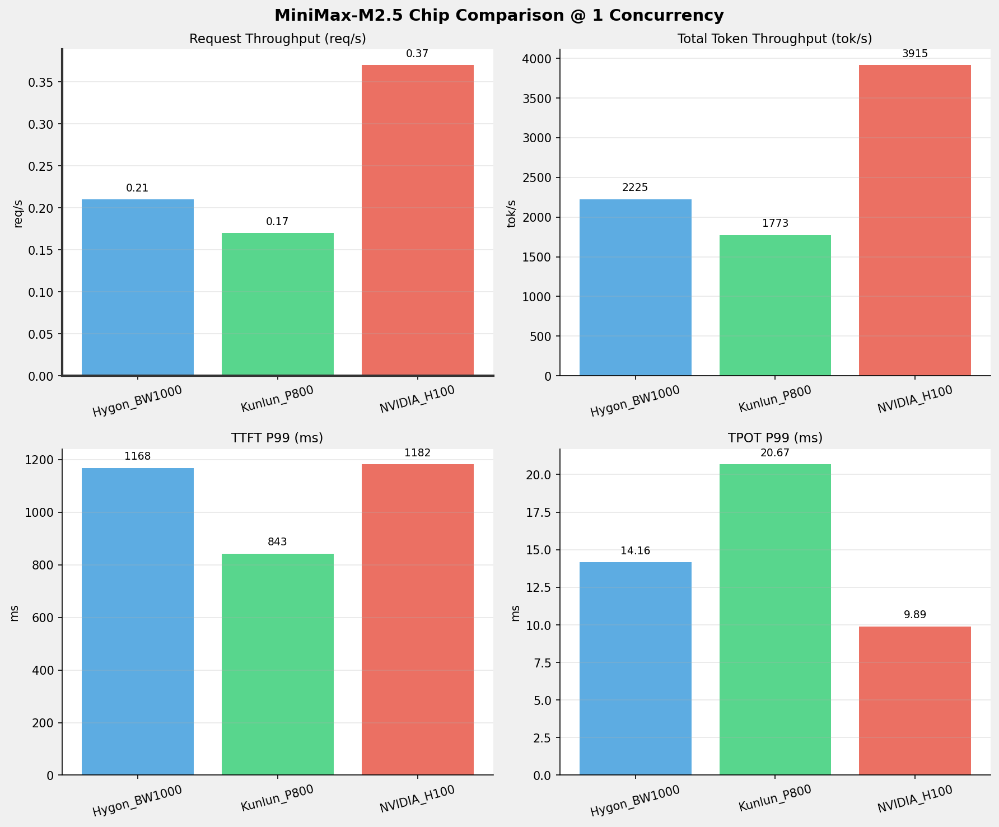
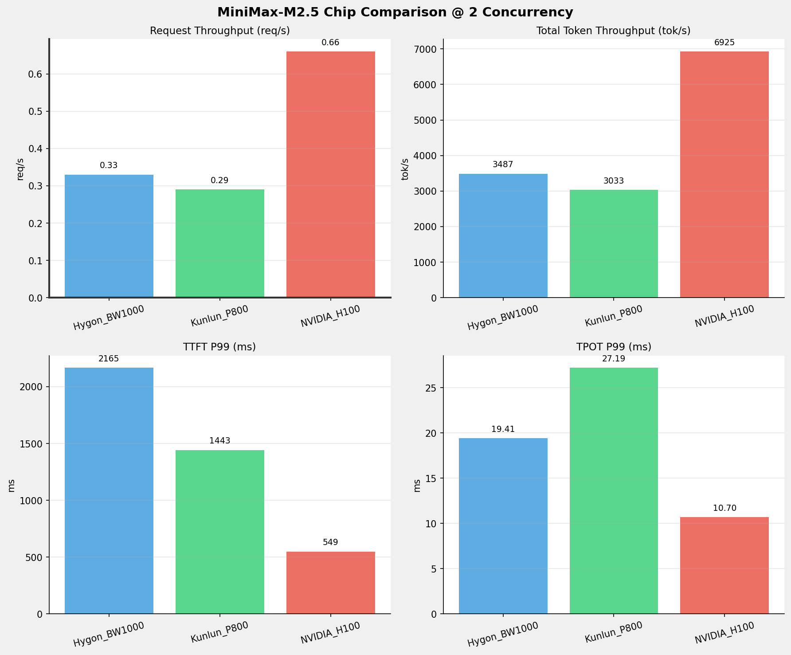
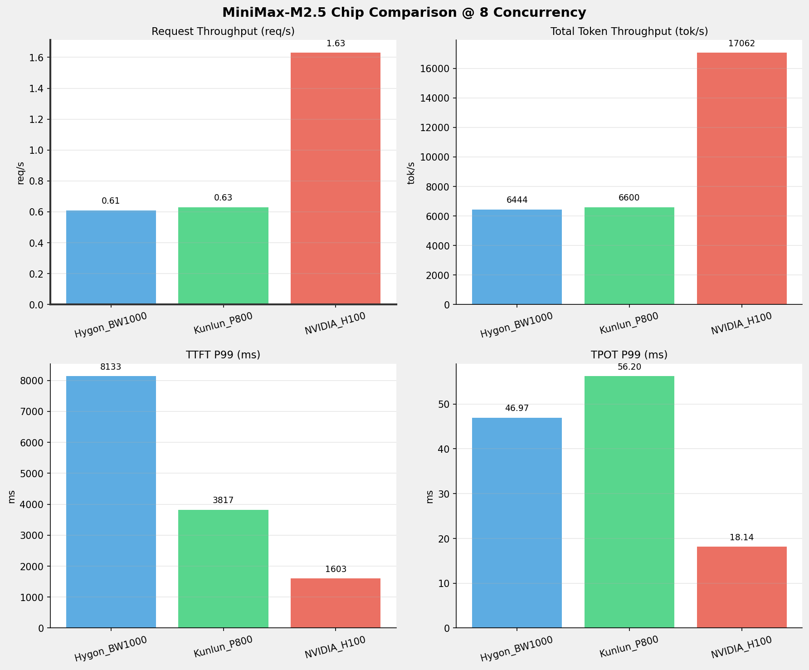
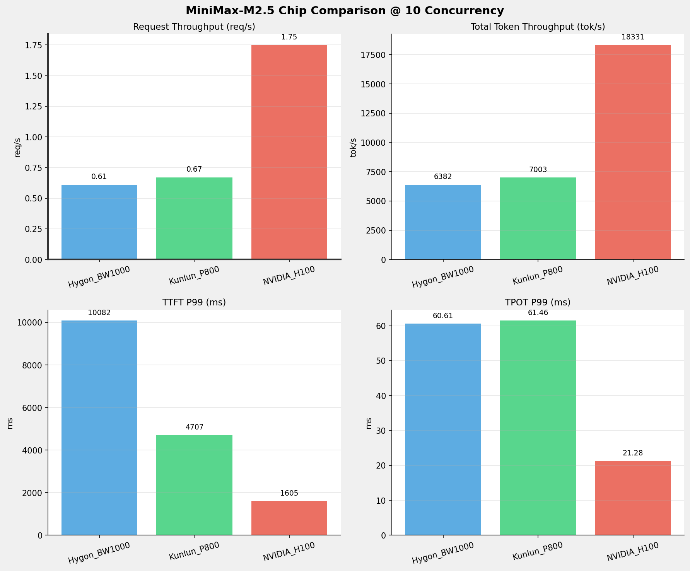
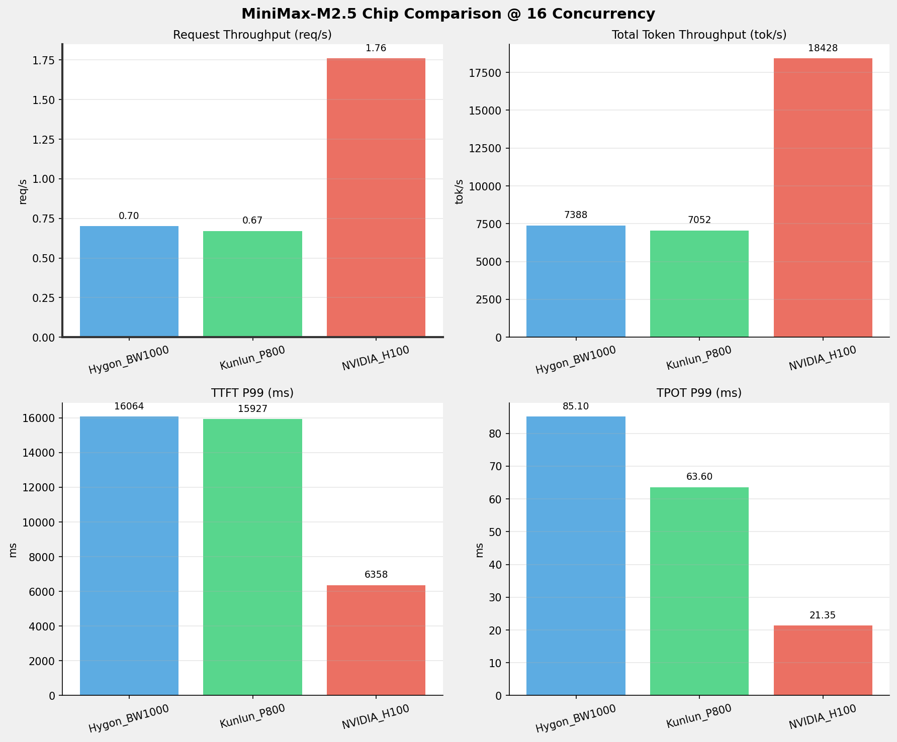
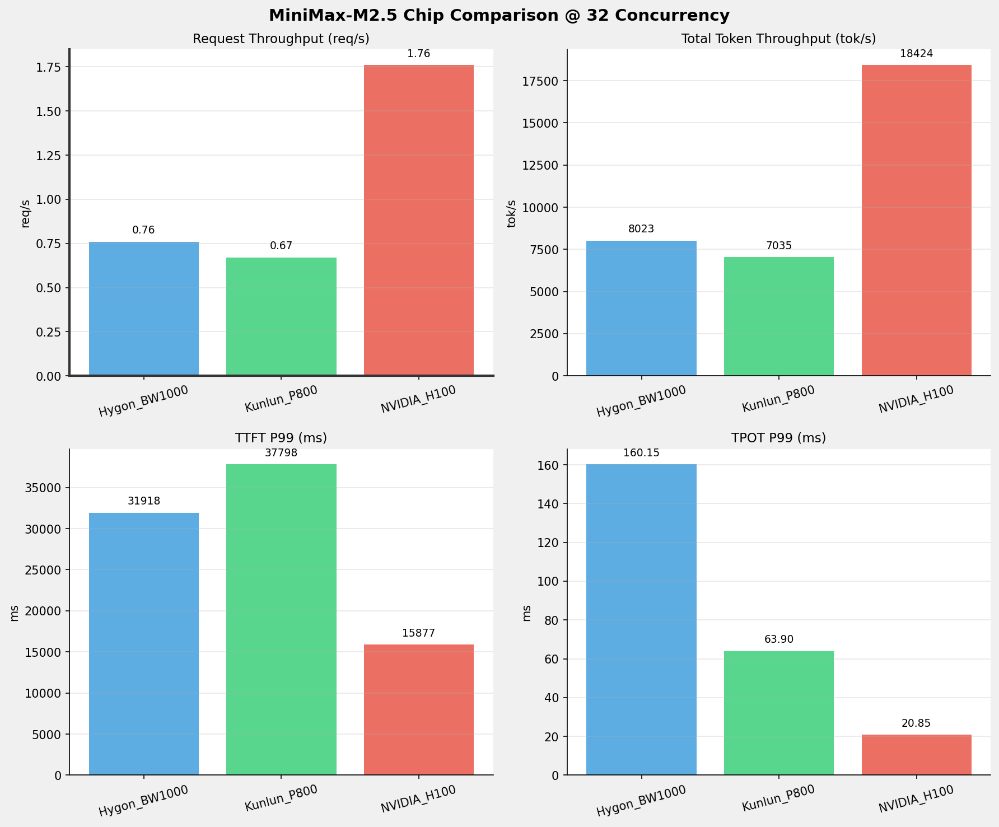
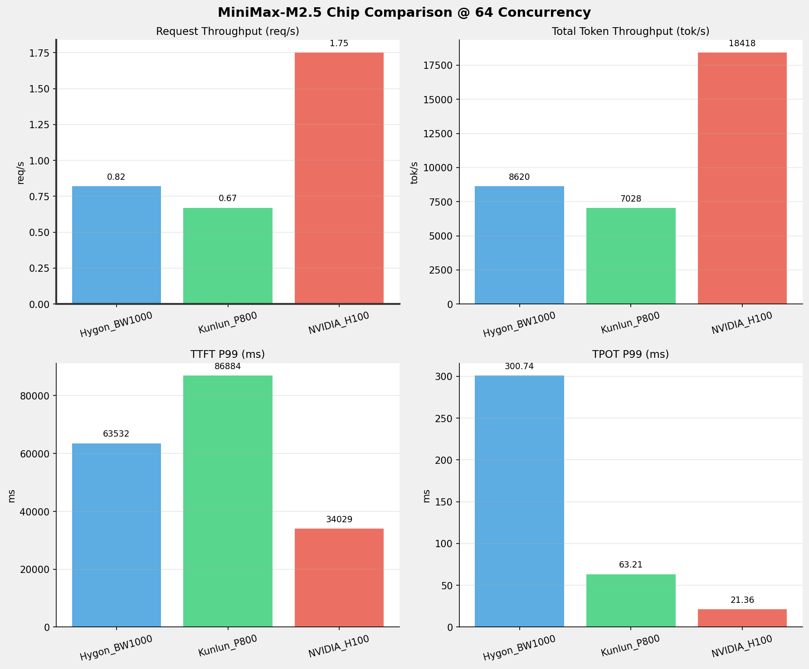
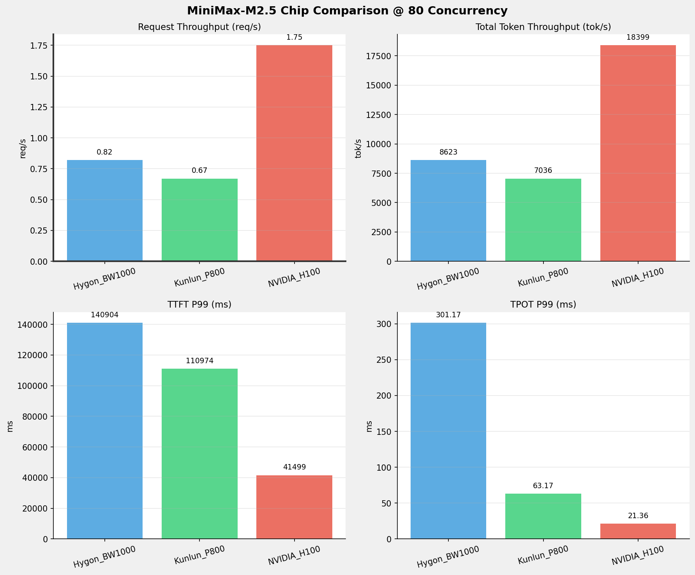
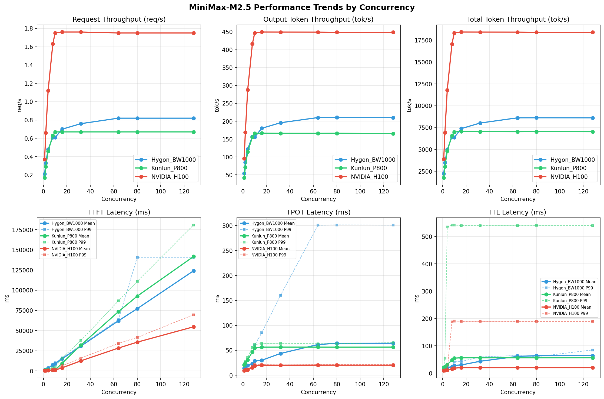

# MiniMax-M2.5模型在不同芯片下的benchmark基准测试报告

**测试日期：** 2026-04-13

---

## 测试场景
在固定请求数，输入上下文和输出上下文长度下，使用vllm bench serve工具对并发数逐级增加场景的性能基准验证。并对比同一模型在不同芯片环境上的性能指标。

**主要采集指标**：

| 指标                  | 单位         | 含义                                 |
|---------------------|------------|------------------------------------|
| TTFT                | ms         | Time To First Token，首 token 延迟     |
| TPOT                | ms/token   | Time Per Output Token，每 token 生成时间 |
| Throughput          | tokens/s   | 系统总吞吐                              |
| QPS                 | requests/s | 请求吞吐                               |
| P50/P95/P99 Latency | ms         | 延迟分位数                              |
    
## 📊 测试概览

| 项目            | 配置                                     | 备注  |
|---------------|----------------------------------------|-----|
| **数据集**       | random                                 |     |
| **并发数**       | 1, 2, 4, 8, 10, 16, 32, 64, 80, 128    |     |
| **总请求数**      | 320                                    |     |
| **请求输入上下文长度** | 10240（10k）                             |     |
| **请求输出上下文长度** | 256（0.25k）                             |     |
| **模型**        | MiniMax-M2.5                           |     |
| **被测芯片**      | Hygon_BW1000, Kunlun_P800, NVIDIA_H100 |     |

---

## 🤖 芯片和模型配置信息

| 芯片名称                        | **Hygon_BW1000** | **Kunlun_P800** | **NVIDIA_H100** |
|-----------------------------|-------------------------------|-------------------------------|-------------------------------|
| **model_name** | MiniMax-M2.5-W8A8 | MiniMax-M2.5-W8A8-INT8-Dynamic | MiniMax-M2.5 |
| **quantization_config** | int-8 | int-8 | FP16 |
| **model_size** | 215G | 215G | 215G |
| **max_position_embeddings** | 196608 | 196608 | 196608 |
| **temperature** | N/A | 1.0 | N/A |
| **top_k** | N/A | 40 | N/A |
| **top_p** | N/A | 0.95 | N/A |
| **transformers_version** | 4.57.6 | 4.46.1 | 4.46.1 |
| **vllm_version** | 0.15.1+das.opt1.alpha.dtk2604 | 0.11.0 | 0.15.1 |
| **python_version** | 3.10.12 | 3.10.15 | 3.12.3 |

---

## 🤖 vLLM启动配置信息

| 参数名称                   | **Hygon_BW1000** | **Kunlun_P800** | **NVIDIA_H100** |
|------------------------|------------------|------------------|------------------|
| model_name | MiniMax-M2.5-W8A8 | MiniMax-M2.5-W8A8-INT8-Dynamic | MiniMax-M2.5 |
| max-model-len | 196608 | 196608 | 196608 |
| max-num-seqs | 64 | 64 | 10 |
| max-num-batched-tokens | default | 8192 | 8192 |
| gpu-memory-utilization | 0.9 | 0.95 | 0.85 |
| dtype | bfloat16 | auto | default |
| block_size | default | 128 | default |
| dp | 1 | 1 | 1 |
| tp | 8 | 8 | 8 |
| pp | 1 | 1 | 1 |
| enable-export-parallel | True | False | True |
| enable-auto-tool-choice | True | True | True |
| tool-call-parser | minimax_m2 | minimax_m2 | minimax_m2 |
| reasoning-parser | minimax_m2 (不生效) | minimax_m2 (不生效) | minimax_m2 |

- **Hygon_BW1000**: 海光芯片专家并行配置
- **Kunlun_P800**: 昆仑芯不启用专家并行避免通信问题
- **NVIDIA_H100**: 英伟达H100标准配置

---

## 📈 各并发级别性能对比

### 1 并发

#### 服务基准结果

| 指标 | Hygon_BW1000 | Kunlun_P800 | NVIDIA_H100 |
|------|----------- | ----------- | -----------|
| 成功请求数 | 320 | 320 | 320 |
| 失败请求数 | 0 | 0 | 0 |
| 测试持续时间 (s) | 1509.26 | 1892.60 | 857.88 |
| 总输入 tokens | 3276800 | 3276748 | 3276800 |
| 总生成 tokens | 81920 | 79410 | 81920 |
| **请求吞吐量 (req/s)** | 0.21 | 0.17 | **0.37** ⭐ |
| **输出 token 吞吐量 (tok/s)** | 54.28 | 41.96 | **95.49** ⭐ |
| 峰值输出 token 吞吐量 (tok/s) | 72.00 | 50.00 | **110.00** ⭐ |
| 峰值并发请求数 | 2.00 | 2.00 | 2.00 |
| **总 token 吞吐量 (tok/s)** | 2225.40 | 1773.30 | **3915.14** ⭐ |

#### 首Token延迟 (TTFT)

| 指标 | Hygon_BW1000 | Kunlun_P800 | NVIDIA_H100 |
|------|----------- | ----------- | -----------|
| 平均 TTFT (ms) | 1112.21 | 817.94 | **321.42** ⭐ |
| 中位 TTFT (ms) | 1111.97 | 824.23 | **306.62** ⭐ |
| P95 TTFT (ms) | 1127.95 | 835.94 | **313.59** ⭐ |
| P99 TTFT (ms) | 1168.49 | **842.86** ⭐ | 1181.54 |

#### 每Token生成时间 (TPOT)

| 指标 | Hygon_BW1000 | Kunlun_P800 | NVIDIA_H100 |
|------|----------- | ----------- | -----------|
| 平均 TPOT (ms) | 14.13 | 20.62 | **9.25** ⭐ |
| 中位 TPOT (ms) | 14.13 | 20.62 | **9.23** ⭐ |
| P95 TPOT (ms) | 14.15 | 20.65 | **9.23** ⭐ |
| P99 TPOT (ms) | 14.16 | 20.67 | **9.89** ⭐ |

#### Token间延迟 (ITL)

| 指标 | Hygon_BW1000 | Kunlun_P800 | NVIDIA_H100 |
|------|----------- | ----------- | -----------|
| 平均 ITL (ms) | 14.14 | 20.56 | **9.23** ⭐ |
| 中位 ITL (ms) | 14.13 | 20.60 | **9.22** ⭐ |
| P95 ITL (ms) | 14.47 | 20.77 | **9.41** ⭐ |
| P99 ITL (ms) | 20.17 | 21.22 | **9.90** ⭐ |

---

### 2 并发

#### 服务基准结果

| 指标 | Hygon_BW1000 | Kunlun_P800 | NVIDIA_H100 |
|------|----------- | ----------- | -----------|
| 成功请求数 | 320 | 320 | 320 |
| 失败请求数 | 0 | 0 | 0 |
| 测试持续时间 (s) | 963.16 | 1106.64 | 485.01 |
| 总输入 tokens | 3276800 | 3276748 | 3276800 |
| 总生成 tokens | 81920 | 79281 | 81920 |
| **请求吞吐量 (req/s)** | 0.33 | 0.29 | **0.66** ⭐ |
| **输出 token 吞吐量 (tok/s)** | 85.05 | 71.64 | **168.90** ⭐ |
| 峰值输出 token 吞吐量 (tok/s) | 136.00 | 93.00 | **207.00** ⭐ |
| 峰值并发请求数 | 4.00 | 4.00 | 4.00 |
| **总 token 吞吐量 (tok/s)** | 3487.19 | 3032.63 | **6925.05** ⭐ |

#### 首Token延迟 (TTFT)

| 指标 | Hygon_BW1000 | Kunlun_P800 | NVIDIA_H100 |
|------|----------- | ----------- | -----------|
| 平均 TTFT (ms) | 1623.93 | 874.08 | **427.60** ⭐ |
| 中位 TTFT (ms) | 1153.37 | 833.51 | **418.60** ⭐ |
| P95 TTFT (ms) | 2156.14 | 1182.06 | **545.11** ⭐ |
| P99 TTFT (ms) | 2165.32 | 1442.65 | **549.04** ⭐ |

#### 每Token生成时间 (TPOT)

| 指标 | Hygon_BW1000 | Kunlun_P800 | NVIDIA_H100 |
|------|----------- | ----------- | -----------|
| 平均 TPOT (ms) | 17.24 | 24.43 | **10.21** ⭐ |
| 中位 TPOT (ms) | 17.15 | 24.54 | **10.22** ⭐ |
| P95 TPOT (ms) | 19.37 | 25.69 | **10.69** ⭐ |
| P99 TPOT (ms) | 19.41 | 27.19 | **10.70** ⭐ |

#### Token间延迟 (ITL)

| 指标 | Hygon_BW1000 | Kunlun_P800 | NVIDIA_H100 |
|------|----------- | ----------- | -----------|
| 平均 ITL (ms) | 17.23 | 24.46 | **10.18** ⭐ |
| 中位 ITL (ms) | 15.20 | 21.87 | **9.75** ⭐ |
| P95 ITL (ms) | 16.13 | 22.10 | **9.91** ⭐ |
| P99 ITL (ms) | 24.07 | 55.05 | **10.48** ⭐ |

---

### 4 并发

#### 服务基准结果

| 指标 | Hygon_BW1000 | Kunlun_P800 | NVIDIA_H100 |
|------|----------- | ----------- | -----------|
| 成功请求数 | 320 | 320 | 320 |
| 失败请求数 | 0 | 0 | 0 |
| 测试持续时间 (s) | 672.34 | 696.02 | 284.59 |
| 总输入 tokens | 3276800 | 3276748 | 3276800 |
| 总生成 tokens | 81920 | 79960 | 81920 |
| **请求吞吐量 (req/s)** | 0.48 | 0.46 | **1.12** ⭐ |
| **输出 token 吞吐量 (tok/s)** | 121.84 | 114.88 | **287.86** ⭐ |
| 峰值输出 token 吞吐量 (tok/s) | 247.00 | 173.00 | **401.00** ⭐ |
| 峰值并发请求数 | 8.00 | 7.00 | 8.00 |
| **总 token 吞吐量 (tok/s)** | 4995.56 | 4822.70 | **11802.07** ⭐ |

#### 首Token延迟 (TTFT)

| 指标 | Hygon_BW1000 | Kunlun_P800 | NVIDIA_H100 |
|------|----------- | ----------- | -----------|
| 平均 TTFT (ms) | 3351.54 | 930.47 | **694.79** ⭐ |
| 中位 TTFT (ms) | 4115.92 | 843.28 | **666.62** ⭐ |
| P95 TTFT (ms) | 4129.04 | 1458.49 | **992.60** ⭐ |
| P99 TTFT (ms) | 4137.09 | 2064.95 | **995.93** ⭐ |

#### 每Token生成时间 (TPOT)

| 指标 | Hygon_BW1000 | Kunlun_P800 | NVIDIA_H100 |
|------|----------- | ----------- | -----------|
| 平均 TPOT (ms) | 19.81 | 31.10 | **11.22** ⭐ |
| 中位 TPOT (ms) | 16.93 | 31.38 | **11.32** ⭐ |
| P95 TPOT (ms) | 28.78 | 34.01 | **12.78** ⭐ |
| P99 TPOT (ms) | 28.88 | 35.52 | **12.80** ⭐ |

#### Token间延迟 (ITL)

| 指标 | Hygon_BW1000 | Kunlun_P800 | NVIDIA_H100 |
|------|----------- | ----------- | -----------|
| 平均 ITL (ms) | 19.76 | 31.29 | **11.19** ⭐ |
| 中位 ITL (ms) | 16.86 | 23.38 | **10.08** ⭐ |
| P95 ITL (ms) | 17.85 | 24.17 | **10.33** ⭐ |
| P99 ITL (ms) | 22.80 | 534.67 | **11.28** ⭐ |

---

### 8 并发

#### 服务基准结果

| 指标 | Hygon_BW1000 | Kunlun_P800 | NVIDIA_H100 |
|------|----------- | ----------- | -----------|
| 成功请求数 | 320 | 320 | 320 |
| 失败请求数 | 0 | 0 | 0 |
| 测试持续时间 (s) | 521.20 | 508.44 | 196.85 |
| 总输入 tokens | 3276800 | 3276748 | 3276800 |
| 总生成 tokens | 81920 | 78888 | 81920 |
| **请求吞吐量 (req/s)** | 0.61 | 0.63 | **1.63** ⭐ |
| **输出 token 吞吐量 (tok/s)** | 157.18 | 155.16 | **416.15** ⭐ |
| 峰值输出 token 吞吐量 (tok/s) | 424.00 | 280.00 | **680.00** ⭐ |
| 峰值并发请求数 | 16.00 | 13.00 | 16.00 |
| **总 token 吞吐量 (tok/s)** | 6444.25 | 6599.86 | **17062.16** ⭐ |

#### 首Token延迟 (TTFT)

| 指标 | Hygon_BW1000 | Kunlun_P800 | NVIDIA_H100 |
|------|----------- | ----------- | -----------|
| 平均 TTFT (ms) | 7190.37 | 1140.45 | **961.02** ⭐ |
| 中位 TTFT (ms) | 8083.99 | **847.01** ⭐ | 1023.59 |
| P95 TTFT (ms) | 8094.81 | 2055.50 | **1474.23** ⭐ |
| P99 TTFT (ms) | 8133.44 | 3816.59 | **1603.43** ⭐ |

#### 每Token生成时间 (TPOT)

| 指标 | Hygon_BW1000 | Kunlun_P800 | NVIDIA_H100 |
|------|----------- | ----------- | -----------|
| 平均 TPOT (ms) | 22.89 | 46.86 | **15.53** ⭐ |
| 中位 TPOT (ms) | 19.52 | 47.37 | **15.30** ⭐ |
| P95 TPOT (ms) | 46.86 | 50.43 | **18.09** ⭐ |
| P99 TPOT (ms) | 46.97 | 56.20 | **18.14** ⭐ |

#### Token间延迟 (ITL)

| 指标 | Hygon_BW1000 | Kunlun_P800 | NVIDIA_H100 |
|------|----------- | ----------- | -----------|
| 平均 ITL (ms) | 22.82 | 47.59 | **15.48** ⭐ |
| 中位 ITL (ms) | 19.56 | 29.16 | **11.93** ⭐ |
| P95 ITL (ms) | 20.53 | 60.47 | **12.35** ⭐ |
| P99 ITL (ms) | **24.15** ⭐ | 541.52 | 187.51 |

---

### 10 并发

#### 服务基准结果

| 指标 | Hygon_BW1000 | Kunlun_P800 | NVIDIA_H100 |
|------|----------- | ----------- | -----------|
| 成功请求数 | 320 | 320 | 320 |
| 失败请求数 | 0 | 0 | 0 |
| 测试持续时间 (s) | 526.27 | 479.27 | 183.23 |
| 总输入 tokens | 3276800 | 3276748 | 3276800 |
| 总生成 tokens | 81920 | 79598 | 81920 |
| **请求吞吐量 (req/s)** | 0.61 | 0.67 | **1.75** ⭐ |
| **输出 token 吞吐量 (tok/s)** | 155.66 | 166.08 | **447.09** ⭐ |
| 峰值输出 token 吞吐量 (tok/s) | 420.00 | 311.00 | **759.00** ⭐ |
| 峰值并发请求数 | 20.00 | 15.00 | 18.00 |
| **总 token 吞吐量 (tok/s)** | 6382.12 | 7003.02 | **18330.76** ⭐ |

#### 首Token延迟 (TTFT)

| 指标 | Hygon_BW1000 | Kunlun_P800 | NVIDIA_H100 |
|------|----------- | ----------- | -----------|
| 平均 TTFT (ms) | 9132.16 | 1232.27 | **1012.23** ⭐ |
| 中位 TTFT (ms) | 10065.22 | **859.67** ⭐ | 1139.42 |
| P95 TTFT (ms) | 10076.09 | 2782.24 | **1398.62** ⭐ |
| P99 TTFT (ms) | 10081.63 | 4707.14 | **1604.56** ⭐ |

#### 每Token生成时间 (TPOT)

| 指标 | Hygon_BW1000 | Kunlun_P800 | NVIDIA_H100 |
|------|----------- | ----------- | -----------|
| 平均 TPOT (ms) | 28.67 | 55.09 | **18.48** ⭐ |
| 中位 TPOT (ms) | 25.19 | 56.07 | **17.95** ⭐ |
| P95 TPOT (ms) | 60.21 | 59.03 | **21.21** ⭐ |
| P99 TPOT (ms) | 60.61 | 61.46 | **21.28** ⭐ |

#### Token间延迟 (ITL)

| 指标 | Hygon_BW1000 | Kunlun_P800 | NVIDIA_H100 |
|------|----------- | ----------- | -----------|
| 平均 ITL (ms) | 28.65 | 54.93 | **18.42** ⭐ |
| 中位 ITL (ms) | 25.20 | 32.95 | **13.38** ⭐ |
| P95 ITL (ms) | 26.22 | 188.79 | **14.18** ⭐ |
| P99 ITL (ms) | **41.33** ⭐ | 542.02 | 190.68 |

---

### 16 并发

#### 服务基准结果

| 指标 | Hygon_BW1000 | Kunlun_P800 | NVIDIA_H100 |
|------|----------- | ----------- | -----------|
| 成功请求数 | 320 | 320 | 320 |
| 失败请求数 | 0 | 0 | 0 |
| 测试持续时间 (s) | 454.63 | 475.87 | 182.26 |
| 总输入 tokens | 3276800 | 3276748 | 3276800 |
| 总生成 tokens | 81920 | 79221 | 81920 |
| **请求吞吐量 (req/s)** | 0.70 | 0.67 | **1.76** ⭐ |
| **输出 token 吞吐量 (tok/s)** | 180.19 | 166.48 | **449.46** ⭐ |
| 峰值输出 token 吞吐量 (tok/s) | 656.00 | 311.00 | **760.00** ⭐ |
| 峰值并发请求数 | 32.00 | 18.00 | 22.00 |
| **总 token 吞吐量 (tok/s)** | 7387.79 | 7052.24 | **18427.76** ⭐ |

#### 首Token延迟 (TTFT)

| 指标 | Hygon_BW1000 | Kunlun_P800 | NVIDIA_H100 |
|------|----------- | ----------- | -----------|
| 平均 TTFT (ms) | 15052.83 | 9584.38 | **3864.33** ⭐ |
| 中位 TTFT (ms) | 16028.53 | 9886.81 | **5018.01** ⭐ |
| P95 TTFT (ms) | 16056.37 | 11728.12 | **5362.36** ⭐ |
| P99 TTFT (ms) | 16063.93 | 15927.16 | **6358.44** ⭐ |

#### 每Token生成时间 (TPOT)

| 指标 | Hygon_BW1000 | Kunlun_P800 | NVIDIA_H100 |
|------|----------- | ----------- | -----------|
| 平均 TPOT (ms) | 30.10 | 56.41 | **20.24** ⭐ |
| 中位 TPOT (ms) | 26.43 | 56.34 | **20.22** ⭐ |
| P95 TPOT (ms) | 84.67 | 59.38 | **21.28** ⭐ |
| P99 TPOT (ms) | 85.10 | 63.60 | **21.35** ⭐ |

#### Token间延迟 (ITL)

| 指标 | Hygon_BW1000 | Kunlun_P800 | NVIDIA_H100 |
|------|----------- | ----------- | -----------|
| 平均 ITL (ms) | 30.01 | 56.28 | **20.19** ⭐ |
| 中位 ITL (ms) | 26.59 | 32.98 | **13.38** ⭐ |
| P95 ITL (ms) | 30.25 | 188.87 | **15.08** ⭐ |
| P99 ITL (ms) | **42.55** ⭐ | 540.05 | 189.48 |

---

### 32 并发

#### 服务基准结果

| 指标 | Hygon_BW1000 | Kunlun_P800 | NVIDIA_H100 |
|------|----------- | ----------- | -----------|
| 成功请求数 | 320 | 320 | 320 |
| 失败请求数 | 0 | 0 | 0 |
| 测试持续时间 (s) | 418.62 | 477.04 | 182.30 |
| 总输入 tokens | 3276800 | 3276748 | 3276800 |
| 总生成 tokens | 81920 | 79281 | 81920 |
| **请求吞吐量 (req/s)** | 0.76 | 0.67 | **1.76** ⭐ |
| **输出 token 吞吐量 (tok/s)** | 195.69 | 166.19 | **449.36** ⭐ |
| 峰值输出 token 吞吐量 (tok/s) | **864.00** ⭐ | 311.00 | 760.00 |
| 峰值并发请求数 | 64.00 | 34.00 | 38.00 |
| **总 token 吞吐量 (tok/s)** | 8023.25 | 7035.16 | **18423.63** ⭐ |

#### 首Token延迟 (TTFT)

| 指标 | Hygon_BW1000 | Kunlun_P800 | NVIDIA_H100 |
|------|----------- | ----------- | -----------|
| 平均 TTFT (ms) | 30731.82 | 32040.77 | **12498.42** ⭐ |
| 中位 TTFT (ms) | 31855.15 | 32900.58 | **12483.01** ⭐ |
| P95 TTFT (ms) | 31914.75 | 36489.30 | **15827.75** ⭐ |
| P99 TTFT (ms) | 31917.86 | 37797.90 | **15877.21** ⭐ |

#### 每Token生成时间 (TPOT)

| 指标 | Hygon_BW1000 | Kunlun_P800 | NVIDIA_H100 |
|------|----------- | ----------- | -----------|
| 平均 TPOT (ms) | 43.62 | 56.49 | **20.18** ⭐ |
| 中位 TPOT (ms) | 39.56 | 56.33 | **20.21** ⭐ |
| P95 TPOT (ms) | 39.90 | 60.89 | **20.81** ⭐ |
| P99 TPOT (ms) | 160.15 | 63.90 | **20.85** ⭐ |

#### Token间延迟 (ITL)

| 指标 | Hygon_BW1000 | Kunlun_P800 | NVIDIA_H100 |
|------|----------- | ----------- | -----------|
| 平均 ITL (ms) | 43.45 | 56.27 | **20.12** ⭐ |
| 中位 ITL (ms) | 39.75 | 32.96 | **13.40** ⭐ |
| P95 ITL (ms) | 48.15 | 188.78 | **14.81** ⭐ |
| P99 ITL (ms) | **59.25** ⭐ | 540.00 | 189.42 |

---

### 64 并发

#### 服务基准结果

| 指标 | Hygon_BW1000 | Kunlun_P800 | NVIDIA_H100 |
|------|----------- | ----------- | -----------|
| 成功请求数 | 320 | 320 | 320 |
| 失败请求数 | 0 | 0 | 0 |
| 测试持续时间 (s) | 389.63 | 477.53 | 182.36 |
| 总输入 tokens | 3276800 | 3276748 | 3276800 |
| 总生成 tokens | 81920 | 79358 | 81920 |
| **请求吞吐量 (req/s)** | 0.82 | 0.67 | **1.75** ⭐ |
| **输出 token 吞吐量 (tok/s)** | 210.25 | 166.18 | **449.23** ⭐ |
| 峰值输出 token 吞吐量 (tok/s) | **1279.00** ⭐ | 310.00 | 760.00 |
| 峰值并发请求数 | 128.00 | 67.00 | 70.00 |
| **总 token 吞吐量 (tok/s)** | 8620.30 | 7027.99 | **18418.46** ⭐ |

#### 首Token延迟 (TTFT)

| 指标 | Hygon_BW1000 | Kunlun_P800 | NVIDIA_H100 |
|------|----------- | ----------- | -----------|
| 平均 TTFT (ms) | 62196.04 | 73483.64 | **28345.01** ⭐ |
| 中位 TTFT (ms) | 63499.67 | 80355.19 | **29997.18** ⭐ |
| P95 TTFT (ms) | 63528.23 | 83007.06 | **33326.91** ⭐ |
| P99 TTFT (ms) | 63531.55 | 86884.30 | **34028.75** ⭐ |

#### 每Token生成时间 (TPOT)

| 指标 | Hygon_BW1000 | Kunlun_P800 | NVIDIA_H100 |
|------|----------- | ----------- | -----------|
| 平均 TPOT (ms) | 61.63 | 56.43 | **20.25** ⭐ |
| 中位 TPOT (ms) | 57.08 | 56.32 | **20.21** ⭐ |
| P95 TPOT (ms) | 57.35 | 61.17 | **21.30** ⭐ |
| P99 TPOT (ms) | 300.74 | 63.21 | **21.36** ⭐ |

#### Token间延迟 (ITL)

| 指标 | Hygon_BW1000 | Kunlun_P800 | NVIDIA_H100 |
|------|----------- | ----------- | -----------|
| 平均 ITL (ms) | 61.39 | 56.24 | **20.19** ⭐ |
| 中位 ITL (ms) | 57.35 | 32.93 | **13.38** ⭐ |
| P95 ITL (ms) | 59.07 | 188.83 | **15.08** ⭐ |
| P99 ITL (ms) | **64.72** ⭐ | 540.19 | 189.46 |

---

### 80 并发

#### 服务基准结果

| 指标 | Hygon_BW1000 | Kunlun_P800 | NVIDIA_H100 |
|------|----------- | ----------- | -----------|
| 成功请求数 | 320 | 320 | 320 |
| 失败请求数 | 0 | 0 | 0 |
| 测试持续时间 (s) | 389.49 | 476.99 | 182.55 |
| 总输入 tokens | 3276800 | 3276748 | 3276800 |
| 总生成 tokens | 81920 | 79327 | 81920 |
| **请求吞吐量 (req/s)** | 0.82 | 0.67 | **1.75** ⭐ |
| **输出 token 吞吐量 (tok/s)** | 210.32 | 166.31 | **448.76** ⭐ |
| 峰值输出 token 吞吐量 (tok/s) | **1263.00** ⭐ | 311.00 | 760.00 |
| 峰值并发请求数 | 143.00 | 82.00 | 86.00 |
| **总 token 吞吐量 (tok/s)** | 8623.30 | 7035.98 | **18399.06** ⭐ |

#### 首Token延迟 (TTFT)

| 指标 | Hygon_BW1000 | Kunlun_P800 | NVIDIA_H100 |
|------|----------- | ----------- | -----------|
| 平均 TTFT (ms) | 77178.96 | 92691.66 | **35639.41** ⭐ |
| 中位 TTFT (ms) | 62548.05 | 104622.58 | **40443.15** ⭐ |
| P95 TTFT (ms) | 140523.49 | 106423.96 | **40507.57** ⭐ |
| P99 TTFT (ms) | 140904.11 | 110973.71 | **41499.32** ⭐ |

#### 每Token生成时间 (TPOT)

| 指标 | Hygon_BW1000 | Kunlun_P800 | NVIDIA_H100 |
|------|----------- | ----------- | -----------|
| 平均 TPOT (ms) | 64.04 | 56.36 | **20.27** ⭐ |
| 中位 TPOT (ms) | 61.00 | 56.32 | **20.23** ⭐ |
| P95 TPOT (ms) | 61.24 | 60.21 | **21.31** ⭐ |
| P99 TPOT (ms) | 301.17 | 63.17 | **21.36** ⭐ |

#### Token间延迟 (ITL)

| 指标 | Hygon_BW1000 | Kunlun_P800 | NVIDIA_H100 |
|------|----------- | ----------- | -----------|
| 平均 ITL (ms) | 63.79 | 56.17 | **20.21** ⭐ |
| 中位 ITL (ms) | 57.15 | 32.94 | **13.40** ⭐ |
| P95 ITL (ms) | 58.28 | 188.95 | **15.23** ⭐ |
| P99 ITL (ms) | **60.21** ⭐ | 540.58 | 189.49 |

---

### 128 并发

#### 服务基准结果

| 指标 | Hygon_BW1000 | Kunlun_P800 | NVIDIA_H100 |
|------|----------- | ----------- | -----------|
| 成功请求数 | 320 | 320 | 320 |
| 失败请求数 | 0 | 0 | 0 |
| 测试持续时间 (s) | 389.72 | 477.43 | 182.53 |
| 总输入 tokens | 3276800 | 3276748 | 3276800 |
| 总生成 tokens | 81920 | 79008 | 81920 |
| **请求吞吐量 (req/s)** | 0.82 | 0.67 | **1.75** ⭐ |
| **输出 token 吞吐量 (tok/s)** | 210.20 | 165.49 | **448.81** ⭐ |
| 峰值输出 token 吞吐量 (tok/s) | **1279.00** ⭐ | 310.00 | 760.00 |
| 峰值并发请求数 | 191.00 | 131.00 | 134.00 |
| **总 token 吞吐量 (tok/s)** | 8618.28 | 7028.75 | **18401.38** ⭐ |

#### 首Token延迟 (TTFT)

| 指标 | Hygon_BW1000 | Kunlun_P800 | NVIDIA_H100 |
|------|----------- | ----------- | -----------|
| 平均 TTFT (ms) | 124081.37 | 141780.60 | **54641.25** ⭐ |
| 中位 TTFT (ms) | 140502.36 | 174046.20 | **66656.46** ⭐ |
| P95 TTFT (ms) | 140895.64 | 176900.75 | **68581.20** ⭐ |
| P99 TTFT (ms) | 140903.29 | 180930.81 | **69614.62** ⭐ |

#### 每Token生成时间 (TPOT)

| 指标 | Hygon_BW1000 | Kunlun_P800 | NVIDIA_H100 |
|------|----------- | ----------- | -----------|
| 平均 TPOT (ms) | 64.17 | 56.48 | **20.25** ⭐ |
| 中位 TPOT (ms) | 61.13 | 56.36 | **20.22** ⭐ |
| P95 TPOT (ms) | 61.49 | 61.46 | **21.29** ⭐ |
| P99 TPOT (ms) | 300.89 | 65.38 | **21.35** ⭐ |

#### Token间延迟 (ITL)

| 指标 | Hygon_BW1000 | Kunlun_P800 | NVIDIA_H100 |
|------|----------- | ----------- | -----------|
| 平均 ITL (ms) | 63.92 | 56.35 | **20.20** ⭐ |
| 中位 ITL (ms) | 57.36 | 32.95 | **13.39** ⭐ |
| P95 ITL (ms) | 61.86 | 188.89 | **15.04** ⭐ |
| P99 ITL (ms) | **85.02** ⭐ | 539.85 | 189.51 |

---

## 📊 芯片性能柱状图

---

## 📈 性能趋势对比图 (所有芯片)

---

## 📝 分析总结

### 1. 吞吐量性能对比

**请求吞吐量 (QPS)**: 在低并发(1-4)场景下，NVIDIA_H100 表现最佳，平均 0.72 req/s；
在中并发(10-8)场景下，NVIDIA_H100 表现最佳，平均 1.71 req/s；
在高并发(128-80)场景下，NVIDIA_H100 表现最佳，平均 1.75 req/s。

**Token吞吐量**: NVIDIA_H100 在80并发时达到最高吞吐量 18428 tok/s。

### 2. 首Token延迟 (TTFT) 对比

**低并发(1-4)**: NVIDIA_H100 TTFT最优，平均 909ms

**高并发(128-80)**: NVIDIA_H100 TTFT最优，平均 40255ms

### 3. Token生成时间 (TPOT) 对比

**最优表现**: NVIDIA_H100 在各并发下TPOT表现最佳，1并发时仅为 9.89ms

⚠️ **注意**: 海光芯片TPOT延迟明显高于NVIDIA，约为 14.1 倍

### 4. 综合评估

**综合性能**: NVIDIA_H100 在所有测试场景中综合表现最优

### 请求吞吐量 (Request Throughput) - 各并发最优

| Concurrency | Best Chip | Performance |
|-------------|-----------|-------------|
| 1 | NVIDIA_H100 | 0.37 req/s |
| 2 | NVIDIA_H100 | 0.66 req/s |
| 4 | NVIDIA_H100 | 1.12 req/s |
| 8 | NVIDIA_H100 | 1.63 req/s |
| 10 | NVIDIA_H100 | 1.75 req/s |
| 16 | NVIDIA_H100 | 1.76 req/s |
| 32 | NVIDIA_H100 | 1.76 req/s |
| 64 | NVIDIA_H100 | 1.75 req/s |
| 80 | NVIDIA_H100 | 1.75 req/s |
| 128 | NVIDIA_H100 | 1.75 req/s |

### Token总吞吐量 (Total Token Throughput) - 各并发最优

| Concurrency | Best Chip | Performance |
|-------------|-----------|-------------|
| 1 | NVIDIA_H100 | 3915 tok/s |
| 2 | NVIDIA_H100 | 6925 tok/s |
| 4 | NVIDIA_H100 | 11802 tok/s |
| 8 | NVIDIA_H100 | 17062 tok/s |
| 10 | NVIDIA_H100 | 18331 tok/s |
| 16 | NVIDIA_H100 | 18428 tok/s |
| 32 | NVIDIA_H100 | 18424 tok/s |
| 64 | NVIDIA_H100 | 18418 tok/s |
| 80 | NVIDIA_H100 | 18399 tok/s |
| 128 | NVIDIA_H100 | 18401 tok/s |

### TTFT P99 - 各并发最优

| Concurrency | Best Chip | Latency |
|-------------|-----------|---------|
| 1 | Kunlun_P800 | 842.86 ms |
| 2 | NVIDIA_H100 | 549.04 ms |
| 4 | NVIDIA_H100 | 995.93 ms |
| 8 | NVIDIA_H100 | 1603.43 ms |
| 10 | NVIDIA_H100 | 1604.56 ms |
| 16 | NVIDIA_H100 | 6358.44 ms |
| 32 | NVIDIA_H100 | 15877.21 ms |
| 64 | NVIDIA_H100 | 34028.75 ms |
| 80 | NVIDIA_H100 | 41499.32 ms |
| 128 | NVIDIA_H100 | 69614.62 ms |

### TPOT P99 - 各并发最优

| Concurrency | Best Chip | Latency |
|-------------|-----------|---------|
| 1 | NVIDIA_H100 | 9.89 ms |
| 2 | NVIDIA_H100 | 10.70 ms |
| 4 | NVIDIA_H100 | 12.80 ms |
| 8 | NVIDIA_H100 | 18.14 ms |
| 10 | NVIDIA_H100 | 21.28 ms |
| 16 | NVIDIA_H100 | 21.35 ms |
| 32 | NVIDIA_H100 | 20.85 ms |
| 64 | NVIDIA_H100 | 21.36 ms |
| 80 | NVIDIA_H100 | 21.36 ms |
| 128 | NVIDIA_H100 | 21.35 ms |

---

*报告生成时间: 2026-04-13*

