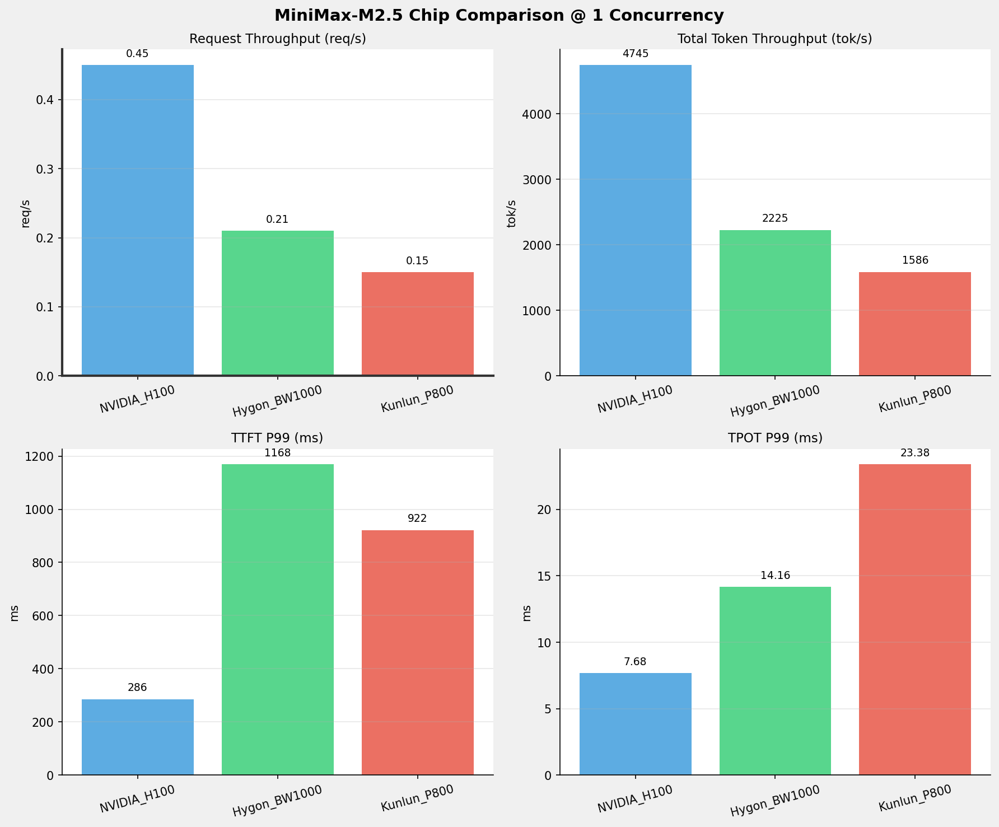
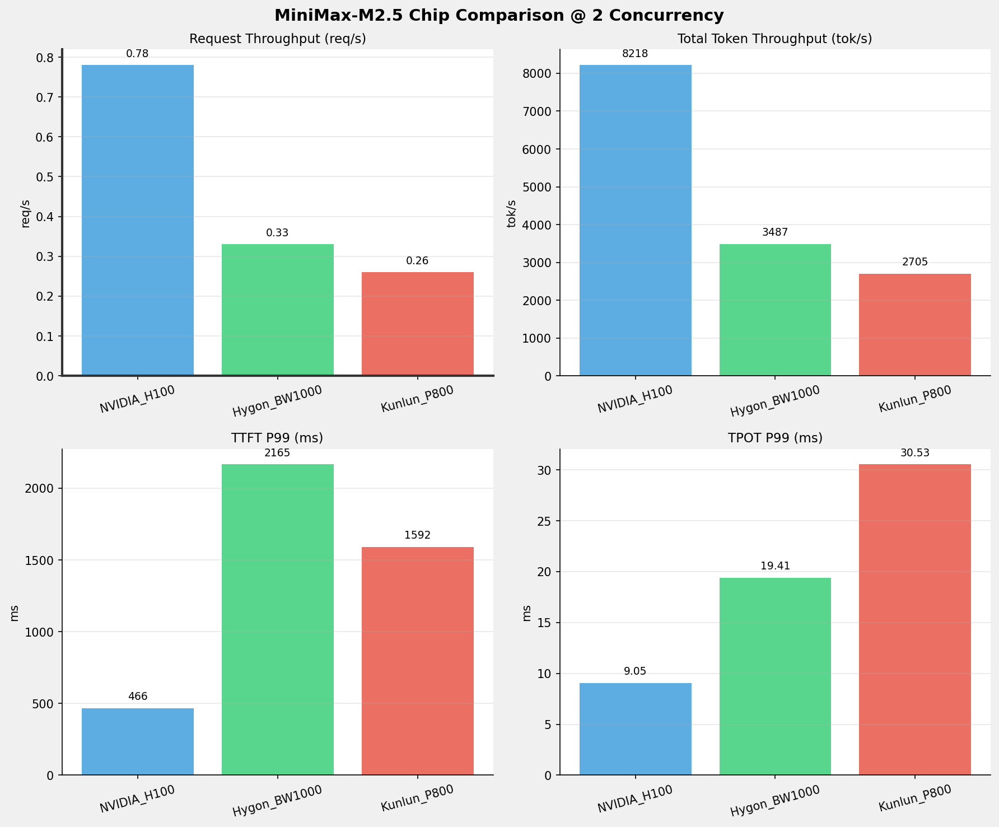
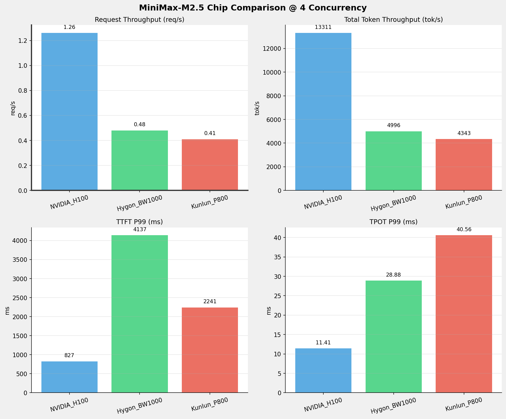
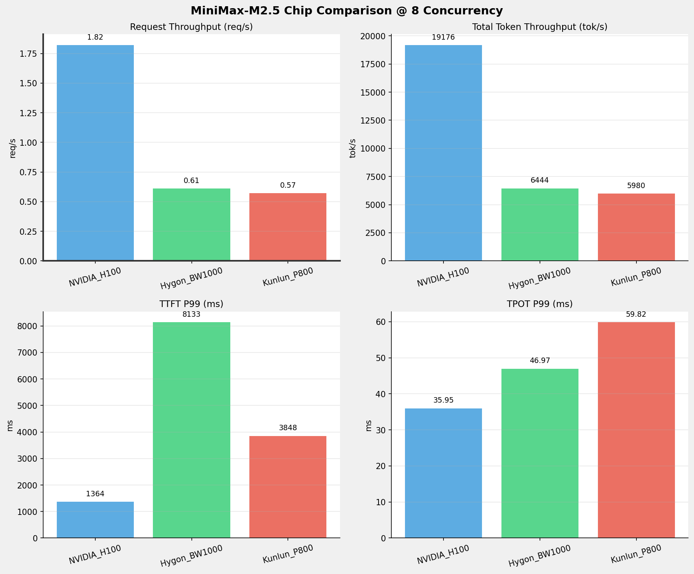
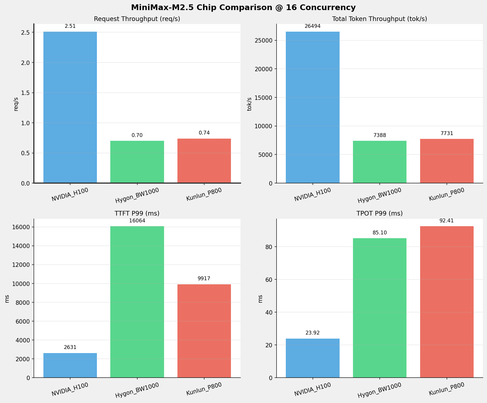
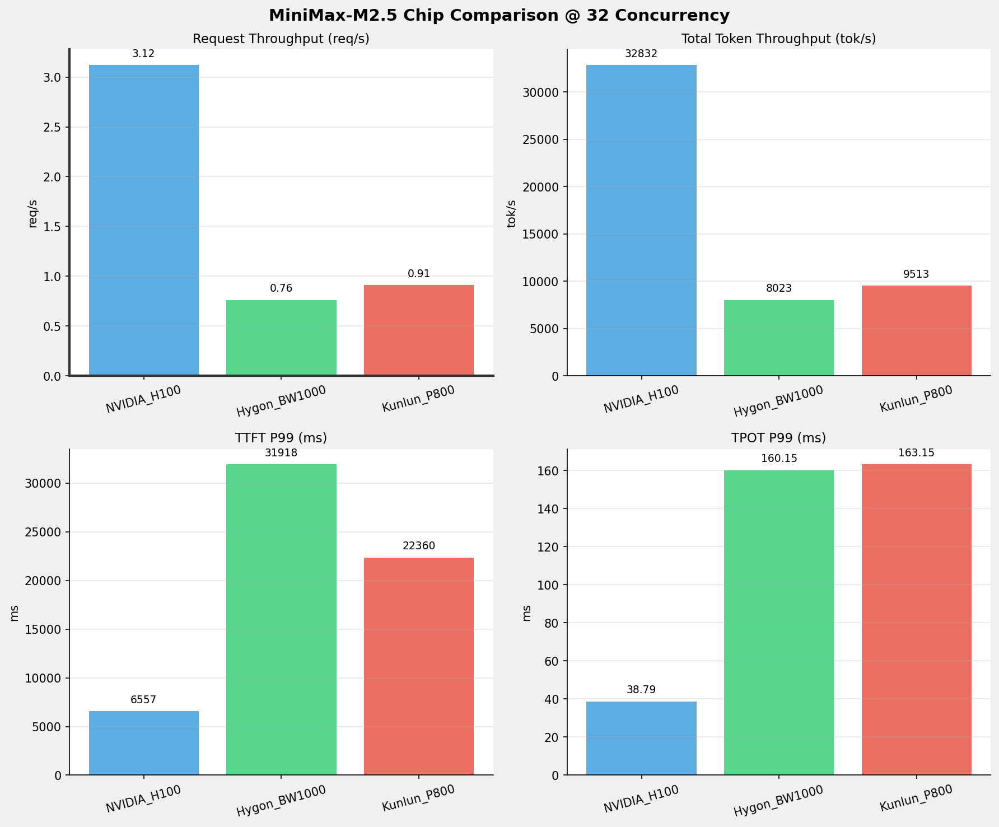
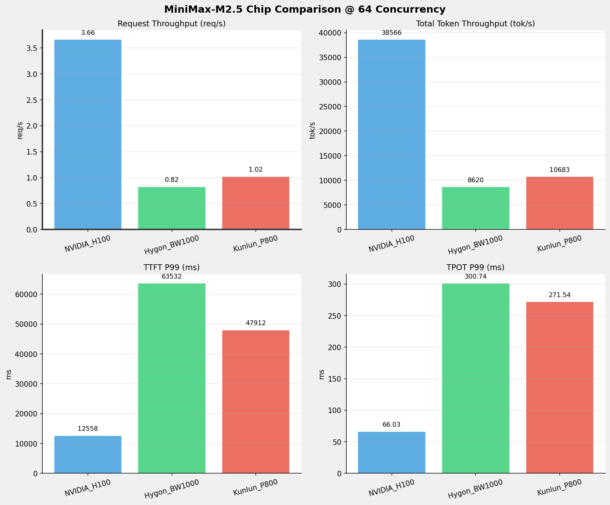
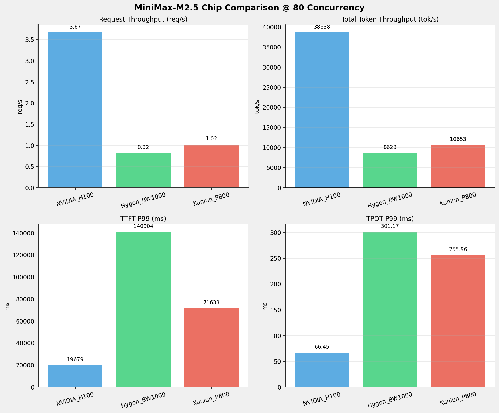
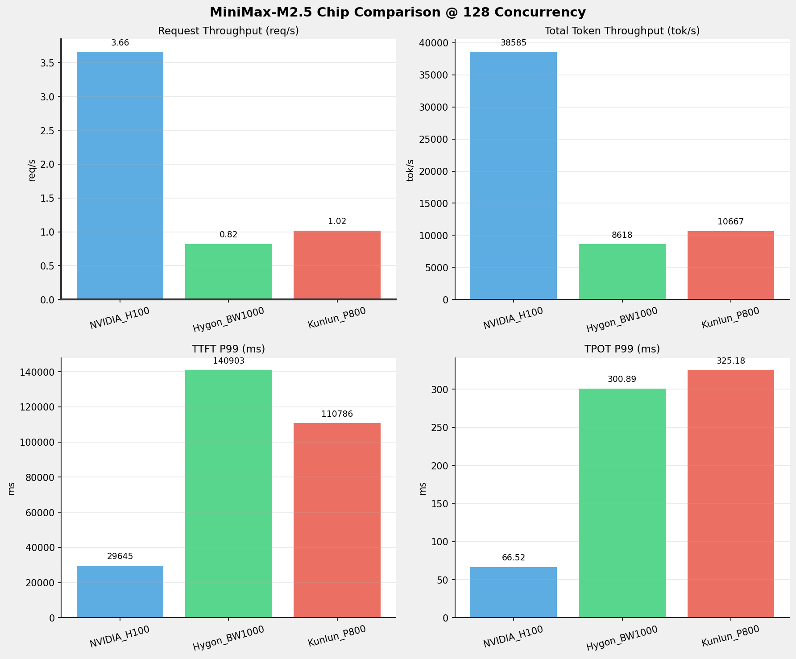
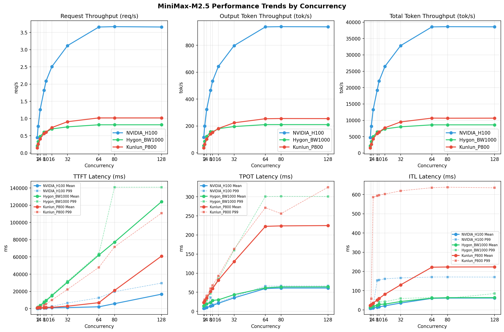

# MiniMax-M2.5模型在不同芯片下的benchmark基准测试报告

**测试日期：** 2026-05-19

---

## 测试场景
在固定请求数，输入上下文和输出上下文长度下，使用vllm bench serve工具对并发数逐级增加场景的性能基准验证。并对比同一模型在不同芯片环境上的性能指标。

**主要采集指标**：

| 指标                  | 单位         | 含义                                 |
|---------------------|------------|------------------------------------|
| TTFT                | ms         | Time To First Token，首 token 延迟     |
| TPOT                | ms/token   | Time Per Output Token，每 token 生成时间 |
| Throughput          | tokens/s   | 系统总吞吐                              |
| QPS                 | requests/s | 请求吞吐                               |
| P50/P95/P99 Latency | ms         | 延迟分位数                              |
    
### 📊 测试概览

| 项目            | 配置                                     | 备注  |
|---------------|----------------------------------------|-----|
| **数据集**       | random                                 |     |
| **并发数**       | 1, 2, 4, 8, 10, 16, 32, 64, 80, 128    |     |
| **总请求数**      | 320                                    |     |
| **请求输入上下文长度** | 10240（10k）                             |     |
| **请求输出上下文长度** | 256（0.25k）                             |     |
| **被测芯片**      | NVIDIA_H100, Hygon_BW1000, Kunlun_P800 |     |
| **被测模型**      | MiniMax-M2.5 |     |

---

### 🤖 芯片和模型配置信息

| 参数名称 | **NVIDIA_H100** | **Hygon_BW1000** | **Kunlun_P800** |
|----------|----------|----------|----------|
| **max_position_embeddings** | 196608 | 196608 | 196608 |
| **model_name** | MiniMax-M2.5 | MiniMax-M2.5-W8A8 | MiniMax-M2.5-W8A8-INT8-Dynamic |
| **model_size** | 215G | 215G | 215G |
| **python_version** | 3.12.3 | 3.10.12 | 3.10.15 |
| **quantization_config** | FP16 | int-8 | int-8 |
| **temperature** | N/A | N/A | 1.0 |
| **top_k** | N/A | N/A | 40 |
| **top_p** | N/A | N/A | 0.95 |
| **transformers_version** | 4.46.1 | 4.57.6 | 4.46.1 |
| **vllm_version** | 0.15.1 | 0.15.1+das.opt1.alpha.dtk2604 | 0.11.0 |

---

### ⚙️ vLLM启动配置信息

| 参数名称 | **NVIDIA_H100** | **Hygon_BW1000** | **Kunlun_P800** |
|----------|----------|----------|----------|
| **Block Size** | default | default | 128 |
| **Compilation Config** | N/A | N/A | {"splitting_ops":["vllm.unified_attention","vllm.unified_attention_with_output","vllm.unified_attention_with_output_kunlun","vllm.mamba_mixer2","vllm.mamba_mixer","vllm.short_conv","vllm.linear_attention","vllm.plamo2_mamba_mixer","vllm.gdn_attention","vllm.sparse_attn_indexer","vllm.sparse_attn_indexer_vllm_kunlun"]} |
| **Dp** | 1 | 1 | 1 |
| **Dtype** | default | bfloat16 | auto |
| **Enable Auto Tool Choice** | True | True | True |
| **Enable Export Parallel** | True | True | False |
| **Gpu Memory Utilization** | 0.85 | 0.9 | 0.95 |
| **Max Model Len** | 196608 | 196608 | 196608 |
| **Max Num Batched Tokens** | 8192 | default | 8192 |
| **Max Num Seqs** | 10 | 64 | 64 |
| **Model Name** | MiniMax-M2.5 | MiniMax-M2.5-W8A8 | MiniMax-M2.5-W8A8-INT8-Dynamic |
| **Pp** | 1 | 1 | 1 |
| **Reasoning Parser** | minimax_m2 | minimax_m2 (不生效) | minimax_m2 (不生效) |
| **Tool Call Parser** | minimax_m2 | minimax_m2 | minimax_m2 |
| **Tp** | 8 | 8 | 8 |

- **NVIDIA_H100**: 英伟达H100标准配置
- **Hygon_BW1000**: 海光芯片专家并行配置
- **Kunlun_P800**: 昆仑芯不启用专家并行避免通信问题

---

### 📊 芯片性能对比柱状图

**1并发**

**2并发**

**4并发**

**8并发**

**10并发**

**16并发**

**32并发**

**64并发**

**80并发**

**128并发**

### 📈 性能趋势对比图 (所有芯片)

---

### 📈 各指标随并发级别性能对比详情

#### 请求吞吐量（Request throughput (req/s)）

| 并发数 | NVIDIA_H100 | Hygon_BW1000 | Kunlun_P800 | 差值 | 百分比 |
|-----|----------- | ----------- | ----------- | ----------- | -----------|
| 1   | 0.45 | 0.21 | 0.15 | -0.30 | -66.7% |
| 2   | 0.78 | 0.33 | 0.26 | -0.52 | -66.7% |
| 4   | 1.26 | 0.48 | 0.41 | -0.85 | -67.5% |
| 8   | 1.82 | 0.61 | 0.57 | -1.25 | -68.7% |
| 10   | 2.09 | 0.61 | 0.61 | -1.48 | -70.8% |
| 16   | 2.51 | 0.70 | 0.74 | -1.77 | -70.5% |
| 32   | 3.12 | 0.76 | 0.91 | -2.21 | -70.8% |
| 64   | 3.66 | 0.82 | 1.02 | -2.64 | -72.1% |
| 80   | 3.67 | 0.82 | 1.02 | -2.65 | -72.2% |
| 128   | 3.66 | 0.82 | 1.02 | -2.64 | -72.1% |

#### 输出token吞吐量（Output token throughput (tok/s)）

| 并发数 | NVIDIA_H100 | Hygon_BW1000 | Kunlun_P800 | 差值 | 百分比 |
|-----|----------- | ----------- | ----------- | ----------- | -----------|
| 1   | 115.31 | 54.28 | 37.20 | -78.11 | -67.7% |
| 2   | 199.70 | 85.05 | 64.02 | -135.68 | -67.9% |
| 4   | 323.45 | 121.84 | 102.96 | -220.49 | -68.2% |
| 8   | 465.99 | 157.18 | 141.69 | -324.30 | -69.6% |
| 10   | 534.52 | 155.66 | 152.16 | -382.36 | -71.5% |
| 16   | 643.80 | 180.19 | 181.52 | -462.28 | -71.8% |
| 32   | 797.81 | 195.69 | 223.77 | -574.04 | -72.0% |
| 64   | 937.16 | 210.25 | 253.92 | -683.24 | -72.9% |
| 80   | 938.91 | 210.32 | 255.42 | -683.49 | -72.8% |
| 128   | 937.61 | 210.20 | 254.79 | -682.82 | -72.8% |

#### 总token吞吐量（Total token throughput (tok/s)）

| 并发数 | NVIDIA_H100 | Hygon_BW1000 | Kunlun_P800 | 差值 | 百分比 |
|-----|----------- | ----------- | ----------- | ----------- | -----------|
| 1   | 4745.14 | 2225.40 | 1585.87 | -3159.27 | -66.6% |
| 2   | 8217.92 | 3487.19 | 2705.12 | -5512.80 | -67.1% |
| 4   | 13310.92 | 4995.56 | 4342.80 | -8968.12 | -67.4% |
| 8   | 19176.39 | 6444.25 | 5980.27 | -13196.12 | -68.8% |
| 10   | 21996.95 | 6382.12 | 6448.31 | -15548.64 | -70.7% |
| 16   | 26494.03 | 7387.79 | 7730.83 | -18763.20 | -70.8% |
| 32   | 32831.81 | 8023.25 | 9513.02 | -23318.79 | -71.0% |
| 64   | 38566.45 | 8620.30 | 10682.97 | -27883.48 | -72.3% |
| 80   | 38638.21 | 8623.30 | 10653.29 | -27984.92 | -72.4% |
| 128   | 38585.00 | 8618.28 | 10666.52 | -27918.48 | -72.4% |

#### 首token延迟（P99 TTFT (ms)）

| 并发数 | NVIDIA_H100 | Hygon_BW1000 | Kunlun_P800 | 差值 | 百分比 |
|-----|----------- | ----------- | ----------- | ----------- | -----------|
| 1   | 286.01 | 1168.49 | 921.76 | +635.75 | +222.3% |
| 2   | 466.40 | 2165.32 | 1591.52 | +1125.12 | +241.2% |
| 4   | 826.89 | 4137.09 | 2240.56 | +1413.67 | +171.0% |
| 8   | 1364.44 | 8133.44 | 3847.84 | +2483.40 | +182.0% |
| 10   | 1534.23 | 10081.63 | 5143.91 | +3609.68 | +235.3% |
| 16   | 2630.84 | 16063.93 | 9917.09 | +7286.25 | +277.0% |
| 32   | 6556.86 | 31917.86 | 22359.61 | +15802.75 | +241.0% |
| 64   | 12557.76 | 63531.55 | 47912.19 | +35354.43 | +281.5% |
| 80   | 19679.20 | 140904.11 | 71633.46 | +51954.26 | +264.0% |
| 128   | 29645.32 | 140903.29 | 110786.32 | +81141.00 | +273.7% |

#### 每token生成时间（P99 TPOT (ms)）

| 并发数 | NVIDIA_H100 | Hygon_BW1000 | Kunlun_P800 | 差值 | 百分比 |
|-----|----------- | ----------- | ----------- | ----------- | -----------|
| 1   | 7.68 | 14.16 | 23.38 | +15.70 | +204.4% |
| 2   | 9.05 | 19.41 | 30.53 | +21.48 | +237.3% |
| 4   | 11.41 | 28.88 | 40.56 | +29.15 | +255.5% |
| 8   | 35.95 | 46.97 | 59.82 | +23.87 | +66.4% |
| 10   | 17.75 | 60.61 | 68.00 | +50.25 | +283.1% |
| 16   | 23.92 | 85.10 | 92.41 | +68.49 | +286.3% |
| 32   | 38.79 | 160.15 | 163.15 | +124.36 | +320.6% |
| 64   | 66.03 | 300.74 | 271.54 | +205.51 | +311.2% |
| 80   | 66.45 | 301.17 | 255.96 | +189.51 | +285.2% |
| 128   | 66.52 | 300.89 | 325.18 | +258.66 | +388.8% |

#### token间延迟（P99 ITL (ms)）

| 并发数 | NVIDIA_H100 | Hygon_BW1000 | Kunlun_P800 | 差值 | 百分比 |
|-----|----------- | ----------- | ----------- | ----------- | -----------|
| 1   | 8.57 | 20.17 | 24.07 | +15.50 | +180.9% |
| 2   | 16.54 | 24.07 | 58.36 | +41.82 | +252.8% |
| 4   | 18.61 | 22.80 | 586.65 | +568.04 | +3052.3% |
| 8   | 152.68 | 24.15 | 593.49 | +440.81 | +288.7% |
| 10   | 155.84 | 41.33 | 596.54 | +440.70 | +282.8% |
| 16   | 161.83 | 42.55 | 602.60 | +440.77 | +272.4% |
| 32   | 166.38 | 59.25 | 619.41 | +453.03 | +272.3% |
| 64   | 170.95 | 64.72 | 635.84 | +464.89 | +271.9% |
| 80   | 171.22 | 60.21 | 638.32 | +467.10 | +272.8% |
| 128   | 170.62 | 85.02 | 635.16 | +464.54 | +272.3% |

### 📈 各并发级别性能对比详情

### 1 并发

#### 服务基准结果

| 指标 | NVIDIA_H100 | Hygon_BW1000 | Kunlun_P800 |
|------|----------- | ----------- | -----------|
| 成功请求数 | 320 | 320 | 320 |
| 失败请求数 | 0 | 0 | 0 |
| 测试持续时间 (s) | 710.45 | 1509.26 | 2115.85 |
| 总输入 tokens | 3289280 | 3276800 | 3276748 |
| 总生成 tokens | 81920 | 81920 | 78707 |
| **请求吞吐量 (req/s)** | **0.45** ⭐ | 0.21 | 0.15 |
| **输出 token 吞吐量 (tok/s)** | **115.31** ⭐ | 54.28 | 37.20 |
| 峰值输出 token 吞吐量 (tok/s) | **132.00** ⭐ | 72.00 | 44.00 |
| 峰值并发请求数 | 2.00 | 2.00 | 2.00 |
| **总 token 吞吐量 (tok/s)** | **4745.14** ⭐ | 2225.40 | 1585.87 |

#### 首Token延迟 (TTFT)

| 指标 | NVIDIA_H100 | Hygon_BW1000 | Kunlun_P800 |
|------|----------- | ----------- | -----------|
| 平均 TTFT (ms) | **264.19** ⭐ | 1112.21 | 898.33 |
| 中位 TTFT (ms) | **264.45** ⭐ | 1111.97 | 901.43 |
| P95 TTFT (ms) | **275.76** ⭐ | 1127.95 | 915.80 |
| P99 TTFT (ms) | **286.01** ⭐ | 1168.49 | 921.76 |

#### 每Token生成时间 (TPOT)

| 指标 | NVIDIA_H100 | Hygon_BW1000 | Kunlun_P800 |
|------|----------- | ----------- | -----------|
| 平均 TPOT (ms) | **7.67** ⭐ | 14.13 | 23.32 |
| 中位 TPOT (ms) | **7.67** ⭐ | 14.13 | 23.32 |
| P95 TPOT (ms) | **7.68** ⭐ | 14.15 | 23.36 |
| P99 TPOT (ms) | **7.68** ⭐ | 14.16 | 23.38 |

#### Token间延迟 (ITL)

| 指标 | NVIDIA_H100 | Hygon_BW1000 | Kunlun_P800 |
|------|----------- | ----------- | -----------|
| 平均 ITL (ms) | **7.70** ⭐ | 14.14 | 23.26 |
| 中位 ITL (ms) | **7.69** ⭐ | 14.13 | 23.31 |
| P95 ITL (ms) | **7.83** ⭐ | 14.47 | 23.49 |
| P99 ITL (ms) | **8.57** ⭐ | 20.17 | 24.07 |

---

### 2 并发

#### 服务基准结果

| 指标 | NVIDIA_H100 | Hygon_BW1000 | Kunlun_P800 |
|------|----------- | ----------- | -----------|
| 成功请求数 | 320 | 320 | 320 |
| 失败请求数 | 0 | 0 | 0 |
| 测试持续时间 (s) | 410.23 | 963.16 | 1240.67 |
| 总输入 tokens | 3289280 | 3276800 | 3276748 |
| 总生成 tokens | 81920 | 81920 | 79423 |
| **请求吞吐量 (req/s)** | **0.78** ⭐ | 0.33 | 0.26 |
| **输出 token 吞吐量 (tok/s)** | **199.70** ⭐ | 85.05 | 64.02 |
| 峰值输出 token 吞吐量 (tok/s) | **244.00** ⭐ | 136.00 | 83.00 |
| 峰值并发请求数 | 4.00 | 4.00 | 4.00 |
| **总 token 吞吐量 (tok/s)** | **8217.92** ⭐ | 3487.19 | 2705.12 |

#### 首Token延迟 (TTFT)

| 指标 | NVIDIA_H100 | Hygon_BW1000 | Kunlun_P800 |
|------|----------- | ----------- | -----------|
| 平均 TTFT (ms) | **360.79** ⭐ | 1623.93 | 978.55 |
| 中位 TTFT (ms) | **284.36** ⭐ | 1153.37 | 923.32 |
| P95 TTFT (ms) | **463.55** ⭐ | 2156.14 | 1575.42 |
| P99 TTFT (ms) | **466.40** ⭐ | 2165.32 | 1591.52 |

#### 每Token生成时间 (TPOT)

| 指标 | NVIDIA_H100 | Hygon_BW1000 | Kunlun_P800 |
|------|----------- | ----------- | -----------|
| 平均 TPOT (ms) | **8.64** ⭐ | 17.24 | 27.38 |
| 中位 TPOT (ms) | **8.65** ⭐ | 17.15 | 27.56 |
| P95 TPOT (ms) | **9.04** ⭐ | 19.37 | 28.88 |
| P99 TPOT (ms) | **9.05** ⭐ | 19.41 | 30.53 |

#### Token间延迟 (ITL)

| 指标 | NVIDIA_H100 | Hygon_BW1000 | Kunlun_P800 |
|------|----------- | ----------- | -----------|
| 平均 ITL (ms) | **8.68** ⭐ | 17.23 | 27.40 |
| 中位 ITL (ms) | **8.28** ⭐ | 15.20 | 24.60 |
| P95 ITL (ms) | **8.46** ⭐ | 16.13 | 24.82 |
| P99 ITL (ms) | **16.54** ⭐ | 24.07 | 58.36 |

---

### 4 并发

#### 服务基准结果

| 指标 | NVIDIA_H100 | Hygon_BW1000 | Kunlun_P800 |
|------|----------- | ----------- | -----------|
| 成功请求数 | 320 | 320 | 320 |
| 失败请求数 | 0 | 0 | 0 |
| 测试持续时间 (s) | 253.27 | 672.34 | 772.85 |
| 总输入 tokens | 3289280 | 3276800 | 3276748 |
| 总生成 tokens | 81920 | 81920 | 79574 |
| **请求吞吐量 (req/s)** | **1.26** ⭐ | 0.48 | 0.41 |
| **输出 token 吞吐量 (tok/s)** | **323.45** ⭐ | 121.84 | 102.96 |
| 峰值输出 token 吞吐量 (tok/s) | **436.00** ⭐ | 247.00 | 157.00 |
| 峰值并发请求数 | 8.00 | 8.00 | 8.00 |
| **总 token 吞吐量 (tok/s)** | **13310.92** ⭐ | 4995.56 | 4342.80 |

#### 首Token延迟 (TTFT)

| 指标 | NVIDIA_H100 | Hygon_BW1000 | Kunlun_P800 |
|------|----------- | ----------- | -----------|
| 平均 TTFT (ms) | **584.15** ⭐ | 3351.54 | 1017.52 |
| 中位 TTFT (ms) | **582.44** ⭐ | 4115.92 | 915.96 |
| P95 TTFT (ms) | **821.10** ⭐ | 4129.04 | 1618.56 |
| P99 TTFT (ms) | **826.89** ⭐ | 4137.09 | 2240.56 |

#### 每Token生成时间 (TPOT)

| 指标 | NVIDIA_H100 | Hygon_BW1000 | Kunlun_P800 |
|------|----------- | ----------- | -----------|
| 平均 TPOT (ms) | **10.12** ⭐ | 19.81 | 34.77 |
| 中位 TPOT (ms) | **10.02** ⭐ | 16.93 | 34.97 |
| P95 TPOT (ms) | **11.39** ⭐ | 28.78 | 37.89 |
| P99 TPOT (ms) | **11.41** ⭐ | 28.88 | 40.56 |

#### Token间延迟 (ITL)

| 指标 | NVIDIA_H100 | Hygon_BW1000 | Kunlun_P800 |
|------|----------- | ----------- | -----------|
| 平均 ITL (ms) | **10.20** ⭐ | 19.76 | 35.04 |
| 中位 ITL (ms) | **9.24** ⭐ | 16.86 | 26.08 |
| P95 ITL (ms) | **9.57** ⭐ | 17.85 | 27.03 |
| P99 ITL (ms) | **18.61** ⭐ | 22.80 | 586.65 |

---

### 8 并发

#### 服务基准结果

| 指标 | NVIDIA_H100 | Hygon_BW1000 | Kunlun_P800 |
|------|----------- | ----------- | -----------|
| 成功请求数 | 320 | 320 | 320 |
| 失败请求数 | 0 | 0 | 0 |
| 测试持续时间 (s) | 175.80 | 521.20 | 561.22 |
| 总输入 tokens | 3289280 | 3276800 | 3276748 |
| 总生成 tokens | 81920 | 81920 | 79521 |
| **请求吞吐量 (req/s)** | **1.82** ⭐ | 0.61 | 0.57 |
| **输出 token 吞吐量 (tok/s)** | **465.99** ⭐ | 157.18 | 141.69 |
| 峰值输出 token 吞吐量 (tok/s) | **760.00** ⭐ | 424.00 | 257.00 |
| 峰值并发请求数 | 16.00 | 16.00 | 11.00 |
| **总 token 吞吐量 (tok/s)** | **19176.39** ⭐ | 6444.25 | 5980.27 |

#### 首Token延迟 (TTFT)

| 指标 | NVIDIA_H100 | Hygon_BW1000 | Kunlun_P800 |
|------|----------- | ----------- | -----------|
| 平均 TTFT (ms) | **931.63** ⭐ | 7190.37 | 1159.47 |
| 中位 TTFT (ms) | **935.84** ⭐ | 8083.99 | 936.85 |
| P95 TTFT (ms) | **1245.61** ⭐ | 8094.81 | 1649.19 |
| P99 TTFT (ms) | **1364.44** ⭐ | 8133.44 | 3847.84 |

#### 每Token生成时间 (TPOT)

| 指标 | NVIDIA_H100 | Hygon_BW1000 | Kunlun_P800 |
|------|----------- | ----------- | -----------|
| 平均 TPOT (ms) | **13.58** ⭐ | 22.89 | 51.78 |
| 中位 TPOT (ms) | **13.24** ⭐ | 19.52 | 52.18 |
| P95 TPOT (ms) | **15.59** ⭐ | 46.86 | 55.27 |
| P99 TPOT (ms) | **35.95** ⭐ | 46.97 | 59.82 |

#### Token间延迟 (ITL)

| 指标 | NVIDIA_H100 | Hygon_BW1000 | Kunlun_P800 |
|------|----------- | ----------- | -----------|
| 平均 ITL (ms) | **13.66** ⭐ | 22.82 | 51.62 |
| 中位 ITL (ms) | **10.60** ⭐ | 19.56 | 31.87 |
| P95 ITL (ms) | **11.15** ⭐ | 20.53 | 214.19 |
| P99 ITL (ms) | 152.68 | **24.15** ⭐ | 593.49 |

---

### 10 并发

#### 服务基准结果

| 指标 | NVIDIA_H100 | Hygon_BW1000 | Kunlun_P800 |
|------|----------- | ----------- | -----------|
| 成功请求数 | 320 | 320 | 320 |
| 失败请求数 | 0 | 0 | 0 |
| 测试持续时间 (s) | 153.26 | 526.27 | 520.44 |
| 总输入 tokens | 3289280 | 3276800 | 3276748 |
| 总生成 tokens | 81920 | 81920 | 79192 |
| **请求吞吐量 (req/s)** | **2.09** ⭐ | 0.61 | 0.61 |
| **输出 token 吞吐量 (tok/s)** | **534.52** ⭐ | 155.66 | 152.16 |
| 峰值输出 token 吞吐量 (tok/s) | **900.00** ⭐ | 420.00 | 291.00 |
| 峰值并发请求数 | 19.00 | 20.00 | 14.00 |
| **总 token 吞吐量 (tok/s)** | **21996.95** ⭐ | 6382.12 | 6448.31 |

#### 首Token延迟 (TTFT)

| 指标 | NVIDIA_H100 | Hygon_BW1000 | Kunlun_P800 |
|------|----------- | ----------- | -----------|
| 平均 TTFT (ms) | **827.89** ⭐ | 9132.16 | 1456.60 |
| 中位 TTFT (ms) | **875.37** ⭐ | 10065.22 | 1282.49 |
| P95 TTFT (ms) | **1309.06** ⭐ | 10076.09 | 3221.43 |
| P99 TTFT (ms) | **1534.23** ⭐ | 10081.63 | 5143.91 |

#### 每Token生成时间 (TPOT)

| 指标 | NVIDIA_H100 | Hygon_BW1000 | Kunlun_P800 |
|------|----------- | ----------- | -----------|
| 平均 TPOT (ms) | **15.52** ⭐ | 28.67 | 59.81 |
| 中位 TPOT (ms) | **15.31** ⭐ | 25.19 | 60.91 |
| P95 TPOT (ms) | **17.71** ⭐ | 60.21 | 65.57 |
| P99 TPOT (ms) | **17.75** ⭐ | 60.61 | 68.00 |

#### Token间延迟 (ITL)

| 指标 | NVIDIA_H100 | Hygon_BW1000 | Kunlun_P800 |
|------|----------- | ----------- | -----------|
| 平均 ITL (ms) | **15.60** ⭐ | 28.65 | 59.57 |
| 中位 ITL (ms) | **11.23** ⭐ | 25.20 | 35.48 |
| P95 ITL (ms) | **12.43** ⭐ | 26.22 | 217.00 |
| P99 ITL (ms) | 155.84 | **41.33** ⭐ | 596.54 |

---

### 16 并发

#### 服务基准结果

| 指标 | NVIDIA_H100 | Hygon_BW1000 | Kunlun_P800 |
|------|----------- | ----------- | -----------|
| 成功请求数 | 320 | 320 | 320 |
| 失败请求数 | 0 | 0 | 0 |
| 测试持续时间 (s) | 127.24 | 454.63 | 434.05 |
| 总输入 tokens | 3289280 | 3276800 | 3276748 |
| 总生成 tokens | 81920 | 81920 | 78788 |
| **请求吞吐量 (req/s)** | **2.51** ⭐ | 0.70 | 0.74 |
| **输出 token 吞吐量 (tok/s)** | **643.80** ⭐ | 180.19 | 181.52 |
| 峰值输出 token 吞吐量 (tok/s) | **1248.00** ⭐ | 656.00 | 417.00 |
| 峰值并发请求数 | 26.00 | 32.00 | 20.00 |
| **总 token 吞吐量 (tok/s)** | **26494.03** ⭐ | 7387.79 | 7730.83 |

#### 首Token延迟 (TTFT)

| 指标 | NVIDIA_H100 | Hygon_BW1000 | Kunlun_P800 |
|------|----------- | ----------- | -----------|
| 平均 TTFT (ms) | **967.22** ⭐ | 15052.83 | 1485.85 |
| 中位 TTFT (ms) | **1032.07** ⭐ | 16028.53 | 1296.89 |
| P95 TTFT (ms) | **1697.66** ⭐ | 16056.37 | 2324.89 |
| P99 TTFT (ms) | **2630.84** ⭐ | 16063.93 | 9917.09 |

#### 每Token生成时间 (TPOT)

| 指标 | NVIDIA_H100 | Hygon_BW1000 | Kunlun_P800 |
|------|----------- | ----------- | -----------|
| 平均 TPOT (ms) | **21.13** ⭐ | 30.10 | 81.64 |
| 中位 TPOT (ms) | **20.85** ⭐ | 26.43 | 82.49 |
| P95 TPOT (ms) | **23.79** ⭐ | 84.67 | 87.96 |
| P99 TPOT (ms) | **23.92** ⭐ | 85.10 | 92.41 |

#### Token间延迟 (ITL)

| 指标 | NVIDIA_H100 | Hygon_BW1000 | Kunlun_P800 |
|------|----------- | ----------- | -----------|
| 平均 ITL (ms) | **21.27** ⭐ | 30.01 | 81.44 |
| 中位 ITL (ms) | **13.09** ⭐ | 26.59 | 39.41 |
| P95 ITL (ms) | 150.58 | **30.25** ⭐ | 592.47 |
| P99 ITL (ms) | 161.83 | **42.55** ⭐ | 602.60 |

---

### 32 并发

#### 服务基准结果

| 指标 | NVIDIA_H100 | Hygon_BW1000 | Kunlun_P800 |
|------|----------- | ----------- | -----------|
| 成功请求数 | 320 | 320 | 320 |
| 失败请求数 | 0 | 0 | 0 |
| 测试持续时间 (s) | 102.68 | 418.62 | 352.75 |
| 总输入 tokens | 3289280 | 3276800 | 3276748 |
| 总生成 tokens | 81920 | 81920 | 78933 |
| **请求吞吐量 (req/s)** | **3.12** ⭐ | 0.76 | 0.91 |
| **输出 token 吞吐量 (tok/s)** | **797.81** ⭐ | 195.69 | 223.77 |
| 峰值输出 token 吞吐量 (tok/s) | **1920.00** ⭐ | 864.00 | 702.00 |
| 峰值并发请求数 | 40.00 | 64.00 | 36.00 |
| **总 token 吞吐量 (tok/s)** | **32831.81** ⭐ | 8023.25 | 9513.02 |

#### 首Token延迟 (TTFT)

| 指标 | NVIDIA_H100 | Hygon_BW1000 | Kunlun_P800 |
|------|----------- | ----------- | -----------|
| 平均 TTFT (ms) | **1227.85** ⭐ | 30731.82 | 2848.93 |
| 中位 TTFT (ms) | **968.59** ⭐ | 31855.15 | 1715.48 |
| P95 TTFT (ms) | **3978.00** ⭐ | 31914.75 | 12301.42 |
| P99 TTFT (ms) | **6556.86** ⭐ | 31917.86 | 22359.61 |

#### 每Token生成时间 (TPOT)

| 指标 | NVIDIA_H100 | Hygon_BW1000 | Kunlun_P800 |
|------|----------- | ----------- | -----------|
| 平均 TPOT (ms) | **35.33** ⭐ | 43.62 | 130.25 |
| 中位 TPOT (ms) | **36.07** ⭐ | 39.56 | 135.10 |
| P95 TPOT (ms) | **38.47** ⭐ | 39.90 | 145.12 |
| P99 TPOT (ms) | **38.79** ⭐ | 160.15 | 163.15 |

#### Token间延迟 (ITL)

| 指标 | NVIDIA_H100 | Hygon_BW1000 | Kunlun_P800 |
|------|----------- | ----------- | -----------|
| 平均 ITL (ms) | **35.48** ⭐ | 43.45 | 130.13 |
| 中位 ITL (ms) | **16.79** ⭐ | 39.75 | 47.63 |
| P95 ITL (ms) | 161.31 | **48.15** ⭐ | 608.17 |
| P99 ITL (ms) | 166.38 | **59.25** ⭐ | 619.41 |

---

### 64 并发

#### 服务基准结果

| 指标 | NVIDIA_H100 | Hygon_BW1000 | Kunlun_P800 |
|------|----------- | ----------- | -----------|
| 成功请求数 | 320 | 320 | 320 |
| 失败请求数 | 0 | 0 | 0 |
| 测试持续时间 (s) | 87.41 | 389.63 | 314.19 |
| 总输入 tokens | 3289280 | 3276800 | 3276748 |
| 总生成 tokens | 81920 | 81920 | 79780 |
| **请求吞吐量 (req/s)** | **3.66** ⭐ | 0.82 | 1.02 |
| **输出 token 吞吐量 (tok/s)** | **937.16** ⭐ | 210.25 | 253.92 |
| 峰值输出 token 吞吐量 (tok/s) | **2878.00** ⭐ | 1279.00 | 1024.00 |
| 峰值并发请求数 | 72.00 | 128.00 | 68.00 |
| **总 token 吞吐量 (tok/s)** | **38566.45** ⭐ | 8620.30 | 10682.97 |

#### 首Token延迟 (TTFT)

| 指标 | NVIDIA_H100 | Hygon_BW1000 | Kunlun_P800 |
|------|----------- | ----------- | -----------|
| 平均 TTFT (ms) | **2119.88** ⭐ | 62196.04 | 6916.51 |
| 中位 TTFT (ms) | **981.41** ⭐ | 63499.67 | 2495.19 |
| P95 TTFT (ms) | **10055.31** ⭐ | 63528.23 | 38095.53 |
| P99 TTFT (ms) | **12557.76** ⭐ | 63531.55 | 47912.19 |

#### 每Token生成时间 (TPOT)

| 指标 | NVIDIA_H100 | Hygon_BW1000 | Kunlun_P800 |
|------|----------- | ----------- | -----------|
| 平均 TPOT (ms) | **59.72** ⭐ | 61.63 | 222.66 |
| 中位 TPOT (ms) | 63.77 | **57.08** ⭐ | 241.15 |
| P95 TPOT (ms) | 64.94 | **57.35** ⭐ | 253.91 |
| P99 TPOT (ms) | **66.03** ⭐ | 300.74 | 271.54 |

#### Token间延迟 (ITL)

| 指标 | NVIDIA_H100 | Hygon_BW1000 | Kunlun_P800 |
|------|----------- | ----------- | -----------|
| 平均 ITL (ms) | **60.01** ⭐ | 61.39 | 222.08 |
| 中位 ITL (ms) | **22.71** ⭐ | 57.35 | 65.24 |
| P95 ITL (ms) | 166.68 | **59.07** ⭐ | 631.09 |
| P99 ITL (ms) | 170.95 | **64.72** ⭐ | 635.84 |

---

### 80 并发

#### 服务基准结果

| 指标 | NVIDIA_H100 | Hygon_BW1000 | Kunlun_P800 |
|------|----------- | ----------- | -----------|
| 成功请求数 | 320 | 320 | 320 |
| 失败请求数 | 0 | 0 | 0 |
| 测试持续时间 (s) | 87.25 | 389.49 | 315.14 |
| 总输入 tokens | 3289280 | 3276800 | 3276748 |
| 总生成 tokens | 81920 | 81920 | 80493 |
| **请求吞吐量 (req/s)** | **3.67** ⭐ | 0.82 | 1.02 |
| **输出 token 吞吐量 (tok/s)** | **938.91** ⭐ | 210.32 | 255.42 |
| 峰值输出 token 吞吐量 (tok/s) | **2880.00** ⭐ | 1263.00 | 1025.00 |
| 峰值并发请求数 | 86.00 | 143.00 | 83.00 |
| **总 token 吞吐量 (tok/s)** | **38638.21** ⭐ | 8623.30 | 10653.29 |

#### 首Token延迟 (TTFT)

| 指标 | NVIDIA_H100 | Hygon_BW1000 | Kunlun_P800 |
|------|----------- | ----------- | -----------|
| 平均 TTFT (ms) | **5759.41** ⭐ | 77178.96 | 21074.74 |
| 中位 TTFT (ms) | **3936.04** ⭐ | 62548.05 | 15109.31 |
| P95 TTFT (ms) | **13080.99** ⭐ | 140523.49 | 50874.99 |
| P99 TTFT (ms) | **19679.20** ⭐ | 140904.11 | 71633.46 |

#### 每Token生成时间 (TPOT)

| 指标 | NVIDIA_H100 | Hygon_BW1000 | Kunlun_P800 |
|------|----------- | ----------- | -----------|
| 平均 TPOT (ms) | **61.00** ⭐ | 64.04 | 223.83 |
| 中位 TPOT (ms) | 65.44 | **61.00** ⭐ | 243.06 |
| P95 TPOT (ms) | 65.70 | **61.24** ⭐ | 251.21 |
| P99 TPOT (ms) | **66.45** ⭐ | 301.17 | 255.96 |

#### Token间延迟 (ITL)

| 指标 | NVIDIA_H100 | Hygon_BW1000 | Kunlun_P800 |
|------|----------- | ----------- | -----------|
| 平均 ITL (ms) | **61.40** ⭐ | 63.79 | 223.17 |
| 中位 ITL (ms) | **22.72** ⭐ | 57.15 | 65.36 |
| P95 ITL (ms) | 167.68 | **58.28** ⭐ | 630.93 |
| P99 ITL (ms) | 171.22 | **60.21** ⭐ | 638.32 |

---

### 128 并发

#### 服务基准结果

| 指标 | NVIDIA_H100 | Hygon_BW1000 | Kunlun_P800 |
|------|----------- | ----------- | -----------|
| 成功请求数 | 320 | 320 | 320 |
| 失败请求数 | 0 | 0 | 0 |
| 测试持续时间 (s) | 87.37 | 389.72 | 314.72 |
| 总输入 tokens | 3289280 | 3276800 | 3276748 |
| 总生成 tokens | 81920 | 81920 | 80186 |
| **请求吞吐量 (req/s)** | **3.66** ⭐ | 0.82 | 1.02 |
| **输出 token 吞吐量 (tok/s)** | **937.61** ⭐ | 210.20 | 254.79 |
| 峰值输出 token 吞吐量 (tok/s) | **2874.00** ⭐ | 1279.00 | 1024.00 |
| 峰值并发请求数 | 134.00 | 191.00 | 131.00 |
| **总 token 吞吐量 (tok/s)** | **38585.00** ⭐ | 8618.28 | 10666.52 |

#### 首Token延迟 (TTFT)

| 指标 | NVIDIA_H100 | Hygon_BW1000 | Kunlun_P800 |
|------|----------- | ----------- | -----------|
| 平均 TTFT (ms) | **16764.52** ⭐ | 124081.37 | 60948.41 |
| 中位 TTFT (ms) | **17718.86** ⭐ | 140502.36 | 63459.09 |
| P95 TTFT (ms) | **27005.85** ⭐ | 140895.64 | 101009.77 |
| P99 TTFT (ms) | **29645.32** ⭐ | 140903.29 | 110786.32 |

#### 每Token生成时间 (TPOT)

| 指标 | NVIDIA_H100 | Hygon_BW1000 | Kunlun_P800 |
|------|----------- | ----------- | -----------|
| 平均 TPOT (ms) | **61.07** ⭐ | 64.17 | 224.66 |
| 中位 TPOT (ms) | 65.51 | **61.13** ⭐ | 241.98 |
| P95 TPOT (ms) | 65.86 | **61.49** ⭐ | 251.19 |
| P99 TPOT (ms) | **66.52** ⭐ | 300.89 | 325.18 |

#### Token间延迟 (ITL)

| 指标 | NVIDIA_H100 | Hygon_BW1000 | Kunlun_P800 |
|------|----------- | ----------- | -----------|
| 平均 ITL (ms) | **61.61** ⭐ | 63.92 | 223.47 |
| 中位 ITL (ms) | **22.76** ⭐ | 57.36 | 65.31 |
| P95 ITL (ms) | 167.75 | **61.86** ⭐ | 627.22 |
| P99 ITL (ms) | 170.62 | **85.02** ⭐ | 635.16 |

---

---

*报告生成时间: 2026-05-19*

