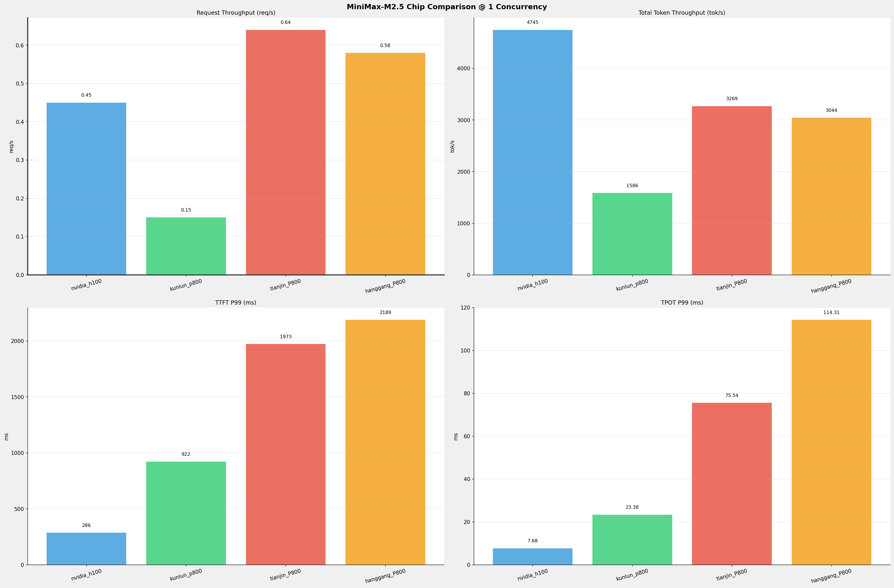
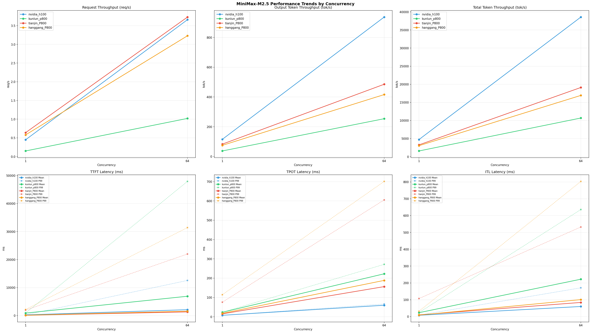

# MiniMax-M2.5模型在不同芯片下的benchmark基准测试报告

**测试日期：** 2026-07-13

---

## 测试场景
在固定请求数，输入上下文和输出上下文长度下，使用vllm bench serve工具对并发数逐级增加场景的性能基准验证。并对比同一模型在不同芯片环境上的性能指标。

**主要采集指标**：

| 指标                  | 单位         | 含义                                 |
|---------------------|------------|------------------------------------|
| TTFT                | ms         | Time To First Token，首 token 延迟     |
| TPOT                | ms/token   | Time Per Output Token，每 token 生成时间 |
| Throughput          | tokens/s   | 系统总吞吐                              |
| QPS                 | requests/s | 请求吞吐                               |
| P50/P95/P99 Latency | ms         | 延迟分位数                              |
    
### 📊 测试概览

| 项目            | 配置                                     | 备注  |
|---------------|----------------------------------------|-----|
| **数据集**       | random                                 |     |
| **并发数**       | 1, 2, 4, 8, 10, 16, 32, 64, 80, 128    |     |
| **总请求数**      | 320                                    |     |
| **请求输入上下文长度** | 10240（10k）                             |     |
| **请求输出上下文长度** | 256（0.25k）                             |     |
| **被测芯片**      | nvidia_h100, kunlun_p800, tianjin_P800, hanggang_P800 |     |
| **被测模型**      | MiniMax-M2.5 |     |

---

### 🤖 芯片和模型配置信息

| 参数名称 | **nvidia_h100** | **kunlun_p800** | **tianjin_P800** | **hanggang_P800** |
|----------|----------|----------|----------|----------|
| **max_position_embeddings** | 196608 | 196608 | 196608 | 196608 |
| **model_name** | MiniMax-M2.5 | MiniMax-M2.5-W8A8-INT8-Dynamic | MiniMax-M2.5-int8 | MiniMax-M2.5-int8 |
| **model_size** | 215G | 215G | 215G | 215G |
| **python_version** | 3.12.3 | 3.10.15 | 3.10.19 | 3.10.19 |
| **quantization_config** | FP8 | int-8 | w8a8_int8 | w8a8_int8 |
| **sglang_version** | N/A | N/A | 0.5.10+08768c8f9 | 0.5.10+08768c8f9 |
| **temperature** | 1.0 | 1.0 | 1.0 | 1.0 |
| **top_k** | 40 | 40 | 40 | 40 |
| **top_p** | 0.95 | 0.95 | 0.95 | 0.95 |
| **transformers_version** | 4.46.1 | 4.46.1 | 4.46.1 | 4.46.1 |
| **vllm_version** | 0.20.0 | 0.11.0 | N/A | N/A |

---

### ⚙️ vLLM启动配置信息

| 参数名称 | **nvidia_h100** | **kunlun_p800** | **tianjin_P800** | **hanggang_P800** |
|----------|----------|----------|----------|----------|
| **Attention Backend** | N/A | N/A | kunlun | kunlun |
| **Block Size** | default | 128 | N/A | N/A |
| **Chunked Prefill Size** | N/A | N/A | 8192 | 8192 |
| **Context Length** | N/A | N/A | 196608 | 196608 |
| **Cuda Graph Max Bs** | N/A | N/A | 128 | 128 |
| **Disable Radix Cache** | N/A | N/A | True | True |
| **Dp** | 1 | 1 | N/A | N/A |
| **Dp Size** | N/A | N/A | 1 | 1 |
| **Dtype** | default | auto | bfloat16 | bfloat16 |
| **Enable Auto Tool Choice** | True | True | N/A | N/A |
| **Enable Export Parallel** | True | False | N/A | N/A |
| **Ep Size** | N/A | N/A | 8 | 8 |
| **Gpu Memory Utilization** | 0.85 | 0.95 | N/A | N/A |
| **Max Model Len** | 196608 | 196608 | N/A | N/A |
| **Max Num Batched Tokens** | 8192 | 8192 | N/A | N/A |
| **Max Num Seqs** | 64 | 64 | N/A | N/A |
| **Max Running Requests** | N/A | N/A | 64 | 64 |
| **Mem Fraction Static** | N/A | N/A | 0.85 | 0.85 |
| **Model Name** | MiniMax-M2.5 | MiniMax-M2.5-W8A8-INT8-Dynamic | MiniMax-M2.5-int8 | MiniMax-M2.5-int8 |
| **Pp** | 1 | 1 | N/A | N/A |
| **Pp Size** | N/A | N/A | 1 | 1 |
| **Reasoning Parser** | minimax_m2 | minimax_m2 (不生效) | minimax | minimax |
| **Tool Call Parser** | minimax_m2 | minimax_m2 | minimax_m2 | minimax_m2 |
| **Tp** | 8 | 8 | N/A | N/A |
| **Tp Size** | N/A | N/A | 8 | 8 |

- **nvidia_h100**: 英伟达H100标准配置
- **kunlun_p800**: 昆仑芯不启用专家并行避免通信问题
- **tianjin_P800**: tianjin_P800启动配置
- **hanggang_P800**: hanggang_P800启动配置

---

### 📊 芯片性能对比柱状图

**1并发**

**64并发**

### 📈 性能趋势对比图 (所有芯片)

---

### 📈 各指标随并发级别性能对比详情

#### 请求吞吐量（Request throughput (req/s)）

| 并发数 | nvidia_h100(基准) | kunlun_p800 | 相对基准 | tianjin_P800 | 相对基准 | hanggang_P800 | 相对基准 |
|-----|----------- | ----------- | ----------- | ----------- | ----------- | ----------- | -----------|
| 1   | 0.45 | 0.15 | -66.7% | 0.64 | +42.2% | 0.58 | +28.9% |
| 64   | 3.66 | 1.02 | -72.1% | 3.73 | +1.9% | 3.23 | -11.7% |

#### 输出token吞吐量（Output token throughput (tok/s)）

| 并发数 | nvidia_h100(基准) | kunlun_p800 | 相对基准 | tianjin_P800 | 相对基准 | hanggang_P800 | 相对基准 |
|-----|----------- | ----------- | ----------- | ----------- | ----------- | ----------- | -----------|
| 1   | 115.31 | 37.20 | -67.7% | 83.01 | -28.0% | 74.83 | -35.1% |
| 64   | 937.16 | 253.92 | -72.9% | 485.48 | -48.2% | 416.15 | -55.6% |

#### 总token吞吐量（Total token throughput (tok/s)）

| 并发数 | nvidia_h100(基准) | kunlun_p800 | 相对基准 | tianjin_P800 | 相对基准 | hanggang_P800 | 相对基准 |
|-----|----------- | ----------- | ----------- | ----------- | ----------- | ----------- | -----------|
| 1   | 4745.14 | 1585.87 | -66.6% | 3269.11 | -31.1% | 3044.41 | -35.8% |
| 64   | 38566.45 | 10682.97 | -72.3% | 19118.70 | -50.4% | 16929.83 | -56.1% |

#### 首token延迟（P99 TTFT (ms)）

| 并发数 | nvidia_h100(基准) | kunlun_p800 | 相对基准 | tianjin_P800 | 相对基准 | hanggang_P800 | 相对基准 |
|-----|----------- | ----------- | ----------- | ----------- | ----------- | ----------- | -----------|
| 1   | 286.01 | 921.76 | +222.3% | 1972.91 | +589.8% | 2188.87 | +665.3% |
| 64   | 12557.76 | 47912.19 | +281.5% | 22001.51 | +75.2% | 31429.92 | +150.3% |

#### 每token生成时间（P99 TPOT (ms)）

| 并发数 | nvidia_h100(基准) | kunlun_p800 | 相对基准 | tianjin_P800 | 相对基准 | hanggang_P800 | 相对基准 |
|-----|----------- | ----------- | ----------- | ----------- | ----------- | ----------- | -----------|
| 1   | 7.68 | 23.38 | +204.4% | 75.54 | +883.6% | 114.31 | +1388.4% |
| 64   | 66.03 | 271.54 | +311.2% | 605.44 | +816.9% | 701.16 | +961.9% |

#### token间延迟（P99 ITL (ms)）

| 并发数 | nvidia_h100(基准) | kunlun_p800 | 相对基准 | tianjin_P800 | 相对基准 | hanggang_P800 | 相对基准 |
|-----|----------- | ----------- | ----------- | ----------- | ----------- | ----------- | -----------|
| 1   | 8.57 | 24.07 | +180.9% | 107.20 | +1150.9% | 31.97 | +273.0% |
| 64   | 170.95 | 635.84 | +271.9% | 532.30 | +211.4% | 802.92 | +369.7% |

### 📈 各并发级别性能对比详情

### 1 并发

#### 服务基准结果

| 指标 | nvidia_h100 | nvidia_h100差异 | kunlun_p800 | kunlun_p800差异 | tianjin_P800 | tianjin_P800差异 | hanggang_P800 | hanggang_P800差异 |
|------|----------- | ----------- | ----------- | ----------- | ----------- | ----------- | ----------- | -----------|
| 成功请求数 | 320 | - | 320 | +0.0% | 320 | +0.0% | 320 | +0.0% |
| 失败请求数 | 0 | - | 0 | - | 0 | - | 0 | - |
| 测试持续时间 (s) | 710.45 | - | 2115.85 | +197.8% | 501.50 | -29.4% | 550.76 | -22.5% |
| 总输入 tokens | 3289280 | - | 3276748 | -0.4% | 1597842 | -51.4% | 1635513 | -50.3% |
| 总生成 tokens | 81920 | - | 78707 | -3.9% | 41631 | -49.2% | 41215 | -49.7% |
| **请求吞吐量 (req/s)** | 0.45 | - | 0.15 | -66.7% | **0.64** ⭐ | +42.2% | 0.58 | +28.9% |
| **输出 token 吞吐量 (tok/s)** | **115.31** ⭐ | - | 37.20 | -67.7% | 83.01 | -28.0% | 74.83 | -35.1% |
| 峰值输出 token 吞吐量 (tok/s) | **132.00** ⭐ | - | 44.00 | -66.7% | 37.00 | -72.0% | 40.00 | -69.7% |
| 峰值并发请求数 | 2.00 | - | 2.00 | +0.0% | 3 | +50.0% | 3 | +50.0% |
| **总 token 吞吐量 (tok/s)** | **4745.14** ⭐ | - | 1585.87 | -66.6% | 3269.11 | -31.1% | 3044.41 | -35.8% |

#### 首Token延迟 (TTFT)

| 指标 | nvidia_h100 | nvidia_h100差异 | kunlun_p800 | kunlun_p800差异 | tianjin_P800 | tianjin_P800差异 | hanggang_P800 | hanggang_P800差异 |
|------|----------- | ----------- | ----------- | ----------- | ----------- | ----------- | ----------- | -----------|
| 平均 TTFT (ms) | 264.19 | - | 898.33 | +240.0% | **113.77** ⭐ | -56.9% | 143.52 | -45.7% |
| 中位 TTFT (ms) | **264.45** ⭐ | - | 901.43 | +240.9% | 0.00 | -100.0% | 0.00 | -100.0% |
| P95 TTFT (ms) | **275.76** ⭐ | - | 915.80 | +232.1% | 0 | -100.0% | 0 | -100.0% |
| P99 TTFT (ms) | **286.01** ⭐ | - | 921.76 | +222.3% | 1972.91 | +589.8% | 2188.87 | +665.3% |

#### 每Token生成时间 (TPOT)

| 指标 | nvidia_h100 | nvidia_h100差异 | kunlun_p800 | kunlun_p800差异 | tianjin_P800 | tianjin_P800差异 | hanggang_P800 | hanggang_P800差异 |
|------|----------- | ----------- | ----------- | ----------- | ----------- | ----------- | ----------- | -----------|
| 平均 TPOT (ms) | **7.67** ⭐ | - | 23.32 | +204.0% | 15.06 | +96.3% | 17.87 | +133.0% |
| 中位 TPOT (ms) | **7.67** ⭐ | - | 23.32 | +204.0% | 12.37 | +61.3% | 13.64 | +77.8% |
| P95 TPOT (ms) | **7.68** ⭐ | - | 23.36 | +204.2% | 0 | -100.0% | 0 | -100.0% |
| P99 TPOT (ms) | **7.68** ⭐ | - | 23.38 | +204.4% | 75.54 | +883.6% | 114.31 | +1388.4% |

#### Token间延迟 (ITL)

| 指标 | nvidia_h100 | nvidia_h100差异 | kunlun_p800 | kunlun_p800差异 | tianjin_P800 | tianjin_P800差异 | hanggang_P800 | hanggang_P800差异 |
|------|----------- | ----------- | ----------- | ----------- | ----------- | ----------- | ----------- | -----------|
| 平均 ITL (ms) | **7.70** ⭐ | - | 23.26 | +202.1% | 10.31 | +33.9% | 8.87 | +15.2% |
| 中位 ITL (ms) | 7.69 | - | 23.31 | +203.1% | **5.91** ⭐ | -23.1% | 6.24 | -18.9% |
| P95 ITL (ms) | **7.83** ⭐ | - | 23.49 | +200.0% | 18.01 | +130.0% | 19.96 | +154.9% |
| P99 ITL (ms) | **8.57** ⭐ | - | 24.07 | +180.9% | 107.20 | +1150.9% | 31.97 | +273.0% |

---

### 64 并发

#### 服务基准结果

| 指标 | nvidia_h100 | nvidia_h100差异 | kunlun_p800 | kunlun_p800差异 | tianjin_P800 | tianjin_P800差异 | hanggang_P800 | hanggang_P800差异 |
|------|----------- | ----------- | ----------- | ----------- | ----------- | ----------- | ----------- | -----------|
| 成功请求数 | 320 | - | 320 | +0.0% | 320 | +0.0% | 320 | +0.0% |
| 失败请求数 | 0 | - | 0 | - | 0 | - | 0 | - |
| 测试持续时间 (s) | 87.41 | - | 314.19 | +259.4% | 85.75 | -1.9% | 99.04 | +13.3% |
| 总输入 tokens | 3289280 | - | 3276748 | -0.4% | 1597842 | -51.4% | 1635513 | -50.3% |
| 总生成 tokens | 81920 | - | 79780 | -2.6% | 41631 | -49.2% | 41215 | -49.7% |
| **请求吞吐量 (req/s)** | 3.66 | - | 1.02 | -72.1% | **3.73** ⭐ | +1.9% | 3.23 | -11.7% |
| **输出 token 吞吐量 (tok/s)** | **937.16** ⭐ | - | 253.92 | -72.9% | 485.48 | -48.2% | 416.15 | -55.6% |
| 峰值输出 token 吞吐量 (tok/s) | **2878.00** ⭐ | - | 1024.00 | -64.4% | 56.00 | -98.1% | 63.00 | -97.8% |
| 峰值并发请求数 | 72.00 | - | 68.00 | -5.6% | 73 | +1.4% | 73 | +1.4% |
| **总 token 吞吐量 (tok/s)** | **38566.45** ⭐ | - | 10682.97 | -72.3% | 19118.70 | -50.4% | 16929.83 | -56.1% |

#### 首Token延迟 (TTFT)

| 指标 | nvidia_h100 | nvidia_h100差异 | kunlun_p800 | kunlun_p800差异 | tianjin_P800 | tianjin_P800差异 | hanggang_P800 | hanggang_P800差异 |
|------|----------- | ----------- | ----------- | ----------- | ----------- | ----------- | ----------- | -----------|
| 平均 TTFT (ms) | 2119.88 | - | 6916.51 | +226.3% | **1325.44** ⭐ | -37.5% | 1590.59 | -25.0% |
| 中位 TTFT (ms) | **981.41** ⭐ | - | 2495.19 | +154.2% | 0.00 | -100.0% | 0.00 | -100.0% |
| P95 TTFT (ms) | **10055.31** ⭐ | - | 38095.53 | +278.9% | 0 | -100.0% | 0 | -100.0% |
| P99 TTFT (ms) | **12557.76** ⭐ | - | 47912.19 | +281.5% | 22001.51 | +75.2% | 31429.92 | +150.3% |

#### 每Token生成时间 (TPOT)

| 指标 | nvidia_h100 | nvidia_h100差异 | kunlun_p800 | kunlun_p800差异 | tianjin_P800 | tianjin_P800差异 | hanggang_P800 | hanggang_P800差异 |
|------|----------- | ----------- | ----------- | ----------- | ----------- | ----------- | ----------- | -----------|
| 平均 TPOT (ms) | **59.72** ⭐ | - | 222.66 | +272.8% | 156.27 | +161.7% | 188.46 | +215.6% |
| 中位 TPOT (ms) | **63.77** ⭐ | - | 241.15 | +278.2% | 124.07 | +94.6% | 152.98 | +139.9% |
| P95 TPOT (ms) | **64.94** ⭐ | - | 253.91 | +291.0% | 0 | -100.0% | 0 | -100.0% |
| P99 TPOT (ms) | **66.03** ⭐ | - | 271.54 | +311.2% | 605.44 | +816.9% | 701.16 | +961.9% |

#### Token间延迟 (ITL)

| 指标 | nvidia_h100 | nvidia_h100差异 | kunlun_p800 | kunlun_p800差异 | tianjin_P800 | tianjin_P800差异 | hanggang_P800 | hanggang_P800差异 |
|------|----------- | ----------- | ----------- | ----------- | ----------- | ----------- | ----------- | -----------|
| 平均 ITL (ms) | **60.01** ⭐ | - | 222.08 | +270.1% | 84.10 | +40.1% | 100.94 | +68.2% |
| 中位 ITL (ms) | **22.71** ⭐ | - | 65.24 | +187.3% | 48.51 | +113.6% | 50.26 | +121.3% |
| P95 ITL (ms) | **166.68** ⭐ | - | 631.09 | +278.6% | 285.35 | +71.2% | 342.56 | +105.5% |
| P99 ITL (ms) | **170.95** ⭐ | - | 635.84 | +271.9% | 532.30 | +211.4% | 802.92 | +369.7% |

---

---

*报告生成时间: 2026-07-13*

