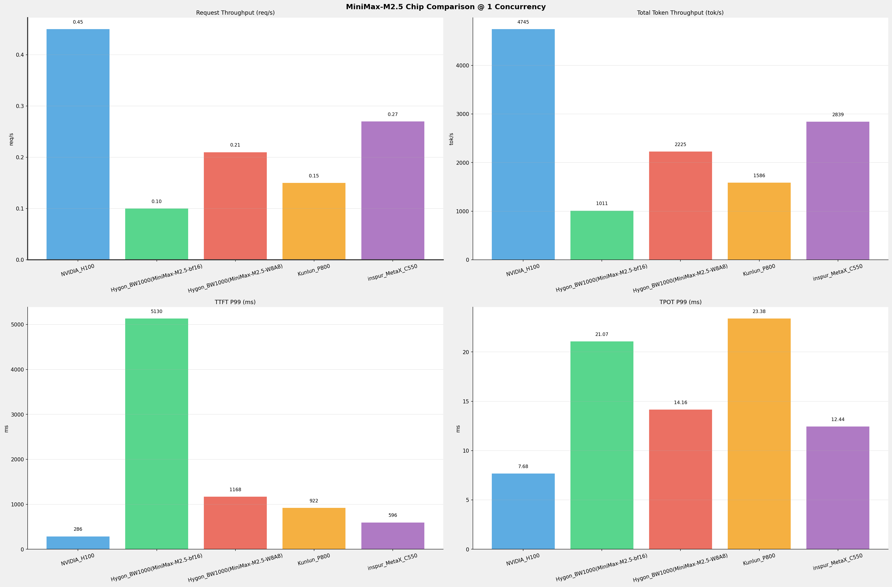
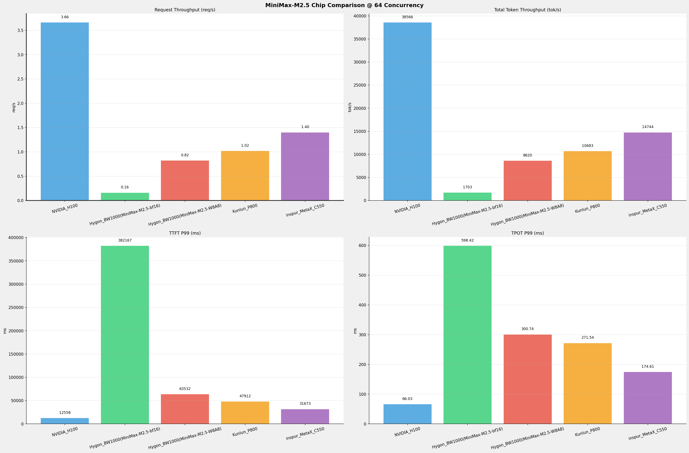
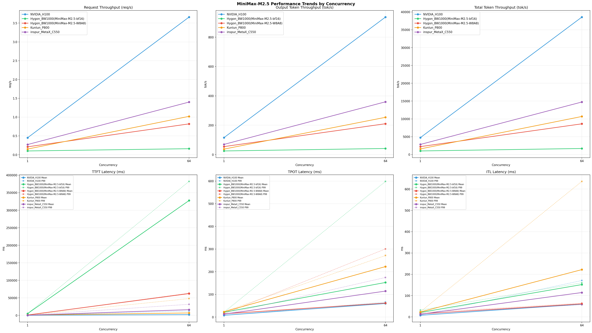

# MiniMax-M2.5模型在不同芯片下的benchmark基准测试报告

**测试日期：** 2026-06-09

---

## 测试场景
在固定请求数，输入上下文和输出上下文长度下，使用vllm bench serve工具对并发数逐级增加场景的性能基准验证。并对比同一模型在不同芯片环境上的性能指标。

**主要采集指标**：

| 指标                  | 单位         | 含义                                 |
|---------------------|------------|------------------------------------|
| TTFT                | ms         | Time To First Token，首 token 延迟     |
| TPOT                | ms/token   | Time Per Output Token，每 token 生成时间 |
| Throughput          | tokens/s   | 系统总吞吐                              |
| QPS                 | requests/s | 请求吞吐                               |
| P50/P95/P99 Latency | ms         | 延迟分位数                              |
    
### 📊 测试概览

| 项目            | 配置                                     | 备注  |
|---------------|----------------------------------------|-----|
| **数据集**       | random                                 |     |
| **并发数**       | 1, 2, 4, 8, 10, 16, 32, 64, 80, 128    |     |
| **总请求数**      | 320                                    |     |
| **请求输入上下文长度** | 10240（10k）                             |     |
| **请求输出上下文长度** | 256（0.25k）                             |     |
| **被测芯片**      | NVIDIA_H100, Hygon_BW1000(MiniMax-M2.5-bf16), Hygon_BW1000(MiniMax-M2.5-W8A8), Kunlun_P800, inspur_MetaX_C550 |     |
| **被测模型**      | MiniMax-M2.5 |     |

---

### 🤖 芯片和模型配置信息

| 参数名称 | **NVIDIA_H100** | **Hygon_BW1000(MiniMax-M2.5-bf16)** | **Hygon_BW1000(MiniMax-M2.5-W8A8)** | **Kunlun_P800** | **inspur_MetaX_C550** |
|----------|----------|----------|----------|----------|----------|
| **max_position_embeddings** | 196608 | 196608 | 196608 | 196608 | N/A |
| **model_name** | MiniMax-M2.5 | MiniMax-M2.5-bf16 | MiniMax-M2.5-W8A8 | MiniMax-M2.5-W8A8-INT8-Dynamic | N/A |
| **model_size** | 215G | 427G | 215G | 215G | N/A |
| **python_version** | 3.12.3 | 3.10.12 | 3.10.12 | 3.10.15 | N/A |
| **quantization_config** | FP8 | bf16 | int-8 | int-8 | N/A |
| **temperature** | 1.0 | N/A | N/A | 1.0 | N/A |
| **top_k** | 40 | N/A | N/A | 40 | N/A |
| **top_p** | 0.95 | N/A | N/A | 0.95 | N/A |
| **transformers_version** | 4.46.1 | 4.46.1 | 4.57.6 | 4.46.1 | N/A |
| **vllm_version** | 0.20.0 | 0.11.0+das.opt1.rc2.dtk2604.20260128.g0bf89b0c | 0.15.1+das.opt1.alpha.dtk2604 | 0.11.0 | N/A |

---

### ⚙️ vLLM启动配置信息

| 参数名称 | **NVIDIA_H100** | **Hygon_BW1000(MiniMax-M2.5-bf16)** | **Hygon_BW1000(MiniMax-M2.5-W8A8)** | **Kunlun_P800** | **inspur_MetaX_C550** |
|----------|----------|----------|----------|----------|----------|
| **Block Size** | default | default | default | 128 | N/A |
| **Compilation Config** | N/A | N/A | N/A | {"splitting_ops":["vllm.unified_attention","vllm.unified_attention_with_output","vllm.unified_attention_with_output_kunlun","vllm.mamba_mixer2","vllm.mamba_mixer","vllm.short_conv","vllm.linear_attention","vllm.plamo2_mamba_mixer","vllm.gdn_attention","vllm.sparse_attn_indexer","vllm.sparse_attn_indexer_vllm_kunlun"]} | N/A |
| **Dp** | 1 | 1 | 1 | 1 | N/A |
| **Dtype** | default | bfloat16 | bfloat16 | auto | N/A |
| **Enable Auto Tool Choice** | True | True | True | True | N/A |
| **Enable Export Parallel** | True | True | True | False | N/A |
| **Gpu Memory Utilization** | 0.85 | 0.98 | 0.9 | 0.95 | N/A |
| **Max Model Len** | 196608 | 196608 | 196608 | 196608 | N/A |
| **Max Num Batched Tokens** | 8192 | default | default | 8192 | N/A |
| **Max Num Seqs** | 64 | 64 | 64 | 64 | N/A |
| **Model Name** | MiniMax-M2.5 | MiniMax-M2.5-bf16 | MiniMax-M2.5-W8A8 | MiniMax-M2.5-W8A8-INT8-Dynamic | N/A |
| **Pp** | 1 | 1 | 1 | 1 | N/A |
| **Reasoning Parser** | minimax_m2 | minimax_m2 (不生效) | minimax_m2 (不生效) | minimax_m2 (不生效) | N/A |
| **Tool Call Parser** | minimax_m2 | minimax_m2 | minimax_m2 | minimax_m2 | N/A |
| **Tp** | 8 | 8 | 8 | 8 | N/A |

- **NVIDIA_H100**: 英伟达H100标准配置
- **Hygon_BW1000(MiniMax-M2.5-bf16)**: 海光芯片专家并行配置
- **Hygon_BW1000(MiniMax-M2.5-W8A8)**: 海光芯片专家并行配置
- **Kunlun_P800**: 昆仑芯不启用专家并行避免通信问题

---

### 📊 芯片性能对比柱状图

**1并发**

**64并发**

### 📈 性能趋势对比图 (所有芯片)

---

### 📈 各指标随并发级别性能对比详情

#### 请求吞吐量（Request throughput (req/s)）

| 并发数 | NVIDIA_H100(基准) | Hygon_BW1000(MiniMax-M2.5-bf16) | 相对基准 | Hygon_BW1000(MiniMax-M2.5-W8A8) | 相对基准 | Kunlun_P800 | 相对基准 | inspur_MetaX_C550 | 相对基准 |
|-----|----------- | ----------- | ----------- | ----------- | ----------- | ----------- | ----------- | ----------- | -----------|
| 1   | 0.45 | 0.10 | -77.8% | 0.21 | -53.3% | 0.15 | -66.7% | 0.27 | -40.0% |
| 64   | 3.66 | 0.16 | -95.6% | 0.82 | -77.6% | 1.02 | -72.1% | 1.40 | -61.7% |

#### 输出token吞吐量（Output token throughput (tok/s)）

| 并发数 | NVIDIA_H100(基准) | Hygon_BW1000(MiniMax-M2.5-bf16) | 相对基准 | Hygon_BW1000(MiniMax-M2.5-W8A8) | 相对基准 | Kunlun_P800 | 相对基准 | inspur_MetaX_C550 | 相对基准 |
|-----|----------- | ----------- | ----------- | ----------- | ----------- | ----------- | ----------- | ----------- | -----------|
| 1   | 115.31 | 24.66 | -78.6% | 54.28 | -52.9% | 37.20 | -67.7% | 69.26 | -39.9% |
| 64   | 937.16 | 41.54 | -95.6% | 210.25 | -77.6% | 253.92 | -72.9% | 359.62 | -61.6% |

#### 总token吞吐量（Total token throughput (tok/s)）

| 并发数 | NVIDIA_H100(基准) | Hygon_BW1000(MiniMax-M2.5-bf16) | 相对基准 | Hygon_BW1000(MiniMax-M2.5-W8A8) | 相对基准 | Kunlun_P800 | 相对基准 | inspur_MetaX_C550 | 相对基准 |
|-----|----------- | ----------- | ----------- | ----------- | ----------- | ----------- | ----------- | ----------- | -----------|
| 1   | 4745.14 | 1010.87 | -78.7% | 2225.40 | -53.1% | 1585.87 | -66.6% | 2839.48 | -40.2% |
| 64   | 38566.45 | 1702.94 | -95.6% | 8620.30 | -77.6% | 10682.97 | -72.3% | 14744.38 | -61.8% |

#### 首token延迟（P99 TTFT (ms)）

| 并发数 | NVIDIA_H100(基准) | Hygon_BW1000(MiniMax-M2.5-bf16) | 相对基准 | Hygon_BW1000(MiniMax-M2.5-W8A8) | 相对基准 | Kunlun_P800 | 相对基准 | inspur_MetaX_C550 | 相对基准 |
|-----|----------- | ----------- | ----------- | ----------- | ----------- | ----------- | ----------- | ----------- | -----------|
| 1   | 286.01 | 5130.17 | +1693.7% | 1168.49 | +308.5% | 921.76 | +222.3% | 596.38 | +108.5% |
| 64   | 12557.76 | 382166.79 | +2943.3% | 63531.55 | +405.9% | 47912.19 | +281.5% | 31672.66 | +152.2% |

#### 每token生成时间（P99 TPOT (ms)）

| 并发数 | NVIDIA_H100(基准) | Hygon_BW1000(MiniMax-M2.5-bf16) | 相对基准 | Hygon_BW1000(MiniMax-M2.5-W8A8) | 相对基准 | Kunlun_P800 | 相对基准 | inspur_MetaX_C550 | 相对基准 |
|-----|----------- | ----------- | ----------- | ----------- | ----------- | ----------- | ----------- | ----------- | -----------|
| 1   | 7.68 | 21.07 | +174.3% | 14.16 | +84.4% | 23.38 | +204.4% | 12.44 | +62.0% |
| 64   | 66.03 | 598.42 | +806.3% | 300.74 | +355.5% | 271.54 | +311.2% | 174.61 | +164.4% |

#### token间延迟（P99 ITL (ms)）

| 并发数 | NVIDIA_H100(基准) | Hygon_BW1000(MiniMax-M2.5-bf16) | 相对基准 | Hygon_BW1000(MiniMax-M2.5-W8A8) | 相对基准 | Kunlun_P800 | 相对基准 | inspur_MetaX_C550 | 相对基准 |
|-----|----------- | ----------- | ----------- | ----------- | ----------- | ----------- | ----------- | ----------- | -----------|
| 1   | 8.57 | 32.03 | +273.7% | 20.17 | +135.4% | 24.07 | +180.9% | 14.88 | +73.6% |
| 64   | 170.95 | 160.09 | -6.4% | 64.72 | -62.1% | 635.84 | +271.9% | 57.22 | -66.5% |

### 📈 各并发级别性能对比详情

### 1 并发

#### 服务基准结果

| 指标 | NVIDIA_H100 | NVIDIA_H100差异 | Hygon_BW1000(MiniMax-M2.5-bf16) | Hygon_BW1000(MiniMax-M2.5-bf16)差异 | Hygon_BW1000(MiniMax-M2.5-W8A8) | Hygon_BW1000(MiniMax-M2.5-W8A8)差异 | Kunlun_P800 | Kunlun_P800差异 | inspur_MetaX_C550 | inspur_MetaX_C550差异 |
|------|----------- | ----------- | ----------- | ----------- | ----------- | ----------- | ----------- | ----------- | ----------- | -----------|
| 成功请求数 | 320 | - | 320 | +0.0% | 320 | +0.0% | 320 | +0.0% | 320 | +0.0% |
| 失败请求数 | 0 | - | 0 | - | 0 | - | 0 | - | 0 | - |
| 测试持续时间 (s) | 710.45 | - | 3322.61 | +367.7% | 1509.26 | +112.4% | 2115.85 | +197.8% | 1182.87 | +66.5% |
| 总输入 tokens | 3289280 | - | 3276800 | -0.4% | 3276800 | -0.4% | 3276748 | -0.4% | 3276800 | -0.4% |
| 总生成 tokens | 81920 | - | 81920 | +0.0% | 81920 | +0.0% | 78707 | -3.9% | 81920 | +0.0% |
| **请求吞吐量 (req/s)** | **0.45** ⭐ | - | 0.10 | -77.8% | 0.21 | -53.3% | 0.15 | -66.7% | 0.27 | -40.0% |
| **输出 token 吞吐量 (tok/s)** | **115.31** ⭐ | - | 24.66 | -78.6% | 54.28 | -52.9% | 37.20 | -67.7% | 69.26 | -39.9% |
| 峰值输出 token 吞吐量 (tok/s) | **132.00** ⭐ | - | 50.00 | -62.1% | 72.00 | -45.5% | 44.00 | -66.7% | 81.00 | -38.6% |
| 峰值并发请求数 | 2.00 | - | 2.00 | +0.0% | 2.00 | +0.0% | 2.00 | +0.0% | 2 | +0.0% |
| **总 token 吞吐量 (tok/s)** | **4745.14** ⭐ | - | 1010.87 | -78.7% | 2225.40 | -53.1% | 1585.87 | -66.6% | 2839.48 | -40.2% |

#### 首Token延迟 (TTFT)

| 指标 | NVIDIA_H100 | NVIDIA_H100差异 | Hygon_BW1000(MiniMax-M2.5-bf16) | Hygon_BW1000(MiniMax-M2.5-bf16)差异 | Hygon_BW1000(MiniMax-M2.5-W8A8) | Hygon_BW1000(MiniMax-M2.5-W8A8)差异 | Kunlun_P800 | Kunlun_P800差异 | inspur_MetaX_C550 | inspur_MetaX_C550差异 |
|------|----------- | ----------- | ----------- | ----------- | ----------- | ----------- | ----------- | ----------- | ----------- | -----------|
| 平均 TTFT (ms) | **264.19** ⭐ | - | 5026.61 | +1802.6% | 1112.21 | +321.0% | 898.33 | +240.0% | 530.76 | +100.9% |
| 中位 TTFT (ms) | **264.45** ⭐ | - | 5041.22 | +1806.3% | 1111.97 | +320.5% | 901.43 | +240.9% | 525.81 | +98.8% |
| P95 TTFT (ms) | **275.76** ⭐ | - | 5072.83 | +1739.6% | 1127.95 | +309.0% | 915.80 | +232.1% | 0 | -100.0% |
| P99 TTFT (ms) | **286.01** ⭐ | - | 5130.17 | +1693.7% | 1168.49 | +308.5% | 921.76 | +222.3% | 596.38 | +108.5% |

#### 每Token生成时间 (TPOT)

| 指标 | NVIDIA_H100 | NVIDIA_H100差异 | Hygon_BW1000(MiniMax-M2.5-bf16) | Hygon_BW1000(MiniMax-M2.5-bf16)差异 | Hygon_BW1000(MiniMax-M2.5-W8A8) | Hygon_BW1000(MiniMax-M2.5-W8A8)差异 | Kunlun_P800 | Kunlun_P800差异 | inspur_MetaX_C550 | inspur_MetaX_C550差异 |
|------|----------- | ----------- | ----------- | ----------- | ----------- | ----------- | ----------- | ----------- | ----------- | -----------|
| 平均 TPOT (ms) | **7.67** ⭐ | - | 21.00 | +173.8% | 14.13 | +84.2% | 23.32 | +204.0% | 12.41 | +61.8% |
| 中位 TPOT (ms) | **7.67** ⭐ | - | 21.01 | +173.9% | 14.13 | +84.2% | 23.32 | +204.0% | 12.41 | +61.8% |
| P95 TPOT (ms) | **7.68** ⭐ | - | 21.05 | +174.1% | 14.15 | +84.2% | 23.36 | +204.2% | 0 | -100.0% |
| P99 TPOT (ms) | **7.68** ⭐ | - | 21.07 | +174.3% | 14.16 | +84.4% | 23.38 | +204.4% | 12.44 | +62.0% |

#### Token间延迟 (ITL)

| 指标 | NVIDIA_H100 | NVIDIA_H100差异 | Hygon_BW1000(MiniMax-M2.5-bf16) | Hygon_BW1000(MiniMax-M2.5-bf16)差异 | Hygon_BW1000(MiniMax-M2.5-W8A8) | Hygon_BW1000(MiniMax-M2.5-W8A8)差异 | Kunlun_P800 | Kunlun_P800差异 | inspur_MetaX_C550 | inspur_MetaX_C550差异 |
|------|----------- | ----------- | ----------- | ----------- | ----------- | ----------- | ----------- | ----------- | ----------- | -----------|
| 平均 ITL (ms) | **7.70** ⭐ | - | 20.97 | +172.3% | 14.14 | +83.6% | 23.26 | +202.1% | 12.41 | +61.2% |
| 中位 ITL (ms) | **7.69** ⭐ | - | 21.00 | +173.1% | 14.13 | +83.7% | 23.31 | +203.1% | 12.41 | +61.4% |
| P95 ITL (ms) | **7.83** ⭐ | - | 21.70 | +177.1% | 14.47 | +84.8% | 23.49 | +200.0% | 12.45 | +59.0% |
| P99 ITL (ms) | **8.57** ⭐ | - | 32.03 | +273.7% | 20.17 | +135.4% | 24.07 | +180.9% | 14.88 | +73.6% |

---

### 64 并发

#### 服务基准结果

| 指标 | NVIDIA_H100 | NVIDIA_H100差异 | Hygon_BW1000(MiniMax-M2.5-bf16) | Hygon_BW1000(MiniMax-M2.5-bf16)差异 | Hygon_BW1000(MiniMax-M2.5-W8A8) | Hygon_BW1000(MiniMax-M2.5-W8A8)差异 | Kunlun_P800 | Kunlun_P800差异 | inspur_MetaX_C550 | inspur_MetaX_C550差异 |
|------|----------- | ----------- | ----------- | ----------- | ----------- | ----------- | ----------- | ----------- | ----------- | -----------|
| 成功请求数 | 320 | - | 320 | +0.0% | 320 | +0.0% | 320 | +0.0% | 320 | +0.0% |
| 失败请求数 | 0 | - | 0 | - | 0 | - | 0 | - | 0 | - |
| 测试持续时间 (s) | 87.41 | - | 1972.31 | +2156.4% | 389.63 | +345.7% | 314.19 | +259.4% | 227.80 | +160.6% |
| 总输入 tokens | 3289280 | - | 3276800 | -0.4% | 3276800 | -0.4% | 3276748 | -0.4% | 3276800 | -0.4% |
| 总生成 tokens | 81920 | - | 81920 | +0.0% | 81920 | +0.0% | 79780 | -2.6% | 81920 | +0.0% |
| **请求吞吐量 (req/s)** | **3.66** ⭐ | - | 0.16 | -95.6% | 0.82 | -77.6% | 1.02 | -72.1% | 1.40 | -61.7% |
| **输出 token 吞吐量 (tok/s)** | **937.16** ⭐ | - | 41.54 | -95.6% | 210.25 | -77.6% | 253.92 | -72.9% | 359.62 | -61.6% |
| 峰值输出 token 吞吐量 (tok/s) | **2878.00** ⭐ | - | 253.00 | -91.2% | 1279.00 | -55.6% | 1024.00 | -64.4% | 1216.00 | -57.7% |
| 峰值并发请求数 | 72.00 | - | 86.00 | +19.4% | 128.00 | +77.8% | 68.00 | -5.6% | 128 | +77.8% |
| **总 token 吞吐量 (tok/s)** | **38566.45** ⭐ | - | 1702.94 | -95.6% | 8620.30 | -77.6% | 10682.97 | -72.3% | 14744.38 | -61.8% |

#### 首Token延迟 (TTFT)

| 指标 | NVIDIA_H100 | NVIDIA_H100差异 | Hygon_BW1000(MiniMax-M2.5-bf16) | Hygon_BW1000(MiniMax-M2.5-bf16)差异 | Hygon_BW1000(MiniMax-M2.5-W8A8) | Hygon_BW1000(MiniMax-M2.5-W8A8)差异 | Kunlun_P800 | Kunlun_P800差异 | inspur_MetaX_C550 | inspur_MetaX_C550差异 |
|------|----------- | ----------- | ----------- | ----------- | ----------- | ----------- | ----------- | ----------- | ----------- | -----------|
| 平均 TTFT (ms) | **2119.88** ⭐ | - | 327678.89 | +15357.4% | 62196.04 | +2833.9% | 6916.51 | +226.3% | 16337.99 | +670.7% |
| 中位 TTFT (ms) | **981.41** ⭐ | - | 381111.53 | +38733.1% | 63499.67 | +6370.2% | 2495.19 | +154.2% | 16436.43 | +1574.8% |
| P95 TTFT (ms) | **10055.31** ⭐ | - | 382160.76 | +3700.6% | 63528.23 | +531.8% | 38095.53 | +278.9% | 0 | -100.0% |
| P99 TTFT (ms) | **12557.76** ⭐ | - | 382166.79 | +2943.3% | 63531.55 | +405.9% | 47912.19 | +281.5% | 31672.66 | +152.2% |

#### 每Token生成时间 (TPOT)

| 指标 | NVIDIA_H100 | NVIDIA_H100差异 | Hygon_BW1000(MiniMax-M2.5-bf16) | Hygon_BW1000(MiniMax-M2.5-bf16)差异 | Hygon_BW1000(MiniMax-M2.5-W8A8) | Hygon_BW1000(MiniMax-M2.5-W8A8)差异 | Kunlun_P800 | Kunlun_P800差异 | inspur_MetaX_C550 | inspur_MetaX_C550差异 |
|------|----------- | ----------- | ----------- | ----------- | ----------- | ----------- | ----------- | ----------- | ----------- | -----------|
| 平均 TPOT (ms) | **59.72** ⭐ | - | 152.48 | +155.3% | 61.63 | +3.2% | 222.66 | +272.8% | 114.49 | +91.7% |
| 中位 TPOT (ms) | 63.77 | - | 122.23 | +91.7% | **57.08** ⭐ | -10.5% | 241.15 | +278.2% | 114.32 | +79.3% |
| P95 TPOT (ms) | 64.94 | - | 513.83 | +691.2% | **57.35** ⭐ | -11.7% | 253.91 | +291.0% | 0 | -100.0% |
| P99 TPOT (ms) | **66.03** ⭐ | - | 598.42 | +806.3% | 300.74 | +355.5% | 271.54 | +311.2% | 174.61 | +164.4% |

#### Token间延迟 (ITL)

| 指标 | NVIDIA_H100 | NVIDIA_H100差异 | Hygon_BW1000(MiniMax-M2.5-bf16) | Hygon_BW1000(MiniMax-M2.5-bf16)差异 | Hygon_BW1000(MiniMax-M2.5-W8A8) | Hygon_BW1000(MiniMax-M2.5-W8A8)差异 | Kunlun_P800 | Kunlun_P800差异 | inspur_MetaX_C550 | inspur_MetaX_C550差异 |
|------|----------- | ----------- | ----------- | ----------- | ----------- | ----------- | ----------- | ----------- | ----------- | -----------|
| 平均 ITL (ms) | **60.01** ⭐ | - | 151.88 | +153.1% | 61.39 | +2.3% | 222.08 | +270.1% | 114.49 | +90.8% |
| 中位 ITL (ms) | **22.71** ⭐ | - | 103.35 | +355.1% | 57.35 | +152.5% | 65.24 | +187.3% | 54.66 | +140.7% |
| P95 ITL (ms) | 166.68 | - | 118.51 | -28.9% | 59.07 | -64.6% | 631.09 | +278.6% | **56.15** ⭐ | -66.3% |
| P99 ITL (ms) | 170.95 | - | 160.09 | -6.4% | 64.72 | -62.1% | 635.84 | +271.9% | **57.22** ⭐ | -66.5% |

---

---

*报告生成时间: 2026-06-09*

