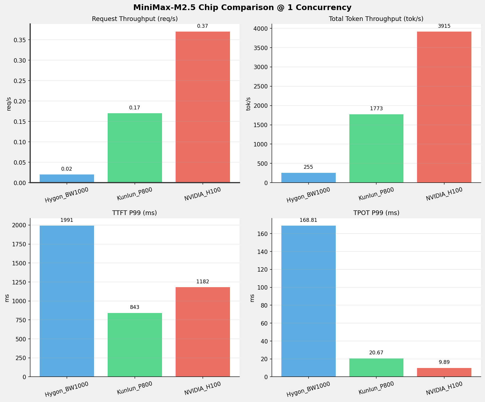
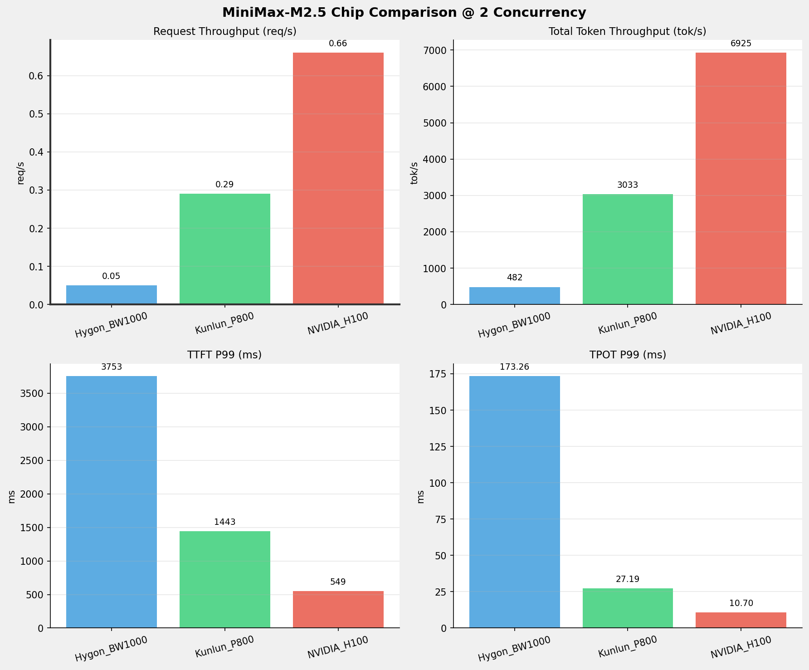
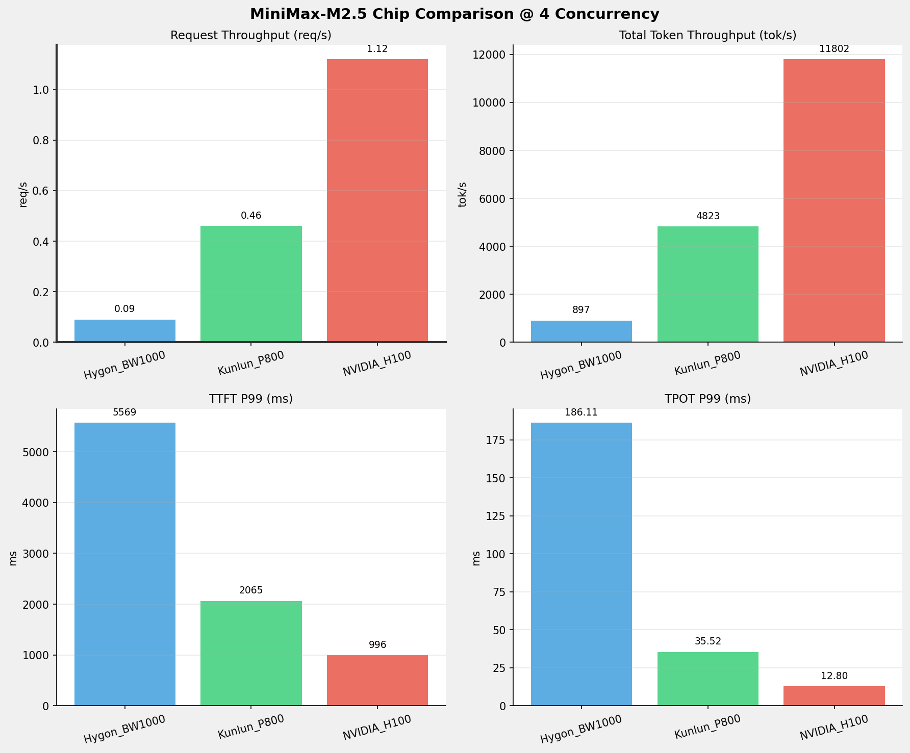
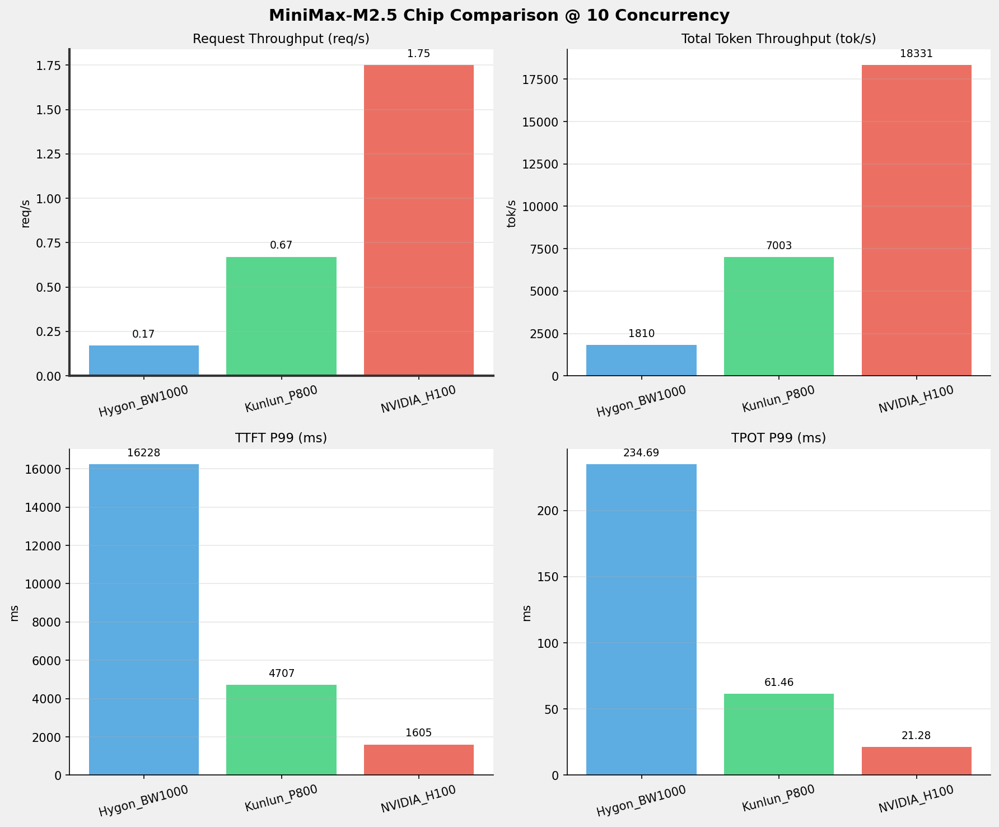
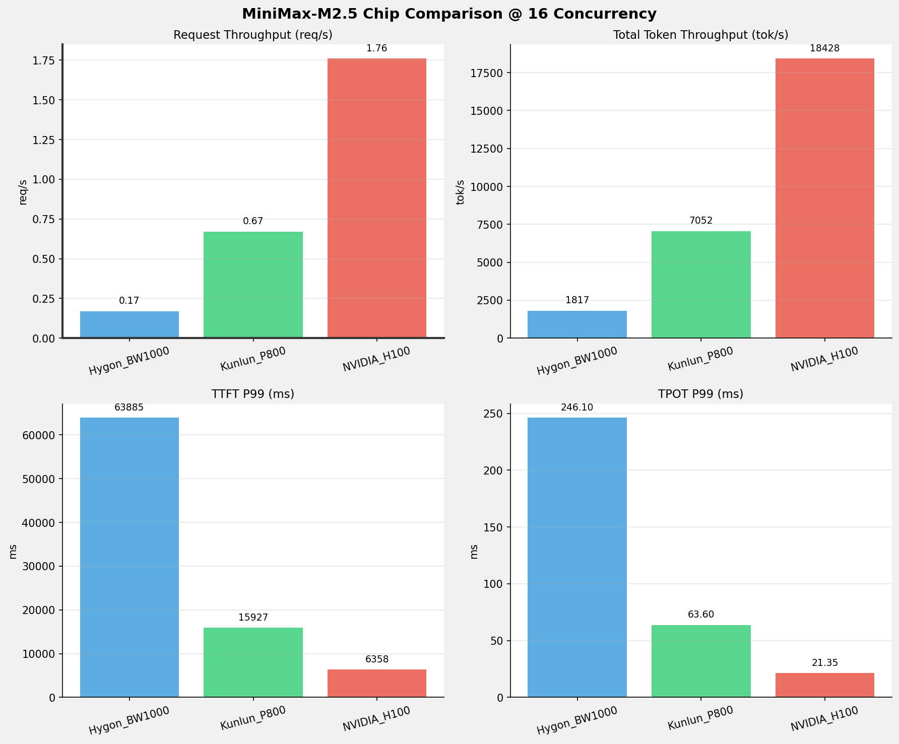
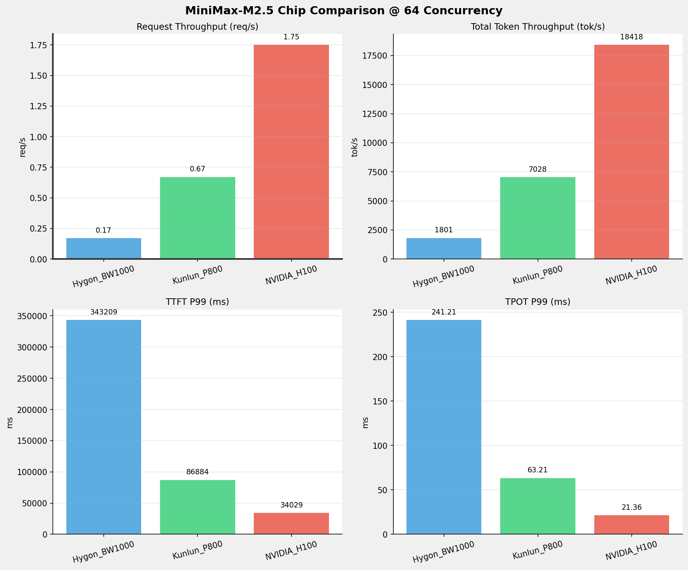
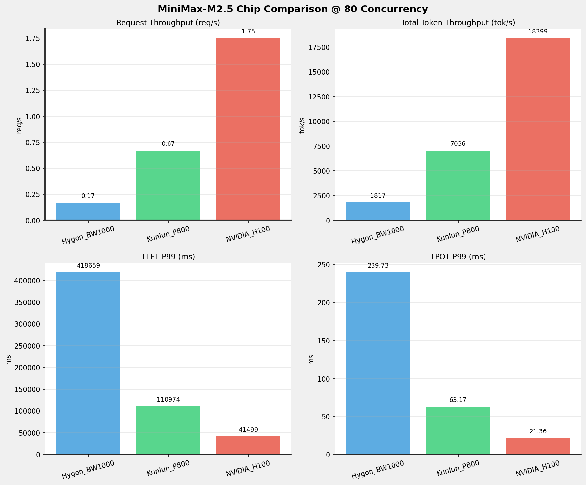

# MiniMax-M2.5模型在不同芯片下的benchmark基准测试报告

**测试日期：** 2026-03-25

---

## 测试场景
在固定请求数，输入上下文和输出上下文长度下，使用vllm bench serve工具对并发数逐级增加场景的性能基准验证，并对比同一模型在不同芯片环境上的性能指标。

**主要采集指标**：

| 指标                  | 单位         | 含义                                 |
|---------------------|------------|------------------------------------|
| TTFT                | ms         | Time To First Token，首 token 延迟     |
| TPOT                | ms/token   | Time Per Output Token，每 token 生成时间 |
| Throughput          | tokens/s   | 系统总吞吐                              |
| QPS                 | requests/s | 请求吞吐                               |
| P50/P95/P99 Latency | ms         | 延迟分位数                              |

## 📊 测试概览

| 项目            | 配置                                     | 备注  |
|---------------|----------------------------------------|-----|
| **数据集**       | random                                 |     |
| **并发数**       | 1, 2, 4, 8, 10, 16, 32, 64, 80, 128    |     |
| **总请求数**      | 320                                    |     |
| **请求输入上下文长度** | 10240（10k）                             |     |
| **请求输出上下文长度** | 256（0.25k）                             |     |
| **模型**        | MiniMax-M2.5                           |     |
| **被测芯片**      | Hygon_BW1000, Kunlun_P800, NVIDIA_H100 |     |

---

## 🤖 芯片和模型配置信息

| 芯片名称             | 模型精度              | vLLM版本                                         | Python版本 | 备注         |
|------------------|-------------------|------------------------------------------------|----------|------------|
| **Hygon_BW1000** | BF16 | 0.11.0+das.opt1.rc2.dtk2604.20260128.g0bf89b0c | 3.10.12 | 海光BW1000芯片 |
| **Kunlun_P800** | W8A8-INT8-Dynamic | 0.11.0 | 3.10.15 | 昆仑芯P800芯片 |
| **NVIDIA_H100** | FP16 | 0.15.1 | 3.12.3 | 英伟达H100芯片 |

---

## 🤖 vLLM启动配置信息

| 参数名称                   | **Hygon_BW1000** | **Kunlun_P800** | **NVIDIA_H100** |
|------------------------|------------------|------------------|------------------|
| max-model-len | 196608 | 196608 | 196608 |
| max-num-seqs | 10 | 10 | 10 |
| max-num-batched-tokens | 8192 | 8192 | 8192 |
| gpu-memory-utilization | 0.95 | 0.95 | 0.85 |
| dp | 1 | 1 | 1 |
| tp | 8 | 8 | 8 |
| pp | 1 | 1 | 1 |
| enable-export-parallel | True | False | True |
| tool-call-parser | minimax_m2 | minimax_m2 | minimax_m2 |
| reasoning-parser | minimax_m2 (不生效) | minimax_m2 (不生效) | minimax_m2 |

**问题说明：** 
1. 思考模式问题  
对于思考模式的启动参数，海光和昆仑芯片按照--reasoning-parser minimax_m2启动后，响应内容依然是直接写入到content里，而不是写入到<think>标签里。
 
 
**解决方案**  
    - 昆仑芯：建议参数变更为 --reasoning-parser_appened_think minimax_m2  
    验证结果：变更后，<think>标签出现了，不过按照_appened_think的这个设计，<think>标签的内容会被合并到content里, 由此带来另一个问题是tool_call工具调用无法工作
    - 海光：后续修复，修复后重新传镜像  
    验证结果：待修复后验证
 
 
2. 专家并行启动
昆仑芯在TP=8下，若启动专家并行模式，这种情况下是双重高强度通信叠加，在 BKCL / XCCL 上，非常容易出现以下问题：
    - buffer size 计算错误
    - rank 不一致
    - 通信 hang / 越界 （实际测试确实遇到了该问题） 
    
    **解决方案** 
    不启用专家并行

---

## 📈 Performance by Concurrency

### 1 Concurrency

#### Benchmark Result

| 指标                       | Hygon_BW1000 | Kunlun_P800 | NVIDIA_H100   |
|--------------------------|--------------|-------------|---------------|
| 成功请求数                    | 320          | 320         | 320           |
| 失败请求数                    | 0            | 0           | 0             |
| 测试持续时间 (s)               | 13148.00     | 1892.60     | 857.88        |
| 总输入 tokens               | 3276748      | 3276748     | 3276800       |
| 总生成 tokens               | 80226        | 79410       | 81920         |
| **请求吞吐量 (req/s)**        | 0.02         | 0.17        | **0.37** ⭐    |
| **输出 token 吞吐量 (tok/s)** | 6.10         | 41.96       | **95.49** ⭐   |
| 峰值输出 token 吞吐量 (tok/s)   | 8.00         | 50.00       | **110.00** ⭐  |
| 峰值并发请求数                  | 2.00         | 2.00        | 2.00          |
| **总 token 吞吐量 (tok/s)**  | 255.32       | 1773.30     | **3915.14** ⭐ |

#### Time to First Token (TTFT)

| 指标 | Hygon_BW1000 | Kunlun_P800 | NVIDIA_H100 |
|------|----------- | ----------- | -----------|
| 平均 TTFT (ms) | 1958.35 | 817.94 | **321.42** ⭐ |
| 中位 TTFT (ms) | 1964.30 | 824.23 | **306.62** ⭐ |
| P95 TTFT (ms) | 1977.98 | 835.94 | **313.59** ⭐ |
| P99 TTFT (ms) | 1990.88 | **842.86** ⭐ | 1181.54 |

#### Time per Output Token (TPOT)

| 指标 | Hygon_BW1000 | Kunlun_P800 | NVIDIA_H100 |
|------|----------- | ----------- | -----------|
| 平均 TPOT (ms) | 156.69 | 20.62 | **9.25** ⭐ |
| 中位 TPOT (ms) | 156.16 | 20.62 | **9.23** ⭐ |
| P95 TPOT (ms) | 163.40 | 20.65 | **9.23** ⭐ |
| P99 TPOT (ms) | 168.81 | 20.67 | **9.89** ⭐ |

#### Inter-token Latency (ITL)

| 指标 | Hygon_BW1000 | Kunlun_P800 | NVIDIA_H100 |
|------|----------- | ----------- | -----------|
| 平均 ITL (ms) | 156.23 | 20.56 | **9.23** ⭐ |
| 中位 ITL (ms) | 155.76 | 20.60 | **9.22** ⭐ |
| P95 ITL (ms) | 162.28 | 20.77 | **9.41** ⭐ |
| P99 ITL (ms) | 191.32 | 21.22 | **9.90** ⭐ |

---

### 2 Concurrency

#### Benchmark Result

| 指标                       | Hygon_BW1000 | Kunlun_P800 | NVIDIA_H100   |
|--------------------------|--------------|-------------|---------------|
| 成功请求数                    | 320          | 320         | 320           |
| 失败请求数                    | 0            | 0           | 0             |
| 测试持续时间 (s)               | 6965.73      | 1106.64     | 485.01        |
| 总输入 tokens               | 3276748      | 3276748     | 3276800       |
| 总生成 tokens               | 80297        | 79281       | 81920         |
| **请求吞吐量 (req/s)**        | 0.05         | 0.29        | **0.66** ⭐    |
| **输出 token 吞吐量 (tok/s)** | 11.53        | 71.64       | **168.90** ⭐  |
| 峰值输出 token 吞吐量 (tok/s)   | 15.00        | 93.00       | **207.00** ⭐  |
| 峰值并发请求数                  | 4.00         | 4.00        | 4.00          |
| **总 token 吞吐量 (tok/s)**  | 481.94       | 3032.63     | **6925.05** ⭐ |

#### Time to First Token (TTFT)

| 指标 | Hygon_BW1000 | Kunlun_P800 | NVIDIA_H100 |
|------|----------- | ----------- | -----------|
| 平均 TTFT (ms) | 2052.00 | 874.08 | **427.60** ⭐ |
| 中位 TTFT (ms) | 2024.87 | 833.51 | **418.60** ⭐ |
| P95 TTFT (ms) | 2038.41 | 1182.06 | **545.11** ⭐ |
| P99 TTFT (ms) | 3752.70 | 1442.65 | **549.04** ⭐ |

#### Time per Output Token (TPOT)

| 指标 | Hygon_BW1000 | Kunlun_P800 | NVIDIA_H100 |
|------|----------- | ----------- | -----------|
| 平均 TPOT (ms) | 165.84 | 24.43 | **10.21** ⭐ |
| 中位 TPOT (ms) | 166.01 | 24.54 | **10.22** ⭐ |
| P95 TPOT (ms) | 168.30 | 25.69 | **10.69** ⭐ |
| P99 TPOT (ms) | 173.26 | 27.19 | **10.70** ⭐ |

#### Inter-token Latency (ITL)

| 指标 | Hygon_BW1000 | Kunlun_P800 | NVIDIA_H100 |
|------|----------- | ----------- | -----------|
| 平均 ITL (ms) | 165.31 | 24.46 | **10.18** ⭐ |
| 中位 ITL (ms) | 158.87 | 21.87 | **9.75** ⭐ |
| P95 ITL (ms) | 164.70 | 22.10 | **9.91** ⭐ |
| P99 ITL (ms) | 168.68 | 55.05 | **10.48** ⭐ |

---

### 4 Concurrency

#### Benchmark Result

| 指标                       | Hygon_BW1000 | Kunlun_P800 | NVIDIA_H100    |
|--------------------------|--------------|-------------|----------------|
| 成功请求数                    | 320          | 320         | 320            |
| 失败请求数                    | 0            | 0           | 0              |
| 测试持续时间 (s)               | 3741.16      | 696.02      | 284.59         |
| 总输入 tokens               | 3276748      | 3276748     | 3276800        |
| 总生成 tokens               | 80266        | 79960       | 81920          |
| **请求吞吐量 (req/s)**        | 0.09         | 0.46        | **1.12** ⭐     |
| **输出 token 吞吐量 (tok/s)** | 21.45        | 114.88      | **287.86** ⭐   |
| 峰值输出 token 吞吐量 (tok/s)   | 29.00        | 173.00      | **401.00** ⭐   |
| 峰值并发请求数                  | 7.00         | 7.00        | 8.00           |
| **总 token 吞吐量 (tok/s)**  | 897.32       | 4822.70     | **11802.07** ⭐ |

#### Time to First Token (TTFT)

| 指标 | Hygon_BW1000 | Kunlun_P800 | NVIDIA_H100 |
|------|----------- | ----------- | -----------|
| 平均 TTFT (ms) | 2185.58 | 930.47 | **694.79** ⭐ |
| 中位 TTFT (ms) | 2038.85 | 843.28 | **666.62** ⭐ |
| P95 TTFT (ms) | 3821.77 | 1458.49 | **992.60** ⭐ |
| P99 TTFT (ms) | 5568.67 | 2064.95 | **995.93** ⭐ |

#### Time per Output Token (TPOT)

| 指标 | Hygon_BW1000 | Kunlun_P800 | NVIDIA_H100 |
|------|----------- | ----------- | -----------|
| 平均 TPOT (ms) | 177.49 | 31.10 | **11.22** ⭐ |
| 中位 TPOT (ms) | 177.87 | 31.38 | **11.32** ⭐ |
| P95 TPOT (ms) | 183.40 | 34.01 | **12.78** ⭐ |
| P99 TPOT (ms) | 186.11 | 35.52 | **12.80** ⭐ |

#### Inter-token Latency (ITL)

| 指标 | Hygon_BW1000 | Kunlun_P800 | NVIDIA_H100 |
|------|----------- | ----------- | -----------|
| 平均 ITL (ms) | 176.98 | 31.29 | **11.19** ⭐ |
| 中位 ITL (ms) | 157.22 | 23.38 | **10.08** ⭐ |
| P95 ITL (ms) | 162.59 | 24.17 | **10.33** ⭐ |
| P99 ITL (ms) | 1872.44 | 534.67 | **11.28** ⭐ |

---

### 8 Concurrency

#### Benchmark Result

| 指标 | Hygon_BW1000 | Kunlun_P800 | NVIDIA_H100 |
|------|----------- | ----------- | -----------|
| 成功请求数 | 320 | 320 | 320 |
| 失败请求数 |  |  | 0 |
| 测试持续时间 (s) | 2176.31 | 508.44 | 196.85 |
| 总输入 tokens | 3276748 | 3276748 | 3276800 |
| 总生成 tokens | 80442 | 78888 | 81920 |
| **请求吞吐量 (req/s)** | 0.15 | 0.63 | **1.63** ⭐ |
| **输出 token 吞吐量 (tok/s)** | 36.96 | 155.16 | **416.15** ⭐ |
| 峰值输出 token 吞吐量 (tok/s) | 59.00 | 280.00 | **680.00** ⭐ |
| 峰值并发请求数 | 15.00 | 13.00 | 16.00 |
| **总 token 吞吐量 (tok/s)** | 1542.60 | 6599.86 | **17062.16** ⭐ |

#### Time to First Token (TTFT)

| 指标 | Hygon_BW1000 | Kunlun_P800 | NVIDIA_H100 |
|------|----------- | ----------- | -----------|
| 平均 TTFT (ms) | 3297.61 | 1140.45 | **961.02** ⭐ |
| 中位 TTFT (ms) | 2089.60 | **847.01** ⭐ | 1023.59 |
| P95 TTFT (ms) | 10888.09 | 2055.50 | **1474.23** ⭐ |
| P99 TTFT (ms) | 13004.02 | 3816.59 | **1603.43** ⭐ |

#### Time per Output Token (TPOT)

| 指标 | Hygon_BW1000 | Kunlun_P800 | NVIDIA_H100 |
|------|----------- | ----------- | -----------|
| 平均 TPOT (ms) | 201.95 | 46.86 | **15.53** ⭐ |
| 中位 TPOT (ms) | 205.98 | 47.37 | **15.30** ⭐ |
| P95 TPOT (ms) | 212.79 | 50.43 | **18.09** ⭐ |
| P99 TPOT (ms) | 221.53 | 56.20 | **18.14** ⭐ |

#### Inter-token Latency (ITL)

| 指标 | Hygon_BW1000 | Kunlun_P800 | NVIDIA_H100 |
|------|----------- | ----------- | -----------|
| 平均 ITL (ms) | 201.36 | 47.59 | **15.48** ⭐ |
| 中位 ITL (ms) | 157.25 | 29.16 | **11.93** ⭐ |
| P95 ITL (ms) | 163.19 | 60.47 | **12.35** ⭐ |
| P99 ITL (ms) | 1931.02 | 541.52 | **187.51** ⭐ |

---

### 10 Concurrency

#### Benchmark Result

| 指标 | Hygon_BW1000 | Kunlun_P800 | NVIDIA_H100 |
|------|----------- | ----------- | -----------|
| 成功请求数 | 320 | 320 | 320 |
| 失败请求数 |  |  | 0 |
| 测试持续时间 (s) | 1854.59 | 479.27 | 183.23 |
| 总输入 tokens | 3276748 | 3276748 | 3276800 |
| 总生成 tokens | 80517 | 79598 | 81920 |
| **请求吞吐量 (req/s)** | 0.17 | 0.67 | **1.75** ⭐ |
| **输出 token 吞吐量 (tok/s)** | 43.42 | 166.08 | **447.09** ⭐ |
| 峰值输出 token 吞吐量 (tok/s) | 73.00 | 311.00 | **759.00** ⭐ |
| 峰值并发请求数 | 16.00 | 15.00 | 18.00 |
| **总 token 吞吐量 (tok/s)** | 1810.25 | 7003.02 | **18330.76** ⭐ |

#### Time to First Token (TTFT)

| 指标 | Hygon_BW1000 | Kunlun_P800 | NVIDIA_H100 |
|------|----------- | ----------- | -----------|
| 平均 TTFT (ms) | 3593.83 | 1232.27 | **1012.23** ⭐ |
| 中位 TTFT (ms) | 2084.97 | **859.67** ⭐ | 1139.42 |
| P95 TTFT (ms) | 10884.20 | 2782.24 | **1398.62** ⭐ |
| P99 TTFT (ms) | 16227.56 | 4707.14 | **1604.56** ⭐ |

#### Time per Output Token (TPOT)

| 指标 | Hygon_BW1000 | Kunlun_P800 | NVIDIA_H100 |
|------|----------- | ----------- | -----------|
| 平均 TPOT (ms) | 214.72 | 55.09 | **18.48** ⭐ |
| 中位 TPOT (ms) | 219.17 | 56.07 | **17.95** ⭐ |
| P95 TPOT (ms) | 227.12 | 59.03 | **21.21** ⭐ |
| P99 TPOT (ms) | 234.69 | 61.46 | **21.28** ⭐ |

#### Inter-token Latency (ITL)

| 指标 | Hygon_BW1000 | Kunlun_P800 | NVIDIA_H100 |
|------|----------- | ----------- | -----------|
| 平均 ITL (ms) | 214.01 | 54.93 | **18.42** ⭐ |
| 中位 ITL (ms) | 157.32 | 32.95 | **13.38** ⭐ |
| P95 ITL (ms) | 163.94 | 188.79 | **14.18** ⭐ |
| P99 ITL (ms) | 1924.45 | 542.02 | **190.68** ⭐ |

---

### 16 Concurrency

#### Benchmark Result

| 指标 | Hygon_BW1000 | Kunlun_P800 | NVIDIA_H100 |
|------|----------- | ----------- | -----------|
| 成功请求数 | 320 | 320 | 320 |
| 失败请求数 |  |  | 0 |
| 测试持续时间 (s) | 1847.45 | 475.87 | 182.26 |
| 总输入 tokens | 3276748 | 3276748 | 3276800 |
| 总生成 tokens | 80132 | 79221 | 81920 |
| **请求吞吐量 (req/s)** | 0.17 | 0.67 | **1.76** ⭐ |
| **输出 token 吞吐量 (tok/s)** | 43.37 | 166.48 | **449.46** ⭐ |
| 峰值输出 token 吞吐量 (tok/s) | 71.00 | 311.00 | **760.00** ⭐ |
| 峰值并发请求数 | 20.00 | 18.00 | 22.00 |
| **总 token 吞吐量 (tok/s)** | 1817.04 | 7052.24 | **18427.76** ⭐ |

#### Time to First Token (TTFT)

| 指标 | Hygon_BW1000 | Kunlun_P800 | NVIDIA_H100 |
|------|----------- | ----------- | -----------|
| 平均 TTFT (ms) | 36634.82 | 9584.38 | **3864.33** ⭐ |
| 中位 TTFT (ms) | 35931.86 | 9886.81 | **5018.01** ⭐ |
| P95 TTFT (ms) | 58125.31 | 11728.12 | **5362.36** ⭐ |
| P99 TTFT (ms) | 63884.93 | 15927.16 | **6358.44** ⭐ |

#### Time per Output Token (TPOT)

| 指标 | Hygon_BW1000 | Kunlun_P800 | NVIDIA_H100 |
|------|----------- | ----------- | -----------|
| 平均 TPOT (ms) | 216.95 | 56.41 | **20.24** ⭐ |
| 中位 TPOT (ms) | 219.89 | 56.34 | **20.22** ⭐ |
| P95 TPOT (ms) | 228.33 | 59.38 | **21.28** ⭐ |
| P99 TPOT (ms) | 246.10 | 63.60 | **21.35** ⭐ |

#### Inter-token Latency (ITL)

| 指标 | Hygon_BW1000 | Kunlun_P800 | NVIDIA_H100 |
|------|----------- | ----------- | -----------|
| 平均 ITL (ms) | 216.16 | 56.28 | **20.19** ⭐ |
| 中位 ITL (ms) | 157.71 | 32.98 | **13.38** ⭐ |
| P95 ITL (ms) | 164.13 | 188.87 | **15.08** ⭐ |
| P99 ITL (ms) | 1923.89 | 540.05 | **189.48** ⭐ |

---

### 32 Concurrency

#### Benchmark Result

| 指标 | Hygon_BW1000 | Kunlun_P800 | NVIDIA_H100 |
|------|----------- | ----------- | -----------|
| 成功请求数 | 320 | 320 | 320 |
| 失败请求数 |  |  | 0 |
| 测试持续时间 (s) | 1847.10 | 477.04 | 182.30 |
| 总输入 tokens | 3276748 | 3276748 | 3276800 |
| 总生成 tokens | 80324 | 79281 | 81920 |
| **请求吞吐量 (req/s)** | 0.17 | 0.67 | **1.76** ⭐ |
| **输出 token 吞吐量 (tok/s)** | 43.49 | 166.19 | **449.36** ⭐ |
| 峰值输出 token 吞吐量 (tok/s) | 71.00 | 311.00 | **760.00** ⭐ |
| 峰值并发请求数 | 36.00 | 34.00 | 38.00 |
| **总 token 吞吐量 (tok/s)** | 1817.48 | 7035.16 | **18423.63** ⭐ |

#### Time to First Token (TTFT)

| 指标 | Hygon_BW1000 | Kunlun_P800 | NVIDIA_H100 |
|------|----------- | ----------- | -----------|
| 平均 TTFT (ms) | 122875.63 | 32040.77 | **12498.42** ⭐ |
| 中位 TTFT (ms) | 124891.14 | 32900.58 | **12483.01** ⭐ |
| P95 TTFT (ms) | 147416.43 | 36489.30 | **15827.75** ⭐ |
| P99 TTFT (ms) | 150615.03 | 37797.90 | **15877.21** ⭐ |

#### Time per Output Token (TPOT)

| 指标 | Hygon_BW1000 | Kunlun_P800 | NVIDIA_H100 |
|------|----------- | ----------- | -----------|
| 平均 TPOT (ms) | 218.56 | 56.49 | **20.18** ⭐ |
| 中位 TPOT (ms) | 220.42 | 56.33 | **20.21** ⭐ |
| P95 TPOT (ms) | 227.78 | 60.89 | **20.81** ⭐ |
| P99 TPOT (ms) | 236.50 | 63.90 | **20.85** ⭐ |

#### Inter-token Latency (ITL)

| 指标 | Hygon_BW1000 | Kunlun_P800 | NVIDIA_H100 |
|------|----------- | ----------- | -----------|
| 平均 ITL (ms) | 217.96 | 56.27 | **20.12** ⭐ |
| 中位 ITL (ms) | 157.77 | 32.96 | **13.40** ⭐ |
| P95 ITL (ms) | 165.32 | 188.78 | **14.81** ⭐ |
| P99 ITL (ms) | 1924.43 | 540.00 | **189.42** ⭐ |

---

### 64 Concurrency

#### Benchmark Result

| 指标 | Hygon_BW1000 | Kunlun_P800 | NVIDIA_H100 |
|------|----------- | ----------- | -----------|
| 成功请求数 | 320 | 320 | 320 |
| 失败请求数 |  |  | 0 |
| 测试持续时间 (s) | 1864.45 | 477.53 | 182.36 |
| 总输入 tokens | 3276748 | 3276748 | 3276800 |
| 总生成 tokens | 80461 | 79358 | 81920 |
| **请求吞吐量 (req/s)** | 0.17 | 0.67 | **1.75** ⭐ |
| **输出 token 吞吐量 (tok/s)** | 43.16 | 166.18 | **449.23** ⭐ |
| 峰值输出 token 吞吐量 (tok/s) | 71.00 | 310.00 | **760.00** ⭐ |
| 峰值并发请求数 | 68.00 | 67.00 | 70.00 |
| **总 token 吞吐量 (tok/s)** | 1800.65 | 7027.99 | **18418.46** ⭐ |

#### Time to First Token (TTFT)

| 指标 | Hygon_BW1000 | Kunlun_P800 | NVIDIA_H100 |
|------|----------- | ----------- | -----------|
| 平均 TTFT (ms) | 284382.45 | 73483.64 | **28345.01** ⭐ |
| 中位 TTFT (ms) | 308175.63 | 80355.19 | **29997.18** ⭐ |
| P95 TTFT (ms) | 336951.30 | 83007.06 | **33326.91** ⭐ |
| P99 TTFT (ms) | 343209.29 | 86884.30 | **34028.75** ⭐ |

#### Time per Output Token (TPOT)

| 指标 | Hygon_BW1000 | Kunlun_P800 | NVIDIA_H100 |
|------|----------- | ----------- | -----------|
| 平均 TPOT (ms) | 218.23 | 56.43 | **20.25** ⭐ |
| 中位 TPOT (ms) | 219.77 | 56.32 | **20.21** ⭐ |
| P95 TPOT (ms) | 231.26 | 61.17 | **21.30** ⭐ |
| P99 TPOT (ms) | 241.21 | 63.21 | **21.36** ⭐ |

#### Inter-token Latency (ITL)

| 指标 | Hygon_BW1000 | Kunlun_P800 | NVIDIA_H100 |
|------|----------- | ----------- | -----------|
| 平均 ITL (ms) | 217.55 | 56.24 | **20.19** ⭐ |
| 中位 ITL (ms) | 157.89 | 32.93 | **13.38** ⭐ |
| P95 ITL (ms) | 168.53 | 188.83 | **15.08** ⭐ |
| P99 ITL (ms) | 1925.72 | 540.19 | **189.46** ⭐ |

---

### 80 Concurrency

#### Benchmark Result

| 指标 | Hygon_BW1000 | Kunlun_P800 | NVIDIA_H100 |
|------|----------- | ----------- | -----------|
| 成功请求数 | 320 | 320 | 320 |
| 失败请求数 |  |  | 0 |
| 测试持续时间 (s) | 1847.88 | 476.99 | 182.55 |
| 总输入 tokens | 3276748 | 3276748 | 3276800 |
| 总生成 tokens | 80365 | 79327 | 81920 |
| **请求吞吐量 (req/s)** | 0.17 | 0.67 | **1.75** ⭐ |
| **输出 token 吞吐量 (tok/s)** | 43.49 | 166.31 | **448.76** ⭐ |
| 峰值输出 token 吞吐量 (tok/s) | 71.00 | 311.00 | **760.00** ⭐ |
| 峰值并发请求数 | 84.00 | 82.00 | 86.00 |
| **总 token 吞吐量 (tok/s)** | 1816.74 | 7035.98 | **18399.06** ⭐ |

#### Time to First Token (TTFT)

| 指标 | Hygon_BW1000 | Kunlun_P800 | NVIDIA_H100 |
|------|----------- | ----------- | -----------|
| 平均 TTFT (ms) | 354268.91 | 92691.66 | **35639.41** ⭐ |
| 中位 TTFT (ms) | 402242.69 | 104622.58 | **40443.15** ⭐ |
| P95 TTFT (ms) | 409210.34 | 106423.96 | **40507.57** ⭐ |
| P99 TTFT (ms) | 418658.91 | 110973.71 | **41499.32** ⭐ |

#### Time per Output Token (TPOT)

| 指标 | Hygon_BW1000 | Kunlun_P800 | NVIDIA_H100 |
|------|----------- | ----------- | -----------|
| 平均 TPOT (ms) | 217.84 | 56.36 | **20.27** ⭐ |
| 中位 TPOT (ms) | 220.16 | 56.32 | **20.23** ⭐ |
| P95 TPOT (ms) | 227.98 | 60.21 | **21.31** ⭐ |
| P99 TPOT (ms) | 239.73 | 63.17 | **21.36** ⭐ |

#### Inter-token Latency (ITL)

| 指标 | Hygon_BW1000 | Kunlun_P800 | NVIDIA_H100 |
|------|----------- | ----------- | -----------|
| 平均 ITL (ms) | 217.14 | 56.17 | **20.21** ⭐ |
| 中位 ITL (ms) | 157.45 | 32.94 | **13.40** ⭐ |
| P95 ITL (ms) | 164.60 | 188.95 | **15.23** ⭐ |
| P99 ITL (ms) | 1924.81 | 540.58 | **189.49** ⭐ |

---

### 128 Concurrency

#### Benchmark Result

| 指标 | Hygon_BW1000 | Kunlun_P800 | NVIDIA_H100 |
|------|----------- | ----------- | -----------|
| 成功请求数 | 320 | 320 | 320 |
| 失败请求数 |  |  | 0 |
| 测试持续时间 (s) | 1861.45 | 477.43 | 182.53 |
| 总输入 tokens | 3276748 | 3276748 | 3276800 |
| 总生成 tokens | 80952 | 79008 | 81920 |
| **请求吞吐量 (req/s)** | 0.17 | 0.67 | **1.75** ⭐ |
| **输出 token 吞吐量 (tok/s)** | 43.49 | 165.49 | **448.81** ⭐ |
| 峰值输出 token 吞吐量 (tok/s) | 71.00 | 310.00 | **760.00** ⭐ |
| 峰值并发请求数 | 132.00 | 131.00 | 134.00 |
| **总 token 吞吐量 (tok/s)** | 1803.81 | 7028.75 | **18401.38** ⭐ |

#### Time to First Token (TTFT)

| 指标 | Hygon_BW1000 | Kunlun_P800 | NVIDIA_H100 |
|------|----------- | ----------- | -----------|
| 平均 TTFT (ms) | 551191.53 | 141780.60 | **54641.25** ⭐ |
| 中位 TTFT (ms) | 677657.74 | 174046.20 | **66656.46** ⭐ |
| P95 TTFT (ms) | 697287.77 | 176900.75 | **68581.20** ⭐ |
| P99 TTFT (ms) | 705024.57 | 180930.81 | **69614.62** ⭐ |

#### Time per Output Token (TPOT)

| 指标 | Hygon_BW1000 | Kunlun_P800 | NVIDIA_H100 |
|------|----------- | ----------- | -----------|
| 平均 TPOT (ms) | 217.69 | 56.48 | **20.25** ⭐ |
| 中位 TPOT (ms) | 220.15 | 56.36 | **20.22** ⭐ |
| P95 TPOT (ms) | 227.58 | 61.46 | **21.29** ⭐ |
| P99 TPOT (ms) | 233.25 | 65.38 | **21.35** ⭐ |

#### Inter-token Latency (ITL)

| 指标 | Hygon_BW1000 | Kunlun_P800 | NVIDIA_H100 |
|------|----------- | ----------- | -----------|
| 平均 ITL (ms) | 216.99 | 56.35 | **20.20** ⭐ |
| 中位 ITL (ms) | 157.95 | 32.95 | **13.39** ⭐ |
| P95 ITL (ms) | 164.61 | 188.89 | **15.04** ⭐ |
| P99 ITL (ms) | 1925.47 | 539.85 | **189.51** ⭐ |

---

## 📊 Chip Performance Charts

---

## 📝 Analysis Summary

### Request Throughput (Best Performer)

| Concurrency | Best Chip | Performance |
|-------------|-----------|-------------|
| 1 | NVIDIA_H100 | 0.37 req/s |
| 2 | NVIDIA_H100 | 0.66 req/s |
| 4 | NVIDIA_H100 | 1.12 req/s |
| 8 | NVIDIA_H100 | 1.63 req/s |
| 10 | NVIDIA_H100 | 1.75 req/s |
| 16 | NVIDIA_H100 | 1.76 req/s |
| 32 | NVIDIA_H100 | 1.76 req/s |
| 64 | NVIDIA_H100 | 1.75 req/s |
| 80 | NVIDIA_H100 | 1.75 req/s |
| 128 | NVIDIA_H100 | 1.75 req/s |

### TTFT P99 (Best Performer)

| Concurrency | Best Chip | Latency |
|-------------|-----------|---------|
| 1 | Kunlun_P800 | 842.86 ms |
| 2 | NVIDIA_H100 | 549.04 ms |
| 4 | NVIDIA_H100 | 995.93 ms |
| 8 | NVIDIA_H100 | 1603.43 ms |
| 10 | NVIDIA_H100 | 1604.56 ms |
| 16 | NVIDIA_H100 | 6358.44 ms |
| 32 | NVIDIA_H100 | 15877.21 ms |
| 64 | NVIDIA_H100 | 34028.75 ms |
| 80 | NVIDIA_H100 | 41499.32 ms |
| 128 | NVIDIA_H100 | 69614.62 ms |

### TPOT P99 (Best Performer)

| Concurrency | Best Chip | Latency |
|-------------|-----------|---------|
| 1 | NVIDIA_H100 | 9.89 ms |
| 2 | NVIDIA_H100 | 10.70 ms |
| 4 | NVIDIA_H100 | 12.80 ms |
| 8 | NVIDIA_H100 | 18.14 ms |
| 10 | NVIDIA_H100 | 21.28 ms |
| 16 | NVIDIA_H100 | 21.35 ms |
| 32 | NVIDIA_H100 | 20.85 ms |
| 64 | NVIDIA_H100 | 21.36 ms |
| 80 | NVIDIA_H100 | 21.36 ms |
| 128 | NVIDIA_H100 | 21.35 ms |

---

*报告生成时间: 2026-03-25*

