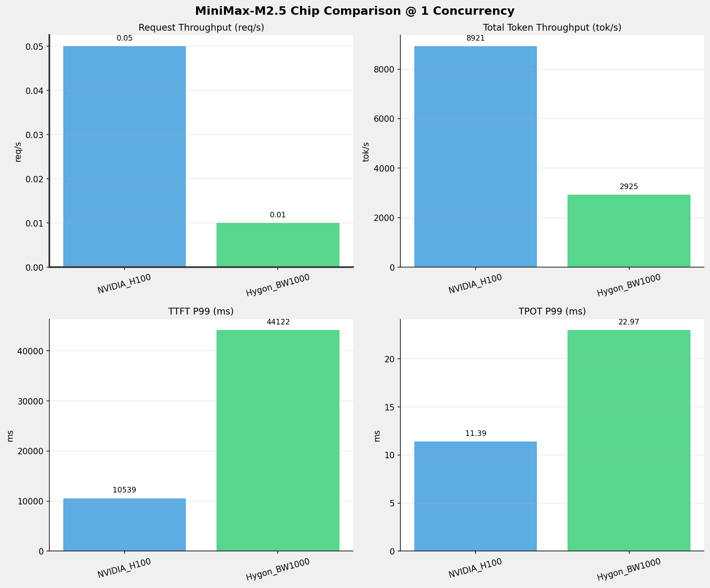
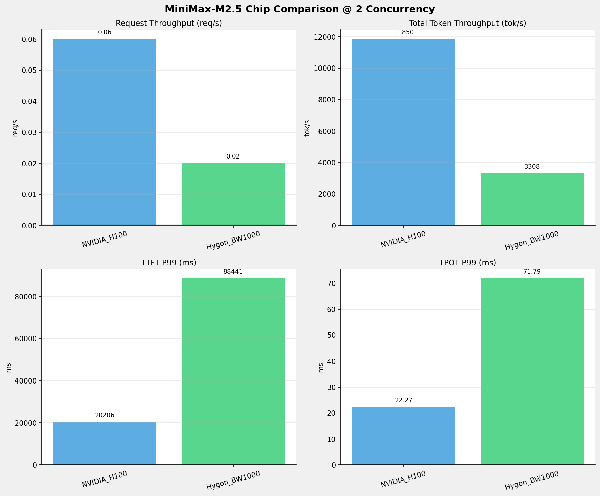
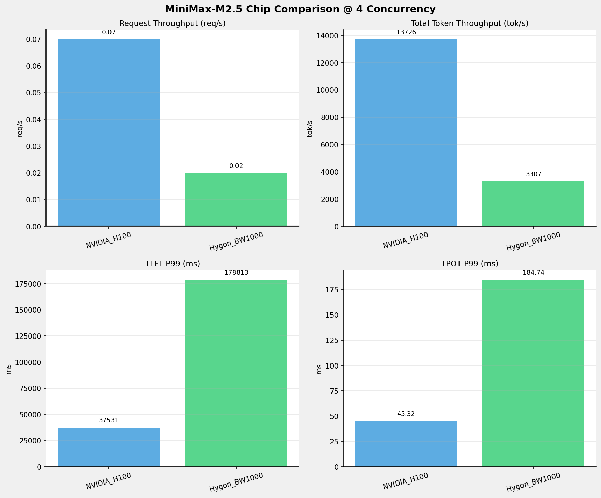
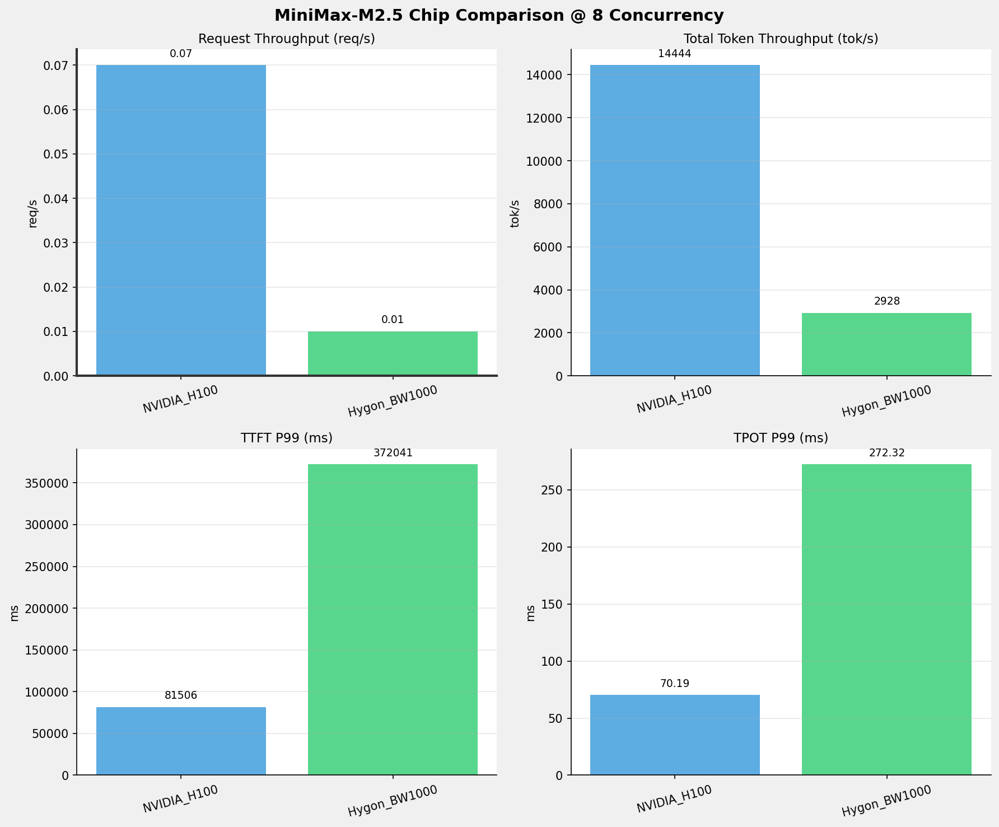
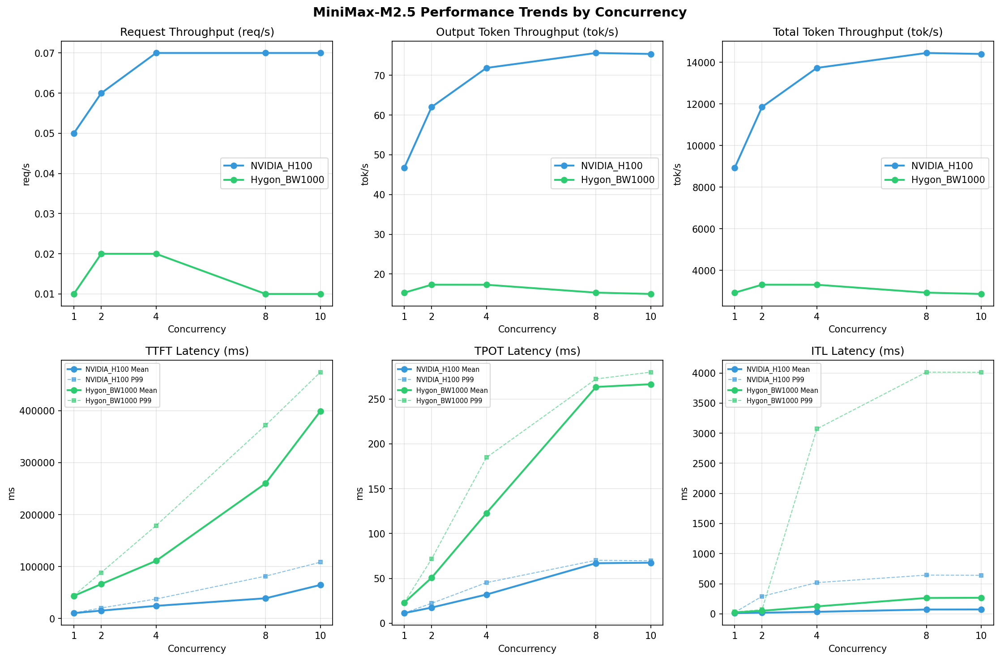

# MiniMax-M2.5模型在不同芯片下的benchmark基准测试报告

**测试日期：** 2026-05-19

---

## 测试场景
在固定请求数，输入上下文和输出上下文长度下，使用vllm bench serve工具对并发数逐级增加场景的性能基准验证。并对比同一模型在不同芯片环境上的性能指标。

**主要采集指标**：

| 指标                  | 单位         | 含义                                 |
|---------------------|------------|------------------------------------|
| TTFT                | ms         | Time To First Token，首 token 延迟     |
| TPOT                | ms/token   | Time Per Output Token，每 token 生成时间 |
| Throughput          | tokens/s   | 系统总吞吐                              |
| QPS                 | requests/s | 请求吞吐                               |
| P50/P95/P99 Latency | ms         | 延迟分位数                              |
    
### 📊 测试概览

| 项目            | 配置                                     | 备注  |
|---------------|----------------------------------------|-----|
| **数据集**       | random                                 |     |
| **并发数**       | 1, 2, 4, 8, 10    |     |
| **总请求数**      | 100                                    |     |
| **请求输入上下文长度** | 194560（190k）                             |     |
| **请求输出上下文长度** | 1024（1k）                             |     |
| **被测芯片**      | NVIDIA_H100, Hygon_BW1000 |     |
| **被测模型**      | MiniMax-M2.5 |     |

---

### 🤖 芯片和模型配置信息

| 参数名称 | **NVIDIA_H100** | **Hygon_BW1000** |
|----------|----------|----------|
| **max_position_embeddings** | 196608 | 196608 |
| **model_name** | MiniMax-M2.5 | MiniMax-M2.5-W8A8 |
| **model_size** | 215G | 215G |
| **python_version** | 3.12.3 | 3.10.12 |
| **quantization_config** | FP16 | int-8 |
| **temperature** | N/A | N/A |
| **top_k** | N/A | N/A |
| **top_p** | N/A | N/A |
| **transformers_version** | 4.46.1 | 4.57.6 |
| **vllm_version** | 0.15.1 | 0.15.1+das.opt1.alpha.dtk2604 |

---

### ⚙️ vLLM启动配置信息

| 参数名称 | **NVIDIA_H100** | **Hygon_BW1000** |
|----------|----------|----------|
| **Block Size** | default | default |
| **Compilation Config** | N/A | N/A |
| **Dp** | 1 | 1 |
| **Dtype** | default | bfloat16 |
| **Enable Auto Tool Choice** | True | True |
| **Enable Export Parallel** | True | True |
| **Gpu Memory Utilization** | 0.85 | 0.9 |
| **Max Model Len** | 196608 | 196608 |
| **Max Num Batched Tokens** | 8192 | default |
| **Max Num Seqs** | 10 | 64 |
| **Model Name** | MiniMax-M2.5 | MiniMax-M2.5-W8A8 |
| **Pp** | 1 | 1 |
| **Reasoning Parser** | minimax_m2 | minimax_m2 (不生效) |
| **Tool Call Parser** | minimax_m2 | minimax_m2 |
| **Tp** | 8 | 8 |

- **NVIDIA_H100**: 英伟达H100标准配置
- **Hygon_BW1000**: 海光芯片专家并行配置

---

### 📊 芯片性能对比柱状图

**1并发**

**2并发**

**4并发**

**8并发**

**10并发**

### 📈 性能趋势对比图 (所有芯片)

---

### 📈 各指标随并发级别性能对比详情

#### 请求吞吐量（Request throughput (req/s)）

| 并发数 | NVIDIA_H100 | Hygon_BW1000 | 差值 | 百分比 |
|-----|----------- | ----------- | ----------- | -----------|
| 1   | 0.05 | 0.01 | -0.04 | -80.0% |
| 2   | 0.06 | 0.02 | -0.04 | -66.7% |
| 4   | 0.07 | 0.02 | -0.05 | -71.4% |
| 8   | 0.07 | 0.01 | -0.06 | -85.7% |
| 10   | 0.07 | 0.01 | -0.06 | -85.7% |

#### 输出token吞吐量（Output token throughput (tok/s)）

| 并发数 | NVIDIA_H100 | Hygon_BW1000 | 差值 | 百分比 |
|-----|----------- | ----------- | ----------- | -----------|
| 1   | 46.70 | 15.31 | -31.39 | -67.2% |
| 2   | 62.03 | 17.32 | -44.71 | -72.1% |
| 4   | 71.85 | 17.31 | -54.54 | -75.9% |
| 8   | 75.61 | 15.33 | -60.28 | -79.7% |
| 10   | 75.37 | 15.00 | -60.37 | -80.1% |

#### 总token吞吐量（Total token throughput (tok/s)）

| 并发数 | NVIDIA_H100 | Hygon_BW1000 | 差值 | 百分比 |
|-----|----------- | ----------- | ----------- | -----------|
| 1   | 8921.40 | 2924.75 | -5996.65 | -67.2% |
| 2   | 11850.06 | 3308.40 | -8541.66 | -72.1% |
| 4   | 13726.45 | 3306.71 | -10419.74 | -75.9% |
| 8   | 14443.68 | 2927.85 | -11515.83 | -79.7% |
| 10   | 14398.41 | 2865.09 | -11533.32 | -80.1% |

#### 首token延迟（P99 TTFT (ms)）

| 并发数 | NVIDIA_H100 | Hygon_BW1000 | 差值 | 百分比 |
|-----|----------- | ----------- | ----------- | -----------|
| 1   | 10539.10 | 44121.71 | +33582.61 | +318.6% |
| 2   | 20205.87 | 88441.47 | +68235.60 | +337.7% |
| 4   | 37530.99 | 178812.59 | +141281.60 | +376.4% |
| 8   | 81506.35 | 372041.15 | +290534.80 | +356.5% |
| 10   | 108342.29 | 474297.92 | +365955.63 | +337.8% |

#### 每token生成时间（P99 TPOT (ms)）

| 并发数 | NVIDIA_H100 | Hygon_BW1000 | 差值 | 百分比 |
|-----|----------- | ----------- | ----------- | -----------|
| 1   | 11.39 | 22.97 | +11.58 | +101.7% |
| 2   | 22.27 | 71.79 | +49.52 | +222.4% |
| 4   | 45.32 | 184.74 | +139.42 | +307.6% |
| 8   | 70.19 | 272.32 | +202.13 | +288.0% |
| 10   | 69.61 | 279.90 | +210.29 | +302.1% |

#### token间延迟（P99 ITL (ms)）

| 并发数 | NVIDIA_H100 | Hygon_BW1000 | 差值 | 百分比 |
|-----|----------- | ----------- | ----------- | -----------|
| 1   | 22.97 | 32.12 | +9.15 | +39.8% |
| 2   | 291.30 | 69.78 | -221.52 | -76.0% |
| 4   | 518.54 | 3071.54 | +2553.00 | +492.3% |
| 8   | 642.87 | 4014.05 | +3371.18 | +524.4% |
| 10   | 639.97 | 4012.34 | +3372.37 | +527.0% |

### 📈 各并发级别性能对比详情

### 1 并发

#### 服务基准结果

| 指标 | NVIDIA_H100 | Hygon_BW1000 |
|------|----------- | -----------|
| 成功请求数 | 100 | 100 |
| 失败请求数 | 0 | 0 |
| 测试持续时间 (s) | 2192.74 | 6687.21 |
| 总输入 tokens | 19459900 | 19456000 |
| 总生成 tokens | 102400 | 102400 |
| **请求吞吐量 (req/s)** | **0.05** ⭐ | 0.01 |
| **输出 token 吞吐量 (tok/s)** | **46.70** ⭐ | 15.31 |
| 峰值输出 token 吞吐量 (tok/s) | **88.00** ⭐ | 47.00 |
| 峰值并发请求数 | 2.00 | 2.00 |
| **总 token 吞吐量 (tok/s)** | **8921.40** ⭐ | 2924.75 |

#### 首Token延迟 (TTFT)

| 指标 | NVIDIA_H100 | Hygon_BW1000 |
|------|----------- | -----------|
| 平均 TTFT (ms) | **10341.23** ⭐ | 43487.80 |
| 中位 TTFT (ms) | **10434.85** ⭐ | 43910.38 |
| P95 TTFT (ms) | **10504.46** ⭐ | 44091.15 |
| P99 TTFT (ms) | **10539.10** ⭐ | 44121.71 |

#### 每Token生成时间 (TPOT)

| 指标 | NVIDIA_H100 | Hygon_BW1000 |
|------|----------- | -----------|
| 平均 TPOT (ms) | **11.33** ⭐ | 22.86 |
| 中位 TPOT (ms) | **11.32** ⭐ | 22.86 |
| P95 TPOT (ms) | **11.38** ⭐ | 22.96 |
| P99 TPOT (ms) | **11.39** ⭐ | 22.97 |

#### Token间延迟 (ITL)

| 指标 | NVIDIA_H100 | Hygon_BW1000 |
|------|----------- | -----------|
| 平均 ITL (ms) | **12.11** ⭐ | 22.88 |
| 中位 ITL (ms) | **11.42** ⭐ | 22.85 |
| P95 ITL (ms) | **12.01** ⭐ | 23.57 |
| P99 ITL (ms) | **22.97** ⭐ | 32.12 |

---

### 2 并发

#### 服务基准结果

| 指标 | NVIDIA_H100 | Hygon_BW1000 |
|------|----------- | -----------|
| 成功请求数 | 100 | 100 |
| 失败请求数 | 0 | 0 |
| 测试持续时间 (s) | 1650.82 | 5911.73 |
| 总输入 tokens | 19459900 | 19456000 |
| 总生成 tokens | 102400 | 102400 |
| **请求吞吐量 (req/s)** | **0.06** ⭐ | 0.02 |
| **输出 token 吞吐量 (tok/s)** | **62.03** ⭐ | 17.32 |
| 峰值输出 token 吞吐量 (tok/s) | **158.00** ⭐ | 72.00 |
| 峰值并发请求数 | 4.00 | 4.00 |
| **总 token 吞吐量 (tok/s)** | **11850.06** ⭐ | 3308.40 |

#### 首Token延迟 (TTFT)

| 指标 | NVIDIA_H100 | Hygon_BW1000 |
|------|----------- | -----------|
| 平均 TTFT (ms) | **15109.52** ⭐ | 66239.08 |
| 中位 TTFT (ms) | **11322.53** ⭐ | 46228.26 |
| P95 TTFT (ms) | **20196.38** ⭐ | 88317.83 |
| P99 TTFT (ms) | **20205.87** ⭐ | 88441.47 |

#### 每Token生成时间 (TPOT)

| 指标 | NVIDIA_H100 | Hygon_BW1000 |
|------|----------- | -----------|
| 平均 TPOT (ms) | **17.50** ⭐ | 50.82 |
| 中位 TPOT (ms) | **18.37** ⭐ | 49.68 |
| P95 TPOT (ms) | **22.27** ⭐ | 71.63 |
| P99 TPOT (ms) | **22.27** ⭐ | 71.79 |

#### Token间延迟 (ITL)

| 指标 | NVIDIA_H100 | Hygon_BW1000 |
|------|----------- | -----------|
| 平均 ITL (ms) | **18.68** ⭐ | 50.85 |
| 中位 ITL (ms) | **12.86** ⭐ | 30.34 |
| P95 ITL (ms) | **25.64** ⭐ | 36.99 |
| P99 ITL (ms) | 291.30 | **69.78** ⭐ |

---

### 4 并发

#### 服务基准结果

| 指标 | NVIDIA_H100 | Hygon_BW1000 |
|------|----------- | -----------|
| 成功请求数 | 100 | 100 |
| 失败请求数 | 0 | 0 |
| 测试持续时间 (s) | 1425.15 | 5914.77 |
| 总输入 tokens | 19459900 | 19456000 |
| 总生成 tokens | 102400 | 102400 |
| **请求吞吐量 (req/s)** | **0.07** ⭐ | 0.02 |
| **输出 token 吞吐量 (tok/s)** | **71.85** ⭐ | 17.31 |
| 峰值输出 token 吞吐量 (tok/s) | **232.00** ⭐ | 96.00 |
| 峰值并发请求数 | 7.00 | 7.00 |
| **总 token 吞吐量 (tok/s)** | **13726.45** ⭐ | 3306.71 |

#### 首Token延迟 (TTFT)

| 指标 | NVIDIA_H100 | Hygon_BW1000 |
|------|----------- | -----------|
| 平均 TTFT (ms) | **24251.84** ⭐ | 110901.13 |
| 中位 TTFT (ms) | **21340.43** ⭐ | 96467.29 |
| P95 TTFT (ms) | **36452.26** ⭐ | 174373.75 |
| P99 TTFT (ms) | **37530.99** ⭐ | 178812.59 |

#### 每Token生成时间 (TPOT)

| 指标 | NVIDIA_H100 | Hygon_BW1000 |
|------|----------- | -----------|
| 平均 TPOT (ms) | **32.00** ⭐ | 122.83 |
| 中位 TPOT (ms) | **31.06** ⭐ | 120.64 |
| P95 TPOT (ms) | **45.29** ⭐ | 184.15 |
| P99 TPOT (ms) | **45.32** ⭐ | 184.74 |

#### Token间延迟 (ITL)

| 指标 | NVIDIA_H100 | Hygon_BW1000 |
|------|----------- | -----------|
| 平均 ITL (ms) | **33.27** ⭐ | 122.76 |
| 中位 ITL (ms) | **17.27** ⭐ | 43.16 |
| P95 ITL (ms) | **34.62** ⭐ | 52.02 |
| P99 ITL (ms) | **518.54** ⭐ | 3071.54 |

---

### 8 并发

#### 服务基准结果

| 指标 | NVIDIA_H100 | Hygon_BW1000 |
|------|----------- | -----------|
| 成功请求数 | 100 | 100 |
| 失败请求数 | 0 | 0 |
| 测试持续时间 (s) | 1354.38 | 6680.12 |
| 总输入 tokens | 19459900 | 19456000 |
| 总生成 tokens | 102400 | 102400 |
| **请求吞吐量 (req/s)** | **0.07** ⭐ | 0.01 |
| **输出 token 吞吐量 (tok/s)** | **75.61** ⭐ | 15.33 |
| 峰值输出 token 吞吐量 (tok/s) | **279.00** ⭐ | 135.00 |
| 峰值并发请求数 | 10.00 | 9.00 |
| **总 token 吞吐量 (tok/s)** | **14443.68** ⭐ | 2927.85 |

#### 首Token延迟 (TTFT)

| 指标 | NVIDIA_H100 | Hygon_BW1000 |
|------|----------- | -----------|
| 平均 TTFT (ms) | **38837.88** ⭐ | 260175.41 |
| 中位 TTFT (ms) | **31592.69** ⭐ | 280403.12 |
| P95 TTFT (ms) | **51466.23** ⭐ | 281593.86 |
| P99 TTFT (ms) | **81506.35** ⭐ | 372041.15 |

#### 每Token生成时间 (TPOT)

| 指标 | NVIDIA_H100 | Hygon_BW1000 |
|------|----------- | -----------|
| 平均 TPOT (ms) | **66.93** ⭐ | 263.40 |
| 中位 TPOT (ms) | **69.00** ⭐ | 269.07 |
| P95 TPOT (ms) | **69.56** ⭐ | 272.14 |
| P99 TPOT (ms) | **70.19** ⭐ | 272.32 |

#### Token间延迟 (ITL)

| 指标 | NVIDIA_H100 | Hygon_BW1000 |
|------|----------- | -----------|
| 平均 ITL (ms) | **71.06** ⭐ | 263.23 |
| 中位 ITL (ms) | **21.89** ⭐ | 38.61 |
| P95 ITL (ms) | **439.76** ⭐ | 2683.84 |
| P99 ITL (ms) | **642.87** ⭐ | 4014.05 |

---

### 10 并发

#### 服务基准结果

| 指标 | NVIDIA_H100 | Hygon_BW1000 |
|------|----------- | -----------|
| 成功请求数 | 100 | 100 |
| 失败请求数 | 0 | 0 |
| 测试持续时间 (s) | 1358.64 | 6826.46 |
| 总输入 tokens | 19459900 | 19456000 |
| 总生成 tokens | 102400 | 102400 |
| **请求吞吐量 (req/s)** | **0.07** ⭐ | 0.01 |
| **输出 token 吞吐量 (tok/s)** | **75.37** ⭐ | 15.00 |
| 峰值输出 token 吞吐量 (tok/s) | **275.00** ⭐ | 145.00 |
| 峰值并发请求数 | 11.00 | 12.00 |
| **总 token 吞吐量 (tok/s)** | **14398.41** ⭐ | 2865.09 |

#### 首Token延迟 (TTFT)

| 指标 | NVIDIA_H100 | Hygon_BW1000 |
|------|----------- | -----------|
| 平均 TTFT (ms) | **64545.59** ⭐ | 399184.25 |
| 中位 TTFT (ms) | **63613.81** ⭐ | 414031.08 |
| P95 TTFT (ms) | **72047.66** ⭐ | 441820.31 |
| P99 TTFT (ms) | **108342.29** ⭐ | 474297.92 |

#### 每Token生成时间 (TPOT)

| 指标 | NVIDIA_H100 | Hygon_BW1000 |
|------|----------- | -----------|
| 平均 TPOT (ms) | **67.50** ⭐ | 266.45 |
| 中位 TPOT (ms) | **69.02** ⭐ | 276.40 |
| P95 TPOT (ms) | **69.59** ⭐ | 279.80 |
| P99 TPOT (ms) | **69.61** ⭐ | 279.90 |

#### Token间延迟 (ITL)

| 指标 | NVIDIA_H100 | Hygon_BW1000 |
|------|----------- | -----------|
| 平均 ITL (ms) | **72.39** ⭐ | 266.45 |
| 中位 ITL (ms) | **21.91** ⭐ | 38.64 |
| P95 ITL (ms) | **440.01** ⭐ | 2679.16 |
| P99 ITL (ms) | **639.97** ⭐ | 4012.34 |

---

---

*报告生成时间: 2026-05-19*

