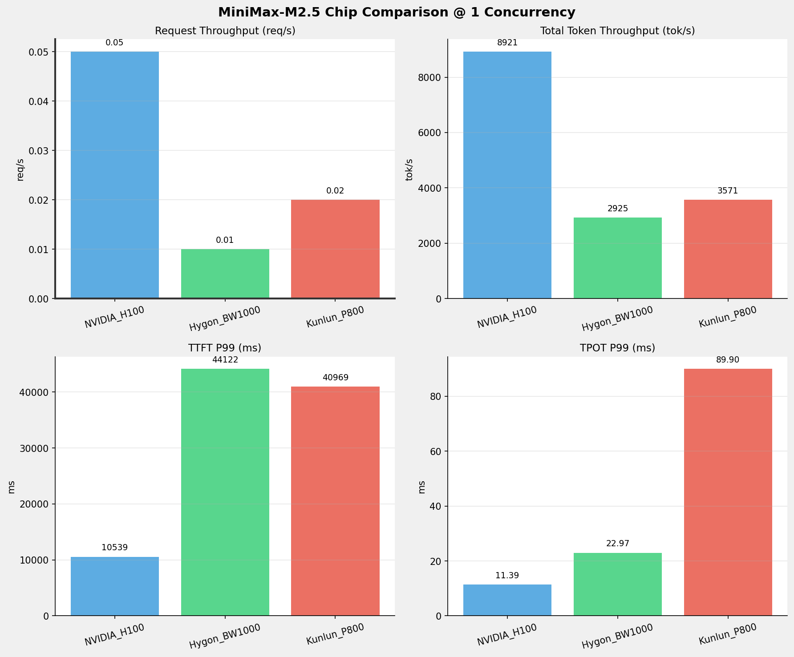
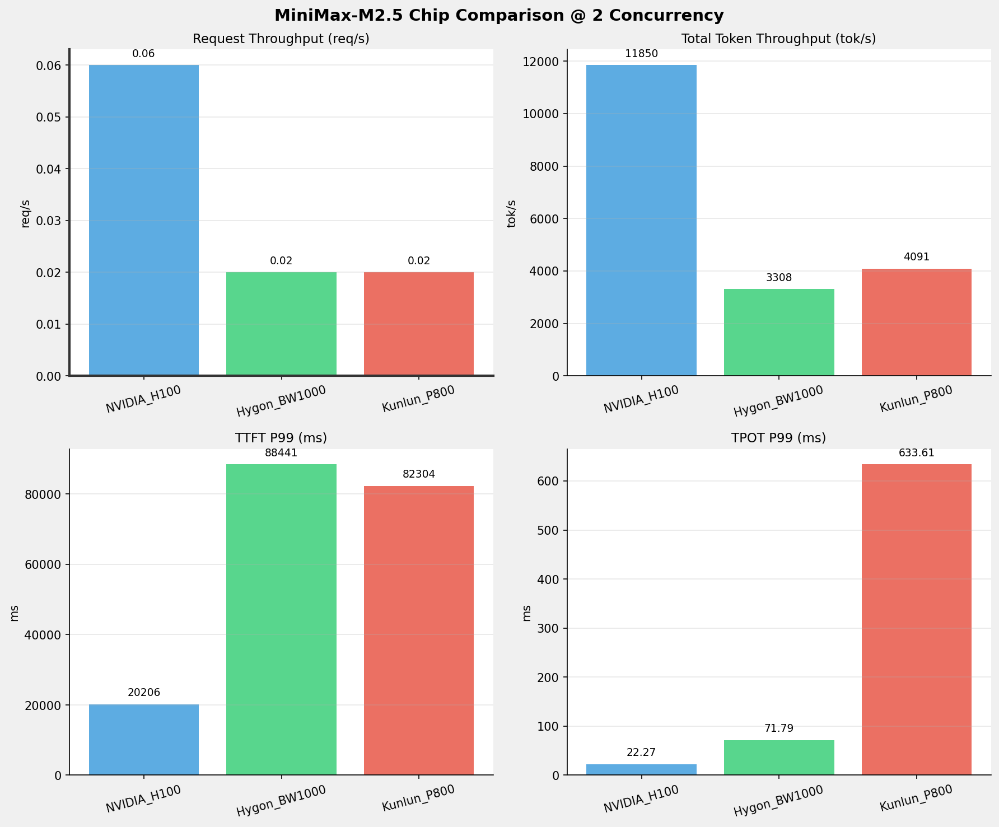
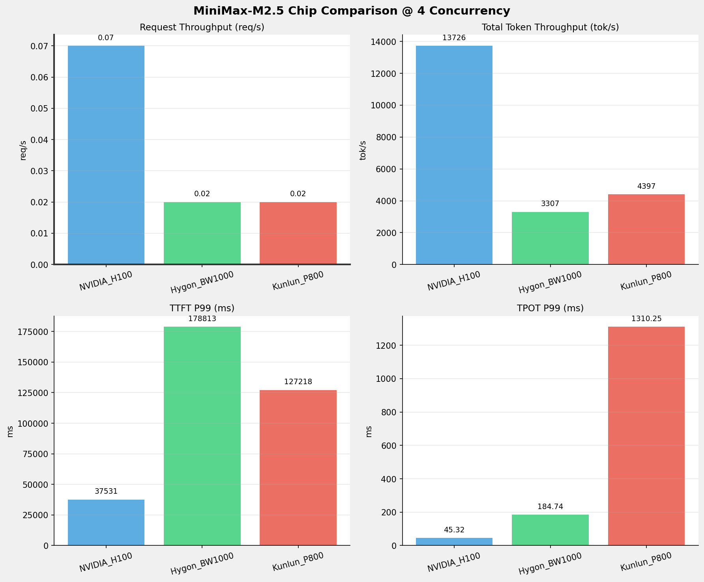
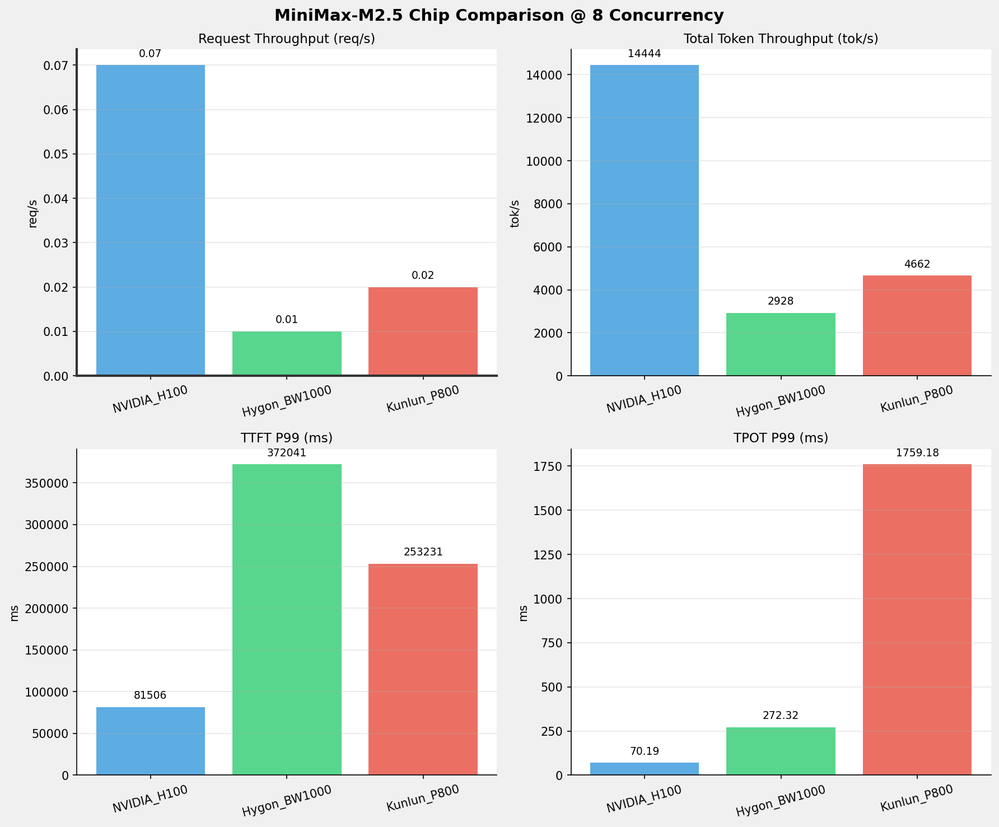
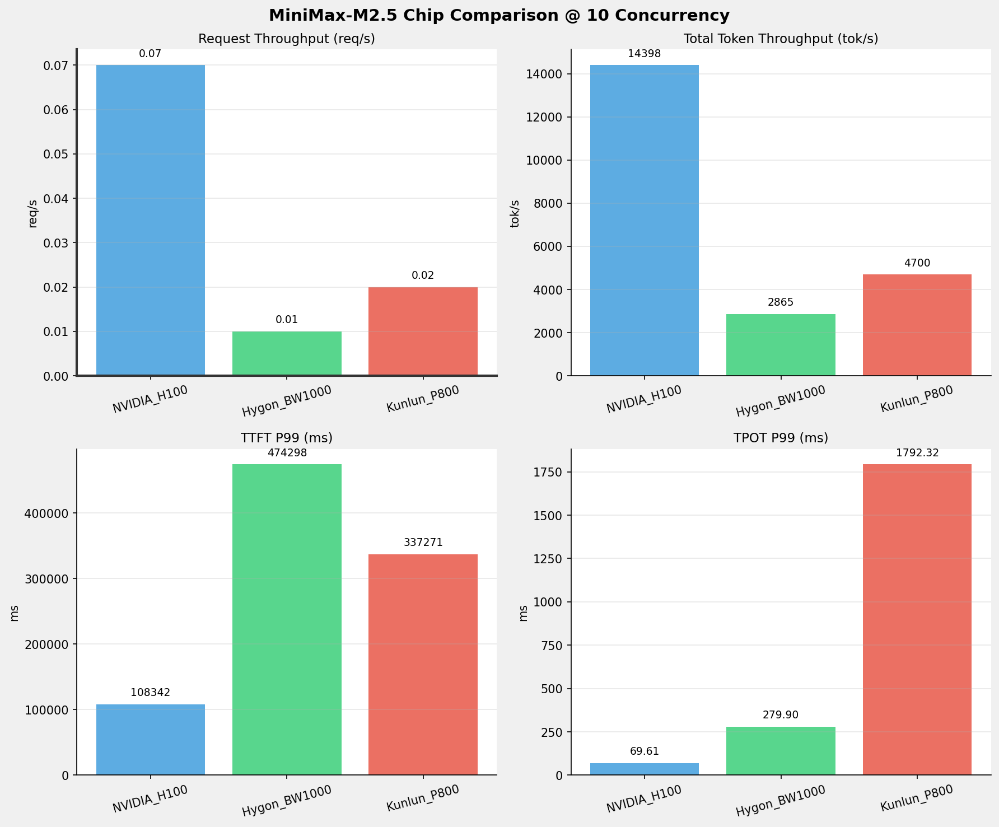
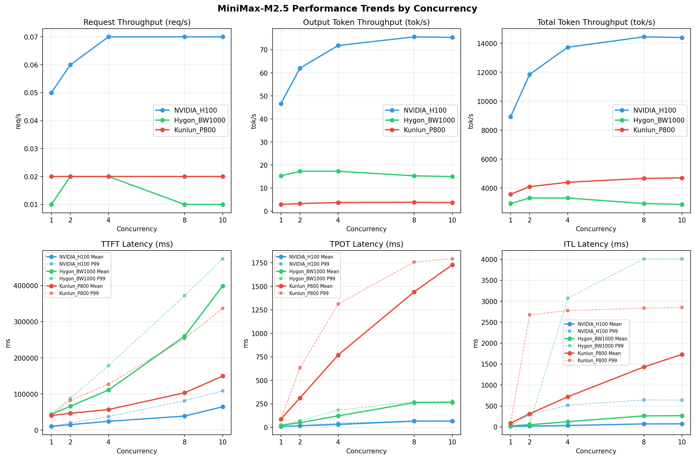

# MiniMax-M2.5模型在不同芯片下的benchmark基准测试报告

**测试日期：** 2026-05-19

---

## 测试场景
在固定请求数，输入上下文和输出上下文长度下，使用vllm bench serve工具对并发数逐级增加场景的性能基准验证。并对比同一模型在不同芯片环境上的性能指标。

**主要采集指标**：

| 指标                  | 单位         | 含义                                 |
|---------------------|------------|------------------------------------|
| TTFT                | ms         | Time To First Token，首 token 延迟     |
| TPOT                | ms/token   | Time Per Output Token，每 token 生成时间 |
| Throughput          | tokens/s   | 系统总吞吐                              |
| QPS                 | requests/s | 请求吞吐                               |
| P50/P95/P99 Latency | ms         | 延迟分位数                              |
    
### 📊 测试概览

| 项目            | 配置                                     | 备注  |
|---------------|----------------------------------------|-----|
| **数据集**       | random                                 |     |
| **并发数**       | 1, 2, 4, 8, 10    |     |
| **总请求数**      | 100                                    |     |
| **请求输入上下文长度** | 194560（190k）                             |     |
| **请求输出上下文长度** | 1024（1k）                             |     |
| **被测芯片**      | NVIDIA_H100, Hygon_BW1000, Kunlun_P800 |     |
| **被测模型**      | MiniMax-M2.5 |     |

---

### 🤖 芯片和模型配置信息

| 参数名称 | **NVIDIA_H100** | **Hygon_BW1000** | **Kunlun_P800** |
|----------|----------|----------|----------|
| **max_position_embeddings** | 196608 | 196608 | 196608 |
| **model_name** | MiniMax-M2.5 | MiniMax-M2.5-W8A8 | MiniMax-M2.5-W8A8-INT8-Dynamic |
| **model_size** | 215G | 215G | 215G |
| **python_version** | 3.12.3 | 3.10.12 | 3.10.15 |
| **quantization_config** | FP16 | int-8 | int-8 |
| **temperature** | N/A | N/A | 1.0 |
| **top_k** | N/A | N/A | 40 |
| **top_p** | N/A | N/A | 0.95 |
| **transformers_version** | 4.46.1 | 4.57.6 | 4.46.1 |
| **vllm_version** | 0.15.1 | 0.15.1+das.opt1.alpha.dtk2604 | 0.11.0 |

---

### ⚙️ vLLM启动配置信息

| 参数名称 | **NVIDIA_H100** | **Hygon_BW1000** | **Kunlun_P800** |
|----------|----------|----------|----------|
| **Block Size** | default | default | 128 |
| **Compilation Config** | N/A | N/A | {"splitting_ops":["vllm.unified_attention","vllm.unified_attention_with_output","vllm.unified_attention_with_output_kunlun","vllm.mamba_mixer2","vllm.mamba_mixer","vllm.short_conv","vllm.linear_attention","vllm.plamo2_mamba_mixer","vllm.gdn_attention","vllm.sparse_attn_indexer","vllm.sparse_attn_indexer_vllm_kunlun"]} |
| **Dp** | 1 | 1 | 1 |
| **Dtype** | default | bfloat16 | auto |
| **Enable Auto Tool Choice** | True | True | True |
| **Enable Export Parallel** | True | True | False |
| **Gpu Memory Utilization** | 0.85 | 0.9 | 0.95 |
| **Max Model Len** | 196608 | 196608 | 196608 |
| **Max Num Batched Tokens** | 8192 | default | 8192 |
| **Max Num Seqs** | 10 | 64 | 64 |
| **Model Name** | MiniMax-M2.5 | MiniMax-M2.5-W8A8 | MiniMax-M2.5-W8A8-INT8-Dynamic |
| **Pp** | 1 | 1 | 1 |
| **Reasoning Parser** | minimax_m2 | minimax_m2 (不生效) | minimax_m2 (不生效) |
| **Tool Call Parser** | minimax_m2 | minimax_m2 | minimax_m2 |
| **Tp** | 8 | 8 | 8 |

- **NVIDIA_H100**: 英伟达H100标准配置
- **Hygon_BW1000**: 海光芯片专家并行配置
- **Kunlun_P800**: 昆仑芯不启用专家并行避免通信问题

---

### 📊 芯片性能对比柱状图

**1并发**

**2并发**

**4并发**

**8并发**

**10并发**

### 📈 性能趋势对比图 (所有芯片)

---

### 📈 各指标随并发级别性能对比详情

#### 请求吞吐量（Request throughput (req/s)）

| 并发数 | NVIDIA_H100 | Hygon_BW1000 | Kunlun_P800 | 差值 | 百分比 |
|-----|----------- | ----------- | ----------- | ----------- | -----------|
| 1   | 0.05 | 0.01 | 0.02 | -0.03 | -60.0% |
| 2   | 0.06 | 0.02 | 0.02 | -0.04 | -66.7% |
| 4   | 0.07 | 0.02 | 0.02 | -0.05 | -71.4% |
| 8   | 0.07 | 0.01 | 0.02 | -0.05 | -71.4% |
| 10   | 0.07 | 0.01 | 0.02 | -0.05 | -71.4% |

#### 输出token吞吐量（Output token throughput (tok/s)）

| 并发数 | NVIDIA_H100 | Hygon_BW1000 | Kunlun_P800 | 差值 | 百分比 |
|-----|----------- | ----------- | ----------- | ----------- | -----------|
| 1   | 46.70 | 15.31 | 2.92 | -43.78 | -93.7% |
| 2   | 62.03 | 17.32 | 3.29 | -58.74 | -94.7% |
| 4   | 71.85 | 17.31 | 3.74 | -68.11 | -94.8% |
| 8   | 75.61 | 15.33 | 3.86 | -71.75 | -94.9% |
| 10   | 75.37 | 15.00 | 3.70 | -71.67 | -95.1% |

#### 总token吞吐量（Total token throughput (tok/s)）

| 并发数 | NVIDIA_H100 | Hygon_BW1000 | Kunlun_P800 | 差值 | 百分比 |
|-----|----------- | ----------- | ----------- | ----------- | -----------|
| 1   | 8921.40 | 2924.75 | 3571.06 | -5350.34 | -60.0% |
| 2   | 11850.06 | 3308.40 | 4090.58 | -7759.48 | -65.5% |
| 4   | 13726.45 | 3306.71 | 4396.76 | -9329.69 | -68.0% |
| 8   | 14443.68 | 2927.85 | 4662.13 | -9781.55 | -67.7% |
| 10   | 14398.41 | 2865.09 | 4699.60 | -9698.81 | -67.4% |

#### 首token延迟（P99 TTFT (ms)）

| 并发数 | NVIDIA_H100 | Hygon_BW1000 | Kunlun_P800 | 差值 | 百分比 |
|-----|----------- | ----------- | ----------- | ----------- | -----------|
| 1   | 10539.10 | 44121.71 | 40968.87 | +30429.77 | +288.7% |
| 2   | 20205.87 | 88441.47 | 82303.98 | +62098.11 | +307.3% |
| 4   | 37530.99 | 178812.59 | 127218.01 | +89687.02 | +239.0% |
| 8   | 81506.35 | 372041.15 | 253230.60 | +171724.25 | +210.7% |
| 10   | 108342.29 | 474297.92 | 337270.92 | +228928.63 | +211.3% |

#### 每token生成时间（P99 TPOT (ms)）

| 并发数 | NVIDIA_H100 | Hygon_BW1000 | Kunlun_P800 | 差值 | 百分比 |
|-----|----------- | ----------- | ----------- | ----------- | -----------|
| 1   | 11.39 | 22.97 | 89.90 | +78.51 | +689.3% |
| 2   | 22.27 | 71.79 | 633.61 | +611.34 | +2745.1% |
| 4   | 45.32 | 184.74 | 1310.25 | +1264.93 | +2791.1% |
| 8   | 70.19 | 272.32 | 1759.18 | +1688.99 | +2406.3% |
| 10   | 69.61 | 279.90 | 1792.32 | +1722.71 | +2474.8% |

#### token间延迟（P99 ITL (ms)）

| 并发数 | NVIDIA_H100 | Hygon_BW1000 | Kunlun_P800 | 差值 | 百分比 |
|-----|----------- | ----------- | ----------- | ----------- | -----------|
| 1   | 22.97 | 32.12 | 93.69 | +70.72 | +307.9% |
| 2   | 291.30 | 69.78 | 2678.51 | +2387.21 | +819.5% |
| 4   | 518.54 | 3071.54 | 2777.75 | +2259.21 | +435.7% |
| 8   | 642.87 | 4014.05 | 2835.54 | +2192.67 | +341.1% |
| 10   | 639.97 | 4012.34 | 2848.90 | +2208.93 | +345.2% |

### 📈 各并发级别性能对比详情

### 1 并发

#### 服务基准结果

| 指标 | NVIDIA_H100 | Hygon_BW1000 | Kunlun_P800 |
|------|----------- | ----------- | -----------|
| 成功请求数 | 100 | 100 | 100 |
| 失败请求数 | 0 | 0 | 0 |
| 测试持续时间 (s) | 2192.74 | 6687.21 | 5452.69 |
| 总输入 tokens | 19459900 | 19456000 | 19456000 |
| 总生成 tokens | 102400 | 102400 | 15925 |
| **请求吞吐量 (req/s)** | **0.05** ⭐ | 0.01 | 0.02 |
| **输出 token 吞吐量 (tok/s)** | **46.70** ⭐ | 15.31 | 2.92 |
| 峰值输出 token 吞吐量 (tok/s) | **88.00** ⭐ | 47.00 | 13.00 |
| 峰值并发请求数 | 2.00 | 2.00 | 2.00 |
| **总 token 吞吐量 (tok/s)** | **8921.40** ⭐ | 2924.75 | 3571.06 |

#### 首Token延迟 (TTFT)

| 指标 | NVIDIA_H100 | Hygon_BW1000 | Kunlun_P800 |
|------|----------- | ----------- | -----------|
| 平均 TTFT (ms) | **10341.23** ⭐ | 43487.80 | 40485.44 |
| 中位 TTFT (ms) | **10434.85** ⭐ | 43910.38 | 40877.83 |
| P95 TTFT (ms) | **10504.46** ⭐ | 44091.15 | 40934.49 |
| P99 TTFT (ms) | **10539.10** ⭐ | 44121.71 | 40968.87 |

#### 每Token生成时间 (TPOT)

| 指标 | NVIDIA_H100 | Hygon_BW1000 | Kunlun_P800 |
|------|----------- | ----------- | -----------|
| 平均 TPOT (ms) | **11.33** ⭐ | 22.86 | 88.72 |
| 中位 TPOT (ms) | **11.32** ⭐ | 22.86 | 88.67 |
| P95 TPOT (ms) | **11.38** ⭐ | 22.96 | 88.90 |
| P99 TPOT (ms) | **11.39** ⭐ | 22.97 | 89.90 |

#### Token间延迟 (ITL)

| 指标 | NVIDIA_H100 | Hygon_BW1000 | Kunlun_P800 |
|------|----------- | ----------- | -----------|
| 平均 ITL (ms) | **12.11** ⭐ | 22.88 | 88.82 |
| 中位 ITL (ms) | **11.42** ⭐ | 22.85 | 88.67 |
| P95 ITL (ms) | **12.01** ⭐ | 23.57 | 89.13 |
| P99 ITL (ms) | **22.97** ⭐ | 32.12 | 93.69 |

---

### 2 并发

#### 服务基准结果

| 指标 | NVIDIA_H100 | Hygon_BW1000 | Kunlun_P800 |
|------|----------- | ----------- | -----------|
| 成功请求数 | 100 | 100 | 100 |
| 失败请求数 | 0 | 0 | 0 |
| 测试持续时间 (s) | 1650.82 | 5911.73 | 4760.12 |
| 总输入 tokens | 19459900 | 19456000 | 19456000 |
| 总生成 tokens | 102400 | 102400 | 15646 |
| **请求吞吐量 (req/s)** | **0.06** ⭐ | 0.02 | 0.02 |
| **输出 token 吞吐量 (tok/s)** | **62.03** ⭐ | 17.32 | 3.29 |
| 峰值输出 token 吞吐量 (tok/s) | **158.00** ⭐ | 72.00 | 24.00 |
| 峰值并发请求数 | 4.00 | 4.00 | 4.00 |
| **总 token 吞吐量 (tok/s)** | **11850.06** ⭐ | 3308.40 | 4090.58 |

#### 首Token延迟 (TTFT)

| 指标 | NVIDIA_H100 | Hygon_BW1000 | Kunlun_P800 |
|------|----------- | ----------- | -----------|
| 平均 TTFT (ms) | **15109.52** ⭐ | 66239.08 | 46527.53 |
| 中位 TTFT (ms) | **11322.53** ⭐ | 46228.26 | 42626.91 |
| P95 TTFT (ms) | **20196.38** ⭐ | 88317.83 | 74577.69 |
| P99 TTFT (ms) | **20205.87** ⭐ | 88441.47 | 82303.98 |

#### 每Token生成时间 (TPOT)

| 指标 | NVIDIA_H100 | Hygon_BW1000 | Kunlun_P800 |
|------|----------- | ----------- | -----------|
| 平均 TPOT (ms) | **17.50** ⭐ | 50.82 | 313.86 |
| 中位 TPOT (ms) | **18.37** ⭐ | 49.68 | 347.41 |
| P95 TPOT (ms) | **22.27** ⭐ | 71.63 | 561.79 |
| P99 TPOT (ms) | **22.27** ⭐ | 71.79 | 633.61 |

#### Token间延迟 (ITL)

| 指标 | NVIDIA_H100 | Hygon_BW1000 | Kunlun_P800 |
|------|----------- | ----------- | -----------|
| 平均 ITL (ms) | **18.68** ⭐ | 50.85 | 312.49 |
| 中位 ITL (ms) | **12.86** ⭐ | 30.34 | 89.91 |
| P95 ITL (ms) | **25.64** ⭐ | 36.99 | 2006.61 |
| P99 ITL (ms) | 291.30 | **69.78** ⭐ | 2678.51 |

---

### 4 并发

#### 服务基准结果

| 指标 | NVIDIA_H100 | Hygon_BW1000 | Kunlun_P800 |
|------|----------- | ----------- | -----------|
| 成功请求数 | 100 | 100 | 100 |
| 失败请求数 | 0 | 0 | 0 |
| 测试持续时间 (s) | 1425.15 | 5914.77 | 4428.84 |
| 总输入 tokens | 19459900 | 19456000 | 19456000 |
| 总生成 tokens | 102400 | 102400 | 16561 |
| **请求吞吐量 (req/s)** | **0.07** ⭐ | 0.02 | 0.02 |
| **输出 token 吞吐量 (tok/s)** | **71.85** ⭐ | 17.31 | 3.74 |
| 峰值输出 token 吞吐量 (tok/s) | **232.00** ⭐ | 96.00 | 44.00 |
| 峰值并发请求数 | 7.00 | 7.00 | 6.00 |
| **总 token 吞吐量 (tok/s)** | **13726.45** ⭐ | 3306.71 | 4396.76 |

#### 首Token延迟 (TTFT)

| 指标 | NVIDIA_H100 | Hygon_BW1000 | Kunlun_P800 |
|------|----------- | ----------- | -----------|
| 平均 TTFT (ms) | **24251.84** ⭐ | 110901.13 | 56989.82 |
| 中位 TTFT (ms) | **21340.43** ⭐ | 96467.29 | 42836.09 |
| P95 TTFT (ms) | **36452.26** ⭐ | 174373.75 | 114330.64 |
| P99 TTFT (ms) | **37530.99** ⭐ | 178812.59 | 127218.01 |

#### 每Token生成时间 (TPOT)

| 指标 | NVIDIA_H100 | Hygon_BW1000 | Kunlun_P800 |
|------|----------- | ----------- | -----------|
| 平均 TPOT (ms) | **32.00** ⭐ | 122.83 | 769.14 |
| 中位 TPOT (ms) | **31.06** ⭐ | 120.64 | 776.15 |
| P95 TPOT (ms) | **45.29** ⭐ | 184.15 | 1221.06 |
| P99 TPOT (ms) | **45.32** ⭐ | 184.74 | 1310.25 |

#### Token间延迟 (ITL)

| 指标 | NVIDIA_H100 | Hygon_BW1000 | Kunlun_P800 |
|------|----------- | ----------- | -----------|
| 平均 ITL (ms) | **33.27** ⭐ | 122.76 | 718.05 |
| 中位 ITL (ms) | **17.27** ⭐ | 43.16 | 91.66 |
| P95 ITL (ms) | **34.62** ⭐ | 52.02 | 2512.41 |
| P99 ITL (ms) | **518.54** ⭐ | 3071.54 | 2777.75 |

---

### 8 并发

#### 服务基准结果

| 指标 | NVIDIA_H100 | Hygon_BW1000 | Kunlun_P800 |
|------|----------- | ----------- | -----------|
| 成功请求数 | 100 | 100 | 100 |
| 失败请求数 | 0 | 0 | 0 |
| 测试持续时间 (s) | 1354.38 | 6680.12 | 4176.66 |
| 总输入 tokens | 19459900 | 19456000 | 19456000 |
| 总生成 tokens | 102400 | 102400 | 16141 |
| **请求吞吐量 (req/s)** | **0.07** ⭐ | 0.01 | 0.02 |
| **输出 token 吞吐量 (tok/s)** | **75.61** ⭐ | 15.33 | 3.86 |
| 峰值输出 token 吞吐量 (tok/s) | **279.00** ⭐ | 135.00 | 88.00 |
| 峰值并发请求数 | 10.00 | 9.00 | 10.00 |
| **总 token 吞吐量 (tok/s)** | **14443.68** ⭐ | 2927.85 | 4662.13 |

#### 首Token延迟 (TTFT)

| 指标 | NVIDIA_H100 | Hygon_BW1000 | Kunlun_P800 |
|------|----------- | ----------- | -----------|
| 平均 TTFT (ms) | **38837.88** ⭐ | 260175.41 | 103297.80 |
| 中位 TTFT (ms) | **31592.69** ⭐ | 280403.12 | 96018.34 |
| P95 TTFT (ms) | **51466.23** ⭐ | 281593.86 | 194710.33 |
| P99 TTFT (ms) | **81506.35** ⭐ | 372041.15 | 253230.60 |

#### 每Token生成时间 (TPOT)

| 指标 | NVIDIA_H100 | Hygon_BW1000 | Kunlun_P800 |
|------|----------- | ----------- | -----------|
| 平均 TPOT (ms) | **66.93** ⭐ | 263.40 | 1441.64 |
| 中位 TPOT (ms) | **69.00** ⭐ | 269.07 | 1553.46 |
| P95 TPOT (ms) | **69.56** ⭐ | 272.14 | 1731.22 |
| P99 TPOT (ms) | **70.19** ⭐ | 272.32 | 1759.18 |

#### Token间延迟 (ITL)

| 指标 | NVIDIA_H100 | Hygon_BW1000 | Kunlun_P800 |
|------|----------- | ----------- | -----------|
| 平均 ITL (ms) | **71.06** ⭐ | 263.23 | 1430.94 |
| 中位 ITL (ms) | **21.89** ⭐ | 38.61 | 1470.10 |
| P95 ITL (ms) | **439.76** ⭐ | 2683.84 | 2710.31 |
| P99 ITL (ms) | **642.87** ⭐ | 4014.05 | 2835.54 |

---

### 10 并发

#### 服务基准结果

| 指标 | NVIDIA_H100 | Hygon_BW1000 | Kunlun_P800 |
|------|----------- | ----------- | -----------|
| 成功请求数 | 100 | 100 | 100 |
| 失败请求数 | 0 | 0 | 0 |
| 测试持续时间 (s) | 1358.64 | 6826.46 | 4143.20 |
| 总输入 tokens | 19459900 | 19456000 | 19456000 |
| 总生成 tokens | 102400 | 102400 | 15343 |
| **请求吞吐量 (req/s)** | **0.07** ⭐ | 0.01 | 0.02 |
| **输出 token 吞吐量 (tok/s)** | **75.37** ⭐ | 15.00 | 3.70 |
| 峰值输出 token 吞吐量 (tok/s) | **275.00** ⭐ | 145.00 | 19.00 |
| 峰值并发请求数 | 11.00 | 12.00 | 11.00 |
| **总 token 吞吐量 (tok/s)** | **14398.41** ⭐ | 2865.09 | 4699.60 |

#### 首Token延迟 (TTFT)

| 指标 | NVIDIA_H100 | Hygon_BW1000 | Kunlun_P800 |
|------|----------- | ----------- | -----------|
| 平均 TTFT (ms) | **64545.59** ⭐ | 399184.25 | 149787.10 |
| 中位 TTFT (ms) | **63613.81** ⭐ | 414031.08 | 154911.93 |
| P95 TTFT (ms) | **72047.66** ⭐ | 441820.31 | 221884.89 |
| P99 TTFT (ms) | **108342.29** ⭐ | 474297.92 | 337270.92 |

#### 每Token生成时间 (TPOT)

| 指标 | NVIDIA_H100 | Hygon_BW1000 | Kunlun_P800 |
|------|----------- | ----------- | -----------|
| 平均 TPOT (ms) | **67.50** ⭐ | 266.45 | 1728.70 |
| 中位 TPOT (ms) | **69.02** ⭐ | 276.40 | 1727.79 |
| P95 TPOT (ms) | **69.59** ⭐ | 279.80 | 1774.08 |
| P99 TPOT (ms) | **69.61** ⭐ | 279.90 | 1792.32 |

#### Token间延迟 (ITL)

| 指标 | NVIDIA_H100 | Hygon_BW1000 | Kunlun_P800 |
|------|----------- | ----------- | -----------|
| 平均 ITL (ms) | **72.39** ⭐ | 266.45 | 1732.23 |
| 中位 ITL (ms) | **21.91** ⭐ | 38.64 | 1717.47 |
| P95 ITL (ms) | **440.01** ⭐ | 2679.16 | 2749.37 |
| P99 ITL (ms) | **639.97** ⭐ | 4012.34 | 2848.90 |

---

---

*报告生成时间: 2026-05-19*

