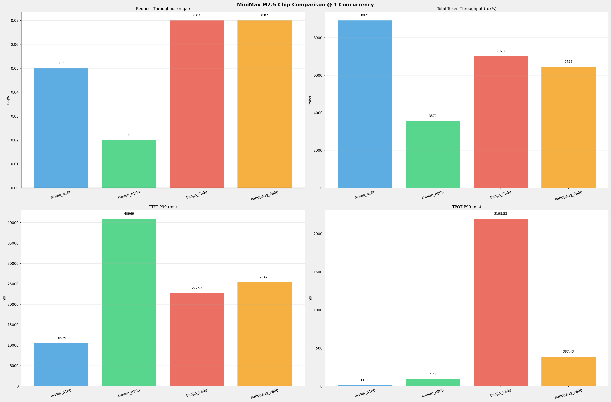
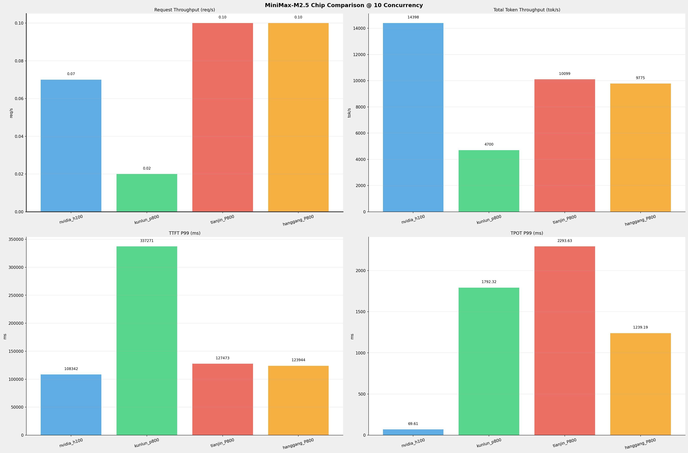
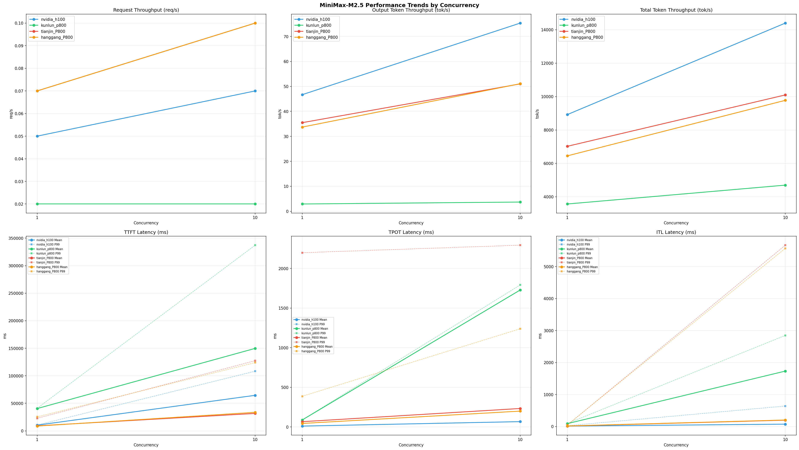

# MiniMax-M2.5模型在不同芯片下的benchmark基准测试报告

**测试日期：** 2026-07-13

---

## 测试场景
在固定请求数，输入上下文和输出上下文长度下，使用vllm bench serve工具对并发数逐级增加场景的性能基准验证。并对比同一模型在不同芯片环境上的性能指标。

**主要采集指标**：

| 指标                  | 单位         | 含义                                 |
|---------------------|------------|------------------------------------|
| TTFT                | ms         | Time To First Token，首 token 延迟     |
| TPOT                | ms/token   | Time Per Output Token，每 token 生成时间 |
| Throughput          | tokens/s   | 系统总吞吐                              |
| QPS                 | requests/s | 请求吞吐                               |
| P50/P95/P99 Latency | ms         | 延迟分位数                              |
    
### 📊 测试概览

| 项目            | 配置                                     | 备注  |
|---------------|----------------------------------------|-----|
| **数据集**       | random                                 |     |
| **并发数**       | 1, 2, 4, 8, 10    |     |
| **总请求数**      | 100                                    |     |
| **请求输入上下文长度** | 194560（190k）                             |     |
| **请求输出上下文长度** | 1024（1k）                             |     |
| **被测芯片**      | nvidia_h100, kunlun_p800, tianjin_P800, hanggang_P800 |     |
| **被测模型**      | MiniMax-M2.5 |     |

---

### 🤖 芯片和模型配置信息

| 参数名称 | **nvidia_h100** | **kunlun_p800** | **tianjin_P800** | **hanggang_P800** |
|----------|----------|----------|----------|----------|
| **max_position_embeddings** | 196608 | 196608 | 196608 | 196608 |
| **model_name** | MiniMax-M2.5 | MiniMax-M2.5-W8A8-INT8-Dynamic | MiniMax-M2.5-int8 | MiniMax-M2.5-int8 |
| **model_size** | 215G | 215G | 215G | 215G |
| **python_version** | 3.12.3 | 3.10.15 | 3.10.19 | 3.10.19 |
| **quantization_config** | FP8 | int-8 | w8a8_int8 | w8a8_int8 |
| **sglang_version** | N/A | N/A | 0.5.10+08768c8f9 | 0.5.10+08768c8f9 |
| **temperature** | 1.0 | 1.0 | 1.0 | 1.0 |
| **top_k** | 40 | 40 | 40 | 40 |
| **top_p** | 0.95 | 0.95 | 0.95 | 0.95 |
| **transformers_version** | 4.46.1 | 4.46.1 | 4.46.1 | 4.46.1 |
| **vllm_version** | 0.20.0 | 0.11.0 | N/A | N/A |

---

### ⚙️ vLLM启动配置信息

| 参数名称 | **nvidia_h100** | **kunlun_p800** | **tianjin_P800** | **hanggang_P800** |
|----------|----------|----------|----------|----------|
| **Attention Backend** | N/A | N/A | kunlun | kunlun |
| **Block Size** | default | 128 | N/A | N/A |
| **Chunked Prefill Size** | N/A | N/A | 8192 | 8192 |
| **Context Length** | N/A | N/A | 196608 | 196608 |
| **Cuda Graph Max Bs** | N/A | N/A | 128 | 128 |
| **Disable Radix Cache** | N/A | N/A | True | True |
| **Dp** | 1 | 1 | N/A | N/A |
| **Dp Size** | N/A | N/A | 1 | 1 |
| **Dtype** | default | auto | bfloat16 | bfloat16 |
| **Enable Auto Tool Choice** | True | True | N/A | N/A |
| **Enable Export Parallel** | True | False | N/A | N/A |
| **Ep Size** | N/A | N/A | 8 | 8 |
| **Gpu Memory Utilization** | 0.85 | 0.95 | N/A | N/A |
| **Max Model Len** | 196608 | 196608 | N/A | N/A |
| **Max Num Batched Tokens** | 8192 | 8192 | N/A | N/A |
| **Max Num Seqs** | 64 | 64 | N/A | N/A |
| **Max Running Requests** | N/A | N/A | 64 | 64 |
| **Mem Fraction Static** | N/A | N/A | 0.85 | 0.85 |
| **Model Name** | MiniMax-M2.5 | MiniMax-M2.5-W8A8-INT8-Dynamic | MiniMax-M2.5-int8 | MiniMax-M2.5-int8 |
| **Pp** | 1 | 1 | N/A | N/A |
| **Pp Size** | N/A | N/A | 1 | 1 |
| **Reasoning Parser** | minimax_m2 | minimax_m2 (不生效) | minimax | minimax |
| **Tool Call Parser** | minimax_m2 | minimax_m2 | minimax_m2 | minimax_m2 |
| **Tp** | 8 | 8 | N/A | N/A |
| **Tp Size** | N/A | N/A | 8 | 8 |

- **nvidia_h100**: 英伟达H100标准配置
- **kunlun_p800**: 昆仑芯不启用专家并行避免通信问题
- **tianjin_P800**: tianjin_P800启动配置
- **hanggang_P800**: hanggang_P800启动配置

---

### 📊 芯片性能对比柱状图

**1并发**

**10并发**

### 📈 性能趋势对比图 (所有芯片)

---

### 📈 各指标随并发级别性能对比详情

#### 请求吞吐量（Request throughput (req/s)）

| 并发数 | nvidia_h100(基准) | kunlun_p800 | 相对基准 | tianjin_P800 | 相对基准 | hanggang_P800 | 相对基准 |
|-----|----------- | ----------- | ----------- | ----------- | ----------- | ----------- | -----------|
| 1   | 0.05 | 0.02 | -60.0% | 0.07 | +40.0% | 0.07 | +40.0% |
| 10   | 0.07 | 0.02 | -71.4% | 0.10 | +42.9% | 0.10 | +42.9% |

#### 输出token吞吐量（Output token throughput (tok/s)）

| 并发数 | nvidia_h100(基准) | kunlun_p800 | 相对基准 | tianjin_P800 | 相对基准 | hanggang_P800 | 相对基准 |
|-----|----------- | ----------- | ----------- | ----------- | ----------- | ----------- | -----------|
| 1   | 46.70 | 2.92 | -93.7% | 35.49 | -24.0% | 33.72 | -27.8% |
| 10   | 75.37 | 3.70 | -95.1% | 51.02 | -32.3% | 51.09 | -32.2% |

#### 总token吞吐量（Total token throughput (tok/s)）

| 并发数 | nvidia_h100(基准) | kunlun_p800 | 相对基准 | tianjin_P800 | 相对基准 | hanggang_P800 | 相对基准 |
|-----|----------- | ----------- | ----------- | ----------- | ----------- | ----------- | -----------|
| 1   | 8921.40 | 3571.06 | -60.0% | 7023.45 | -21.3% | 6451.81 | -27.7% |
| 10   | 14398.41 | 4699.60 | -67.4% | 10098.73 | -29.9% | 9775.15 | -32.1% |

#### 首token延迟（P99 TTFT (ms)）

| 并发数 | nvidia_h100(基准) | kunlun_p800 | 相对基准 | tianjin_P800 | 相对基准 | hanggang_P800 | 相对基准 |
|-----|----------- | ----------- | ----------- | ----------- | ----------- | ----------- | -----------|
| 1   | 10539.10 | 40968.87 | +288.7% | 22758.65 | +115.9% | 25424.84 | +141.2% |
| 10   | 108342.29 | 337270.92 | +211.3% | 127473.40 | +17.7% | 123944.29 | +14.4% |

#### 每token生成时间（P99 TPOT (ms)）

| 并发数 | nvidia_h100(基准) | kunlun_p800 | 相对基准 | tianjin_P800 | 相对基准 | hanggang_P800 | 相对基准 |
|-----|----------- | ----------- | ----------- | ----------- | ----------- | ----------- | -----------|
| 1   | 11.39 | 89.90 | +689.3% | 2198.53 | +19202.3% | 387.43 | +3301.5% |
| 10   | 69.61 | 1792.32 | +2474.8% | 2293.63 | +3195.0% | 1239.19 | +1680.2% |

#### token间延迟（P99 ITL (ms)）

| 并发数 | nvidia_h100(基准) | kunlun_p800 | 相对基准 | tianjin_P800 | 相对基准 | hanggang_P800 | 相对基准 |
|-----|----------- | ----------- | ----------- | ----------- | ----------- | ----------- | -----------|
| 1   | 22.97 | 93.69 | +307.9% | 44.22 | +92.5% | 49.10 | +113.8% |
| 10   | 639.97 | 2848.90 | +345.2% | 5670.42 | +786.0% | 5572.12 | +770.7% |

### 📈 各并发级别性能对比详情

### 1 并发

#### 服务基准结果

| 指标 | nvidia_h100 | nvidia_h100差异 | kunlun_p800 | kunlun_p800差异 | tianjin_P800 | tianjin_P800差异 | hanggang_P800 | hanggang_P800差异 |
|------|----------- | ----------- | ----------- | ----------- | ----------- | ----------- | ----------- | -----------|
| 成功请求数 | 100 | - | 100 | +0.0% | 100 | +0.0% | 100 | +0.0% |
| 失败请求数 | 0 | - | 0 | - | 0 | - | 0 | - |
| 测试持续时间 (s) | 2192.74 | - | 5452.69 | +148.7% | 1460.75 | -33.4% | 1480.98 | -32.5% |
| 总输入 tokens | 19459900 | - | 19456000 | -0.0% | 10207684 | -47.5% | 9505082 | -51.2% |
| 总生成 tokens | 102400 | - | 15925 | -84.4% | 51835 | -49.4% | 49937 | -51.2% |
| **请求吞吐量 (req/s)** | 0.05 | - | 0.02 | -60.0% | **0.07** ⭐ | +40.0% | 0.07 | +40.0% |
| **输出 token 吞吐量 (tok/s)** | **46.70** ⭐ | - | 2.92 | -93.7% | 35.49 | -24.0% | 33.72 | -27.8% |
| 峰值输出 token 吞吐量 (tok/s) | **88.00** ⭐ | - | 13.00 | -85.2% | 56.00 | -36.4% | 50.00 | -43.2% |
| 峰值并发请求数 | 2.00 | - | 2.00 | +0.0% | 3 | +50.0% | 2 | +0.0% |
| **总 token 吞吐量 (tok/s)** | **8921.40** ⭐ | - | 3571.06 | -60.0% | 7023.45 | -21.3% | 6451.81 | -27.7% |

#### 首Token延迟 (TTFT)

| 指标 | nvidia_h100 | nvidia_h100差异 | kunlun_p800 | kunlun_p800差异 | tianjin_P800 | tianjin_P800差异 | hanggang_P800 | hanggang_P800差异 |
|------|----------- | ----------- | ----------- | ----------- | ----------- | ----------- | ----------- | -----------|
| 平均 TTFT (ms) | 10341.23 | - | 40485.44 | +291.5% | 9067.95 | -12.3% | **8655.04** ⭐ | -16.3% |
| 中位 TTFT (ms) | 10434.85 | - | 40877.83 | +291.7% | **7201.33** ⭐ | -31.0% | 7297.10 | -30.1% |
| P95 TTFT (ms) | **10504.46** ⭐ | - | 40934.49 | +289.7% | 0 | -100.0% | 0 | -100.0% |
| P99 TTFT (ms) | **10539.10** ⭐ | - | 40968.87 | +288.7% | 22758.65 | +115.9% | 25424.84 | +141.2% |

#### 每Token生成时间 (TPOT)

| 指标 | nvidia_h100 | nvidia_h100差异 | kunlun_p800 | kunlun_p800差异 | tianjin_P800 | tianjin_P800差异 | hanggang_P800 | hanggang_P800差异 |
|------|----------- | ----------- | ----------- | ----------- | ----------- | ----------- | ----------- | -----------|
| 平均 TPOT (ms) | **11.33** ⭐ | - | 88.72 | +683.1% | 66.75 | +489.1% | 44.51 | +292.9% |
| 中位 TPOT (ms) | 11.32 | - | 88.67 | +683.3% | **7.94** ⭐ | -29.9% | 9.15 | -19.2% |
| P95 TPOT (ms) | **11.38** ⭐ | - | 88.90 | +681.2% | 0 | -100.0% | 0 | -100.0% |
| P99 TPOT (ms) | **11.39** ⭐ | - | 89.90 | +689.3% | 2198.53 | +19202.3% | 387.43 | +3301.5% |

#### Token间延迟 (ITL)

| 指标 | nvidia_h100 | nvidia_h100差异 | kunlun_p800 | kunlun_p800差异 | tianjin_P800 | tianjin_P800差异 | hanggang_P800 | hanggang_P800差异 |
|------|----------- | ----------- | ----------- | ----------- | ----------- | ----------- | ----------- | -----------|
| 平均 ITL (ms) | **12.11** ⭐ | - | 88.82 | +633.4% | 13.01 | +7.4% | 15.76 | +30.1% |
| 中位 ITL (ms) | 11.42 | - | 88.67 | +676.4% | **8.98** ⭐ | -21.4% | 11.03 | -3.4% |
| P95 ITL (ms) | **12.01** ⭐ | - | 89.13 | +642.1% | 23.43 | +95.1% | 25.75 | +114.4% |
| P99 ITL (ms) | **22.97** ⭐ | - | 93.69 | +307.9% | 44.22 | +92.5% | 49.10 | +113.8% |

---

### 10 并发

#### 服务基准结果

| 指标 | nvidia_h100 | nvidia_h100差异 | kunlun_p800 | kunlun_p800差异 | tianjin_P800 | tianjin_P800差异 | hanggang_P800 | hanggang_P800差异 |
|------|----------- | ----------- | ----------- | ----------- | ----------- | ----------- | ----------- | -----------|
| 成功请求数 | 100 | - | 100 | +0.0% | 100 | +0.0% | 100 | +0.0% |
| 失败请求数 | 0 | - | 0 | - | 0 | - | 0 | - |
| 测试持续时间 (s) | 1358.64 | - | 4143.20 | +205.0% | 1015.92 | -25.2% | 977.48 | -28.1% |
| 总输入 tokens | 19459900 | - | 19456000 | -0.0% | 10207684 | -47.5% | 9505082 | -51.2% |
| 总生成 tokens | 102400 | - | 15343 | -85.0% | 51835 | -49.4% | 49937 | -51.2% |
| **请求吞吐量 (req/s)** | 0.07 | - | 0.02 | -71.4% | **0.10** ⭐ | +42.9% | 0.10 | +42.9% |
| **输出 token 吞吐量 (tok/s)** | **75.37** ⭐ | - | 3.70 | -95.1% | 51.02 | -32.3% | 51.09 | -32.2% |
| 峰值输出 token 吞吐量 (tok/s) | **275.00** ⭐ | - | 19.00 | -93.1% | 143.00 | -48.0% | 147.00 | -46.5% |
| 峰值并发请求数 | 11.00 | - | 11.00 | +0.0% | 12 | +9.1% | 12 | +9.1% |
| **总 token 吞吐量 (tok/s)** | **14398.41** ⭐ | - | 4699.60 | -67.4% | 10098.73 | -29.9% | 9775.15 | -32.1% |

#### 首Token延迟 (TTFT)

| 指标 | nvidia_h100 | nvidia_h100差异 | kunlun_p800 | kunlun_p800差异 | tianjin_P800 | tianjin_P800差异 | hanggang_P800 | hanggang_P800差异 |
|------|----------- | ----------- | ----------- | ----------- | ----------- | ----------- | ----------- | -----------|
| 平均 TTFT (ms) | 64545.59 | - | 149787.10 | +132.1% | **31642.34** ⭐ | -51.0% | 33642.88 | -47.9% |
| 中位 TTFT (ms) | 63613.81 | - | 154911.93 | +143.5% | 28465.50 | -55.3% | **27421.76** ⭐ | -56.9% |
| P95 TTFT (ms) | **72047.66** ⭐ | - | 221884.89 | +208.0% | 0 | -100.0% | 0 | -100.0% |
| P99 TTFT (ms) | **108342.29** ⭐ | - | 337270.92 | +211.3% | 127473.40 | +17.7% | 123944.29 | +14.4% |

#### 每Token生成时间 (TPOT)

| 指标 | nvidia_h100 | nvidia_h100差异 | kunlun_p800 | kunlun_p800差异 | tianjin_P800 | tianjin_P800差异 | hanggang_P800 | hanggang_P800差异 |
|------|----------- | ----------- | ----------- | ----------- | ----------- | ----------- | ----------- | -----------|
| 平均 TPOT (ms) | **67.50** ⭐ | - | 1728.70 | +2461.0% | 233.23 | +245.5% | 200.01 | +196.3% |
| 中位 TPOT (ms) | **69.02** ⭐ | - | 1727.79 | +2403.3% | 120.69 | +74.9% | 134.39 | +94.7% |
| P95 TPOT (ms) | **69.59** ⭐ | - | 1774.08 | +2449.3% | 0 | -100.0% | 0 | -100.0% |
| P99 TPOT (ms) | **69.61** ⭐ | - | 1792.32 | +2474.8% | 2293.63 | +3195.0% | 1239.19 | +1680.2% |

#### Token间延迟 (ITL)

| 指标 | nvidia_h100 | nvidia_h100差异 | kunlun_p800 | kunlun_p800差异 | tianjin_P800 | tianjin_P800差异 | hanggang_P800 | hanggang_P800差异 |
|------|----------- | ----------- | ----------- | ----------- | ----------- | ----------- | ----------- | -----------|
| 平均 ITL (ms) | **72.39** ⭐ | - | 1732.23 | +2292.9% | 196.67 | +171.7% | 201.76 | +178.7% |
| 中位 ITL (ms) | 21.91 | - | 1717.47 | +7738.7% | **18.67** ⭐ | -14.8% | 22.93 | +4.7% |
| P95 ITL (ms) | 440.01 | - | 2749.37 | +524.8% | 143.37 | -67.4% | **141.66** ⭐ | -67.8% |
| P99 ITL (ms) | **639.97** ⭐ | - | 2848.90 | +345.2% | 5670.42 | +786.0% | 5572.12 | +770.7% |

---

---

*报告生成时间: 2026-07-13*

