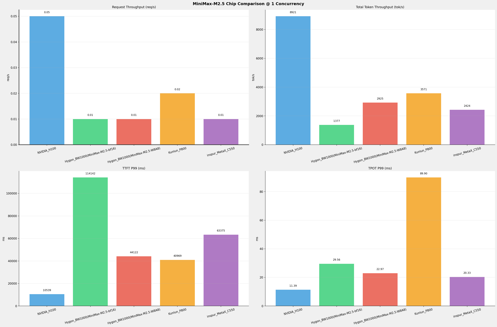
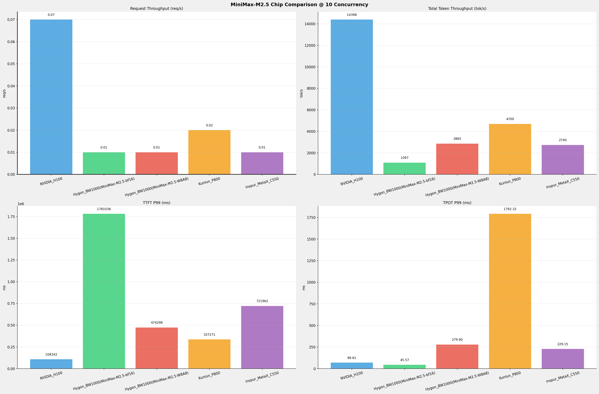
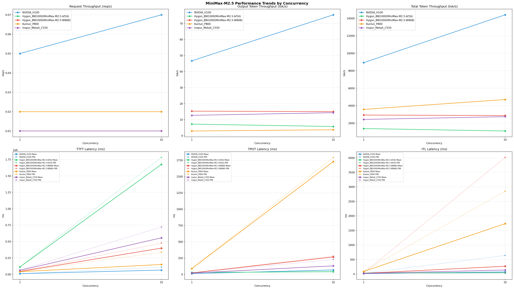

# MiniMax-M2.5模型在不同芯片下的benchmark基准测试报告

**测试日期：** 2026-06-09

---

## 测试场景
在固定请求数，输入上下文和输出上下文长度下，使用vllm bench serve工具对并发数逐级增加场景的性能基准验证。并对比同一模型在不同芯片环境上的性能指标。

**主要采集指标**：

| 指标                  | 单位         | 含义                                 |
|---------------------|------------|------------------------------------|
| TTFT                | ms         | Time To First Token，首 token 延迟     |
| TPOT                | ms/token   | Time Per Output Token，每 token 生成时间 |
| Throughput          | tokens/s   | 系统总吞吐                              |
| QPS                 | requests/s | 请求吞吐                               |
| P50/P95/P99 Latency | ms         | 延迟分位数                              |
    
### 📊 测试概览

| 项目            | 配置                                     | 备注  |
|---------------|----------------------------------------|-----|
| **数据集**       | random                                 |     |
| **并发数**       | 1, 2, 4, 8, 10    |     |
| **总请求数**      | 100                                    |     |
| **请求输入上下文长度** | 194560（190k）                             |     |
| **请求输出上下文长度** | 1024（1k）                             |     |
| **被测芯片**      | NVIDIA_H100, Hygon_BW1000(MiniMax-M2.5-bf16), Hygon_BW1000(MiniMax-M2.5-W8A8), Kunlun_P800, inspur_MetaX_C550 |     |
| **被测模型**      | MiniMax-M2.5 |     |

---

### 🤖 芯片和模型配置信息

| 参数名称 | **NVIDIA_H100** | **Hygon_BW1000(MiniMax-M2.5-bf16)** | **Hygon_BW1000(MiniMax-M2.5-W8A8)** | **Kunlun_P800** | **inspur_MetaX_C550** |
|----------|----------|----------|----------|----------|----------|
| **max_position_embeddings** | 196608 | 196608 | 196608 | 196608 | N/A |
| **model_name** | MiniMax-M2.5 | MiniMax-M2.5-bf16 | MiniMax-M2.5-W8A8 | MiniMax-M2.5-W8A8-INT8-Dynamic | N/A |
| **model_size** | 215G | 427G | 215G | 215G | N/A |
| **python_version** | 3.12.3 | 3.10.12 | 3.10.12 | 3.10.15 | N/A |
| **quantization_config** | FP8 | bf16 | int-8 | int-8 | N/A |
| **temperature** | 1.0 | N/A | N/A | 1.0 | N/A |
| **top_k** | 40 | N/A | N/A | 40 | N/A |
| **top_p** | 0.95 | N/A | N/A | 0.95 | N/A |
| **transformers_version** | 4.46.1 | 4.46.1 | 4.57.6 | 4.46.1 | N/A |
| **vllm_version** | 0.20.0 | 0.11.0+das.opt1.rc2.dtk2604.20260128.g0bf89b0c | 0.15.1+das.opt1.alpha.dtk2604 | 0.11.0 | N/A |

---

### ⚙️ vLLM启动配置信息

| 参数名称 | **NVIDIA_H100** | **Hygon_BW1000(MiniMax-M2.5-bf16)** | **Hygon_BW1000(MiniMax-M2.5-W8A8)** | **Kunlun_P800** | **inspur_MetaX_C550** |
|----------|----------|----------|----------|----------|----------|
| **Block Size** | default | default | default | 128 | N/A |
| **Compilation Config** | N/A | N/A | N/A | {"splitting_ops":["vllm.unified_attention","vllm.unified_attention_with_output","vllm.unified_attention_with_output_kunlun","vllm.mamba_mixer2","vllm.mamba_mixer","vllm.short_conv","vllm.linear_attention","vllm.plamo2_mamba_mixer","vllm.gdn_attention","vllm.sparse_attn_indexer","vllm.sparse_attn_indexer_vllm_kunlun"]} | N/A |
| **Dp** | 1 | 1 | 1 | 1 | N/A |
| **Dtype** | default | bfloat16 | bfloat16 | auto | N/A |
| **Enable Auto Tool Choice** | True | True | True | True | N/A |
| **Enable Export Parallel** | True | True | True | False | N/A |
| **Gpu Memory Utilization** | 0.85 | 0.98 | 0.9 | 0.95 | N/A |
| **Max Model Len** | 196608 | 196608 | 196608 | 196608 | N/A |
| **Max Num Batched Tokens** | 8192 | default | default | 8192 | N/A |
| **Max Num Seqs** | 64 | 64 | 64 | 64 | N/A |
| **Model Name** | MiniMax-M2.5 | MiniMax-M2.5-bf16 | MiniMax-M2.5-W8A8 | MiniMax-M2.5-W8A8-INT8-Dynamic | N/A |
| **Pp** | 1 | 1 | 1 | 1 | N/A |
| **Reasoning Parser** | minimax_m2 | minimax_m2 (不生效) | minimax_m2 (不生效) | minimax_m2 (不生效) | N/A |
| **Tool Call Parser** | minimax_m2 | minimax_m2 | minimax_m2 | minimax_m2 | N/A |
| **Tp** | 8 | 8 | 8 | 8 | N/A |

- **NVIDIA_H100**: 英伟达H100标准配置
- **Hygon_BW1000(MiniMax-M2.5-bf16)**: 海光芯片专家并行配置
- **Hygon_BW1000(MiniMax-M2.5-W8A8)**: 海光芯片专家并行配置
- **Kunlun_P800**: 昆仑芯不启用专家并行避免通信问题

---

### 📊 芯片性能对比柱状图

**1并发**

**10并发**

### 📈 性能趋势对比图 (所有芯片)

---

### 📈 各指标随并发级别性能对比详情

#### 请求吞吐量（Request throughput (req/s)）

| 并发数 | NVIDIA_H100(基准) | Hygon_BW1000(MiniMax-M2.5-bf16) | 相对基准 | Hygon_BW1000(MiniMax-M2.5-W8A8) | 相对基准 | Kunlun_P800 | 相对基准 | inspur_MetaX_C550 | 相对基准 |
|-----|----------- | ----------- | ----------- | ----------- | ----------- | ----------- | ----------- | ----------- | -----------|
| 1   | 0.05 | 0.01 | -80.0% | 0.01 | -80.0% | 0.02 | -60.0% | 0.01 | -80.0% |
| 10   | 0.07 | 0.01 | -85.7% | 0.01 | -85.7% | 0.02 | -71.4% | 0.01 | -85.7% |

#### 输出token吞吐量（Output token throughput (tok/s)）

| 并发数 | NVIDIA_H100(基准) | Hygon_BW1000(MiniMax-M2.5-bf16) | 相对基准 | Hygon_BW1000(MiniMax-M2.5-W8A8) | 相对基准 | Kunlun_P800 | 相对基准 | inspur_MetaX_C550 | 相对基准 |
|-----|----------- | ----------- | ----------- | ----------- | ----------- | ----------- | ----------- | ----------- | -----------|
| 1   | 46.70 | 7.21 | -84.6% | 15.31 | -67.2% | 2.92 | -93.7% | 12.69 | -72.8% |
| 10   | 75.37 | 5.74 | -92.4% | 15.00 | -80.1% | 3.70 | -95.1% | 14.34 | -81.0% |

#### 总token吞吐量（Total token throughput (tok/s)）

| 并发数 | NVIDIA_H100(基准) | Hygon_BW1000(MiniMax-M2.5-bf16) | 相对基准 | Hygon_BW1000(MiniMax-M2.5-W8A8) | 相对基准 | Kunlun_P800 | 相对基准 | inspur_MetaX_C550 | 相对基准 |
|-----|----------- | ----------- | ----------- | ----------- | ----------- | ----------- | ----------- | ----------- | -----------|
| 1   | 8921.40 | 1376.58 | -84.6% | 2924.75 | -67.2% | 3571.06 | -60.0% | 2424.14 | -72.8% |
| 10   | 14398.41 | 1096.76 | -92.4% | 2865.09 | -80.1% | 4699.60 | -67.4% | 2739.59 | -81.0% |

#### 首token延迟（P99 TTFT (ms)）

| 并发数 | NVIDIA_H100(基准) | Hygon_BW1000(MiniMax-M2.5-bf16) | 相对基准 | Hygon_BW1000(MiniMax-M2.5-W8A8) | 相对基准 | Kunlun_P800 | 相对基准 | inspur_MetaX_C550 | 相对基准 |
|-----|----------- | ----------- | ----------- | ----------- | ----------- | ----------- | ----------- | ----------- | -----------|
| 1   | 10539.10 | 114142.41 | +983.0% | 44121.71 | +318.6% | 40968.87 | +288.7% | 63374.54 | +501.3% |
| 10   | 108342.29 | 1781035.71 | +1543.9% | 474297.92 | +337.8% | 337270.92 | +211.3% | 721962.01 | +566.4% |

#### 每token生成时间（P99 TPOT (ms)）

| 并发数 | NVIDIA_H100(基准) | Hygon_BW1000(MiniMax-M2.5-bf16) | 相对基准 | Hygon_BW1000(MiniMax-M2.5-W8A8) | 相对基准 | Kunlun_P800 | 相对基准 | inspur_MetaX_C550 | 相对基准 |
|-----|----------- | ----------- | ----------- | ----------- | ----------- | ----------- | ----------- | ----------- | -----------|
| 1   | 11.39 | 29.56 | +159.5% | 22.97 | +101.7% | 89.90 | +689.3% | 20.33 | +78.5% |
| 10   | 69.61 | 45.57 | -34.5% | 279.90 | +302.1% | 1792.32 | +2474.8% | 229.15 | +229.2% |

#### token间延迟（P99 ITL (ms)）

| 并发数 | NVIDIA_H100(基准) | Hygon_BW1000(MiniMax-M2.5-bf16) | 相对基准 | Hygon_BW1000(MiniMax-M2.5-W8A8) | 相对基准 | Kunlun_P800 | 相对基准 | inspur_MetaX_C550 | 相对基准 |
|-----|----------- | ----------- | ----------- | ----------- | ----------- | ----------- | ----------- | ----------- | -----------|
| 1   | 22.97 | 53.91 | +134.7% | 32.12 | +39.8% | 93.69 | +307.9% | 24.42 | +6.3% |
| 10   | 639.97 | 55.14 | -91.4% | 4012.34 | +527.0% | 2848.90 | +345.2% | 46.84 | -92.7% |

### 📈 各并发级别性能对比详情

### 1 并发

#### 服务基准结果

| 指标 | NVIDIA_H100 | NVIDIA_H100差异 | Hygon_BW1000(MiniMax-M2.5-bf16) | Hygon_BW1000(MiniMax-M2.5-bf16)差异 | Hygon_BW1000(MiniMax-M2.5-W8A8) | Hygon_BW1000(MiniMax-M2.5-W8A8)差异 | Kunlun_P800 | Kunlun_P800差异 | inspur_MetaX_C550 | inspur_MetaX_C550差异 |
|------|----------- | ----------- | ----------- | ----------- | ----------- | ----------- | ----------- | ----------- | ----------- | -----------|
| 成功请求数 | 100 | - | 100 | +0.0% | 100 | +0.0% | 100 | +0.0% | 100 | +0.0% |
| 失败请求数 | 0 | - | 0 | - | 0 | - | 0 | - | 0 | - |
| 测试持续时间 (s) | 2192.74 | - | 14207.97 | +548.0% | 6687.21 | +205.0% | 5452.69 | +148.7% | 8068.18 | +267.9% |
| 总输入 tokens | 19459900 | - | 19456000 | -0.0% | 19456000 | -0.0% | 19456000 | -0.0% | 19456000 | -0.0% |
| 总生成 tokens | 102400 | - | 102400 | +0.0% | 102400 | +0.0% | 15925 | -84.4% | 102400 | +0.0% |
| **请求吞吐量 (req/s)** | **0.05** ⭐ | - | 0.01 | -80.0% | 0.01 | -80.0% | 0.02 | -60.0% | 0.01 | -80.0% |
| **输出 token 吞吐量 (tok/s)** | **46.70** ⭐ | - | 7.21 | -84.6% | 15.31 | -67.2% | 2.92 | -93.7% | 12.69 | -72.8% |
| 峰值输出 token 吞吐量 (tok/s) | **88.00** ⭐ | - | 39.00 | -55.7% | 47.00 | -46.6% | 13.00 | -85.2% | 50.00 | -43.2% |
| 峰值并发请求数 | 2.00 | - | 2.00 | +0.0% | 2.00 | +0.0% | 2.00 | +0.0% | 3 | +50.0% |
| **总 token 吞吐量 (tok/s)** | **8921.40** ⭐ | - | 1376.58 | -84.6% | 2924.75 | -67.2% | 3571.06 | -60.0% | 2424.14 | -72.8% |

#### 首Token延迟 (TTFT)

| 指标 | NVIDIA_H100 | NVIDIA_H100差异 | Hygon_BW1000(MiniMax-M2.5-bf16) | Hygon_BW1000(MiniMax-M2.5-bf16)差异 | Hygon_BW1000(MiniMax-M2.5-W8A8) | Hygon_BW1000(MiniMax-M2.5-W8A8)差异 | Kunlun_P800 | Kunlun_P800差异 | inspur_MetaX_C550 | inspur_MetaX_C550差异 |
|------|----------- | ----------- | ----------- | ----------- | ----------- | ----------- | ----------- | ----------- | ----------- | -----------|
| 平均 TTFT (ms) | **10341.23** ⭐ | - | 111977.70 | +982.8% | 43487.80 | +320.5% | 40485.44 | +291.5% | 60714.60 | +487.1% |
| 中位 TTFT (ms) | **10434.85** ⭐ | - | 113467.99 | +987.4% | 43910.38 | +320.8% | 40877.83 | +291.7% | 63251.29 | +506.2% |
| P95 TTFT (ms) | **10504.46** ⭐ | - | 113900.00 | +984.3% | 44091.15 | +319.7% | 40934.49 | +289.7% | 0 | -100.0% |
| P99 TTFT (ms) | **10539.10** ⭐ | - | 114142.41 | +983.0% | 44121.71 | +318.6% | 40968.87 | +288.7% | 63374.54 | +501.3% |

#### 每Token生成时间 (TPOT)

| 指标 | NVIDIA_H100 | NVIDIA_H100差异 | Hygon_BW1000(MiniMax-M2.5-bf16) | Hygon_BW1000(MiniMax-M2.5-bf16)差异 | Hygon_BW1000(MiniMax-M2.5-W8A8) | Hygon_BW1000(MiniMax-M2.5-W8A8)差异 | Kunlun_P800 | Kunlun_P800差异 | inspur_MetaX_C550 | inspur_MetaX_C550差异 |
|------|----------- | ----------- | ----------- | ----------- | ----------- | ----------- | ----------- | ----------- | ----------- | -----------|
| 平均 TPOT (ms) | **11.33** ⭐ | - | 29.42 | +159.7% | 22.86 | +101.8% | 88.72 | +683.1% | 19.52 | +72.3% |
| 中位 TPOT (ms) | **11.32** ⭐ | - | 29.42 | +159.9% | 22.86 | +101.9% | 88.67 | +683.3% | 20.32 | +79.5% |
| P95 TPOT (ms) | **11.38** ⭐ | - | 29.55 | +159.7% | 22.96 | +101.8% | 88.90 | +681.2% | 0 | -100.0% |
| P99 TPOT (ms) | **11.39** ⭐ | - | 29.56 | +159.5% | 22.97 | +101.7% | 89.90 | +689.3% | 20.33 | +78.5% |

#### Token间延迟 (ITL)

| 指标 | NVIDIA_H100 | NVIDIA_H100差异 | Hygon_BW1000(MiniMax-M2.5-bf16) | Hygon_BW1000(MiniMax-M2.5-bf16)差异 | Hygon_BW1000(MiniMax-M2.5-W8A8) | Hygon_BW1000(MiniMax-M2.5-W8A8)差异 | Kunlun_P800 | Kunlun_P800差异 | inspur_MetaX_C550 | inspur_MetaX_C550差异 |
|------|----------- | ----------- | ----------- | ----------- | ----------- | ----------- | ----------- | ----------- | ----------- | -----------|
| 平均 ITL (ms) | **12.11** ⭐ | - | 29.51 | +143.7% | 22.88 | +88.9% | 88.82 | +633.4% | 20.32 | +67.8% |
| 中位 ITL (ms) | **11.42** ⭐ | - | 29.42 | +157.6% | 22.85 | +100.1% | 88.67 | +676.4% | 20.32 | +77.9% |
| P95 ITL (ms) | **12.01** ⭐ | - | 32.11 | +167.4% | 23.57 | +96.3% | 89.13 | +642.1% | 20.36 | +69.5% |
| P99 ITL (ms) | **22.97** ⭐ | - | 53.91 | +134.7% | 32.12 | +39.8% | 93.69 | +307.9% | 24.42 | +6.3% |

---

### 10 并发

#### 服务基准结果

| 指标 | NVIDIA_H100 | NVIDIA_H100差异 | Hygon_BW1000(MiniMax-M2.5-bf16) | Hygon_BW1000(MiniMax-M2.5-bf16)差异 | Hygon_BW1000(MiniMax-M2.5-W8A8) | Hygon_BW1000(MiniMax-M2.5-W8A8)差异 | Kunlun_P800 | Kunlun_P800差异 | inspur_MetaX_C550 | inspur_MetaX_C550差异 |
|------|----------- | ----------- | ----------- | ----------- | ----------- | ----------- | ----------- | ----------- | ----------- | -----------|
| 成功请求数 | 100 | - | 100 | +0.0% | 100 | +0.0% | 100 | +0.0% | 100 | +0.0% |
| 失败请求数 | 0 | - | 0 | - | 0 | - | 0 | - | 0 | - |
| 测试持续时间 (s) | 1358.64 | - | 17832.87 | +1212.6% | 6826.46 | +402.4% | 4143.20 | +205.0% | 7139.17 | +425.5% |
| 总输入 tokens | 19459900 | - | 19456000 | -0.0% | 19456000 | -0.0% | 19456000 | -0.0% | 19456000 | -0.0% |
| 总生成 tokens | 102400 | - | 102400 | +0.0% | 102400 | +0.0% | 15343 | -85.0% | 102400 | +0.0% |
| **请求吞吐量 (req/s)** | **0.07** ⭐ | - | 0.01 | -85.7% | 0.01 | -85.7% | 0.02 | -71.4% | 0.01 | -85.7% |
| **输出 token 吞吐量 (tok/s)** | **75.37** ⭐ | - | 5.74 | -92.4% | 15.00 | -80.1% | 3.70 | -95.1% | 14.34 | -81.0% |
| 峰值输出 token 吞吐量 (tok/s) | **275.00** ⭐ | - | 39.00 | -85.8% | 145.00 | -47.3% | 19.00 | -93.1% | 93.00 | -66.2% |
| 峰值并发请求数 | 11.00 | - | 11.00 | +0.0% | 12.00 | +9.1% | 11.00 | +0.0% | 14 | +27.3% |
| **总 token 吞吐量 (tok/s)** | **14398.41** ⭐ | - | 1096.76 | -92.4% | 2865.09 | -80.1% | 4699.60 | -67.4% | 2739.59 | -81.0% |

#### 首Token延迟 (TTFT)

| 指标 | NVIDIA_H100 | NVIDIA_H100差异 | Hygon_BW1000(MiniMax-M2.5-bf16) | Hygon_BW1000(MiniMax-M2.5-bf16)差异 | Hygon_BW1000(MiniMax-M2.5-W8A8) | Hygon_BW1000(MiniMax-M2.5-W8A8)差异 | Kunlun_P800 | Kunlun_P800差异 | inspur_MetaX_C550 | inspur_MetaX_C550差异 |
|------|----------- | ----------- | ----------- | ----------- | ----------- | ----------- | ----------- | ----------- | ----------- | -----------|
| 平均 TTFT (ms) | **64545.59** ⭐ | - | 1675058.97 | +2495.2% | 399184.25 | +518.5% | 149787.10 | +132.1% | 556209.89 | +761.7% |
| 中位 TTFT (ms) | **63613.81** ⭐ | - | 1774448.89 | +2689.4% | 414031.08 | +550.9% | 154911.93 | +143.5% | 550150.31 | +764.8% |
| P95 TTFT (ms) | **72047.66** ⭐ | - | 1780264.33 | +2371.0% | 441820.31 | +513.2% | 221884.89 | +208.0% | 0 | -100.0% |
| P99 TTFT (ms) | **108342.29** ⭐ | - | 1781035.71 | +1543.9% | 474297.92 | +337.8% | 337270.92 | +211.3% | 721962.01 | +566.4% |

#### 每Token生成时间 (TPOT)

| 指标 | NVIDIA_H100 | NVIDIA_H100差异 | Hygon_BW1000(MiniMax-M2.5-bf16) | Hygon_BW1000(MiniMax-M2.5-bf16)差异 | Hygon_BW1000(MiniMax-M2.5-W8A8) | Hygon_BW1000(MiniMax-M2.5-W8A8)差异 | Kunlun_P800 | Kunlun_P800差异 | inspur_MetaX_C550 | inspur_MetaX_C550差异 |
|------|----------- | ----------- | ----------- | ----------- | ----------- | ----------- | ----------- | ----------- | ----------- | -----------|
| 平均 TPOT (ms) | 67.50 | - | **40.36** ⭐ | -40.2% | 266.45 | +294.7% | 1728.70 | +2461.0% | 130.90 | +93.9% |
| 中位 TPOT (ms) | 69.02 | - | **40.01** ⭐ | -42.0% | 276.40 | +300.5% | 1727.79 | +2403.3% | 105.41 | +52.7% |
| P95 TPOT (ms) | 69.59 | - | **40.51** ⭐ | -41.8% | 279.80 | +302.1% | 1774.08 | +2449.3% | 0 | -100.0% |
| P99 TPOT (ms) | 69.61 | - | **45.57** ⭐ | -34.5% | 279.90 | +302.1% | 1792.32 | +2474.8% | 229.15 | +229.2% |

#### Token间延迟 (ITL)

| 指标 | NVIDIA_H100 | NVIDIA_H100差异 | Hygon_BW1000(MiniMax-M2.5-bf16) | Hygon_BW1000(MiniMax-M2.5-bf16)差异 | Hygon_BW1000(MiniMax-M2.5-W8A8) | Hygon_BW1000(MiniMax-M2.5-W8A8)差异 | Kunlun_P800 | Kunlun_P800差异 | inspur_MetaX_C550 | inspur_MetaX_C550差异 |
|------|----------- | ----------- | ----------- | ----------- | ----------- | ----------- | ----------- | ----------- | ----------- | -----------|
| 平均 ITL (ms) | 72.39 | - | **40.48** ⭐ | -44.1% | 266.45 | +268.1% | 1732.23 | +2292.9% | 136.32 | +88.3% |
| 中位 ITL (ms) | **21.91** ⭐ | - | 29.39 | +34.1% | 38.64 | +76.4% | 1717.47 | +7738.7% | 43.98 | +100.7% |
| P95 ITL (ms) | 440.01 | - | **31.93** ⭐ | -92.7% | 2679.16 | +508.9% | 2749.37 | +524.8% | 44.25 | -89.9% |
| P99 ITL (ms) | 639.97 | - | 55.14 | -91.4% | 4012.34 | +527.0% | 2848.90 | +345.2% | **46.84** ⭐ | -92.7% |

---

---

*报告生成时间: 2026-06-09*

