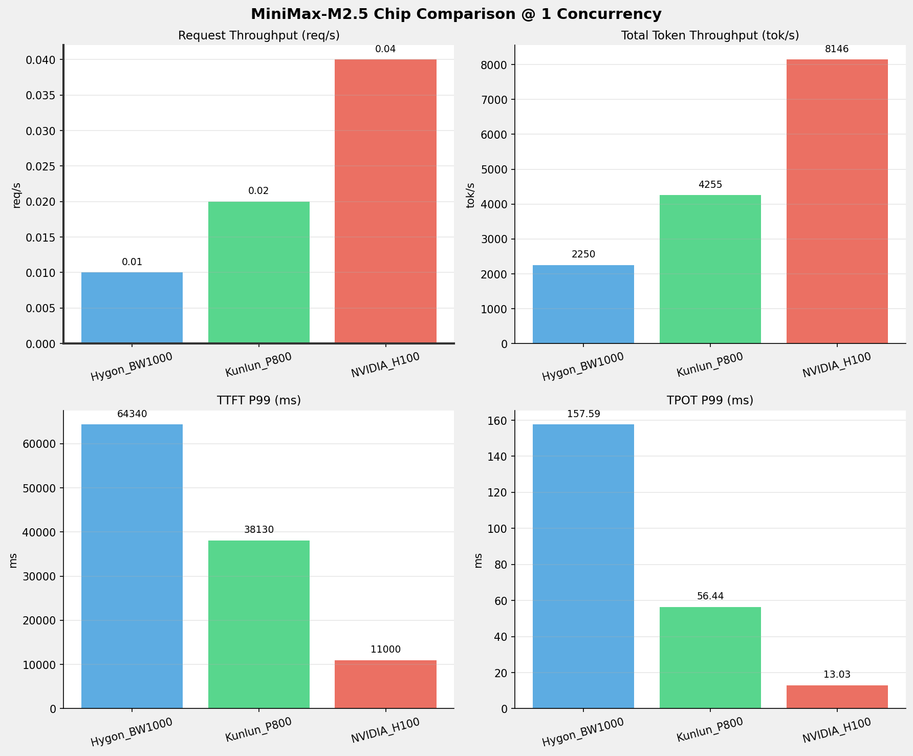

# MiniMax-M2.5模型单并发超长上下文请求性能比对报告

**测试日期：** 2026-03-25

---

## 测试场景
在单并发下，超长上下文请求（接近启动参数的max-len 192k），不同芯片间性能比对。

**主要采集指标**：

| 指标                  | 单位         | 含义                                 |
|---------------------|------------|------------------------------------|
| TTFT                | ms         | Time To First Token，首 token 延迟     |
| TPOT                | ms/token   | Time Per Output Token，每 token 生成时间 |
| Throughput          | tokens/s   | 系统总吞吐                              |
| QPS                 | requests/s | 请求吞吐                               |
| P50/P95/P99 Latency | ms         | 延迟分位数                              |

## 📊 测试概览

| 项目            | 配置                                     | 备注  |
|---------------|----------------------------------------|-----|
| **数据集**       | random                                 |     |
| **并发数**       | 1                                      |     |
| **总请求数**      | 100                                    |     |
| **请求输入上下文长度** | 194560（190k）                           |     |
| **请求输出上下文长度** | 1024（1k）                               |     |
| **模型**        | MiniMax-M2.5                           |     |
| **被测芯片**      | Hygon_BW1000, Kunlun_P800, NVIDIA_H100 |     |

---

## 🤖 芯片和模型配置信息

| 芯片名称             | 模型精度              | vLLM版本                                         | Python版本 | 备注         |
|------------------|-------------------|------------------------------------------------|----------|------------|
| **Hygon_BW1000** | BF16              | 0.11.0+das.opt1.rc2.dtk2604.20260128.g0bf89b0c | 3.10.12  | 海光BW1000芯片 |
| **Kunlun_P800**  | W8A8-INT8-Dynamic | 0.11.0                                         | 3.10.15  | 昆仑芯P800芯片  |
| **NVIDIA_H100**  | FP16              | 0.15.1                                         | 3.12.3   | 英伟达H100芯片  |

---

## 🤖 vLLM启动配置信息

| 参数名称                   | **Hygon_BW1000** | **Kunlun_P800**  | **NVIDIA_H100** |
|------------------------|------------------|------------------|-----------------|
| max-model-len          | 196608           | 196608           | 196608          |
| max-num-seqs           | 10               | 10               | 10              |
| max-num-batched-tokens | 8192             | 8192             | 8192            |
| gpu-memory-utilization | 0.95             | 0.95             | 0.85            |
| dp                     | 1                | 1                | 1               |
| tp                     | 8                | 8                | 8               |
| pp                     | 1                | 1                | 1               |
| enable-export-parallel | True             | False            | True            |
| tool-call-parser       | minimax_m2       | minimax_m2       | minimax_m2      |
| reasoning-parser       | minimax_m2 (不生效) | minimax_m2 (不生效) | minimax_m2      |

---

## 📈 各并发级别性能对比

### 1 并发

#### 服务基准结果

| 指标                       | Hygon_BW1000 | Kunlun_P800 | NVIDIA_H100   |
|--------------------------|--------------|-------------|---------------|
| 成功请求数                    | 100          | 100         | 100           |
| 失败请求数                    | 0            | 0           | 0             |
| 测试持续时间 (s)               | 8655.55      | 4575.62     | 2400.85       |
| 总输入 tokens               | 19456000     | 19456000    | 19456000      |
| 总生成 tokens               | 14970        | 14779       | 102400        |
| **请求吞吐量 (req/s)**        | 0.01         | 0.02        | **0.04** ⭐    |
| **输出 token 吞吐量 (tok/s)** | 1.73         | 3.23        | **42.65** ⭐   |
| 峰值输出 token 吞吐量 (tok/s)   | 8.00         | 20.00       | **79.00** ⭐   |
| 峰值并发请求数                  | 2.00         | 2.00        | 2.00          |
| **总 token 吞吐量 (tok/s)**  | 2249.54      | 4255.33     | **8146.44** ⭐ |

#### 首Token延迟 (TTFT)

| 指标            | Hygon_BW1000 | Kunlun_P800 | NVIDIA_H100    |
|---------------|--------------|-------------|----------------|
| 平均 TTFT (ms)  | 63442.80     | 37709.57    | **10837.53** ⭐ |
| 中位 TTFT (ms)  | 64113.52     | 38078.19    | **10939.07** ⭐ |
| P95 TTFT (ms) | 64263.01     | 38121.45    | **10981.68** ⭐ |
| P99 TTFT (ms) | 64339.96     | 38130.01    | **10999.63** ⭐ |

#### 每Token生成时间 (TPOT)

| 指标            | Hygon_BW1000 | Kunlun_P800 | NVIDIA_H100 |
|---------------|--------------|-------------|-------------|
| 平均 TPOT (ms)  | 155.46       | 54.83       | **12.87** ⭐ |
| 中位 TPOT (ms)  | 155.38       | 54.77       | **12.87** ⭐ |
| P95 TPOT (ms) | 157.34       | 54.83       | **12.93** ⭐ |
| P99 TPOT (ms) | 157.59       | 56.44       | **13.03** ⭐ |

#### Token间延迟 (ITL)

| 指标           | Hygon_BW1000 | Kunlun_P800 | NVIDIA_H100 |
|--------------|--------------|-------------|-------------|
| 平均 ITL (ms)  | 155.43       | 54.81       | **12.93** ⭐ |
| 中位 ITL (ms)  | 155.08       | 54.75       | **12.87** ⭐ |
| P95 ITL (ms) | 161.33       | 55.05       | **13.04** ⭐ |
| P99 ITL (ms) | 171.35       | 57.32       | **13.89** ⭐ |

---

## 📊 芯片性能柱状图

---

## 📝 分析总结

**综合性能**: NVIDIA_H100 在单并发超长上下文测试场景中综合表现最优

### 请求吞吐量 (Request Throughput) - 单并发最优

| Concurrency | Best Chip | Performance |
|-------------|-----------|-------------|
| 1 | NVIDIA_H100 | 0.04 req/s |

### Token总吞吐量 (Total Token Throughput) - 单并发最优

| Concurrency | Best Chip | Performance |
|-------------|-----------|-------------|
| 1 | NVIDIA_H100 | 8146 tok/s |

### TTFT P99 - 单并发最优

| Concurrency | Best Chip | Latency |
|-------------|-----------|---------|
| 1 | NVIDIA_H100 | 10999.63 ms |

### TPOT P99 - 单并发最优

| Concurrency | Best Chip | Latency |
|-------------|-----------|---------|
| 1 | NVIDIA_H100 | 13.03 ms |

---

*报告生成时间: 2026-03-25*

