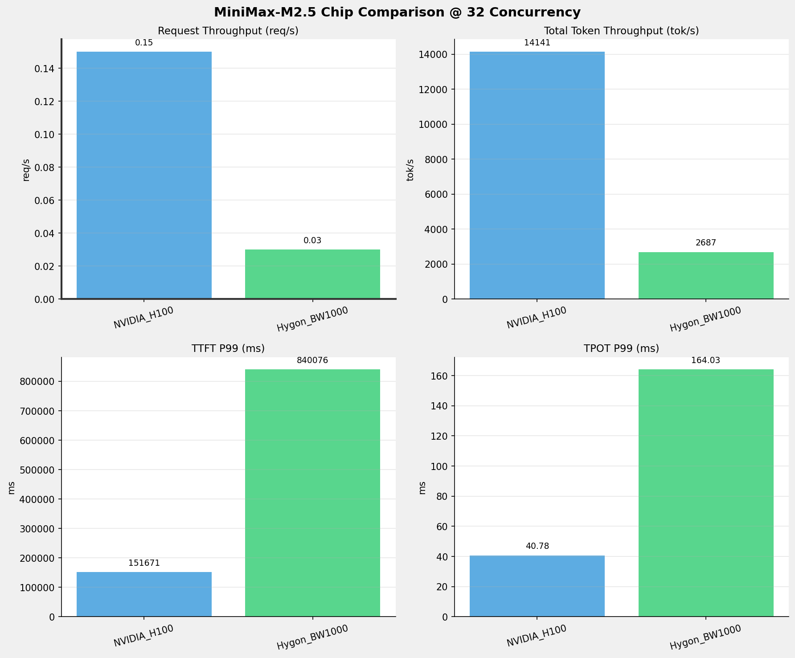
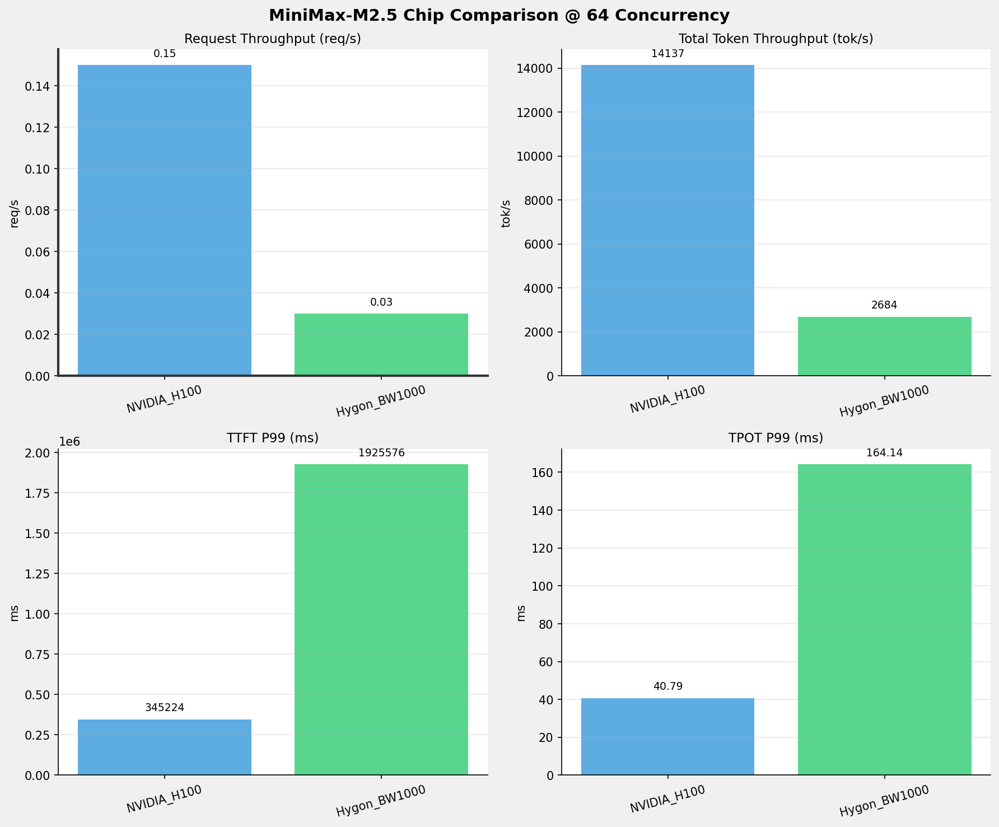
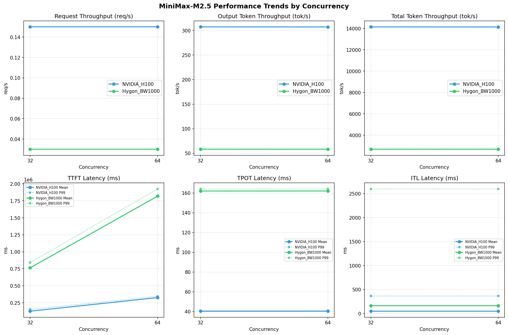

# MiniMax-M2.5模型在不同芯片下的benchmark基准测试报告

**测试日期：** 2026-05-19

---

## 测试场景
在固定请求数，输入上下文和输出上下文长度下，使用vllm bench serve工具对并发数逐级增加场景的性能基准验证。并对比同一模型在不同芯片环境上的性能指标。

**主要采集指标**：

| 指标                  | 单位         | 含义                                 |
|---------------------|------------|------------------------------------|
| TTFT                | ms         | Time To First Token，首 token 延迟     |
| TPOT                | ms/token   | Time Per Output Token，每 token 生成时间 |
| Throughput          | tokens/s   | 系统总吞吐                              |
| QPS                 | requests/s | 请求吞吐                               |
| P50/P95/P99 Latency | ms         | 延迟分位数                              |
    
### 📊 测试概览

| 项目            | 配置                                     | 备注  |
|---------------|----------------------------------------|-----|
| **数据集**       | random                                 |     |
| **并发数**       | 32, 64    |     |
| **总请求数**      | 1000                                    |     |
| **请求输入上下文长度** | 90000（87k）                             |     |
| **请求输出上下文长度** | 2000（1k）                             |     |
| **被测芯片**      | NVIDIA_H100, Hygon_BW1000 |     |
| **被测模型**      | MiniMax-M2.5 |     |

---

### 🤖 芯片和模型配置信息

| 参数名称 | **NVIDIA_H100** | **Hygon_BW1000** |
|----------|----------|----------|
| **max_position_embeddings** | 196608 | 196608 |
| **model_name** | MiniMax-M2.5 | MiniMax-M2.5-W8A8 |
| **model_size** | 215G | 215G |
| **python_version** | 3.12.3 | 3.10.12 |
| **quantization_config** | FP16 | int-8 |
| **temperature** | N/A | N/A |
| **top_k** | N/A | N/A |
| **top_p** | N/A | N/A |
| **transformers_version** | 4.46.1 | 4.57.6 |
| **vllm_version** | 0.15.1 | 0.15.1+das.opt1.alpha.dtk2604 |

---

### ⚙️ vLLM启动配置信息

| 参数名称 | **NVIDIA_H100** | **Hygon_BW1000** |
|----------|----------|----------|
| **Block Size** | default | default |
| **Compilation Config** | N/A | N/A |
| **Dp** | 1 | 1 |
| **Dtype** | default | bfloat16 |
| **Enable Auto Tool Choice** | True | True |
| **Enable Export Parallel** | True | True |
| **Gpu Memory Utilization** | 0.85 | 0.9 |
| **Max Model Len** | 196608 | 196608 |
| **Max Num Batched Tokens** | 8192 | default |
| **Max Num Seqs** | 10 | 64 |
| **Model Name** | MiniMax-M2.5 | MiniMax-M2.5-W8A8 |
| **Pp** | 1 | 1 |
| **Reasoning Parser** | minimax_m2 | minimax_m2 (不生效) |
| **Tool Call Parser** | minimax_m2 | minimax_m2 |
| **Tp** | 8 | 8 |

- **NVIDIA_H100**: 英伟达H100标准配置
- **Hygon_BW1000**: 海光芯片专家并行配置

---

### 📊 芯片性能对比柱状图

**32并发**

**64并发**

### 📈 性能趋势对比图 (所有芯片)

---

### 📈 各指标随并发级别性能对比详情

#### 请求吞吐量（Request throughput (req/s)）

| 并发数 | NVIDIA_H100 | Hygon_BW1000 | 差值 | 百分比 |
|-----|----------- | ----------- | ----------- | -----------|
| 32   | 0.15 | 0.03 | -0.12 | -80.0% |
| 64   | 0.15 | 0.03 | -0.12 | -80.0% |

#### 输出token吞吐量（Output token throughput (tok/s)）

| 并发数 | NVIDIA_H100 | Hygon_BW1000 | 差值 | 百分比 |
|-----|----------- | ----------- | ----------- | -----------|
| 32   | 307.27 | 58.42 | -248.85 | -81.0% |
| 64   | 307.19 | 58.35 | -248.84 | -81.0% |

#### 总token吞吐量（Total token throughput (tok/s)）

| 并发数 | NVIDIA_H100 | Hygon_BW1000 | 差值 | 百分比 |
|-----|----------- | ----------- | ----------- | -----------|
| 32   | 14140.63 | 2687.12 | -11453.51 | -81.0% |
| 64   | 14136.71 | 2683.97 | -11452.74 | -81.0% |

#### 首token延迟（P99 TTFT (ms)）

| 并发数 | NVIDIA_H100 | Hygon_BW1000 | 差值 | 百分比 |
|-----|----------- | ----------- | ----------- | -----------|
| 32   | 151671.11 | 840076.37 | +688405.26 | +453.9% |
| 64   | 345223.92 | 1925575.70 | +1580351.78 | +457.8% |

#### 每token生成时间（P99 TPOT (ms)）

| 并发数 | NVIDIA_H100 | Hygon_BW1000 | 差值 | 百分比 |
|-----|----------- | ----------- | ----------- | -----------|
| 32   | 40.78 | 164.03 | +123.25 | +302.2% |
| 64   | 40.79 | 164.14 | +123.35 | +302.4% |

#### token间延迟（P99 ITL (ms)）

| 并发数 | NVIDIA_H100 | Hygon_BW1000 | 差值 | 百分比 |
|-----|----------- | ----------- | ----------- | -----------|
| 32   | 363.93 | 2600.66 | +2236.73 | +614.6% |
| 64   | 364.12 | 2600.66 | +2236.54 | +614.2% |

### 📈 各并发级别性能对比详情

### 32 并发

#### 服务基准结果

| 指标 | NVIDIA_H100 | Hygon_BW1000 |
|------|----------- | -----------|
| 成功请求数 | 1000 | 1000 |
| 失败请求数 | 0 | 0 |
| 测试持续时间 (s) | 6508.83 | 34237.41 |
| 总输入 tokens | 90039000 | 90000000 |
| 总生成 tokens | 2000000 | 2000000 |
| **请求吞吐量 (req/s)** | **0.15** ⭐ | 0.03 |
| **输出 token 吞吐量 (tok/s)** | **307.27** ⭐ | 58.42 |
| 峰值输出 token 吞吐量 (tok/s) | **567.00** ⭐ | 270.00 |
| 峰值并发请求数 | 33.00 | 33.00 |
| **总 token 吞吐量 (tok/s)** | **14140.63** ⭐ | 2687.12 |

#### 首Token延迟 (TTFT)

| 指标 | NVIDIA_H100 | Hygon_BW1000 |
|------|----------- | -----------|
| 平均 TTFT (ms) | **125806.83** ⭐ | 763172.93 |
| 中位 TTFT (ms) | **120195.62** ⭐ | 758207.30 |
| P95 TTFT (ms) | **151485.52** ⭐ | 838778.34 |
| P99 TTFT (ms) | **151671.11** ⭐ | 840076.37 |

#### 每Token生成时间 (TPOT)

| 指标 | NVIDIA_H100 | Hygon_BW1000 |
|------|----------- | -----------|
| 平均 TPOT (ms) | **40.35** ⭐ | 161.97 |
| 中位 TPOT (ms) | **40.47** ⭐ | 162.90 |
| P95 TPOT (ms) | **40.71** ⭐ | 163.67 |
| P99 TPOT (ms) | **40.78** ⭐ | 164.03 |

#### Token间延迟 (ITL)

| 指标 | NVIDIA_H100 | Hygon_BW1000 |
|------|----------- | -----------|
| 平均 ITL (ms) | **47.09** ⭐ | 161.96 |
| 中位 ITL (ms) | **23.85** ⭐ | 41.24 |
| P95 ITL (ms) | 255.32 | **56.02** ⭐ |
| P99 ITL (ms) | **363.93** ⭐ | 2600.66 |

---

### 64 并发

#### 服务基准结果

| 指标 | NVIDIA_H100 | Hygon_BW1000 |
|------|----------- | -----------|
| 成功请求数 | 1000 | 1000 |
| 失败请求数 | 0 | 0 |
| 测试持续时间 (s) | 6510.64 | 34277.62 |
| 总输入 tokens | 90039000 | 90000000 |
| 总生成 tokens | 2000000 | 2000000 |
| **请求吞吐量 (req/s)** | **0.15** ⭐ | 0.03 |
| **输出 token 吞吐量 (tok/s)** | **307.19** ⭐ | 58.35 |
| 峰值输出 token 吞吐量 (tok/s) | **560.00** ⭐ | 260.00 |
| 峰值并发请求数 | 65.00 | 65.00 |
| **总 token 吞吐量 (tok/s)** | **14136.71** ⭐ | 2683.97 |

#### 首Token延迟 (TTFT)

| 指标 | NVIDIA_H100 | Hygon_BW1000 |
|------|----------- | -----------|
| 平均 TTFT (ms) | **326061.81** ⭐ | 1819207.46 |
| 中位 TTFT (ms) | **339003.73** ⭐ | 1843948.68 |
| P95 TTFT (ms) | **339316.35** ⭐ | 1923340.65 |
| P99 TTFT (ms) | **345223.92** ⭐ | 1925575.70 |

#### 每Token生成时间 (TPOT)

| 指标 | NVIDIA_H100 | Hygon_BW1000 |
|------|----------- | -----------|
| 平均 TPOT (ms) | **40.37** ⭐ | 162.03 |
| 中位 TPOT (ms) | **40.49** ⭐ | 162.94 |
| P95 TPOT (ms) | **40.73** ⭐ | 163.72 |
| P99 TPOT (ms) | **40.79** ⭐ | 164.14 |

#### Token间延迟 (ITL)

| 指标 | NVIDIA_H100 | Hygon_BW1000 |
|------|----------- | -----------|
| 平均 ITL (ms) | **47.27** ⭐ | 162.02 |
| 中位 ITL (ms) | **23.87** ⭐ | 41.29 |
| P95 ITL (ms) | 255.51 | **55.61** ⭐ |
| P99 ITL (ms) | **364.12** ⭐ | 2600.66 |

---

---

*报告生成时间: 2026-05-19*

