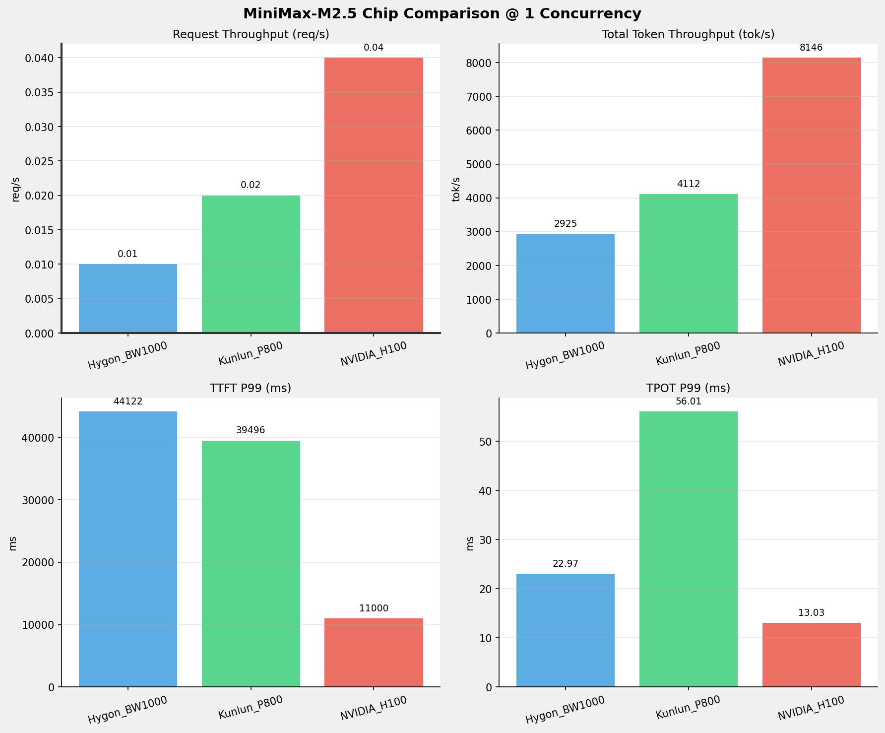
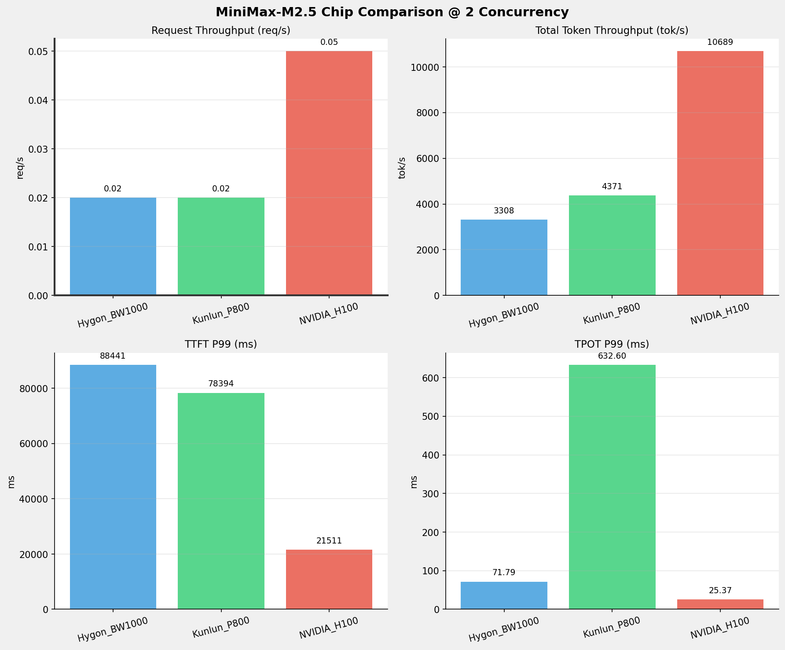
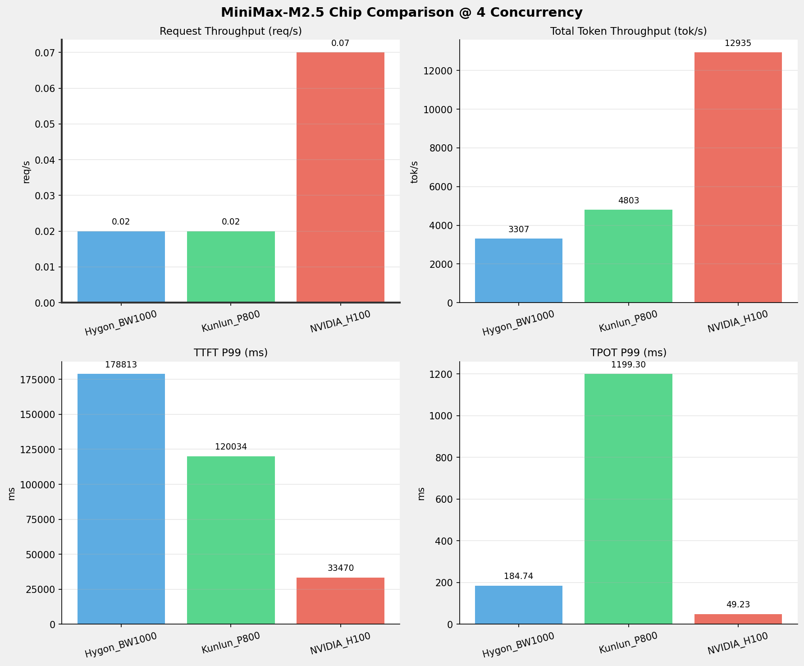
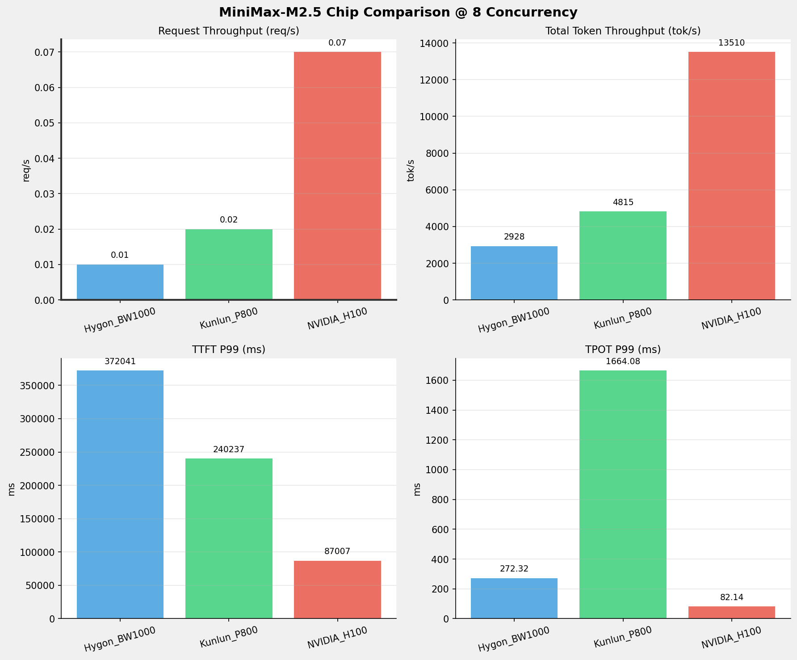
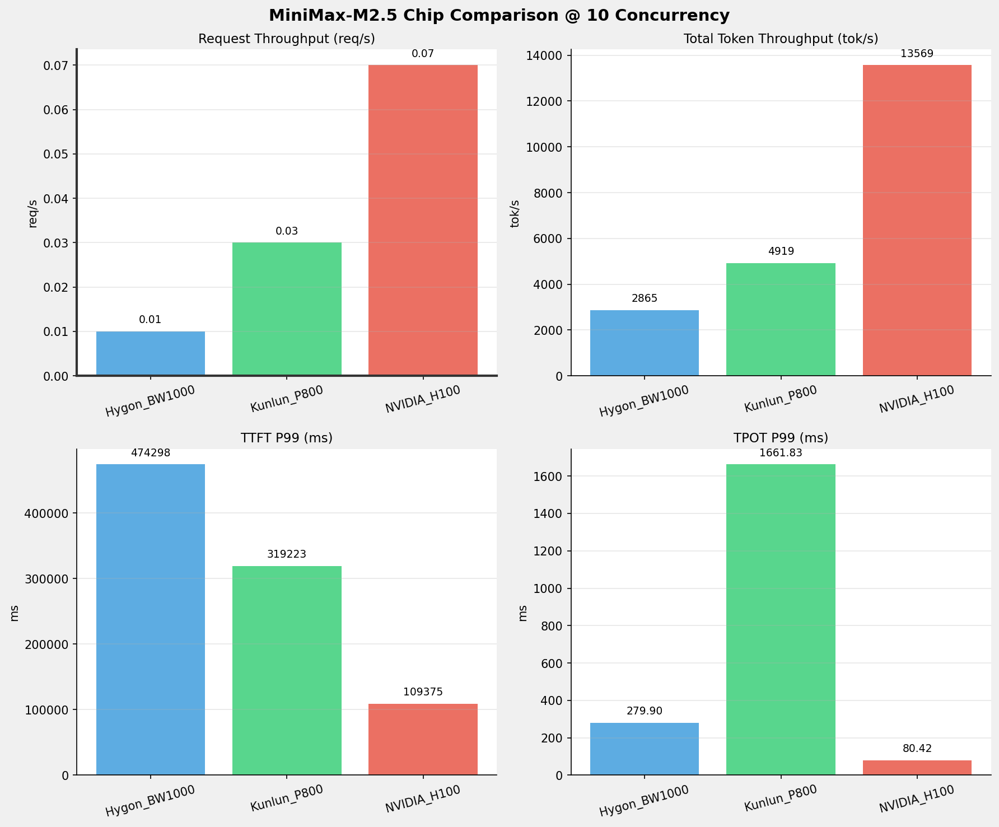
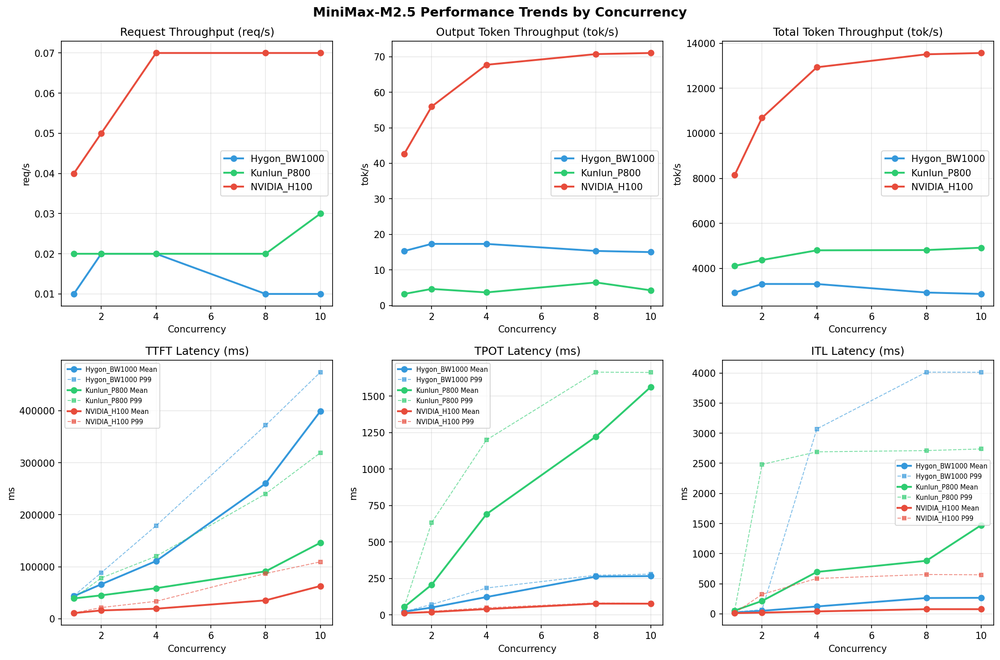

# MiniMax-M2.5模型在不同芯片下的benchmark基准测试报告

**测试日期：** 2026-04-10

---

## 测试场景
在固定请求数，输入上下文和输出上下文长度下，使用vllm bench serve工具对并发数逐级增加场景的性能基准验证。并对比同一模型在不同芯片环境上的性能指标。

**主要采集指标**：

| 指标                  | 单位         | 含义                                 |
|---------------------|------------|------------------------------------|
| TTFT                | ms         | Time To First Token，首 token 延迟     |
| TPOT                | ms/token   | Time Per Output Token，每 token 生成时间 |
| Throughput          | tokens/s   | 系统总吞吐                              |
| QPS                 | requests/s | 请求吞吐                               |
| P50/P95/P99 Latency | ms         | 延迟分位数                              |
    
## 📊 测试概览

| 项目            | 配置                                     | 备注  |
|---------------|----------------------------------------|-----|
| **数据集**       | random                                 |     |
| **并发数**       | 1, 2, 4, 8, 10    |     |
| **总请求数**      | 100                                    |     |
| **请求输入上下文长度** | 194560（190k）                             |     |
| **请求输出上下文长度** | 1024（1k）                             |     |
| **模型**        | MiniMax-M2.5                           |     |
| **被测芯片**      | Hygon_BW1000, Kunlun_P800, NVIDIA_H100 |     |

---

## 🤖 芯片和模型配置信息

| 芯片名称                        | **Hygon_BW1000** | **Kunlun_P800** | **NVIDIA_H100** |
|-----------------------------|-------------------------------|-------------------------------|-------------------------------|
| **model_name** | MiniMax-M2.5-W8A8 | MiniMax-M2.5-W8A8-INT8-Dynamic | MiniMax-M2.5 |
| **quantization_config** | int-8 | int-8 | FP16 |
| **model_size** | 215G | 215G | 215G |
| **max_position_embeddings** | 196608 | 196608 | 196608 |
| **temperature** | N/A | 1.0 | N/A |
| **top_k** | N/A | 40 | N/A |
| **top_p** | N/A | 0.95 | N/A |
| **transformers_version** | 4.57.6 | 4.46.1 | 4.46.1 |
| **vllm_version** | 0.15.1+das.opt1.alpha.dtk2604 | 0.11.0 | 0.15.1 |
| **python_version** | 3.10.12 | 3.10.15 | 3.12.3 |

---

## 🤖 vLLM启动配置信息

| 参数名称                   | **Hygon_BW1000** | **Kunlun_P800** | **NVIDIA_H100** |
|------------------------|------------------|------------------|------------------|
| model_name | MiniMax-M2.5-W8A8 | MiniMax-M2.5-W8A8-INT8-Dynamic | MiniMax-M2.5 |
| max-model-len | 196608 | 196608 | 196608 |
| max-num-seqs | 64 | 64 | 10 |
| max-num-batched-tokens | default | 8192 | 8192 |
| gpu-memory-utilization | 0.9 | 0.95 | 0.85 |
| dtype | bfloat16 | auto | default |
| block_size | default | 128 | default |
| dp | 1 | 1 | 1 |
| tp | 8 | 8 | 8 |
| pp | 1 | 1 | 1 |
| enable-export-parallel | True | False | True |
| enable-auto-tool-choice | True | True | True |
| tool-call-parser | minimax_m2 | minimax_m2 | minimax_m2 |
| reasoning-parser | minimax_m2 (不生效) | minimax_m2 (不生效) | minimax_m2 |

- **Hygon_BW1000**: 海光芯片专家并行配置
- **Kunlun_P800**: 昆仑芯不启用专家并行避免通信问题
- **NVIDIA_H100**: 英伟达H100标准配置

---

## 📈 各并发级别性能对比

### 1 并发

#### 服务基准结果

| 指标 | Hygon_BW1000 | Kunlun_P800 | NVIDIA_H100 |
|------|----------- | ----------- | -----------|
| 成功请求数 | 100 | 100 | 100 |
| 失败请求数 | 0 | 0 | 0 |
| 测试持续时间 (s) | 6687.21 | 4735.72 | 2400.85 |
| 总输入 tokens | 19456000 | 19456000 | 19456000 |
| 总生成 tokens | 102400 | 15277 | 102400 |
| **请求吞吐量 (req/s)** | 0.01 | 0.02 | **0.04** ⭐ |
| **输出 token 吞吐量 (tok/s)** | 15.31 | 3.23 | **42.65** ⭐ |
| 峰值输出 token 吞吐量 (tok/s) | 47.00 | 20.00 | **79.00** ⭐ |
| 峰值并发请求数 | 2.00 | 2.00 | 2.00 |
| **总 token 吞吐量 (tok/s)** | 2924.75 | 4111.58 | **8146.44** ⭐ |

#### 首Token延迟 (TTFT)

| 指标 | Hygon_BW1000 | Kunlun_P800 | NVIDIA_H100 |
|------|----------- | ----------- | -----------|
| 平均 TTFT (ms) | 43487.80 | 39047.26 | **10837.53** ⭐ |
| 中位 TTFT (ms) | 43910.38 | 39430.52 | **10939.07** ⭐ |
| P95 TTFT (ms) | 44091.15 | 39464.93 | **10981.68** ⭐ |
| P99 TTFT (ms) | 44121.71 | 39495.63 | **10999.63** ⭐ |

#### 每Token生成时间 (TPOT)

| 指标 | Hygon_BW1000 | Kunlun_P800 | NVIDIA_H100 |
|------|----------- | ----------- | -----------|
| 平均 TPOT (ms) | 22.86 | 54.79 | **12.87** ⭐ |
| 中位 TPOT (ms) | 22.86 | 54.76 | **12.87** ⭐ |
| P95 TPOT (ms) | 22.96 | 54.81 | **12.93** ⭐ |
| P99 TPOT (ms) | 22.97 | 56.01 | **13.03** ⭐ |

#### Token间延迟 (ITL)

| 指标 | Hygon_BW1000 | Kunlun_P800 | NVIDIA_H100 |
|------|----------- | ----------- | -----------|
| 平均 ITL (ms) | 22.88 | 54.75 | **12.93** ⭐ |
| 中位 ITL (ms) | 22.85 | 54.74 | **12.87** ⭐ |
| P95 ITL (ms) | 23.57 | 54.99 | **13.04** ⭐ |
| P99 ITL (ms) | 32.12 | 57.01 | **13.89** ⭐ |

---

### 2 并发

#### 服务基准结果

| 指标 | Hygon_BW1000 | Kunlun_P800 | NVIDIA_H100 |
|------|----------- | ----------- | -----------|
| 成功请求数 | 100 | 100 | 100 |
| 失败请求数 | 0 | 0 | 0 |
| 测试持续时间 (s) | 5911.73 | 4456.34 | 1829.83 |
| 总输入 tokens | 19456000 | 19456000 | 19456000 |
| 总生成 tokens | 102400 | 20670 | 102400 |
| **请求吞吐量 (req/s)** | 0.02 | 0.02 | **0.05** ⭐ |
| **输出 token 吞吐量 (tok/s)** | 17.32 | 4.64 | **55.96** ⭐ |
| 峰值输出 token 吞吐量 (tok/s) | 72.00 | 37.00 | **134.00** ⭐ |
| 峰值并发请求数 | 4.00 | 3.00 | 4.00 |
| **总 token 吞吐量 (tok/s)** | 3308.40 | 4370.55 | **10688.67** ⭐ |

#### 首Token延迟 (TTFT)

| 指标 | Hygon_BW1000 | Kunlun_P800 | NVIDIA_H100 |
|------|----------- | ----------- | -----------|
| 平均 TTFT (ms) | 66239.08 | 44931.50 | **15942.01** ⭐ |
| 中位 TTFT (ms) | 46228.26 | 40375.08 | **11898.47** ⭐ |
| P95 TTFT (ms) | 88317.83 | 75502.31 | **21401.99** ⭐ |
| P99 TTFT (ms) | 88441.47 | 78394.34 | **21510.81** ⭐ |

#### 每Token生成时间 (TPOT)

| 指标 | Hygon_BW1000 | Kunlun_P800 | NVIDIA_H100 |
|------|----------- | ----------- | -----------|
| 平均 TPOT (ms) | 50.82 | 207.16 | **20.19** ⭐ |
| 中位 TPOT (ms) | 49.68 | 134.72 | **22.20** ⭐ |
| P95 TPOT (ms) | 71.63 | 546.28 | **25.27** ⭐ |
| P99 TPOT (ms) | 71.79 | 632.60 | **25.37** ⭐ |

#### Token间延迟 (ITL)

| 指标 | Hygon_BW1000 | Kunlun_P800 | NVIDIA_H100 |
|------|----------- | ----------- | -----------|
| 平均 ITL (ms) | 50.85 | 214.50 | **20.27** ⭐ |
| 中位 ITL (ms) | 30.34 | 56.01 | **15.14** ⭐ |
| P95 ITL (ms) | 36.99 | 1622.96 | **15.37** ⭐ |
| P99 ITL (ms) | **69.78** ⭐ | 2481.47 | 324.31 |

---

### 4 并发

#### 服务基准结果

| 指标 | Hygon_BW1000 | Kunlun_P800 | NVIDIA_H100 |
|------|----------- | ----------- | -----------|
| 成功请求数 | 100 | 100 | 100 |
| 失败请求数 | 0 | 0 | 0 |
| 测试持续时间 (s) | 5914.77 | 4054.16 | 1512.09 |
| 总输入 tokens | 19456000 | 19456000 | 19456000 |
| 总生成 tokens | 102400 | 14852 | 102400 |
| **请求吞吐量 (req/s)** | 0.02 | 0.02 | **0.07** ⭐ |
| **输出 token 吞吐量 (tok/s)** | 17.31 | 3.66 | **67.72** ⭐ |
| 峰值输出 token 吞吐量 (tok/s) | 96.00 | 73.00 | **224.00** ⭐ |
| 峰值并发请求数 | 7.00 | 7.00 | 7.00 |
| **总 token 吞吐量 (tok/s)** | 3306.71 | 4802.69 | **12934.69** ⭐ |

#### 首Token延迟 (TTFT)

| 指标 | Hygon_BW1000 | Kunlun_P800 | NVIDIA_H100 |
|------|----------- | ----------- | -----------|
| 平均 TTFT (ms) | 110901.13 | 58703.34 | **19249.51** ⭐ |
| 中位 TTFT (ms) | 96467.29 | 47826.04 | **17145.98** ⭐ |
| P95 TTFT (ms) | 174373.75 | 117588.50 | **32208.02** ⭐ |
| P99 TTFT (ms) | 178812.59 | 120034.28 | **33469.80** ⭐ |

#### 每Token生成时间 (TPOT)

| 指标 | Hygon_BW1000 | Kunlun_P800 | NVIDIA_H100 |
|------|----------- | ----------- | -----------|
| 平均 TPOT (ms) | 122.83 | 690.63 | **40.26** ⭐ |
| 中位 TPOT (ms) | 120.64 | 711.54 | **38.56** ⭐ |
| P95 TPOT (ms) | 184.15 | 1017.54 | **48.44** ⭐ |
| P99 TPOT (ms) | 184.74 | 1199.30 | **49.23** ⭐ |

#### Token间延迟 (ITL)

| 指标 | Hygon_BW1000 | Kunlun_P800 | NVIDIA_H100 |
|------|----------- | ----------- | -----------|
| 平均 ITL (ms) | 122.76 | 696.27 | **40.43** ⭐ |
| 中位 ITL (ms) | 43.16 | 57.66 | **18.08** ⭐ |
| P95 ITL (ms) | **52.02** ⭐ | 2456.10 | 322.71 |
| P99 ITL (ms) | 3071.54 | 2690.67 | **587.80** ⭐ |

---

### 8 并发

#### 服务基准结果

| 指标 | Hygon_BW1000 | Kunlun_P800 | NVIDIA_H100 |
|------|----------- | ----------- | -----------|
| 成功请求数 | 100 | 100 | 100 |
| 失败请求数 | 0 | 0 | 0 |
| 测试持续时间 (s) | 6680.12 | 4046.25 | 1447.68 |
| 总输入 tokens | 19456000 | 19456000 | 19456000 |
| 总生成 tokens | 102400 | 26139 | 102400 |
| **请求吞吐量 (req/s)** | 0.01 | 0.02 | **0.07** ⭐ |
| **输出 token 吞吐量 (tok/s)** | 15.33 | 6.46 | **70.73** ⭐ |
| 峰值输出 token 吞吐量 (tok/s) | 135.00 | 136.00 | **258.00** ⭐ |
| 峰值并发请求数 | 9.00 | 11.00 | 9.00 |
| **总 token 吞吐量 (tok/s)** | 2927.85 | 4814.86 | **13510.17** ⭐ |

#### 首Token延迟 (TTFT)

| 指标 | Hygon_BW1000 | Kunlun_P800 | NVIDIA_H100 |
|------|----------- | ----------- | -----------|
| 平均 TTFT (ms) | 260175.41 | 91164.54 | **35343.53** ⭐ |
| 中位 TTFT (ms) | 280403.12 | 80497.31 | **28506.97** ⭐ |
| P95 TTFT (ms) | 281593.86 | 161053.87 | **48662.62** ⭐ |
| P99 TTFT (ms) | 372041.15 | 240236.55 | **87006.65** ⭐ |

#### 每Token生成时间 (TPOT)

| 指标 | Hygon_BW1000 | Kunlun_P800 | NVIDIA_H100 |
|------|----------- | ----------- | -----------|
| 平均 TPOT (ms) | 263.40 | 1222.97 | **77.70** ⭐ |
| 中位 TPOT (ms) | 269.07 | 1352.12 | **79.33** ⭐ |
| P95 TPOT (ms) | 272.14 | 1655.50 | **81.16** ⭐ |
| P99 TPOT (ms) | 272.32 | 1664.08 | **82.14** ⭐ |

#### Token间延迟 (ITL)

| 指标 | Hygon_BW1000 | Kunlun_P800 | NVIDIA_H100 |
|------|----------- | ----------- | -----------|
| 平均 ITL (ms) | 263.23 | 881.62 | **78.03** ⭐ |
| 中位 ITL (ms) | 38.61 | 638.32 | **23.46** ⭐ |
| P95 ITL (ms) | 2683.84 | 2524.13 | **475.53** ⭐ |
| P99 ITL (ms) | 4014.05 | 2711.55 | **653.83** ⭐ |

---

### 10 并发

#### 服务基准结果

| 指标 | Hygon_BW1000 | Kunlun_P800 | NVIDIA_H100 |
|------|----------- | ----------- | -----------|
| 成功请求数 | 100 | 100 | 100 |
| 失败请求数 | 0 | 0 | 0 |
| 测试持续时间 (s) | 6826.46 | 3958.73 | 1441.45 |
| 总输入 tokens | 19456000 | 19456000 | 19456000 |
| 总生成 tokens | 102400 | 16821 | 102400 |
| **请求吞吐量 (req/s)** | 0.01 | 0.03 | **0.07** ⭐ |
| **输出 token 吞吐量 (tok/s)** | 15.00 | 4.25 | **71.04** ⭐ |
| 峰值输出 token 吞吐量 (tok/s) | 145.00 | 127.00 | **258.00** ⭐ |
| 峰值并发请求数 | 12.00 | 12.00 | 11.00 |
| **总 token 吞吐量 (tok/s)** | 2865.09 | 4918.95 | **13568.55** ⭐ |

#### 首Token延迟 (TTFT)

| 指标 | Hygon_BW1000 | Kunlun_P800 | NVIDIA_H100 |
|------|----------- | ----------- | -----------|
| 平均 TTFT (ms) | 399184.25 | 146180.13 | **62956.13** ⭐ |
| 中位 TTFT (ms) | 414031.08 | 148167.77 | **68872.29** ⭐ |
| P95 TTFT (ms) | 441820.31 | 230342.85 | **71040.37** ⭐ |
| P99 TTFT (ms) | 474297.92 | 319223.30 | **109375.21** ⭐ |

#### 每Token生成时间 (TPOT)

| 指标 | Hygon_BW1000 | Kunlun_P800 | NVIDIA_H100 |
|------|----------- | ----------- | -----------|
| 平均 TPOT (ms) | 266.45 | 1563.07 | **77.39** ⭐ |
| 中位 TPOT (ms) | 276.40 | 1626.53 | **79.19** ⭐ |
| P95 TPOT (ms) | 279.80 | 1659.06 | **80.34** ⭐ |
| P99 TPOT (ms) | 279.90 | 1661.83 | **80.42** ⭐ |

#### Token间延迟 (ITL)

| 指标 | Hygon_BW1000 | Kunlun_P800 | NVIDIA_H100 |
|------|----------- | ----------- | -----------|
| 平均 ITL (ms) | 266.45 | 1473.37 | **77.73** ⭐ |
| 中位 ITL (ms) | 38.64 | 1497.41 | **23.48** ⭐ |
| P95 ITL (ms) | 2679.16 | 2628.68 | **472.33** ⭐ |
| P99 ITL (ms) | 4012.34 | 2738.47 | **649.04** ⭐ |

---

## 📊 芯片性能柱状图

---

## 📈 性能趋势对比图 (所有芯片)

---

## 📝 分析总结

### 1. 吞吐量性能对比

**请求吞吐量 (QPS)**: 在低并发(1-1)场景下，NVIDIA_H100 表现最佳，平均 0.04 req/s；
在中并发(2-2)场景下，NVIDIA_H100 表现最佳，平均 0.05 req/s；
在高并发(10-8)场景下，NVIDIA_H100 表现最佳，平均 0.07 req/s。

**Token吞吐量**: NVIDIA_H100 在8并发时达到最高吞吐量 13569 tok/s。

### 2. 首Token延迟 (TTFT) 对比

**低并发(1-1)**: NVIDIA_H100 TTFT最优，平均 11000ms

**高并发(10-8)**: NVIDIA_H100 TTFT最优，平均 76617ms

### 3. Token生成时间 (TPOT) 对比

**最优表现**: NVIDIA_H100 在各并发下TPOT表现最佳，1并发时仅为 13.03ms

### 4. 综合评估

**综合性能**: NVIDIA_H100 在所有测试场景中综合表现最优

### 请求吞吐量 (Request Throughput) - 各并发最优

| Concurrency | Best Chip | Performance |
|-------------|-----------|-------------|
| 1 | NVIDIA_H100 | 0.04 req/s |
| 2 | NVIDIA_H100 | 0.05 req/s |
| 4 | NVIDIA_H100 | 0.07 req/s |
| 8 | NVIDIA_H100 | 0.07 req/s |
| 10 | NVIDIA_H100 | 0.07 req/s |

### Token总吞吐量 (Total Token Throughput) - 各并发最优

| Concurrency | Best Chip | Performance |
|-------------|-----------|-------------|
| 1 | NVIDIA_H100 | 8146 tok/s |
| 2 | NVIDIA_H100 | 10689 tok/s |
| 4 | NVIDIA_H100 | 12935 tok/s |
| 8 | NVIDIA_H100 | 13510 tok/s |
| 10 | NVIDIA_H100 | 13569 tok/s |

### TTFT P99 - 各并发最优

| Concurrency | Best Chip | Latency |
|-------------|-----------|---------|
| 1 | NVIDIA_H100 | 10999.63 ms |
| 2 | NVIDIA_H100 | 21510.81 ms |
| 4 | NVIDIA_H100 | 33469.80 ms |
| 8 | NVIDIA_H100 | 87006.65 ms |
| 10 | NVIDIA_H100 | 109375.21 ms |

### TPOT P99 - 各并发最优

| Concurrency | Best Chip | Latency |
|-------------|-----------|---------|
| 1 | NVIDIA_H100 | 13.03 ms |
| 2 | NVIDIA_H100 | 25.37 ms |
| 4 | NVIDIA_H100 | 49.23 ms |
| 8 | NVIDIA_H100 | 82.14 ms |
| 10 | NVIDIA_H100 | 80.42 ms |

---

*报告生成时间: 2026-04-10*

