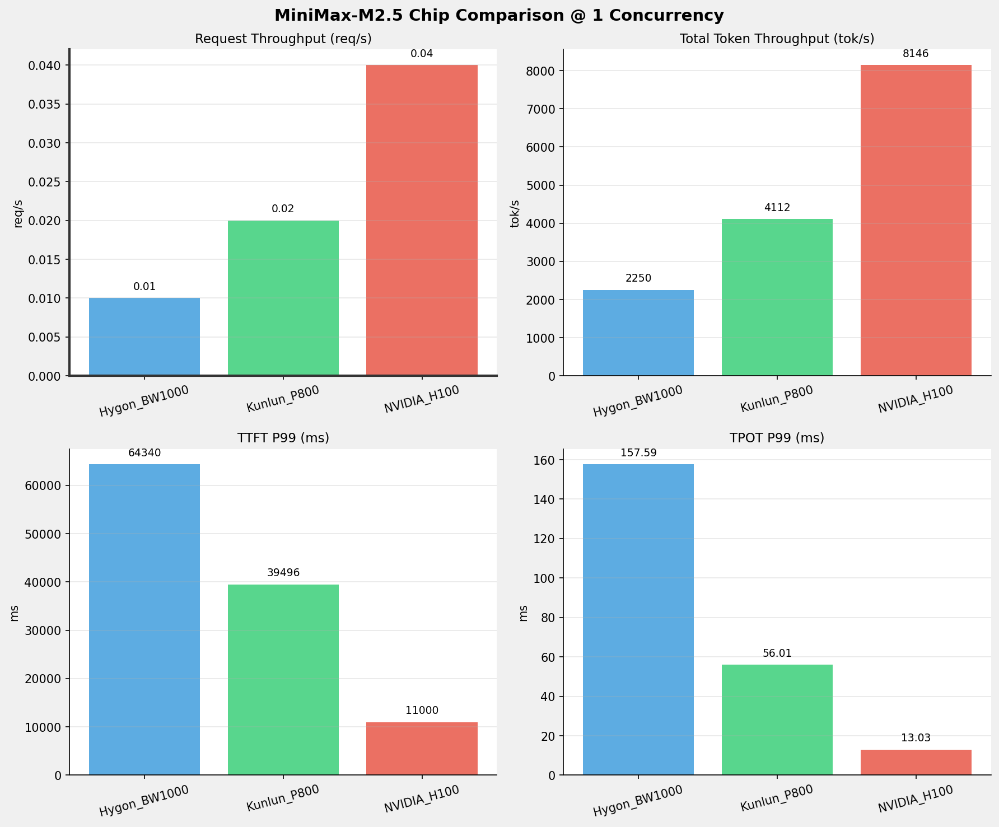
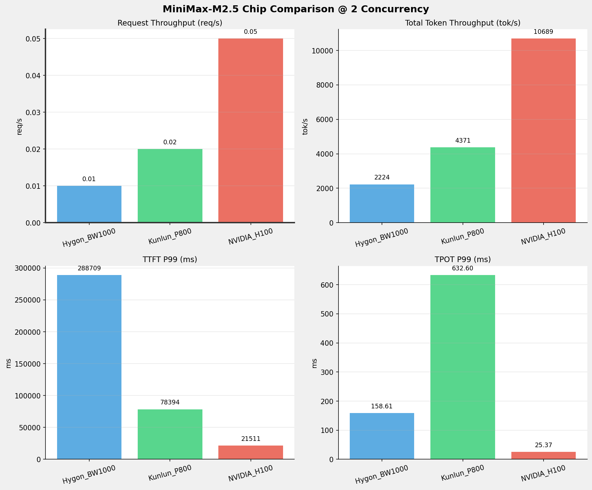
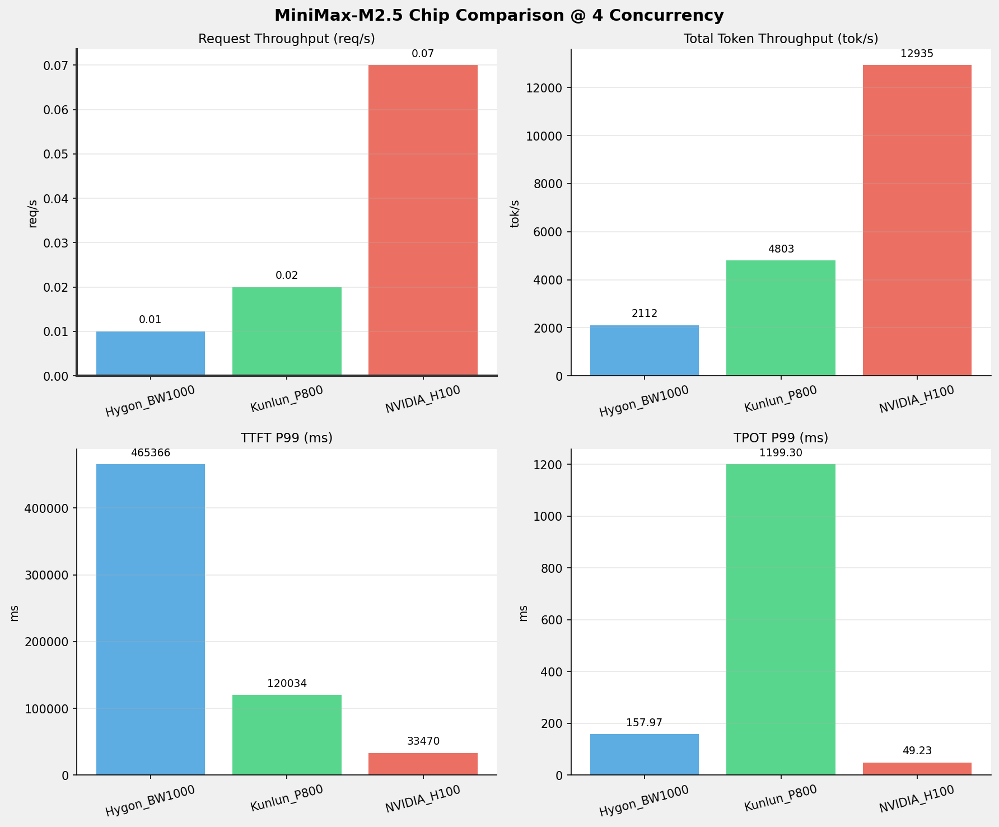
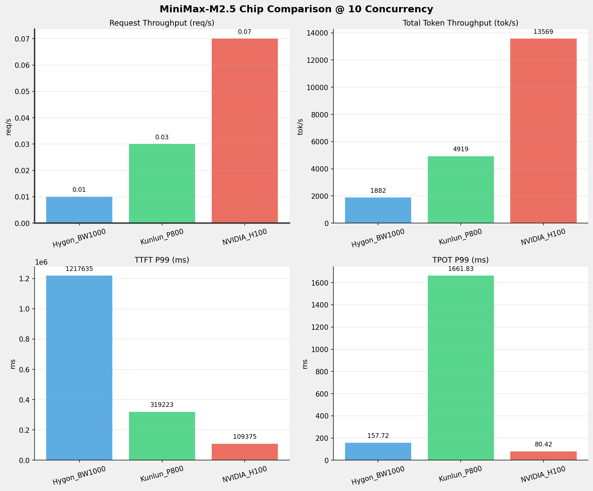
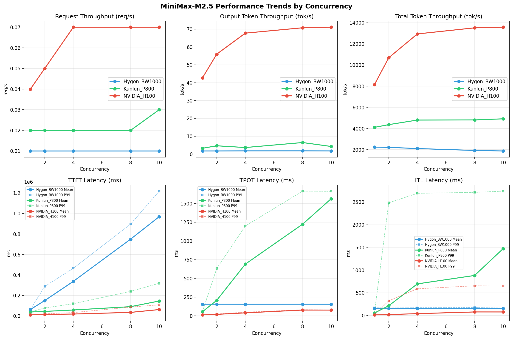

# MiniMax-M2.5模型在不同芯片下的benchmark基准测试报告

**测试日期：** 2026-03-27

---

## 测试场景
在固定请求数，输入上下文和输出上下文长度下，使用vllm bench serve工具对并发数逐级增加场景的性能基准验证。并对比同一模型在不同芯片环境上的性能指标。

**主要采集指标**：

| 指标                  | 单位         | 含义                                 |
|---------------------|------------|------------------------------------|
| TTFT                | ms         | Time To First Token，首 token 延迟     |
| TPOT                | ms/token   | Time Per Output Token，每 token 生成时间 |
| Throughput          | tokens/s   | 系统总吞吐                              |
| QPS                 | requests/s | 请求吞吐                               |
| P50/P95/P99 Latency | ms         | 延迟分位数                              |

## 📊 测试概览

| 项目            | 配置                                     | 备注  |
|---------------|----------------------------------------|-----|
| **数据集**       | random                                 |     |
| **并发数**       | 1, 2, 4, 8, 10    |     |
| **总请求数**      | 320                                    |     |
| **请求输入上下文长度** | 10240（10k）                             |     |
| **请求输出上下文长度** | 256（0k）                             |     |
| **模型**        | MiniMax-M2.5                           |     |
| **被测芯片**      | Hygon_BW1000, Kunlun_P800, NVIDIA_H100 |     |

---

## 🤖 芯片和模型配置信息

| 芯片名称             | 模型精度              | vLLM版本                                         | Python版本 | 备注         |
|------------------|-------------------|------------------------------------------------|----------|------------|
| **Hygon_BW1000** | BF16 | 0.11.0+das.opt1.rc2.dtk2604.20260128.g0bf89b0c | 3.10.12 | 海光BW1000芯片 |
| **Kunlun_P800** | W8A8-INT8-Dynamic | 0.11.0 | 3.10.15 | 昆仑芯P800芯片 |
| **NVIDIA_H100** | FP16 | 0.15.1 | 3.12.3 | 英伟达H100芯片 |

---

## 🤖 vLLM启动配置信息

| 参数名称                   | **Hygon_BW1000** | **Kunlun_P800** | **NVIDIA_H100** |
|------------------------|------------------|------------------|------------------|
| max-model-len | 196608 | 196608 | 196608 |
| max-num-seqs | 10 | 10 | 10 |
| max-num-batched-tokens | 8192 | 8192 | 8192 |
| gpu-memory-utilization | 0.95 | 0.95 | 0.85 |
| dp | 1 | 1 | 1 |
| tp | 8 | 8 | 8 |
| pp | 1 | 1 | 1 |
| enable-export-parallel | True | False | True |
| tool-call-parser | minimax_m2 | minimax_m2 | minimax_m2 |
| reasoning-parser | minimax_m2 (不生效) | minimax_m2 (不生效) | minimax_m2 |

- **Hygon_BW1000**: 海光芯片专家并行配置
- **Kunlun_P800**: 昆仑芯不启用专家并行避免通信问题
- **NVIDIA_H100**: 英伟达H100标准配置

---

## 📈 各并发级别性能对比

### 1 并发

#### 服务基准结果

| 指标 | Hygon_BW1000 | Kunlun_P800 | NVIDIA_H100 |
|------|----------- | ----------- | -----------|
| 成功请求数 | 100 | 100 | 100 |
| 失败请求数 |  |  | 0 |
| 测试持续时间 (s) | 8655.55 | 4735.72 | 2400.85 |
| 总输入 tokens | 19456000 | 19456000 | 19456000 |
| 总生成 tokens | 14970 | 15277 | 102400 |
| **请求吞吐量 (req/s)** | 0.01 | 0.02 | **0.04** ⭐ |
| **输出 token 吞吐量 (tok/s)** | 1.73 | 3.23 | **42.65** ⭐ |
| 峰值输出 token 吞吐量 (tok/s) | 8.00 | 20.00 | **79.00** ⭐ |
| 峰值并发请求数 | 2.00 | 2.00 | 2.00 |
| **总 token 吞吐量 (tok/s)** | 2249.54 | 4111.58 | **8146.44** ⭐ |

#### 首Token延迟 (TTFT)

| 指标 | Hygon_BW1000 | Kunlun_P800 | NVIDIA_H100 |
|------|----------- | ----------- | -----------|
| 平均 TTFT (ms) | 63442.80 | 39047.26 | **10837.53** ⭐ |
| 中位 TTFT (ms) | 64113.52 | 39430.52 | **10939.07** ⭐ |
| P95 TTFT (ms) | 64263.01 | 39464.93 | **10981.68** ⭐ |
| P99 TTFT (ms) | 64339.96 | 39495.63 | **10999.63** ⭐ |

#### 每Token生成时间 (TPOT)

| 指标 | Hygon_BW1000 | Kunlun_P800 | NVIDIA_H100 |
|------|----------- | ----------- | -----------|
| 平均 TPOT (ms) | 155.46 | 54.79 | **12.87** ⭐ |
| 中位 TPOT (ms) | 155.38 | 54.76 | **12.87** ⭐ |
| P95 TPOT (ms) | 157.34 | 54.81 | **12.93** ⭐ |
| P99 TPOT (ms) | 157.59 | 56.01 | **13.03** ⭐ |

#### Token间延迟 (ITL)

| 指标 | Hygon_BW1000 | Kunlun_P800 | NVIDIA_H100 |
|------|----------- | ----------- | -----------|
| 平均 ITL (ms) | 155.43 | 54.75 | **12.93** ⭐ |
| 中位 ITL (ms) | 155.08 | 54.74 | **12.87** ⭐ |
| P95 ITL (ms) | 161.33 | 54.99 | **13.04** ⭐ |
| P99 ITL (ms) | 171.35 | 57.01 | **13.89** ⭐ |

---

### 2 并发

#### 服务基准结果

| 指标 | Hygon_BW1000 | Kunlun_P800 | NVIDIA_H100 |
|------|----------- | ----------- | -----------|
| 成功请求数 | 100 | 100 | 100 |
| 失败请求数 |  |  | 0 |
| 测试持续时间 (s) | 8755.03 | 4456.34 | 1829.83 |
| 总输入 tokens | 19456000 | 19456000 | 19456000 |
| 总生成 tokens | 15263 | 20670 | 102400 |
| **请求吞吐量 (req/s)** | 0.01 | 0.02 | **0.05** ⭐ |
| **输出 token 吞吐量 (tok/s)** | 1.74 | 4.64 | **55.96** ⭐ |
| 峰值输出 token 吞吐量 (tok/s) | 8.00 | 37.00 | **134.00** ⭐ |
| 峰值并发请求数 | 3.00 | 3.00 | 4.00 |
| **总 token 吞吐量 (tok/s)** | 2224.01 | 4370.55 | **10688.67** ⭐ |

#### 首Token延迟 (TTFT)

| 指标 | Hygon_BW1000 | Kunlun_P800 | NVIDIA_H100 |
|------|----------- | ----------- | -----------|
| 平均 TTFT (ms) | 150613.30 | 44931.50 | **15942.01** ⭐ |
| 中位 TTFT (ms) | 148787.19 | 40375.08 | **11898.47** ⭐ |
| P95 TTFT (ms) | 166905.14 | 75502.31 | **21401.99** ⭐ |
| P99 TTFT (ms) | 288709.33 | 78394.34 | **21510.81** ⭐ |

#### 每Token生成时间 (TPOT)

| 指标 | Hygon_BW1000 | Kunlun_P800 | NVIDIA_H100 |
|------|----------- | ----------- | -----------|
| 平均 TPOT (ms) | 155.72 | 207.16 | **20.19** ⭐ |
| 中位 TPOT (ms) | 155.74 | 134.72 | **22.20** ⭐ |
| P95 TPOT (ms) | 157.55 | 546.28 | **25.27** ⭐ |
| P99 TPOT (ms) | 158.61 | 632.60 | **25.37** ⭐ |

#### Token间延迟 (ITL)

| 指标 | Hygon_BW1000 | Kunlun_P800 | NVIDIA_H100 |
|------|----------- | ----------- | -----------|
| 平均 ITL (ms) | 155.59 | 214.50 | **20.27** ⭐ |
| 中位 ITL (ms) | 155.14 | 56.01 | **15.14** ⭐ |
| P95 ITL (ms) | 161.19 | 1622.96 | **15.37** ⭐ |
| P99 ITL (ms) | **165.40** ⭐ | 2481.47 | 324.31 |

---

### 4 并发

#### 服务基准结果

| 指标 | Hygon_BW1000 | Kunlun_P800 | NVIDIA_H100 |
|------|----------- | ----------- | -----------|
| 成功请求数 | 100 | 100 | 100 |
| 失败请求数 |  |  | 0 |
| 测试持续时间 (s) | 9218.65 | 4054.16 | 1512.09 |
| 总输入 tokens | 19456000 | 19456000 | 19456000 |
| 总生成 tokens | 16504 | 14852 | 102400 |
| **请求吞吐量 (req/s)** | 0.01 | 0.02 | **0.07** ⭐ |
| **输出 token 吞吐量 (tok/s)** | 1.79 | 3.66 | **67.72** ⭐ |
| 峰值输出 token 吞吐量 (tok/s) | 8.00 | 73.00 | **224.00** ⭐ |
| 峰值并发请求数 | 5.00 | 7.00 | 7.00 |
| **总 token 吞吐量 (tok/s)** | 2112.29 | 4802.69 | **12934.69** ⭐ |

#### 首Token延迟 (TTFT)

| 指标 | Hygon_BW1000 | Kunlun_P800 | NVIDIA_H100 |
|------|----------- | ----------- | -----------|
| 平均 TTFT (ms) | 337958.92 | 58703.34 | **19249.51** ⭐ |
| 中位 TTFT (ms) | 333410.25 | 47826.04 | **17145.98** ⭐ |
| P95 TTFT (ms) | 408152.45 | 117588.50 | **32208.02** ⭐ |
| P99 TTFT (ms) | 465366.18 | 120034.28 | **33469.80** ⭐ |

#### 每Token生成时间 (TPOT)

| 指标 | Hygon_BW1000 | Kunlun_P800 | NVIDIA_H100 |
|------|----------- | ----------- | -----------|
| 平均 TPOT (ms) | 155.34 | 690.63 | **40.26** ⭐ |
| 中位 TPOT (ms) | 155.21 | 711.54 | **38.56** ⭐ |
| P95 TPOT (ms) | 157.16 | 1017.54 | **48.44** ⭐ |
| P99 TPOT (ms) | 157.97 | 1199.30 | **49.23** ⭐ |

#### Token间延迟 (ITL)

| 指标 | Hygon_BW1000 | Kunlun_P800 | NVIDIA_H100 |
|------|----------- | ----------- | -----------|
| 平均 ITL (ms) | 155.33 | 696.27 | **40.43** ⭐ |
| 中位 ITL (ms) | 155.01 | 57.66 | **18.08** ⭐ |
| P95 ITL (ms) | **161.53** ⭐ | 2456.10 | 322.71 |
| P99 ITL (ms) | **172.37** ⭐ | 2690.67 | 587.80 |

---

### 8 并发

#### 服务基准结果

| 指标 | Hygon_BW1000 | Kunlun_P800 | NVIDIA_H100 |
|------|----------- | ----------- | -----------|
| 成功请求数 | 100 | 100 | 100 |
| 失败请求数 |  |  | 0 |
| 测试持续时间 (s) | 10080.21 | 4046.25 | 1447.68 |
| 总输入 tokens | 19456000 | 19456000 | 19456000 |
| 总生成 tokens | 18194 | 26139 | 102400 |
| **请求吞吐量 (req/s)** | 0.01 | 0.02 | **0.07** ⭐ |
| **输出 token 吞吐量 (tok/s)** | 1.80 | 6.46 | **70.73** ⭐ |
| 峰值输出 token 吞吐量 (tok/s) | 8.00 | 136.00 | **258.00** ⭐ |
| 峰值并发请求数 | 9.00 | 11.00 | 9.00 |
| **总 token 吞吐量 (tok/s)** | 1931.92 | 4814.86 | **13510.17** ⭐ |

#### 首Token延迟 (TTFT)

| 指标 | Hygon_BW1000 | Kunlun_P800 | NVIDIA_H100 |
|------|----------- | ----------- | -----------|
| 平均 TTFT (ms) | 749261.20 | 91164.54 | **35343.53** ⭐ |
| 中位 TTFT (ms) | 753725.89 | 80497.31 | **28506.97** ⭐ |
| P95 TTFT (ms) | 885387.37 | 161053.87 | **48662.62** ⭐ |
| P99 TTFT (ms) | 895508.47 | 240236.55 | **87006.65** ⭐ |

#### 每Token生成时间 (TPOT)

| 指标 | Hygon_BW1000 | Kunlun_P800 | NVIDIA_H100 |
|------|----------- | ----------- | -----------|
| 平均 TPOT (ms) | 155.65 | 1222.97 | **77.70** ⭐ |
| 中位 TPOT (ms) | 155.63 | 1352.12 | **79.33** ⭐ |
| P95 TPOT (ms) | 157.26 | 1655.50 | **81.16** ⭐ |
| P99 TPOT (ms) | 158.33 | 1664.08 | **82.14** ⭐ |

#### Token间延迟 (ITL)

| 指标 | Hygon_BW1000 | Kunlun_P800 | NVIDIA_H100 |
|------|----------- | ----------- | -----------|
| 平均 ITL (ms) | 155.48 | 881.62 | **78.03** ⭐ |
| 中位 ITL (ms) | 155.32 | 638.32 | **23.46** ⭐ |
| P95 ITL (ms) | **162.60** ⭐ | 2524.13 | 475.53 |
| P99 ITL (ms) | **176.01** ⭐ | 2711.55 | 653.83 |

---

### 10 并发

#### 服务基准结果

| 指标 | Hygon_BW1000 | Kunlun_P800 | NVIDIA_H100 |
|------|----------- | ----------- | -----------|
| 成功请求数 | 100 | 100 | 100 |
| 失败请求数 |  |  | 0 |
| 测试持续时间 (s) | 10345.13 | 3958.73 | 1441.45 |
| 总输入 tokens | 19456000 | 19456000 | 19456000 |
| 总生成 tokens | 18251 | 16821 | 102400 |
| **请求吞吐量 (req/s)** | 0.01 | 0.03 | **0.07** ⭐ |
| **输出 token 吞吐量 (tok/s)** | 1.76 | 4.25 | **71.04** ⭐ |
| 峰值输出 token 吞吐量 (tok/s) | 8.00 | 127.00 | **258.00** ⭐ |
| 峰值并发请求数 | 11.00 | 12.00 | 11.00 |
| **总 token 吞吐量 (tok/s)** | 1882.46 | 4918.95 | **13568.55** ⭐ |

#### 首Token延迟 (TTFT)

| 指标 | Hygon_BW1000 | Kunlun_P800 | NVIDIA_H100 |
|------|----------- | ----------- | -----------|
| 平均 TTFT (ms) | 968440.58 | 146180.13 | **62956.13** ⭐ |
| 中位 TTFT (ms) | 976574.85 | 148167.77 | **68872.29** ⭐ |
| P95 TTFT (ms) | 1150451.17 | 230342.85 | **71040.37** ⭐ |
| P99 TTFT (ms) | 1217634.97 | 319223.30 | **109375.21** ⭐ |

#### 每Token生成时间 (TPOT)

| 指标 | Hygon_BW1000 | Kunlun_P800 | NVIDIA_H100 |
|------|----------- | ----------- | -----------|
| 平均 TPOT (ms) | 155.38 | 1563.07 | **77.39** ⭐ |
| 中位 TPOT (ms) | 155.41 | 1626.53 | **79.19** ⭐ |
| P95 TPOT (ms) | 157.10 | 1659.06 | **80.34** ⭐ |
| P99 TPOT (ms) | 157.72 | 1661.83 | **80.42** ⭐ |

#### Token间延迟 (ITL)

| 指标 | Hygon_BW1000 | Kunlun_P800 | NVIDIA_H100 |
|------|----------- | ----------- | -----------|
| 平均 ITL (ms) | 155.24 | 1473.37 | **77.73** ⭐ |
| 中位 ITL (ms) | 154.80 | 1497.41 | **23.48** ⭐ |
| P95 ITL (ms) | **160.39** ⭐ | 2628.68 | 472.33 |
| P99 ITL (ms) | **164.43** ⭐ | 2738.47 | 649.04 |

---

## 📊 芯片性能柱状图

---

## 📈 性能趋势对比图 (所有芯片)

---

## 📝 分析总结

### 1. 吞吐量性能对比

**请求吞吐量 (QPS)**: 在低并发(1-4)场景下，NVIDIA_H100 表现最佳，平均 0.05 req/s；
在中并发(8-32)场景下，NVIDIA_H100 表现最佳，平均 0.07 req/s；
在高并发(64-128)场景下，Hygon_BW1000 表现最佳，平均 0.00 req/s。

**Token吞吐量**: NVIDIA_H100 在128并发时达到最高吞吐量 13569 tok/s。

### 2. 首Token延迟 (TTFT) 对比

**低并发(1-4)**: NVIDIA_H100 TTFT最优，平均 21993ms

**高并发(64-128)**: Hygon_BW1000 TTFT最优，平均 infms

### 3. Token生成时间 (TPOT) 对比

**最优表现**: NVIDIA_H100 在各并发下TPOT表现最佳，128并发时仅为 13.03ms

### 4. 综合评估

**综合性能**: NVIDIA_H100 在所有测试场景中综合表现最优

### 请求吞吐量 (Request Throughput) - 各并发最优

| Concurrency | Best Chip | Performance |
|-------------|-----------|-------------|
| 1 | NVIDIA_H100 | 0.04 req/s |
| 2 | NVIDIA_H100 | 0.05 req/s |
| 4 | NVIDIA_H100 | 0.07 req/s |
| 8 | NVIDIA_H100 | 0.07 req/s |
| 10 | NVIDIA_H100 | 0.07 req/s |

### Token总吞吐量 (Total Token Throughput) - 各并发最优

| Concurrency | Best Chip | Performance |
|-------------|-----------|-------------|
| 1 | NVIDIA_H100 | 8146 tok/s |
| 2 | NVIDIA_H100 | 10689 tok/s |
| 4 | NVIDIA_H100 | 12935 tok/s |
| 8 | NVIDIA_H100 | 13510 tok/s |
| 10 | NVIDIA_H100 | 13569 tok/s |

### TTFT P99 - 各并发最优

| Concurrency | Best Chip | Latency |
|-------------|-----------|---------|
| 1 | NVIDIA_H100 | 10999.63 ms |
| 2 | NVIDIA_H100 | 21510.81 ms |
| 4 | NVIDIA_H100 | 33469.80 ms |
| 8 | NVIDIA_H100 | 87006.65 ms |
| 10 | NVIDIA_H100 | 109375.21 ms |

### TPOT P99 - 各并发最优

| Concurrency | Best Chip | Latency |
|-------------|-----------|---------|
| 1 | NVIDIA_H100 | 13.03 ms |
| 2 | NVIDIA_H100 | 25.37 ms |
| 4 | NVIDIA_H100 | 49.23 ms |
| 8 | NVIDIA_H100 | 82.14 ms |
| 10 | NVIDIA_H100 | 80.42 ms |

---

*报告生成时间: 2026-03-27*

