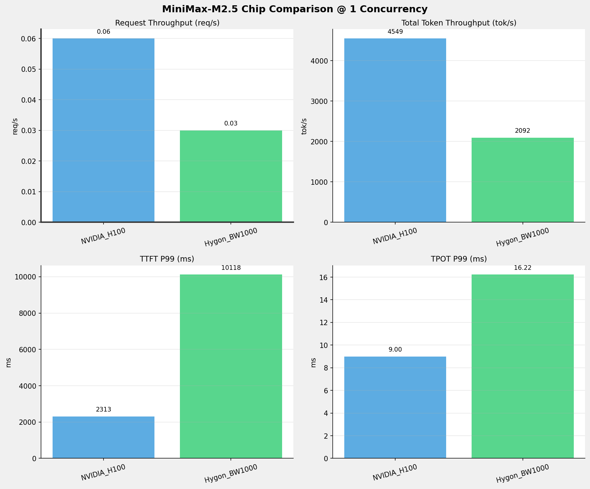
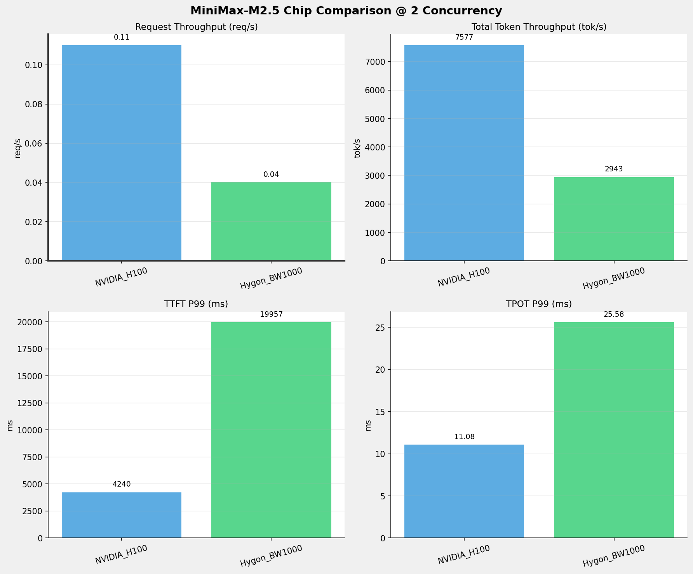
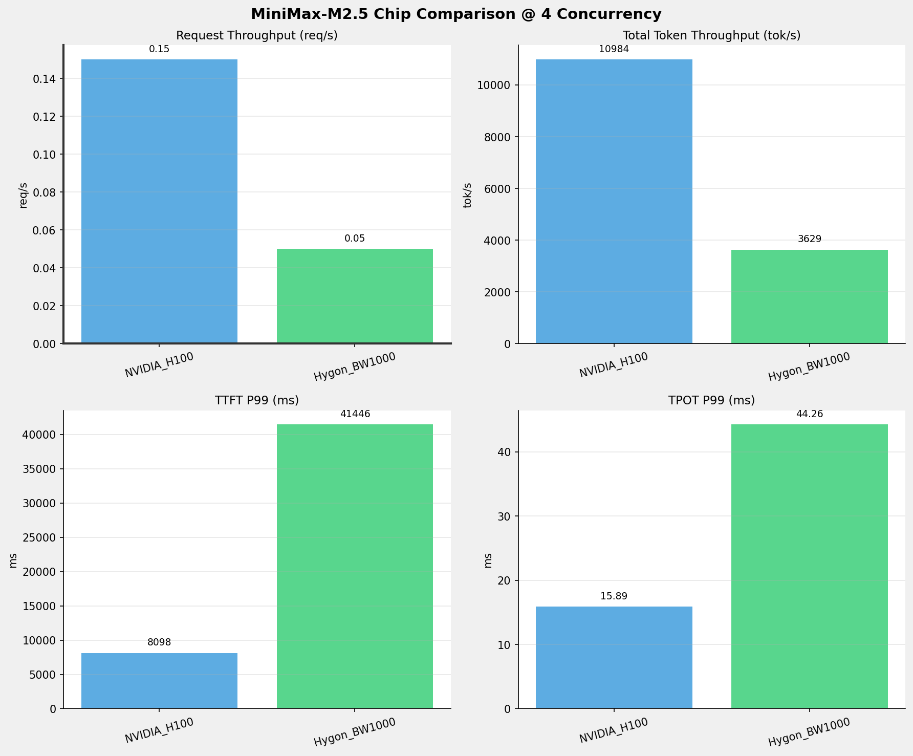
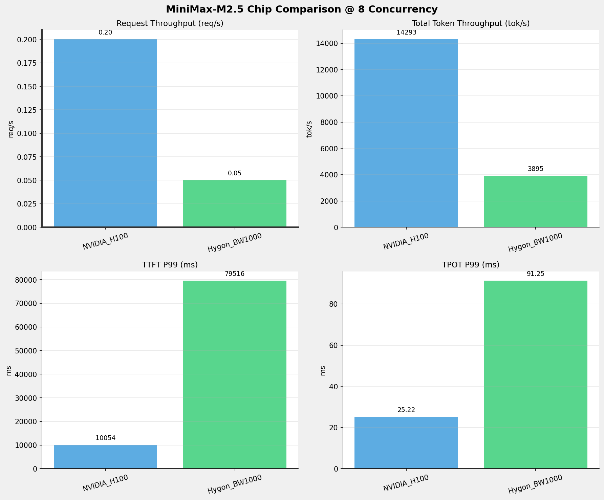
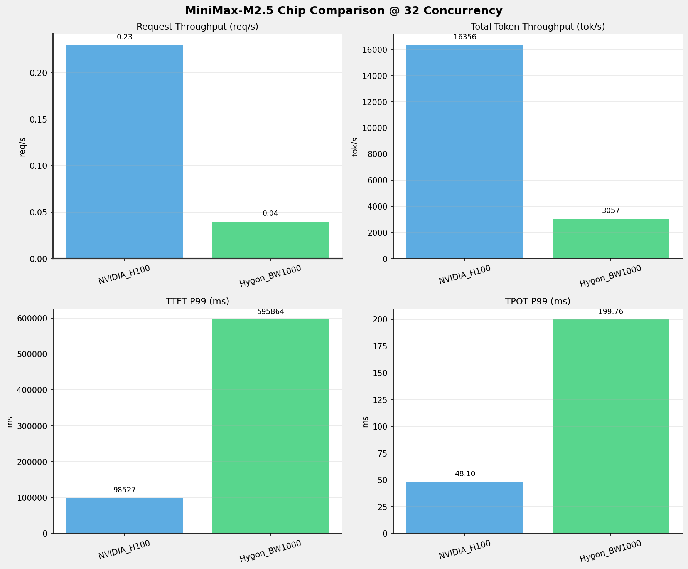
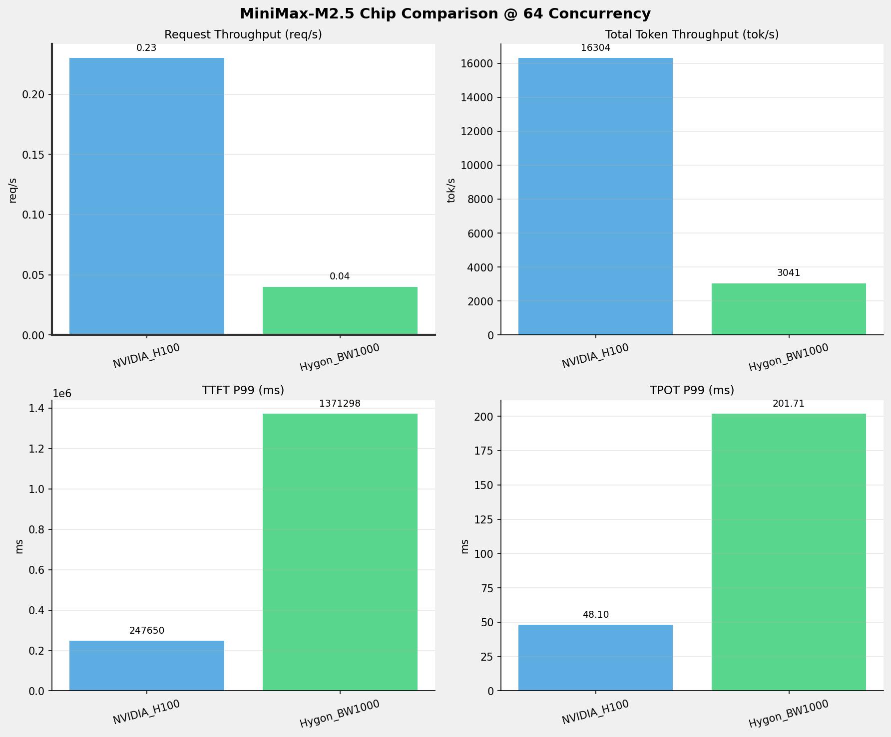
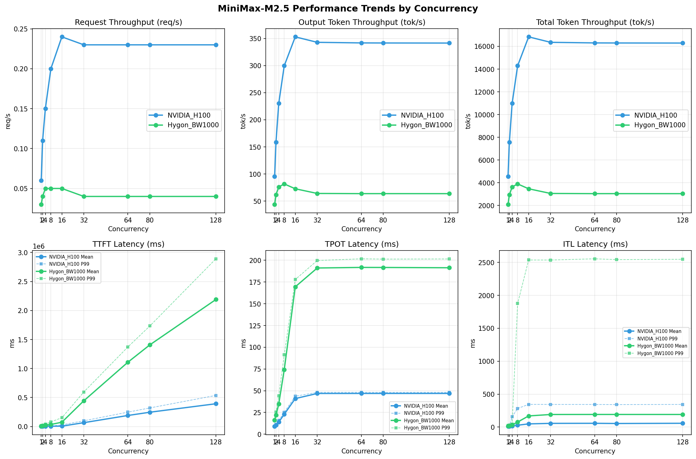

# MiniMax-M2.5模型在不同芯片下的benchmark基准测试报告

**测试日期：** 2026-05-25

---

## 测试场景
在固定请求数，输入上下文和输出上下文长度下，使用vllm bench serve工具对并发数逐级增加场景的性能基准验证。并对比同一模型在不同芯片环境上的性能指标。

**主要采集指标**：

| 指标                  | 单位         | 含义                                 |
|---------------------|------------|------------------------------------|
| TTFT                | ms         | Time To First Token，首 token 延迟     |
| TPOT                | ms/token   | Time Per Output Token，每 token 生成时间 |
| Throughput          | tokens/s   | 系统总吞吐                              |
| QPS                 | requests/s | 请求吞吐                               |
| P50/P95/P99 Latency | ms         | 延迟分位数                              |
    
### 📊 测试概览

| 项目            | 配置                                     | 备注  |
|---------------|----------------------------------------|-----|
| **数据集**       | random                                 |     |
| **并发数**       | 1, 2, 4, 8, 16, 32, 64, 80, 128    |     |
| **总请求数**      | 300                                    |     |
| **请求输入上下文长度** | 70000（68k）                             |     |
| **请求输出上下文长度** | 1500（1k）                             |     |
| **被测芯片**      | NVIDIA_H100, Hygon_BW1000 |     |
| **被测模型**      | MiniMax-M2.5 |     |

---

### 🤖 芯片和模型配置信息

| 参数名称 | **NVIDIA_H100** | **Hygon_BW1000** |
|----------|----------|----------|
| **max_position_embeddings** | 196608 | 196608 |
| **model_name** | MiniMax-M2.5 | MiniMax-M2.5-W8A8 |
| **model_size** | 215G | 215G |
| **python_version** | 3.12.3 | 3.10.12 |
| **quantization_config** | FP8 | int-8 |
| **temperature** | 1.0 | N/A |
| **top_k** | 40 | N/A |
| **top_p** | 0.95 | N/A |
| **transformers_version** | 4.46.1 | 4.57.6 |
| **vllm_version** | 0.20.0 | 0.15.1+das.opt1.alpha.dtk2604 |

---

### ⚙️ vLLM启动配置信息

| 参数名称 | **NVIDIA_H100** | **Hygon_BW1000** |
|----------|----------|----------|
| **Block Size** | default | default |
| **Compilation Config** | N/A | N/A |
| **Dp** | 1 | 1 |
| **Dtype** | default | bfloat16 |
| **Enable Auto Tool Choice** | True | True |
| **Enable Export Parallel** | True | True |
| **Gpu Memory Utilization** | 0.85 | 0.9 |
| **Max Model Len** | 196608 | 196608 |
| **Max Num Batched Tokens** | 8192 | default |
| **Max Num Seqs** | 64 | 64 |
| **Model Name** | MiniMax-M2.5 | MiniMax-M2.5-W8A8 |
| **Pp** | 1 | 1 |
| **Reasoning Parser** | minimax_m2 | minimax_m2 (不生效) |
| **Tool Call Parser** | minimax_m2 | minimax_m2 |
| **Tp** | 8 | 8 |

- **NVIDIA_H100**: 英伟达H100标准配置
- **Hygon_BW1000**: 海光芯片专家并行配置

---

### 📊 芯片性能对比柱状图

**1并发**

**2并发**

**4并发**

**8并发**

**16并发**

**32并发**

**64并发**

**80并发**

**128并发**

### 📈 性能趋势对比图 (所有芯片)

---

### 📈 各指标随并发级别性能对比详情

#### 请求吞吐量（Request throughput (req/s)）

| 并发数 | NVIDIA_H100 | Hygon_BW1000 | 差值 | 百分比 |
|-----|----------- | ----------- | ----------- | -----------|
| 1   | 0.06 | 0.03 | -0.03 | -50.0% |
| 2   | 0.11 | 0.04 | -0.07 | -63.6% |
| 4   | 0.15 | 0.05 | -0.10 | -66.7% |
| 8   | 0.20 | 0.05 | -0.15 | -75.0% |
| 16   | 0.24 | 0.05 | -0.19 | -79.2% |
| 32   | 0.23 | 0.04 | -0.19 | -82.6% |
| 64   | 0.23 | 0.04 | -0.19 | -82.6% |
| 80   | 0.23 | 0.04 | -0.19 | -82.6% |
| 128   | 0.23 | 0.04 | -0.19 | -82.6% |

#### 输出token吞吐量（Output token throughput (tok/s)）

| 并发数 | NVIDIA_H100 | Hygon_BW1000 | 差值 | 百分比 |
|-----|----------- | ----------- | ----------- | -----------|
| 1   | 95.39 | 43.89 | -51.50 | -54.0% |
| 2   | 158.87 | 61.75 | -97.12 | -61.1% |
| 4   | 230.31 | 76.14 | -154.17 | -66.9% |
| 8   | 299.68 | 81.71 | -217.97 | -72.7% |
| 16   | 353.03 | 72.78 | -280.25 | -79.4% |
| 32   | 342.94 | 64.13 | -278.81 | -81.3% |
| 64   | 341.85 | 63.79 | -278.06 | -81.3% |
| 80   | 341.72 | 63.80 | -277.92 | -81.3% |
| 128   | 341.57 | 63.76 | -277.81 | -81.3% |

#### 总token吞吐量（Total token throughput (tok/s)）

| 并发数 | NVIDIA_H100 | Hygon_BW1000 | 差值 | 百分比 |
|-----|----------- | ----------- | ----------- | -----------|
| 1   | 4549.40 | 2092.00 | -2457.40 | -54.0% |
| 2   | 7577.10 | 2943.35 | -4633.75 | -61.2% |
| 4   | 10984.25 | 3629.34 | -7354.91 | -67.0% |
| 8   | 14292.56 | 3894.89 | -10397.67 | -72.7% |
| 16   | 16836.89 | 3469.26 | -13367.63 | -79.4% |
| 32   | 16355.82 | 3056.64 | -13299.18 | -81.3% |
| 64   | 16303.60 | 3040.56 | -13263.04 | -81.4% |
| 80   | 16297.33 | 3041.22 | -13256.11 | -81.3% |
| 128   | 16290.56 | 3039.30 | -13251.26 | -81.3% |

#### 首token延迟（P99 TTFT (ms)）

| 并发数 | NVIDIA_H100 | Hygon_BW1000 | 差值 | 百分比 |
|-----|----------- | ----------- | ----------- | -----------|
| 1   | 2312.95 | 10118.14 | +7805.19 | +337.5% |
| 2   | 4240.42 | 19956.91 | +15716.49 | +370.6% |
| 4   | 8098.15 | 41446.48 | +33348.33 | +411.8% |
| 8   | 10054.11 | 79516.10 | +69461.99 | +690.9% |
| 16   | 28385.80 | 151330.77 | +122944.97 | +433.1% |
| 32   | 98526.87 | 595863.60 | +497336.73 | +504.8% |
| 64   | 247650.08 | 1371298.09 | +1123648.01 | +453.7% |
| 80   | 320130.95 | 1733428.13 | +1413297.18 | +441.5% |
| 128   | 536235.57 | 2891361.47 | +2355125.90 | +439.2% |

#### 每token生成时间（P99 TPOT (ms)）

| 并发数 | NVIDIA_H100 | Hygon_BW1000 | 差值 | 百分比 |
|-----|----------- | ----------- | ----------- | -----------|
| 1   | 9.00 | 16.22 | +7.22 | +80.2% |
| 2   | 11.08 | 25.58 | +14.50 | +130.9% |
| 4   | 15.89 | 44.26 | +28.37 | +178.5% |
| 8   | 25.22 | 91.25 | +66.03 | +261.8% |
| 16   | 43.65 | 177.85 | +134.20 | +307.4% |
| 32   | 48.10 | 199.76 | +151.66 | +315.3% |
| 64   | 48.10 | 201.71 | +153.61 | +319.4% |
| 80   | 48.05 | 201.38 | +153.33 | +319.1% |
| 128   | 48.08 | 201.55 | +153.47 | +319.2% |

#### token间延迟（P99 ITL (ms)）

| 并发数 | NVIDIA_H100 | Hygon_BW1000 | 差值 | 百分比 |
|-----|----------- | ----------- | ----------- | -----------|
| 1   | 18.17 | 24.24 | +6.07 | +33.4% |
| 2   | 19.92 | 32.46 | +12.54 | +63.0% |
| 4   | 157.05 | 45.65 | -111.40 | -70.9% |
| 8   | 282.53 | 1876.60 | +1594.07 | +564.2% |
| 16   | 344.46 | 2536.68 | +2192.22 | +636.4% |
| 32   | 343.86 | 2536.06 | +2192.20 | +637.5% |
| 64   | 343.18 | 2554.58 | +2211.40 | +644.4% |
| 80   | 341.65 | 2542.31 | +2200.66 | +644.1% |
| 128   | 343.83 | 2547.46 | +2203.63 | +640.9% |

### 📈 各并发级别性能对比详情

### 1 并发

#### 服务基准结果

| 指标 | NVIDIA_H100 | Hygon_BW1000 |
|------|----------- | -----------|
| 成功请求数 | 300 | 300 |
| 失败请求数 | 0 | 0 |
| 测试持续时间 (s) | 4717.48 | 10253.33 |
| 总输入 tokens | 21011700 | 21000000 |
| 总生成 tokens | 450000 | 450000 |
| **请求吞吐量 (req/s)** | **0.06** ⭐ | 0.03 |
| **输出 token 吞吐量 (tok/s)** | **95.39** ⭐ | 43.89 |
| 峰值输出 token 吞吐量 (tok/s) | **113.00** ⭐ | 66.00 |
| 峰值并发请求数 | 2.00 | 2.00 |
| **总 token 吞吐量 (tok/s)** | **4549.40** ⭐ | 2092.00 |

#### 首Token延迟 (TTFT)

| 指标 | NVIDIA_H100 | Hygon_BW1000 |
|------|----------- | -----------|
| 平均 TTFT (ms) | **2265.26** ⭐ | 9993.33 |
| 中位 TTFT (ms) | **2271.20** ⭐ | 10014.96 |
| P95 TTFT (ms) | **2298.66** ⭐ | 10107.89 |
| P99 TTFT (ms) | **2312.95** ⭐ | 10118.14 |

#### 每Token生成时间 (TPOT)

| 指标 | NVIDIA_H100 | Hygon_BW1000 |
|------|----------- | -----------|
| 平均 TPOT (ms) | **8.98** ⭐ | 16.13 |
| 中位 TPOT (ms) | **8.98** ⭐ | 16.13 |
| P95 TPOT (ms) | **9.00** ⭐ | 16.20 |
| P99 TPOT (ms) | **9.00** ⭐ | 16.22 |

#### Token间延迟 (ITL)

| 指标 | NVIDIA_H100 | Hygon_BW1000 |
|------|----------- | -----------|
| 平均 ITL (ms) | **10.75** ⭐ | 16.18 |
| 中位 ITL (ms) | **9.01** ⭐ | 16.13 |
| P95 ITL (ms) | 18.04 | **16.87** ⭐ |
| P99 ITL (ms) | **18.17** ⭐ | 24.24 |

---

### 2 并发

#### 服务基准结果

| 指标 | NVIDIA_H100 | Hygon_BW1000 |
|------|----------- | -----------|
| 成功请求数 | 300 | 300 |
| 失败请求数 | 0 | 0 |
| 测试持续时间 (s) | 2832.44 | 7287.61 |
| 总输入 tokens | 21011700 | 21000000 |
| 总生成 tokens | 450000 | 450000 |
| **请求吞吐量 (req/s)** | **0.11** ⭐ | 0.04 |
| **输出 token 吞吐量 (tok/s)** | **158.87** ⭐ | 61.75 |
| 峰值输出 token 吞吐量 (tok/s) | **206.00** ⭐ | 112.00 |
| 峰值并发请求数 | 4.00 | 4.00 |
| **总 token 吞吐量 (tok/s)** | **7577.10** ⭐ | 2943.35 |

#### 首Token延迟 (TTFT)

| 指标 | NVIDIA_H100 | Hygon_BW1000 |
|------|----------- | -----------|
| 平均 TTFT (ms) | **3258.76** ⭐ | 15464.15 |
| 中位 TTFT (ms) | **2492.32** ⭐ | 11251.28 |
| P95 TTFT (ms) | **4233.81** ⭐ | 19940.45 |
| P99 TTFT (ms) | **4240.42** ⭐ | 19956.91 |

#### 每Token生成时间 (TPOT)

| 指标 | NVIDIA_H100 | Hygon_BW1000 |
|------|----------- | -----------|
| 平均 TPOT (ms) | **10.42** ⭐ | 22.09 |
| 中位 TPOT (ms) | **10.38** ⭐ | 22.05 |
| P95 TPOT (ms) | **11.07** ⭐ | 25.16 |
| P99 TPOT (ms) | **11.08** ⭐ | 25.58 |

#### Token间延迟 (ITL)

| 指标 | NVIDIA_H100 | Hygon_BW1000 |
|------|----------- | -----------|
| 平均 ITL (ms) | **12.47** ⭐ | 22.15 |
| 中位 ITL (ms) | **9.83** ⭐ | 19.15 |
| P95 ITL (ms) | **19.69** ⭐ | 20.52 |
| P99 ITL (ms) | **19.92** ⭐ | 32.46 |

---

### 4 并发

#### 服务基准结果

| 指标 | NVIDIA_H100 | Hygon_BW1000 |
|------|----------- | -----------|
| 成功请求数 | 300 | 300 |
| 失败请求数 | 0 | 0 |
| 测试持续时间 (s) | 1953.86 | 5910.16 |
| 总输入 tokens | 21011700 | 21000000 |
| 总生成 tokens | 450000 | 450000 |
| **请求吞吐量 (req/s)** | **0.15** ⭐ | 0.05 |
| **输出 token 吞吐量 (tok/s)** | **230.31** ⭐ | 76.14 |
| 峰值输出 token 吞吐量 (tok/s) | **336.00** ⭐ | 168.00 |
| 峰值并发请求数 | 8.00 | 8.00 |
| **总 token 吞吐量 (tok/s)** | **10984.25** ⭐ | 3629.34 |

#### 首Token延迟 (TTFT)

| 指标 | NVIDIA_H100 | Hygon_BW1000 |
|------|----------- | -----------|
| 平均 TTFT (ms) | **5199.14** ⭐ | 26798.16 |
| 中位 TTFT (ms) | **4769.26** ⭐ | 22159.57 |
| P95 TTFT (ms) | **8071.32** ⭐ | 41423.66 |
| P99 TTFT (ms) | **8098.15** ⭐ | 41446.48 |

#### 每Token生成时间 (TPOT)

| 指标 | NVIDIA_H100 | Hygon_BW1000 |
|------|----------- | -----------|
| 平均 TPOT (ms) | **13.91** ⭐ | 34.69 |
| 中位 TPOT (ms) | **13.76** ⭐ | 37.38 |
| P95 TPOT (ms) | **15.87** ⭐ | 44.05 |
| P99 TPOT (ms) | **15.89** ⭐ | 44.26 |

#### Token间延迟 (ITL)

| 指标 | NVIDIA_H100 | Hygon_BW1000 |
|------|----------- | -----------|
| 平均 ITL (ms) | **16.87** ⭐ | 34.71 |
| 中位 ITL (ms) | **12.09** ⭐ | 25.13 |
| P95 ITL (ms) | **24.19** ⭐ | 26.22 |
| P99 ITL (ms) | 157.05 | **45.65** ⭐ |

---

### 8 并发

#### 服务基准结果

| 指标 | NVIDIA_H100 | Hygon_BW1000 |
|------|----------- | -----------|
| 成功请求数 | 300 | 300 |
| 失败请求数 | 0 | 0 |
| 测试持续时间 (s) | 1501.60 | 5507.22 |
| 总输入 tokens | 21011700 | 21000000 |
| 总生成 tokens | 450000 | 450000 |
| **请求吞吐量 (req/s)** | **0.20** ⭐ | 0.05 |
| **输出 token 吞吐量 (tok/s)** | **299.68** ⭐ | 81.71 |
| 峰值输出 token 吞吐量 (tok/s) | **504.00** ⭐ | 240.00 |
| 峰值并发请求数 | 12.00 | 16.00 |
| **总 token 吞吐量 (tok/s)** | **14292.56** ⭐ | 3894.89 |

#### 首Token延迟 (TTFT)

| 指标 | NVIDIA_H100 | Hygon_BW1000 |
|------|----------- | -----------|
| 平均 TTFT (ms) | **5445.97** ⭐ | 34962.62 |
| 中位 TTFT (ms) | **6441.27** ⭐ | 36884.00 |
| P95 TTFT (ms) | **7118.12** ⭐ | 47070.20 |
| P99 TTFT (ms) | **10054.11** ⭐ | 79516.10 |

#### 每Token生成时间 (TPOT)

| 指标 | NVIDIA_H100 | Hygon_BW1000 |
|------|----------- | -----------|
| 平均 TPOT (ms) | **22.90** ⭐ | 74.22 |
| 中位 TPOT (ms) | **22.40** ⭐ | 72.90 |
| P95 TPOT (ms) | **25.08** ⭐ | 88.17 |
| P99 TPOT (ms) | **25.22** ⭐ | 91.25 |

#### Token间延迟 (ITL)

| 指标 | NVIDIA_H100 | Hygon_BW1000 |
|------|----------- | -----------|
| 平均 ITL (ms) | **28.18** ⭐ | 76.39 |
| 中位 ITL (ms) | **15.99** ⭐ | 35.95 |
| P95 ITL (ms) | **32.17** ⭐ | 42.84 |
| P99 ITL (ms) | **282.53** ⭐ | 1876.60 |

---

### 16 并发

#### 服务基准结果

| 指标 | NVIDIA_H100 | Hygon_BW1000 |
|------|----------- | -----------|
| 成功请求数 | 300 | 300 |
| 失败请求数 | 0 | 0 |
| 测试持续时间 (s) | 1274.68 | 6182.87 |
| 总输入 tokens | 21011700 | 21000000 |
| 总生成 tokens | 450000 | 450000 |
| **请求吞吐量 (req/s)** | **0.24** ⭐ | 0.05 |
| **输出 token 吞吐量 (tok/s)** | **353.03** ⭐ | 72.78 |
| 峰值输出 token 吞吐量 (tok/s) | **700.00** ⭐ | 312.00 |
| 峰值并发请求数 | 18.00 | 17.00 |
| **总 token 吞吐量 (tok/s)** | **16836.89** ⭐ | 3469.26 |

#### 首Token延迟 (TTFT)

| 指标 | NVIDIA_H100 | Hygon_BW1000 |
|------|----------- | -----------|
| 平均 TTFT (ms) | **6148.44** ⭐ | 73879.33 |
| 中位 TTFT (ms) | **5940.84** ⭐ | 57063.63 |
| P95 TTFT (ms) | **6378.03** ⭐ | 124074.69 |
| P99 TTFT (ms) | **28385.80** ⭐ | 151330.77 |

#### 每Token生成时间 (TPOT)

| 指标 | NVIDIA_H100 | Hygon_BW1000 |
|------|----------- | -----------|
| 平均 TPOT (ms) | **40.95** ⭐ | 169.45 |
| 中位 TPOT (ms) | **41.27** ⭐ | 173.08 |
| P95 TPOT (ms) | **43.50** ⭐ | 176.30 |
| P99 TPOT (ms) | **43.65** ⭐ | 177.85 |

#### Token间延迟 (ITL)

| 指标 | NVIDIA_H100 | Hygon_BW1000 |
|------|----------- | -----------|
| 平均 ITL (ms) | **48.57** ⭐ | 169.38 |
| 中位 ITL (ms) | **23.15** ⭐ | 46.77 |
| P95 ITL (ms) | 240.07 | **67.88** ⭐ |
| P99 ITL (ms) | **344.46** ⭐ | 2536.68 |

---

### 32 并发

#### 服务基准结果

| 指标 | NVIDIA_H100 | Hygon_BW1000 |
|------|----------- | -----------|
| 成功请求数 | 300 | 300 |
| 失败请求数 | 0 | 0 |
| 测试持续时间 (s) | 1312.18 | 7017.50 |
| 总输入 tokens | 21011700 | 21000000 |
| 总生成 tokens | 450000 | 450000 |
| **请求吞吐量 (req/s)** | **0.23** ⭐ | 0.04 |
| **输出 token 吞吐量 (tok/s)** | **342.94** ⭐ | 64.13 |
| 峰值输出 token 吞吐量 (tok/s) | **655.00** ⭐ | 299.00 |
| 峰值并发请求数 | 34.00 | 33.00 |
| **总 token 吞吐量 (tok/s)** | **16355.82** ⭐ | 3056.64 |

#### 首Token延迟 (TTFT)

| 指标 | NVIDIA_H100 | Hygon_BW1000 |
|------|----------- | -----------|
| 平均 TTFT (ms) | **66344.50** ⭐ | 444260.49 |
| 中位 TTFT (ms) | **72321.67** ⭐ | 433702.94 |
| P95 TTFT (ms) | **74808.85** ⭐ | 502220.59 |
| P99 TTFT (ms) | **98526.87** ⭐ | 595863.60 |

#### 每Token生成时间 (TPOT)

| 指标 | NVIDIA_H100 | Hygon_BW1000 |
|------|----------- | -----------|
| 平均 TPOT (ms) | **46.83** ⭐ | 191.15 |
| 中位 TPOT (ms) | **47.79** ⭐ | 196.19 |
| P95 TPOT (ms) | **48.00** ⭐ | 198.52 |
| P99 TPOT (ms) | **48.10** ⭐ | 199.76 |

#### Token间延迟 (ITL)

| 指标 | NVIDIA_H100 | Hygon_BW1000 |
|------|----------- | -----------|
| 平均 ITL (ms) | **56.34** ⭐ | 191.17 |
| 中位 ITL (ms) | **28.08** ⭐ | 46.84 |
| P95 ITL (ms) | 253.78 | **72.93** ⭐ |
| P99 ITL (ms) | **343.86** ⭐ | 2536.06 |

---

### 64 并发

#### 服务基准结果

| 指标 | NVIDIA_H100 | Hygon_BW1000 |
|------|----------- | -----------|
| 成功请求数 | 300 | 300 |
| 失败请求数 | 0 | 0 |
| 测试持续时间 (s) | 1316.38 | 7054.61 |
| 总输入 tokens | 21011700 | 21000000 |
| 总生成 tokens | 450000 | 450000 |
| **请求吞吐量 (req/s)** | **0.23** ⭐ | 0.04 |
| **输出 token 吞吐量 (tok/s)** | **341.85** ⭐ | 63.79 |
| 峰值输出 token 吞吐量 (tok/s) | **627.00** ⭐ | 299.00 |
| 峰值并发请求数 | 65.00 | 65.00 |
| **总 token 吞吐量 (tok/s)** | **16303.60** ⭐ | 3040.56 |

#### 首Token延迟 (TTFT)

| 指标 | NVIDIA_H100 | Hygon_BW1000 |
|------|----------- | -----------|
| 平均 TTFT (ms) | **190118.45** ⭐ | 1108159.06 |
| 中位 TTFT (ms) | **216059.14** ⭐ | 1220686.40 |
| P95 TTFT (ms) | **217071.88** ⭐ | 1237901.88 |
| P99 TTFT (ms) | **247650.08** ⭐ | 1371298.09 |

#### 每Token生成时间 (TPOT)

| 指标 | NVIDIA_H100 | Hygon_BW1000 |
|------|----------- | -----------|
| 平均 TPOT (ms) | **46.85** ⭐ | 191.81 |
| 中位 TPOT (ms) | **47.78** ⭐ | 196.12 |
| P95 TPOT (ms) | **48.00** ⭐ | 200.43 |
| P99 TPOT (ms) | **48.10** ⭐ | 201.71 |

#### Token间延迟 (ITL)

| 指标 | NVIDIA_H100 | Hygon_BW1000 |
|------|----------- | -----------|
| 平均 ITL (ms) | **57.42** ⭐ | 191.72 |
| 中位 ITL (ms) | **28.25** ⭐ | 46.79 |
| P95 ITL (ms) | 256.07 | **67.60** ⭐ |
| P99 ITL (ms) | **343.18** ⭐ | 2554.58 |

---

### 80 并发

#### 服务基准结果

| 指标 | NVIDIA_H100 | Hygon_BW1000 |
|------|----------- | -----------|
| 成功请求数 | 300 | 300 |
| 失败请求数 | 0 | 0 |
| 测试持续时间 (s) | 1316.88 | 7053.10 |
| 总输入 tokens | 21011700 | 21000000 |
| 总生成 tokens | 450000 | 450000 |
| **请求吞吐量 (req/s)** | **0.23** ⭐ | 0.04 |
| **输出 token 吞吐量 (tok/s)** | **341.72** ⭐ | 63.80 |
| 峰值输出 token 吞吐量 (tok/s) | **665.00** ⭐ | 299.00 |
| 峰值并发请求数 | 81.00 | 81.00 |
| **总 token 吞吐量 (tok/s)** | **16297.33** ⭐ | 3041.22 |

#### 首Token延迟 (TTFT)

| 指标 | NVIDIA_H100 | Hygon_BW1000 |
|------|----------- | -----------|
| 平均 TTFT (ms) | **246314.20** ⭐ | 1408070.53 |
| 中位 TTFT (ms) | **287938.63** ⭐ | 1583304.98 |
| P95 TTFT (ms) | **288750.19** ⭐ | 1649490.58 |
| P99 TTFT (ms) | **320130.95** ⭐ | 1733428.13 |

#### 每Token生成时间 (TPOT)

| 指标 | NVIDIA_H100 | Hygon_BW1000 |
|------|----------- | -----------|
| 平均 TPOT (ms) | **46.86** ⭐ | 191.75 |
| 中位 TPOT (ms) | **47.79** ⭐ | 196.16 |
| P95 TPOT (ms) | **47.99** ⭐ | 200.11 |
| P99 TPOT (ms) | **48.05** ⭐ | 201.38 |

#### Token间延迟 (ITL)

| 指标 | NVIDIA_H100 | Hygon_BW1000 |
|------|----------- | -----------|
| 平均 ITL (ms) | **54.43** ⭐ | 191.68 |
| 中位 ITL (ms) | **28.22** ⭐ | 46.66 |
| P95 ITL (ms) | 246.76 | **61.67** ⭐ |
| P99 ITL (ms) | **341.65** ⭐ | 2542.31 |

---

### 128 并发

#### 服务基准结果

| 指标 | NVIDIA_H100 | Hygon_BW1000 |
|------|----------- | -----------|
| 成功请求数 | 300 | 300 |
| 失败请求数 | 0 | 0 |
| 测试持续时间 (s) | 1317.43 | 7057.54 |
| 总输入 tokens | 21011700 | 21000000 |
| 总生成 tokens | 450000 | 450000 |
| **请求吞吐量 (req/s)** | **0.23** ⭐ | 0.04 |
| **输出 token 吞吐量 (tok/s)** | **341.57** ⭐ | 63.76 |
| 峰值输出 token 吞吐量 (tok/s) | **660.00** ⭐ | 325.00 |
| 峰值并发请求数 | 129.00 | 130.00 |
| **总 token 吞吐量 (tok/s)** | **16290.56** ⭐ | 3039.30 |

#### 首Token延迟 (TTFT)

| 指标 | NVIDIA_H100 | Hygon_BW1000 |
|------|----------- | -----------|
| 平均 TTFT (ms) | **392383.12** ⭐ | 2189682.78 |
| 中位 TTFT (ms) | **467565.25** ⭐ | 2733185.09 |
| P95 TTFT (ms) | **504667.37** ⭐ | 2762727.46 |
| P99 TTFT (ms) | **536235.57** ⭐ | 2891361.47 |

#### 每Token生成时间 (TPOT)

| 指标 | NVIDIA_H100 | Hygon_BW1000 |
|------|----------- | -----------|
| 平均 TPOT (ms) | **46.87** ⭐ | 191.42 |
| 中位 TPOT (ms) | **47.77** ⭐ | 196.14 |
| P95 TPOT (ms) | **48.00** ⭐ | 199.27 |
| P99 TPOT (ms) | **48.08** ⭐ | 201.55 |

#### Token间延迟 (ITL)

| 指标 | NVIDIA_H100 | Hygon_BW1000 |
|------|----------- | -----------|
| 平均 ITL (ms) | **57.77** ⭐ | 191.41 |
| 中位 ITL (ms) | **28.25** ⭐ | 46.80 |
| P95 ITL (ms) | 256.28 | **69.18** ⭐ |
| P99 ITL (ms) | **343.83** ⭐ | 2547.46 |

---

---

*报告生成时间: 2026-05-25*

