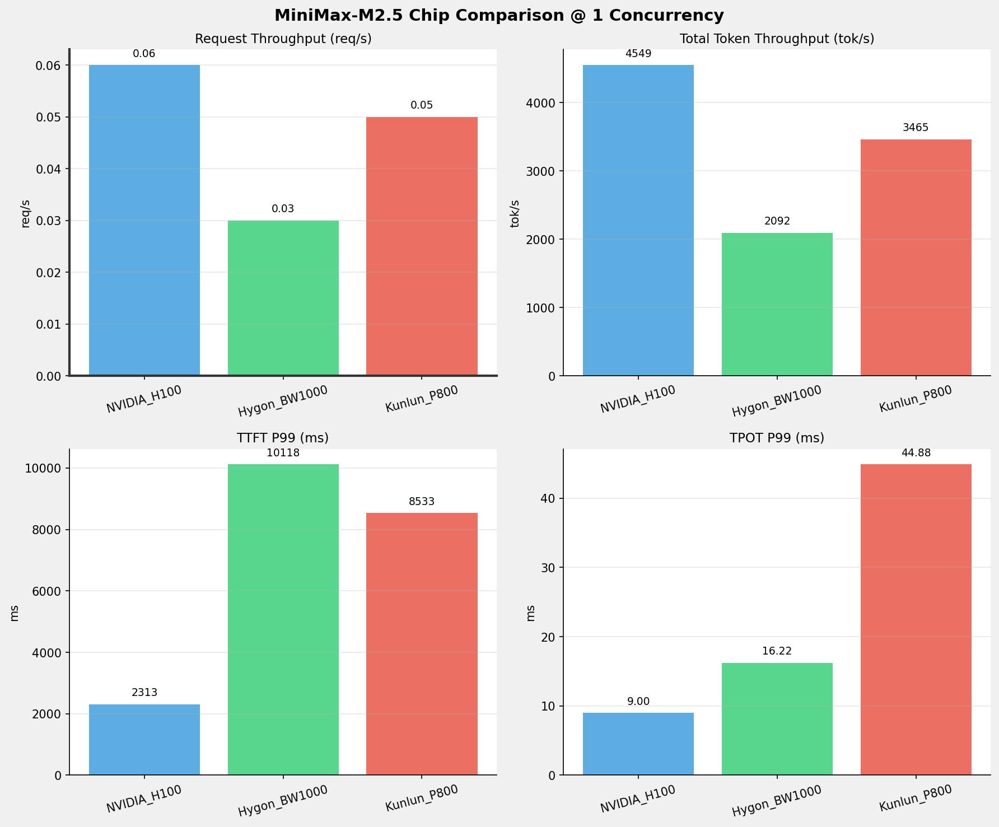
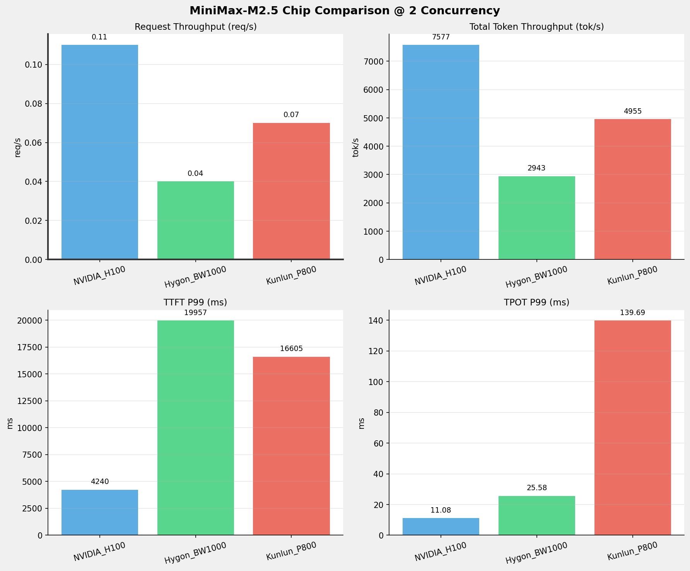
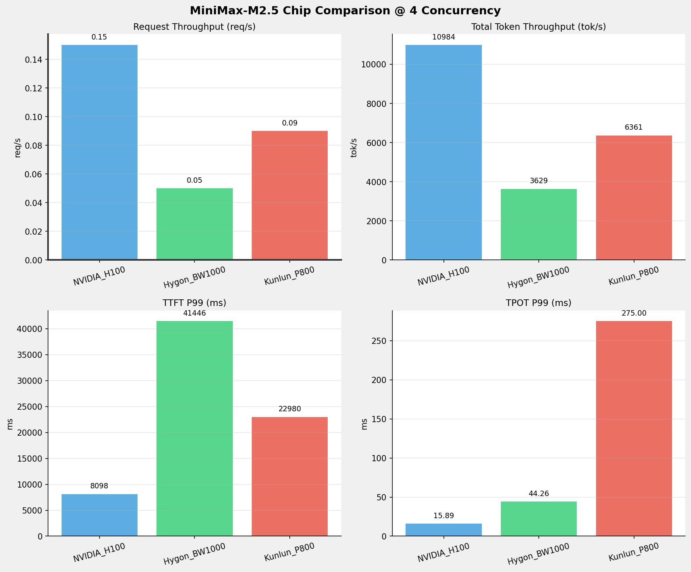
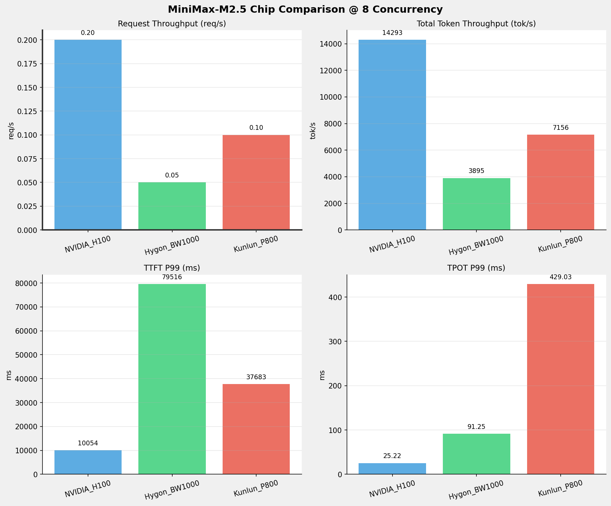
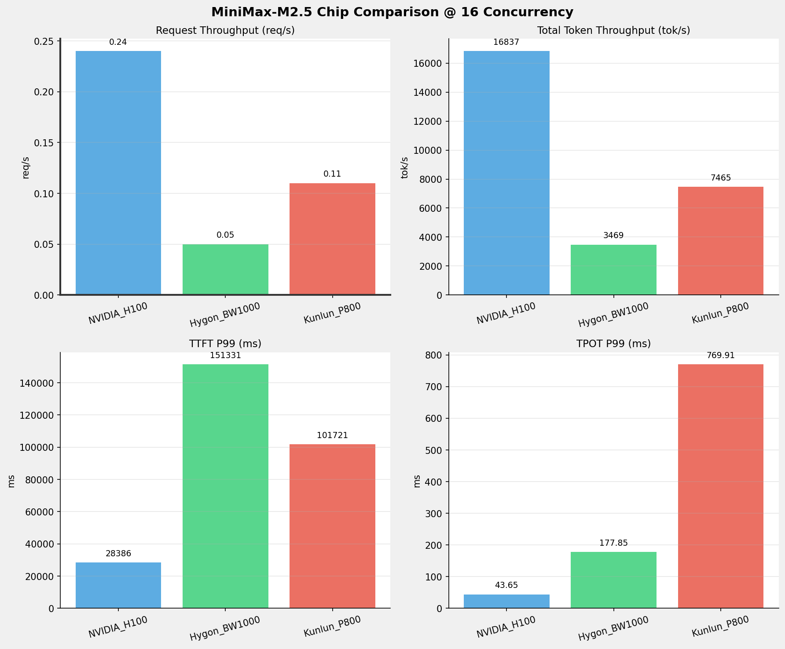
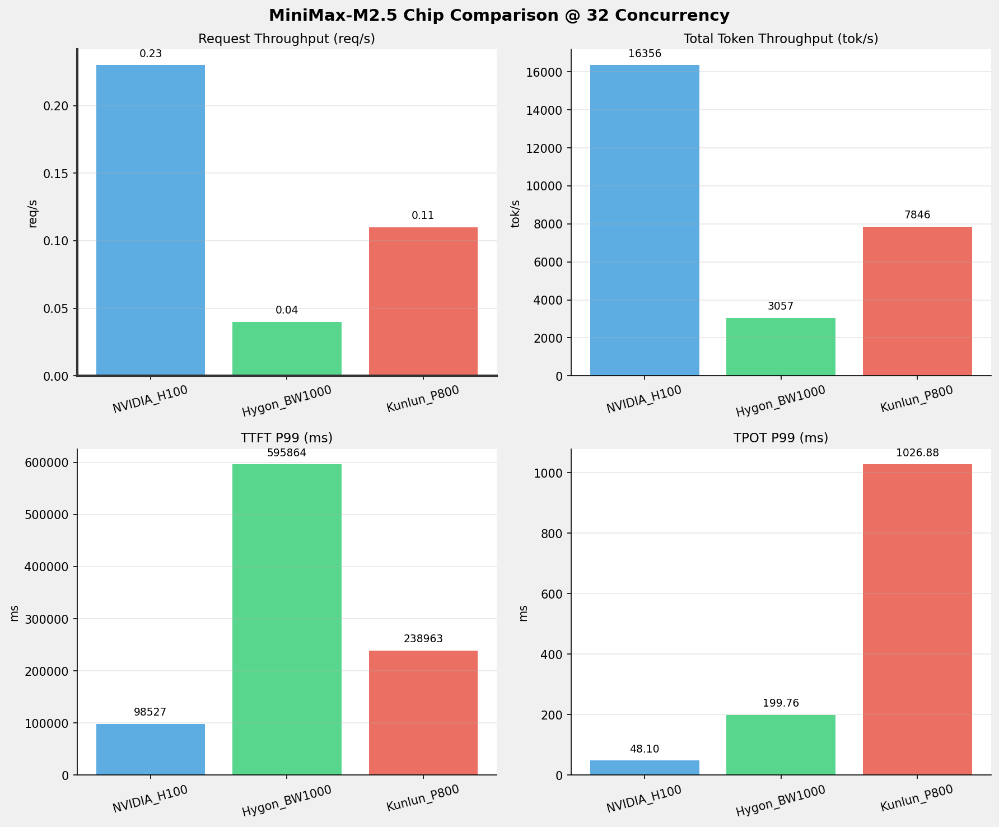
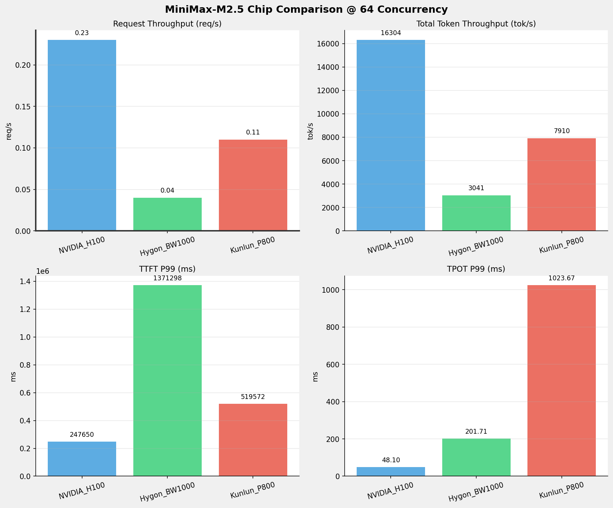
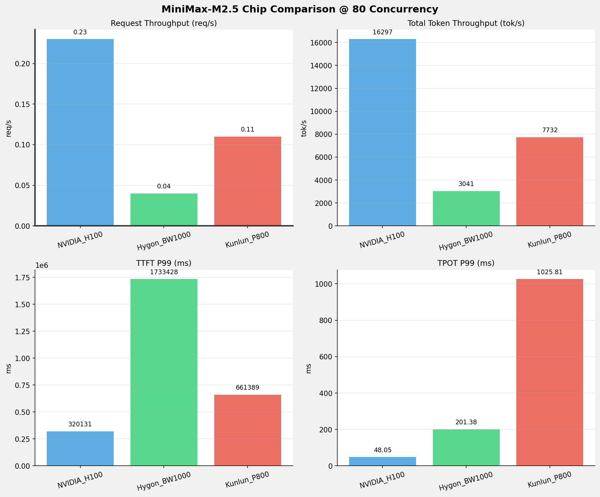
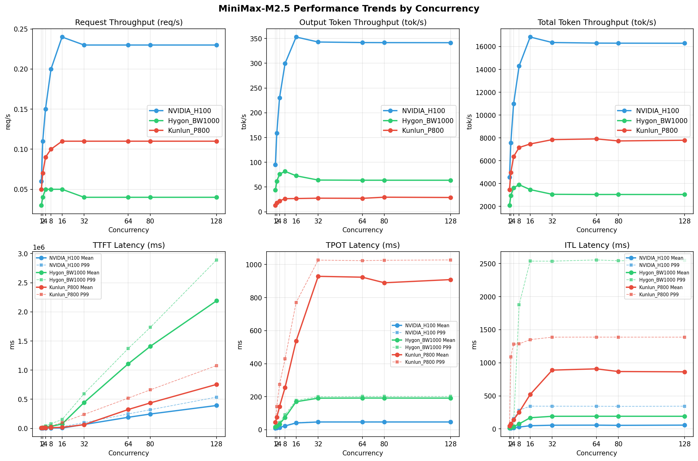

# MiniMax-M2.5模型在不同芯片下的benchmark基准测试报告

**测试日期：** 2026-05-25

---

## 测试场景
在固定请求数，输入上下文和输出上下文长度下，使用vllm bench serve工具对并发数逐级增加场景的性能基准验证。并对比同一模型在不同芯片环境上的性能指标。

**主要采集指标**：

| 指标                  | 单位         | 含义                                 |
|---------------------|------------|------------------------------------|
| TTFT                | ms         | Time To First Token，首 token 延迟     |
| TPOT                | ms/token   | Time Per Output Token，每 token 生成时间 |
| Throughput          | tokens/s   | 系统总吞吐                              |
| QPS                 | requests/s | 请求吞吐                               |
| P50/P95/P99 Latency | ms         | 延迟分位数                              |
    
### 📊 测试概览

| 项目            | 配置                                     | 备注  |
|---------------|----------------------------------------|-----|
| **数据集**       | random                                 |     |
| **并发数**       | 1, 2, 4, 8, 16, 32, 64, 80, 128    |     |
| **总请求数**      | 300                                    |     |
| **请求输入上下文长度** | 70000（68k）                             |     |
| **请求输出上下文长度** | 1500（1k）                             |     |
| **被测芯片**      | NVIDIA_H100, Hygon_BW1000, Kunlun_P800 |     |
| **被测模型**      | MiniMax-M2.5 |     |

---

### 🤖 芯片和模型配置信息

| 参数名称 | **NVIDIA_H100** | **Hygon_BW1000** | **Kunlun_P800** |
|----------|----------|----------|----------|
| **max_position_embeddings** | 196608 | 196608 | 196608 |
| **model_name** | MiniMax-M2.5 | MiniMax-M2.5-W8A8 | MiniMax-M2.5-W8A8-INT8-Dynamic |
| **model_size** | 215G | 215G | 215G |
| **python_version** | 3.12.3 | 3.10.12 | 3.10.15 |
| **quantization_config** | FP8 | int-8 | int-8 |
| **temperature** | 1.0 | N/A | 1.0 |
| **top_k** | 40 | N/A | 40 |
| **top_p** | 0.95 | N/A | 0.95 |
| **transformers_version** | 4.46.1 | 4.57.6 | 4.46.1 |
| **vllm_version** | 0.20.0 | 0.15.1+das.opt1.alpha.dtk2604 | 0.11.0 |

---

### ⚙️ vLLM启动配置信息

| 参数名称 | **NVIDIA_H100** | **Hygon_BW1000** | **Kunlun_P800** |
|----------|----------|----------|----------|
| **Block Size** | default | default | 128 |
| **Compilation Config** | N/A | N/A | {"splitting_ops":["vllm.unified_attention","vllm.unified_attention_with_output","vllm.unified_attention_with_output_kunlun","vllm.mamba_mixer2","vllm.mamba_mixer","vllm.short_conv","vllm.linear_attention","vllm.plamo2_mamba_mixer","vllm.gdn_attention","vllm.sparse_attn_indexer","vllm.sparse_attn_indexer_vllm_kunlun"]} |
| **Dp** | 1 | 1 | 1 |
| **Dtype** | default | bfloat16 | auto |
| **Enable Auto Tool Choice** | True | True | True |
| **Enable Export Parallel** | True | True | False |
| **Gpu Memory Utilization** | 0.85 | 0.9 | 0.95 |
| **Max Model Len** | 196608 | 196608 | 196608 |
| **Max Num Batched Tokens** | 8192 | default | 8192 |
| **Max Num Seqs** | 64 | 64 | 64 |
| **Model Name** | MiniMax-M2.5 | MiniMax-M2.5-W8A8 | MiniMax-M2.5-W8A8-INT8-Dynamic |
| **Pp** | 1 | 1 | 1 |
| **Reasoning Parser** | minimax_m2 | minimax_m2 (不生效) | minimax_m2 (不生效) |
| **Tool Call Parser** | minimax_m2 | minimax_m2 | minimax_m2 |
| **Tp** | 8 | 8 | 8 |

- **NVIDIA_H100**: 英伟达H100标准配置
- **Hygon_BW1000**: 海光芯片专家并行配置
- **Kunlun_P800**: 昆仑芯不启用专家并行避免通信问题

---

### 📊 芯片性能对比柱状图

**1并发**

**2并发**

**4并发**

**8并发**

**16并发**

**32并发**

**64并发**

**80并发**

**128并发**

### 📈 性能趋势对比图 (所有芯片)

---

### 📈 各指标随并发级别性能对比详情

#### 请求吞吐量（Request throughput (req/s)）

| 并发数 | NVIDIA_H100 | Hygon_BW1000 | Kunlun_P800 | 差值 | 百分比 |
|-----|----------- | ----------- | ----------- | ----------- | -----------|
| 1   | 0.06 | 0.03 | 0.05 | -0.01 | -16.7% |
| 2   | 0.11 | 0.04 | 0.07 | -0.04 | -36.4% |
| 4   | 0.15 | 0.05 | 0.09 | -0.06 | -40.0% |
| 8   | 0.20 | 0.05 | 0.10 | -0.10 | -50.0% |
| 16   | 0.24 | 0.05 | 0.11 | -0.13 | -54.2% |
| 32   | 0.23 | 0.04 | 0.11 | -0.12 | -52.2% |
| 64   | 0.23 | 0.04 | 0.11 | -0.12 | -52.2% |
| 80   | 0.23 | 0.04 | 0.11 | -0.12 | -52.2% |
| 128   | 0.23 | 0.04 | 0.11 | -0.12 | -52.2% |

#### 输出token吞吐量（Output token throughput (tok/s)）

| 并发数 | NVIDIA_H100 | Hygon_BW1000 | Kunlun_P800 | 差值 | 百分比 |
|-----|----------- | ----------- | ----------- | ----------- | -----------|
| 1   | 95.39 | 43.89 | 13.12 | -82.27 | -86.2% |
| 2   | 158.87 | 61.75 | 17.99 | -140.88 | -88.7% |
| 4   | 230.31 | 76.14 | 22.14 | -208.17 | -90.4% |
| 8   | 299.68 | 81.71 | 26.52 | -273.16 | -91.2% |
| 16   | 353.03 | 72.78 | 26.79 | -326.24 | -92.4% |
| 32   | 342.94 | 64.13 | 27.52 | -315.42 | -92.0% |
| 64   | 341.85 | 63.79 | 27.22 | -314.63 | -92.0% |
| 80   | 341.72 | 63.80 | 29.53 | -312.19 | -91.4% |
| 128   | 341.57 | 63.76 | 28.90 | -312.67 | -91.5% |

#### 总token吞吐量（Total token throughput (tok/s)）

| 并发数 | NVIDIA_H100 | Hygon_BW1000 | Kunlun_P800 | 差值 | 百分比 |
|-----|----------- | ----------- | ----------- | ----------- | -----------|
| 1   | 4549.40 | 2092.00 | 3465.11 | -1084.29 | -23.8% |
| 2   | 7577.10 | 2943.35 | 4955.03 | -2622.07 | -34.6% |
| 4   | 10984.25 | 3629.34 | 6360.69 | -4623.56 | -42.1% |
| 8   | 14292.56 | 3894.89 | 7155.70 | -7136.86 | -49.9% |
| 16   | 16836.89 | 3469.26 | 7465.21 | -9371.68 | -55.7% |
| 32   | 16355.82 | 3056.64 | 7846.40 | -8509.42 | -52.0% |
| 64   | 16303.60 | 3040.56 | 7910.21 | -8393.39 | -51.5% |
| 80   | 16297.33 | 3041.22 | 7732.45 | -8564.88 | -52.6% |
| 128   | 16290.56 | 3039.30 | 7792.43 | -8498.13 | -52.2% |

#### 首token延迟（P99 TTFT (ms)）

| 并发数 | NVIDIA_H100 | Hygon_BW1000 | Kunlun_P800 | 差值 | 百分比 |
|-----|----------- | ----------- | ----------- | ----------- | -----------|
| 1   | 2312.95 | 10118.14 | 8532.99 | +6220.04 | +268.9% |
| 2   | 4240.42 | 19956.91 | 16605.08 | +12364.66 | +291.6% |
| 4   | 8098.15 | 41446.48 | 22980.25 | +14882.10 | +183.8% |
| 8   | 10054.11 | 79516.10 | 37682.66 | +27628.55 | +274.8% |
| 16   | 28385.80 | 151330.77 | 101721.21 | +73335.41 | +258.4% |
| 32   | 98526.87 | 595863.60 | 238963.07 | +140436.20 | +142.5% |
| 64   | 247650.08 | 1371298.09 | 519571.52 | +271921.44 | +109.8% |
| 80   | 320130.95 | 1733428.13 | 661388.52 | +341257.57 | +106.6% |
| 128   | 536235.57 | 2891361.47 | 1077460.34 | +541224.77 | +100.9% |

#### 每token生成时间（P99 TPOT (ms)）

| 并发数 | NVIDIA_H100 | Hygon_BW1000 | Kunlun_P800 | 差值 | 百分比 |
|-----|----------- | ----------- | ----------- | ----------- | -----------|
| 1   | 9.00 | 16.22 | 44.88 | +35.88 | +398.7% |
| 2   | 11.08 | 25.58 | 139.69 | +128.61 | +1160.7% |
| 4   | 15.89 | 44.26 | 275.00 | +259.11 | +1630.6% |
| 8   | 25.22 | 91.25 | 429.03 | +403.81 | +1601.1% |
| 16   | 43.65 | 177.85 | 769.91 | +726.26 | +1663.8% |
| 32   | 48.10 | 199.76 | 1026.88 | +978.78 | +2034.9% |
| 64   | 48.10 | 201.71 | 1023.67 | +975.57 | +2028.2% |
| 80   | 48.05 | 201.38 | 1025.81 | +977.76 | +2034.9% |
| 128   | 48.08 | 201.55 | 1027.96 | +979.88 | +2038.0% |

#### token间延迟（P99 ITL (ms)）

| 并发数 | NVIDIA_H100 | Hygon_BW1000 | Kunlun_P800 | 差值 | 百分比 |
|-----|----------- | ----------- | ----------- | ----------- | -----------|
| 1   | 18.17 | 24.24 | 45.29 | +27.12 | +149.3% |
| 2   | 19.92 | 32.46 | 1089.63 | +1069.71 | +5370.0% |
| 4   | 157.05 | 45.65 | 1280.40 | +1123.35 | +715.3% |
| 8   | 282.53 | 1876.60 | 1286.06 | +1003.53 | +355.2% |
| 16   | 344.46 | 2536.68 | 1350.35 | +1005.89 | +292.0% |
| 32   | 343.86 | 2536.06 | 1387.43 | +1043.57 | +303.5% |
| 64   | 343.18 | 2554.58 | 1387.90 | +1044.72 | +304.4% |
| 80   | 341.65 | 2542.31 | 1387.65 | +1046.00 | +306.2% |
| 128   | 343.83 | 2547.46 | 1387.61 | +1043.78 | +303.6% |

### 📈 各并发级别性能对比详情

### 1 并发

#### 服务基准结果

| 指标 | NVIDIA_H100 | Hygon_BW1000 | Kunlun_P800 |
|------|----------- | ----------- | -----------|
| 成功请求数 | 300 | 300 | 300 |
| 失败请求数 | 0 | 0 | 0 |
| 测试持续时间 (s) | 4717.48 | 10253.33 | 6083.46 |
| 总输入 tokens | 21011700 | 21000000 | 21000000 |
| 总生成 tokens | 450000 | 450000 | 79843 |
| **请求吞吐量 (req/s)** | **0.06** ⭐ | 0.03 | 0.05 |
| **输出 token 吞吐量 (tok/s)** | **95.39** ⭐ | 43.89 | 13.12 |
| 峰值输出 token 吞吐量 (tok/s) | **113.00** ⭐ | 66.00 | 24.00 |
| 峰值并发请求数 | 2.00 | 2.00 | 2.00 |
| **总 token 吞吐量 (tok/s)** | **4549.40** ⭐ | 2092.00 | 3465.11 |

#### 首Token延迟 (TTFT)

| 指标 | NVIDIA_H100 | Hygon_BW1000 | Kunlun_P800 |
|------|----------- | ----------- | -----------|
| 平均 TTFT (ms) | **2265.26** ⭐ | 9993.33 | 8456.37 |
| 中位 TTFT (ms) | **2271.20** ⭐ | 10014.96 | 8492.34 |
| P95 TTFT (ms) | **2298.66** ⭐ | 10107.89 | 8525.89 |
| P99 TTFT (ms) | **2312.95** ⭐ | 10118.14 | 8532.99 |

#### 每Token生成时间 (TPOT)

| 指标 | NVIDIA_H100 | Hygon_BW1000 | Kunlun_P800 |
|------|----------- | ----------- | -----------|
| 平均 TPOT (ms) | **8.98** ⭐ | 16.13 | 44.56 |
| 中位 TPOT (ms) | **8.98** ⭐ | 16.13 | 44.53 |
| P95 TPOT (ms) | **9.00** ⭐ | 16.20 | 44.75 |
| P99 TPOT (ms) | **9.00** ⭐ | 16.22 | 44.88 |

#### Token间延迟 (ITL)

| 指标 | NVIDIA_H100 | Hygon_BW1000 | Kunlun_P800 |
|------|----------- | ----------- | -----------|
| 平均 ITL (ms) | **10.75** ⭐ | 16.18 | 44.58 |
| 中位 ITL (ms) | **9.01** ⭐ | 16.13 | 44.55 |
| P95 ITL (ms) | 18.04 | **16.87** ⭐ | 44.91 |
| P99 ITL (ms) | **18.17** ⭐ | 24.24 | 45.29 |

---

### 2 并发

#### 服务基准结果

| 指标 | NVIDIA_H100 | Hygon_BW1000 | Kunlun_P800 |
|------|----------- | ----------- | -----------|
| 成功请求数 | 300 | 300 | 300 |
| 失败请求数 | 0 | 0 | 0 |
| 测试持续时间 (s) | 2832.44 | 7287.61 | 4253.56 |
| 总输入 tokens | 21011700 | 21000000 | 21000000 |
| 总生成 tokens | 450000 | 450000 | 76539 |
| **请求吞吐量 (req/s)** | **0.11** ⭐ | 0.04 | 0.07 |
| **输出 token 吞吐量 (tok/s)** | **158.87** ⭐ | 61.75 | 17.99 |
| 峰值输出 token 吞吐量 (tok/s) | **206.00** ⭐ | 112.00 | 45.00 |
| 峰值并发请求数 | 4.00 | 4.00 | 4.00 |
| **总 token 吞吐量 (tok/s)** | **7577.10** ⭐ | 2943.35 | 4955.03 |

#### 首Token延迟 (TTFT)

| 指标 | NVIDIA_H100 | Hygon_BW1000 | Kunlun_P800 |
|------|----------- | ----------- | -----------|
| 平均 TTFT (ms) | **3258.76** ⭐ | 15464.15 | 9012.99 |
| 中位 TTFT (ms) | **2492.32** ⭐ | 11251.28 | 8757.15 |
| P95 TTFT (ms) | **4233.81** ⭐ | 19940.45 | 8938.05 |
| P99 TTFT (ms) | **4240.42** ⭐ | 19956.91 | 16605.08 |

#### 每Token生成时间 (TPOT)

| 指标 | NVIDIA_H100 | Hygon_BW1000 | Kunlun_P800 |
|------|----------- | ----------- | -----------|
| 平均 TPOT (ms) | **10.42** ⭐ | 22.09 | 75.11 |
| 中位 TPOT (ms) | **10.38** ⭐ | 22.05 | 78.81 |
| P95 TPOT (ms) | **11.07** ⭐ | 25.16 | 117.14 |
| P99 TPOT (ms) | **11.08** ⭐ | 25.58 | 139.69 |

#### Token间延迟 (ITL)

| 指标 | NVIDIA_H100 | Hygon_BW1000 | Kunlun_P800 |
|------|----------- | ----------- | -----------|
| 平均 ITL (ms) | **12.47** ⭐ | 22.15 | 75.91 |
| 中位 ITL (ms) | **9.83** ⭐ | 19.15 | 45.83 |
| P95 ITL (ms) | **19.69** ⭐ | 20.52 | 47.02 |
| P99 ITL (ms) | **19.92** ⭐ | 32.46 | 1089.63 |

---

### 4 并发

#### 服务基准结果

| 指标 | NVIDIA_H100 | Hygon_BW1000 | Kunlun_P800 |
|------|----------- | ----------- | -----------|
| 成功请求数 | 300 | 300 | 300 |
| 失败请求数 | 0 | 0 | 0 |
| 测试持续时间 (s) | 1953.86 | 5910.16 | 3313.06 |
| 总输入 tokens | 21011700 | 21000000 | 21000000 |
| 总生成 tokens | 450000 | 450000 | 73352 |
| **请求吞吐量 (req/s)** | **0.15** ⭐ | 0.05 | 0.09 |
| **输出 token 吞吐量 (tok/s)** | **230.31** ⭐ | 76.14 | 22.14 |
| 峰值输出 token 吞吐量 (tok/s) | **336.00** ⭐ | 168.00 | 89.00 |
| 峰值并发请求数 | 8.00 | 8.00 | 7.00 |
| **总 token 吞吐量 (tok/s)** | **10984.25** ⭐ | 3629.34 | 6360.69 |

#### 首Token延迟 (TTFT)

| 指标 | NVIDIA_H100 | Hygon_BW1000 | Kunlun_P800 |
|------|----------- | ----------- | -----------|
| 平均 TTFT (ms) | **5199.14** ⭐ | 26798.16 | 9996.71 |
| 中位 TTFT (ms) | **4769.26** ⭐ | 22159.57 | 8788.63 |
| P95 TTFT (ms) | **8071.32** ⭐ | 41423.66 | 17029.01 |
| P99 TTFT (ms) | **8098.15** ⭐ | 41446.48 | 22980.25 |

#### 每Token生成时间 (TPOT)

| 指标 | NVIDIA_H100 | Hygon_BW1000 | Kunlun_P800 |
|------|----------- | ----------- | -----------|
| 平均 TPOT (ms) | **13.91** ⭐ | 34.69 | 140.78 |
| 中位 TPOT (ms) | **13.76** ⭐ | 37.38 | 138.47 |
| P95 TPOT (ms) | **15.87** ⭐ | 44.05 | 210.96 |
| P99 TPOT (ms) | **15.89** ⭐ | 44.26 | 275.00 |

#### Token间延迟 (ITL)

| 指标 | NVIDIA_H100 | Hygon_BW1000 | Kunlun_P800 |
|------|----------- | ----------- | -----------|
| 平均 ITL (ms) | **16.87** ⭐ | 34.71 | 140.12 |
| 中位 ITL (ms) | **12.09** ⭐ | 25.13 | 47.41 |
| P95 ITL (ms) | **24.19** ⭐ | 26.22 | 900.66 |
| P99 ITL (ms) | 157.05 | **45.65** ⭐ | 1280.40 |

---

### 8 并发

#### 服务基准结果

| 指标 | NVIDIA_H100 | Hygon_BW1000 | Kunlun_P800 |
|------|----------- | ----------- | -----------|
| 成功请求数 | 300 | 300 | 300 |
| 失败请求数 | 0 | 0 | 0 |
| 测试持续时间 (s) | 1501.60 | 5507.22 | 2945.64 |
| 总输入 tokens | 21011700 | 21000000 | 21000000 |
| 总生成 tokens | 450000 | 450000 | 78130 |
| **请求吞吐量 (req/s)** | **0.20** ⭐ | 0.05 | 0.10 |
| **输出 token 吞吐量 (tok/s)** | **299.68** ⭐ | 81.71 | 26.52 |
| 峰值输出 token 吞吐量 (tok/s) | **504.00** ⭐ | 240.00 | 153.00 |
| 峰值并发请求数 | 12.00 | 16.00 | 11.00 |
| **总 token 吞吐量 (tok/s)** | **14292.56** ⭐ | 3894.89 | 7155.70 |

#### 首Token延迟 (TTFT)

| 指标 | NVIDIA_H100 | Hygon_BW1000 | Kunlun_P800 |
|------|----------- | ----------- | -----------|
| 平均 TTFT (ms) | **5445.97** ⭐ | 34962.62 | 12097.78 |
| 中位 TTFT (ms) | **6441.27** ⭐ | 36884.00 | 8979.81 |
| P95 TTFT (ms) | **7118.12** ⭐ | 47070.20 | 24560.75 |
| P99 TTFT (ms) | **10054.11** ⭐ | 79516.10 | 37682.66 |

#### 每Token生成时间 (TPOT)

| 指标 | NVIDIA_H100 | Hygon_BW1000 | Kunlun_P800 |
|------|----------- | ----------- | -----------|
| 平均 TPOT (ms) | **22.90** ⭐ | 74.22 | 255.50 |
| 中位 TPOT (ms) | **22.40** ⭐ | 72.90 | 254.32 |
| P95 TPOT (ms) | **25.08** ⭐ | 88.17 | 371.87 |
| P99 TPOT (ms) | **25.22** ⭐ | 91.25 | 429.03 |

#### Token间延迟 (ITL)

| 指标 | NVIDIA_H100 | Hygon_BW1000 | Kunlun_P800 |
|------|----------- | ----------- | -----------|
| 平均 ITL (ms) | **28.18** ⭐ | 76.39 | 253.65 |
| 中位 ITL (ms) | **15.99** ⭐ | 35.95 | 53.44 |
| P95 ITL (ms) | **32.17** ⭐ | 42.84 | 1172.27 |
| P99 ITL (ms) | **282.53** ⭐ | 1876.60 | 1286.06 |

---

### 16 并发

#### 服务基准结果

| 指标 | NVIDIA_H100 | Hygon_BW1000 | Kunlun_P800 |
|------|----------- | ----------- | -----------|
| 成功请求数 | 300 | 300 | 300 |
| 失败请求数 | 0 | 0 | 0 |
| 测试持续时间 (s) | 1274.68 | 6182.87 | 2823.18 |
| 总输入 tokens | 21011700 | 21000000 | 21000000 |
| 总生成 tokens | 450000 | 450000 | 75640 |
| **请求吞吐量 (req/s)** | **0.24** ⭐ | 0.05 | 0.11 |
| **输出 token 吞吐量 (tok/s)** | **353.03** ⭐ | 72.78 | 26.79 |
| 峰值输出 token 吞吐量 (tok/s) | **700.00** ⭐ | 312.00 | 208.00 |
| 峰值并发请求数 | 18.00 | 17.00 | 19.00 |
| **总 token 吞吐量 (tok/s)** | **16836.89** ⭐ | 3469.26 | 7465.21 |

#### 首Token延迟 (TTFT)

| 指标 | NVIDIA_H100 | Hygon_BW1000 | Kunlun_P800 |
|------|----------- | ----------- | -----------|
| 平均 TTFT (ms) | **6148.44** ⭐ | 73879.33 | 16912.75 |
| 中位 TTFT (ms) | **5940.84** ⭐ | 57063.63 | 12720.78 |
| P95 TTFT (ms) | **6378.03** ⭐ | 124074.69 | 33437.70 |
| P99 TTFT (ms) | **28385.80** ⭐ | 151330.77 | 101721.21 |

#### 每Token生成时间 (TPOT)

| 指标 | NVIDIA_H100 | Hygon_BW1000 | Kunlun_P800 |
|------|----------- | ----------- | -----------|
| 平均 TPOT (ms) | **40.95** ⭐ | 169.45 | 536.77 |
| 中位 TPOT (ms) | **41.27** ⭐ | 173.08 | 549.25 |
| P95 TPOT (ms) | **43.50** ⭐ | 176.30 | 695.23 |
| P99 TPOT (ms) | **43.65** ⭐ | 177.85 | 769.91 |

#### Token间延迟 (ITL)

| 指标 | NVIDIA_H100 | Hygon_BW1000 | Kunlun_P800 |
|------|----------- | ----------- | -----------|
| 平均 ITL (ms) | **48.57** ⭐ | 169.38 | 520.52 |
| 中位 ITL (ms) | **23.15** ⭐ | 46.77 | 94.65 |
| P95 ITL (ms) | 240.07 | **67.88** ⭐ | 1295.83 |
| P99 ITL (ms) | **344.46** ⭐ | 2536.68 | 1350.35 |

---

### 32 并发

#### 服务基准结果

| 指标 | NVIDIA_H100 | Hygon_BW1000 | Kunlun_P800 |
|------|----------- | ----------- | -----------|
| 成功请求数 | 300 | 300 | 300 |
| 失败请求数 | 0 | 0 | 0 |
| 测试持续时间 (s) | 1312.18 | 7017.50 | 2685.80 |
| 总输入 tokens | 21011700 | 21000000 | 21000000 |
| 总生成 tokens | 450000 | 450000 | 73903 |
| **请求吞吐量 (req/s)** | **0.23** ⭐ | 0.04 | 0.11 |
| **输出 token 吞吐量 (tok/s)** | **342.94** ⭐ | 64.13 | 27.52 |
| 峰值输出 token 吞吐量 (tok/s) | **655.00** ⭐ | 299.00 | 287.00 |
| 峰值并发请求数 | 34.00 | 33.00 | 35.00 |
| **总 token 吞吐量 (tok/s)** | **16355.82** ⭐ | 3056.64 | 7846.40 |

#### 首Token延迟 (TTFT)

| 指标 | NVIDIA_H100 | Hygon_BW1000 | Kunlun_P800 |
|------|----------- | ----------- | -----------|
| 平均 TTFT (ms) | 66344.50 | 444260.49 | **63705.06** ⭐ |
| 中位 TTFT (ms) | 72321.67 | 433702.94 | **56668.46** ⭐ |
| P95 TTFT (ms) | **74808.85** ⭐ | 502220.59 | 161781.39 |
| P99 TTFT (ms) | **98526.87** ⭐ | 595863.60 | 238963.07 |

#### 每Token生成时间 (TPOT)

| 指标 | NVIDIA_H100 | Hygon_BW1000 | Kunlun_P800 |
|------|----------- | ----------- | -----------|
| 平均 TPOT (ms) | **46.83** ⭐ | 191.15 | 928.73 |
| 中位 TPOT (ms) | **47.79** ⭐ | 196.19 | 999.30 |
| P95 TPOT (ms) | **48.00** ⭐ | 198.52 | 1022.31 |
| P99 TPOT (ms) | **48.10** ⭐ | 199.76 | 1026.88 |

#### Token间延迟 (ITL)

| 指标 | NVIDIA_H100 | Hygon_BW1000 | Kunlun_P800 |
|------|----------- | ----------- | -----------|
| 平均 ITL (ms) | **56.34** ⭐ | 191.17 | 889.28 |
| 中位 ITL (ms) | **28.08** ⭐ | 46.84 | 958.74 |
| P95 ITL (ms) | 253.78 | **72.93** ⭐ | 1348.00 |
| P99 ITL (ms) | **343.86** ⭐ | 2536.06 | 1387.43 |

---

### 64 并发

#### 服务基准结果

| 指标 | NVIDIA_H100 | Hygon_BW1000 | Kunlun_P800 |
|------|----------- | ----------- | -----------|
| 成功请求数 | 300 | 300 | 300 |
| 失败请求数 | 0 | 0 | 0 |
| 测试持续时间 (s) | 1316.38 | 7054.61 | 2663.96 |
| 总输入 tokens | 21011700 | 21000000 | 21000000 |
| 总生成 tokens | 450000 | 450000 | 72516 |
| **请求吞吐量 (req/s)** | **0.23** ⭐ | 0.04 | 0.11 |
| **输出 token 吞吐量 (tok/s)** | **341.85** ⭐ | 63.79 | 27.22 |
| 峰值输出 token 吞吐量 (tok/s) | **627.00** ⭐ | 299.00 | 272.00 |
| 峰值并发请求数 | 65.00 | 65.00 | 66.00 |
| **总 token 吞吐量 (tok/s)** | **16303.60** ⭐ | 3040.56 | 7910.21 |

#### 首Token延迟 (TTFT)

| 指标 | NVIDIA_H100 | Hygon_BW1000 | Kunlun_P800 |
|------|----------- | ----------- | -----------|
| 平均 TTFT (ms) | **190118.45** ⭐ | 1108159.06 | 323673.60 |
| 中位 TTFT (ms) | **216059.14** ⭐ | 1220686.40 | 333583.66 |
| P95 TTFT (ms) | **217071.88** ⭐ | 1237901.88 | 417605.16 |
| P99 TTFT (ms) | **247650.08** ⭐ | 1371298.09 | 519571.52 |

#### 每Token生成时间 (TPOT)

| 指标 | NVIDIA_H100 | Hygon_BW1000 | Kunlun_P800 |
|------|----------- | ----------- | -----------|
| 平均 TPOT (ms) | **46.85** ⭐ | 191.81 | 923.49 |
| 中位 TPOT (ms) | **47.78** ⭐ | 196.12 | 972.12 |
| P95 TPOT (ms) | **48.00** ⭐ | 200.43 | 1018.68 |
| P99 TPOT (ms) | **48.10** ⭐ | 201.71 | 1023.67 |

#### Token间延迟 (ITL)

| 指标 | NVIDIA_H100 | Hygon_BW1000 | Kunlun_P800 |
|------|----------- | ----------- | -----------|
| 平均 ITL (ms) | **57.42** ⭐ | 191.72 | 908.26 |
| 中位 ITL (ms) | **28.25** ⭐ | 46.79 | 968.28 |
| P95 ITL (ms) | 256.07 | **67.60** ⭐ | 1347.86 |
| P99 ITL (ms) | **343.18** ⭐ | 2554.58 | 1387.90 |

---

### 80 并发

#### 服务基准结果

| 指标 | NVIDIA_H100 | Hygon_BW1000 | Kunlun_P800 |
|------|----------- | ----------- | -----------|
| 成功请求数 | 300 | 300 | 300 |
| 失败请求数 | 0 | 0 | 0 |
| 测试持续时间 (s) | 1316.88 | 7053.10 | 2726.24 |
| 总输入 tokens | 21011700 | 21000000 | 21000000 |
| 总生成 tokens | 450000 | 450000 | 80504 |
| **请求吞吐量 (req/s)** | **0.23** ⭐ | 0.04 | 0.11 |
| **输出 token 吞吐量 (tok/s)** | **341.72** ⭐ | 63.80 | 29.53 |
| 峰值输出 token 吞吐量 (tok/s) | **665.00** ⭐ | 299.00 | 287.00 |
| 峰值并发请求数 | 81.00 | 81.00 | 83.00 |
| **总 token 吞吐量 (tok/s)** | **16297.33** ⭐ | 3041.22 | 7732.45 |

#### 首Token延迟 (TTFT)

| 指标 | NVIDIA_H100 | Hygon_BW1000 | Kunlun_P800 |
|------|----------- | ----------- | -----------|
| 平均 TTFT (ms) | **246314.20** ⭐ | 1408070.53 | 437025.14 |
| 中位 TTFT (ms) | **287938.63** ⭐ | 1583304.98 | 465733.40 |
| P95 TTFT (ms) | **288750.19** ⭐ | 1649490.58 | 573614.28 |
| P99 TTFT (ms) | **320130.95** ⭐ | 1733428.13 | 661388.52 |

#### 每Token生成时间 (TPOT)

| 指标 | NVIDIA_H100 | Hygon_BW1000 | Kunlun_P800 |
|------|----------- | ----------- | -----------|
| 平均 TPOT (ms) | **46.86** ⭐ | 191.75 | 889.75 |
| 中位 TPOT (ms) | **47.79** ⭐ | 196.16 | 948.23 |
| P95 TPOT (ms) | **47.99** ⭐ | 200.11 | 1021.75 |
| P99 TPOT (ms) | **48.05** ⭐ | 201.38 | 1025.81 |

#### Token间延迟 (ITL)

| 指标 | NVIDIA_H100 | Hygon_BW1000 | Kunlun_P800 |
|------|----------- | ----------- | -----------|
| 平均 ITL (ms) | **54.43** ⭐ | 191.68 | 867.78 |
| 中位 ITL (ms) | **28.22** ⭐ | 46.66 | 945.21 |
| P95 ITL (ms) | 246.76 | **61.67** ⭐ | 1346.92 |
| P99 ITL (ms) | **341.65** ⭐ | 2542.31 | 1387.65 |

---

### 128 并发

#### 服务基准结果

| 指标 | NVIDIA_H100 | Hygon_BW1000 | Kunlun_P800 |
|------|----------- | ----------- | -----------|
| 成功请求数 | 300 | 300 | 300 |
| 失败请求数 | 0 | 0 | 0 |
| 测试持续时间 (s) | 1317.43 | 7057.54 | 2704.95 |
| 总输入 tokens | 21011700 | 21000000 | 21000000 |
| 总生成 tokens | 450000 | 450000 | 78164 |
| **请求吞吐量 (req/s)** | **0.23** ⭐ | 0.04 | 0.11 |
| **输出 token 吞吐量 (tok/s)** | **341.57** ⭐ | 63.76 | 28.90 |
| 峰值输出 token 吞吐量 (tok/s) | **660.00** ⭐ | 325.00 | 271.00 |
| 峰值并发请求数 | 129.00 | 130.00 | 130.00 |
| **总 token 吞吐量 (tok/s)** | **16290.56** ⭐ | 3039.30 | 7792.43 |

#### 首Token延迟 (TTFT)

| 指标 | NVIDIA_H100 | Hygon_BW1000 | Kunlun_P800 |
|------|----------- | ----------- | -----------|
| 平均 TTFT (ms) | **392383.12** ⭐ | 2189682.78 | 754365.60 |
| 中位 TTFT (ms) | **467565.25** ⭐ | 2733185.09 | 889742.82 |
| P95 TTFT (ms) | **504667.37** ⭐ | 2762727.46 | 980646.93 |
| P99 TTFT (ms) | **536235.57** ⭐ | 2891361.47 | 1077460.34 |

#### 每Token生成时间 (TPOT)

| 指标 | NVIDIA_H100 | Hygon_BW1000 | Kunlun_P800 |
|------|----------- | ----------- | -----------|
| 平均 TPOT (ms) | **46.87** ⭐ | 191.42 | 908.92 |
| 中位 TPOT (ms) | **47.77** ⭐ | 196.14 | 978.09 |
| P95 TPOT (ms) | **48.00** ⭐ | 199.27 | 1018.79 |
| P99 TPOT (ms) | **48.08** ⭐ | 201.55 | 1027.96 |

#### Token间延迟 (ITL)

| 指标 | NVIDIA_H100 | Hygon_BW1000 | Kunlun_P800 |
|------|----------- | ----------- | -----------|
| 平均 ITL (ms) | **57.77** ⭐ | 191.41 | 863.34 |
| 中位 ITL (ms) | **28.25** ⭐ | 46.80 | 942.89 |
| P95 ITL (ms) | 256.28 | **69.18** ⭐ | 1344.67 |
| P99 ITL (ms) | **343.83** ⭐ | 2547.46 | 1387.61 |

---

---

*报告生成时间: 2026-05-25*

