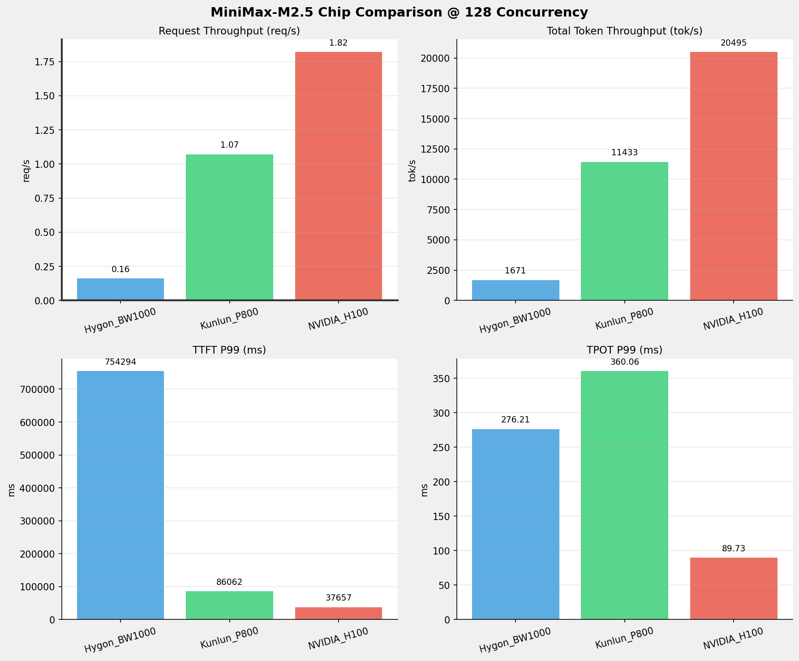
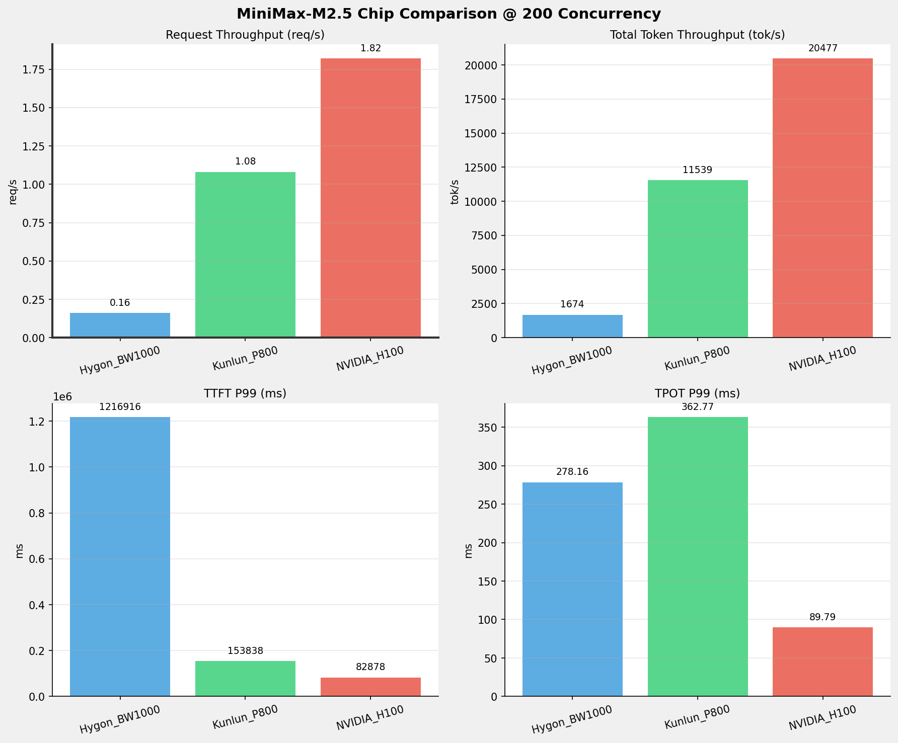
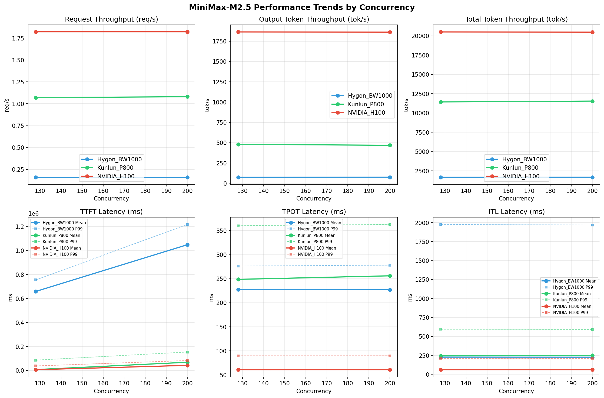

# MiniMax-M2.5模型在不同芯片下的benchmark基准测试报告

**测试日期：** 2026-03-27

---

## 测试场景
在固定请求数，输入上下文和输出上下文长度下，使用vllm bench serve工具对并发数逐级增加场景的性能基准验证。并对比同一模型在不同芯片环境上的性能指标。

**主要采集指标**：

| 指标                  | 单位         | 含义                                 |
|---------------------|------------|------------------------------------|
| TTFT                | ms         | Time To First Token，首 token 延迟     |
| TPOT                | ms/token   | Time Per Output Token，每 token 生成时间 |
| Throughput          | tokens/s   | 系统总吞吐                              |
| QPS                 | requests/s | 请求吞吐                               |
| P50/P95/P99 Latency | ms         | 延迟分位数                              |
    
## 📊 测试概览

| 项目            | 配置                                     | 备注  |
|---------------|----------------------------------------|-----|
| **数据集**       | random                                 |     |
| **并发数**       | 128, 200    |     |
| **总请求数**      | 2048                                    |     |
| **请求输入上下文长度** | 10240（10k）                             |     |
| **请求输出上下文长度** | 1024（1k）                             |     |
| **模型**        | MiniMax-M2.5                           |     |
| **被测芯片**      | Hygon_BW1000, Kunlun_P800, NVIDIA_H100 |     |

---

## 🤖 芯片和模型配置信息

| 芯片名称             | 模型精度              | vLLM版本                                         | Python版本 | 备注         |
|------------------|-------------------|------------------------------------------------|----------|------------|
| **Hygon_BW1000** | BF16 | 0.11.0+das.opt1.rc2.dtk2604.20260128.g0bf89b0c | 3.10.12 | 海光BW1000芯片 |
| **Kunlun_P800** | W8A8-INT8-Dynamic | 0.11.0 | 3.10.15 | 昆仑芯P800芯片 |
| **NVIDIA_H100** | FP16 | 0.15.1 | 3.12.3 | 英伟达H100芯片 |

---

## 🤖 vLLM启动配置信息

| 参数名称                   | **Hygon_BW1000** | **Kunlun_P800** | **NVIDIA_H100** |
|------------------------|------------------|------------------|------------------|
| max-model-len | 196608 | 196608 | 196608 |
| max-num-seqs | 10 | 10 | 10 |
| max-num-batched-tokens | 8192 | 8192 | 8192 |
| gpu-memory-utilization | 0.95 | 0.95 | 0.85 |
| dp | 1 | 1 | 1 |
| tp | 8 | 8 | 8 |
| pp | 1 | 1 | 1 |
| enable-export-parallel | True | False | True |
| tool-call-parser | minimax_m2 | minimax_m2 | minimax_m2 |
| reasoning-parser | minimax_m2 (不生效) | minimax_m2 (不生效) | minimax_m2 |

- **Hygon_BW1000**: 海光芯片专家并行配置
- **Kunlun_P800**: 昆仑芯不启用专家并行避免通信问题
- **NVIDIA_H100**: 英伟达H100标准配置

---

## 📈 各并发级别性能对比

### 128 并发

#### 服务基准结果

| 指标 | Hygon_BW1000 | Kunlun_P800 | NVIDIA_H100 |
|------|----------- | ----------- | -----------|
| 成功请求数 | 1024 | 1024 | 1024 |
| 失败请求数 |  |  | 0 |
| 测试持续时间 (s) | 6567.51 | 957.16 | 562.77 |
| 总输入 tokens | 10484271 | 10484271 | 10485760 |
| 总生成 tokens | 487750 | 458893 | 1048576 |
| **请求吞吐量 (req/s)** | 0.16 | 1.07 | **1.82** ⭐ |
| **输出 token 吞吐量 (tok/s)** | 74.27 | 479.43 | **1863.23** ⭐ |
| 峰值输出 token 吞吐量 (tok/s) | 128.00 | 1792.00 | **3517.00** ⭐ |
| 峰值并发请求数 | 130.00 | 133.00 | 133.00 |
| **总 token 吞吐量 (tok/s)** | 1670.65 | 11432.97 | **20495.48** ⭐ |

#### 首Token延迟 (TTFT)

| 指标 | Hygon_BW1000 | Kunlun_P800 | NVIDIA_H100 |
|------|----------- | ----------- | -----------|
| 平均 TTFT (ms) | 658509.95 | 7325.87 | **6331.66** ⭐ |
| 中位 TTFT (ms) | 695020.86 | **1518.51** ⭐ | 3686.47 |
| P95 TTFT (ms) | 744454.71 | 56247.06 | **25116.95** ⭐ |
| P99 TTFT (ms) | 754293.98 | 86062.46 | **37656.54** ⭐ |

#### 每Token生成时间 (TPOT)

| 指标 | Hygon_BW1000 | Kunlun_P800 | NVIDIA_H100 |
|------|----------- | ----------- | -----------|
| 平均 TPOT (ms) | 227.75 | 248.61 | **60.87** ⭐ |
| 中位 TPOT (ms) | 227.62 | 256.64 | **62.06** ⭐ |
| P95 TPOT (ms) | 253.77 | 292.34 | **62.42** ⭐ |
| P99 TPOT (ms) | 276.21 | 360.06 | **89.73** ⭐ |

#### Token间延迟 (ITL)

| 指标 | Hygon_BW1000 | Kunlun_P800 | NVIDIA_H100 |
|------|----------- | ----------- | -----------|
| 平均 ITL (ms) | 226.81 | 243.74 | **60.94** ⭐ |
| 中位 ITL (ms) | 158.25 | 77.90 | **36.52** ⭐ |
| P95 ITL (ms) | **166.21** ⭐ | 585.87 | 205.63 |
| P99 ITL (ms) | 1976.95 | 594.74 | **209.82** ⭐ |

---

### 200 并发

#### 服务基准结果

| 指标 | Hygon_BW1000 | Kunlun_P800 | NVIDIA_H100 |
|------|----------- | ----------- | -----------|
| 成功请求数 | 1024 | 1024 | 1024 |
| 失败请求数 |  |  | 0 |
| 测试持续时间 (s) | 6555.14 | 947.02 | 563.27 |
| 总输入 tokens | 10484271 | 10484271 | 10485760 |
| 总生成 tokens | 489578 | 443230 | 1048576 |
| **请求吞吐量 (req/s)** | 0.16 | 1.08 | **1.82** ⭐ |
| **输出 token 吞吐量 (tok/s)** | 74.69 | 468.03 | **1861.58** ⭐ |
| 峰值输出 token 吞吐量 (tok/s) | 127.00 | 1790.00 | **3509.00** ⭐ |
| 峰值并发请求数 | 202.00 | 206.00 | 205.00 |
| **总 token 吞吐量 (tok/s)** | 1674.08 | 11538.81 | **20477.36** ⭐ |

#### 首Token延迟 (TTFT)

| 指标 | Hygon_BW1000 | Kunlun_P800 | NVIDIA_H100 |
|------|----------- | ----------- | -----------|
| 平均 TTFT (ms) | 1047768.02 | 68541.39 | **42574.95** ⭐ |
| 中位 TTFT (ms) | 1148862.62 | 66100.68 | **56296.22** ⭐ |
| P95 TTFT (ms) | 1204092.22 | 119234.28 | **72311.10** ⭐ |
| P99 TTFT (ms) | 1216915.97 | 153837.73 | **82877.85** ⭐ |

#### 每Token生成时间 (TPOT)

| 指标 | Hygon_BW1000 | Kunlun_P800 | NVIDIA_H100 |
|------|----------- | ----------- | -----------|
| 平均 TPOT (ms) | 226.99 | 255.98 | **60.90** ⭐ |
| 中位 TPOT (ms) | 226.22 | 262.00 | **62.12** ⭐ |
| P95 TPOT (ms) | 255.35 | 315.67 | **62.46** ⭐ |
| P99 TPOT (ms) | 278.16 | 362.77 | **89.79** ⭐ |

#### Token间延迟 (ITL)

| 指标 | Hygon_BW1000 | Kunlun_P800 | NVIDIA_H100 |
|------|----------- | ----------- | -----------|
| 平均 ITL (ms) | 226.03 | 249.94 | **60.97** ⭐ |
| 中位 ITL (ms) | 158.46 | 78.23 | **36.55** ⭐ |
| P95 ITL (ms) | **165.79** ⭐ | 582.28 | 205.58 |
| P99 ITL (ms) | 1968.49 | 592.09 | **210.09** ⭐ |

---

## 📊 芯片性能柱状图

---

## 📈 性能趋势对比图 (所有芯片)

---

## 📝 分析总结

### 1. 吞吐量性能对比

**请求吞吐量 (QPS)**: 在低并发(1-4)场景下，Hygon_BW1000 表现最佳，平均 0.00 req/s；
在中并发(8-32)场景下，Hygon_BW1000 表现最佳，平均 0.00 req/s；
在高并发(64-128)场景下，NVIDIA_H100 表现最佳，平均 1.82 req/s。

**Token吞吐量**: NVIDIA_H100 在128并发时达到最高吞吐量 20495 tok/s。

### 2. 首Token延迟 (TTFT) 对比

**低并发(1-4)**: Hygon_BW1000 TTFT最优，平均 infms

**高并发(64-128)**: NVIDIA_H100 TTFT最优，平均 60267ms

⚠️ **注意**: 海光芯片在高并发下TTFT延迟显著高于其他芯片，约为NVIDIA的16倍

### 3. Token生成时间 (TPOT) 对比

**最优表现**: NVIDIA_H100 在各并发下TPOT表现最佳，128并发时仅为 89.73ms

### 4. 综合评估

**综合性能**: NVIDIA_H100 在所有测试场景中综合表现最优

### 请求吞吐量 (Request Throughput) - 各并发最优

| Concurrency | Best Chip | Performance |
|-------------|-----------|-------------|
| 128 | NVIDIA_H100 | 1.82 req/s |
| 200 | NVIDIA_H100 | 1.82 req/s |

### Token总吞吐量 (Total Token Throughput) - 各并发最优

| Concurrency | Best Chip | Performance |
|-------------|-----------|-------------|
| 128 | NVIDIA_H100 | 20495 tok/s |
| 200 | NVIDIA_H100 | 20477 tok/s |

### TTFT P99 - 各并发最优

| Concurrency | Best Chip | Latency |
|-------------|-----------|---------|
| 128 | NVIDIA_H100 | 37656.54 ms |
| 200 | NVIDIA_H100 | 82877.85 ms |

### TPOT P99 - 各并发最优

| Concurrency | Best Chip | Latency |
|-------------|-----------|---------|
| 128 | NVIDIA_H100 | 89.73 ms |
| 200 | NVIDIA_H100 | 89.79 ms |

---

*报告生成时间: 2026-03-27*

