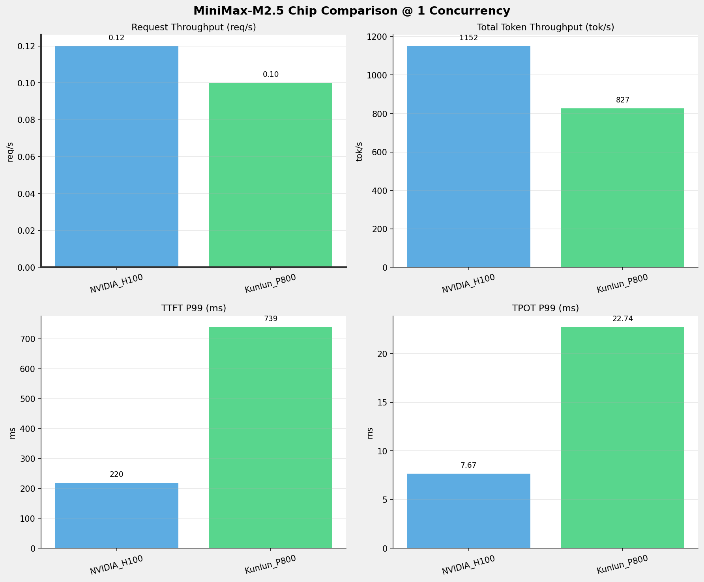
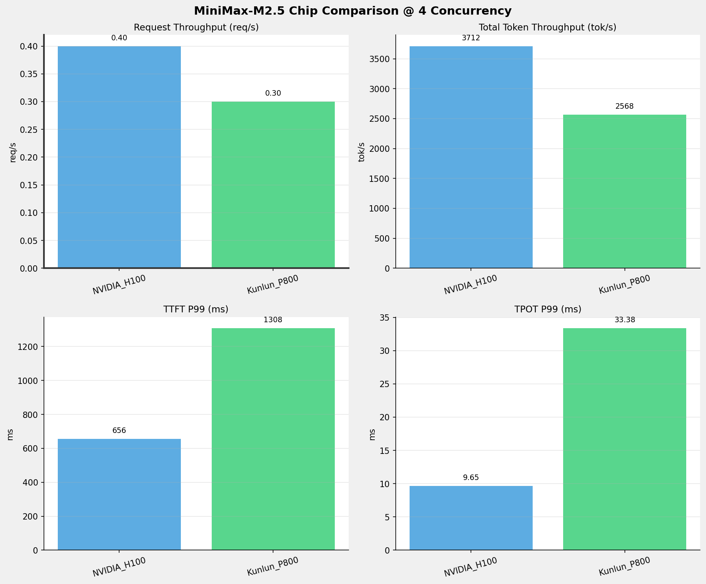
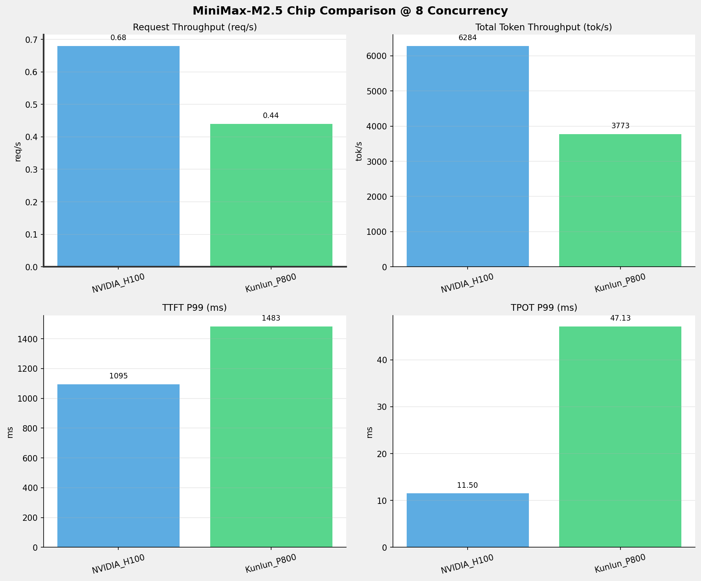
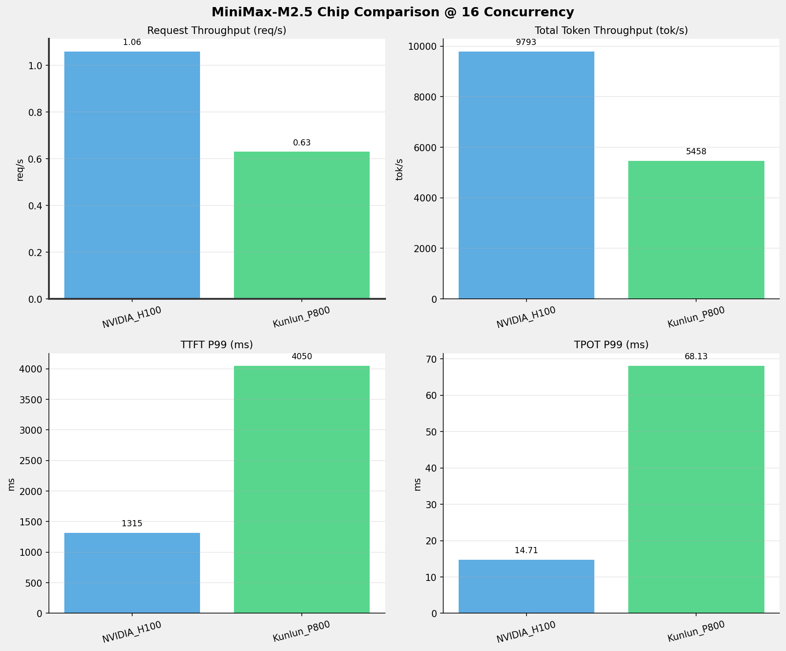
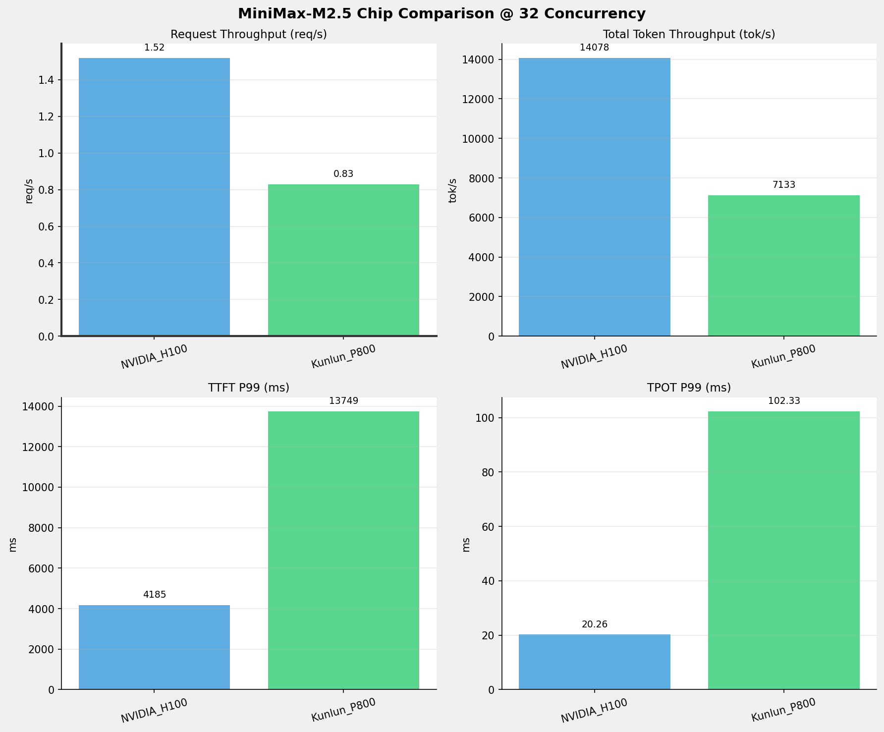
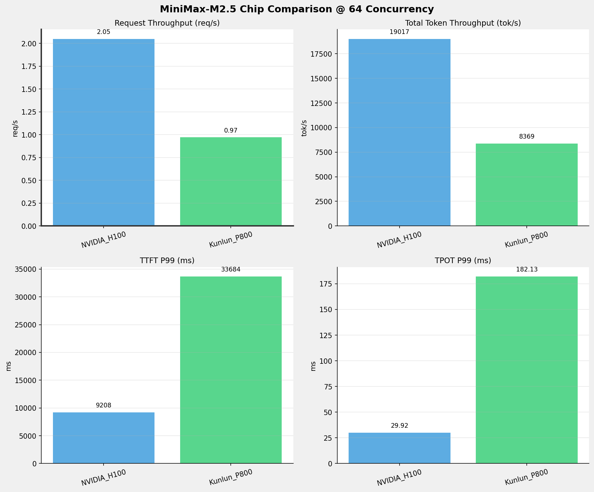
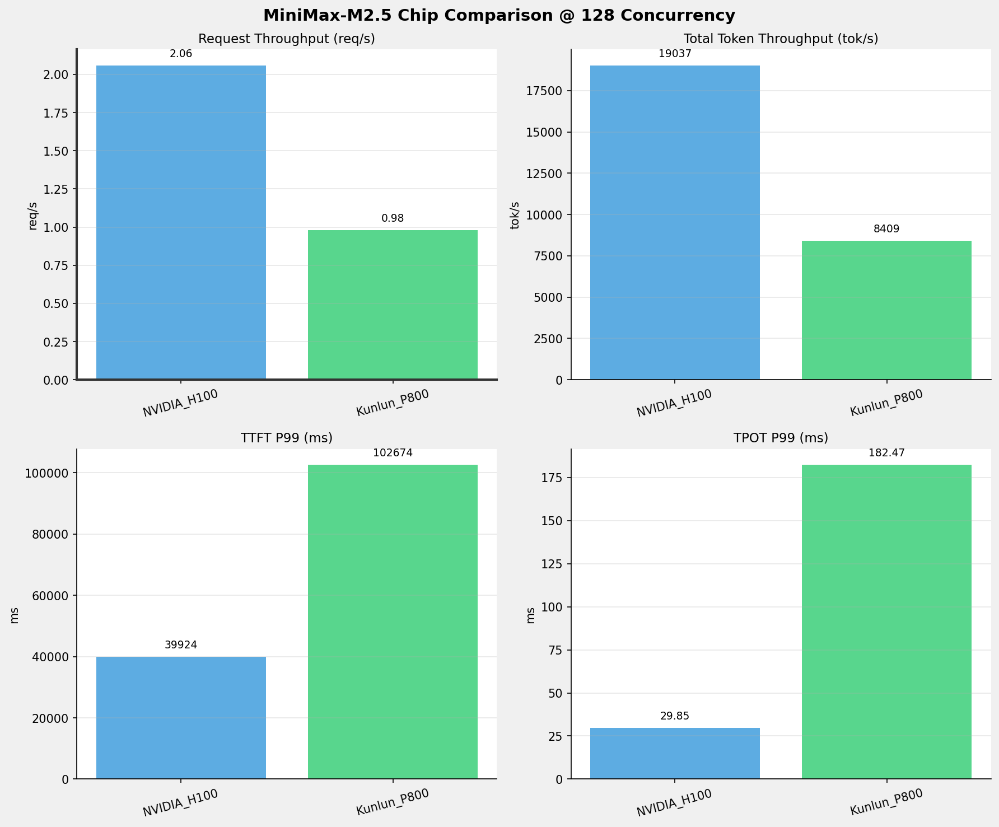
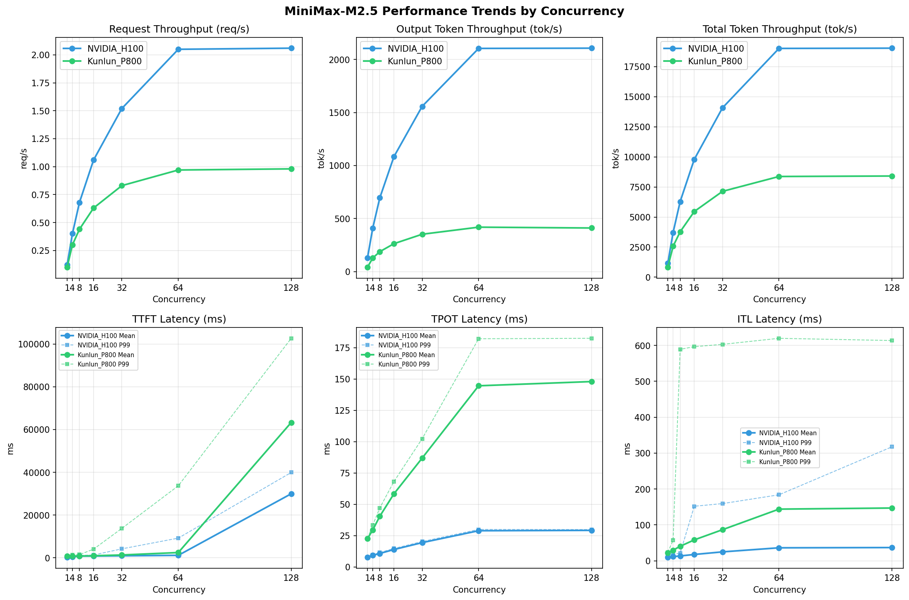

# MiniMax-M2.5模型在不同芯片下的benchmark基准测试报告

**测试日期：** 2026-05-18

---

## 测试场景
在固定请求数，输入上下文和输出上下文长度下，使用vllm bench serve工具对并发数逐级增加场景的性能基准验证。并对比同一模型在不同芯片环境上的性能指标。

**主要采集指标**：

| 指标                  | 单位         | 含义                                 |
|---------------------|------------|------------------------------------|
| TTFT                | ms         | Time To First Token，首 token 延迟     |
| TPOT                | ms/token   | Time Per Output Token，每 token 生成时间 |
| Throughput          | tokens/s   | 系统总吞吐                              |
| QPS                 | requests/s | 请求吞吐                               |
| P50/P95/P99 Latency | ms         | 延迟分位数                              |
    
### 📊 测试概览

| 项目            | 配置                                     | 备注  |
|---------------|----------------------------------------|-----|
| **数据集**       | random                                 |     |
| **并发数**       | 1, 4, 8, 16, 32, 64, 128    |     |
| **总请求数**      | 1000                                    |     |
| **请求输入上下文长度** | 8192（8k）                             |     |
| **请求输出上下文长度** | 1024（1k）                             |     |
| **被测芯片**      | NVIDIA_H100, Kunlun_P800 |     |
| **被测模型**      | MiniMax-M2.5 |     |

---

### 🤖 芯片和模型配置信息

| 参数名称 | **NVIDIA_H100** | **Kunlun_P800** |
|----------|----------|----------|
| **max_position_embeddings** | 196608 | 196608 |
| **model_name** | MiniMax-M2.5 | MiniMax-M2.5-W8A8-INT8-Dynamic |
| **model_size** | 215G | 215G |
| **python_version** | 3.12.3 | 3.10.15 |
| **quantization_config** | FP16 | int-8 |
| **temperature** | N/A | 1.0 |
| **top_k** | N/A | 40 |
| **top_p** | N/A | 0.95 |
| **transformers_version** | 4.46.1 | 4.46.1 |
| **vllm_version** | 0.15.1 | 0.11.0 |

---

### ⚙️ vLLM启动配置信息

| 参数名称 | **NVIDIA_H100** | **Kunlun_P800** |
|----------|----------|----------|
| **Block Size** | default | 128 |
| **Compilation Config** | N/A | {"splitting_ops":["vllm.unified_attention","vllm.unified_attention_with_output","vllm.unified_attention_with_output_kunlun","vllm.mamba_mixer2","vllm.mamba_mixer","vllm.short_conv","vllm.linear_attention","vllm.plamo2_mamba_mixer","vllm.gdn_attention","vllm.sparse_attn_indexer","vllm.sparse_attn_indexer_vllm_kunlun"]} |
| **Dp** | 1 | 1 |
| **Dtype** | default | auto |
| **Enable Auto Tool Choice** | True | True |
| **Enable Export Parallel** | True | False |
| **Gpu Memory Utilization** | 0.85 | 0.95 |
| **Max Model Len** | 196608 | 196608 |
| **Max Num Batched Tokens** | 8192 | 8192 |
| **Max Num Seqs** | 10 | 64 |
| **Model Name** | MiniMax-M2.5 | MiniMax-M2.5-W8A8-INT8-Dynamic |
| **Pp** | 1 | 1 |
| **Reasoning Parser** | minimax_m2 | minimax_m2 (不生效) |
| **Tool Call Parser** | minimax_m2 | minimax_m2 |
| **Tp** | 8 | 8 |

- **NVIDIA_H100**: 英伟达H100标准配置
- **Kunlun_P800**: 昆仑芯不启用专家并行避免通信问题

---

### 📊 芯片性能对比柱状图

**1并发**

**4并发**

**8并发**

**16并发**

**32并发**

**64并发**

**128并发**

### 📈 性能趋势对比图 (所有芯片)

---

### 📈 各指标随并发级别性能对比详情

#### 请求吞吐量（Request throughput (req/s)）

| 并发数 | NVIDIA_H100 | Kunlun_P800 | 差值 | 百分比 |
|-----|----------- | ----------- | ----------- | -----------|
| 1   | 0.12 | 0.10 | -0.02 | -16.7% |
| 4   | 0.40 | 0.30 | -0.10 | -25.0% |
| 8   | 0.68 | 0.44 | -0.24 | -35.3% |
| 16   | 1.06 | 0.63 | -0.43 | -40.6% |
| 32   | 1.52 | 0.83 | -0.69 | -45.4% |
| 64   | 2.05 | 0.97 | -1.08 | -52.7% |
| 128   | 2.06 | 0.98 | -1.08 | -52.4% |

#### 输出token吞吐量（Output token throughput (tok/s)）

| 并发数 | NVIDIA_H100 | Kunlun_P800 | 差值 | 百分比 |
|-----|----------- | ----------- | ----------- | -----------|
| 1   | 127.41 | 41.23 | -86.18 | -67.6% |
| 4   | 410.74 | 128.01 | -282.73 | -68.8% |
| 8   | 695.31 | 187.92 | -507.39 | -73.0% |
| 16   | 1083.50 | 263.08 | -820.42 | -75.7% |
| 32   | 1557.65 | 352.07 | -1205.58 | -77.4% |
| 64   | 2104.06 | 418.85 | -1685.21 | -80.1% |
| 128   | 2106.36 | 411.01 | -1695.35 | -80.5% |

#### 总token吞吐量（Total token throughput (tok/s)）

| 并发数 | NVIDIA_H100 | Kunlun_P800 | 差值 | 百分比 |
|-----|----------- | ----------- | ----------- | -----------|
| 1   | 1151.56 | 826.58 | -324.98 | -28.2% |
| 4   | 3712.34 | 2567.54 | -1144.80 | -30.8% |
| 8   | 6284.28 | 3772.55 | -2511.73 | -40.0% |
| 16   | 9792.79 | 5457.67 | -4335.12 | -44.3% |
| 32   | 14078.15 | 7133.48 | -6944.67 | -49.3% |
| 64   | 19016.63 | 8369.48 | -10647.15 | -56.0% |
| 128   | 19037.48 | 8408.86 | -10628.62 | -55.8% |

#### 首token延迟（P99 TTFT (ms)）

| 并发数 | NVIDIA_H100 | Kunlun_P800 | 差值 | 百分比 |
|-----|----------- | ----------- | ----------- | -----------|
| 1   | 219.81 | 739.49 | +519.68 | +236.4% |
| 4   | 656.13 | 1308.30 | +652.17 | +99.4% |
| 8   | 1095.11 | 1482.68 | +387.57 | +35.4% |
| 16   | 1314.68 | 4050.05 | +2735.37 | +208.1% |
| 32   | 4184.75 | 13748.61 | +9563.86 | +228.5% |
| 64   | 9208.08 | 33683.94 | +24475.86 | +265.8% |
| 128   | 39923.84 | 102674.50 | +62750.66 | +157.2% |

#### 每token生成时间（P99 TPOT (ms)）

| 并发数 | NVIDIA_H100 | Kunlun_P800 | 差值 | 百分比 |
|-----|----------- | ----------- | ----------- | -----------|
| 1   | 7.67 | 22.74 | +15.07 | +196.5% |
| 4   | 9.65 | 33.38 | +23.73 | +245.9% |
| 8   | 11.50 | 47.13 | +35.63 | +309.8% |
| 16   | 14.71 | 68.13 | +53.42 | +363.2% |
| 32   | 20.26 | 102.33 | +82.07 | +405.1% |
| 64   | 29.92 | 182.13 | +152.21 | +508.7% |
| 128   | 29.85 | 182.47 | +152.62 | +511.3% |

#### token间延迟（P99 ITL (ms)）

| 并发数 | NVIDIA_H100 | Kunlun_P800 | 差值 | 百分比 |
|-----|----------- | ----------- | ----------- | -----------|
| 1   | 15.53 | 23.28 | +7.75 | +49.9% |
| 4   | 18.64 | 57.84 | +39.20 | +210.3% |
| 8   | 21.33 | 588.96 | +567.63 | +2661.2% |
| 16   | 152.01 | 596.39 | +444.38 | +292.3% |
| 32   | 159.35 | 602.78 | +443.43 | +278.3% |
| 64   | 183.86 | 619.65 | +435.79 | +237.0% |
| 128   | 317.44 | 613.45 | +296.01 | +93.2% |

### 📈 各并发级别性能对比详情

### 1 并发

#### 服务基准结果

| 指标 | NVIDIA_H100 | Kunlun_P800 |
|------|----------- | -----------|
| 成功请求数 | 1000 | 1000 |
| 失败请求数 | 0 | 0 |
| 测试持续时间 (s) | 8036.89 | 10428.26 |
| 总输入 tokens | 8231000 | 8189832 |
| 总生成 tokens | 1024000 | 430008 |
| **请求吞吐量 (req/s)** | **0.12** ⭐ | 0.10 |
| **输出 token 吞吐量 (tok/s)** | **127.41** ⭐ | 41.23 |
| 峰值输出 token 吞吐量 (tok/s) | **133.00** ⭐ | 46.00 |
| 峰值并发请求数 | 2.00 | 2.00 |
| **总 token 吞吐量 (tok/s)** | **1151.56** ⭐ | 826.58 |

#### 首Token延迟 (TTFT)

| 指标 | NVIDIA_H100 | Kunlun_P800 |
|------|----------- | -----------|
| 平均 TTFT (ms) | **207.63** ⭐ | 718.44 |
| 中位 TTFT (ms) | **208.15** ⭐ | 724.03 |
| P95 TTFT (ms) | **215.72** ⭐ | 735.34 |
| P99 TTFT (ms) | **219.81** ⭐ | 739.49 |

#### 每Token生成时间 (TPOT)

| 指标 | NVIDIA_H100 | Kunlun_P800 |
|------|----------- | -----------|
| 平均 TPOT (ms) | **7.65** ⭐ | 22.61 |
| 中位 TPOT (ms) | **7.65** ⭐ | 22.61 |
| P95 TPOT (ms) | **7.67** ⭐ | 22.70 |
| P99 TPOT (ms) | **7.67** ⭐ | 22.74 |

#### Token间延迟 (ITL)

| 指标 | NVIDIA_H100 | Kunlun_P800 |
|------|----------- | -----------|
| 平均 ITL (ms) | **9.67** ⭐ | 22.63 |
| 中位 ITL (ms) | **7.67** ⭐ | 22.61 |
| P95 ITL (ms) | **15.38** ⭐ | 22.87 |
| P99 ITL (ms) | **15.53** ⭐ | 23.28 |

---

### 4 并发

#### 服务基准结果

| 指标 | NVIDIA_H100 | Kunlun_P800 |
|------|----------- | -----------|
| 成功请求数 | 1000 | 1000 |
| 失败请求数 | 0 | 0 |
| 测试持续时间 (s) | 2493.04 | 3357.13 |
| 总输入 tokens | 8231000 | 8189832 |
| 总生成 tokens | 1024000 | 429742 |
| **请求吞吐量 (req/s)** | **0.40** ⭐ | 0.30 |
| **输出 token 吞吐量 (tok/s)** | **410.74** ⭐ | 128.01 |
| 峰值输出 token 吞吐量 (tok/s) | **440.00** ⭐ | 161.00 |
| 峰值并发请求数 | 8.00 | 6.00 |
| **总 token 吞吐量 (tok/s)** | **3712.34** ⭐ | 2567.54 |

#### 首Token延迟 (TTFT)

| 指标 | NVIDIA_H100 | Kunlun_P800 |
|------|----------- | -----------|
| 平均 TTFT (ms) | **500.30** ⭐ | 775.20 |
| 中位 TTFT (ms) | **512.44** ⭐ | 737.69 |
| P95 TTFT (ms) | **651.75** ⭐ | 1269.62 |
| P99 TTFT (ms) | **656.13** ⭐ | 1308.30 |

#### 每Token生成时间 (TPOT)

| 指标 | NVIDIA_H100 | Kunlun_P800 |
|------|----------- | -----------|
| 平均 TPOT (ms) | **9.26** ⭐ | 29.45 |
| 中位 TPOT (ms) | **9.21** ⭐ | 29.41 |
| P95 TPOT (ms) | **9.62** ⭐ | 32.00 |
| P99 TPOT (ms) | **9.65** ⭐ | 33.38 |

#### Token间延迟 (ITL)

| 指标 | NVIDIA_H100 | Kunlun_P800 |
|------|----------- | -----------|
| 平均 ITL (ms) | **11.75** ⭐ | 29.64 |
| 中位 ITL (ms) | **9.22** ⭐ | 25.45 |
| P95 ITL (ms) | **18.42** ⭐ | 25.90 |
| P99 ITL (ms) | **18.64** ⭐ | 57.84 |

---

### 8 并发

#### 服务基准结果

| 指标 | NVIDIA_H100 | Kunlun_P800 |
|------|----------- | -----------|
| 成功请求数 | 1000 | 1000 |
| 失败请求数 | 0 | 0 |
| 测试持续时间 (s) | 1472.72 | 2284.71 |
| 总输入 tokens | 8231000 | 8189832 |
| 总生成 tokens | 1024000 | 429340 |
| **请求吞吐量 (req/s)** | **0.68** ⭐ | 0.44 |
| **输出 token 吞吐量 (tok/s)** | **695.31** ⭐ | 187.92 |
| 峰值输出 token 吞吐量 (tok/s) | **777.00** ⭐ | 264.00 |
| 峰值并发请求数 | 16.00 | 11.00 |
| **总 token 吞吐量 (tok/s)** | **6284.28** ⭐ | 3772.55 |

#### 首Token延迟 (TTFT)

| 指标 | NVIDIA_H100 | Kunlun_P800 |
|------|----------- | -----------|
| 平均 TTFT (ms) | **771.22** ⭐ | 831.83 |
| 中位 TTFT (ms) | 798.01 | **761.01** ⭐ |
| P95 TTFT (ms) | **1082.72** ⭐ | 1306.60 |
| P99 TTFT (ms) | **1095.11** ⭐ | 1482.68 |

#### 每Token生成时间 (TPOT)

| 指标 | NVIDIA_H100 | Kunlun_P800 |
|------|----------- | -----------|
| 平均 TPOT (ms) | **10.76** ⭐ | 40.48 |
| 中位 TPOT (ms) | **10.72** ⭐ | 40.47 |
| P95 TPOT (ms) | **11.32** ⭐ | 44.71 |
| P99 TPOT (ms) | **11.50** ⭐ | 47.13 |

#### Token间延迟 (ITL)

| 指标 | NVIDIA_H100 | Kunlun_P800 |
|------|----------- | -----------|
| 平均 ITL (ms) | **13.60** ⭐ | 40.47 |
| 中位 ITL (ms) | **10.49** ⭐ | 31.33 |
| P95 ITL (ms) | **20.85** ⭐ | 34.92 |
| P99 ITL (ms) | **21.33** ⭐ | 588.96 |

---

### 16 并发

#### 服务基准结果

| 指标 | NVIDIA_H100 | Kunlun_P800 |
|------|----------- | -----------|
| 成功请求数 | 1000 | 1000 |
| 失败请求数 | 0 | 0 |
| 测试持续时间 (s) | 945.08 | 1576.61 |
| 总输入 tokens | 8231000 | 8189832 |
| 总生成 tokens | 1024000 | 414780 |
| **请求吞吐量 (req/s)** | **1.06** ⭐ | 0.63 |
| **输出 token 吞吐量 (tok/s)** | **1083.50** ⭐ | 263.08 |
| 峰值输出 token 吞吐量 (tok/s) | **1294.00** ⭐ | 432.00 |
| 峰值并发请求数 | 28.00 | 19.00 |
| **总 token 吞吐量 (tok/s)** | **9792.79** ⭐ | 5457.67 |

#### 首Token延迟 (TTFT)

| 指标 | NVIDIA_H100 | Kunlun_P800 |
|------|----------- | -----------|
| 平均 TTFT (ms) | **811.15** ⭐ | 956.62 |
| 中位 TTFT (ms) | 922.18 | **763.25** ⭐ |
| P95 TTFT (ms) | **1095.33** ⭐ | 1345.55 |
| P99 TTFT (ms) | **1314.68** ⭐ | 4050.05 |

#### 每Token生成时间 (TPOT)

| 指标 | NVIDIA_H100 | Kunlun_P800 |
|------|----------- | -----------|
| 平均 TPOT (ms) | **13.90** ⭐ | 58.34 |
| 中位 TPOT (ms) | **13.89** ⭐ | 58.33 |
| P95 TPOT (ms) | **14.52** ⭐ | 64.75 |
| P99 TPOT (ms) | **14.71** ⭐ | 68.13 |

#### Token间延迟 (ITL)

| 指标 | NVIDIA_H100 | Kunlun_P800 |
|------|----------- | -----------|
| 平均 ITL (ms) | **17.68** ⭐ | 58.31 |
| 中位 ITL (ms) | **12.66** ⭐ | 38.20 |
| P95 ITL (ms) | **25.19** ⭐ | 58.79 |
| P99 ITL (ms) | **152.01** ⭐ | 596.39 |

---

### 32 并发

#### 服务基准结果

| 指标 | NVIDIA_H100 | Kunlun_P800 |
|------|----------- | -----------|
| 成功请求数 | 1000 | 1000 |
| 失败请求数 | 0 | 0 |
| 测试持续时间 (s) | 657.40 | 1207.69 |
| 总输入 tokens | 8231000 | 8189832 |
| 总生成 tokens | 1024000 | 425192 |
| **请求吞吐量 (req/s)** | **1.52** ⭐ | 0.83 |
| **输出 token 吞吐量 (tok/s)** | **1557.65** ⭐ | 352.07 |
| 峰值输出 token 吞吐量 (tok/s) | **2016.00** ⭐ | 736.00 |
| 峰值并发请求数 | 43.00 | 36.00 |
| **总 token 吞吐量 (tok/s)** | **14078.15** ⭐ | 7133.48 |

#### 首Token延迟 (TTFT)

| 指标 | NVIDIA_H100 | Kunlun_P800 |
|------|----------- | -----------|
| 平均 TTFT (ms) | **932.96** ⭐ | 1323.88 |
| 中位 TTFT (ms) | 944.24 | **803.93** ⭐ |
| P95 TTFT (ms) | **1107.73** ⭐ | 1936.13 |
| P99 TTFT (ms) | **4184.75** ⭐ | 13748.61 |

#### 每Token生成时间 (TPOT)

| 指标 | NVIDIA_H100 | Kunlun_P800 |
|------|----------- | -----------|
| 平均 TPOT (ms) | **19.40** ⭐ | 86.88 |
| 中位 TPOT (ms) | **19.48** ⭐ | 87.55 |
| P95 TPOT (ms) | **19.99** ⭐ | 96.66 |
| P99 TPOT (ms) | **20.26** ⭐ | 102.33 |

#### Token间延迟 (ITL)

| 指标 | NVIDIA_H100 | Kunlun_P800 |
|------|----------- | -----------|
| 平均 ITL (ms) | **24.93** ⭐ | 86.70 |
| 中位 ITL (ms) | **16.18** ⭐ | 46.01 |
| P95 ITL (ms) | **32.38** ⭐ | 597.01 |
| P99 ITL (ms) | **159.35** ⭐ | 602.78 |

---

### 64 并发

#### 服务基准结果

| 指标 | NVIDIA_H100 | Kunlun_P800 |
|------|----------- | -----------|
| 成功请求数 | 1000 | 1000 |
| 失败请求数 | 0 | 0 |
| 测试持续时间 (s) | 486.68 | 1030.09 |
| 总输入 tokens | 8231000 | 8189832 |
| 总生成 tokens | 1024000 | 431450 |
| **请求吞吐量 (req/s)** | **2.05** ⭐ | 0.97 |
| **输出 token 吞吐量 (tok/s)** | **2104.06** ⭐ | 418.85 |
| 峰值输出 token 吞吐量 (tok/s) | **3057.00** ⭐ | 1088.00 |
| 峰值并发请求数 | 74.00 | 69.00 |
| **总 token 吞吐量 (tok/s)** | **19016.63** ⭐ | 8369.48 |

#### 首Token延迟 (TTFT)

| 指标 | NVIDIA_H100 | Kunlun_P800 |
|------|----------- | -----------|
| 平均 TTFT (ms) | **1148.19** ⭐ | 2447.36 |
| 中位 TTFT (ms) | **804.66** ⭐ | 1333.78 |
| P95 TTFT (ms) | **3057.72** ⭐ | 9674.11 |
| P99 TTFT (ms) | **9208.08** ⭐ | 33683.94 |

#### 每Token生成时间 (TPOT)

| 指标 | NVIDIA_H100 | Kunlun_P800 |
|------|----------- | -----------|
| 平均 TPOT (ms) | **28.90** ⭐ | 144.58 |
| 中位 TPOT (ms) | **29.30** ⭐ | 146.43 |
| P95 TPOT (ms) | **29.73** ⭐ | 162.33 |
| P99 TPOT (ms) | **29.92** ⭐ | 182.13 |

#### Token间延迟 (ITL)

| 指标 | NVIDIA_H100 | Kunlun_P800 |
|------|----------- | -----------|
| 平均 ITL (ms) | **36.26** ⭐ | 143.96 |
| 中位 ITL (ms) | **21.50** ⭐ | 61.77 |
| P95 ITL (ms) | **156.98** ⭐ | 615.21 |
| P99 ITL (ms) | **183.86** ⭐ | 619.65 |

---

### 128 并发

#### 服务基准结果

| 指标 | NVIDIA_H100 | Kunlun_P800 |
|------|----------- | -----------|
| 成功请求数 | 1000 | 1000 |
| 失败请求数 | 0 | 0 |
| 测试持续时间 (s) | 486.15 | 1024.00 |
| 总输入 tokens | 8231000 | 8189832 |
| 总生成 tokens | 1024000 | 420876 |
| **请求吞吐量 (req/s)** | **2.06** ⭐ | 0.98 |
| **输出 token 吞吐量 (tok/s)** | **2106.36** ⭐ | 411.01 |
| 峰值输出 token 吞吐量 (tok/s) | **3049.00** ⭐ | 1088.00 |
| 峰值并发请求数 | 135.00 | 131.00 |
| **总 token 吞吐量 (tok/s)** | **19037.48** ⭐ | 8408.86 |

#### 首Token延迟 (TTFT)

| 指标 | NVIDIA_H100 | Kunlun_P800 |
|------|----------- | -----------|
| 平均 TTFT (ms) | **29955.02** ⭐ | 63310.90 |
| 中位 TTFT (ms) | **31296.38** ⭐ | 65051.83 |
| P95 TTFT (ms) | **33523.35** ⭐ | 68975.45 |
| P99 TTFT (ms) | **39923.84** ⭐ | 102674.50 |

#### 每Token生成时间 (TPOT)

| 指标 | NVIDIA_H100 | Kunlun_P800 |
|------|----------- | -----------|
| 平均 TPOT (ms) | **29.18** ⭐ | 147.95 |
| 中位 TPOT (ms) | **29.65** ⭐ | 150.41 |
| P95 TPOT (ms) | **29.76** ⭐ | 165.15 |
| P99 TPOT (ms) | **29.85** ⭐ | 182.47 |

#### Token间延迟 (ITL)

| 指标 | NVIDIA_H100 | Kunlun_P800 |
|------|----------- | -----------|
| 平均 ITL (ms) | **36.96** ⭐ | 147.04 |
| 中位 ITL (ms) | **21.49** ⭐ | 61.77 |
| P95 ITL (ms) | **158.32** ⭐ | 610.11 |
| P99 ITL (ms) | **317.44** ⭐ | 613.45 |

---

---

*报告生成时间: 2026-05-18*

