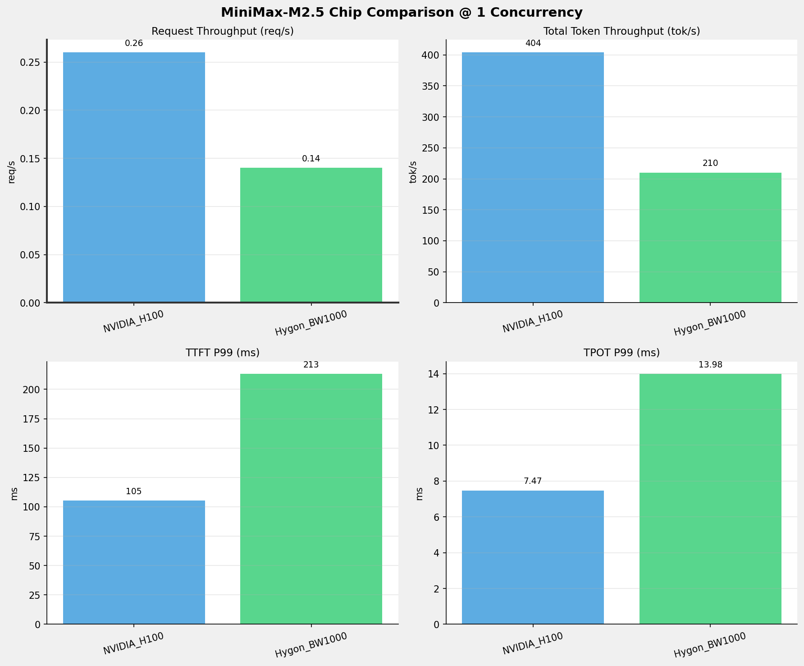
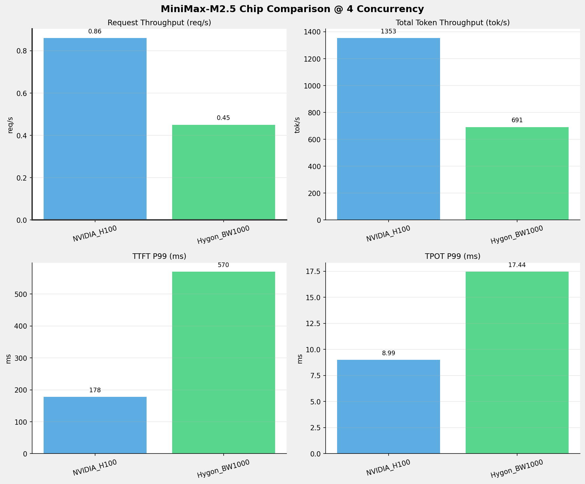
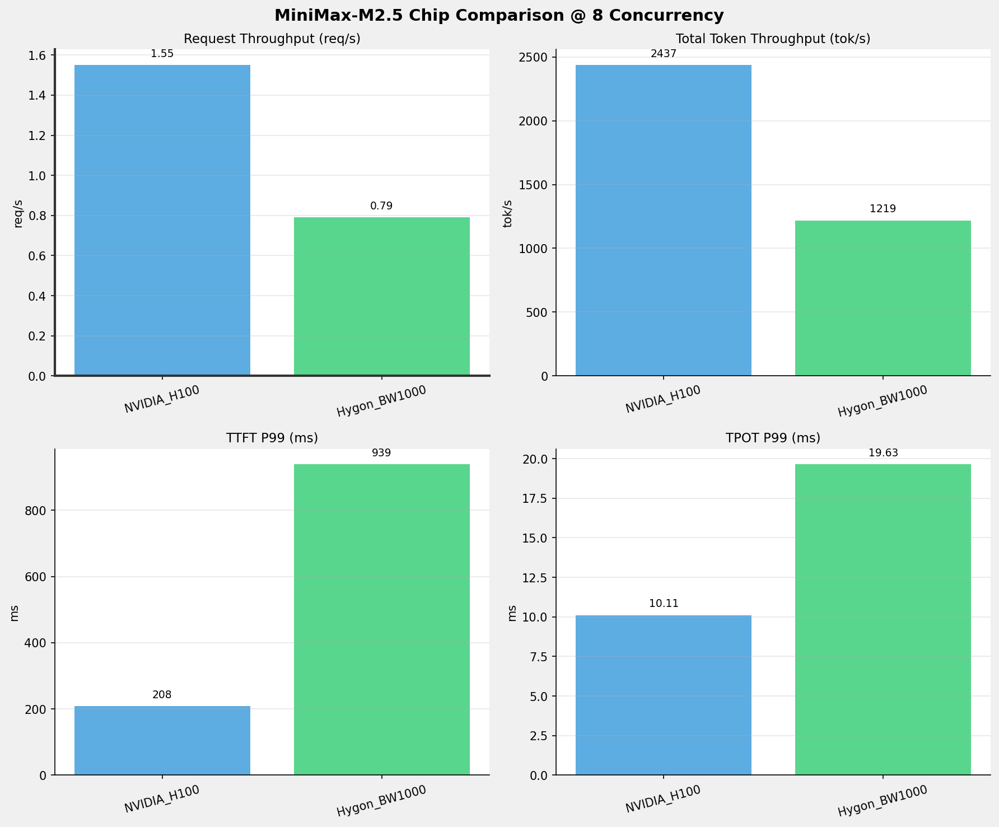
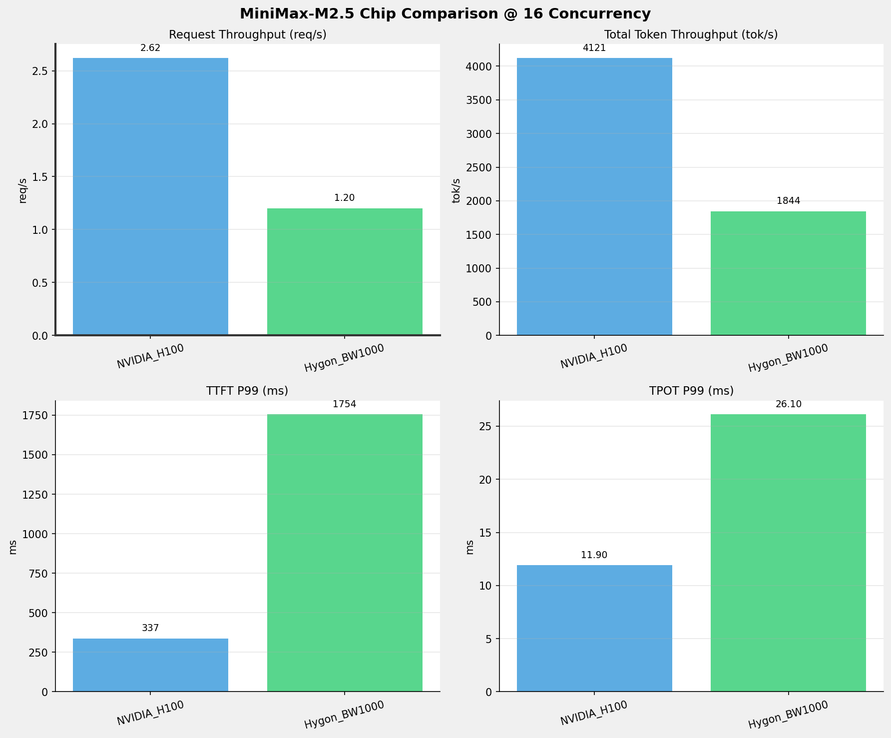
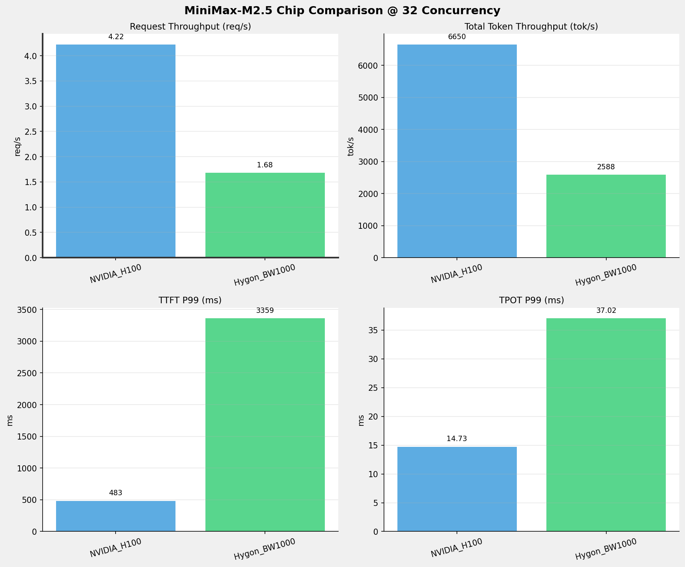
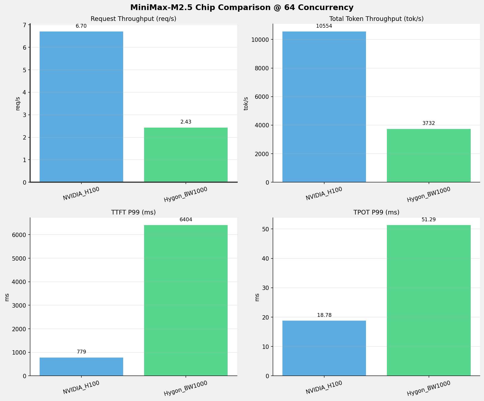
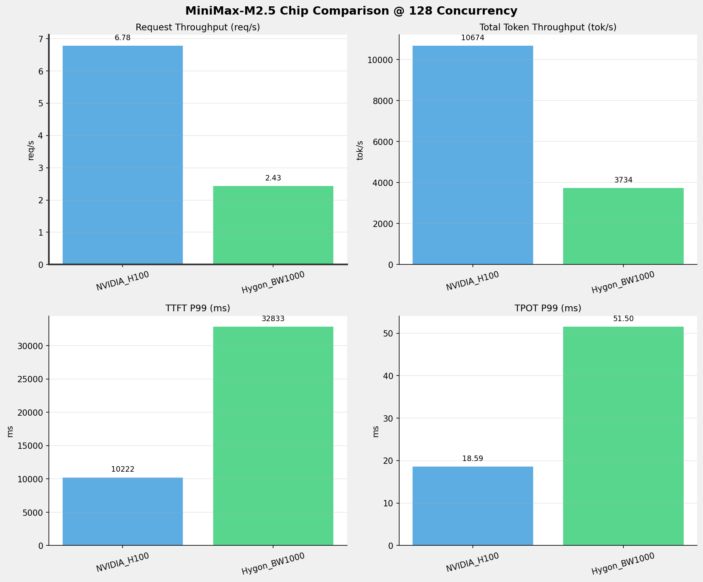
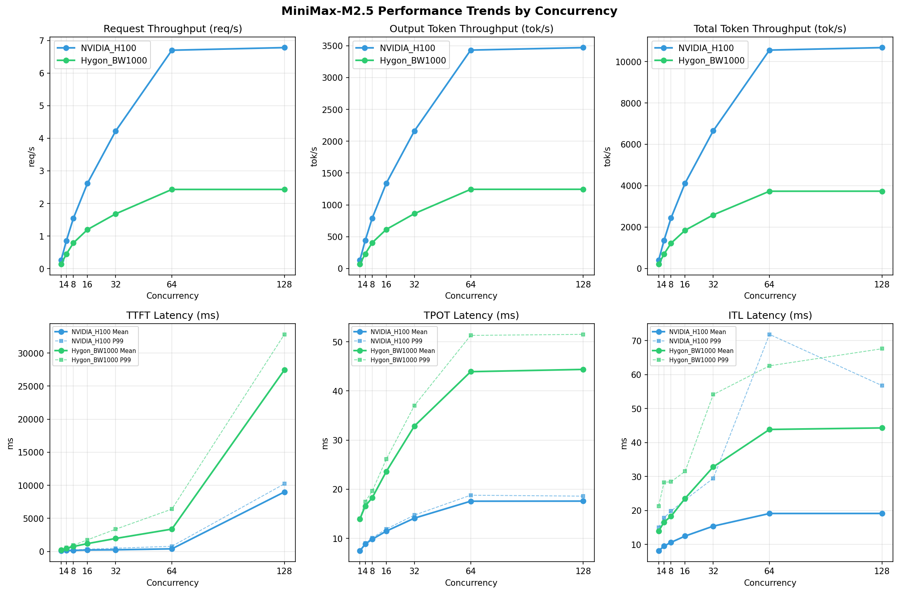

# MiniMax-M2.5模型在不同芯片下的benchmark基准测试报告

**测试日期：** 2026-05-19

---

## 测试场景
在固定请求数，输入上下文和输出上下文长度下，使用vllm bench serve工具对并发数逐级增加场景的性能基准验证。并对比同一模型在不同芯片环境上的性能指标。

**主要采集指标**：

| 指标                  | 单位         | 含义                                 |
|---------------------|------------|------------------------------------|
| TTFT                | ms         | Time To First Token，首 token 延迟     |
| TPOT                | ms/token   | Time Per Output Token，每 token 生成时间 |
| Throughput          | tokens/s   | 系统总吞吐                              |
| QPS                 | requests/s | 请求吞吐                               |
| P50/P95/P99 Latency | ms         | 延迟分位数                              |
    
### 📊 测试概览

| 项目            | 配置                                     | 备注  |
|---------------|----------------------------------------|-----|
| **数据集**       | random                                 |     |
| **并发数**       | 1, 4, 8, 16, 32, 64, 128    |     |
| **总请求数**      | 1000                                    |     |
| **请求输入上下文长度** | 1024（1k）                             |     |
| **请求输出上下文长度** | 512（0.50k）                             |     |
| **被测芯片**      | NVIDIA_H100, Hygon_BW1000 |     |
| **被测模型**      | MiniMax-M2.5 |     |

---

### 🤖 芯片和模型配置信息

| 参数名称 | **NVIDIA_H100** | **Hygon_BW1000** |
|----------|----------|----------|
| **max_position_embeddings** | 196608 | 196608 |
| **model_name** | MiniMax-M2.5 | MiniMax-M2.5-W8A8 |
| **model_size** | 215G | 215G |
| **python_version** | 3.12.3 | 3.10.12 |
| **quantization_config** | FP16 | int-8 |
| **temperature** | N/A | N/A |
| **top_k** | N/A | N/A |
| **top_p** | N/A | N/A |
| **transformers_version** | 4.46.1 | 4.57.6 |
| **vllm_version** | 0.15.1 | 0.15.1+das.opt1.alpha.dtk2604 |

---

### ⚙️ vLLM启动配置信息

| 参数名称 | **NVIDIA_H100** | **Hygon_BW1000** |
|----------|----------|----------|
| **Block Size** | default | default |
| **Compilation Config** | N/A | N/A |
| **Dp** | 1 | 1 |
| **Dtype** | default | bfloat16 |
| **Enable Auto Tool Choice** | True | True |
| **Enable Export Parallel** | True | True |
| **Gpu Memory Utilization** | 0.85 | 0.9 |
| **Max Model Len** | 196608 | 196608 |
| **Max Num Batched Tokens** | 8192 | default |
| **Max Num Seqs** | 10 | 64 |
| **Model Name** | MiniMax-M2.5 | MiniMax-M2.5-W8A8 |
| **Pp** | 1 | 1 |
| **Reasoning Parser** | minimax_m2 | minimax_m2 (不生效) |
| **Tool Call Parser** | minimax_m2 | minimax_m2 |
| **Tp** | 8 | 8 |

- **NVIDIA_H100**: 英伟达H100标准配置
- **Hygon_BW1000**: 海光芯片专家并行配置

---

### 📊 芯片性能对比柱状图

**1并发**

**4并发**

**8并发**

**16并发**

**32并发**

**64并发**

**128并发**

### 📈 性能趋势对比图 (所有芯片)

---

### 📈 各指标随并发级别性能对比详情

#### 请求吞吐量（Request throughput (req/s)）

| 并发数 | NVIDIA_H100 | Hygon_BW1000 | 差值 | 百分比 |
|-----|----------- | ----------- | ----------- | -----------|
| 1   | 0.26 | 0.14 | -0.12 | -46.2% |
| 4   | 0.86 | 0.45 | -0.41 | -47.7% |
| 8   | 1.55 | 0.79 | -0.76 | -49.0% |
| 16   | 2.62 | 1.20 | -1.42 | -54.2% |
| 32   | 4.22 | 1.68 | -2.54 | -60.2% |
| 64   | 6.70 | 2.43 | -4.27 | -63.7% |
| 128   | 6.78 | 2.43 | -4.35 | -64.2% |

#### 输出token吞吐量（Output token throughput (tok/s)）

| 并发数 | NVIDIA_H100 | Hygon_BW1000 | 差值 | 百分比 |
|-----|----------- | ----------- | ----------- | -----------|
| 1   | 131.35 | 69.93 | -61.42 | -46.8% |
| 4   | 439.84 | 230.19 | -209.65 | -47.7% |
| 8   | 792.15 | 406.35 | -385.80 | -48.7% |
| 16   | 1339.60 | 614.78 | -724.82 | -54.1% |
| 32   | 2161.89 | 862.58 | -1299.31 | -60.1% |
| 64   | 3430.95 | 1244.14 | -2186.81 | -63.7% |
| 128   | 3469.97 | 1244.78 | -2225.19 | -64.1% |

#### 总token吞吐量（Total token throughput (tok/s)）

| 并发数 | NVIDIA_H100 | Hygon_BW1000 | 差值 | 百分比 |
|-----|----------- | ----------- | ----------- | -----------|
| 1   | 404.06 | 209.80 | -194.26 | -48.1% |
| 4   | 1353.02 | 690.57 | -662.45 | -49.0% |
| 8   | 2436.78 | 1219.06 | -1217.72 | -50.0% |
| 16   | 4120.83 | 1844.34 | -2276.49 | -55.2% |
| 32   | 6650.35 | 2587.73 | -4062.62 | -61.1% |
| 64   | 10554.20 | 3732.41 | -6821.79 | -64.6% |
| 128   | 10674.24 | 3734.35 | -6939.89 | -65.0% |

#### 首token延迟（P99 TTFT (ms)）

| 并发数 | NVIDIA_H100 | Hygon_BW1000 | 差值 | 百分比 |
|-----|----------- | ----------- | ----------- | -----------|
| 1   | 105.19 | 213.04 | +107.85 | +102.5% |
| 4   | 177.82 | 569.68 | +391.86 | +220.4% |
| 8   | 208.22 | 938.55 | +730.33 | +350.7% |
| 16   | 337.29 | 1754.29 | +1417.00 | +420.1% |
| 32   | 483.29 | 3358.71 | +2875.42 | +595.0% |
| 64   | 779.16 | 6403.94 | +5624.78 | +721.9% |
| 128   | 10222.45 | 32833.25 | +22610.80 | +221.2% |

#### 每token生成时间（P99 TPOT (ms)）

| 并发数 | NVIDIA_H100 | Hygon_BW1000 | 差值 | 百分比 |
|-----|----------- | ----------- | ----------- | -----------|
| 1   | 7.47 | 13.98 | +6.51 | +87.1% |
| 4   | 8.99 | 17.44 | +8.45 | +94.0% |
| 8   | 10.11 | 19.63 | +9.52 | +94.2% |
| 16   | 11.90 | 26.10 | +14.20 | +119.3% |
| 32   | 14.73 | 37.02 | +22.29 | +151.3% |
| 64   | 18.78 | 51.29 | +32.51 | +173.1% |
| 128   | 18.59 | 51.50 | +32.91 | +177.0% |

#### token间延迟（P99 ITL (ms)）

| 并发数 | NVIDIA_H100 | Hygon_BW1000 | 差值 | 百分比 |
|-----|----------- | ----------- | ----------- | -----------|
| 1   | 15.01 | 21.33 | +6.32 | +42.1% |
| 4   | 17.86 | 28.31 | +10.45 | +58.5% |
| 8   | 19.82 | 28.46 | +8.64 | +43.6% |
| 16   | 23.16 | 31.52 | +8.36 | +36.1% |
| 32   | 29.45 | 54.11 | +24.66 | +83.7% |
| 64   | 71.82 | 62.57 | -9.25 | -12.9% |
| 128   | 56.76 | 67.59 | +10.83 | +19.1% |

### 📈 各并发级别性能对比详情

### 1 并发

#### 服务基准结果

| 指标 | NVIDIA_H100 | Hygon_BW1000 |
|------|----------- | -----------|
| 成功请求数 | 1000 | 1000 |
| 失败请求数 | 0 | 0 |
| 测试持续时间 (s) | 3897.89 | 7321.20 |
| 总输入 tokens | 1063000 | 1024000 |
| 总生成 tokens | 512000 | 512000 |
| **请求吞吐量 (req/s)** | **0.26** ⭐ | 0.14 |
| **输出 token 吞吐量 (tok/s)** | **131.35** ⭐ | 69.93 |
| 峰值输出 token 吞吐量 (tok/s) | **136.00** ⭐ | 77.00 |
| 峰值并发请求数 | 2.00 | 2.00 |
| **总 token 吞吐量 (tok/s)** | **404.06** ⭐ | 209.80 |

#### 首Token延迟 (TTFT)

| 指标 | NVIDIA_H100 | Hygon_BW1000 |
|------|----------- | -----------|
| 平均 TTFT (ms) | **87.20** ⭐ | 188.53 |
| 中位 TTFT (ms) | **85.84** ⭐ | 198.91 |
| P95 TTFT (ms) | **99.91** ⭐ | 204.23 |
| P99 TTFT (ms) | **105.19** ⭐ | 213.04 |

#### 每Token生成时间 (TPOT)

| 指标 | NVIDIA_H100 | Hygon_BW1000 |
|------|----------- | -----------|
| 平均 TPOT (ms) | **7.46** ⭐ | 13.96 |
| 中位 TPOT (ms) | **7.46** ⭐ | 13.96 |
| P95 TPOT (ms) | **7.47** ⭐ | 13.98 |
| P99 TPOT (ms) | **7.47** ⭐ | 13.98 |

#### Token间延迟 (ITL)

| 指标 | NVIDIA_H100 | Hygon_BW1000 |
|------|----------- | -----------|
| 平均 ITL (ms) | **8.14** ⭐ | 13.97 |
| 中位 ITL (ms) | **7.46** ⭐ | 13.95 |
| P95 ITL (ms) | **14.92** ⭐ | 15.22 |
| P99 ITL (ms) | **15.01** ⭐ | 21.33 |

---

### 4 并发

#### 服务基准结果

| 指标 | NVIDIA_H100 | Hygon_BW1000 |
|------|----------- | -----------|
| 成功请求数 | 1000 | 1000 |
| 失败请求数 | 0 | 0 |
| 测试持续时间 (s) | 1164.06 | 2224.24 |
| 总输入 tokens | 1063000 | 1024000 |
| 总生成 tokens | 512000 | 512000 |
| **请求吞吐量 (req/s)** | **0.86** ⭐ | 0.45 |
| **输出 token 吞吐量 (tok/s)** | **439.84** ⭐ | 230.19 |
| 峰值输出 token 吞吐量 (tok/s) | **460.00** ⭐ | 264.00 |
| 峰值并发请求数 | 8.00 | 8.00 |
| **总 token 吞吐量 (tok/s)** | **1353.02** ⭐ | 690.57 |

#### 首Token延迟 (TTFT)

| 指标 | NVIDIA_H100 | Hygon_BW1000 |
|------|----------- | -----------|
| 平均 TTFT (ms) | **137.89** ⭐ | 432.99 |
| 中位 TTFT (ms) | **147.19** ⭐ | 544.64 |
| P95 TTFT (ms) | **170.16** ⭐ | 553.79 |
| P99 TTFT (ms) | **177.82** ⭐ | 569.68 |

#### 每Token生成时间 (TPOT)

| 指标 | NVIDIA_H100 | Hygon_BW1000 |
|------|----------- | -----------|
| 平均 TPOT (ms) | **8.84** ⭐ | 16.56 |
| 中位 TPOT (ms) | **8.83** ⭐ | 16.50 |
| P95 TPOT (ms) | **8.96** ⭐ | 17.22 |
| P99 TPOT (ms) | **8.99** ⭐ | 17.44 |

#### Token间延迟 (ITL)

| 指标 | NVIDIA_H100 | Hygon_BW1000 |
|------|----------- | -----------|
| 平均 ITL (ms) | **9.55** ⭐ | 16.60 |
| 中位 ITL (ms) | **8.84** ⭐ | 16.41 |
| P95 ITL (ms) | **17.50** ⭐ | 19.68 |
| P99 ITL (ms) | **17.86** ⭐ | 28.31 |

---

### 8 并发

#### 服务基准结果

| 指标 | NVIDIA_H100 | Hygon_BW1000 |
|------|----------- | -----------|
| 成功请求数 | 1000 | 1000 |
| 失败请求数 | 0 | 0 |
| 测试持续时间 (s) | 646.34 | 1259.98 |
| 总输入 tokens | 1063000 | 1024000 |
| 总生成 tokens | 512000 | 512000 |
| **请求吞吐量 (req/s)** | **1.55** ⭐ | 0.79 |
| **输出 token 吞吐量 (tok/s)** | **792.15** ⭐ | 406.35 |
| 峰值输出 token 吞吐量 (tok/s) | **839.00** ⭐ | 496.00 |
| 峰值并发请求数 | 16.00 | 16.00 |
| **总 token 吞吐量 (tok/s)** | **2436.78** ⭐ | 1219.06 |

#### 首Token延迟 (TTFT)

| 指标 | NVIDIA_H100 | Hygon_BW1000 |
|------|----------- | -----------|
| 平均 TTFT (ms) | **151.91** ⭐ | 745.04 |
| 中位 TTFT (ms) | **160.48** ⭐ | 891.02 |
| P95 TTFT (ms) | **191.30** ⭐ | 905.66 |
| P99 TTFT (ms) | **208.22** ⭐ | 938.55 |

#### 每Token生成时间 (TPOT)

| 指标 | NVIDIA_H100 | Hygon_BW1000 |
|------|----------- | -----------|
| 平均 TPOT (ms) | **9.82** ⭐ | 18.27 |
| 中位 TPOT (ms) | **9.78** ⭐ | 18.18 |
| P95 TPOT (ms) | **10.03** ⭐ | 19.46 |
| P99 TPOT (ms) | **10.11** ⭐ | 19.63 |

#### Token间延迟 (ITL)

| 指标 | NVIDIA_H100 | Hygon_BW1000 |
|------|----------- | -----------|
| 平均 ITL (ms) | **10.63** ⭐ | 18.31 |
| 中位 ITL (ms) | **9.78** ⭐ | 18.17 |
| P95 ITL (ms) | **19.32** ⭐ | 20.82 |
| P99 ITL (ms) | **19.82** ⭐ | 28.46 |

---

### 16 并发

#### 服务基准结果

| 指标 | NVIDIA_H100 | Hygon_BW1000 |
|------|----------- | -----------|
| 成功请求数 | 1000 | 1000 |
| 失败请求数 | 0 | 0 |
| 测试持续时间 (s) | 382.20 | 832.82 |
| 总输入 tokens | 1063000 | 1024000 |
| 总生成 tokens | 512000 | 512000 |
| **请求吞吐量 (req/s)** | **2.62** ⭐ | 1.20 |
| **输出 token 吞吐量 (tok/s)** | **1339.60** ⭐ | 614.78 |
| 峰值输出 token 吞吐量 (tok/s) | **1440.00** ⭐ | 784.00 |
| 峰值并发请求数 | 32.00 | 32.00 |
| **总 token 吞吐量 (tok/s)** | **4120.83** ⭐ | 1844.34 |

#### 首Token延迟 (TTFT)

| 指标 | NVIDIA_H100 | Hygon_BW1000 |
|------|----------- | -----------|
| 平均 TTFT (ms) | **214.21** ⭐ | 1184.45 |
| 中位 TTFT (ms) | **215.61** ⭐ | 1129.00 |
| P95 TTFT (ms) | **318.58** ⭐ | 1664.32 |
| P99 TTFT (ms) | **337.29** ⭐ | 1754.29 |

#### 每Token生成时间 (TPOT)

| 指标 | NVIDIA_H100 | Hygon_BW1000 |
|------|----------- | -----------|
| 平均 TPOT (ms) | **11.47** ⭐ | 23.60 |
| 中位 TPOT (ms) | **11.44** ⭐ | 23.53 |
| P95 TPOT (ms) | **11.80** ⭐ | 24.76 |
| P99 TPOT (ms) | **11.90** ⭐ | 26.10 |

#### Token间延迟 (ITL)

| 指标 | NVIDIA_H100 | Hygon_BW1000 |
|------|----------- | -----------|
| 平均 ITL (ms) | **12.49** ⭐ | 23.57 |
| 中位 ITL (ms) | **11.38** ⭐ | 23.05 |
| P95 ITL (ms) | **22.42** ⭐ | 24.26 |
| P99 ITL (ms) | **23.16** ⭐ | 31.52 |

---

### 32 并发

#### 服务基准结果

| 指标 | NVIDIA_H100 | Hygon_BW1000 |
|------|----------- | -----------|
| 成功请求数 | 1000 | 1000 |
| 失败请求数 | 0 | 0 |
| 测试持续时间 (s) | 236.83 | 593.57 |
| 总输入 tokens | 1063000 | 1024000 |
| 总生成 tokens | 512000 | 512000 |
| **请求吞吐量 (req/s)** | **4.22** ⭐ | 1.68 |
| **输出 token 吞吐量 (tok/s)** | **2161.89** ⭐ | 862.58 |
| 峰值输出 token 吞吐量 (tok/s) | **2411.00** ⭐ | 1155.00 |
| 峰值并发请求数 | 64.00 | 64.00 |
| **总 token 吞吐量 (tok/s)** | **6650.35** ⭐ | 2587.73 |

#### 首Token延迟 (TTFT)

| 指标 | NVIDIA_H100 | Hygon_BW1000 |
|------|----------- | -----------|
| 平均 TTFT (ms) | **246.37** ⭐ | 1958.76 |
| 中位 TTFT (ms) | **254.14** ⭐ | 2044.54 |
| P95 TTFT (ms) | **405.22** ⭐ | 3347.22 |
| P99 TTFT (ms) | **483.29** ⭐ | 3358.71 |

#### 每Token生成时间 (TPOT)

| 指标 | NVIDIA_H100 | Hygon_BW1000 |
|------|----------- | -----------|
| 平均 TPOT (ms) | **14.11** ⭐ | 32.86 |
| 中位 TPOT (ms) | **14.10** ⭐ | 32.45 |
| P95 TPOT (ms) | **14.58** ⭐ | 35.60 |
| P99 TPOT (ms) | **14.73** ⭐ | 37.02 |

#### Token间延迟 (ITL)

| 指标 | NVIDIA_H100 | Hygon_BW1000 |
|------|----------- | -----------|
| 平均 ITL (ms) | **15.40** ⭐ | 32.83 |
| 中位 ITL (ms) | **13.63** ⭐ | 31.08 |
| P95 ITL (ms) | **27.21** ⭐ | 37.64 |
| P99 ITL (ms) | **29.45** ⭐ | 54.11 |

---

### 64 并发

#### 服务基准结果

| 指标 | NVIDIA_H100 | Hygon_BW1000 |
|------|----------- | -----------|
| 成功请求数 | 1000 | 1000 |
| 失败请求数 | 0 | 0 |
| 测试持续时间 (s) | 149.23 | 411.53 |
| 总输入 tokens | 1063000 | 1024000 |
| 总生成 tokens | 512000 | 512000 |
| **请求吞吐量 (req/s)** | **6.70** ⭐ | 2.43 |
| **输出 token 吞吐量 (tok/s)** | **3430.95** ⭐ | 1244.14 |
| 峰值输出 token 吞吐量 (tok/s) | **3973.00** ⭐ | 1796.00 |
| 峰值并发请求数 | 128.00 | 128.00 |
| **总 token 吞吐量 (tok/s)** | **10554.20** ⭐ | 3732.41 |

#### 首Token延迟 (TTFT)

| 指标 | NVIDIA_H100 | Hygon_BW1000 |
|------|----------- | -----------|
| 平均 TTFT (ms) | **391.26** ⭐ | 3378.19 |
| 中位 TTFT (ms) | **416.86** ⭐ | 3071.30 |
| P95 TTFT (ms) | **661.32** ⭐ | 6388.01 |
| P99 TTFT (ms) | **779.16** ⭐ | 6403.94 |

#### 每Token生成时间 (TPOT)

| 指标 | NVIDIA_H100 | Hygon_BW1000 |
|------|----------- | -----------|
| 平均 TPOT (ms) | **17.56** ⭐ | 43.91 |
| 中位 TPOT (ms) | **17.60** ⭐ | 43.79 |
| P95 TPOT (ms) | **18.56** ⭐ | 49.81 |
| P99 TPOT (ms) | **18.78** ⭐ | 51.29 |

#### Token间延迟 (ITL)

| 指标 | NVIDIA_H100 | Hygon_BW1000 |
|------|----------- | -----------|
| 平均 ITL (ms) | **19.13** ⭐ | 43.85 |
| 中位 ITL (ms) | **16.63** ⭐ | 39.75 |
| P95 ITL (ms) | **33.43** ⭐ | 44.24 |
| P99 ITL (ms) | 71.82 | **62.57** ⭐ |

---

### 128 并发

#### 服务基准结果

| 指标 | NVIDIA_H100 | Hygon_BW1000 |
|------|----------- | -----------|
| 成功请求数 | 1000 | 1000 |
| 失败请求数 | 0 | 0 |
| 测试持续时间 (s) | 147.55 | 411.32 |
| 总输入 tokens | 1063000 | 1024000 |
| 总生成 tokens | 512000 | 512000 |
| **请求吞吐量 (req/s)** | **6.78** ⭐ | 2.43 |
| **输出 token 吞吐量 (tok/s)** | **3469.97** ⭐ | 1244.78 |
| 峰值输出 token 吞吐量 (tok/s) | **4009.00** ⭐ | 1792.00 |
| 峰值并发请求数 | 192.00 | 190.00 |
| **总 token 吞吐量 (tok/s)** | **10674.24** ⭐ | 3734.35 |

#### 首Token延迟 (TTFT)

| 指标 | NVIDIA_H100 | Hygon_BW1000 |
|------|----------- | -----------|
| 平均 TTFT (ms) | **8995.70** ⭐ | 27454.32 |
| 中位 TTFT (ms) | **9408.36** ⭐ | 29091.67 |
| P95 TTFT (ms) | **9996.15** ⭐ | 32632.51 |
| P99 TTFT (ms) | **10222.45** ⭐ | 32833.25 |

#### 每Token生成时间 (TPOT)

| 指标 | NVIDIA_H100 | Hygon_BW1000 |
|------|----------- | -----------|
| 平均 TPOT (ms) | **17.58** ⭐ | 44.37 |
| 中位 TPOT (ms) | **17.41** ⭐ | 44.36 |
| P95 TPOT (ms) | **18.37** ⭐ | 50.29 |
| P99 TPOT (ms) | **18.59** ⭐ | 51.50 |

#### Token间延迟 (ITL)

| 指标 | NVIDIA_H100 | Hygon_BW1000 |
|------|----------- | -----------|
| 平均 ITL (ms) | **19.14** ⭐ | 44.30 |
| 中位 ITL (ms) | **16.63** ⭐ | 39.80 |
| P95 ITL (ms) | **33.36** ⭐ | 49.44 |
| P99 ITL (ms) | **56.76** ⭐ | 67.59 |

---

---

*报告生成时间: 2026-05-19*

