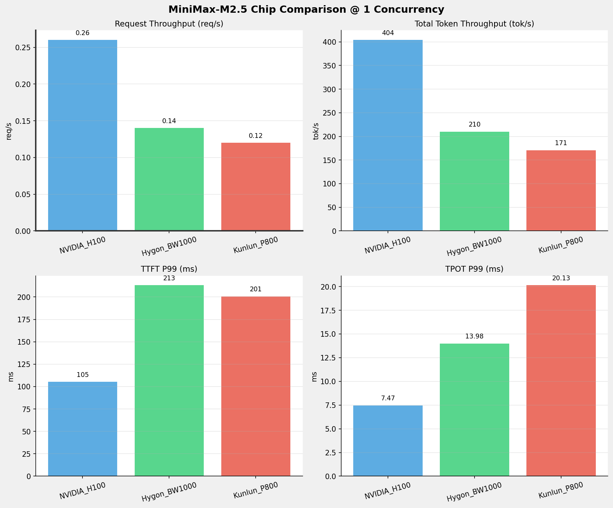
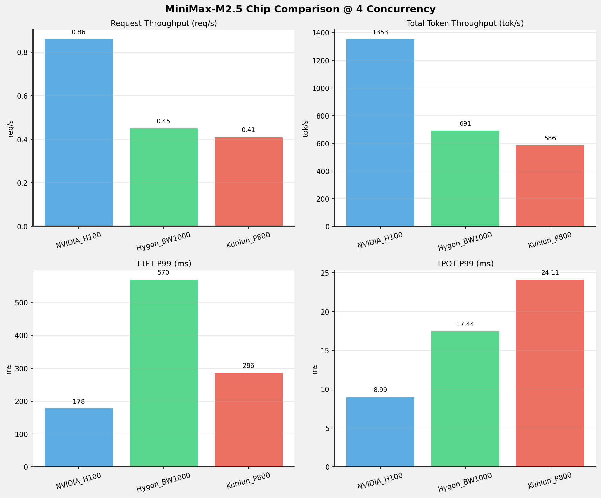
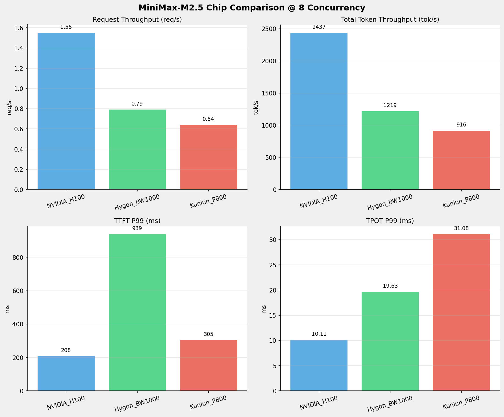
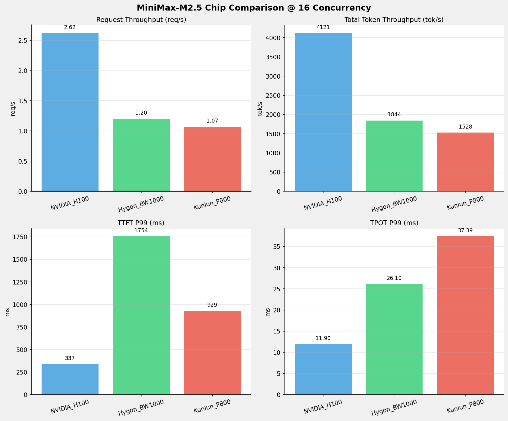
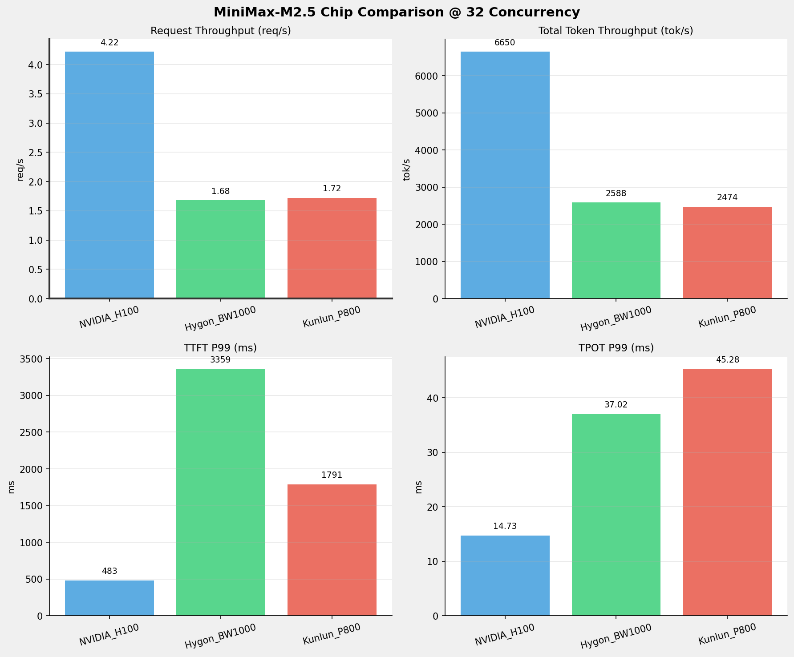
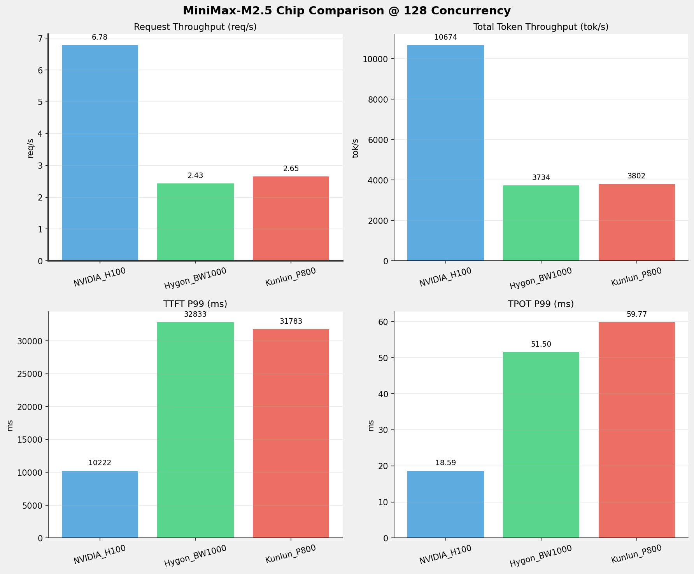
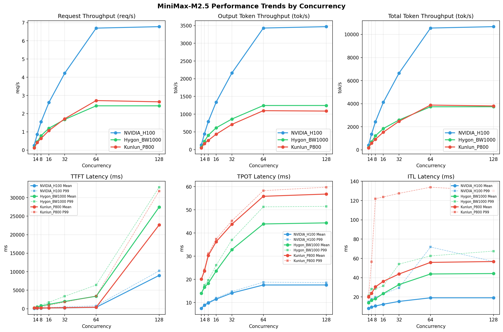

# MiniMax-M2.5模型在不同芯片下的benchmark基准测试报告

**测试日期：** 2026-05-25

---

## 测试场景
在固定请求数，输入上下文和输出上下文长度下，使用vllm bench serve工具对并发数逐级增加场景的性能基准验证。并对比同一模型在不同芯片环境上的性能指标。

**主要采集指标**：

| 指标                  | 单位         | 含义                                 |
|---------------------|------------|------------------------------------|
| TTFT                | ms         | Time To First Token，首 token 延迟     |
| TPOT                | ms/token   | Time Per Output Token，每 token 生成时间 |
| Throughput          | tokens/s   | 系统总吞吐                              |
| QPS                 | requests/s | 请求吞吐                               |
| P50/P95/P99 Latency | ms         | 延迟分位数                              |
    
### 📊 测试概览

| 项目            | 配置                                     | 备注  |
|---------------|----------------------------------------|-----|
| **数据集**       | random                                 |     |
| **并发数**       | 1, 4, 8, 16, 32, 64, 128    |     |
| **总请求数**      | 1000                                    |     |
| **请求输入上下文长度** | 1024（1k）                             |     |
| **请求输出上下文长度** | 512（0.50k）                             |     |
| **被测芯片**      | NVIDIA_H100, Hygon_BW1000, Kunlun_P800 |     |
| **被测模型**      | MiniMax-M2.5 |     |

---

### 🤖 芯片和模型配置信息

| 参数名称 | **NVIDIA_H100** | **Hygon_BW1000** | **Kunlun_P800** |
|----------|----------|----------|----------|
| **max_position_embeddings** | 196608 | 196608 | 196608 |
| **model_name** | MiniMax-M2.5 | MiniMax-M2.5-W8A8 | MiniMax-M2.5-W8A8-INT8-Dynamic |
| **model_size** | 215G | 215G | 215G |
| **python_version** | 3.12.3 | 3.10.12 | 3.10.15 |
| **quantization_config** | FP8 | int-8 | int-8 |
| **temperature** | 1.0 | N/A | 1.0 |
| **top_k** | 40 | N/A | 40 |
| **top_p** | 0.95 | N/A | 0.95 |
| **transformers_version** | 4.46.1 | 4.57.6 | 4.46.1 |
| **vllm_version** | 0.20.0 | 0.15.1+das.opt1.alpha.dtk2604 | 0.11.0 |

---

### ⚙️ vLLM启动配置信息

| 参数名称 | **NVIDIA_H100** | **Hygon_BW1000** | **Kunlun_P800** |
|----------|----------|----------|----------|
| **Block Size** | default | default | 128 |
| **Compilation Config** | N/A | N/A | {"splitting_ops":["vllm.unified_attention","vllm.unified_attention_with_output","vllm.unified_attention_with_output_kunlun","vllm.mamba_mixer2","vllm.mamba_mixer","vllm.short_conv","vllm.linear_attention","vllm.plamo2_mamba_mixer","vllm.gdn_attention","vllm.sparse_attn_indexer","vllm.sparse_attn_indexer_vllm_kunlun"]} |
| **Dp** | 1 | 1 | 1 |
| **Dtype** | default | bfloat16 | auto |
| **Enable Auto Tool Choice** | True | True | True |
| **Enable Export Parallel** | True | True | False |
| **Gpu Memory Utilization** | 0.85 | 0.9 | 0.95 |
| **Max Model Len** | 196608 | 196608 | 196608 |
| **Max Num Batched Tokens** | 8192 | default | 8192 |
| **Max Num Seqs** | 64 | 64 | 64 |
| **Model Name** | MiniMax-M2.5 | MiniMax-M2.5-W8A8 | MiniMax-M2.5-W8A8-INT8-Dynamic |
| **Pp** | 1 | 1 | 1 |
| **Reasoning Parser** | minimax_m2 | minimax_m2 (不生效) | minimax_m2 (不生效) |
| **Tool Call Parser** | minimax_m2 | minimax_m2 | minimax_m2 |
| **Tp** | 8 | 8 | 8 |

- **NVIDIA_H100**: 英伟达H100标准配置
- **Hygon_BW1000**: 海光芯片专家并行配置
- **Kunlun_P800**: 昆仑芯不启用专家并行避免通信问题

---

### 📊 芯片性能对比柱状图

**1并发**

**4并发**

**8并发**

**16并发**

**32并发**

**64并发**

**128并发**

### 📈 性能趋势对比图 (所有芯片)

---

### 📈 各指标随并发级别性能对比详情

#### 请求吞吐量（Request throughput (req/s)）

| 并发数 | NVIDIA_H100 | Hygon_BW1000 | Kunlun_P800 | 差值 | 百分比 |
|-----|----------- | ----------- | ----------- | ----------- | -----------|
| 1   | 0.26 | 0.14 | 0.12 | -0.14 | -53.8% |
| 4   | 0.86 | 0.45 | 0.41 | -0.45 | -52.3% |
| 8   | 1.55 | 0.79 | 0.64 | -0.91 | -58.7% |
| 16   | 2.62 | 1.20 | 1.07 | -1.55 | -59.2% |
| 32   | 4.22 | 1.68 | 1.72 | -2.50 | -59.2% |
| 64   | 6.70 | 2.43 | 2.72 | -3.98 | -59.4% |
| 128   | 6.78 | 2.43 | 2.65 | -4.13 | -60.9% |

#### 输出token吞吐量（Output token throughput (tok/s)）

| 并发数 | NVIDIA_H100 | Hygon_BW1000 | Kunlun_P800 | 差值 | 百分比 |
|-----|----------- | ----------- | ----------- | ----------- | -----------|
| 1   | 131.35 | 69.93 | 48.80 | -82.55 | -62.8% |
| 4   | 439.84 | 230.19 | 165.80 | -274.04 | -62.3% |
| 8   | 792.15 | 406.35 | 259.93 | -532.22 | -67.2% |
| 16   | 1339.60 | 614.78 | 433.34 | -906.26 | -67.7% |
| 32   | 2161.89 | 862.58 | 711.67 | -1450.22 | -67.1% |
| 64   | 3430.95 | 1244.14 | 1098.57 | -2332.38 | -68.0% |
| 128   | 3469.97 | 1244.78 | 1087.30 | -2382.67 | -68.7% |

#### 总token吞吐量（Total token throughput (tok/s)）

| 并发数 | NVIDIA_H100 | Hygon_BW1000 | Kunlun_P800 | 差值 | 百分比 |
|-----|----------- | ----------- | ----------- | ----------- | -----------|
| 1   | 404.06 | 209.80 | 170.80 | -233.26 | -57.7% |
| 4   | 1353.02 | 690.57 | 585.79 | -767.23 | -56.7% |
| 8   | 2436.78 | 1219.06 | 915.98 | -1520.80 | -62.4% |
| 16   | 4120.83 | 1844.34 | 1528.33 | -2592.50 | -62.9% |
| 32   | 6650.35 | 2587.73 | 2474.31 | -4176.04 | -62.8% |
| 64   | 10554.20 | 3732.41 | 3877.92 | -6676.28 | -63.3% |
| 128   | 10674.24 | 3734.35 | 3802.21 | -6872.03 | -64.4% |

#### 首token延迟（P99 TTFT (ms)）

| 并发数 | NVIDIA_H100 | Hygon_BW1000 | Kunlun_P800 | 差值 | 百分比 |
|-----|----------- | ----------- | ----------- | ----------- | -----------|
| 1   | 105.19 | 213.04 | 200.73 | +95.54 | +90.8% |
| 4   | 177.82 | 569.68 | 286.29 | +108.47 | +61.0% |
| 8   | 208.22 | 938.55 | 304.54 | +96.32 | +46.3% |
| 16   | 337.29 | 1754.29 | 929.12 | +591.83 | +175.5% |
| 32   | 483.29 | 3358.71 | 1790.60 | +1307.31 | +270.5% |
| 64   | 779.16 | 6403.94 | 3433.76 | +2654.60 | +340.7% |
| 128   | 10222.45 | 32833.25 | 31783.31 | +21560.86 | +210.9% |

#### 每token生成时间（P99 TPOT (ms)）

| 并发数 | NVIDIA_H100 | Hygon_BW1000 | Kunlun_P800 | 差值 | 百分比 |
|-----|----------- | ----------- | ----------- | ----------- | -----------|
| 1   | 7.47 | 13.98 | 20.13 | +12.66 | +169.5% |
| 4   | 8.99 | 17.44 | 24.11 | +15.12 | +168.2% |
| 8   | 10.11 | 19.63 | 31.08 | +20.97 | +207.4% |
| 16   | 11.90 | 26.10 | 37.39 | +25.49 | +214.2% |
| 32   | 14.73 | 37.02 | 45.28 | +30.55 | +207.4% |
| 64   | 18.78 | 51.29 | 58.28 | +39.50 | +210.3% |
| 128   | 18.59 | 51.50 | 59.77 | +41.18 | +221.5% |

#### token间延迟（P99 ITL (ms)）

| 并发数 | NVIDIA_H100 | Hygon_BW1000 | Kunlun_P800 | 差值 | 百分比 |
|-----|----------- | ----------- | ----------- | ----------- | -----------|
| 1   | 15.01 | 21.33 | 20.77 | +5.76 | +38.4% |
| 4   | 17.86 | 28.31 | 56.47 | +38.61 | +216.2% |
| 8   | 19.82 | 28.46 | 121.96 | +102.14 | +515.3% |
| 16   | 23.16 | 31.52 | 123.72 | +100.56 | +434.2% |
| 32   | 29.45 | 54.11 | 127.48 | +98.03 | +332.9% |
| 64   | 71.82 | 62.57 | 133.87 | +62.05 | +86.4% |
| 128   | 56.76 | 67.59 | 130.03 | +73.27 | +129.1% |

### 📈 各并发级别性能对比详情

### 1 并发

#### 服务基准结果

| 指标 | NVIDIA_H100 | Hygon_BW1000 | Kunlun_P800 |
|------|----------- | ----------- | -----------|
| 成功请求数 | 1000 | 1000 | 1000 |
| 失败请求数 | 0 | 0 | 0 |
| 测试持续时间 (s) | 3897.89 | 7321.20 | 8388.98 |
| 总输入 tokens | 1063000 | 1024000 | 1023468 |
| 总生成 tokens | 512000 | 512000 | 409391 |
| **请求吞吐量 (req/s)** | **0.26** ⭐ | 0.14 | 0.12 |
| **输出 token 吞吐量 (tok/s)** | **131.35** ⭐ | 69.93 | 48.80 |
| 峰值输出 token 吞吐量 (tok/s) | **136.00** ⭐ | 77.00 | 52.00 |
| 峰值并发请求数 | 2.00 | 2.00 | 2.00 |
| **总 token 吞吐量 (tok/s)** | **404.06** ⭐ | 209.80 | 170.80 |

#### 首Token延迟 (TTFT)

| 指标 | NVIDIA_H100 | Hygon_BW1000 | Kunlun_P800 |
|------|----------- | ----------- | -----------|
| 平均 TTFT (ms) | **87.20** ⭐ | 188.53 | 189.88 |
| 中位 TTFT (ms) | **85.84** ⭐ | 198.91 | 191.82 |
| P95 TTFT (ms) | **99.91** ⭐ | 204.23 | 195.12 |
| P99 TTFT (ms) | **105.19** ⭐ | 213.04 | 200.73 |

#### 每Token生成时间 (TPOT)

| 指标 | NVIDIA_H100 | Hygon_BW1000 | Kunlun_P800 |
|------|----------- | ----------- | -----------|
| 平均 TPOT (ms) | **7.46** ⭐ | 13.96 | 20.07 |
| 中位 TPOT (ms) | **7.46** ⭐ | 13.96 | 20.07 |
| P95 TPOT (ms) | **7.47** ⭐ | 13.98 | 20.11 |
| P99 TPOT (ms) | **7.47** ⭐ | 13.98 | 20.13 |

#### Token间延迟 (ITL)

| 指标 | NVIDIA_H100 | Hygon_BW1000 | Kunlun_P800 |
|------|----------- | ----------- | -----------|
| 平均 ITL (ms) | **8.14** ⭐ | 13.97 | 20.06 |
| 中位 ITL (ms) | **7.46** ⭐ | 13.95 | 20.05 |
| P95 ITL (ms) | **14.92** ⭐ | 15.22 | 20.25 |
| P99 ITL (ms) | **15.01** ⭐ | 21.33 | 20.77 |

---

### 4 并发

#### 服务基准结果

| 指标 | NVIDIA_H100 | Hygon_BW1000 | Kunlun_P800 |
|------|----------- | ----------- | -----------|
| 成功请求数 | 1000 | 1000 | 1000 |
| 失败请求数 | 0 | 0 | 0 |
| 测试持续时间 (s) | 1164.06 | 2224.24 | 2436.89 |
| 总输入 tokens | 1063000 | 1024000 | 1023468 |
| 总生成 tokens | 512000 | 512000 | 404037 |
| **请求吞吐量 (req/s)** | **0.86** ⭐ | 0.45 | 0.41 |
| **输出 token 吞吐量 (tok/s)** | **439.84** ⭐ | 230.19 | 165.80 |
| 峰值输出 token 吞吐量 (tok/s) | **460.00** ⭐ | 264.00 | 180.00 |
| 峰值并发请求数 | 8.00 | 8.00 | 7.00 |
| **总 token 吞吐量 (tok/s)** | **1353.02** ⭐ | 690.57 | 585.79 |

#### 首Token延迟 (TTFT)

| 指标 | NVIDIA_H100 | Hygon_BW1000 | Kunlun_P800 |
|------|----------- | ----------- | -----------|
| 平均 TTFT (ms) | **137.89** ⭐ | 432.99 | 213.65 |
| 中位 TTFT (ms) | **147.19** ⭐ | 544.64 | 212.13 |
| P95 TTFT (ms) | **170.16** ⭐ | 553.79 | 227.14 |
| P99 TTFT (ms) | **177.82** ⭐ | 569.68 | 286.29 |

#### 每Token生成时间 (TPOT)

| 指标 | NVIDIA_H100 | Hygon_BW1000 | Kunlun_P800 |
|------|----------- | ----------- | -----------|
| 平均 TPOT (ms) | **8.84** ⭐ | 16.56 | 23.59 |
| 中位 TPOT (ms) | **8.83** ⭐ | 16.50 | 23.61 |
| P95 TPOT (ms) | **8.96** ⭐ | 17.22 | 23.94 |
| P99 TPOT (ms) | **8.99** ⭐ | 17.44 | 24.11 |

#### Token间延迟 (ITL)

| 指标 | NVIDIA_H100 | Hygon_BW1000 | Kunlun_P800 |
|------|----------- | ----------- | -----------|
| 平均 ITL (ms) | **9.55** ⭐ | 16.60 | 23.75 |
| 中位 ITL (ms) | **8.84** ⭐ | 16.41 | 22.87 |
| P95 ITL (ms) | **17.50** ⭐ | 19.68 | 23.17 |
| P99 ITL (ms) | **17.86** ⭐ | 28.31 | 56.47 |

---

### 8 并发

#### 服务基准结果

| 指标 | NVIDIA_H100 | Hygon_BW1000 | Kunlun_P800 |
|------|----------- | ----------- | -----------|
| 成功请求数 | 1000 | 1000 | 1000 |
| 失败请求数 | 0 | 0 | 0 |
| 测试持续时间 (s) | 646.34 | 1259.98 | 1560.03 |
| 总输入 tokens | 1063000 | 1024000 | 1023468 |
| 总生成 tokens | 512000 | 512000 | 405494 |
| **请求吞吐量 (req/s)** | **1.55** ⭐ | 0.79 | 0.64 |
| **输出 token 吞吐量 (tok/s)** | **792.15** ⭐ | 406.35 | 259.93 |
| 峰值输出 token 吞吐量 (tok/s) | **839.00** ⭐ | 496.00 | 288.00 |
| 峰值并发请求数 | 16.00 | 16.00 | 12.00 |
| **总 token 吞吐量 (tok/s)** | **2436.78** ⭐ | 1219.06 | 915.98 |

#### 首Token延迟 (TTFT)

| 指标 | NVIDIA_H100 | Hygon_BW1000 | Kunlun_P800 |
|------|----------- | ----------- | -----------|
| 平均 TTFT (ms) | **151.91** ⭐ | 745.04 | 207.11 |
| 中位 TTFT (ms) | **160.48** ⭐ | 891.02 | 206.91 |
| P95 TTFT (ms) | **191.30** ⭐ | 905.66 | 237.05 |
| P99 TTFT (ms) | **208.22** ⭐ | 938.55 | 304.54 |

#### 每Token生成时间 (TPOT)

| 指标 | NVIDIA_H100 | Hygon_BW1000 | Kunlun_P800 |
|------|----------- | ----------- | -----------|
| 平均 TPOT (ms) | **9.82** ⭐ | 18.27 | 30.26 |
| 中位 TPOT (ms) | **9.78** ⭐ | 18.18 | 30.26 |
| P95 TPOT (ms) | **10.03** ⭐ | 19.46 | 30.79 |
| P99 TPOT (ms) | **10.11** ⭐ | 19.63 | 31.08 |

#### Token间延迟 (ITL)

| 指标 | NVIDIA_H100 | Hygon_BW1000 | Kunlun_P800 |
|------|----------- | ----------- | -----------|
| 平均 ITL (ms) | **10.63** ⭐ | 18.31 | 30.50 |
| 中位 ITL (ms) | **9.78** ⭐ | 18.17 | 28.73 |
| P95 ITL (ms) | **19.32** ⭐ | 20.82 | 29.47 |
| P99 ITL (ms) | **19.82** ⭐ | 28.46 | 121.96 |

---

### 16 并发

#### 服务基准结果

| 指标 | NVIDIA_H100 | Hygon_BW1000 | Kunlun_P800 |
|------|----------- | ----------- | -----------|
| 成功请求数 | 1000 | 1000 | 1000 |
| 失败请求数 | 0 | 0 | 0 |
| 测试持续时间 (s) | 382.20 | 832.82 | 934.69 |
| 总输入 tokens | 1063000 | 1024000 | 1023468 |
| 总生成 tokens | 512000 | 512000 | 405040 |
| **请求吞吐量 (req/s)** | **2.62** ⭐ | 1.20 | 1.07 |
| **输出 token 吞吐量 (tok/s)** | **1339.60** ⭐ | 614.78 | 433.34 |
| 峰值输出 token 吞吐量 (tok/s) | **1440.00** ⭐ | 784.00 | 513.00 |
| 峰值并发请求数 | 32.00 | 32.00 | 21.00 |
| **总 token 吞吐量 (tok/s)** | **4120.83** ⭐ | 1844.34 | 1528.33 |

#### 首Token延迟 (TTFT)

| 指标 | NVIDIA_H100 | Hygon_BW1000 | Kunlun_P800 |
|------|----------- | ----------- | -----------|
| 平均 TTFT (ms) | **214.21** ⭐ | 1184.45 | 235.85 |
| 中位 TTFT (ms) | **215.61** ⭐ | 1129.00 | 221.02 |
| P95 TTFT (ms) | 318.58 | 1664.32 | **285.94** ⭐ |
| P99 TTFT (ms) | **337.29** ⭐ | 1754.29 | 929.12 |

#### 每Token生成时间 (TPOT)

| 指标 | NVIDIA_H100 | Hygon_BW1000 | Kunlun_P800 |
|------|----------- | ----------- | -----------|
| 平均 TPOT (ms) | **11.47** ⭐ | 23.60 | 36.22 |
| 中位 TPOT (ms) | **11.44** ⭐ | 23.53 | 36.26 |
| P95 TPOT (ms) | **11.80** ⭐ | 24.76 | 37.03 |
| P99 TPOT (ms) | **11.90** ⭐ | 26.10 | 37.39 |

#### Token间延迟 (ITL)

| 指标 | NVIDIA_H100 | Hygon_BW1000 | Kunlun_P800 |
|------|----------- | ----------- | -----------|
| 平均 ITL (ms) | **12.49** ⭐ | 23.57 | 36.22 |
| 中位 ITL (ms) | **11.38** ⭐ | 23.05 | 33.13 |
| P95 ITL (ms) | **22.42** ⭐ | 24.26 | 56.73 |
| P99 ITL (ms) | **23.16** ⭐ | 31.52 | 123.72 |

---

### 32 并发

#### 服务基准结果

| 指标 | NVIDIA_H100 | Hygon_BW1000 | Kunlun_P800 |
|------|----------- | ----------- | -----------|
| 成功请求数 | 1000 | 1000 | 1000 |
| 失败请求数 | 0 | 0 | 0 |
| 测试持续时间 (s) | 236.83 | 593.57 | 580.65 |
| 总输入 tokens | 1063000 | 1024000 | 1023468 |
| 总生成 tokens | 512000 | 512000 | 413227 |
| **请求吞吐量 (req/s)** | **4.22** ⭐ | 1.68 | 1.72 |
| **输出 token 吞吐量 (tok/s)** | **2161.89** ⭐ | 862.58 | 711.67 |
| 峰值输出 token 吞吐量 (tok/s) | **2411.00** ⭐ | 1155.00 | 896.00 |
| 峰值并发请求数 | 64.00 | 64.00 | 41.00 |
| **总 token 吞吐量 (tok/s)** | **6650.35** ⭐ | 2587.73 | 2474.31 |

#### 首Token延迟 (TTFT)

| 指标 | NVIDIA_H100 | Hygon_BW1000 | Kunlun_P800 |
|------|----------- | ----------- | -----------|
| 平均 TTFT (ms) | **246.37** ⭐ | 1958.76 | 278.24 |
| 中位 TTFT (ms) | 254.14 | 2044.54 | **237.60** ⭐ |
| P95 TTFT (ms) | 405.22 | 3347.22 | **312.15** ⭐ |
| P99 TTFT (ms) | **483.29** ⭐ | 3358.71 | 1790.60 |

#### 每Token生成时间 (TPOT)

| 指标 | NVIDIA_H100 | Hygon_BW1000 | Kunlun_P800 |
|------|----------- | ----------- | -----------|
| 平均 TPOT (ms) | **14.11** ⭐ | 32.86 | 43.79 |
| 中位 TPOT (ms) | **14.10** ⭐ | 32.45 | 44.00 |
| P95 TPOT (ms) | **14.58** ⭐ | 35.60 | 44.82 |
| P99 TPOT (ms) | **14.73** ⭐ | 37.02 | 45.28 |

#### Token间延迟 (ITL)

| 指标 | NVIDIA_H100 | Hygon_BW1000 | Kunlun_P800 |
|------|----------- | ----------- | -----------|
| 平均 ITL (ms) | **15.40** ⭐ | 32.83 | 43.84 |
| 中位 ITL (ms) | **13.63** ⭐ | 31.08 | 38.25 |
| P95 ITL (ms) | **27.21** ⭐ | 37.64 | 125.84 |
| P99 ITL (ms) | **29.45** ⭐ | 54.11 | 127.48 |

---

### 64 并发

#### 服务基准结果

| 指标 | NVIDIA_H100 | Hygon_BW1000 | Kunlun_P800 |
|------|----------- | ----------- | -----------|
| 成功请求数 | 1000 | 1000 | 1000 |
| 失败请求数 | 0 | 0 | 0 |
| 测试持续时间 (s) | 149.23 | 411.53 | 368.24 |
| 总输入 tokens | 1063000 | 1024000 | 1023468 |
| 总生成 tokens | 512000 | 512000 | 404538 |
| **请求吞吐量 (req/s)** | **6.70** ⭐ | 2.43 | 2.72 |
| **输出 token 吞吐量 (tok/s)** | **3430.95** ⭐ | 1244.14 | 1098.57 |
| 峰值输出 token 吞吐量 (tok/s) | **3973.00** ⭐ | 1796.00 | 1472.00 |
| 峰值并发请求数 | 128.00 | 128.00 | 80.00 |
| **总 token 吞吐量 (tok/s)** | **10554.20** ⭐ | 3732.41 | 3877.92 |

#### 首Token延迟 (TTFT)

| 指标 | NVIDIA_H100 | Hygon_BW1000 | Kunlun_P800 |
|------|----------- | ----------- | -----------|
| 平均 TTFT (ms) | **391.26** ⭐ | 3378.19 | 412.69 |
| 中位 TTFT (ms) | 416.86 | 3071.30 | **218.07** ⭐ |
| P95 TTFT (ms) | **661.32** ⭐ | 6388.01 | 1825.99 |
| P99 TTFT (ms) | **779.16** ⭐ | 6403.94 | 3433.76 |

#### 每Token生成时间 (TPOT)

| 指标 | NVIDIA_H100 | Hygon_BW1000 | Kunlun_P800 |
|------|----------- | ----------- | -----------|
| 平均 TPOT (ms) | **17.56** ⭐ | 43.91 | 55.84 |
| 中位 TPOT (ms) | **17.60** ⭐ | 43.79 | 56.48 |
| P95 TPOT (ms) | **18.56** ⭐ | 49.81 | 57.65 |
| P99 TPOT (ms) | **18.78** ⭐ | 51.29 | 58.28 |

#### Token间延迟 (ITL)

| 指标 | NVIDIA_H100 | Hygon_BW1000 | Kunlun_P800 |
|------|----------- | ----------- | -----------|
| 平均 ITL (ms) | **19.13** ⭐ | 43.85 | 55.88 |
| 中位 ITL (ms) | **16.63** ⭐ | 39.75 | 46.49 |
| P95 ITL (ms) | **33.43** ⭐ | 44.24 | 129.65 |
| P99 ITL (ms) | 71.82 | **62.57** ⭐ | 133.87 |

---

### 128 并发

#### 服务基准结果

| 指标 | NVIDIA_H100 | Hygon_BW1000 | Kunlun_P800 |
|------|----------- | ----------- | -----------|
| 成功请求数 | 1000 | 1000 | 1000 |
| 失败请求数 | 0 | 0 | 0 |
| 测试持续时间 (s) | 147.55 | 411.32 | 376.98 |
| 总输入 tokens | 1063000 | 1024000 | 1023468 |
| 总生成 tokens | 512000 | 512000 | 409890 |
| **请求吞吐量 (req/s)** | **6.78** ⭐ | 2.43 | 2.65 |
| **输出 token 吞吐量 (tok/s)** | **3469.97** ⭐ | 1244.78 | 1087.30 |
| 峰值输出 token 吞吐量 (tok/s) | **4009.00** ⭐ | 1792.00 | 1472.00 |
| 峰值并发请求数 | 192.00 | 190.00 | 143.00 |
| **总 token 吞吐量 (tok/s)** | **10674.24** ⭐ | 3734.35 | 3802.21 |

#### 首Token延迟 (TTFT)

| 指标 | NVIDIA_H100 | Hygon_BW1000 | Kunlun_P800 |
|------|----------- | ----------- | -----------|
| 平均 TTFT (ms) | **8995.70** ⭐ | 27454.32 | 22636.32 |
| 中位 TTFT (ms) | **9408.36** ⭐ | 29091.67 | 23759.75 |
| P95 TTFT (ms) | **9996.15** ⭐ | 32632.51 | 26359.90 |
| P99 TTFT (ms) | **10222.45** ⭐ | 32833.25 | 31783.31 |

#### 每Token生成时间 (TPOT)

| 指标 | NVIDIA_H100 | Hygon_BW1000 | Kunlun_P800 |
|------|----------- | ----------- | -----------|
| 平均 TPOT (ms) | **17.58** ⭐ | 44.37 | 56.81 |
| 中位 TPOT (ms) | **17.41** ⭐ | 44.36 | 57.43 |
| P95 TPOT (ms) | **18.37** ⭐ | 50.29 | 58.98 |
| P99 TPOT (ms) | **18.59** ⭐ | 51.50 | 59.77 |

#### Token间延迟 (ITL)

| 指标 | NVIDIA_H100 | Hygon_BW1000 | Kunlun_P800 |
|------|----------- | ----------- | -----------|
| 平均 ITL (ms) | **19.14** ⭐ | 44.30 | 56.77 |
| 中位 ITL (ms) | **16.63** ⭐ | 39.80 | 46.35 |
| P95 ITL (ms) | **33.36** ⭐ | 49.44 | 126.97 |
| P99 ITL (ms) | **56.76** ⭐ | 67.59 | 130.03 |

---

---

*报告生成时间: 2026-05-25*

