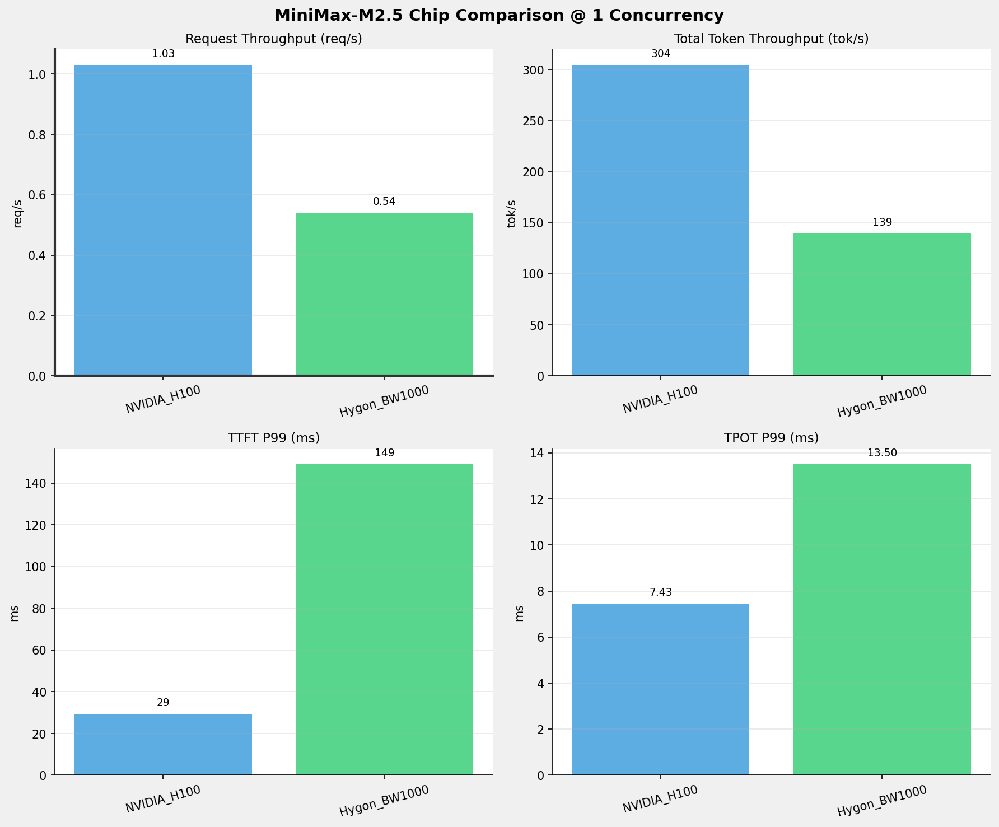
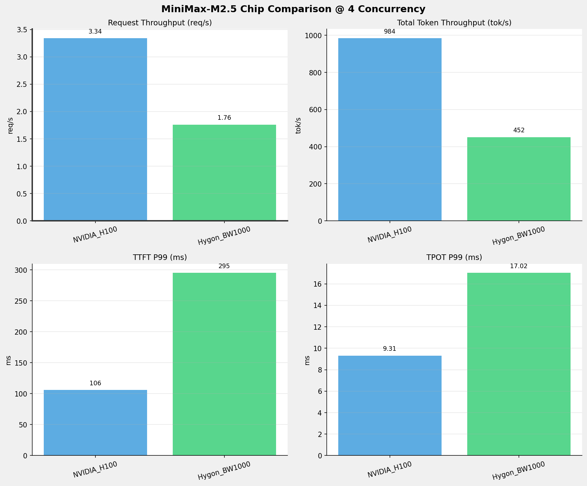
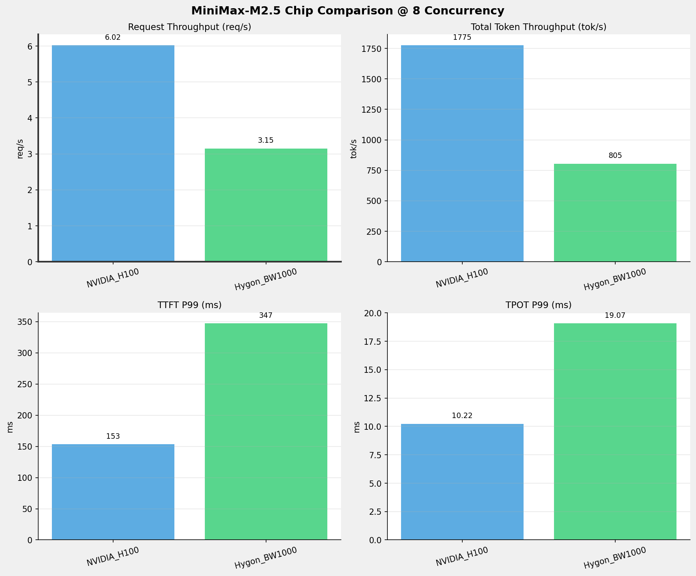
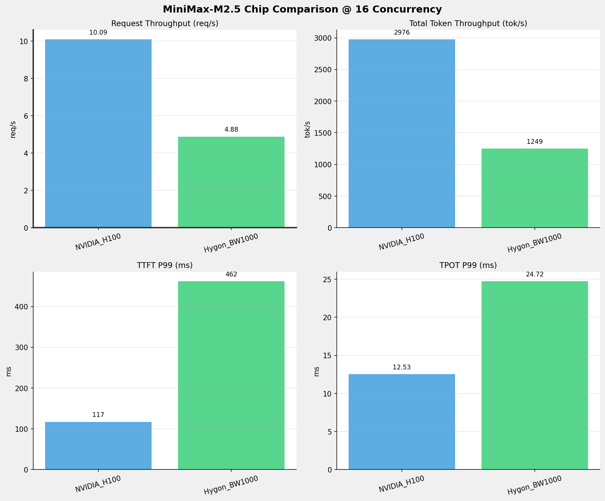
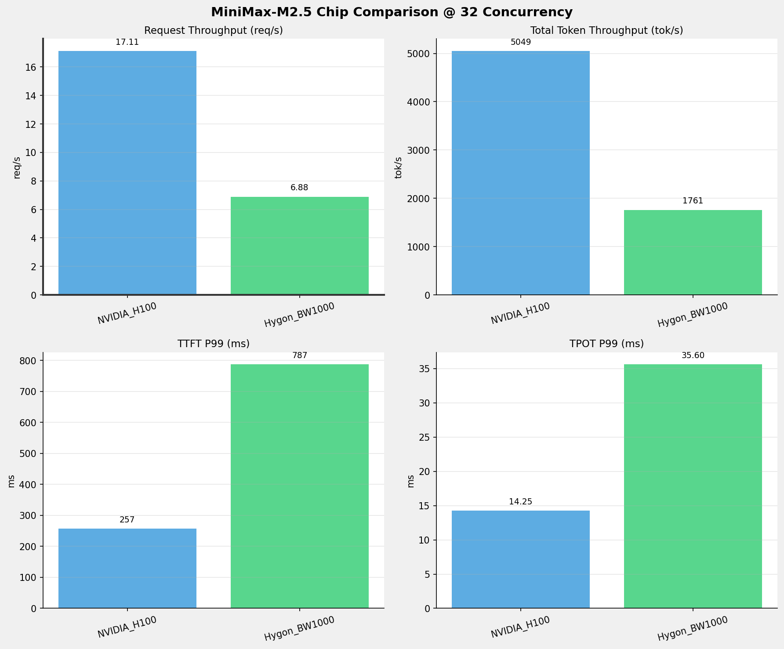
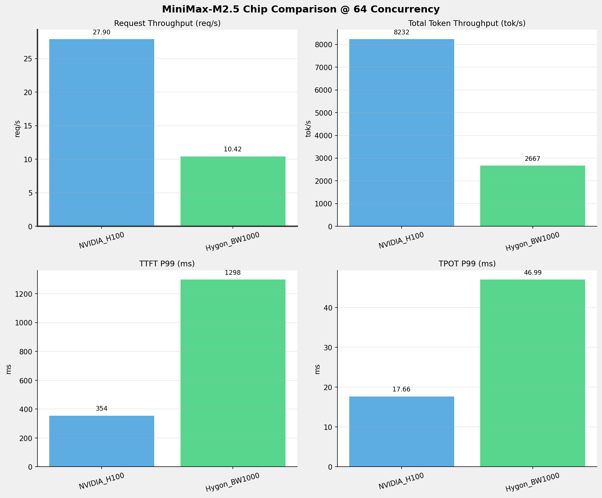
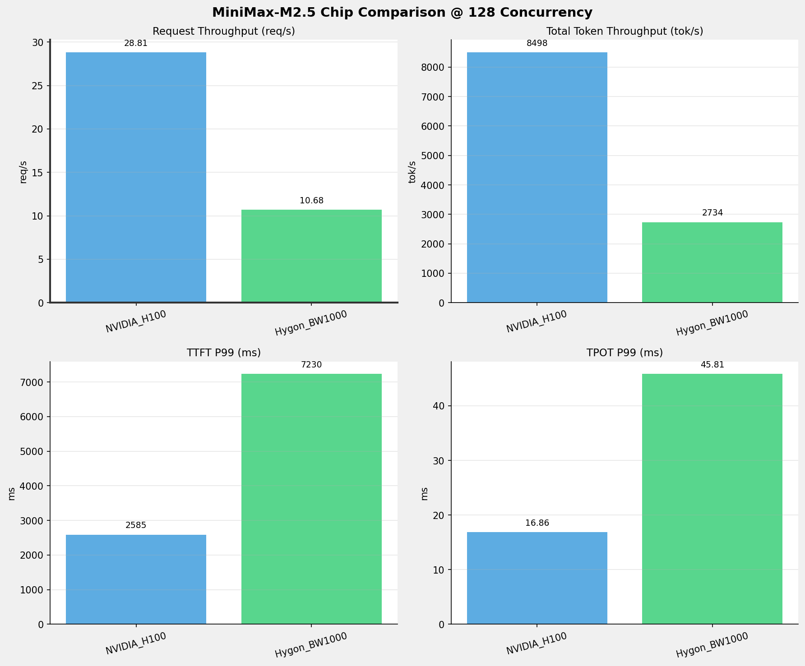
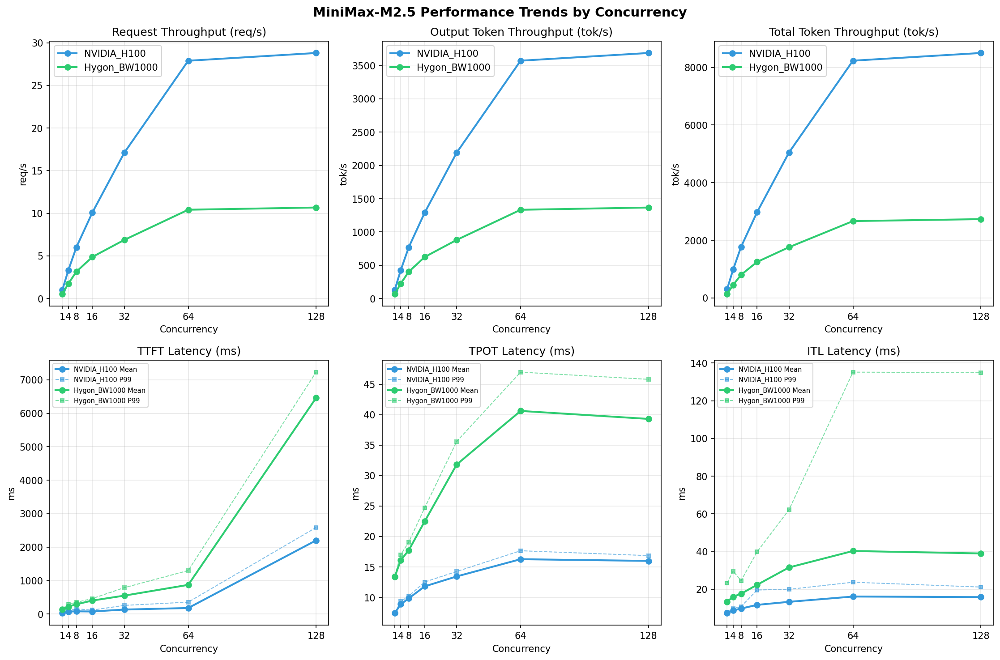

# MiniMax-M2.5模型在不同芯片下的benchmark基准测试报告

**测试日期：** 2026-05-25

---

## 测试场景
在固定请求数，输入上下文和输出上下文长度下，使用vllm bench serve工具对并发数逐级增加场景的性能基准验证。并对比同一模型在不同芯片环境上的性能指标。

**主要采集指标**：

| 指标                  | 单位         | 含义                                 |
|---------------------|------------|------------------------------------|
| TTFT                | ms         | Time To First Token，首 token 延迟     |
| TPOT                | ms/token   | Time Per Output Token，每 token 生成时间 |
| Throughput          | tokens/s   | 系统总吞吐                              |
| QPS                 | requests/s | 请求吞吐                               |
| P50/P95/P99 Latency | ms         | 延迟分位数                              |
    
### 📊 测试概览

| 项目            | 配置                                     | 备注  |
|---------------|----------------------------------------|-----|
| **数据集**       | random                                 |     |
| **并发数**       | 1, 4, 8, 16, 32, 64, 128    |     |
| **总请求数**      | 1000                                    |     |
| **请求输入上下文长度** | 128（0.12k）                             |     |
| **请求输出上下文长度** | 128（0.12k）                             |     |
| **被测芯片**      | NVIDIA_H100, Hygon_BW1000 |     |
| **被测模型**      | MiniMax-M2.5 |     |

---

### 🤖 芯片和模型配置信息

| 参数名称 | **NVIDIA_H100** | **Hygon_BW1000** |
|----------|----------|----------|
| **max_position_embeddings** | 196608 | 196608 |
| **model_name** | MiniMax-M2.5 | MiniMax-M2.5-W8A8 |
| **model_size** | 215G | 215G |
| **python_version** | 3.12.3 | 3.10.12 |
| **quantization_config** | FP8 | int-8 |
| **temperature** | 1.0 | N/A |
| **top_k** | 40 | N/A |
| **top_p** | 0.95 | N/A |
| **transformers_version** | 4.46.1 | 4.57.6 |
| **vllm_version** | 0.20.0 | 0.15.1+das.opt1.alpha.dtk2604 |

---

### ⚙️ vLLM启动配置信息

| 参数名称 | **NVIDIA_H100** | **Hygon_BW1000** |
|----------|----------|----------|
| **Block Size** | default | default |
| **Compilation Config** | N/A | N/A |
| **Dp** | 1 | 1 |
| **Dtype** | default | bfloat16 |
| **Enable Auto Tool Choice** | True | True |
| **Enable Export Parallel** | True | True |
| **Gpu Memory Utilization** | 0.85 | 0.9 |
| **Max Model Len** | 196608 | 196608 |
| **Max Num Batched Tokens** | 8192 | default |
| **Max Num Seqs** | 64 | 64 |
| **Model Name** | MiniMax-M2.5 | MiniMax-M2.5-W8A8 |
| **Pp** | 1 | 1 |
| **Reasoning Parser** | minimax_m2 | minimax_m2 (不生效) |
| **Tool Call Parser** | minimax_m2 | minimax_m2 |
| **Tp** | 8 | 8 |

- **NVIDIA_H100**: 英伟达H100标准配置
- **Hygon_BW1000**: 海光芯片专家并行配置

---

### 📊 芯片性能对比柱状图

**1并发**

**4并发**

**8并发**

**16并发**

**32并发**

**64并发**

**128并发**

### 📈 性能趋势对比图 (所有芯片)

---

### 📈 各指标随并发级别性能对比详情

#### 请求吞吐量（Request throughput (req/s)）

| 并发数 | NVIDIA_H100 | Hygon_BW1000 | 差值 | 百分比 |
|-----|----------- | ----------- | ----------- | -----------|
| 1   | 1.03 | 0.54 | -0.49 | -47.6% |
| 4   | 3.34 | 1.76 | -1.58 | -47.3% |
| 8   | 6.02 | 3.15 | -2.87 | -47.7% |
| 16   | 10.09 | 4.88 | -5.21 | -51.6% |
| 32   | 17.11 | 6.88 | -10.23 | -59.8% |
| 64   | 27.90 | 10.42 | -17.48 | -62.7% |
| 128   | 28.81 | 10.68 | -18.13 | -62.9% |

#### 输出token吞吐量（Output token throughput (tok/s)）

| 并发数 | NVIDIA_H100 | Hygon_BW1000 | 差值 | 百分比 |
|-----|----------- | ----------- | ----------- | -----------|
| 1   | 132.10 | 69.71 | -62.39 | -47.2% |
| 4   | 427.14 | 225.87 | -201.27 | -47.1% |
| 8   | 770.36 | 402.59 | -367.77 | -47.7% |
| 16   | 1291.07 | 624.73 | -666.34 | -51.6% |
| 32   | 2190.57 | 880.70 | -1309.87 | -59.8% |
| 64   | 3571.65 | 1333.31 | -2238.34 | -62.7% |
| 128   | 3687.40 | 1367.19 | -2320.21 | -62.9% |

#### 总token吞吐量（Total token throughput (tok/s)）

| 并发数 | NVIDIA_H100 | Hygon_BW1000 | 差值 | 百分比 |
|-----|----------- | ----------- | ----------- | -----------|
| 1   | 304.45 | 139.42 | -165.03 | -54.2% |
| 4   | 984.42 | 451.74 | -532.68 | -54.1% |
| 8   | 1775.45 | 805.18 | -970.27 | -54.6% |
| 16   | 2975.50 | 1249.46 | -1726.04 | -58.0% |
| 32   | 5048.59 | 1761.39 | -3287.20 | -65.1% |
| 64   | 8231.54 | 2666.61 | -5564.93 | -67.6% |
| 128   | 8498.30 | 2734.37 | -5763.93 | -67.8% |

#### 首token延迟（P99 TTFT (ms)）

| 并发数 | NVIDIA_H100 | Hygon_BW1000 | 差值 | 百分比 |
|-----|----------- | ----------- | ----------- | -----------|
| 1   | 29.15 | 148.98 | +119.83 | +411.1% |
| 4   | 105.78 | 294.96 | +189.18 | +178.8% |
| 8   | 153.33 | 347.01 | +193.68 | +126.3% |
| 16   | 116.92 | 461.64 | +344.72 | +294.8% |
| 32   | 256.75 | 786.60 | +529.85 | +206.4% |
| 64   | 354.30 | 1298.18 | +943.88 | +266.4% |
| 128   | 2585.21 | 7229.68 | +4644.47 | +179.7% |

#### 每token生成时间（P99 TPOT (ms)）

| 并发数 | NVIDIA_H100 | Hygon_BW1000 | 差值 | 百分比 |
|-----|----------- | ----------- | ----------- | -----------|
| 1   | 7.43 | 13.50 | +6.07 | +81.7% |
| 4   | 9.31 | 17.02 | +7.71 | +82.8% |
| 8   | 10.22 | 19.07 | +8.85 | +86.6% |
| 16   | 12.53 | 24.72 | +12.19 | +97.3% |
| 32   | 14.25 | 35.60 | +21.35 | +149.8% |
| 64   | 17.66 | 46.99 | +29.33 | +166.1% |
| 128   | 16.86 | 45.81 | +28.95 | +171.7% |

#### token间延迟（P99 ITL (ms)）

| 并发数 | NVIDIA_H100 | Hygon_BW1000 | 差值 | 百分比 |
|-----|----------- | ----------- | ----------- | -----------|
| 1   | 7.81 | 23.34 | +15.53 | +198.8% |
| 4   | 9.81 | 29.56 | +19.75 | +201.3% |
| 8   | 10.83 | 24.60 | +13.77 | +127.1% |
| 16   | 19.61 | 39.84 | +20.23 | +103.2% |
| 32   | 19.96 | 62.20 | +42.24 | +211.6% |
| 64   | 23.73 | 135.18 | +111.45 | +469.7% |
| 128   | 21.18 | 134.95 | +113.77 | +537.2% |

### 📈 各并发级别性能对比详情

### 1 并发

#### 服务基准结果

| 指标 | NVIDIA_H100 | Hygon_BW1000 |
|------|----------- | -----------|
| 成功请求数 | 1000 | 1000 |
| 失败请求数 | 0 | 0 |
| 测试持续时间 (s) | 968.95 | 1836.13 |
| 总输入 tokens | 167000 | 128000 |
| 总生成 tokens | 128000 | 128000 |
| **请求吞吐量 (req/s)** | **1.03** ⭐ | 0.54 |
| **输出 token 吞吐量 (tok/s)** | **132.10** ⭐ | 69.71 |
| 峰值输出 token 吞吐量 (tok/s) | **135.00** ⭐ | 77.00 |
| 峰值并发请求数 | 3.00 | 2.00 |
| **总 token 吞吐量 (tok/s)** | **304.45** ⭐ | 139.42 |

#### 首Token延迟 (TTFT)

| 指标 | NVIDIA_H100 | Hygon_BW1000 |
|------|----------- | -----------|
| 平均 TTFT (ms) | **26.79** ⭐ | 134.74 |
| 中位 TTFT (ms) | **26.80** ⭐ | 134.89 |
| P95 TTFT (ms) | **28.01** ⭐ | 141.10 |
| P99 TTFT (ms) | **29.15** ⭐ | 148.98 |

#### 每Token生成时间 (TPOT)

| 指标 | NVIDIA_H100 | Hygon_BW1000 |
|------|----------- | -----------|
| 平均 TPOT (ms) | **7.42** ⭐ | 13.39 |
| 中位 TPOT (ms) | **7.42** ⭐ | 13.39 |
| P95 TPOT (ms) | **7.42** ⭐ | 13.43 |
| P99 TPOT (ms) | **7.43** ⭐ | 13.50 |

#### Token间延迟 (ITL)

| 指标 | NVIDIA_H100 | Hygon_BW1000 |
|------|----------- | -----------|
| 平均 ITL (ms) | **7.36** ⭐ | 13.36 |
| 中位 ITL (ms) | **7.41** ⭐ | 13.33 |
| P95 ITL (ms) | **7.52** ⭐ | 16.00 |
| P99 ITL (ms) | **7.81** ⭐ | 23.34 |

---

### 4 并发

#### 服务基准结果

| 指标 | NVIDIA_H100 | Hygon_BW1000 |
|------|----------- | -----------|
| 成功请求数 | 1000 | 1000 |
| 失败请求数 | 0 | 0 |
| 测试持续时间 (s) | 299.67 | 566.70 |
| 总输入 tokens | 167000 | 128000 |
| 总生成 tokens | 128000 | 128000 |
| **请求吞吐量 (req/s)** | **3.34** ⭐ | 1.76 |
| **输出 token 吞吐量 (tok/s)** | **427.14** ⭐ | 225.87 |
| 峰值输出 token 吞吐量 (tok/s) | **460.00** ⭐ | 272.00 |
| 峰值并发请求数 | 8.00 | 8.00 |
| **总 token 吞吐量 (tok/s)** | **984.42** ⭐ | 451.74 |

#### 首Token延迟 (TTFT)

| 指标 | NVIDIA_H100 | Hygon_BW1000 |
|------|----------- | -----------|
| 平均 TTFT (ms) | **71.90** ⭐ | 221.28 |
| 中位 TTFT (ms) | **87.54** ⭐ | 259.85 |
| P95 TTFT (ms) | **102.36** ⭐ | 276.54 |
| P99 TTFT (ms) | **105.78** ⭐ | 294.96 |

#### 每Token生成时间 (TPOT)

| 指标 | NVIDIA_H100 | Hygon_BW1000 |
|------|----------- | -----------|
| 平均 TPOT (ms) | **8.87** ⭐ | 16.10 |
| 中位 TPOT (ms) | **8.78** ⭐ | 15.93 |
| P95 TPOT (ms) | **9.21** ⭐ | 16.93 |
| P99 TPOT (ms) | **9.31** ⭐ | 17.02 |

#### Token间延迟 (ITL)

| 指标 | NVIDIA_H100 | Hygon_BW1000 |
|------|----------- | -----------|
| 平均 ITL (ms) | **8.80** ⭐ | 16.04 |
| 中位 ITL (ms) | **8.78** ⭐ | 15.94 |
| P95 ITL (ms) | **9.08** ⭐ | 18.07 |
| P99 ITL (ms) | **9.81** ⭐ | 29.56 |

---

### 8 并发

#### 服务基准结果

| 指标 | NVIDIA_H100 | Hygon_BW1000 |
|------|----------- | -----------|
| 成功请求数 | 1000 | 1000 |
| 失败请求数 | 0 | 0 |
| 测试持续时间 (s) | 166.16 | 317.94 |
| 总输入 tokens | 167000 | 128000 |
| 总生成 tokens | 128000 | 128000 |
| **请求吞吐量 (req/s)** | **6.02** ⭐ | 3.15 |
| **输出 token 吞吐量 (tok/s)** | **770.36** ⭐ | 402.59 |
| 峰值输出 token 吞吐量 (tok/s) | **830.00** ⭐ | 472.00 |
| 峰值并发请求数 | 16.00 | 16.00 |
| **总 token 吞吐量 (tok/s)** | **1775.45** ⭐ | 805.18 |

#### 首Token延迟 (TTFT)

| 指标 | NVIDIA_H100 | Hygon_BW1000 |
|------|----------- | -----------|
| 平均 TTFT (ms) | **79.41** ⭐ | 289.77 |
| 中位 TTFT (ms) | **84.88** ⭐ | 326.93 |
| P95 TTFT (ms) | **136.39** ⭐ | 333.85 |
| P99 TTFT (ms) | **153.33** ⭐ | 347.01 |

#### 每Token生成时间 (TPOT)

| 指标 | NVIDIA_H100 | Hygon_BW1000 |
|------|----------- | -----------|
| 平均 TPOT (ms) | **9.84** ⭐ | 17.74 |
| 中位 TPOT (ms) | **9.76** ⭐ | 17.57 |
| P95 TPOT (ms) | **10.15** ⭐ | 19.00 |
| P99 TPOT (ms) | **10.22** ⭐ | 19.07 |

#### Token间延迟 (ITL)

| 指标 | NVIDIA_H100 | Hygon_BW1000 |
|------|----------- | -----------|
| 平均 ITL (ms) | **9.76** ⭐ | 17.63 |
| 中位 ITL (ms) | **9.77** ⭐ | 17.70 |
| P95 ITL (ms) | **10.11** ⭐ | 19.29 |
| P99 ITL (ms) | **10.83** ⭐ | 24.60 |

---

### 16 并发

#### 服务基准结果

| 指标 | NVIDIA_H100 | Hygon_BW1000 |
|------|----------- | -----------|
| 成功请求数 | 1000 | 1000 |
| 失败请求数 | 0 | 0 |
| 测试持续时间 (s) | 99.14 | 204.89 |
| 总输入 tokens | 167000 | 128000 |
| 总生成 tokens | 128000 | 128000 |
| **请求吞吐量 (req/s)** | **10.09** ⭐ | 4.88 |
| **输出 token 吞吐量 (tok/s)** | **1291.07** ⭐ | 624.73 |
| 峰值输出 token 吞吐量 (tok/s) | **1408.00** ⭐ | 750.00 |
| 峰值并发请求数 | 32.00 | 32.00 |
| **总 token 吞吐量 (tok/s)** | **2975.50** ⭐ | 1249.46 |

#### 首Token延迟 (TTFT)

| 指标 | NVIDIA_H100 | Hygon_BW1000 |
|------|----------- | -----------|
| 平均 TTFT (ms) | **74.88** ⭐ | 401.78 |
| 中位 TTFT (ms) | **88.43** ⭐ | 435.18 |
| P95 TTFT (ms) | **111.18** ⭐ | 449.29 |
| P99 TTFT (ms) | **116.92** ⭐ | 461.64 |

#### 每Token生成时间 (TPOT)

| 指标 | NVIDIA_H100 | Hygon_BW1000 |
|------|----------- | -----------|
| 平均 TPOT (ms) | **11.81** ⭐ | 22.49 |
| 中位 TPOT (ms) | **11.80** ⭐ | 22.39 |
| P95 TPOT (ms) | **12.27** ⭐ | 24.52 |
| P99 TPOT (ms) | **12.53** ⭐ | 24.72 |

#### Token间延迟 (ITL)

| 指标 | NVIDIA_H100 | Hygon_BW1000 |
|------|----------- | -----------|
| 平均 ITL (ms) | **11.72** ⭐ | 22.36 |
| 中位 ITL (ms) | **11.42** ⭐ | 22.75 |
| P95 ITL (ms) | **12.82** ⭐ | 25.61 |
| P99 ITL (ms) | **19.61** ⭐ | 39.84 |

---

### 32 并发

#### 服务基准结果

| 指标 | NVIDIA_H100 | Hygon_BW1000 |
|------|----------- | -----------|
| 成功请求数 | 1000 | 1000 |
| 失败请求数 | 0 | 0 |
| 测试持续时间 (s) | 58.43 | 145.34 |
| 总输入 tokens | 167000 | 128000 |
| 总生成 tokens | 128000 | 128000 |
| **请求吞吐量 (req/s)** | **17.11** ⭐ | 6.88 |
| **输出 token 吞吐量 (tok/s)** | **2190.57** ⭐ | 880.70 |
| 峰值输出 token 吞吐量 (tok/s) | **2459.00** ⭐ | 1178.00 |
| 峰值并发请求数 | 64.00 | 64.00 |
| **总 token 吞吐量 (tok/s)** | **5048.59** ⭐ | 1761.39 |

#### 首Token延迟 (TTFT)

| 指标 | NVIDIA_H100 | Hygon_BW1000 |
|------|----------- | -----------|
| 平均 TTFT (ms) | **132.11** ⭐ | 548.80 |
| 中位 TTFT (ms) | **144.16** ⭐ | 611.99 |
| P95 TTFT (ms) | **176.25** ⭐ | 764.46 |
| P99 TTFT (ms) | **256.75** ⭐ | 786.60 |

#### 每Token生成时间 (TPOT)

| 指标 | NVIDIA_H100 | Hygon_BW1000 |
|------|----------- | -----------|
| 平均 TPOT (ms) | **13.44** ⭐ | 31.82 |
| 中位 TPOT (ms) | **13.38** ⭐ | 31.31 |
| P95 TPOT (ms) | **14.16** ⭐ | 35.00 |
| P99 TPOT (ms) | **14.25** ⭐ | 35.60 |

#### Token间延迟 (ITL)

| 指标 | NVIDIA_H100 | Hygon_BW1000 |
|------|----------- | -----------|
| 平均 ITL (ms) | **13.33** ⭐ | 31.58 |
| 中位 ITL (ms) | **13.42** ⭐ | 31.03 |
| P95 ITL (ms) | **14.05** ⭐ | 33.51 |
| P99 ITL (ms) | **19.96** ⭐ | 62.20 |

---

### 64 并发

#### 服务基准结果

| 指标 | NVIDIA_H100 | Hygon_BW1000 |
|------|----------- | -----------|
| 成功请求数 | 1000 | 1000 |
| 失败请求数 | 0 | 0 |
| 测试持续时间 (s) | 35.84 | 96.00 |
| 总输入 tokens | 167000 | 128000 |
| 总生成 tokens | 128000 | 128000 |
| **请求吞吐量 (req/s)** | **27.90** ⭐ | 10.42 |
| **输出 token 吞吐量 (tok/s)** | **3571.65** ⭐ | 1333.31 |
| 峰值输出 token 吞吐量 (tok/s) | **4154.00** ⭐ | 1856.00 |
| 峰值并发请求数 | 128.00 | 128.00 |
| **总 token 吞吐量 (tok/s)** | **8231.54** ⭐ | 2666.61 |

#### 首Token延迟 (TTFT)

| 指标 | NVIDIA_H100 | Hygon_BW1000 |
|------|----------- | -----------|
| 平均 TTFT (ms) | **178.35** ⭐ | 870.56 |
| 中位 TTFT (ms) | **190.92** ⭐ | 885.65 |
| P95 TTFT (ms) | **302.12** ⭐ | 1234.27 |
| P99 TTFT (ms) | **354.30** ⭐ | 1298.18 |

#### 每Token生成时间 (TPOT)

| 指标 | NVIDIA_H100 | Hygon_BW1000 |
|------|----------- | -----------|
| 平均 TPOT (ms) | **16.27** ⭐ | 40.62 |
| 中位 TPOT (ms) | **16.24** ⭐ | 40.76 |
| P95 TPOT (ms) | **17.31** ⭐ | 44.70 |
| P99 TPOT (ms) | **17.66** ⭐ | 46.99 |

#### Token间延迟 (ITL)

| 指标 | NVIDIA_H100 | Hygon_BW1000 |
|------|----------- | -----------|
| 平均 ITL (ms) | **16.14** ⭐ | 40.30 |
| 中位 ITL (ms) | **15.96** ⭐ | 38.56 |
| P95 ITL (ms) | **17.16** ⭐ | 40.80 |
| P99 ITL (ms) | **23.73** ⭐ | 135.18 |

---

### 128 并发

#### 服务基准结果

| 指标 | NVIDIA_H100 | Hygon_BW1000 |
|------|----------- | -----------|
| 成功请求数 | 1000 | 1000 |
| 失败请求数 | 0 | 0 |
| 测试持续时间 (s) | 34.71 | 93.62 |
| 总输入 tokens | 167000 | 128000 |
| 总生成 tokens | 128000 | 128000 |
| **请求吞吐量 (req/s)** | **28.81** ⭐ | 10.68 |
| **输出 token 吞吐量 (tok/s)** | **3687.40** ⭐ | 1367.19 |
| 峰值输出 token 吞吐量 (tok/s) | **4160.00** ⭐ | 1856.00 |
| 峰值并发请求数 | 192.00 | 192.00 |
| **总 token 吞吐量 (tok/s)** | **8498.30** ⭐ | 2734.37 |

#### 首Token延迟 (TTFT)

| 指标 | NVIDIA_H100 | Hygon_BW1000 |
|------|----------- | -----------|
| 平均 TTFT (ms) | **2200.11** ⭐ | 6457.75 |
| 中位 TTFT (ms) | **2326.16** ⭐ | 6870.02 |
| P95 TTFT (ms) | **2581.26** ⭐ | 7222.80 |
| P99 TTFT (ms) | **2585.21** ⭐ | 7229.68 |

#### 每Token生成时间 (TPOT)

| 指标 | NVIDIA_H100 | Hygon_BW1000 |
|------|----------- | -----------|
| 平均 TPOT (ms) | **15.99** ⭐ | 39.31 |
| 中位 TPOT (ms) | **16.05** ⭐ | 39.54 |
| P95 TPOT (ms) | **16.55** ⭐ | 39.81 |
| P99 TPOT (ms) | **16.86** ⭐ | 45.81 |

#### Token间延迟 (ITL)

| 指标 | NVIDIA_H100 | Hygon_BW1000 |
|------|----------- | -----------|
| 平均 ITL (ms) | **15.86** ⭐ | 39.00 |
| 中位 ITL (ms) | **15.92** ⭐ | 38.51 |
| P95 ITL (ms) | **16.84** ⭐ | 41.70 |
| P99 ITL (ms) | **21.18** ⭐ | 134.95 |

---

---

*报告生成时间: 2026-05-25*

