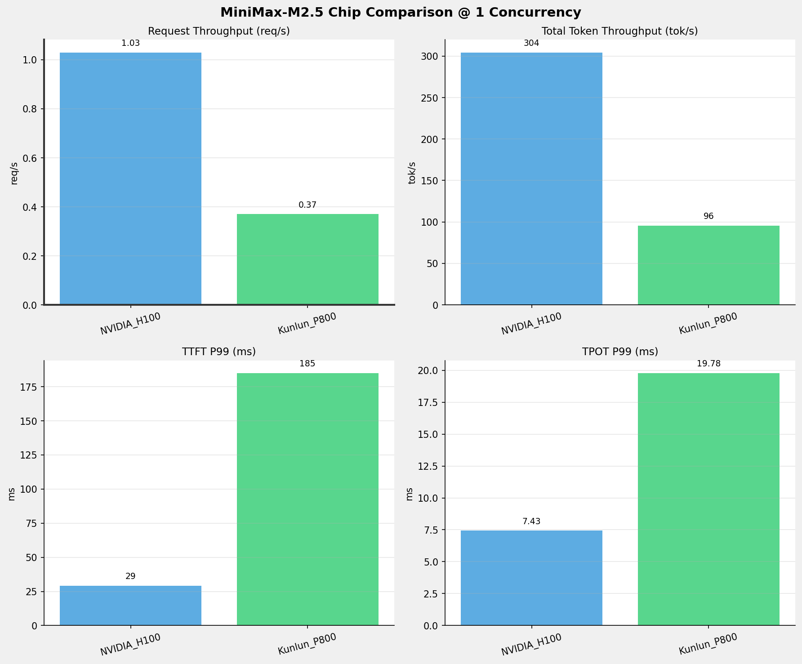
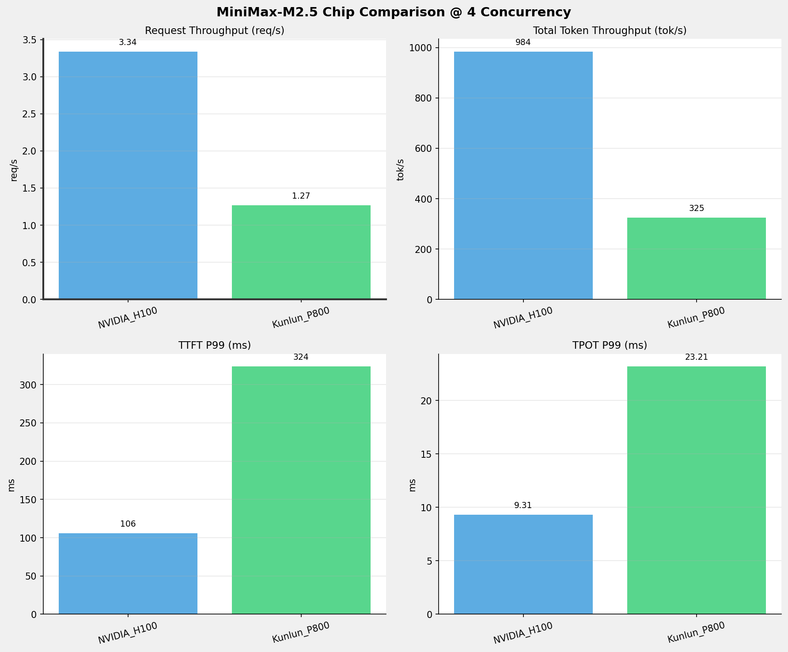
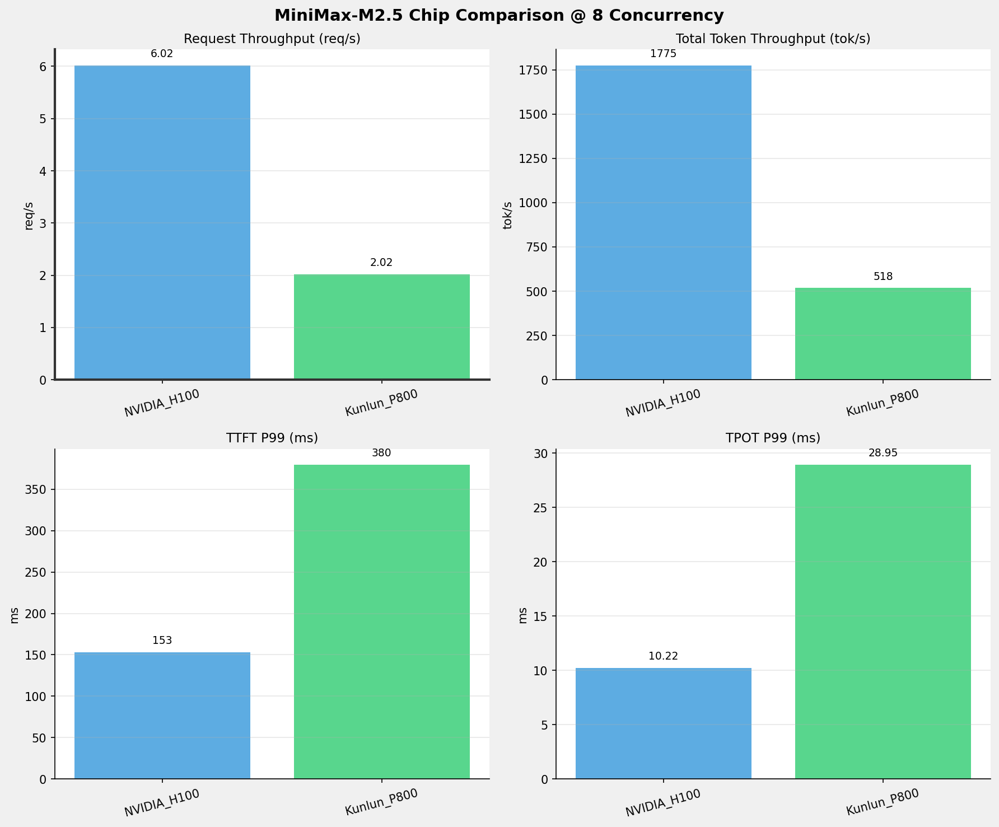
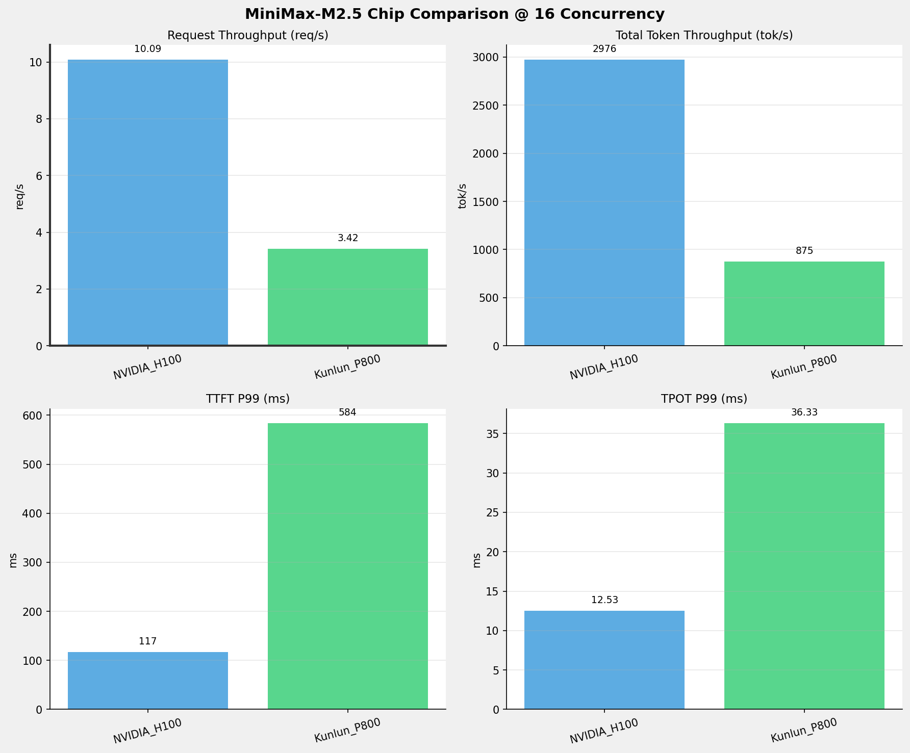
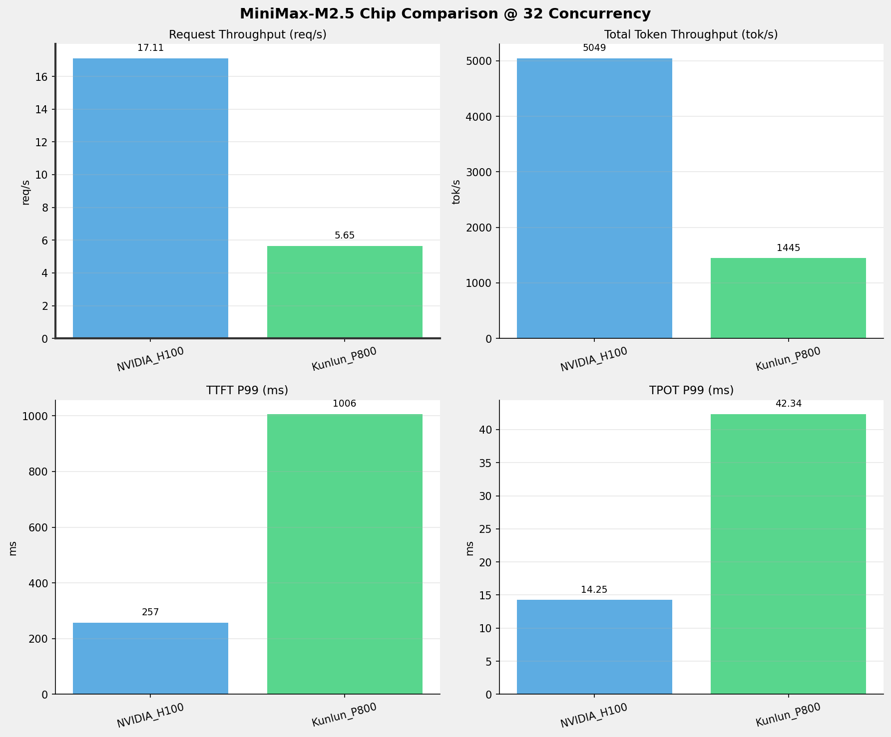
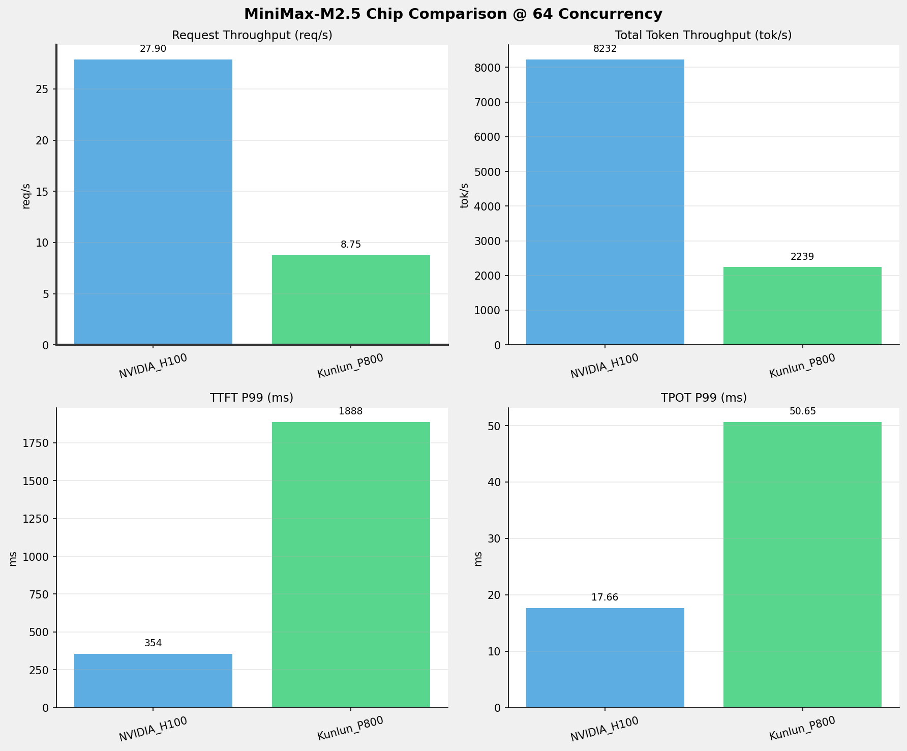
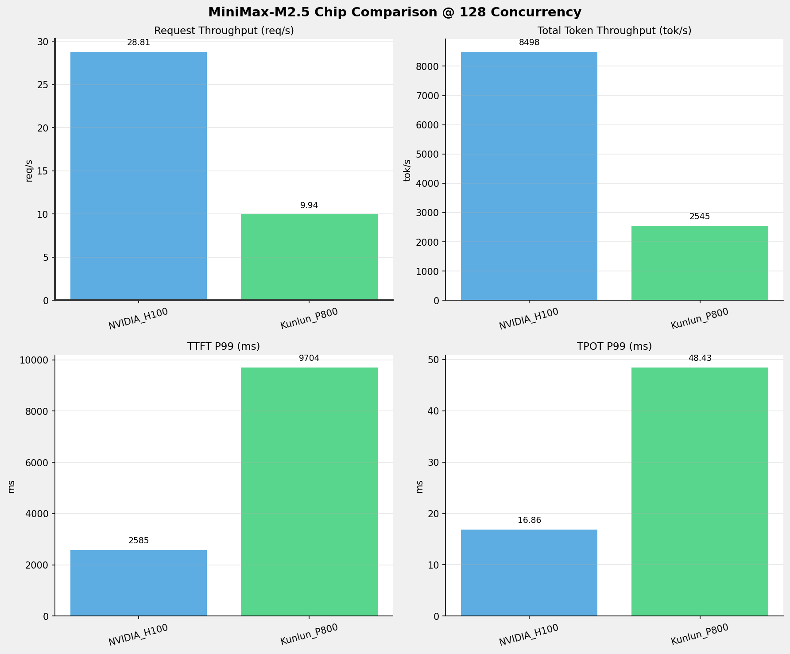
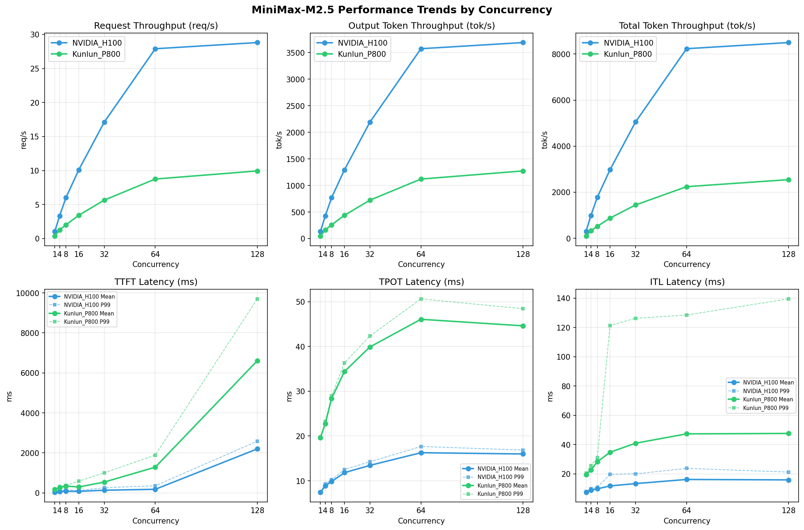

# MiniMax-M2.5模型在不同芯片下的benchmark基准测试报告

**测试日期：** 2026-05-25

---

## 测试场景
在固定请求数，输入上下文和输出上下文长度下，使用vllm bench serve工具对并发数逐级增加场景的性能基准验证。并对比同一模型在不同芯片环境上的性能指标。

**主要采集指标**：

| 指标                  | 单位         | 含义                                 |
|---------------------|------------|------------------------------------|
| TTFT                | ms         | Time To First Token，首 token 延迟     |
| TPOT                | ms/token   | Time Per Output Token，每 token 生成时间 |
| Throughput          | tokens/s   | 系统总吞吐                              |
| QPS                 | requests/s | 请求吞吐                               |
| P50/P95/P99 Latency | ms         | 延迟分位数                              |
    
### 📊 测试概览

| 项目            | 配置                                     | 备注  |
|---------------|----------------------------------------|-----|
| **数据集**       | random                                 |     |
| **并发数**       | 1, 4, 8, 16, 32, 64, 128    |     |
| **总请求数**      | 1000                                    |     |
| **请求输入上下文长度** | 128（0.12k）                             |     |
| **请求输出上下文长度** | 128（0.12k）                             |     |
| **被测芯片**      | NVIDIA_H100, Kunlun_P800 |     |
| **被测模型**      | MiniMax-M2.5 |     |

---

### 🤖 芯片和模型配置信息

| 参数名称 | **NVIDIA_H100** | **Kunlun_P800** |
|----------|----------|----------|
| **max_position_embeddings** | 196608 | 196608 |
| **model_name** | MiniMax-M2.5 | MiniMax-M2.5-W8A8-INT8-Dynamic |
| **model_size** | 215G | 215G |
| **python_version** | 3.12.3 | 3.10.15 |
| **quantization_config** | FP8 | int-8 |
| **temperature** | 1.0 | 1.0 |
| **top_k** | 40 | 40 |
| **top_p** | 0.95 | 0.95 |
| **transformers_version** | 4.46.1 | 4.46.1 |
| **vllm_version** | 0.20.0 | 0.11.0 |

---

### ⚙️ vLLM启动配置信息

| 参数名称 | **NVIDIA_H100** | **Kunlun_P800** |
|----------|----------|----------|
| **Block Size** | default | 128 |
| **Compilation Config** | N/A | {"splitting_ops":["vllm.unified_attention","vllm.unified_attention_with_output","vllm.unified_attention_with_output_kunlun","vllm.mamba_mixer2","vllm.mamba_mixer","vllm.short_conv","vllm.linear_attention","vllm.plamo2_mamba_mixer","vllm.gdn_attention","vllm.sparse_attn_indexer","vllm.sparse_attn_indexer_vllm_kunlun"]} |
| **Dp** | 1 | 1 |
| **Dtype** | default | auto |
| **Enable Auto Tool Choice** | True | True |
| **Enable Export Parallel** | True | False |
| **Gpu Memory Utilization** | 0.85 | 0.95 |
| **Max Model Len** | 196608 | 196608 |
| **Max Num Batched Tokens** | 8192 | 8192 |
| **Max Num Seqs** | 64 | 64 |
| **Model Name** | MiniMax-M2.5 | MiniMax-M2.5-W8A8-INT8-Dynamic |
| **Pp** | 1 | 1 |
| **Reasoning Parser** | minimax_m2 | minimax_m2 (不生效) |
| **Tool Call Parser** | minimax_m2 | minimax_m2 |
| **Tp** | 8 | 8 |

- **NVIDIA_H100**: 英伟达H100标准配置
- **Kunlun_P800**: 昆仑芯不启用专家并行避免通信问题

---

### 📊 芯片性能对比柱状图

**1并发**

**4并发**

**8并发**

**16并发**

**32并发**

**64并发**

**128并发**

### 📈 性能趋势对比图 (所有芯片)

---

### 📈 各指标随并发级别性能对比详情

#### 请求吞吐量（Request throughput (req/s)）

| 并发数 | NVIDIA_H100 | Kunlun_P800 | 差值 | 百分比 |
|-----|----------- | ----------- | ----------- | -----------|
| 1   | 1.03 | 0.37 | -0.66 | -64.1% |
| 4   | 3.34 | 1.27 | -2.07 | -62.0% |
| 8   | 6.02 | 2.02 | -4.00 | -66.4% |
| 16   | 10.09 | 3.42 | -6.67 | -66.1% |
| 32   | 17.11 | 5.65 | -11.46 | -67.0% |
| 64   | 27.90 | 8.75 | -19.15 | -68.6% |
| 128   | 28.81 | 9.94 | -18.87 | -65.5% |

#### 输出token吞吐量（Output token throughput (tok/s)）

| 并发数 | NVIDIA_H100 | Kunlun_P800 | 差值 | 百分比 |
|-----|----------- | ----------- | ----------- | -----------|
| 1   | 132.10 | 47.82 | -84.28 | -63.8% |
| 4   | 427.14 | 162.42 | -264.72 | -62.0% |
| 8   | 770.36 | 259.06 | -511.30 | -66.4% |
| 16   | 1291.07 | 437.59 | -853.48 | -66.1% |
| 32   | 2190.57 | 722.72 | -1467.85 | -67.0% |
| 64   | 3571.65 | 1119.62 | -2452.03 | -68.7% |
| 128   | 3687.40 | 1272.83 | -2414.57 | -65.5% |

#### 总token吞吐量（Total token throughput (tok/s)）

| 并发数 | NVIDIA_H100 | Kunlun_P800 | 差值 | 百分比 |
|-----|----------- | ----------- | ----------- | -----------|
| 1   | 304.45 | 95.63 | -208.82 | -68.6% |
| 4   | 984.42 | 324.95 | -659.47 | -67.0% |
| 8   | 1775.45 | 518.09 | -1257.36 | -70.8% |
| 16   | 2975.50 | 875.22 | -2100.28 | -70.6% |
| 32   | 5048.59 | 1445.33 | -3603.26 | -71.4% |
| 64   | 8231.54 | 2239.07 | -5992.47 | -72.8% |
| 128   | 8498.30 | 2545.47 | -5952.83 | -70.0% |

#### 首token延迟（P99 TTFT (ms)）

| 并发数 | NVIDIA_H100 | Kunlun_P800 | 差值 | 百分比 |
|-----|----------- | ----------- | ----------- | -----------|
| 1   | 29.15 | 184.99 | +155.84 | +534.6% |
| 4   | 105.78 | 323.88 | +218.10 | +206.2% |
| 8   | 153.33 | 379.57 | +226.24 | +147.6% |
| 16   | 116.92 | 584.02 | +467.10 | +399.5% |
| 32   | 256.75 | 1006.26 | +749.51 | +291.9% |
| 64   | 354.30 | 1888.41 | +1534.11 | +433.0% |
| 128   | 2585.21 | 9704.00 | +7118.79 | +275.4% |

#### 每token生成时间（P99 TPOT (ms)）

| 并发数 | NVIDIA_H100 | Kunlun_P800 | 差值 | 百分比 |
|-----|----------- | ----------- | ----------- | -----------|
| 1   | 7.43 | 19.78 | +12.35 | +166.2% |
| 4   | 9.31 | 23.21 | +13.90 | +149.3% |
| 8   | 10.22 | 28.95 | +18.73 | +183.3% |
| 16   | 12.53 | 36.33 | +23.80 | +189.9% |
| 32   | 14.25 | 42.34 | +28.09 | +197.1% |
| 64   | 17.66 | 50.65 | +32.99 | +186.8% |
| 128   | 16.86 | 48.43 | +31.57 | +187.2% |

#### token间延迟（P99 ITL (ms)）

| 并发数 | NVIDIA_H100 | Kunlun_P800 | 差值 | 百分比 |
|-----|----------- | ----------- | ----------- | -----------|
| 1   | 7.81 | 20.48 | +12.67 | +162.2% |
| 4   | 9.81 | 25.54 | +15.73 | +160.3% |
| 8   | 10.83 | 30.85 | +20.02 | +184.9% |
| 16   | 19.61 | 121.22 | +101.61 | +518.2% |
| 32   | 19.96 | 126.23 | +106.27 | +532.4% |
| 64   | 23.73 | 128.44 | +104.71 | +441.3% |
| 128   | 21.18 | 139.48 | +118.30 | +558.5% |

### 📈 各并发级别性能对比详情

### 1 并发

#### 服务基准结果

| 指标 | NVIDIA_H100 | Kunlun_P800 |
|------|----------- | -----------|
| 成功请求数 | 1000 | 1000 |
| 失败请求数 | 0 | 0 |
| 测试持续时间 (s) | 968.95 | 2676.72 |
| 总输入 tokens | 167000 | 127981 |
| 总生成 tokens | 128000 | 128000 |
| **请求吞吐量 (req/s)** | **1.03** ⭐ | 0.37 |
| **输出 token 吞吐量 (tok/s)** | **132.10** ⭐ | 47.82 |
| 峰值输出 token 吞吐量 (tok/s) | **135.00** ⭐ | 52.00 |
| 峰值并发请求数 | 3.00 | 2.00 |
| **总 token 吞吐量 (tok/s)** | **304.45** ⭐ | 95.63 |

#### 首Token延迟 (TTFT)

| 指标 | NVIDIA_H100 | Kunlun_P800 |
|------|----------- | -----------|
| 平均 TTFT (ms) | **26.79** ⭐ | 177.88 |
| 中位 TTFT (ms) | **26.80** ⭐ | 178.41 |
| P95 TTFT (ms) | **28.01** ⭐ | 180.85 |
| P99 TTFT (ms) | **29.15** ⭐ | 184.99 |

#### 每Token生成时间 (TPOT)

| 指标 | NVIDIA_H100 | Kunlun_P800 |
|------|----------- | -----------|
| 平均 TPOT (ms) | **7.42** ⭐ | 19.67 |
| 中位 TPOT (ms) | **7.42** ⭐ | 19.67 |
| P95 TPOT (ms) | **7.42** ⭐ | 19.72 |
| P99 TPOT (ms) | **7.43** ⭐ | 19.78 |

#### Token间延迟 (ITL)

| 指标 | NVIDIA_H100 | Kunlun_P800 |
|------|----------- | -----------|
| 平均 ITL (ms) | **7.36** ⭐ | 19.52 |
| 中位 ITL (ms) | **7.41** ⭐ | 19.65 |
| P95 ITL (ms) | **7.52** ⭐ | 19.81 |
| P99 ITL (ms) | **7.81** ⭐ | 20.48 |

---

### 4 并发

#### 服务基准结果

| 指标 | NVIDIA_H100 | Kunlun_P800 |
|------|----------- | -----------|
| 成功请求数 | 1000 | 1000 |
| 失败请求数 | 0 | 0 |
| 测试持续时间 (s) | 299.67 | 787.46 |
| 总输入 tokens | 167000 | 127981 |
| 总生成 tokens | 128000 | 127901 |
| **请求吞吐量 (req/s)** | **3.34** ⭐ | 1.27 |
| **输出 token 吞吐量 (tok/s)** | **427.14** ⭐ | 162.42 |
| 峰值输出 token 吞吐量 (tok/s) | **460.00** ⭐ | 183.00 |
| 峰值并发请求数 | 8.00 | 8.00 |
| **总 token 吞吐量 (tok/s)** | **984.42** ⭐ | 324.95 |

#### 首Token延迟 (TTFT)

| 指标 | NVIDIA_H100 | Kunlun_P800 |
|------|----------- | -----------|
| 平均 TTFT (ms) | **71.90** ⭐ | 260.62 |
| 中位 TTFT (ms) | **87.54** ⭐ | 302.97 |
| P95 TTFT (ms) | **102.36** ⭐ | 309.24 |
| P99 TTFT (ms) | **105.78** ⭐ | 323.88 |

#### 每Token生成时间 (TPOT)

| 指标 | NVIDIA_H100 | Kunlun_P800 |
|------|----------- | -----------|
| 平均 TPOT (ms) | **8.87** ⭐ | 22.74 |
| 中位 TPOT (ms) | **8.78** ⭐ | 22.66 |
| P95 TPOT (ms) | **9.21** ⭐ | 23.17 |
| P99 TPOT (ms) | **9.31** ⭐ | 23.21 |

#### Token间延迟 (ITL)

| 指标 | NVIDIA_H100 | Kunlun_P800 |
|------|----------- | -----------|
| 平均 ITL (ms) | **8.80** ⭐ | 22.57 |
| 中位 ITL (ms) | **8.78** ⭐ | 22.39 |
| P95 ITL (ms) | **9.08** ⭐ | 22.64 |
| P99 ITL (ms) | **9.81** ⭐ | 25.54 |

---

### 8 并发

#### 服务基准结果

| 指标 | NVIDIA_H100 | Kunlun_P800 |
|------|----------- | -----------|
| 成功请求数 | 1000 | 1000 |
| 失败请求数 | 0 | 0 |
| 测试持续时间 (s) | 166.16 | 494.09 |
| 总输入 tokens | 167000 | 127981 |
| 总生成 tokens | 128000 | 128000 |
| **请求吞吐量 (req/s)** | **6.02** ⭐ | 2.02 |
| **输出 token 吞吐量 (tok/s)** | **770.36** ⭐ | 259.06 |
| 峰值输出 token 吞吐量 (tok/s) | **830.00** ⭐ | 295.00 |
| 峰值并发请求数 | 16.00 | 16.00 |
| **总 token 吞吐量 (tok/s)** | **1775.45** ⭐ | 518.09 |

#### 首Token延迟 (TTFT)

| 指标 | NVIDIA_H100 | Kunlun_P800 |
|------|----------- | -----------|
| 平均 TTFT (ms) | **79.41** ⭐ | 341.57 |
| 中位 TTFT (ms) | **84.88** ⭐ | 370.19 |
| P95 TTFT (ms) | **136.39** ⭐ | 376.94 |
| P99 TTFT (ms) | **153.33** ⭐ | 379.57 |

#### 每Token生成时间 (TPOT)

| 指标 | NVIDIA_H100 | Kunlun_P800 |
|------|----------- | -----------|
| 平均 TPOT (ms) | **9.84** ⭐ | 28.42 |
| 中位 TPOT (ms) | **9.76** ⭐ | 28.37 |
| P95 TPOT (ms) | **10.15** ⭐ | 28.87 |
| P99 TPOT (ms) | **10.22** ⭐ | 28.95 |

#### Token间延迟 (ITL)

| 指标 | NVIDIA_H100 | Kunlun_P800 |
|------|----------- | -----------|
| 平均 ITL (ms) | **9.76** ⭐ | 28.20 |
| 中位 ITL (ms) | **9.77** ⭐ | 28.20 |
| P95 ITL (ms) | **10.11** ⭐ | 28.47 |
| P99 ITL (ms) | **10.83** ⭐ | 30.85 |

---

### 16 并发

#### 服务基准结果

| 指标 | NVIDIA_H100 | Kunlun_P800 |
|------|----------- | -----------|
| 成功请求数 | 1000 | 1000 |
| 失败请求数 | 0 | 0 |
| 测试持续时间 (s) | 99.14 | 292.44 |
| 总输入 tokens | 167000 | 127981 |
| 总生成 tokens | 128000 | 127968 |
| **请求吞吐量 (req/s)** | **10.09** ⭐ | 3.42 |
| **输出 token 吞吐量 (tok/s)** | **1291.07** ⭐ | 437.59 |
| 峰值输出 token 吞吐量 (tok/s) | **1408.00** ⭐ | 524.00 |
| 峰值并发请求数 | 32.00 | 32.00 |
| **总 token 吞吐量 (tok/s)** | **2975.50** ⭐ | 875.22 |

#### 首Token延迟 (TTFT)

| 指标 | NVIDIA_H100 | Kunlun_P800 |
|------|----------- | -----------|
| 平均 TTFT (ms) | **74.88** ⭐ | 294.19 |
| 中位 TTFT (ms) | **88.43** ⭐ | 268.29 |
| P95 TTFT (ms) | **111.18** ⭐ | 521.64 |
| P99 TTFT (ms) | **116.92** ⭐ | 584.02 |

#### 每Token生成时间 (TPOT)

| 指标 | NVIDIA_H100 | Kunlun_P800 |
|------|----------- | -----------|
| 平均 TPOT (ms) | **11.81** ⭐ | 34.39 |
| 中位 TPOT (ms) | **11.80** ⭐ | 34.79 |
| P95 TPOT (ms) | **12.27** ⭐ | 35.71 |
| P99 TPOT (ms) | **12.53** ⭐ | 36.33 |

#### Token间延迟 (ITL)

| 指标 | NVIDIA_H100 | Kunlun_P800 |
|------|----------- | -----------|
| 平均 ITL (ms) | **11.72** ⭐ | 34.72 |
| 中位 ITL (ms) | **11.42** ⭐ | 32.20 |
| P95 ITL (ms) | **12.82** ⭐ | 55.08 |
| P99 ITL (ms) | **19.61** ⭐ | 121.22 |

---

### 32 并发

#### 服务基准结果

| 指标 | NVIDIA_H100 | Kunlun_P800 |
|------|----------- | -----------|
| 成功请求数 | 1000 | 1000 |
| 失败请求数 | 0 | 0 |
| 测试持续时间 (s) | 58.43 | 177.11 |
| 总输入 tokens | 167000 | 127981 |
| 总生成 tokens | 128000 | 128000 |
| **请求吞吐量 (req/s)** | **17.11** ⭐ | 5.65 |
| **输出 token 吞吐量 (tok/s)** | **2190.57** ⭐ | 722.72 |
| 峰值输出 token 吞吐量 (tok/s) | **2459.00** ⭐ | 927.00 |
| 峰值并发请求数 | 64.00 | 64.00 |
| **总 token 吞吐量 (tok/s)** | **5048.59** ⭐ | 1445.33 |

#### 首Token延迟 (TTFT)

| 指标 | NVIDIA_H100 | Kunlun_P800 |
|------|----------- | -----------|
| 平均 TTFT (ms) | **132.11** ⭐ | 539.44 |
| 中位 TTFT (ms) | **144.16** ⭐ | 547.68 |
| P95 TTFT (ms) | **176.25** ⭐ | 994.08 |
| P99 TTFT (ms) | **256.75** ⭐ | 1006.26 |

#### 每Token生成时间 (TPOT)

| 指标 | NVIDIA_H100 | Kunlun_P800 |
|------|----------- | -----------|
| 平均 TPOT (ms) | **13.44** ⭐ | 39.90 |
| 中位 TPOT (ms) | **13.38** ⭐ | 39.96 |
| P95 TPOT (ms) | **14.16** ⭐ | 41.89 |
| P99 TPOT (ms) | **14.25** ⭐ | 42.34 |

#### Token间延迟 (ITL)

| 指标 | NVIDIA_H100 | Kunlun_P800 |
|------|----------- | -----------|
| 平均 ITL (ms) | **13.33** ⭐ | 40.89 |
| 中位 ITL (ms) | **13.42** ⭐ | 36.87 |
| P95 ITL (ms) | **14.05** ⭐ | 74.92 |
| P99 ITL (ms) | **19.96** ⭐ | 126.23 |

---

### 64 并发

#### 服务基准结果

| 指标 | NVIDIA_H100 | Kunlun_P800 |
|------|----------- | -----------|
| 成功请求数 | 1000 | 1000 |
| 失败请求数 | 0 | 0 |
| 测试持续时间 (s) | 35.84 | 114.32 |
| 总输入 tokens | 167000 | 127981 |
| 总生成 tokens | 128000 | 128000 |
| **请求吞吐量 (req/s)** | **27.90** ⭐ | 8.75 |
| **输出 token 吞吐量 (tok/s)** | **3571.65** ⭐ | 1119.62 |
| 峰值输出 token 吞吐量 (tok/s) | **4154.00** ⭐ | 1568.00 |
| 峰值并发请求数 | 128.00 | 128.00 |
| **总 token 吞吐量 (tok/s)** | **8231.54** ⭐ | 2239.07 |

#### 首Token延迟 (TTFT)

| 指标 | NVIDIA_H100 | Kunlun_P800 |
|------|----------- | -----------|
| 平均 TTFT (ms) | **178.35** ⭐ | 1284.38 |
| 中位 TTFT (ms) | **190.92** ⭐ | 1410.86 |
| P95 TTFT (ms) | **302.12** ⭐ | 1795.11 |
| P99 TTFT (ms) | **354.30** ⭐ | 1888.41 |

#### 每Token生成时间 (TPOT)

| 指标 | NVIDIA_H100 | Kunlun_P800 |
|------|----------- | -----------|
| 平均 TPOT (ms) | **16.27** ⭐ | 46.08 |
| 中位 TPOT (ms) | **16.24** ⭐ | 46.08 |
| P95 TPOT (ms) | **17.31** ⭐ | 50.20 |
| P99 TPOT (ms) | **17.66** ⭐ | 50.65 |

#### Token间延迟 (ITL)

| 指标 | NVIDIA_H100 | Kunlun_P800 |
|------|----------- | -----------|
| 平均 ITL (ms) | **16.14** ⭐ | 47.28 |
| 中位 ITL (ms) | **15.96** ⭐ | 43.89 |
| P95 ITL (ms) | **17.16** ⭐ | 59.35 |
| P99 ITL (ms) | **23.73** ⭐ | 128.44 |

---

### 128 并发

#### 服务基准结果

| 指标 | NVIDIA_H100 | Kunlun_P800 |
|------|----------- | -----------|
| 成功请求数 | 1000 | 1000 |
| 失败请求数 | 0 | 0 |
| 测试持续时间 (s) | 34.71 | 100.56 |
| 总输入 tokens | 167000 | 127981 |
| 总生成 tokens | 128000 | 128000 |
| **请求吞吐量 (req/s)** | **28.81** ⭐ | 9.94 |
| **输出 token 吞吐量 (tok/s)** | **3687.40** ⭐ | 1272.83 |
| 峰值输出 token 吞吐量 (tok/s) | **4160.00** ⭐ | 1600.00 |
| 峰值并发请求数 | 192.00 | 192.00 |
| **总 token 吞吐量 (tok/s)** | **8498.30** ⭐ | 2545.47 |

#### 首Token延迟 (TTFT)

| 指标 | NVIDIA_H100 | Kunlun_P800 |
|------|----------- | -----------|
| 平均 TTFT (ms) | **2200.11** ⭐ | 6613.13 |
| 中位 TTFT (ms) | **2326.16** ⭐ | 6804.89 |
| P95 TTFT (ms) | **2581.26** ⭐ | 9204.05 |
| P99 TTFT (ms) | **2585.21** ⭐ | 9704.00 |

#### 每Token生成时间 (TPOT)

| 指标 | NVIDIA_H100 | Kunlun_P800 |
|------|----------- | -----------|
| 平均 TPOT (ms) | **15.99** ⭐ | 44.62 |
| 中位 TPOT (ms) | **16.05** ⭐ | 44.94 |
| P95 TPOT (ms) | **16.55** ⭐ | 47.37 |
| P99 TPOT (ms) | **16.86** ⭐ | 48.43 |

#### Token间延迟 (ITL)

| 指标 | NVIDIA_H100 | Kunlun_P800 |
|------|----------- | -----------|
| 平均 ITL (ms) | **15.86** ⭐ | 47.57 |
| 中位 ITL (ms) | **15.92** ⭐ | 43.87 |
| P95 ITL (ms) | **16.84** ⭐ | 44.77 |
| P99 ITL (ms) | **21.18** ⭐ | 139.48 |

---

---

*报告生成时间: 2026-05-25*

