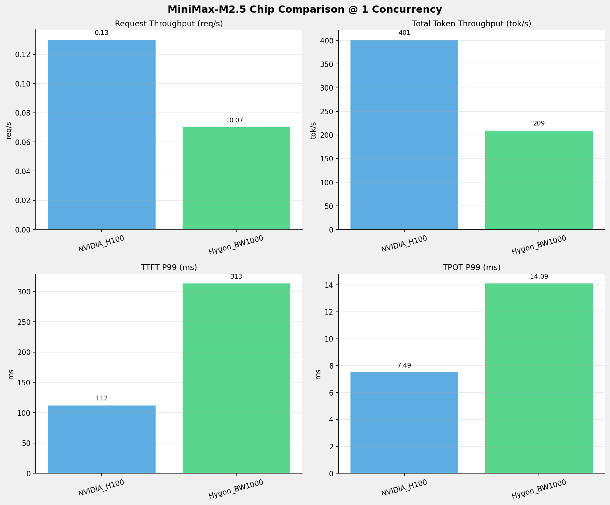
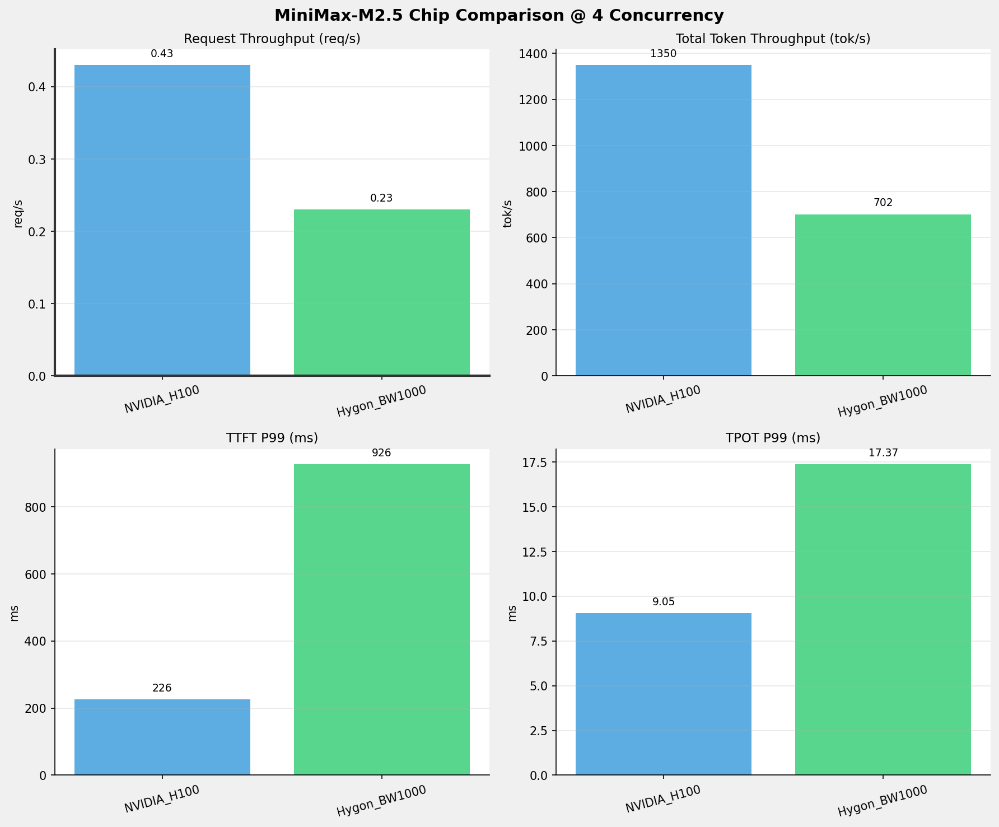
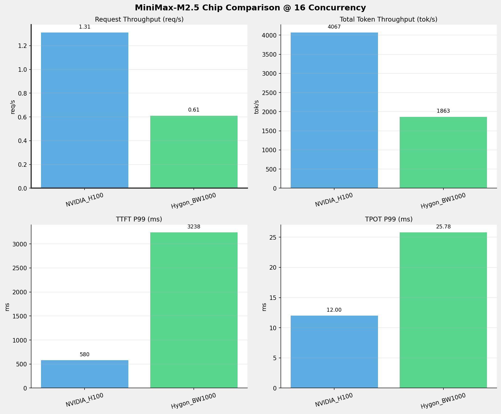
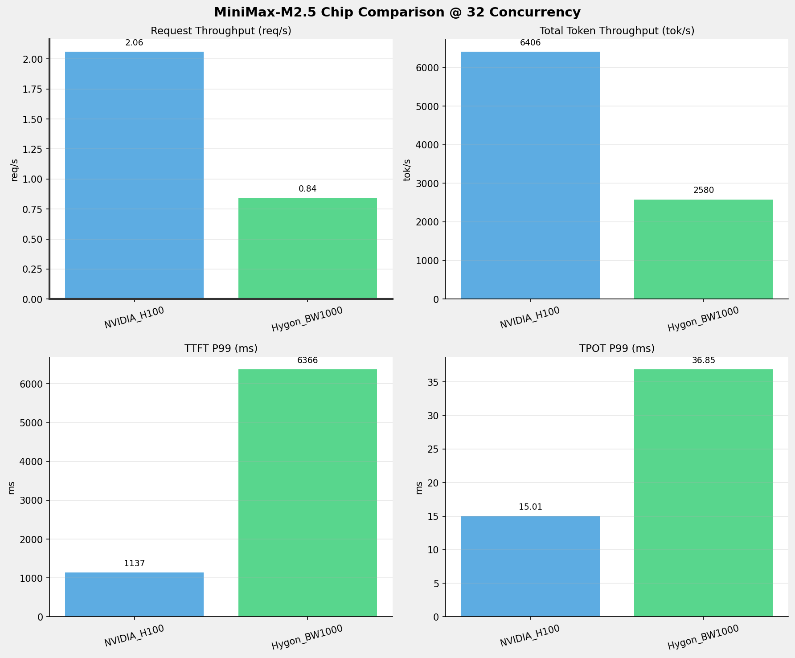
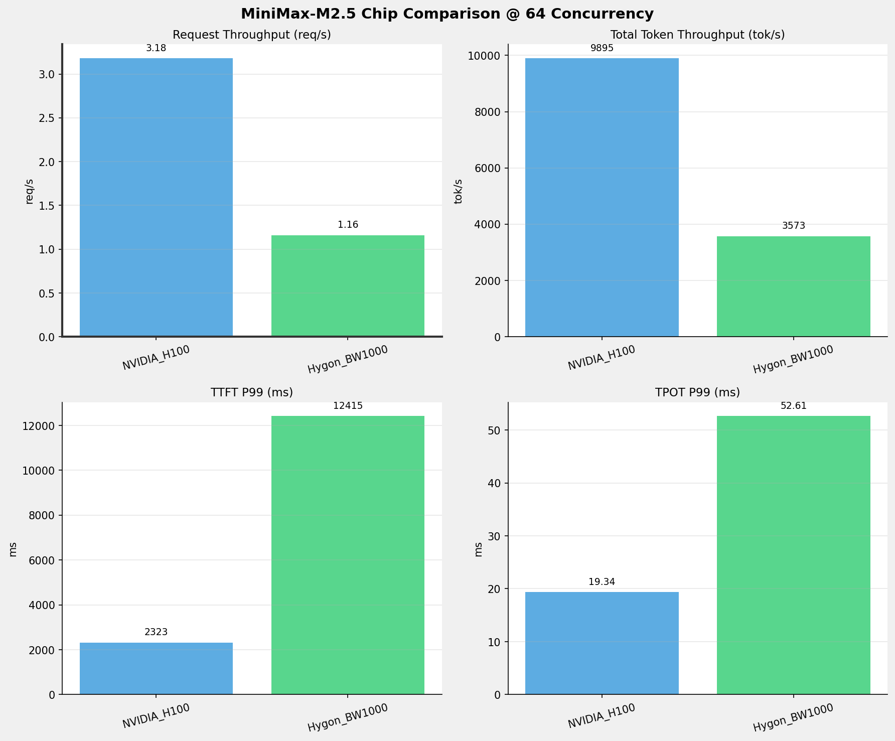
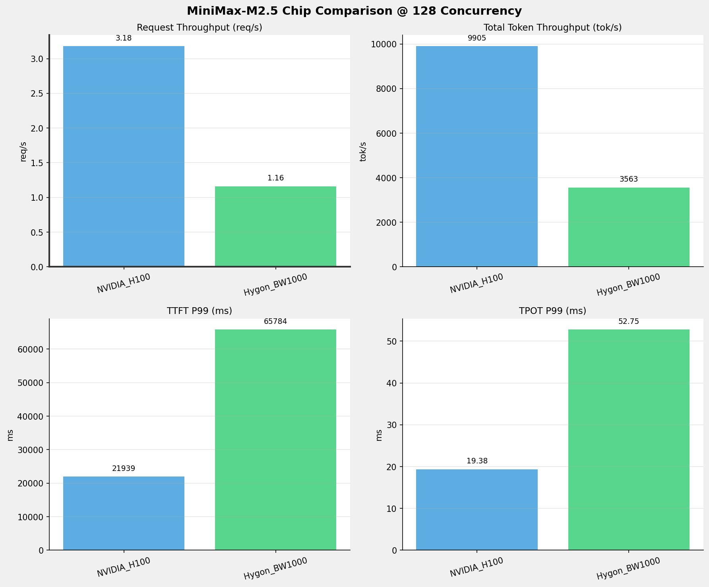
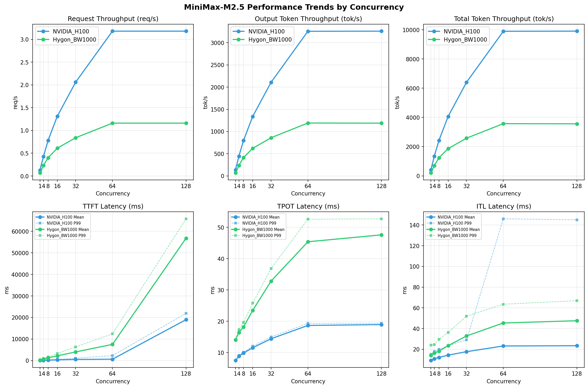

# MiniMax-M2.5模型在不同芯片下的benchmark基准测试报告

**测试日期：** 2026-05-19

---

## 测试场景
在固定请求数，输入上下文和输出上下文长度下，使用vllm bench serve工具对并发数逐级增加场景的性能基准验证。并对比同一模型在不同芯片环境上的性能指标。

**主要采集指标**：

| 指标                  | 单位         | 含义                                 |
|---------------------|------------|------------------------------------|
| TTFT                | ms         | Time To First Token，首 token 延迟     |
| TPOT                | ms/token   | Time Per Output Token，每 token 生成时间 |
| Throughput          | tokens/s   | 系统总吞吐                              |
| QPS                 | requests/s | 请求吞吐                               |
| P50/P95/P99 Latency | ms         | 延迟分位数                              |
    
### 📊 测试概览

| 项目            | 配置                                     | 备注  |
|---------------|----------------------------------------|-----|
| **数据集**       | random                                 |     |
| **并发数**       | 1, 4, 8, 16, 32, 64, 128    |     |
| **总请求数**      | 1000                                    |     |
| **请求输入上下文长度** | 2048（2k）                             |     |
| **请求输出上下文长度** | 1024（1k）                             |     |
| **被测芯片**      | NVIDIA_H100, Hygon_BW1000 |     |
| **被测模型**      | MiniMax-M2.5 |     |

---

### 🤖 芯片和模型配置信息

| 参数名称 | **NVIDIA_H100** | **Hygon_BW1000** |
|----------|----------|----------|
| **max_position_embeddings** | 196608 | 196608 |
| **model_name** | MiniMax-M2.5 | MiniMax-M2.5-W8A8 |
| **model_size** | 215G | 215G |
| **python_version** | 3.12.3 | 3.10.12 |
| **quantization_config** | FP16 | int-8 |
| **temperature** | N/A | N/A |
| **top_k** | N/A | N/A |
| **top_p** | N/A | N/A |
| **transformers_version** | 4.46.1 | 4.57.6 |
| **vllm_version** | 0.15.1 | 0.15.1+das.opt1.alpha.dtk2604 |

---

### ⚙️ vLLM启动配置信息

| 参数名称 | **NVIDIA_H100** | **Hygon_BW1000** |
|----------|----------|----------|
| **Block Size** | default | default |
| **Compilation Config** | N/A | N/A |
| **Dp** | 1 | 1 |
| **Dtype** | default | bfloat16 |
| **Enable Auto Tool Choice** | True | True |
| **Enable Export Parallel** | True | True |
| **Gpu Memory Utilization** | 0.85 | 0.9 |
| **Max Model Len** | 196608 | 196608 |
| **Max Num Batched Tokens** | 8192 | default |
| **Max Num Seqs** | 10 | 64 |
| **Model Name** | MiniMax-M2.5 | MiniMax-M2.5-W8A8 |
| **Pp** | 1 | 1 |
| **Reasoning Parser** | minimax_m2 | minimax_m2 (不生效) |
| **Tool Call Parser** | minimax_m2 | minimax_m2 |
| **Tp** | 8 | 8 |

- **NVIDIA_H100**: 英伟达H100标准配置
- **Hygon_BW1000**: 海光芯片专家并行配置

---

### 📊 芯片性能对比柱状图

**1并发**

**4并发**

**8并发**

**16并发**

**32并发**

**64并发**

**128并发**

### 📈 性能趋势对比图 (所有芯片)

---

### 📈 各指标随并发级别性能对比详情

#### 请求吞吐量（Request throughput (req/s)）

| 并发数 | NVIDIA_H100 | Hygon_BW1000 | 差值 | 百分比 |
|-----|----------- | ----------- | ----------- | -----------|
| 1   | 0.13 | 0.07 | -0.06 | -46.2% |
| 4   | 0.43 | 0.23 | -0.20 | -46.5% |
| 8   | 0.78 | 0.40 | -0.38 | -48.7% |
| 16   | 1.31 | 0.61 | -0.70 | -53.4% |
| 32   | 2.06 | 0.84 | -1.22 | -59.2% |
| 64   | 3.18 | 1.16 | -2.02 | -63.5% |
| 128   | 3.18 | 1.16 | -2.02 | -63.5% |

#### 输出token吞吐量（Output token throughput (tok/s)）

| 并发数 | NVIDIA_H100 | Hygon_BW1000 | 差值 | 百分比 |
|-----|----------- | ----------- | ----------- | -----------|
| 1   | 132.15 | 69.74 | -62.41 | -47.2% |
| 4   | 444.20 | 233.86 | -210.34 | -47.4% |
| 8   | 796.35 | 412.48 | -383.87 | -48.2% |
| 16   | 1338.77 | 621.01 | -717.76 | -53.6% |
| 32   | 2108.53 | 859.95 | -1248.58 | -59.2% |
| 64   | 3257.09 | 1191.04 | -2066.05 | -63.4% |
| 128   | 3260.17 | 1187.72 | -2072.45 | -63.6% |

#### 总token吞吐量（Total token throughput (tok/s)）

| 并发数 | NVIDIA_H100 | Hygon_BW1000 | 差值 | 百分比 |
|-----|----------- | ----------- | ----------- | -----------|
| 1   | 401.49 | 209.22 | -192.27 | -47.9% |
| 4   | 1349.53 | 701.58 | -647.95 | -48.0% |
| 8   | 2419.37 | 1237.45 | -1181.92 | -48.9% |
| 16   | 4067.31 | 1863.04 | -2204.27 | -54.2% |
| 32   | 6405.90 | 2579.86 | -3826.04 | -59.7% |
| 64   | 9895.33 | 3573.13 | -6322.20 | -63.9% |
| 128   | 9904.68 | 3563.15 | -6341.53 | -64.0% |

#### 首token延迟（P99 TTFT (ms)）

| 并发数 | NVIDIA_H100 | Hygon_BW1000 | 差值 | 百分比 |
|-----|----------- | ----------- | ----------- | -----------|
| 1   | 111.86 | 312.85 | +200.99 | +179.7% |
| 4   | 225.74 | 926.46 | +700.72 | +310.4% |
| 8   | 361.65 | 1743.14 | +1381.49 | +382.0% |
| 16   | 579.97 | 3237.66 | +2657.69 | +458.2% |
| 32   | 1137.22 | 6366.01 | +5228.79 | +459.8% |
| 64   | 2322.59 | 12415.20 | +10092.61 | +434.5% |
| 128   | 21939.31 | 65783.50 | +43844.19 | +199.8% |

#### 每token生成时间（P99 TPOT (ms)）

| 并发数 | NVIDIA_H100 | Hygon_BW1000 | 差值 | 百分比 |
|-----|----------- | ----------- | ----------- | -----------|
| 1   | 7.49 | 14.09 | +6.60 | +88.1% |
| 4   | 9.05 | 17.37 | +8.32 | +91.9% |
| 8   | 10.13 | 19.63 | +9.50 | +93.8% |
| 16   | 12.00 | 25.78 | +13.78 | +114.8% |
| 32   | 15.01 | 36.85 | +21.84 | +145.5% |
| 64   | 19.34 | 52.61 | +33.27 | +172.0% |
| 128   | 19.38 | 52.75 | +33.37 | +172.2% |

#### token间延迟（P99 ITL (ms)）

| 并发数 | NVIDIA_H100 | Hygon_BW1000 | 差值 | 百分比 |
|-----|----------- | ----------- | ----------- | -----------|
| 1   | 15.14 | 24.12 | +8.98 | +59.3% |
| 4   | 18.00 | 24.42 | +6.42 | +35.7% |
| 8   | 20.01 | 29.51 | +9.50 | +47.5% |
| 16   | 23.49 | 36.28 | +12.79 | +54.4% |
| 32   | 29.04 | 52.00 | +22.96 | +79.1% |
| 64   | 146.03 | 63.52 | -82.51 | -56.5% |
| 128   | 145.04 | 66.96 | -78.08 | -53.8% |

### 📈 各并发级别性能对比详情

### 1 并发

#### 服务基准结果

| 指标 | NVIDIA_H100 | Hygon_BW1000 |
|------|----------- | -----------|
| 成功请求数 | 1000 | 1000 |
| 失败请求数 | 0 | 0 |
| 测试持续时间 (s) | 7748.68 | 14683.33 |
| 总输入 tokens | 2087000 | 2048000 |
| 总生成 tokens | 1024000 | 1024000 |
| **请求吞吐量 (req/s)** | **0.13** ⭐ | 0.07 |
| **输出 token 吞吐量 (tok/s)** | **132.15** ⭐ | 69.74 |
| 峰值输出 token 吞吐量 (tok/s) | **135.00** ⭐ | 76.00 |
| 峰值并发请求数 | 2.00 | 2.00 |
| **总 token 吞吐量 (tok/s)** | **401.49** ⭐ | 209.22 |

#### 首Token延迟 (TTFT)

| 指标 | NVIDIA_H100 | Hygon_BW1000 |
|------|----------- | -----------|
| 平均 TTFT (ms) | **92.99** ⭐ | 294.97 |
| 中位 TTFT (ms) | **91.64** ⭐ | 294.13 |
| P95 TTFT (ms) | **106.33** ⭐ | 302.67 |
| P99 TTFT (ms) | **111.86** ⭐ | 312.85 |

#### 每Token生成时间 (TPOT)

| 指标 | NVIDIA_H100 | Hygon_BW1000 |
|------|----------- | -----------|
| 平均 TPOT (ms) | **7.48** ⭐ | 14.06 |
| 中位 TPOT (ms) | **7.48** ⭐ | 14.06 |
| P95 TPOT (ms) | **7.49** ⭐ | 14.08 |
| P99 TPOT (ms) | **7.49** ⭐ | 14.09 |

#### Token间延迟 (ITL)

| 指标 | NVIDIA_H100 | Hygon_BW1000 |
|------|----------- | -----------|
| 平均 ITL (ms) | **9.26** ⭐ | 14.13 |
| 中位 ITL (ms) | **7.49** ⭐ | 14.06 |
| P95 ITL (ms) | **15.03** ⭐ | 15.99 |
| P99 ITL (ms) | **15.14** ⭐ | 24.12 |

---

### 4 并发

#### 服务基准结果

| 指标 | NVIDIA_H100 | Hygon_BW1000 |
|------|----------- | -----------|
| 成功请求数 | 1000 | 1000 |
| 失败请求数 | 0 | 0 |
| 测试持续时间 (s) | 2305.24 | 4378.66 |
| 总输入 tokens | 2087000 | 2048000 |
| 总生成 tokens | 1024000 | 1024000 |
| **请求吞吐量 (req/s)** | **0.43** ⭐ | 0.23 |
| **输出 token 吞吐量 (tok/s)** | **444.20** ⭐ | 233.86 |
| 峰值输出 token 吞吐量 (tok/s) | **456.00** ⭐ | 268.00 |
| 峰值并发请求数 | 8.00 | 8.00 |
| **总 token 吞吐量 (tok/s)** | **1349.53** ⭐ | 701.58 |

#### 首Token延迟 (TTFT)

| 指标 | NVIDIA_H100 | Hygon_BW1000 |
|------|----------- | -----------|
| 平均 TTFT (ms) | **170.29** ⭐ | 749.23 |
| 中位 TTFT (ms) | **201.51** ⭐ | 899.87 |
| P95 TTFT (ms) | **217.95** ⭐ | 907.82 |
| P99 TTFT (ms) | **225.74** ⭐ | 926.46 |

#### 每Token生成时间 (TPOT)

| 指标 | NVIDIA_H100 | Hygon_BW1000 |
|------|----------- | -----------|
| 平均 TPOT (ms) | **8.85** ⭐ | 16.39 |
| 中位 TPOT (ms) | **8.86** ⭐ | 16.40 |
| P95 TPOT (ms) | **9.02** ⭐ | 17.16 |
| P99 TPOT (ms) | **9.05** ⭐ | 17.37 |

#### Token间延迟 (ITL)

| 指标 | NVIDIA_H100 | Hygon_BW1000 |
|------|----------- | -----------|
| 平均 ITL (ms) | **10.87** ⭐ | 16.42 |
| 中位 ITL (ms) | **8.89** ⭐ | 16.23 |
| P95 ITL (ms) | **17.79** ⭐ | 18.30 |
| P99 ITL (ms) | **18.00** ⭐ | 24.42 |

---

### 8 并发

#### 服务基准结果

| 指标 | NVIDIA_H100 | Hygon_BW1000 |
|------|----------- | -----------|
| 成功请求数 | 1000 | 1000 |
| 失败请求数 | 0 | 0 |
| 测试持续时间 (s) | 1285.87 | 2482.53 |
| 总输入 tokens | 2087000 | 2048000 |
| 总生成 tokens | 1024000 | 1024000 |
| **请求吞吐量 (req/s)** | **0.78** ⭐ | 0.40 |
| **输出 token 吞吐量 (tok/s)** | **796.35** ⭐ | 412.48 |
| 峰值输出 token 吞吐量 (tok/s) | **824.00** ⭐ | 504.00 |
| 峰值并发请求数 | 16.00 | 16.00 |
| **总 token 吞吐量 (tok/s)** | **2419.37** ⭐ | 1237.45 |

#### 首Token延迟 (TTFT)

| 指标 | NVIDIA_H100 | Hygon_BW1000 |
|------|----------- | -----------|
| 平均 TTFT (ms) | **244.70** ⭐ | 1278.19 |
| 中位 TTFT (ms) | **254.07** ⭐ | 1233.07 |
| P95 TTFT (ms) | **350.59** ⭐ | 1734.36 |
| P99 TTFT (ms) | **361.65** ⭐ | 1743.14 |

#### 每Token生成时间 (TPOT)

| 指标 | NVIDIA_H100 | Hygon_BW1000 |
|------|----------- | -----------|
| 平均 TPOT (ms) | **9.82** ⭐ | 18.16 |
| 中位 TPOT (ms) | **9.81** ⭐ | 18.10 |
| P95 TPOT (ms) | **10.06** ⭐ | 19.23 |
| P99 TPOT (ms) | **10.13** ⭐ | 19.63 |

#### Token间延迟 (ITL)

| 指标 | NVIDIA_H100 | Hygon_BW1000 |
|------|----------- | -----------|
| 平均 ITL (ms) | **12.22** ⭐ | 18.22 |
| 中位 ITL (ms) | **9.88** ⭐ | 17.84 |
| P95 ITL (ms) | **19.61** ⭐ | 20.02 |
| P99 ITL (ms) | **20.01** ⭐ | 29.51 |

---

### 16 并发

#### 服务基准结果

| 指标 | NVIDIA_H100 | Hygon_BW1000 |
|------|----------- | -----------|
| 成功请求数 | 1000 | 1000 |
| 失败请求数 | 0 | 0 |
| 测试持续时间 (s) | 764.88 | 1648.92 |
| 总输入 tokens | 2087000 | 2048000 |
| 总生成 tokens | 1024000 | 1024000 |
| **请求吞吐量 (req/s)** | **1.31** ⭐ | 0.61 |
| **输出 token 吞吐量 (tok/s)** | **1338.77** ⭐ | 621.01 |
| 峰值输出 token 吞吐量 (tok/s) | **1428.00** ⭐ | 800.00 |
| 峰值并发请求数 | 32.00 | 32.00 |
| **总 token 吞吐量 (tok/s)** | **4067.31** ⭐ | 1863.04 |

#### 首Token延迟 (TTFT)

| 指标 | NVIDIA_H100 | Hygon_BW1000 |
|------|----------- | -----------|
| 平均 TTFT (ms) | **361.06** ⭐ | 2230.18 |
| 中位 TTFT (ms) | **351.40** ⭐ | 2161.61 |
| P95 TTFT (ms) | **566.81** ⭐ | 3229.39 |
| P99 TTFT (ms) | **579.97** ⭐ | 3237.66 |

#### 每Token生成时间 (TPOT)

| 指标 | NVIDIA_H100 | Hygon_BW1000 |
|------|----------- | -----------|
| 平均 TPOT (ms) | **11.53** ⭐ | 23.46 |
| 中位 TPOT (ms) | **11.56** ⭐ | 23.36 |
| P95 TPOT (ms) | **11.90** ⭐ | 25.23 |
| P99 TPOT (ms) | **12.00** ⭐ | 25.78 |

#### Token间延迟 (ITL)

| 指标 | NVIDIA_H100 | Hygon_BW1000 |
|------|----------- | -----------|
| 平均 ITL (ms) | **14.35** ⭐ | 23.49 |
| 中位 ITL (ms) | **11.54** ⭐ | 22.65 |
| P95 ITL (ms) | **22.85** ⭐ | 24.23 |
| P99 ITL (ms) | **23.49** ⭐ | 36.28 |

---

### 32 并发

#### 服务基准结果

| 指标 | NVIDIA_H100 | Hygon_BW1000 |
|------|----------- | -----------|
| 成功请求数 | 1000 | 1000 |
| 失败请求数 | 0 | 0 |
| 测试持续时间 (s) | 485.65 | 1190.76 |
| 总输入 tokens | 2087000 | 2048000 |
| 总生成 tokens | 1024000 | 1024000 |
| **请求吞吐量 (req/s)** | **2.06** ⭐ | 0.84 |
| **输出 token 吞吐量 (tok/s)** | **2108.53** ⭐ | 859.95 |
| 峰值输出 token 吞吐量 (tok/s) | **2336.00** ⭐ | 1152.00 |
| 峰值并发请求数 | 64.00 | 64.00 |
| **总 token 吞吐量 (tok/s)** | **6405.90** ⭐ | 2579.86 |

#### 首Token延迟 (TTFT)

| 指标 | NVIDIA_H100 | Hygon_BW1000 |
|------|----------- | -----------|
| 平均 TTFT (ms) | **554.30** ⭐ | 4025.14 |
| 中位 TTFT (ms) | **594.54** ⭐ | 4016.23 |
| P95 TTFT (ms) | **734.33** ⭐ | 6358.74 |
| P99 TTFT (ms) | **1137.22** ⭐ | 6366.01 |

#### 每Token生成时间 (TPOT)

| 指标 | NVIDIA_H100 | Hygon_BW1000 |
|------|----------- | -----------|
| 平均 TPOT (ms) | **14.41** ⭐ | 32.84 |
| 中位 TPOT (ms) | **14.43** ⭐ | 32.78 |
| P95 TPOT (ms) | **14.87** ⭐ | 36.13 |
| P99 TPOT (ms) | **15.01** ⭐ | 36.85 |

#### Token间延迟 (ITL)

| 指标 | NVIDIA_H100 | Hygon_BW1000 |
|------|----------- | -----------|
| 平均 ITL (ms) | **17.70** ⭐ | 32.87 |
| 中位 ITL (ms) | **14.07** ⭐ | 30.71 |
| P95 ITL (ms) | **28.06** ⭐ | 36.42 |
| P99 ITL (ms) | **29.04** ⭐ | 52.00 |

---

### 64 并发

#### 服务基准结果

| 指标 | NVIDIA_H100 | Hygon_BW1000 |
|------|----------- | -----------|
| 成功请求数 | 1000 | 1000 |
| 失败请求数 | 0 | 0 |
| 测试持续时间 (s) | 314.39 | 859.75 |
| 总输入 tokens | 2087000 | 2048000 |
| 总生成 tokens | 1024000 | 1024000 |
| **请求吞吐量 (req/s)** | **3.18** ⭐ | 1.16 |
| **输出 token 吞吐量 (tok/s)** | **3257.09** ⭐ | 1191.04 |
| 峰值输出 token 吞吐量 (tok/s) | **3776.00** ⭐ | 1740.00 |
| 峰值并发请求数 | 111.00 | 128.00 |
| **总 token 吞吐量 (tok/s)** | **9895.33** ⭐ | 3573.13 |

#### 首Token延迟 (TTFT)

| 指标 | NVIDIA_H100 | Hygon_BW1000 |
|------|----------- | -----------|
| 平均 TTFT (ms) | **660.47** ⭐ | 7529.39 |
| 中位 TTFT (ms) | **593.05** ⭐ | 7727.77 |
| P95 TTFT (ms) | **1025.05** ⭐ | 12402.07 |
| P99 TTFT (ms) | **2322.59** ⭐ | 12415.20 |

#### 每Token生成时间 (TPOT)

| 指标 | NVIDIA_H100 | Hygon_BW1000 |
|------|----------- | -----------|
| 平均 TPOT (ms) | **18.66** ⭐ | 45.40 |
| 中位 TPOT (ms) | **18.78** ⭐ | 45.09 |
| P95 TPOT (ms) | **19.16** ⭐ | 52.05 |
| P99 TPOT (ms) | **19.34** ⭐ | 52.61 |

#### Token间延迟 (ITL)

| 指标 | NVIDIA_H100 | Hygon_BW1000 |
|------|----------- | -----------|
| 平均 ITL (ms) | **23.20** ⭐ | 45.41 |
| 中位 ITL (ms) | **17.41** ⭐ | 41.20 |
| P95 ITL (ms) | **34.97** ⭐ | 48.77 |
| P99 ITL (ms) | 146.03 | **63.52** ⭐ |

---

### 128 并发

#### 服务基准结果

| 指标 | NVIDIA_H100 | Hygon_BW1000 |
|------|----------- | -----------|
| 成功请求数 | 1000 | 1000 |
| 失败请求数 | 0 | 0 |
| 测试持续时间 (s) | 314.09 | 862.16 |
| 总输入 tokens | 2087000 | 2048000 |
| 总生成 tokens | 1024000 | 1024000 |
| **请求吞吐量 (req/s)** | **3.18** ⭐ | 1.16 |
| **输出 token 吞吐量 (tok/s)** | **3260.17** ⭐ | 1187.72 |
| 峰值输出 token 吞吐量 (tok/s) | **3776.00** ⭐ | 1664.00 |
| 峰值并发请求数 | 158.00 | 180.00 |
| **总 token 吞吐量 (tok/s)** | **9904.68** ⭐ | 3563.15 |

#### 首Token延迟 (TTFT)

| 指标 | NVIDIA_H100 | Hygon_BW1000 |
|------|----------- | -----------|
| 平均 TTFT (ms) | **18998.53** ⭐ | 56760.85 |
| 中位 TTFT (ms) | **20131.73** ⭐ | 59337.51 |
| P95 TTFT (ms) | **20465.99** ⭐ | 64824.12 |
| P99 TTFT (ms) | **21939.31** ⭐ | 65783.50 |

#### 每Token生成时间 (TPOT)

| 指标 | NVIDIA_H100 | Hygon_BW1000 |
|------|----------- | -----------|
| 平均 TPOT (ms) | **18.94** ⭐ | 47.61 |
| 中位 TPOT (ms) | **19.09** ⭐ | 48.01 |
| P95 TPOT (ms) | **19.35** ⭐ | 52.51 |
| P99 TPOT (ms) | **19.38** ⭐ | 52.75 |

#### Token间延迟 (ITL)

| 指标 | NVIDIA_H100 | Hygon_BW1000 |
|------|----------- | -----------|
| 平均 ITL (ms) | **23.47** ⭐ | 47.58 |
| 中位 ITL (ms) | **17.44** ⭐ | 41.24 |
| P95 ITL (ms) | **35.02** ⭐ | 48.58 |
| P99 ITL (ms) | 145.04 | **66.96** ⭐ |

---

---

*报告生成时间: 2026-05-19*

