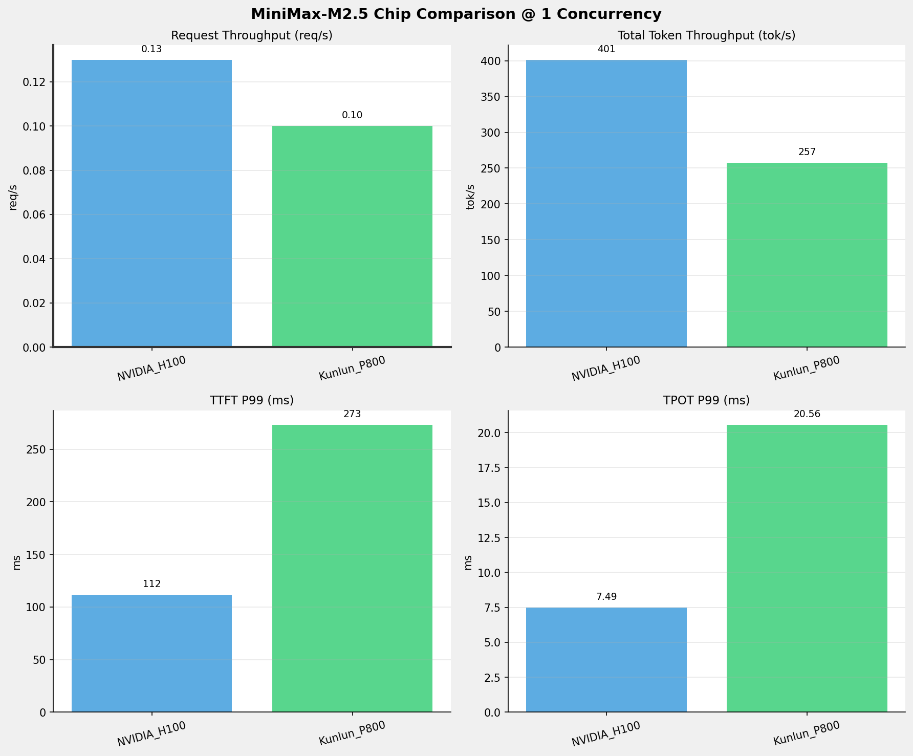
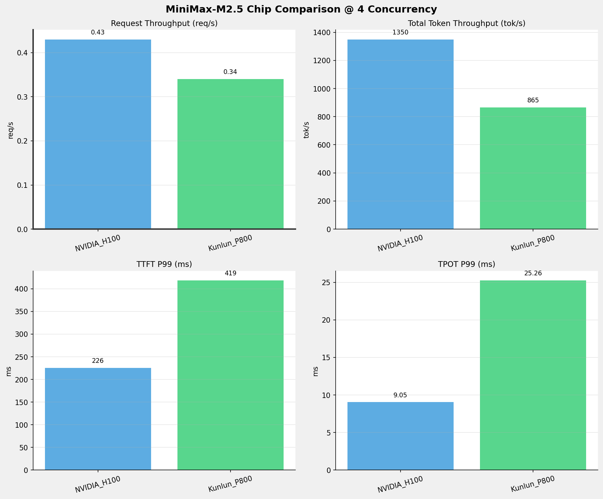
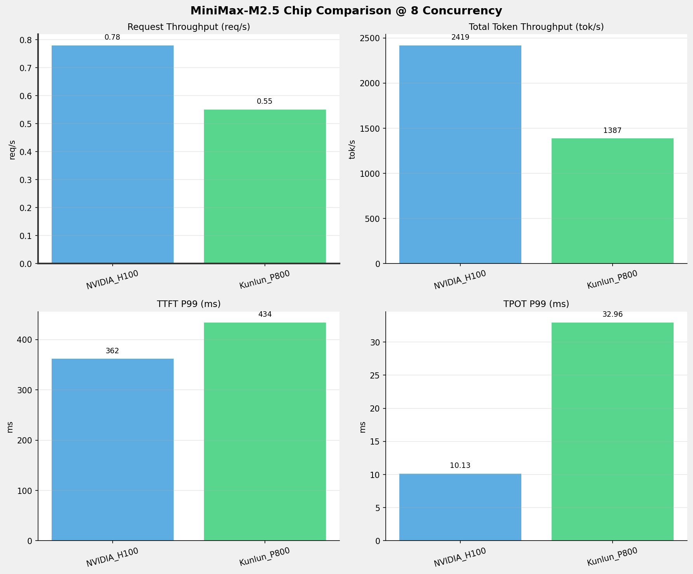
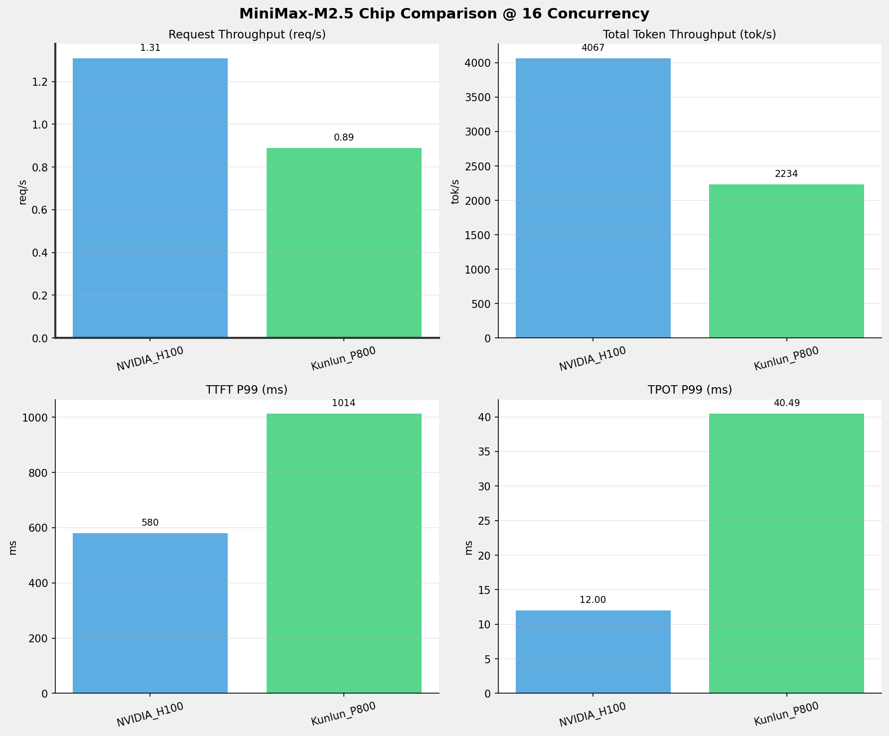
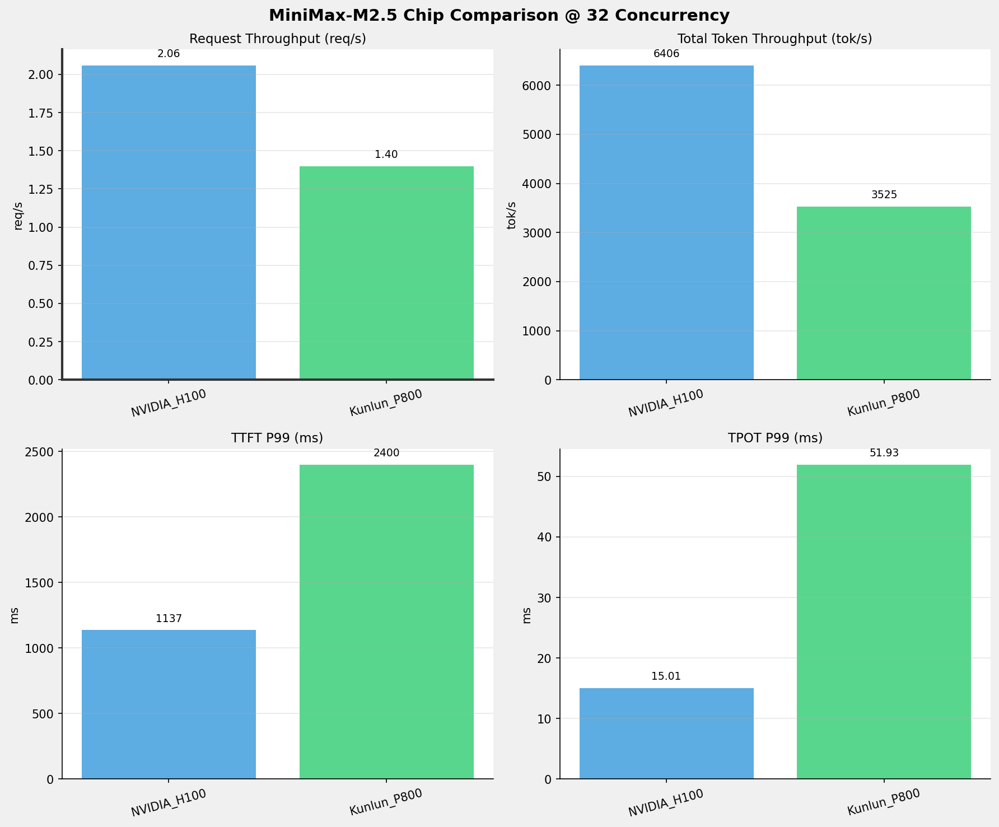
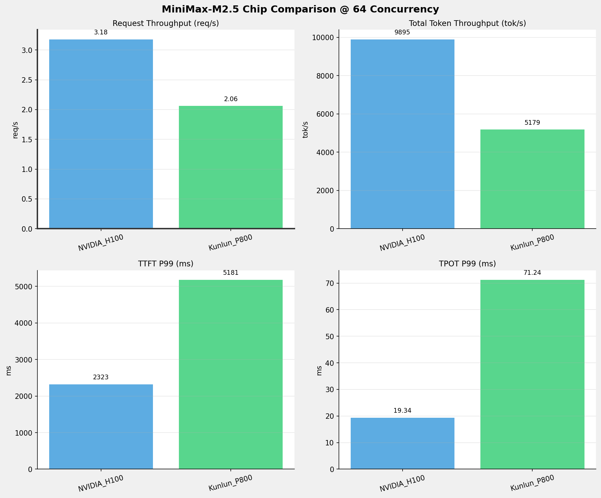
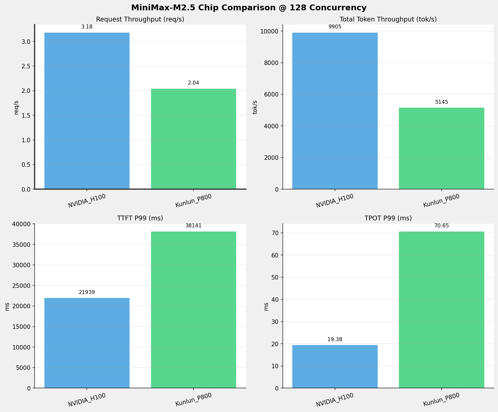
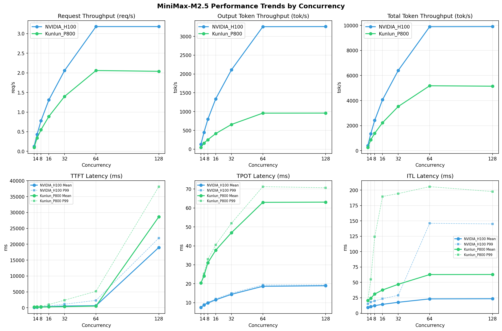

# MiniMax-M2.5模型在不同芯片下的benchmark基准测试报告

**测试日期：** 2026-05-19

---

## 测试场景
在固定请求数，输入上下文和输出上下文长度下，使用vllm bench serve工具对并发数逐级增加场景的性能基准验证。并对比同一模型在不同芯片环境上的性能指标。

**主要采集指标**：

| 指标                  | 单位         | 含义                                 |
|---------------------|------------|------------------------------------|
| TTFT                | ms         | Time To First Token，首 token 延迟     |
| TPOT                | ms/token   | Time Per Output Token，每 token 生成时间 |
| Throughput          | tokens/s   | 系统总吞吐                              |
| QPS                 | requests/s | 请求吞吐                               |
| P50/P95/P99 Latency | ms         | 延迟分位数                              |
    
### 📊 测试概览

| 项目            | 配置                                     | 备注  |
|---------------|----------------------------------------|-----|
| **数据集**       | random                                 |     |
| **并发数**       | 1, 4, 8, 16, 32, 64, 128    |     |
| **总请求数**      | 1000                                    |     |
| **请求输入上下文长度** | 2048（2k）                             |     |
| **请求输出上下文长度** | 1024（1k）                             |     |
| **被测芯片**      | NVIDIA_H100, Kunlun_P800 |     |
| **被测模型**      | MiniMax-M2.5 |     |

---

### 🤖 芯片和模型配置信息

| 参数名称 | **NVIDIA_H100** | **Kunlun_P800** |
|----------|----------|----------|
| **max_position_embeddings** | 196608 | 196608 |
| **model_name** | MiniMax-M2.5 | MiniMax-M2.5-W8A8-INT8-Dynamic |
| **model_size** | 215G | 215G |
| **python_version** | 3.12.3 | 3.10.15 |
| **quantization_config** | FP16 | int-8 |
| **temperature** | N/A | 1.0 |
| **top_k** | N/A | 40 |
| **top_p** | N/A | 0.95 |
| **transformers_version** | 4.46.1 | 4.46.1 |
| **vllm_version** | 0.15.1 | 0.11.0 |

---

### ⚙️ vLLM启动配置信息

| 参数名称 | **NVIDIA_H100** | **Kunlun_P800** |
|----------|----------|----------|
| **Block Size** | default | 128 |
| **Compilation Config** | N/A | {"splitting_ops":["vllm.unified_attention","vllm.unified_attention_with_output","vllm.unified_attention_with_output_kunlun","vllm.mamba_mixer2","vllm.mamba_mixer","vllm.short_conv","vllm.linear_attention","vllm.plamo2_mamba_mixer","vllm.gdn_attention","vllm.sparse_attn_indexer","vllm.sparse_attn_indexer_vllm_kunlun"]} |
| **Dp** | 1 | 1 |
| **Dtype** | default | auto |
| **Enable Auto Tool Choice** | True | True |
| **Enable Export Parallel** | True | False |
| **Gpu Memory Utilization** | 0.85 | 0.95 |
| **Max Model Len** | 196608 | 196608 |
| **Max Num Batched Tokens** | 8192 | 8192 |
| **Max Num Seqs** | 10 | 64 |
| **Model Name** | MiniMax-M2.5 | MiniMax-M2.5-W8A8-INT8-Dynamic |
| **Pp** | 1 | 1 |
| **Reasoning Parser** | minimax_m2 | minimax_m2 (不生效) |
| **Tool Call Parser** | minimax_m2 | minimax_m2 |
| **Tp** | 8 | 8 |

- **NVIDIA_H100**: 英伟达H100标准配置
- **Kunlun_P800**: 昆仑芯不启用专家并行避免通信问题

---

### 📊 芯片性能对比柱状图

**1并发**

**4并发**

**8并发**

**16并发**

**32并发**

**64并发**

**128并发**

### 📈 性能趋势对比图 (所有芯片)

---

### 📈 各指标随并发级别性能对比详情

#### 请求吞吐量（Request throughput (req/s)）

| 并发数 | NVIDIA_H100 | Kunlun_P800 | 差值 | 百分比 |
|-----|----------- | ----------- | ----------- | -----------|
| 1   | 0.13 | 0.10 | -0.03 | -23.1% |
| 4   | 0.43 | 0.34 | -0.09 | -20.9% |
| 8   | 0.78 | 0.55 | -0.23 | -29.5% |
| 16   | 1.31 | 0.89 | -0.42 | -32.1% |
| 32   | 2.06 | 1.40 | -0.66 | -32.0% |
| 64   | 3.18 | 2.06 | -1.12 | -35.2% |
| 128   | 3.18 | 2.04 | -1.14 | -35.8% |

#### 输出token吞吐量（Output token throughput (tok/s)）

| 并发数 | NVIDIA_H100 | Kunlun_P800 | 差值 | 百分比 |
|-----|----------- | ----------- | ----------- | -----------|
| 1   | 132.15 | 47.79 | -84.36 | -63.8% |
| 4   | 444.20 | 162.02 | -282.18 | -63.5% |
| 8   | 796.35 | 252.90 | -543.45 | -68.2% |
| 16   | 1338.77 | 415.84 | -922.93 | -68.9% |
| 32   | 2108.53 | 657.56 | -1450.97 | -68.8% |
| 64   | 3257.09 | 959.29 | -2297.80 | -70.5% |
| 128   | 3260.17 | 960.51 | -2299.66 | -70.5% |

#### 总token吞吐量（Total token throughput (tok/s)）

| 并发数 | NVIDIA_H100 | Kunlun_P800 | 差值 | 百分比 |
|-----|----------- | ----------- | ----------- | -----------|
| 1   | 401.49 | 257.41 | -144.08 | -35.9% |
| 4   | 1349.53 | 865.05 | -484.48 | -35.9% |
| 8   | 2419.37 | 1386.84 | -1032.53 | -42.7% |
| 16   | 4067.31 | 2233.97 | -1833.34 | -45.1% |
| 32   | 6405.90 | 3525.41 | -2880.49 | -45.0% |
| 64   | 9895.33 | 5178.85 | -4716.48 | -47.7% |
| 128   | 9904.68 | 5145.30 | -4759.38 | -48.1% |

#### 首token延迟（P99 TTFT (ms)）

| 并发数 | NVIDIA_H100 | Kunlun_P800 | 差值 | 百分比 |
|-----|----------- | ----------- | ----------- | -----------|
| 1   | 111.86 | 273.32 | +161.46 | +144.3% |
| 4   | 225.74 | 418.58 | +192.84 | +85.4% |
| 8   | 361.65 | 434.00 | +72.35 | +20.0% |
| 16   | 579.97 | 1013.51 | +433.54 | +74.8% |
| 32   | 1137.22 | 2400.05 | +1262.83 | +111.0% |
| 64   | 2322.59 | 5180.56 | +2857.97 | +123.1% |
| 128   | 21939.31 | 38140.98 | +16201.67 | +73.8% |

#### 每token生成时间（P99 TPOT (ms)）

| 并发数 | NVIDIA_H100 | Kunlun_P800 | 差值 | 百分比 |
|-----|----------- | ----------- | ----------- | -----------|
| 1   | 7.49 | 20.56 | +13.07 | +174.5% |
| 4   | 9.05 | 25.26 | +16.21 | +179.1% |
| 8   | 10.13 | 32.96 | +22.83 | +225.4% |
| 16   | 12.00 | 40.49 | +28.49 | +237.4% |
| 32   | 15.01 | 51.93 | +36.92 | +246.0% |
| 64   | 19.34 | 71.24 | +51.90 | +268.4% |
| 128   | 19.38 | 70.65 | +51.27 | +264.6% |

#### token间延迟（P99 ITL (ms)）

| 并发数 | NVIDIA_H100 | Kunlun_P800 | 差值 | 百分比 |
|-----|----------- | ----------- | ----------- | -----------|
| 1   | 15.14 | 21.06 | +5.92 | +39.1% |
| 4   | 18.00 | 54.91 | +36.91 | +205.1% |
| 8   | 20.01 | 124.17 | +104.16 | +520.5% |
| 16   | 23.49 | 189.61 | +166.12 | +707.2% |
| 32   | 29.04 | 194.35 | +165.31 | +569.2% |
| 64   | 146.03 | 205.61 | +59.58 | +40.8% |
| 128   | 145.04 | 197.58 | +52.54 | +36.2% |

### 📈 各并发级别性能对比详情

### 1 并发

#### 服务基准结果

| 指标 | NVIDIA_H100 | Kunlun_P800 |
|------|----------- | -----------|
| 成功请求数 | 1000 | 1000 |
| 失败请求数 | 0 | 0 |
| 测试持续时间 (s) | 7748.68 | 9764.27 |
| 总输入 tokens | 2087000 | 2046732 |
| 总生成 tokens | 1024000 | 466656 |
| **请求吞吐量 (req/s)** | **0.13** ⭐ | 0.10 |
| **输出 token 吞吐量 (tok/s)** | **132.15** ⭐ | 47.79 |
| 峰值输出 token 吞吐量 (tok/s) | **135.00** ⭐ | 51.00 |
| 峰值并发请求数 | 2.00 | 2.00 |
| **总 token 吞吐量 (tok/s)** | **401.49** ⭐ | 257.41 |

#### 首Token延迟 (TTFT)

| 指标 | NVIDIA_H100 | Kunlun_P800 |
|------|----------- | -----------|
| 平均 TTFT (ms) | **92.99** ⭐ | 234.07 |
| 中位 TTFT (ms) | **91.64** ⭐ | 207.26 |
| P95 TTFT (ms) | **106.33** ⭐ | 271.90 |
| P99 TTFT (ms) | **111.86** ⭐ | 273.32 |

#### 每Token生成时间 (TPOT)

| 指标 | NVIDIA_H100 | Kunlun_P800 |
|------|----------- | -----------|
| 平均 TPOT (ms) | **7.48** ⭐ | 20.45 |
| 中位 TPOT (ms) | **7.48** ⭐ | 20.44 |
| P95 TPOT (ms) | **7.49** ⭐ | 20.54 |
| P99 TPOT (ms) | **7.49** ⭐ | 20.56 |

#### Token间延迟 (ITL)

| 指标 | NVIDIA_H100 | Kunlun_P800 |
|------|----------- | -----------|
| 平均 ITL (ms) | **9.26** ⭐ | 20.46 |
| 中位 ITL (ms) | **7.49** ⭐ | 20.44 |
| P95 ITL (ms) | **15.03** ⭐ | 20.70 |
| P99 ITL (ms) | **15.14** ⭐ | 21.06 |

---

### 4 并发

#### 服务基准结果

| 指标 | NVIDIA_H100 | Kunlun_P800 |
|------|----------- | -----------|
| 成功请求数 | 1000 | 1000 |
| 失败请求数 | 0 | 0 |
| 测试持续时间 (s) | 2305.24 | 2911.30 |
| 总输入 tokens | 2087000 | 2046732 |
| 总生成 tokens | 1024000 | 471680 |
| **请求吞吐量 (req/s)** | **0.43** ⭐ | 0.34 |
| **输出 token 吞吐量 (tok/s)** | **444.20** ⭐ | 162.02 |
| 峰值输出 token 吞吐量 (tok/s) | **456.00** ⭐ | 176.00 |
| 峰值并发请求数 | 8.00 | 7.00 |
| **总 token 吞吐量 (tok/s)** | **1349.53** ⭐ | 865.05 |

#### 首Token延迟 (TTFT)

| 指标 | NVIDIA_H100 | Kunlun_P800 |
|------|----------- | -----------|
| 平均 TTFT (ms) | **170.29** ⭐ | 241.04 |
| 中位 TTFT (ms) | **201.51** ⭐ | 217.80 |
| P95 TTFT (ms) | **217.95** ⭐ | 282.74 |
| P99 TTFT (ms) | **225.74** ⭐ | 418.58 |

#### 每Token生成时间 (TPOT)

| 指标 | NVIDIA_H100 | Kunlun_P800 |
|------|----------- | -----------|
| 平均 TPOT (ms) | **8.85** ⭐ | 24.11 |
| 中位 TPOT (ms) | **8.86** ⭐ | 24.06 |
| P95 TPOT (ms) | **9.02** ⭐ | 24.82 |
| P99 TPOT (ms) | **9.05** ⭐ | 25.26 |

#### Token间延迟 (ITL)

| 指标 | NVIDIA_H100 | Kunlun_P800 |
|------|----------- | -----------|
| 平均 ITL (ms) | **10.87** ⭐ | 24.24 |
| 中位 ITL (ms) | **8.89** ⭐ | 23.30 |
| P95 ITL (ms) | **17.79** ⭐ | 23.64 |
| P99 ITL (ms) | **18.00** ⭐ | 54.91 |

---

### 8 并发

#### 服务基准结果

| 指标 | NVIDIA_H100 | Kunlun_P800 |
|------|----------- | -----------|
| 成功请求数 | 1000 | 1000 |
| 失败请求数 | 0 | 0 |
| 测试持续时间 (s) | 1285.87 | 1804.98 |
| 总输入 tokens | 2087000 | 2046732 |
| 总生成 tokens | 1024000 | 456485 |
| **请求吞吐量 (req/s)** | **0.78** ⭐ | 0.55 |
| **输出 token 吞吐量 (tok/s)** | **796.35** ⭐ | 252.90 |
| 峰值输出 token 吞吐量 (tok/s) | **824.00** ⭐ | 281.00 |
| 峰值并发请求数 | 16.00 | 11.00 |
| **总 token 吞吐量 (tok/s)** | **2419.37** ⭐ | 1386.84 |

#### 首Token延迟 (TTFT)

| 指标 | NVIDIA_H100 | Kunlun_P800 |
|------|----------- | -----------|
| 平均 TTFT (ms) | **244.70** ⭐ | 247.14 |
| 中位 TTFT (ms) | 254.07 | **240.26** ⭐ |
| P95 TTFT (ms) | 350.59 | **305.99** ⭐ |
| P99 TTFT (ms) | **361.65** ⭐ | 434.00 |

#### 每Token生成时间 (TPOT)

| 指标 | NVIDIA_H100 | Kunlun_P800 |
|------|----------- | -----------|
| 平均 TPOT (ms) | **9.82** ⭐ | 31.05 |
| 中位 TPOT (ms) | **9.81** ⭐ | 30.92 |
| P95 TPOT (ms) | **10.06** ⭐ | 32.27 |
| P99 TPOT (ms) | **10.13** ⭐ | 32.96 |

#### Token间延迟 (ITL)

| 指标 | NVIDIA_H100 | Kunlun_P800 |
|------|----------- | -----------|
| 平均 ITL (ms) | **12.22** ⭐ | 31.12 |
| 中位 ITL (ms) | **9.88** ⭐ | 29.20 |
| P95 ITL (ms) | **19.61** ⭐ | 29.85 |
| P99 ITL (ms) | **20.01** ⭐ | 124.17 |

---

### 16 并发

#### 服务基准结果

| 指标 | NVIDIA_H100 | Kunlun_P800 |
|------|----------- | -----------|
| 成功请求数 | 1000 | 1000 |
| 失败请求数 | 0 | 0 |
| 测试持续时间 (s) | 764.88 | 1125.74 |
| 总输入 tokens | 2087000 | 2046732 |
| 总生成 tokens | 1024000 | 468132 |
| **请求吞吐量 (req/s)** | **1.31** ⭐ | 0.89 |
| **输出 token 吞吐量 (tok/s)** | **1338.77** ⭐ | 415.84 |
| 峰值输出 token 吞吐量 (tok/s) | **1428.00** ⭐ | 481.00 |
| 峰值并发请求数 | 32.00 | 20.00 |
| **总 token 吞吐量 (tok/s)** | **4067.31** ⭐ | 2233.97 |

#### 首Token延迟 (TTFT)

| 指标 | NVIDIA_H100 | Kunlun_P800 |
|------|----------- | -----------|
| 平均 TTFT (ms) | 361.06 | **285.00** ⭐ |
| 中位 TTFT (ms) | 351.40 | **287.48** ⭐ |
| P95 TTFT (ms) | 566.81 | **424.82** ⭐ |
| P99 TTFT (ms) | **579.97** ⭐ | 1013.51 |

#### 每Token生成时间 (TPOT)

| 指标 | NVIDIA_H100 | Kunlun_P800 |
|------|----------- | -----------|
| 平均 TPOT (ms) | **11.53** ⭐ | 37.68 |
| 中位 TPOT (ms) | **11.56** ⭐ | 37.34 |
| P95 TPOT (ms) | **11.90** ⭐ | 39.92 |
| P99 TPOT (ms) | **12.00** ⭐ | 40.49 |

#### Token间延迟 (ITL)

| 指标 | NVIDIA_H100 | Kunlun_P800 |
|------|----------- | -----------|
| 平均 ITL (ms) | **14.35** ⭐ | 37.68 |
| 中位 ITL (ms) | **11.54** ⭐ | 33.97 |
| P95 ITL (ms) | **22.85** ⭐ | 56.55 |
| P99 ITL (ms) | **23.49** ⭐ | 189.61 |

---

### 32 并发

#### 服务基准结果

| 指标 | NVIDIA_H100 | Kunlun_P800 |
|------|----------- | -----------|
| 成功请求数 | 1000 | 1000 |
| 失败请求数 | 0 | 0 |
| 测试持续时间 (s) | 485.65 | 713.68 |
| 总输入 tokens | 2087000 | 2046732 |
| 总生成 tokens | 1024000 | 469286 |
| **请求吞吐量 (req/s)** | **2.06** ⭐ | 1.40 |
| **输出 token 吞吐量 (tok/s)** | **2108.53** ⭐ | 657.56 |
| 峰值输出 token 吞吐量 (tok/s) | **2336.00** ⭐ | 833.00 |
| 峰值并发请求数 | 64.00 | 37.00 |
| **总 token 吞吐量 (tok/s)** | **6405.90** ⭐ | 3525.41 |

#### 首Token延迟 (TTFT)

| 指标 | NVIDIA_H100 | Kunlun_P800 |
|------|----------- | -----------|
| 平均 TTFT (ms) | 554.30 | **351.85** ⭐ |
| 中位 TTFT (ms) | 594.54 | **276.04** ⭐ |
| P95 TTFT (ms) | 734.33 | **447.77** ⭐ |
| P99 TTFT (ms) | **1137.22** ⭐ | 2400.05 |

#### 每Token生成时间 (TPOT)

| 指标 | NVIDIA_H100 | Kunlun_P800 |
|------|----------- | -----------|
| 平均 TPOT (ms) | **14.41** ⭐ | 46.92 |
| 中位 TPOT (ms) | **14.43** ⭐ | 46.21 |
| P95 TPOT (ms) | **14.87** ⭐ | 50.88 |
| P99 TPOT (ms) | **15.01** ⭐ | 51.93 |

#### Token间延迟 (ITL)

| 指标 | NVIDIA_H100 | Kunlun_P800 |
|------|----------- | -----------|
| 平均 ITL (ms) | **17.70** ⭐ | 46.93 |
| 中位 ITL (ms) | **14.07** ⭐ | 39.58 |
| P95 ITL (ms) | **28.06** ⭐ | 127.56 |
| P99 ITL (ms) | **29.04** ⭐ | 194.35 |

---

### 64 并发

#### 服务基准结果

| 指标 | NVIDIA_H100 | Kunlun_P800 |
|------|----------- | -----------|
| 成功请求数 | 1000 | 1000 |
| 失败请求数 | 0 | 0 |
| 测试持续时间 (s) | 314.39 | 485.06 |
| 总输入 tokens | 2087000 | 2046732 |
| 总生成 tokens | 1024000 | 465313 |
| **请求吞吐量 (req/s)** | **3.18** ⭐ | 2.06 |
| **输出 token 吞吐量 (tok/s)** | **3257.09** ⭐ | 959.29 |
| 峰值输出 token 吞吐量 (tok/s) | **3776.00** ⭐ | 1408.00 |
| 峰值并发请求数 | 111.00 | 71.00 |
| **总 token 吞吐量 (tok/s)** | **9895.33** ⭐ | 5178.85 |

#### 首Token延迟 (TTFT)

| 指标 | NVIDIA_H100 | Kunlun_P800 |
|------|----------- | -----------|
| 平均 TTFT (ms) | 660.47 | **537.33** ⭐ |
| 中位 TTFT (ms) | 593.05 | **303.23** ⭐ |
| P95 TTFT (ms) | **1025.05** ⭐ | 2354.81 |
| P99 TTFT (ms) | **2322.59** ⭐ | 5180.56 |

#### 每Token生成时间 (TPOT)

| 指标 | NVIDIA_H100 | Kunlun_P800 |
|------|----------- | -----------|
| 平均 TPOT (ms) | **18.66** ⭐ | 62.95 |
| 中位 TPOT (ms) | **18.78** ⭐ | 61.03 |
| P95 TPOT (ms) | **19.16** ⭐ | 70.26 |
| P99 TPOT (ms) | **19.34** ⭐ | 71.24 |

#### Token间延迟 (ITL)

| 指标 | NVIDIA_H100 | Kunlun_P800 |
|------|----------- | -----------|
| 平均 ITL (ms) | **23.20** ⭐ | 62.74 |
| 中位 ITL (ms) | **17.41** ⭐ | 48.86 |
| P95 ITL (ms) | **34.97** ⭐ | 197.31 |
| P99 ITL (ms) | **146.03** ⭐ | 205.61 |

---

### 128 并发

#### 服务基准结果

| 指标 | NVIDIA_H100 | Kunlun_P800 |
|------|----------- | -----------|
| 成功请求数 | 1000 | 1000 |
| 失败请求数 | 0 | 0 |
| 测试持续时间 (s) | 314.09 | 489.09 |
| 总输入 tokens | 2087000 | 2046732 |
| 总生成 tokens | 1024000 | 469772 |
| **请求吞吐量 (req/s)** | **3.18** ⭐ | 2.04 |
| **输出 token 吞吐量 (tok/s)** | **3260.17** ⭐ | 960.51 |
| 峰值输出 token 吞吐量 (tok/s) | **3776.00** ⭐ | 1345.00 |
| 峰值并发请求数 | 158.00 | 135.00 |
| **总 token 吞吐量 (tok/s)** | **9904.68** ⭐ | 5145.30 |

#### 首Token延迟 (TTFT)

| 指标 | NVIDIA_H100 | Kunlun_P800 |
|------|----------- | -----------|
| 平均 TTFT (ms) | **18998.53** ⭐ | 28635.89 |
| 中位 TTFT (ms) | **20131.73** ⭐ | 30492.71 |
| P95 TTFT (ms) | **20465.99** ⭐ | 33900.32 |
| P99 TTFT (ms) | **21939.31** ⭐ | 38140.98 |

#### 每Token生成时间 (TPOT)

| 指标 | NVIDIA_H100 | Kunlun_P800 |
|------|----------- | -----------|
| 平均 TPOT (ms) | **18.94** ⭐ | 63.07 |
| 中位 TPOT (ms) | **19.09** ⭐ | 61.45 |
| P95 TPOT (ms) | **19.35** ⭐ | 69.76 |
| P99 TPOT (ms) | **19.38** ⭐ | 70.65 |

#### Token间延迟 (ITL)

| 指标 | NVIDIA_H100 | Kunlun_P800 |
|------|----------- | -----------|
| 平均 ITL (ms) | **23.47** ⭐ | 62.85 |
| 中位 ITL (ms) | **17.44** ⭐ | 48.91 |
| P95 ITL (ms) | **35.02** ⭐ | 192.64 |
| P99 ITL (ms) | **145.04** ⭐ | 197.58 |

---

---

*报告生成时间: 2026-05-19*

