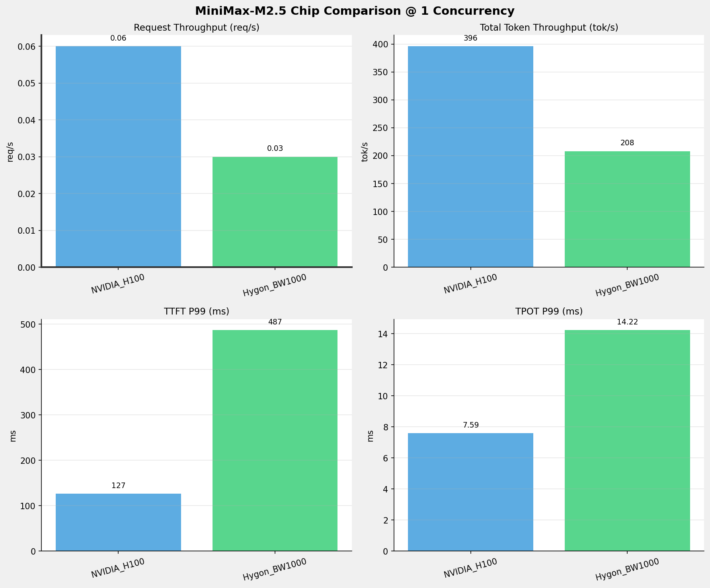
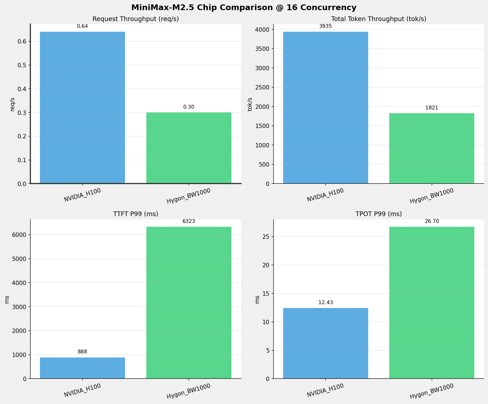
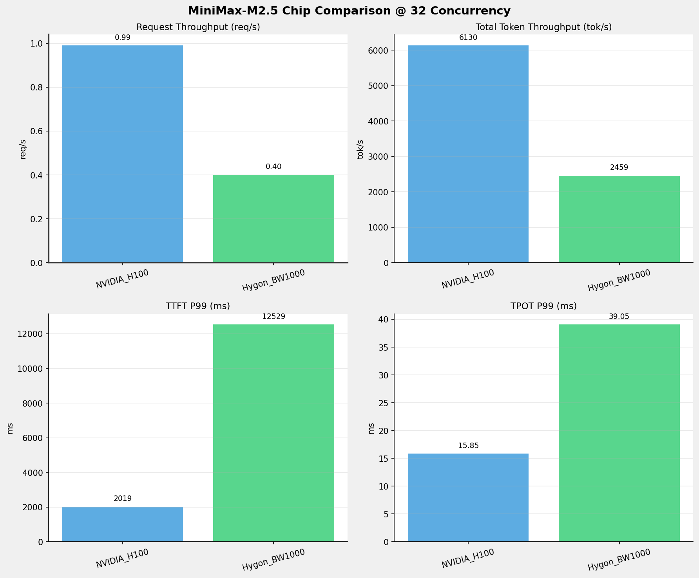
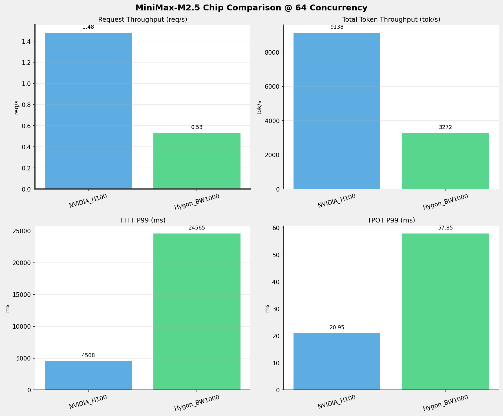
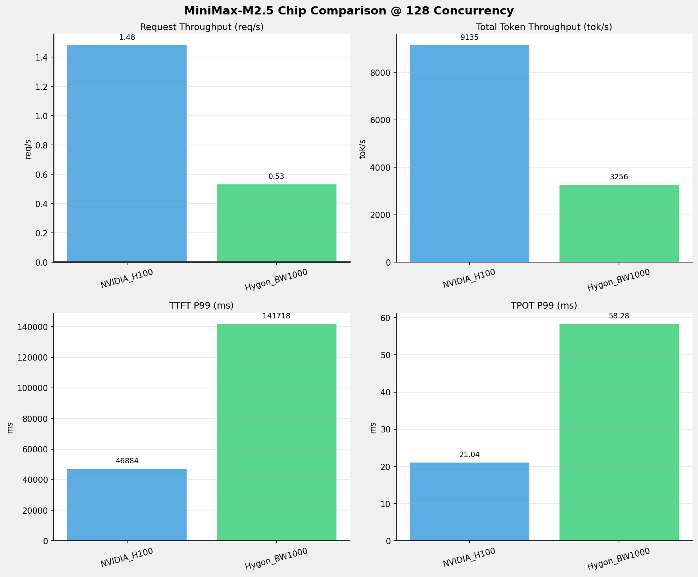
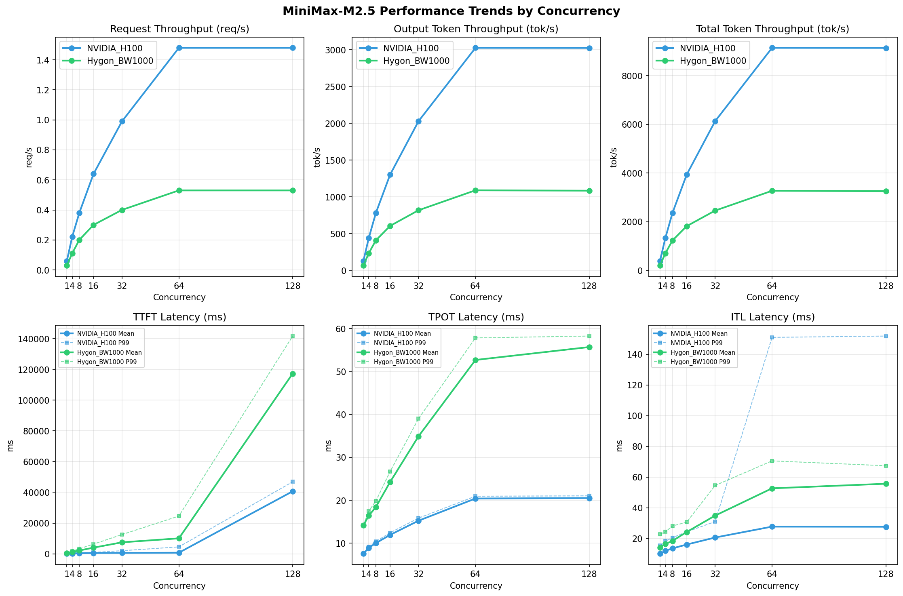

# MiniMax-M2.5模型在不同芯片下的benchmark基准测试报告

**测试日期：** 2026-05-19

---

## 测试场景
在固定请求数，输入上下文和输出上下文长度下，使用vllm bench serve工具对并发数逐级增加场景的性能基准验证。并对比同一模型在不同芯片环境上的性能指标。

**主要采集指标**：

| 指标                  | 单位         | 含义                                 |
|---------------------|------------|------------------------------------|
| TTFT                | ms         | Time To First Token，首 token 延迟     |
| TPOT                | ms/token   | Time Per Output Token，每 token 生成时间 |
| Throughput          | tokens/s   | 系统总吞吐                              |
| QPS                 | requests/s | 请求吞吐                               |
| P50/P95/P99 Latency | ms         | 延迟分位数                              |
    
### 📊 测试概览

| 项目            | 配置                                     | 备注  |
|---------------|----------------------------------------|-----|
| **数据集**       | random                                 |     |
| **并发数**       | 1, 4, 8, 16, 32, 64, 128    |     |
| **总请求数**      | 1000                                    |     |
| **请求输入上下文长度** | 4096（4k）                             |     |
| **请求输出上下文长度** | 2048（2k）                             |     |
| **被测芯片**      | NVIDIA_H100, Hygon_BW1000 |     |
| **被测模型**      | MiniMax-M2.5 |     |

---

### 🤖 芯片和模型配置信息

| 参数名称 | **NVIDIA_H100** | **Hygon_BW1000** |
|----------|----------|----------|
| **max_position_embeddings** | 196608 | 196608 |
| **model_name** | MiniMax-M2.5 | MiniMax-M2.5-W8A8 |
| **model_size** | 215G | 215G |
| **python_version** | 3.12.3 | 3.10.12 |
| **quantization_config** | FP16 | int-8 |
| **temperature** | N/A | N/A |
| **top_k** | N/A | N/A |
| **top_p** | N/A | N/A |
| **transformers_version** | 4.46.1 | 4.57.6 |
| **vllm_version** | 0.15.1 | 0.15.1+das.opt1.alpha.dtk2604 |

---

### ⚙️ vLLM启动配置信息

| 参数名称 | **NVIDIA_H100** | **Hygon_BW1000** |
|----------|----------|----------|
| **Block Size** | default | default |
| **Compilation Config** | N/A | N/A |
| **Dp** | 1 | 1 |
| **Dtype** | default | bfloat16 |
| **Enable Auto Tool Choice** | True | True |
| **Enable Export Parallel** | True | True |
| **Gpu Memory Utilization** | 0.85 | 0.9 |
| **Max Model Len** | 196608 | 196608 |
| **Max Num Batched Tokens** | 8192 | default |
| **Max Num Seqs** | 10 | 64 |
| **Model Name** | MiniMax-M2.5 | MiniMax-M2.5-W8A8 |
| **Pp** | 1 | 1 |
| **Reasoning Parser** | minimax_m2 | minimax_m2 (不生效) |
| **Tool Call Parser** | minimax_m2 | minimax_m2 |
| **Tp** | 8 | 8 |

- **NVIDIA_H100**: 英伟达H100标准配置
- **Hygon_BW1000**: 海光芯片专家并行配置

---

### 📊 芯片性能对比柱状图

**1并发**

**4并发**

**8并发**

**16并发**

**32并发**

**64并发**

**128并发**

### 📈 性能趋势对比图 (所有芯片)

---

### 📈 各指标随并发级别性能对比详情

#### 请求吞吐量（Request throughput (req/s)）

| 并发数 | NVIDIA_H100 | Hygon_BW1000 | 差值 | 百分比 |
|-----|----------- | ----------- | ----------- | -----------|
| 1   | 0.06 | 0.03 | -0.03 | -50.0% |
| 4   | 0.22 | 0.11 | -0.11 | -50.0% |
| 8   | 0.38 | 0.20 | -0.18 | -47.4% |
| 16   | 0.64 | 0.30 | -0.34 | -53.1% |
| 32   | 0.99 | 0.40 | -0.59 | -59.6% |
| 64   | 1.48 | 0.53 | -0.95 | -64.2% |
| 128   | 1.48 | 0.53 | -0.95 | -64.2% |

#### 输出token吞吐量（Output token throughput (tok/s)）

| 并发数 | NVIDIA_H100 | Hygon_BW1000 | 差值 | 百分比 |
|-----|----------- | ----------- | ----------- | -----------|
| 1   | 131.17 | 69.33 | -61.84 | -47.1% |
| 4   | 441.66 | 235.07 | -206.59 | -46.8% |
| 8   | 782.67 | 410.74 | -371.93 | -47.5% |
| 16   | 1303.31 | 606.90 | -696.41 | -53.4% |
| 32   | 2030.40 | 819.67 | -1210.73 | -59.6% |
| 64   | 3026.85 | 1090.61 | -1936.24 | -64.0% |
| 128   | 3025.82 | 1085.44 | -1940.38 | -64.1% |

#### 总token吞吐量（Total token throughput (tok/s)）

| 并发数 | NVIDIA_H100 | Hygon_BW1000 | 差值 | 百分比 |
|-----|----------- | ----------- | ----------- | -----------|
| 1   | 396.00 | 208.00 | -188.00 | -47.5% |
| 4   | 1333.39 | 705.21 | -628.18 | -47.1% |
| 8   | 2362.93 | 1232.21 | -1130.72 | -47.9% |
| 16   | 3934.74 | 1820.71 | -2114.03 | -53.7% |
| 32   | 6129.87 | 2459.01 | -3670.86 | -59.9% |
| 64   | 9138.18 | 3271.82 | -5866.36 | -64.2% |
| 128   | 9135.07 | 3256.32 | -5878.75 | -64.4% |

#### 首token延迟（P99 TTFT (ms)）

| 并发数 | NVIDIA_H100 | Hygon_BW1000 | 差值 | 百分比 |
|-----|----------- | ----------- | ----------- | -----------|
| 1   | 126.64 | 486.84 | +360.20 | +284.4% |
| 4   | 347.71 | 1701.32 | +1353.61 | +389.3% |
| 8   | 625.36 | 3283.34 | +2657.98 | +425.0% |
| 16   | 887.67 | 6322.58 | +5434.91 | +612.3% |
| 32   | 2019.10 | 12529.02 | +10509.92 | +520.5% |
| 64   | 4507.91 | 24565.33 | +20057.42 | +444.9% |
| 128   | 46883.70 | 141717.58 | +94833.88 | +202.3% |

#### 每token生成时间（P99 TPOT (ms)）

| 并发数 | NVIDIA_H100 | Hygon_BW1000 | 差值 | 百分比 |
|-----|----------- | ----------- | ----------- | -----------|
| 1   | 7.59 | 14.22 | +6.63 | +87.4% |
| 4   | 9.15 | 17.47 | +8.32 | +90.9% |
| 8   | 10.40 | 19.84 | +9.44 | +90.8% |
| 16   | 12.43 | 26.70 | +14.27 | +114.8% |
| 32   | 15.85 | 39.05 | +23.20 | +146.4% |
| 64   | 20.95 | 57.85 | +36.90 | +176.1% |
| 128   | 21.04 | 58.28 | +37.24 | +177.0% |

#### token间延迟（P99 ITL (ms)）

| 并发数 | NVIDIA_H100 | Hygon_BW1000 | 差值 | 百分比 |
|-----|----------- | ----------- | ----------- | -----------|
| 1   | 15.39 | 22.92 | +7.53 | +48.9% |
| 4   | 18.28 | 24.31 | +6.03 | +33.0% |
| 8   | 20.56 | 28.19 | +7.63 | +37.1% |
| 16   | 24.37 | 30.67 | +6.30 | +25.9% |
| 32   | 31.03 | 54.58 | +23.55 | +75.9% |
| 64   | 151.06 | 70.60 | -80.46 | -53.3% |
| 128   | 151.92 | 67.44 | -84.48 | -55.6% |

### 📈 各并发级别性能对比详情

### 1 并发

#### 服务基准结果

| 指标 | NVIDIA_H100 | Hygon_BW1000 |
|------|----------- | -----------|
| 成功请求数 | 1000 | 1000 |
| 失败请求数 | 0 | 0 |
| 测试持续时间 (s) | 15613.65 | 29538.10 |
| 总输入 tokens | 4135000 | 4096000 |
| 总生成 tokens | 2048000 | 2048000 |
| **请求吞吐量 (req/s)** | **0.06** ⭐ | 0.03 |
| **输出 token 吞吐量 (tok/s)** | **131.17** ⭐ | 69.33 |
| 峰值输出 token 吞吐量 (tok/s) | **134.00** ⭐ | 78.00 |
| 峰值并发请求数 | 2.00 | 2.00 |
| **总 token 吞吐量 (tok/s)** | **396.00** ⭐ | 208.00 |

#### 首Token延迟 (TTFT)

| 指标 | NVIDIA_H100 | Hygon_BW1000 |
|------|----------- | -----------|
| 平均 TTFT (ms) | **114.66** ⭐ | 470.67 |
| 中位 TTFT (ms) | **114.06** ⭐ | 471.40 |
| P95 TTFT (ms) | **121.61** ⭐ | 477.67 |
| P99 TTFT (ms) | **126.64** ⭐ | 486.84 |

#### 每Token生成时间 (TPOT)

| 指标 | NVIDIA_H100 | Hygon_BW1000 |
|------|----------- | -----------|
| 平均 TPOT (ms) | **7.57** ⭐ | 14.20 |
| 中位 TPOT (ms) | **7.57** ⭐ | 14.20 |
| P95 TPOT (ms) | **7.58** ⭐ | 14.21 |
| P99 TPOT (ms) | **7.59** ⭐ | 14.22 |

#### Token间延迟 (ITL)

| 指标 | NVIDIA_H100 | Hygon_BW1000 |
|------|----------- | -----------|
| 平均 ITL (ms) | **10.17** ⭐ | 14.25 |
| 中位 ITL (ms) | **7.59** ⭐ | 14.20 |
| P95 ITL (ms) | **15.21** ⭐ | 15.96 |
| P99 ITL (ms) | **15.39** ⭐ | 22.92 |

---

### 4 并发

#### 服务基准结果

| 指标 | NVIDIA_H100 | Hygon_BW1000 |
|------|----------- | -----------|
| 成功请求数 | 1000 | 1000 |
| 失败请求数 | 0 | 0 |
| 测试持续时间 (s) | 4637.06 | 8712.33 |
| 总输入 tokens | 4135000 | 4096000 |
| 总生成 tokens | 2048000 | 2048000 |
| **请求吞吐量 (req/s)** | **0.22** ⭐ | 0.11 |
| **输出 token 吞吐量 (tok/s)** | **441.66** ⭐ | 235.07 |
| 峰值输出 token 吞吐量 (tok/s) | **454.00** ⭐ | 272.00 |
| 峰值并发请求数 | 8.00 | 8.00 |
| **总 token 吞吐量 (tok/s)** | **1333.39** ⭐ | 705.21 |

#### 首Token延迟 (TTFT)

| 指标 | NVIDIA_H100 | Hygon_BW1000 |
|------|----------- | -----------|
| 平均 TTFT (ms) | **261.18** ⭐ | 1247.69 |
| 中位 TTFT (ms) | **277.63** ⭐ | 1416.26 |
| P95 TTFT (ms) | **337.67** ⭐ | 1695.22 |
| P99 TTFT (ms) | **347.71** ⭐ | 1701.32 |

#### 每Token生成时间 (TPOT)

| 指标 | NVIDIA_H100 | Hygon_BW1000 |
|------|----------- | -----------|
| 平均 TPOT (ms) | **8.93** ⭐ | 16.41 |
| 中位 TPOT (ms) | **8.95** ⭐ | 16.41 |
| P95 TPOT (ms) | **9.12** ⭐ | 17.25 |
| P99 TPOT (ms) | **9.15** ⭐ | 17.47 |

#### Token间延迟 (ITL)

| 指标 | NVIDIA_H100 | Hygon_BW1000 |
|------|----------- | -----------|
| 平均 ITL (ms) | **12.00** ⭐ | 16.46 |
| 中位 ITL (ms) | **9.05** ⭐ | 16.15 |
| P95 ITL (ms) | 18.06 | **17.61** ⭐ |
| P99 ITL (ms) | **18.28** ⭐ | 24.31 |

---

### 8 并发

#### 服务基准结果

| 指标 | NVIDIA_H100 | Hygon_BW1000 |
|------|----------- | -----------|
| 成功请求数 | 1000 | 1000 |
| 失败请求数 | 0 | 0 |
| 测试持续时间 (s) | 2616.67 | 4986.14 |
| 总输入 tokens | 4135000 | 4096000 |
| 总生成 tokens | 2048000 | 2048000 |
| **请求吞吐量 (req/s)** | **0.38** ⭐ | 0.20 |
| **输出 token 吞吐量 (tok/s)** | **782.67** ⭐ | 410.74 |
| 峰值输出 token 吞吐量 (tok/s) | **808.00** ⭐ | 496.00 |
| 峰值并发请求数 | 16.00 | 16.00 |
| **总 token 吞吐量 (tok/s)** | **2362.93** ⭐ | 1232.21 |

#### 首Token延迟 (TTFT)

| 指标 | NVIDIA_H100 | Hygon_BW1000 |
|------|----------- | -----------|
| 平均 TTFT (ms) | **429.94** ⭐ | 2166.41 |
| 中位 TTFT (ms) | **473.23** ⭐ | 2365.69 |
| P95 TTFT (ms) | **619.57** ⭐ | 3272.19 |
| P99 TTFT (ms) | **625.36** ⭐ | 3283.34 |

#### 每Token生成时间 (TPOT)

| 指标 | NVIDIA_H100 | Hygon_BW1000 |
|------|----------- | -----------|
| 平均 TPOT (ms) | **10.02** ⭐ | 18.43 |
| 中位 TPOT (ms) | **10.03** ⭐ | 18.41 |
| P95 TPOT (ms) | **10.29** ⭐ | 19.47 |
| P99 TPOT (ms) | **10.40** ⭐ | 19.84 |

#### Token间延迟 (ITL)

| 指标 | NVIDIA_H100 | Hygon_BW1000 |
|------|----------- | -----------|
| 平均 ITL (ms) | **13.60** ⭐ | 18.47 |
| 中位 ITL (ms) | **10.14** ⭐ | 17.94 |
| P95 ITL (ms) | 20.16 | **20.15** ⭐ |
| P99 ITL (ms) | **20.56** ⭐ | 28.19 |

---

### 16 并发

#### 服务基准结果

| 指标 | NVIDIA_H100 | Hygon_BW1000 |
|------|----------- | -----------|
| 成功请求数 | 1000 | 1000 |
| 失败请求数 | 0 | 0 |
| 测试持续时间 (s) | 1571.39 | 3374.51 |
| 总输入 tokens | 4135000 | 4096000 |
| 总生成 tokens | 2048000 | 2048000 |
| **请求吞吐量 (req/s)** | **0.64** ⭐ | 0.30 |
| **输出 token 吞吐量 (tok/s)** | **1303.31** ⭐ | 606.90 |
| 峰值输出 token 吞吐量 (tok/s) | **1376.00** ⭐ | 768.00 |
| 峰值并发请求数 | 32.00 | 32.00 |
| **总 token 吞吐量 (tok/s)** | **3934.74** ⭐ | 1820.71 |

#### 首Token延迟 (TTFT)

| 指标 | NVIDIA_H100 | Hygon_BW1000 |
|------|----------- | -----------|
| 平均 TTFT (ms) | **535.05** ⭐ | 4011.14 |
| 中位 TTFT (ms) | **585.04** ⭐ | 4242.93 |
| P95 TTFT (ms) | **744.68** ⭐ | 6314.51 |
| P99 TTFT (ms) | **887.67** ⭐ | 6322.58 |

#### 每Token生成时间 (TPOT)

| 指标 | NVIDIA_H100 | Hygon_BW1000 |
|------|----------- | -----------|
| 平均 TPOT (ms) | **11.94** ⭐ | 24.26 |
| 中位 TPOT (ms) | **11.96** ⭐ | 24.20 |
| P95 TPOT (ms) | **12.32** ⭐ | 26.15 |
| P99 TPOT (ms) | **12.43** ⭐ | 26.70 |

#### Token间延迟 (ITL)

| 指标 | NVIDIA_H100 | Hygon_BW1000 |
|------|----------- | -----------|
| 平均 ITL (ms) | **16.10** ⭐ | 24.27 |
| 中位 ITL (ms) | **11.97** ⭐ | 23.27 |
| P95 ITL (ms) | **23.80** ⭐ | 24.90 |
| P99 ITL (ms) | **24.37** ⭐ | 30.67 |

---

### 32 并发

#### 服务基准结果

| 指标 | NVIDIA_H100 | Hygon_BW1000 |
|------|----------- | -----------|
| 成功请求数 | 1000 | 1000 |
| 失败请求数 | 0 | 0 |
| 测试持续时间 (s) | 1008.67 | 2498.57 |
| 总输入 tokens | 4135000 | 4096000 |
| 总生成 tokens | 2048000 | 2048000 |
| **请求吞吐量 (req/s)** | **0.99** ⭐ | 0.40 |
| **输出 token 吞吐量 (tok/s)** | **2030.40** ⭐ | 819.67 |
| 峰值输出 token 吞吐量 (tok/s) | **2208.00** ⭐ | 1057.00 |
| 峰值并发请求数 | 51.00 | 64.00 |
| **总 token 吞吐量 (tok/s)** | **6129.87** ⭐ | 2459.01 |

#### 首Token延迟 (TTFT)

| 指标 | NVIDIA_H100 | Hygon_BW1000 |
|------|----------- | -----------|
| 平均 TTFT (ms) | **579.71** ⭐ | 7468.99 |
| 中位 TTFT (ms) | **600.21** ⭐ | 8017.68 |
| P95 TTFT (ms) | **758.49** ⭐ | 12311.27 |
| P99 TTFT (ms) | **2019.10** ⭐ | 12529.02 |

#### 每Token生成时间 (TPOT)

| 指标 | NVIDIA_H100 | Hygon_BW1000 |
|------|----------- | -----------|
| 平均 TPOT (ms) | **15.25** ⭐ | 34.93 |
| 中位 TPOT (ms) | **15.27** ⭐ | 34.86 |
| P95 TPOT (ms) | **15.65** ⭐ | 38.26 |
| P99 TPOT (ms) | **15.85** ⭐ | 39.05 |

#### Token间延迟 (ITL)

| 指标 | NVIDIA_H100 | Hygon_BW1000 |
|------|----------- | -----------|
| 平均 ITL (ms) | **20.67** ⭐ | 34.95 |
| 中位 ITL (ms) | **14.84** ⭐ | 32.63 |
| P95 ITL (ms) | **29.51** ⭐ | 38.86 |
| P99 ITL (ms) | **31.03** ⭐ | 54.58 |

---

### 64 并发

#### 服务基准结果

| 指标 | NVIDIA_H100 | Hygon_BW1000 |
|------|----------- | -----------|
| 成功请求数 | 1000 | 1000 |
| 失败请求数 | 0 | 0 |
| 测试持续时间 (s) | 676.61 | 1877.86 |
| 总输入 tokens | 4135000 | 4096000 |
| 总生成 tokens | 2048000 | 2048000 |
| **请求吞吐量 (req/s)** | **1.48** ⭐ | 0.53 |
| **输出 token 吞吐量 (tok/s)** | **3026.85** ⭐ | 1090.61 |
| 峰值输出 token 吞吐量 (tok/s) | **3520.00** ⭐ | 1536.00 |
| 峰值并发请求数 | 81.00 | 128.00 |
| **总 token 吞吐量 (tok/s)** | **9138.18** ⭐ | 3271.82 |

#### 首Token延迟 (TTFT)

| 指标 | NVIDIA_H100 | Hygon_BW1000 |
|------|----------- | -----------|
| 平均 TTFT (ms) | **724.48** ⭐ | 10073.54 |
| 中位 TTFT (ms) | **609.50** ⭐ | 9350.88 |
| P95 TTFT (ms) | **1550.34** ⭐ | 22539.13 |
| P99 TTFT (ms) | **4507.91** ⭐ | 24565.33 |

#### 每Token生成时间 (TPOT)

| 指标 | NVIDIA_H100 | Hygon_BW1000 |
|------|----------- | -----------|
| 平均 TPOT (ms) | **20.42** ⭐ | 52.71 |
| 中位 TPOT (ms) | **20.54** ⭐ | 53.53 |
| P95 TPOT (ms) | **20.81** ⭐ | 57.28 |
| P99 TPOT (ms) | **20.95** ⭐ | 57.85 |

#### Token间延迟 (ITL)

| 指标 | NVIDIA_H100 | Hygon_BW1000 |
|------|----------- | -----------|
| 平均 ITL (ms) | **27.77** ⭐ | 52.72 |
| 中位 ITL (ms) | **19.00** ⭐ | 45.93 |
| P95 ITL (ms) | **38.64** ⭐ | 52.40 |
| P99 ITL (ms) | 151.06 | **70.60** ⭐ |

---

### 128 并发

#### 服务基准结果

| 指标 | NVIDIA_H100 | Hygon_BW1000 |
|------|----------- | -----------|
| 成功请求数 | 1000 | 1000 |
| 失败请求数 | 0 | 0 |
| 测试持续时间 (s) | 676.84 | 1886.80 |
| 总输入 tokens | 4135000 | 4096000 |
| 总生成 tokens | 2048000 | 2048000 |
| **请求吞吐量 (req/s)** | **1.48** ⭐ | 0.53 |
| **输出 token 吞吐量 (tok/s)** | **3025.82** ⭐ | 1085.44 |
| 峰值输出 token 吞吐量 (tok/s) | **3456.00** ⭐ | 1536.00 |
| 峰值并发请求数 | 143.00 | 157.00 |
| **总 token 吞吐量 (tok/s)** | **9135.07** ⭐ | 3256.32 |

#### 首Token延迟 (TTFT)

| 指标 | NVIDIA_H100 | Hygon_BW1000 |
|------|----------- | -----------|
| 平均 TTFT (ms) | **40686.02** ⭐ | 117292.04 |
| 中位 TTFT (ms) | **43099.58** ⭐ | 123580.07 |
| P95 TTFT (ms) | **43838.20** ⭐ | 130077.96 |
| P99 TTFT (ms) | **46883.70** ⭐ | 141717.58 |

#### 每Token生成时间 (TPOT)

| 指标 | NVIDIA_H100 | Hygon_BW1000 |
|------|----------- | -----------|
| 平均 TPOT (ms) | **20.53** ⭐ | 55.72 |
| 中位 TPOT (ms) | **20.68** ⭐ | 56.30 |
| P95 TPOT (ms) | **20.97** ⭐ | 57.96 |
| P99 TPOT (ms) | **21.04** ⭐ | 58.28 |

#### Token间延迟 (ITL)

| 指标 | NVIDIA_H100 | Hygon_BW1000 |
|------|----------- | -----------|
| 平均 ITL (ms) | **27.69** ⭐ | 55.71 |
| 中位 ITL (ms) | **19.03** ⭐ | 46.00 |
| P95 ITL (ms) | **38.65** ⭐ | 50.61 |
| P99 ITL (ms) | 151.92 | **67.44** ⭐ |

---

---

*报告生成时间: 2026-05-19*

