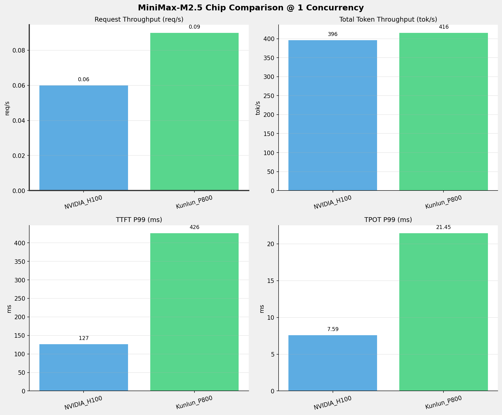
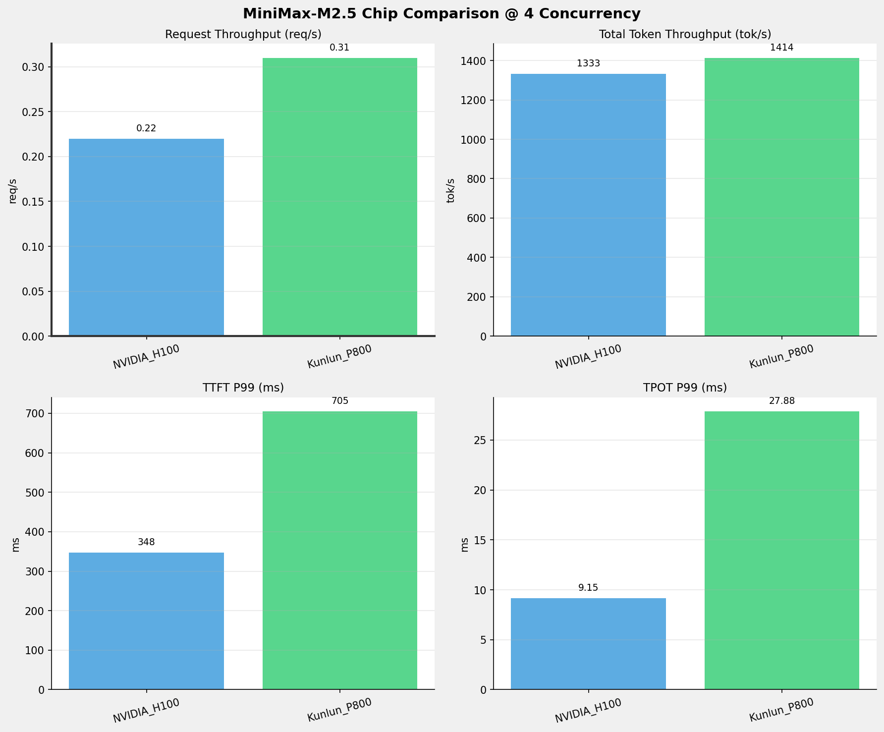
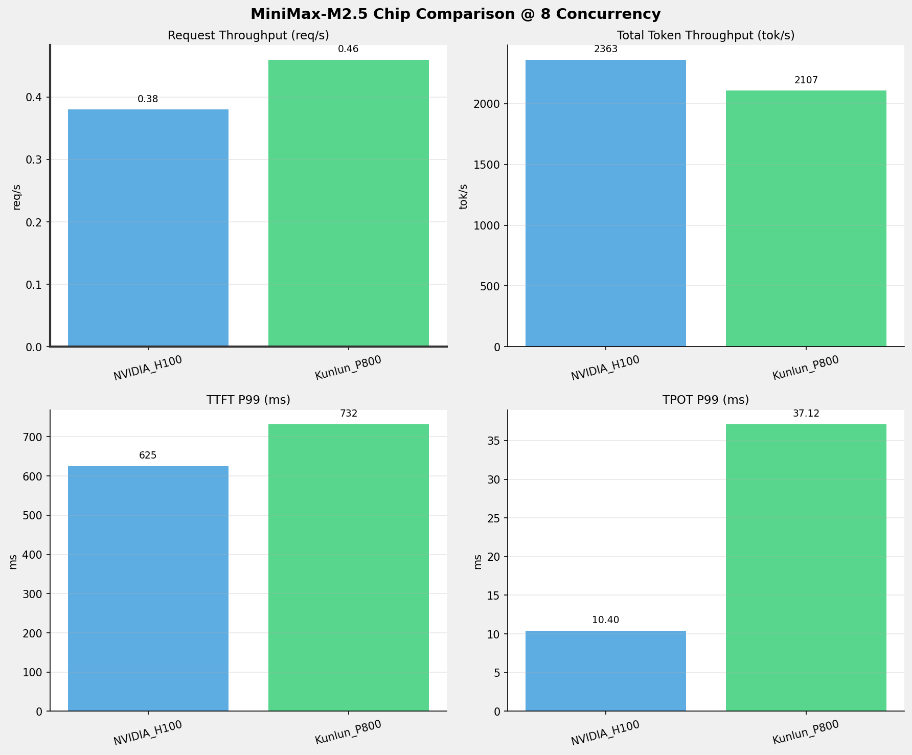
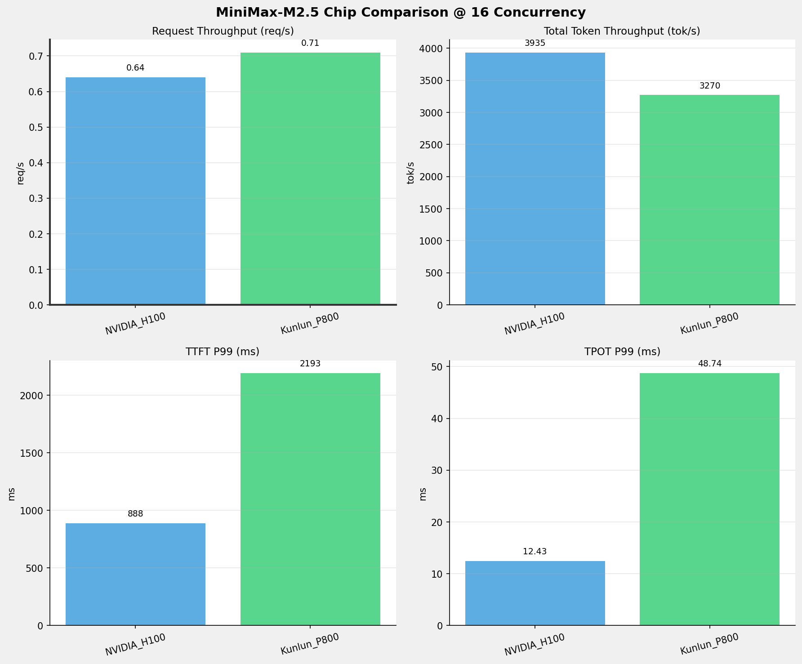
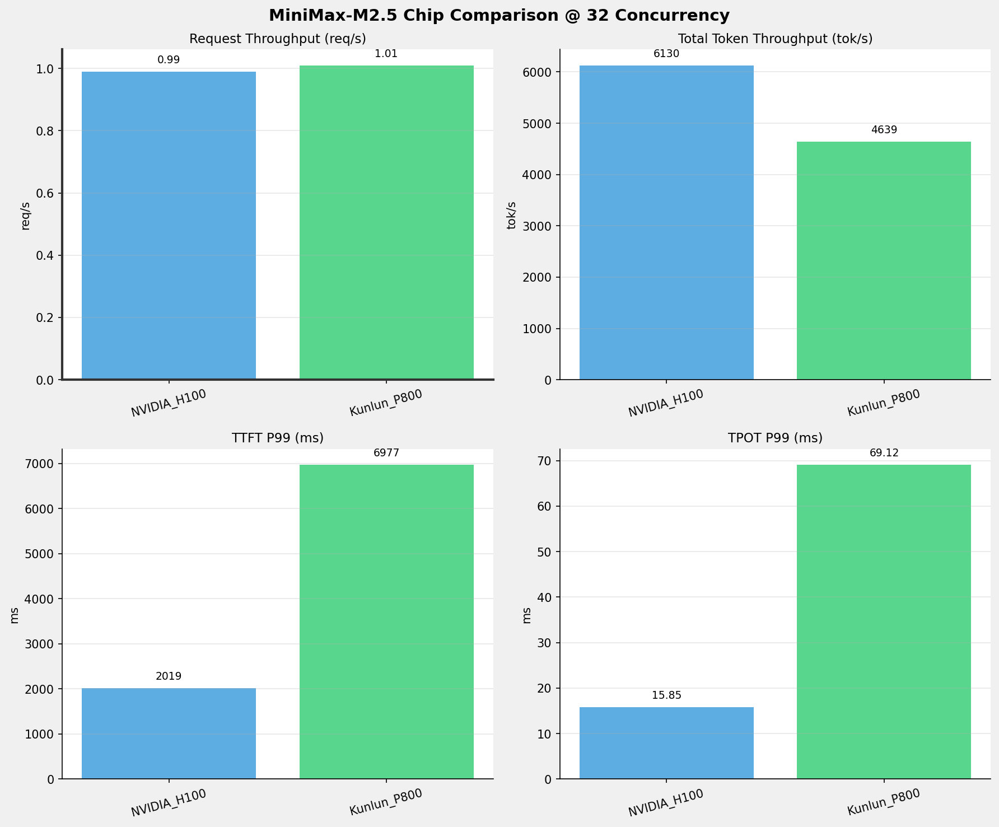
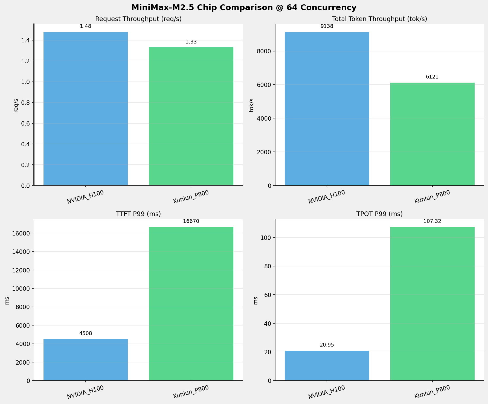
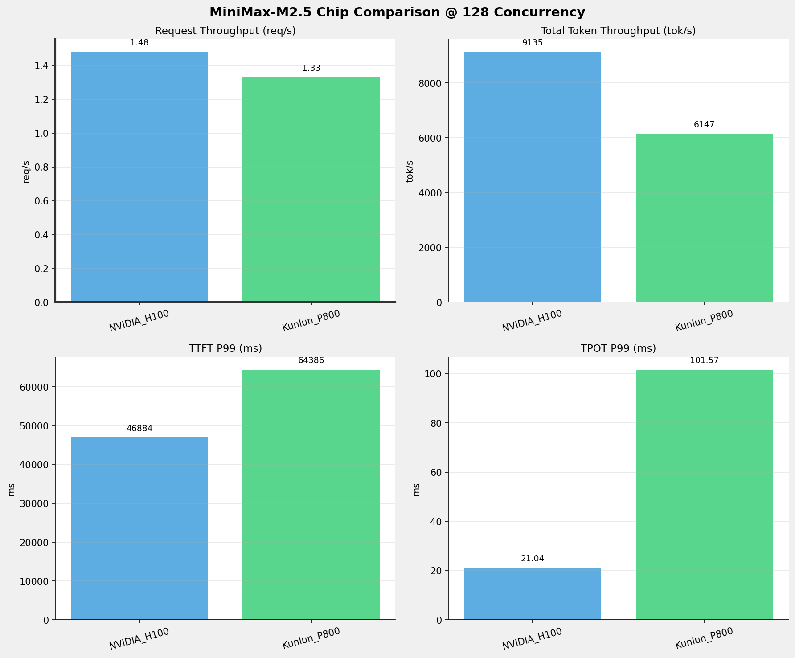
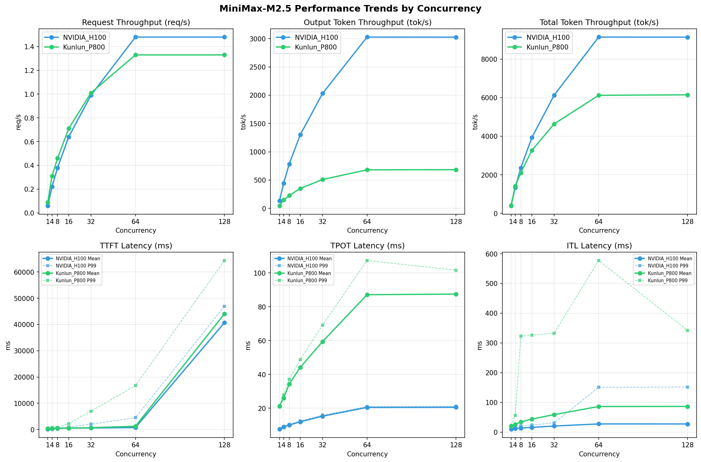

# MiniMax-M2.5模型在不同芯片下的benchmark基准测试报告

**测试日期：** 2026-05-25

---

## 测试场景
在固定请求数，输入上下文和输出上下文长度下，使用vllm bench serve工具对并发数逐级增加场景的性能基准验证。并对比同一模型在不同芯片环境上的性能指标。

**主要采集指标**：

| 指标                  | 单位         | 含义                                 |
|---------------------|------------|------------------------------------|
| TTFT                | ms         | Time To First Token，首 token 延迟     |
| TPOT                | ms/token   | Time Per Output Token，每 token 生成时间 |
| Throughput          | tokens/s   | 系统总吞吐                              |
| QPS                 | requests/s | 请求吞吐                               |
| P50/P95/P99 Latency | ms         | 延迟分位数                              |
    
### 📊 测试概览

| 项目            | 配置                                     | 备注  |
|---------------|----------------------------------------|-----|
| **数据集**       | random                                 |     |
| **并发数**       | 1, 4, 8, 16, 32, 64, 128    |     |
| **总请求数**      | 1000                                    |     |
| **请求输入上下文长度** | 4096（4k）                             |     |
| **请求输出上下文长度** | 2048（2k）                             |     |
| **被测芯片**      | NVIDIA_H100, Kunlun_P800 |     |
| **被测模型**      | MiniMax-M2.5 |     |

---

### 🤖 芯片和模型配置信息

| 参数名称 | **NVIDIA_H100** | **Kunlun_P800** |
|----------|----------|----------|
| **max_position_embeddings** | 196608 | 196608 |
| **model_name** | MiniMax-M2.5 | MiniMax-M2.5-W8A8-INT8-Dynamic |
| **model_size** | 215G | 215G |
| **python_version** | 3.12.3 | 3.10.15 |
| **quantization_config** | FP8 | int-8 |
| **temperature** | 1.0 | 1.0 |
| **top_k** | 40 | 40 |
| **top_p** | 0.95 | 0.95 |
| **transformers_version** | 4.46.1 | 4.46.1 |
| **vllm_version** | 0.20.0 | 0.11.0 |

---

### ⚙️ vLLM启动配置信息

| 参数名称 | **NVIDIA_H100** | **Kunlun_P800** |
|----------|----------|----------|
| **Block Size** | default | 128 |
| **Compilation Config** | N/A | {"splitting_ops":["vllm.unified_attention","vllm.unified_attention_with_output","vllm.unified_attention_with_output_kunlun","vllm.mamba_mixer2","vllm.mamba_mixer","vllm.short_conv","vllm.linear_attention","vllm.plamo2_mamba_mixer","vllm.gdn_attention","vllm.sparse_attn_indexer","vllm.sparse_attn_indexer_vllm_kunlun"]} |
| **Dp** | 1 | 1 |
| **Dtype** | default | auto |
| **Enable Auto Tool Choice** | True | True |
| **Enable Export Parallel** | True | False |
| **Gpu Memory Utilization** | 0.85 | 0.95 |
| **Max Model Len** | 196608 | 196608 |
| **Max Num Batched Tokens** | 8192 | 8192 |
| **Max Num Seqs** | 64 | 64 |
| **Model Name** | MiniMax-M2.5 | MiniMax-M2.5-W8A8-INT8-Dynamic |
| **Pp** | 1 | 1 |
| **Reasoning Parser** | minimax_m2 | minimax_m2 (不生效) |
| **Tool Call Parser** | minimax_m2 | minimax_m2 |
| **Tp** | 8 | 8 |

- **NVIDIA_H100**: 英伟达H100标准配置
- **Kunlun_P800**: 昆仑芯不启用专家并行避免通信问题

---

### 📊 芯片性能对比柱状图

**1并发**

**4并发**

**8并发**

**16并发**

**32并发**

**64并发**

**128并发**

### 📈 性能趋势对比图 (所有芯片)

---

### 📈 各指标随并发级别性能对比详情

#### 请求吞吐量（Request throughput (req/s)）

| 并发数 | NVIDIA_H100 | Kunlun_P800 | 差值 | 百分比 |
|-----|----------- | ----------- | ----------- | -----------|
| 1   | 0.06 | 0.09 | +0.03 | +50.0% |
| 4   | 0.22 | 0.31 | +0.09 | +40.9% |
| 8   | 0.38 | 0.46 | +0.08 | +21.1% |
| 16   | 0.64 | 0.71 | +0.07 | +10.9% |
| 32   | 0.99 | 1.01 | +0.02 | +2.0% |
| 64   | 1.48 | 1.33 | -0.15 | -10.1% |
| 128   | 1.48 | 1.33 | -0.15 | -10.1% |

#### 输出token吞吐量（Output token throughput (tok/s)）

| 并发数 | NVIDIA_H100 | Kunlun_P800 | 差值 | 百分比 |
|-----|----------- | ----------- | ----------- | -----------|
| 1   | 131.17 | 45.44 | -85.73 | -65.4% |
| 4   | 441.66 | 148.88 | -292.78 | -66.3% |
| 8   | 782.67 | 224.93 | -557.74 | -71.3% |
| 16   | 1303.31 | 351.86 | -951.45 | -73.0% |
| 32   | 2030.40 | 509.39 | -1521.01 | -74.9% |
| 64   | 3026.85 | 680.61 | -2346.24 | -77.5% |
| 128   | 3025.82 | 683.20 | -2342.62 | -77.4% |

#### 总token吞吐量（Total token throughput (tok/s)）

| 并发数 | NVIDIA_H100 | Kunlun_P800 | 差值 | 百分比 |
|-----|----------- | ----------- | ----------- | -----------|
| 1   | 396.00 | 415.54 | +19.54 | +4.9% |
| 4   | 1333.39 | 1413.98 | +80.59 | +6.0% |
| 8   | 2362.93 | 2106.90 | -256.03 | -10.8% |
| 16   | 3934.74 | 3270.47 | -664.27 | -16.9% |
| 32   | 6129.87 | 4639.40 | -1490.47 | -24.3% |
| 64   | 9138.18 | 6121.15 | -3017.03 | -33.0% |
| 128   | 9135.07 | 6146.78 | -2988.29 | -32.7% |

#### 首token延迟（P99 TTFT (ms)）

| 并发数 | NVIDIA_H100 | Kunlun_P800 | 差值 | 百分比 |
|-----|----------- | ----------- | ----------- | -----------|
| 1   | 126.64 | 426.06 | +299.42 | +236.4% |
| 4   | 347.71 | 705.23 | +357.52 | +102.8% |
| 8   | 625.36 | 732.07 | +106.71 | +17.1% |
| 16   | 887.67 | 2192.59 | +1304.92 | +147.0% |
| 32   | 2019.10 | 6976.90 | +4957.80 | +245.5% |
| 64   | 4507.91 | 16670.25 | +12162.34 | +269.8% |
| 128   | 46883.70 | 64386.11 | +17502.41 | +37.3% |

#### 每token生成时间（P99 TPOT (ms)）

| 并发数 | NVIDIA_H100 | Kunlun_P800 | 差值 | 百分比 |
|-----|----------- | ----------- | ----------- | -----------|
| 1   | 7.59 | 21.45 | +13.86 | +182.6% |
| 4   | 9.15 | 27.88 | +18.73 | +204.7% |
| 8   | 10.40 | 37.12 | +26.72 | +256.9% |
| 16   | 12.43 | 48.74 | +36.31 | +292.1% |
| 32   | 15.85 | 69.12 | +53.27 | +336.1% |
| 64   | 20.95 | 107.32 | +86.37 | +412.3% |
| 128   | 21.04 | 101.57 | +80.53 | +382.7% |

#### token间延迟（P99 ITL (ms)）

| 并发数 | NVIDIA_H100 | Kunlun_P800 | 差值 | 百分比 |
|-----|----------- | ----------- | ----------- | -----------|
| 1   | 15.39 | 21.96 | +6.57 | +42.7% |
| 4   | 18.28 | 56.44 | +38.16 | +208.8% |
| 8   | 20.56 | 322.83 | +302.27 | +1470.2% |
| 16   | 24.37 | 326.38 | +302.01 | +1239.3% |
| 32   | 31.03 | 332.54 | +301.51 | +971.7% |
| 64   | 151.06 | 577.19 | +426.13 | +282.1% |
| 128   | 151.92 | 341.79 | +189.87 | +125.0% |

### 📈 各并发级别性能对比详情

### 1 并发

#### 服务基准结果

| 指标 | NVIDIA_H100 | Kunlun_P800 |
|------|----------- | -----------|
| 成功请求数 | 1000 | 1000 |
| 失败请求数 | 0 | 0 |
| 测试持续时间 (s) | 15613.65 | 11059.86 |
| 总输入 tokens | 4135000 | 4093271 |
| 总生成 tokens | 2048000 | 502512 |
| **请求吞吐量 (req/s)** | 0.06 | **0.09** ⭐ |
| **输出 token 吞吐量 (tok/s)** | **131.17** ⭐ | 45.44 |
| 峰值输出 token 吞吐量 (tok/s) | **134.00** ⭐ | 49.00 |
| 峰值并发请求数 | 2.00 | 2.00 |
| **总 token 吞吐量 (tok/s)** | 396.00 | **415.54** ⭐ |

#### 首Token延迟 (TTFT)

| 指标 | NVIDIA_H100 | Kunlun_P800 |
|------|----------- | -----------|
| 平均 TTFT (ms) | **114.66** ⭐ | 410.39 |
| 中位 TTFT (ms) | **114.06** ⭐ | 412.42 |
| P95 TTFT (ms) | **121.61** ⭐ | 421.51 |
| P99 TTFT (ms) | **126.64** ⭐ | 426.06 |

#### 每Token生成时间 (TPOT)

| 指标 | NVIDIA_H100 | Kunlun_P800 |
|------|----------- | -----------|
| 平均 TPOT (ms) | **7.57** ⭐ | 21.18 |
| 中位 TPOT (ms) | **7.57** ⭐ | 21.17 |
| P95 TPOT (ms) | **7.58** ⭐ | 21.34 |
| P99 TPOT (ms) | **7.59** ⭐ | 21.45 |

#### Token间延迟 (ITL)

| 指标 | NVIDIA_H100 | Kunlun_P800 |
|------|----------- | -----------|
| 平均 ITL (ms) | **10.17** ⭐ | 21.23 |
| 中位 ITL (ms) | **7.59** ⭐ | 21.18 |
| P95 ITL (ms) | **15.21** ⭐ | 21.64 |
| P99 ITL (ms) | **15.39** ⭐ | 21.96 |

---

### 4 并发

#### 服务基准结果

| 指标 | NVIDIA_H100 | Kunlun_P800 |
|------|----------- | -----------|
| 成功请求数 | 1000 | 1000 |
| 失败请求数 | 0 | 0 |
| 测试持续时间 (s) | 4637.06 | 3235.52 |
| 总输入 tokens | 4135000 | 4093271 |
| 总生成 tokens | 2048000 | 481697 |
| **请求吞吐量 (req/s)** | 0.22 | **0.31** ⭐ |
| **输出 token 吞吐量 (tok/s)** | **441.66** ⭐ | 148.88 |
| 峰值输出 token 吞吐量 (tok/s) | **454.00** ⭐ | 173.00 |
| 峰值并发请求数 | 8.00 | 7.00 |
| **总 token 吞吐量 (tok/s)** | 1333.39 | **1413.98** ⭐ |

#### 首Token延迟 (TTFT)

| 指标 | NVIDIA_H100 | Kunlun_P800 |
|------|----------- | -----------|
| 平均 TTFT (ms) | **261.18** ⭐ | 428.72 |
| 中位 TTFT (ms) | **277.63** ⭐ | 418.80 |
| P95 TTFT (ms) | **337.67** ⭐ | 443.95 |
| P99 TTFT (ms) | **347.71** ⭐ | 705.23 |

#### 每Token生成时间 (TPOT)

| 指标 | NVIDIA_H100 | Kunlun_P800 |
|------|----------- | -----------|
| 平均 TPOT (ms) | **8.93** ⭐ | 25.93 |
| 中位 TPOT (ms) | **8.95** ⭐ | 25.96 |
| P95 TPOT (ms) | **9.12** ⭐ | 27.26 |
| P99 TPOT (ms) | **9.15** ⭐ | 27.88 |

#### Token间延迟 (ITL)

| 指标 | NVIDIA_H100 | Kunlun_P800 |
|------|----------- | -----------|
| 平均 ITL (ms) | **12.00** ⭐ | 26.11 |
| 中位 ITL (ms) | **9.05** ⭐ | 24.08 |
| P95 ITL (ms) | **18.06** ⭐ | 24.67 |
| P99 ITL (ms) | **18.28** ⭐ | 56.44 |

---

### 8 并发

#### 服务基准结果

| 指标 | NVIDIA_H100 | Kunlun_P800 |
|------|----------- | -----------|
| 成功请求数 | 1000 | 1000 |
| 失败请求数 | 0 | 0 |
| 测试持续时间 (s) | 2616.67 | 2174.99 |
| 总输入 tokens | 4135000 | 4093271 |
| 总生成 tokens | 2048000 | 489219 |
| **请求吞吐量 (req/s)** | 0.38 | **0.46** ⭐ |
| **输出 token 吞吐量 (tok/s)** | **782.67** ⭐ | 224.93 |
| 峰值输出 token 吞吐量 (tok/s) | **808.00** ⭐ | 273.00 |
| 峰值并发请求数 | 16.00 | 11.00 |
| **总 token 吞吐量 (tok/s)** | **2362.93** ⭐ | 2106.90 |

#### 首Token延迟 (TTFT)

| 指标 | NVIDIA_H100 | Kunlun_P800 |
|------|----------- | -----------|
| 平均 TTFT (ms) | **429.94** ⭐ | 459.27 |
| 中位 TTFT (ms) | 473.23 | **442.06** ⭐ |
| P95 TTFT (ms) | **619.57** ⭐ | 682.26 |
| P99 TTFT (ms) | **625.36** ⭐ | 732.07 |

#### 每Token生成时间 (TPOT)

| 指标 | NVIDIA_H100 | Kunlun_P800 |
|------|----------- | -----------|
| 平均 TPOT (ms) | **10.02** ⭐ | 34.22 |
| 中位 TPOT (ms) | **10.03** ⭐ | 34.26 |
| P95 TPOT (ms) | **10.29** ⭐ | 36.29 |
| P99 TPOT (ms) | **10.40** ⭐ | 37.12 |

#### Token间延迟 (ITL)

| 指标 | NVIDIA_H100 | Kunlun_P800 |
|------|----------- | -----------|
| 平均 ITL (ms) | **13.60** ⭐ | 34.21 |
| 中位 ITL (ms) | **10.14** ⭐ | 30.11 |
| P95 ITL (ms) | **20.16** ⭐ | 30.97 |
| P99 ITL (ms) | **20.56** ⭐ | 322.83 |

---

### 16 并发

#### 服务基准结果

| 指标 | NVIDIA_H100 | Kunlun_P800 |
|------|----------- | -----------|
| 成功请求数 | 1000 | 1000 |
| 失败请求数 | 0 | 0 |
| 测试持续时间 (s) | 1571.39 | 1402.48 |
| 总输入 tokens | 4135000 | 4093271 |
| 总生成 tokens | 2048000 | 493479 |
| **请求吞吐量 (req/s)** | 0.64 | **0.71** ⭐ |
| **输出 token 吞吐量 (tok/s)** | **1303.31** ⭐ | 351.86 |
| 峰值输出 token 吞吐量 (tok/s) | **1376.00** ⭐ | 465.00 |
| 峰值并发请求数 | 32.00 | 19.00 |
| **总 token 吞吐量 (tok/s)** | **3934.74** ⭐ | 3270.47 |

#### 首Token延迟 (TTFT)

| 指标 | NVIDIA_H100 | Kunlun_P800 |
|------|----------- | -----------|
| 平均 TTFT (ms) | 535.05 | **504.90** ⭐ |
| 中位 TTFT (ms) | 585.04 | **431.05** ⭐ |
| P95 TTFT (ms) | 744.68 | **709.41** ⭐ |
| P99 TTFT (ms) | **887.67** ⭐ | 2192.59 |

#### 每Token生成时间 (TPOT)

| 指标 | NVIDIA_H100 | Kunlun_P800 |
|------|----------- | -----------|
| 平均 TPOT (ms) | **11.94** ⭐ | 44.17 |
| 中位 TPOT (ms) | **11.96** ⭐ | 44.19 |
| P95 TPOT (ms) | **12.32** ⭐ | 47.13 |
| P99 TPOT (ms) | **12.43** ⭐ | 48.74 |

#### Token间延迟 (ITL)

| 指标 | NVIDIA_H100 | Kunlun_P800 |
|------|----------- | -----------|
| 平均 ITL (ms) | **16.10** ⭐ | 44.22 |
| 中位 ITL (ms) | **11.97** ⭐ | 35.66 |
| P95 ITL (ms) | **23.80** ⭐ | 56.41 |
| P99 ITL (ms) | **24.37** ⭐ | 326.38 |

---

### 32 并发

#### 服务基准结果

| 指标 | NVIDIA_H100 | Kunlun_P800 |
|------|----------- | -----------|
| 成功请求数 | 1000 | 1000 |
| 失败请求数 | 0 | 0 |
| 测试持续时间 (s) | 1008.67 | 991.10 |
| 总输入 tokens | 4135000 | 4093271 |
| 总生成 tokens | 2048000 | 504857 |
| **请求吞吐量 (req/s)** | 0.99 | **1.01** ⭐ |
| **输出 token 吞吐量 (tok/s)** | **2030.40** ⭐ | 509.39 |
| 峰值输出 token 吞吐量 (tok/s) | **2208.00** ⭐ | 801.00 |
| 峰值并发请求数 | 51.00 | 37.00 |
| **总 token 吞吐量 (tok/s)** | **6129.87** ⭐ | 4639.40 |

#### 首Token延迟 (TTFT)

| 指标 | NVIDIA_H100 | Kunlun_P800 |
|------|----------- | -----------|
| 平均 TTFT (ms) | **579.71** ⭐ | 667.53 |
| 中位 TTFT (ms) | 600.21 | **452.94** ⭐ |
| P95 TTFT (ms) | **758.49** ⭐ | 907.94 |
| P99 TTFT (ms) | **2019.10** ⭐ | 6976.90 |

#### 每Token生成时间 (TPOT)

| 指标 | NVIDIA_H100 | Kunlun_P800 |
|------|----------- | -----------|
| 平均 TPOT (ms) | **15.25** ⭐ | 59.36 |
| 中位 TPOT (ms) | **15.27** ⭐ | 59.60 |
| P95 TPOT (ms) | **15.65** ⭐ | 63.96 |
| P99 TPOT (ms) | **15.85** ⭐ | 69.12 |

#### Token间延迟 (ITL)

| 指标 | NVIDIA_H100 | Kunlun_P800 |
|------|----------- | -----------|
| 平均 ITL (ms) | **20.67** ⭐ | 59.16 |
| 中位 ITL (ms) | **14.84** ⭐ | 42.13 |
| P95 ITL (ms) | **29.51** ⭐ | 327.18 |
| P99 ITL (ms) | **31.03** ⭐ | 332.54 |

---

### 64 并发

#### 服务基准结果

| 指标 | NVIDIA_H100 | Kunlun_P800 |
|------|----------- | -----------|
| 成功请求数 | 1000 | 1000 |
| 失败请求数 | 0 | 0 |
| 测试持续时间 (s) | 676.61 | 752.36 |
| 总输入 tokens | 4135000 | 4093271 |
| 总生成 tokens | 2048000 | 512068 |
| **请求吞吐量 (req/s)** | **1.48** ⭐ | 1.33 |
| **输出 token 吞吐量 (tok/s)** | **3026.85** ⭐ | 680.61 |
| 峰值输出 token 吞吐量 (tok/s) | **3520.00** ⭐ | 1280.00 |
| 峰值并发请求数 | 81.00 | 69.00 |
| **总 token 吞吐量 (tok/s)** | **9138.18** ⭐ | 6121.15 |

#### 首Token延迟 (TTFT)

| 指标 | NVIDIA_H100 | Kunlun_P800 |
|------|----------- | -----------|
| 平均 TTFT (ms) | **724.48** ⭐ | 1231.01 |
| 中位 TTFT (ms) | 609.50 | **491.46** ⭐ |
| P95 TTFT (ms) | **1550.34** ⭐ | 5270.37 |
| P99 TTFT (ms) | **4507.91** ⭐ | 16670.25 |

#### 每Token生成时间 (TPOT)

| 指标 | NVIDIA_H100 | Kunlun_P800 |
|------|----------- | -----------|
| 平均 TPOT (ms) | **20.42** ⭐ | 87.10 |
| 中位 TPOT (ms) | **20.54** ⭐ | 87.63 |
| P95 TPOT (ms) | **20.81** ⭐ | 95.34 |
| P99 TPOT (ms) | **20.95** ⭐ | 107.32 |

#### Token间延迟 (ITL)

| 指标 | NVIDIA_H100 | Kunlun_P800 |
|------|----------- | -----------|
| 平均 ITL (ms) | **27.77** ⭐ | 86.34 |
| 中位 ITL (ms) | **19.00** ⭐ | 53.58 |
| P95 ITL (ms) | **38.64** ⭐ | 341.76 |
| P99 ITL (ms) | **151.06** ⭐ | 577.19 |

---

### 128 并发

#### 服务基准结果

| 指标 | NVIDIA_H100 | Kunlun_P800 |
|------|----------- | -----------|
| 成功请求数 | 1000 | 1000 |
| 失败请求数 | 0 | 0 |
| 测试持续时间 (s) | 676.84 | 749.19 |
| 总输入 tokens | 4135000 | 4093271 |
| 总生成 tokens | 2048000 | 511846 |
| **请求吞吐量 (req/s)** | **1.48** ⭐ | 1.33 |
| **输出 token 吞吐量 (tok/s)** | **3025.82** ⭐ | 683.20 |
| 峰值输出 token 吞吐量 (tok/s) | **3456.00** ⭐ | 1280.00 |
| 峰值并发请求数 | 143.00 | 132.00 |
| **总 token 吞吐量 (tok/s)** | **9135.07** ⭐ | 6146.78 |

#### 首Token延迟 (TTFT)

| 指标 | NVIDIA_H100 | Kunlun_P800 |
|------|----------- | -----------|
| 平均 TTFT (ms) | **40686.02** ⭐ | 44039.79 |
| 中位 TTFT (ms) | **43099.58** ⭐ | 45703.23 |
| P95 TTFT (ms) | **43838.20** ⭐ | 50554.98 |
| P99 TTFT (ms) | **46883.70** ⭐ | 64386.11 |

#### 每Token生成时间 (TPOT)

| 指标 | NVIDIA_H100 | Kunlun_P800 |
|------|----------- | -----------|
| 平均 TPOT (ms) | **20.53** ⭐ | 87.44 |
| 中位 TPOT (ms) | **20.68** ⭐ | 88.27 |
| P95 TPOT (ms) | **20.97** ⭐ | 95.39 |
| P99 TPOT (ms) | **21.04** ⭐ | 101.57 |

#### Token间延迟 (ITL)

| 指标 | NVIDIA_H100 | Kunlun_P800 |
|------|----------- | -----------|
| 平均 ITL (ms) | **27.69** ⭐ | 86.64 |
| 中位 ITL (ms) | **19.03** ⭐ | 53.73 |
| P95 ITL (ms) | **38.65** ⭐ | 335.91 |
| P99 ITL (ms) | **151.92** ⭐ | 341.79 |

---

---

*报告生成时间: 2026-05-25*

