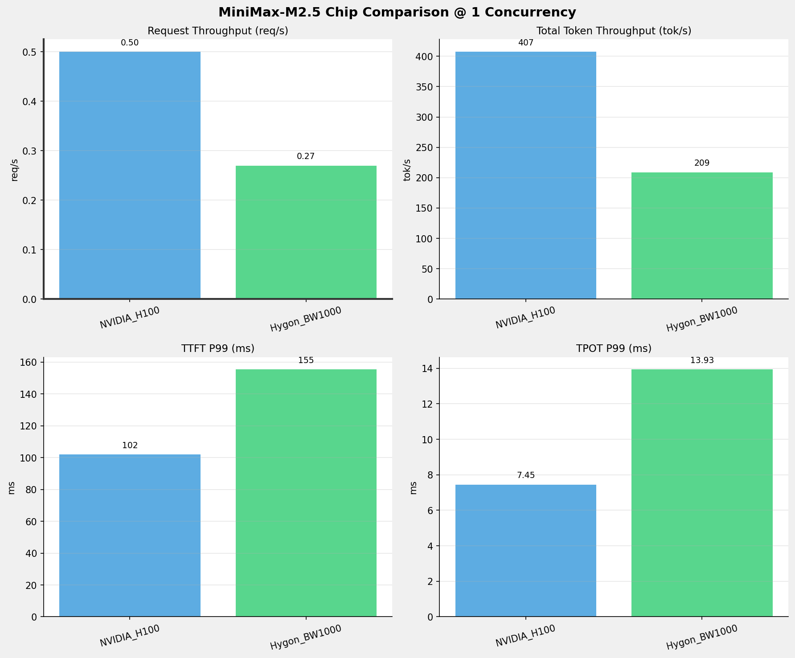
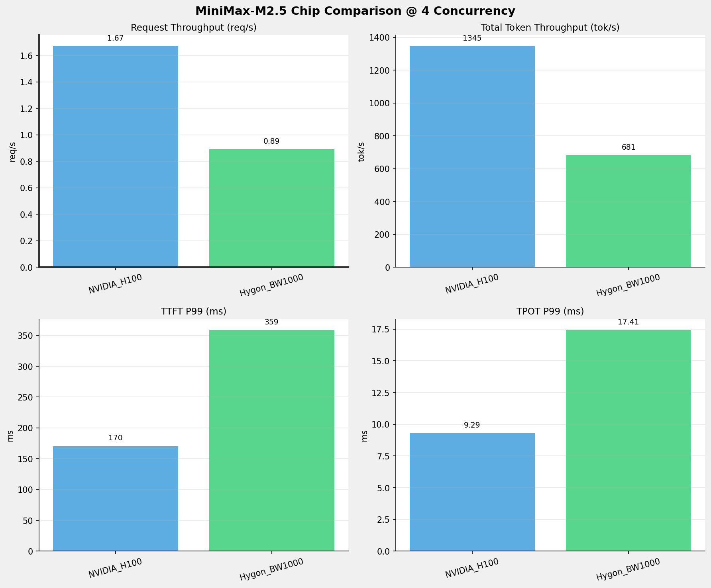
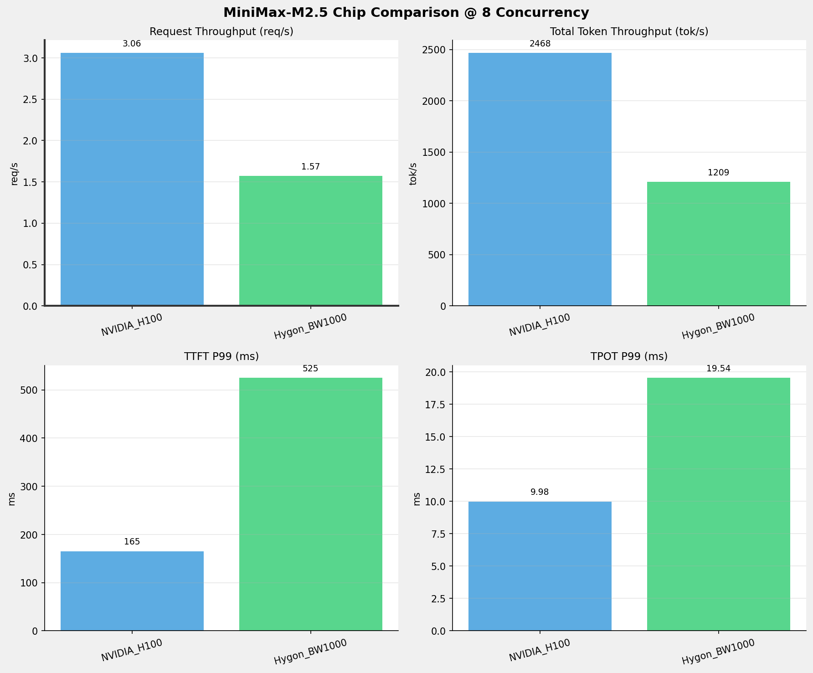
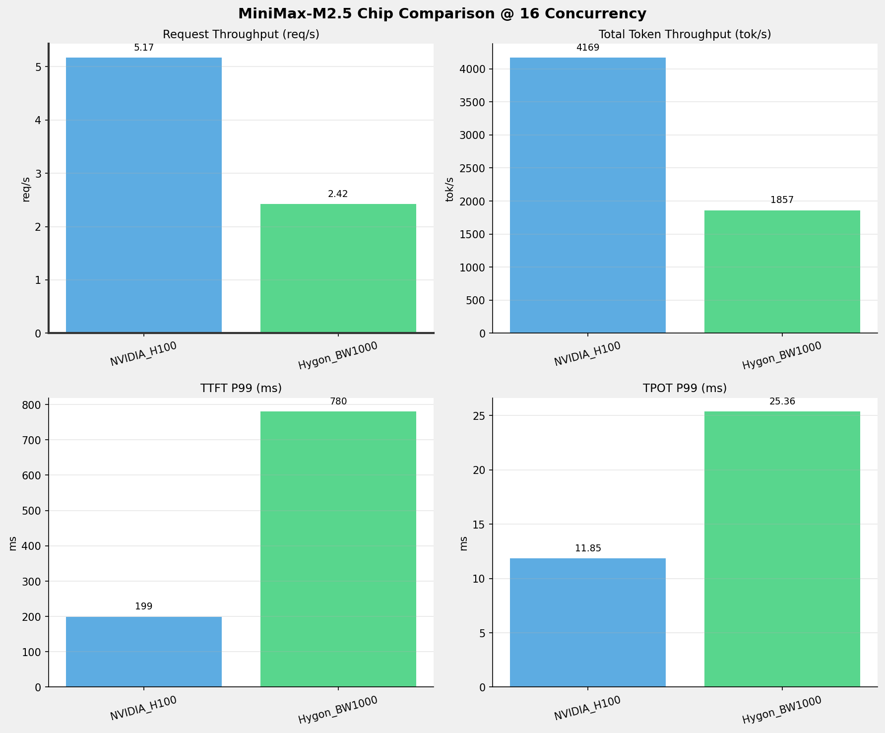
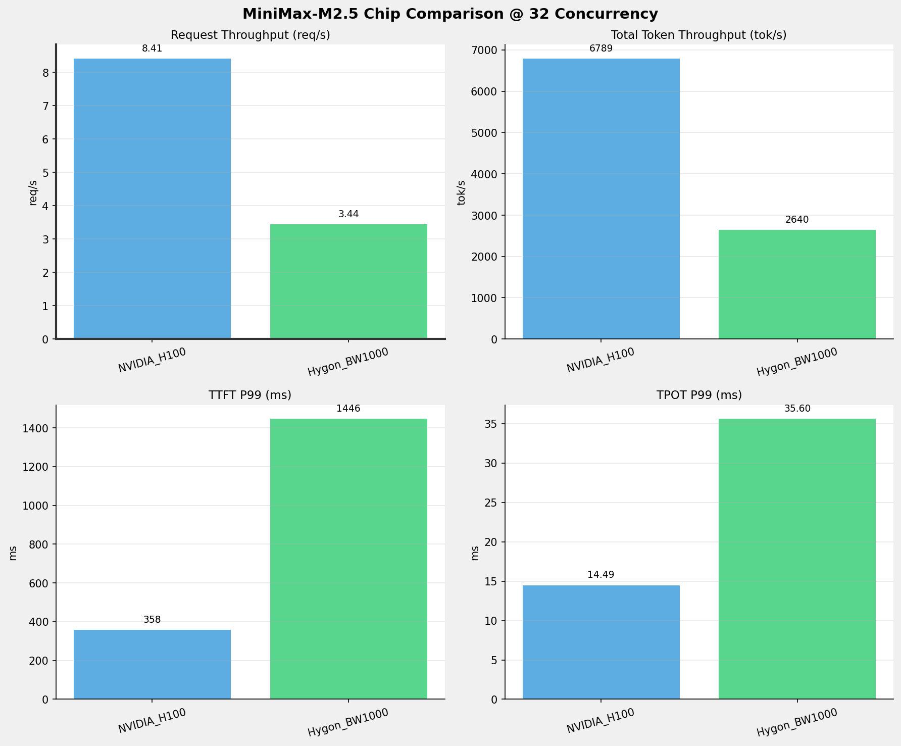
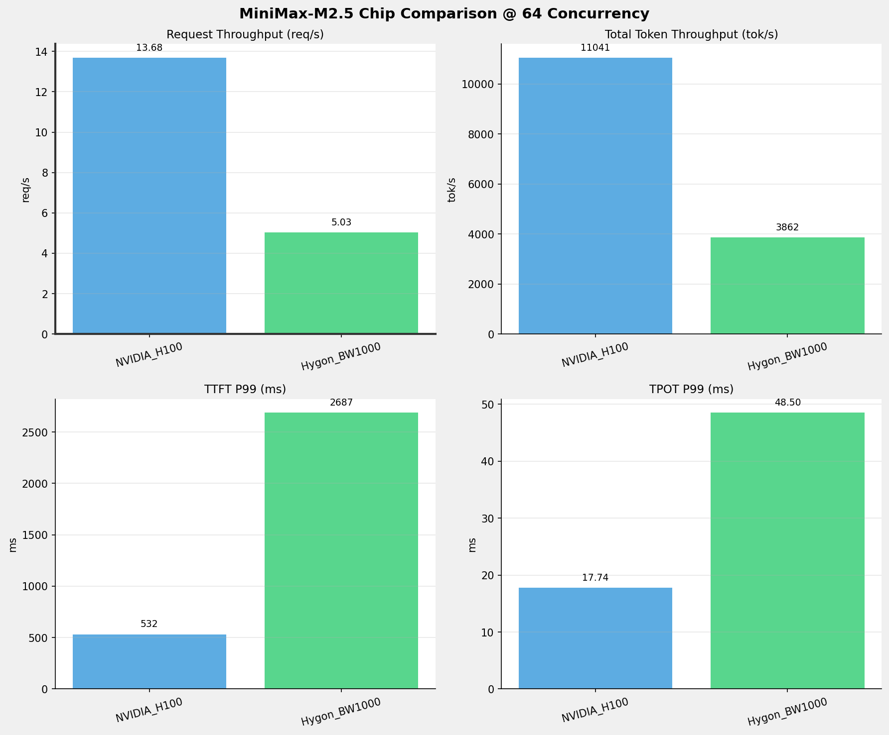
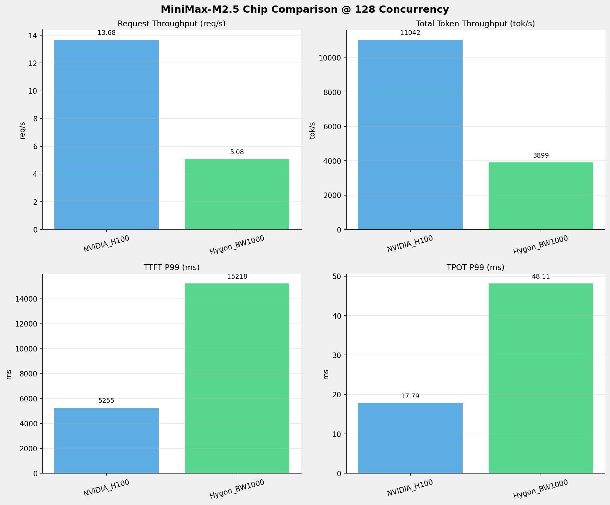
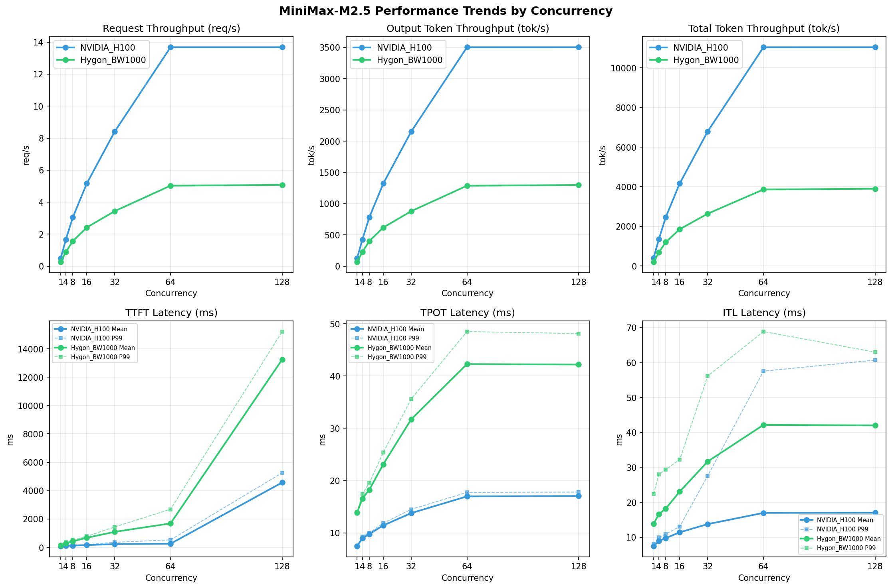

# MiniMax-M2.5模型在不同芯片下的benchmark基准测试报告

**测试日期：** 2026-05-19

---

## 测试场景
在固定请求数，输入上下文和输出上下文长度下，使用vllm bench serve工具对并发数逐级增加场景的性能基准验证。并对比同一模型在不同芯片环境上的性能指标。

**主要采集指标**：

| 指标                  | 单位         | 含义                                 |
|---------------------|------------|------------------------------------|
| TTFT                | ms         | Time To First Token，首 token 延迟     |
| TPOT                | ms/token   | Time Per Output Token，每 token 生成时间 |
| Throughput          | tokens/s   | 系统总吞吐                              |
| QPS                 | requests/s | 请求吞吐                               |
| P50/P95/P99 Latency | ms         | 延迟分位数                              |
    
### 📊 测试概览

| 项目            | 配置                                     | 备注  |
|---------------|----------------------------------------|-----|
| **数据集**       | random                                 |     |
| **并发数**       | 1, 4, 8, 16, 32, 64, 128    |     |
| **总请求数**      | 1000                                    |     |
| **请求输入上下文长度** | 512（0.50k）                             |     |
| **请求输出上下文长度** | 256（0.25k）                             |     |
| **被测芯片**      | NVIDIA_H100, Hygon_BW1000 |     |
| **被测模型**      | MiniMax-M2.5 |     |

---

### 🤖 芯片和模型配置信息

| 参数名称 | **NVIDIA_H100** | **Hygon_BW1000** |
|----------|----------|----------|
| **max_position_embeddings** | 196608 | 196608 |
| **model_name** | MiniMax-M2.5 | MiniMax-M2.5-W8A8 |
| **model_size** | 215G | 215G |
| **python_version** | 3.12.3 | 3.10.12 |
| **quantization_config** | FP16 | int-8 |
| **temperature** | N/A | N/A |
| **top_k** | N/A | N/A |
| **top_p** | N/A | N/A |
| **transformers_version** | 4.46.1 | 4.57.6 |
| **vllm_version** | 0.15.1 | 0.15.1+das.opt1.alpha.dtk2604 |

---

### ⚙️ vLLM启动配置信息

| 参数名称 | **NVIDIA_H100** | **Hygon_BW1000** |
|----------|----------|----------|
| **Block Size** | default | default |
| **Compilation Config** | N/A | N/A |
| **Dp** | 1 | 1 |
| **Dtype** | default | bfloat16 |
| **Enable Auto Tool Choice** | True | True |
| **Enable Export Parallel** | True | True |
| **Gpu Memory Utilization** | 0.85 | 0.9 |
| **Max Model Len** | 196608 | 196608 |
| **Max Num Batched Tokens** | 8192 | default |
| **Max Num Seqs** | 10 | 64 |
| **Model Name** | MiniMax-M2.5 | MiniMax-M2.5-W8A8 |
| **Pp** | 1 | 1 |
| **Reasoning Parser** | minimax_m2 | minimax_m2 (不生效) |
| **Tool Call Parser** | minimax_m2 | minimax_m2 |
| **Tp** | 8 | 8 |

- **NVIDIA_H100**: 英伟达H100标准配置
- **Hygon_BW1000**: 海光芯片专家并行配置

---

### 📊 芯片性能对比柱状图

**1并发**

**4并发**

**8并发**

**16并发**

**32并发**

**64并发**

**128并发**

### 📈 性能趋势对比图 (所有芯片)

---

### 📈 各指标随并发级别性能对比详情

#### 请求吞吐量（Request throughput (req/s)）

| 并发数 | NVIDIA_H100 | Hygon_BW1000 | 差值 | 百分比 |
|-----|----------- | ----------- | ----------- | -----------|
| 1   | 0.50 | 0.27 | -0.23 | -46.0% |
| 4   | 1.67 | 0.89 | -0.78 | -46.7% |
| 8   | 3.06 | 1.57 | -1.49 | -48.7% |
| 16   | 5.17 | 2.42 | -2.75 | -53.2% |
| 32   | 8.41 | 3.44 | -4.97 | -59.1% |
| 64   | 13.68 | 5.03 | -8.65 | -63.2% |
| 128   | 13.68 | 5.08 | -8.60 | -62.9% |

#### 输出token吞吐量（Output token throughput (tok/s)）

| 并发数 | NVIDIA_H100 | Hygon_BW1000 | 差值 | 百分比 |
|-----|----------- | ----------- | ----------- | -----------|
| 1   | 129.25 | 69.57 | -59.68 | -46.2% |
| 4   | 426.71 | 226.93 | -199.78 | -46.8% |
| 8   | 782.80 | 402.84 | -379.96 | -48.5% |
| 16   | 1322.61 | 619.05 | -703.56 | -53.2% |
| 32   | 2153.58 | 880.14 | -1273.44 | -59.1% |
| 64   | 3502.52 | 1287.29 | -2215.23 | -63.2% |
| 128   | 3502.84 | 1299.51 | -2203.33 | -62.9% |

#### 总token吞吐量（Total token throughput (tok/s)）

| 并发数 | NVIDIA_H100 | Hygon_BW1000 | 差值 | 百分比 |
|-----|----------- | ----------- | ----------- | -----------|
| 1   | 407.43 | 208.70 | -198.73 | -48.8% |
| 4   | 1345.13 | 680.78 | -664.35 | -49.4% |
| 8   | 2467.65 | 1208.51 | -1259.14 | -51.0% |
| 16   | 4169.31 | 1857.16 | -2312.15 | -55.5% |
| 32   | 6788.82 | 2640.42 | -4148.40 | -61.1% |
| 64   | 11041.15 | 3861.86 | -7179.29 | -65.0% |
| 128   | 11042.17 | 3898.54 | -7143.63 | -64.7% |

#### 首token延迟（P99 TTFT (ms)）

| 并发数 | NVIDIA_H100 | Hygon_BW1000 | 差值 | 百分比 |
|-----|----------- | ----------- | ----------- | -----------|
| 1   | 101.94 | 155.38 | +53.44 | +52.4% |
| 4   | 170.36 | 358.52 | +188.16 | +110.4% |
| 8   | 165.00 | 524.83 | +359.83 | +218.1% |
| 16   | 199.16 | 779.90 | +580.74 | +291.6% |
| 32   | 357.62 | 1445.65 | +1088.03 | +304.2% |
| 64   | 531.95 | 2686.74 | +2154.79 | +405.1% |
| 128   | 5255.30 | 15217.88 | +9962.58 | +189.6% |

#### 每token生成时间（P99 TPOT (ms)）

| 并发数 | NVIDIA_H100 | Hygon_BW1000 | 差值 | 百分比 |
|-----|----------- | ----------- | ----------- | -----------|
| 1   | 7.45 | 13.93 | +6.48 | +87.0% |
| 4   | 9.29 | 17.41 | +8.12 | +87.4% |
| 8   | 9.98 | 19.54 | +9.56 | +95.8% |
| 16   | 11.85 | 25.36 | +13.51 | +114.0% |
| 32   | 14.49 | 35.60 | +21.11 | +145.7% |
| 64   | 17.74 | 48.50 | +30.76 | +173.4% |
| 128   | 17.79 | 48.11 | +30.32 | +170.4% |

#### token间延迟（P99 ITL (ms)）

| 并发数 | NVIDIA_H100 | Hygon_BW1000 | 差值 | 百分比 |
|-----|----------- | ----------- | ----------- | -----------|
| 1   | 7.97 | 22.43 | +14.46 | +181.4% |
| 4   | 9.95 | 28.00 | +18.05 | +181.4% |
| 8   | 10.91 | 29.39 | +18.48 | +169.4% |
| 16   | 13.06 | 32.24 | +19.18 | +146.9% |
| 32   | 27.58 | 56.15 | +28.57 | +103.6% |
| 64   | 57.55 | 68.89 | +11.34 | +19.7% |
| 128   | 60.71 | 63.00 | +2.29 | +3.8% |

### 📈 各并发级别性能对比详情

### 1 并发

#### 服务基准结果

| 指标 | NVIDIA_H100 | Hygon_BW1000 |
|------|----------- | -----------|
| 成功请求数 | 1000 | 1000 |
| 失败请求数 | 0 | 0 |
| 测试持续时间 (s) | 1980.70 | 3679.99 |
| 总输入 tokens | 551000 | 512000 |
| 总生成 tokens | 256000 | 256000 |
| **请求吞吐量 (req/s)** | **0.50** ⭐ | 0.27 |
| **输出 token 吞吐量 (tok/s)** | **129.25** ⭐ | 69.57 |
| 峰值输出 token 吞吐量 (tok/s) | **136.00** ⭐ | 77.00 |
| 峰值并发请求数 | 2.00 | 2.00 |
| **总 token 吞吐量 (tok/s)** | **407.43** ⭐ | 208.70 |

#### 首Token延迟 (TTFT)

| 指标 | NVIDIA_H100 | Hygon_BW1000 |
|------|----------- | -----------|
| 平均 TTFT (ms) | **83.60** ⭐ | 138.09 |
| 中位 TTFT (ms) | **82.89** ⭐ | 138.47 |
| P95 TTFT (ms) | **97.10** ⭐ | 144.95 |
| P99 TTFT (ms) | **101.94** ⭐ | 155.38 |

#### 每Token生成时间 (TPOT)

| 指标 | NVIDIA_H100 | Hygon_BW1000 |
|------|----------- | -----------|
| 平均 TPOT (ms) | **7.44** ⭐ | 13.89 |
| 中位 TPOT (ms) | **7.44** ⭐ | 13.89 |
| P95 TPOT (ms) | **7.45** ⭐ | 13.91 |
| P99 TPOT (ms) | **7.45** ⭐ | 13.93 |

#### Token间延迟 (ITL)

| 指标 | NVIDIA_H100 | Hygon_BW1000 |
|------|----------- | -----------|
| 平均 ITL (ms) | **7.43** ⭐ | 13.88 |
| 中位 ITL (ms) | **7.43** ⭐ | 13.88 |
| P95 ITL (ms) | **7.55** ⭐ | 15.91 |
| P99 ITL (ms) | **7.97** ⭐ | 22.43 |

---

### 4 并发

#### 服务基准结果

| 指标 | NVIDIA_H100 | Hygon_BW1000 |
|------|----------- | -----------|
| 成功请求数 | 1000 | 1000 |
| 失败请求数 | 0 | 0 |
| 测试持续时间 (s) | 599.94 | 1128.12 |
| 总输入 tokens | 551000 | 512000 |
| 总生成 tokens | 256000 | 256000 |
| **请求吞吐量 (req/s)** | **1.67** ⭐ | 0.89 |
| **输出 token 吞吐量 (tok/s)** | **426.71** ⭐ | 226.93 |
| 峰值输出 token 吞吐量 (tok/s) | **463.00** ⭐ | 256.00 |
| 峰值并发请求数 | 8.00 | 8.00 |
| **总 token 吞吐量 (tok/s)** | **1345.13** ⭐ | 680.78 |

#### 首Token延迟 (TTFT)

| 指标 | NVIDIA_H100 | Hygon_BW1000 |
|------|----------- | -----------|
| 平均 TTFT (ms) | **113.66** ⭐ | 290.33 |
| 中位 TTFT (ms) | **125.99** ⭐ | 337.86 |
| P95 TTFT (ms) | **158.29** ⭐ | 346.96 |
| P99 TTFT (ms) | **170.36** ⭐ | 358.52 |

#### 每Token生成时间 (TPOT)

| 指标 | NVIDIA_H100 | Hygon_BW1000 |
|------|----------- | -----------|
| 平均 TPOT (ms) | **8.96** ⭐ | 16.56 |
| 中位 TPOT (ms) | **8.99** ⭐ | 16.44 |
| P95 TPOT (ms) | **9.25** ⭐ | 17.30 |
| P99 TPOT (ms) | **9.29** ⭐ | 17.41 |

#### Token间延迟 (ITL)

| 指标 | NVIDIA_H100 | Hygon_BW1000 |
|------|----------- | -----------|
| 平均 ITL (ms) | **8.95** ⭐ | 16.58 |
| 中位 ITL (ms) | **8.82** ⭐ | 16.38 |
| P95 ITL (ms) | **9.10** ⭐ | 17.76 |
| P99 ITL (ms) | **9.95** ⭐ | 28.00 |

---

### 8 并发

#### 服务基准结果

| 指标 | NVIDIA_H100 | Hygon_BW1000 |
|------|----------- | -----------|
| 成功请求数 | 1000 | 1000 |
| 失败请求数 | 0 | 0 |
| 测试持续时间 (s) | 327.03 | 635.50 |
| 总输入 tokens | 551000 | 512000 |
| 总生成 tokens | 256000 | 256000 |
| **请求吞吐量 (req/s)** | **3.06** ⭐ | 1.57 |
| **输出 token 吞吐量 (tok/s)** | **782.80** ⭐ | 402.84 |
| 峰值输出 token 吞吐量 (tok/s) | **838.00** ⭐ | 496.00 |
| 峰值并发请求数 | 16.00 | 16.00 |
| **总 token 吞吐量 (tok/s)** | **2467.65** ⭐ | 1208.51 |

#### 首Token延迟 (TTFT)

| 指标 | NVIDIA_H100 | Hygon_BW1000 |
|------|----------- | -----------|
| 平均 TTFT (ms) | **125.34** ⭐ | 432.57 |
| 中位 TTFT (ms) | **137.59** ⭐ | 473.42 |
| P95 TTFT (ms) | **154.04** ⭐ | 485.22 |
| P99 TTFT (ms) | **165.00** ⭐ | 524.83 |

#### 每Token生成时间 (TPOT)

| 指标 | NVIDIA_H100 | Hygon_BW1000 |
|------|----------- | -----------|
| 平均 TPOT (ms) | **9.77** ⭐ | 18.24 |
| 中位 TPOT (ms) | **9.74** ⭐ | 18.12 |
| P95 TPOT (ms) | **9.95** ⭐ | 19.43 |
| P99 TPOT (ms) | **9.98** ⭐ | 19.54 |

#### Token间延迟 (ITL)

| 指标 | NVIDIA_H100 | Hygon_BW1000 |
|------|----------- | -----------|
| 平均 ITL (ms) | **9.76** ⭐ | 18.22 |
| 中位 ITL (ms) | **9.74** ⭐ | 18.16 |
| P95 ITL (ms) | **10.09** ⭐ | 20.33 |
| P99 ITL (ms) | **10.91** ⭐ | 29.39 |

---

### 16 并发

#### 服务基准结果

| 指标 | NVIDIA_H100 | Hygon_BW1000 |
|------|----------- | -----------|
| 成功请求数 | 1000 | 1000 |
| 失败请求数 | 0 | 0 |
| 测试持续时间 (s) | 193.56 | 413.53 |
| 总输入 tokens | 551000 | 512000 |
| 总生成 tokens | 256000 | 256000 |
| **请求吞吐量 (req/s)** | **5.17** ⭐ | 2.42 |
| **输出 token 吞吐量 (tok/s)** | **1322.61** ⭐ | 619.05 |
| 峰值输出 token 吞吐量 (tok/s) | **1453.00** ⭐ | 749.00 |
| 峰值并发请求数 | 32.00 | 32.00 |
| **总 token 吞吐量 (tok/s)** | **4169.31** ⭐ | 1857.16 |

#### 首Token延迟 (TTFT)

| 指标 | NVIDIA_H100 | Hygon_BW1000 |
|------|----------- | -----------|
| 平均 TTFT (ms) | **164.12** ⭐ | 680.36 |
| 中位 TTFT (ms) | **172.67** ⭐ | 743.19 |
| P95 TTFT (ms) | **194.98** ⭐ | 752.08 |
| P99 TTFT (ms) | **199.16** ⭐ | 779.90 |

#### 每Token生成时间 (TPOT)

| 指标 | NVIDIA_H100 | Hygon_BW1000 |
|------|----------- | -----------|
| 平均 TPOT (ms) | **11.42** ⭐ | 23.12 |
| 中位 TPOT (ms) | **11.44** ⭐ | 22.97 |
| P95 TPOT (ms) | **11.76** ⭐ | 25.15 |
| P99 TPOT (ms) | **11.85** ⭐ | 25.36 |

#### Token间延迟 (ITL)

| 指标 | NVIDIA_H100 | Hygon_BW1000 |
|------|----------- | -----------|
| 平均 ITL (ms) | **11.41** ⭐ | 23.07 |
| 中位 ITL (ms) | **11.32** ⭐ | 23.13 |
| P95 ITL (ms) | **11.79** ⭐ | 25.76 |
| P99 ITL (ms) | **13.06** ⭐ | 32.24 |

---

### 32 并发

#### 服务基准结果

| 指标 | NVIDIA_H100 | Hygon_BW1000 |
|------|----------- | -----------|
| 成功请求数 | 1000 | 1000 |
| 失败请求数 | 0 | 0 |
| 测试持续时间 (s) | 118.87 | 290.86 |
| 总输入 tokens | 551000 | 512000 |
| 总生成 tokens | 256000 | 256000 |
| **请求吞吐量 (req/s)** | **8.41** ⭐ | 3.44 |
| **输出 token 吞吐量 (tok/s)** | **2153.58** ⭐ | 880.14 |
| 峰值输出 token 吞吐量 (tok/s) | **2432.00** ⭐ | 1152.00 |
| 峰值并发请求数 | 64.00 | 64.00 |
| **总 token 吞吐量 (tok/s)** | **6788.82** ⭐ | 2640.42 |

#### 首Token延迟 (TTFT)

| 指标 | NVIDIA_H100 | Hygon_BW1000 |
|------|----------- | -----------|
| 平均 TTFT (ms) | **231.55** ⭐ | 1095.35 |
| 中位 TTFT (ms) | **239.01** ⭐ | 1063.34 |
| P95 TTFT (ms) | **329.67** ⭐ | 1357.87 |
| P99 TTFT (ms) | **357.62** ⭐ | 1445.65 |

#### 每Token生成时间 (TPOT)

| 指标 | NVIDIA_H100 | Hygon_BW1000 |
|------|----------- | -----------|
| 平均 TPOT (ms) | **13.77** ⭐ | 31.71 |
| 中位 TPOT (ms) | **13.76** ⭐ | 31.92 |
| P95 TPOT (ms) | **14.33** ⭐ | 32.52 |
| P99 TPOT (ms) | **14.49** ⭐ | 35.60 |

#### Token间延迟 (ITL)

| 指标 | NVIDIA_H100 | Hygon_BW1000 |
|------|----------- | -----------|
| 平均 ITL (ms) | **13.75** ⭐ | 31.67 |
| 中位 ITL (ms) | **13.39** ⭐ | 30.83 |
| P95 ITL (ms) | **13.92** ⭐ | 35.18 |
| P99 ITL (ms) | **27.58** ⭐ | 56.15 |

---

### 64 并发

#### 服务基准结果

| 指标 | NVIDIA_H100 | Hygon_BW1000 |
|------|----------- | -----------|
| 成功请求数 | 1000 | 1000 |
| 失败请求数 | 0 | 0 |
| 测试持续时间 (s) | 73.09 | 198.87 |
| 总输入 tokens | 551000 | 512000 |
| 总生成 tokens | 256000 | 256000 |
| **请求吞吐量 (req/s)** | **13.68** ⭐ | 5.03 |
| **输出 token 吞吐量 (tok/s)** | **3502.52** ⭐ | 1287.29 |
| 峰值输出 token 吞吐量 (tok/s) | **4066.00** ⭐ | 1856.00 |
| 峰值并发请求数 | 128.00 | 128.00 |
| **总 token 吞吐量 (tok/s)** | **11041.15** ⭐ | 3861.86 |

#### 首Token延迟 (TTFT)

| 指标 | NVIDIA_H100 | Hygon_BW1000 |
|------|----------- | -----------|
| 平均 TTFT (ms) | **259.04** ⭐ | 1691.16 |
| 中位 TTFT (ms) | **256.14** ⭐ | 1874.27 |
| P95 TTFT (ms) | **457.44** ⭐ | 2583.01 |
| P99 TTFT (ms) | **531.95** ⭐ | 2686.74 |

#### 每Token生成时间 (TPOT)

| 指标 | NVIDIA_H100 | Hygon_BW1000 |
|------|----------- | -----------|
| 平均 TPOT (ms) | **16.97** ⭐ | 42.28 |
| 中位 TPOT (ms) | **17.07** ⭐ | 41.94 |
| P95 TPOT (ms) | **17.45** ⭐ | 47.63 |
| P99 TPOT (ms) | **17.74** ⭐ | 48.50 |

#### Token间延迟 (ITL)

| 指标 | NVIDIA_H100 | Hygon_BW1000 |
|------|----------- | -----------|
| 平均 ITL (ms) | **16.97** ⭐ | 42.16 |
| 中位 ITL (ms) | **16.14** ⭐ | 38.74 |
| P95 ITL (ms) | **16.92** ⭐ | 43.32 |
| P99 ITL (ms) | **57.55** ⭐ | 68.89 |

---

### 128 并发

#### 服务基准结果

| 指标 | NVIDIA_H100 | Hygon_BW1000 |
|------|----------- | -----------|
| 成功请求数 | 1000 | 1000 |
| 失败请求数 | 0 | 0 |
| 测试持续时间 (s) | 73.08 | 197.00 |
| 总输入 tokens | 551000 | 512000 |
| 总生成 tokens | 256000 | 256000 |
| **请求吞吐量 (req/s)** | **13.68** ⭐ | 5.08 |
| **输出 token 吞吐量 (tok/s)** | **3502.84** ⭐ | 1299.51 |
| 峰值输出 token 吞吐量 (tok/s) | **4045.00** ⭐ | 1856.00 |
| 峰值并发请求数 | 192.00 | 192.00 |
| **总 token 吞吐量 (tok/s)** | **11042.17** ⭐ | 3898.54 |

#### 首Token延迟 (TTFT)

| 指标 | NVIDIA_H100 | Hygon_BW1000 |
|------|----------- | -----------|
| 平均 TTFT (ms) | **4575.95** ⭐ | 13246.28 |
| 中位 TTFT (ms) | **4836.70** ⭐ | 14198.52 |
| P95 TTFT (ms) | **4979.31** ⭐ | 14863.99 |
| P99 TTFT (ms) | **5255.30** ⭐ | 15217.88 |

#### 每Token生成时间 (TPOT)

| 指标 | NVIDIA_H100 | Hygon_BW1000 |
|------|----------- | -----------|
| 平均 TPOT (ms) | **17.04** ⭐ | 42.19 |
| 中位 TPOT (ms) | **17.12** ⭐ | 41.56 |
| P95 TPOT (ms) | **17.50** ⭐ | 45.29 |
| P99 TPOT (ms) | **17.79** ⭐ | 48.11 |

#### Token间延迟 (ITL)

| 指标 | NVIDIA_H100 | Hygon_BW1000 |
|------|----------- | -----------|
| 平均 ITL (ms) | **17.01** ⭐ | 42.02 |
| 中位 ITL (ms) | **16.17** ⭐ | 38.79 |
| P95 ITL (ms) | **16.94** ⭐ | 43.06 |
| P99 ITL (ms) | **60.71** ⭐ | 63.00 |

---

---

*报告生成时间: 2026-05-19*

