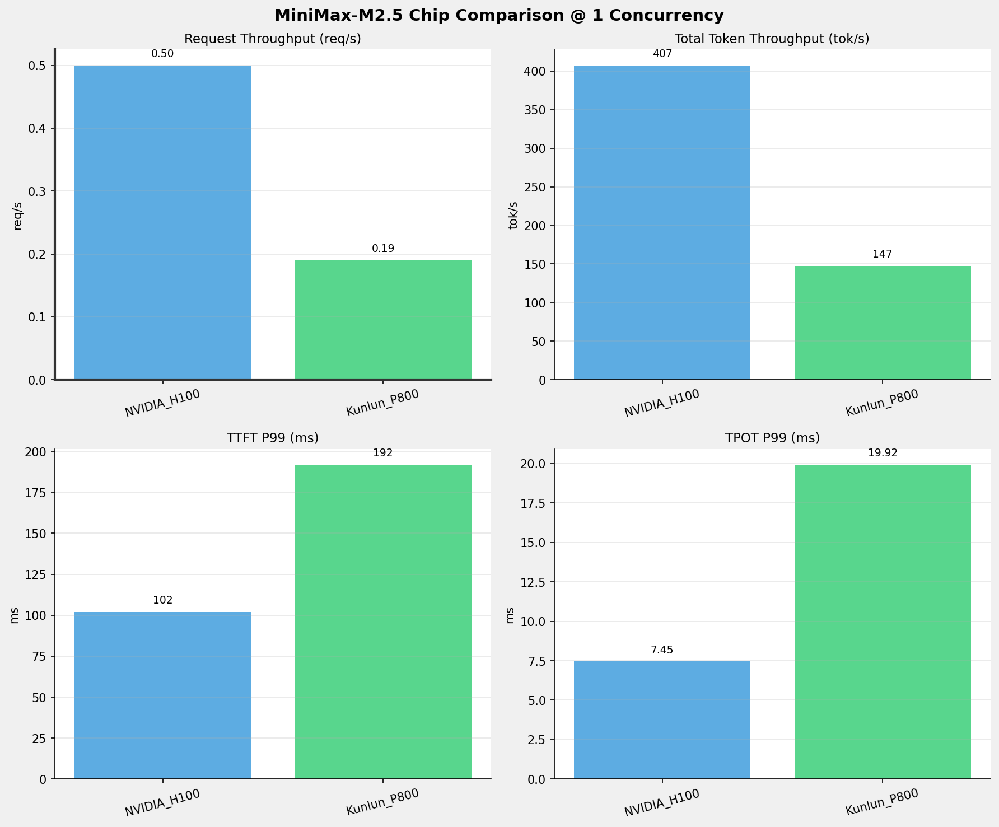
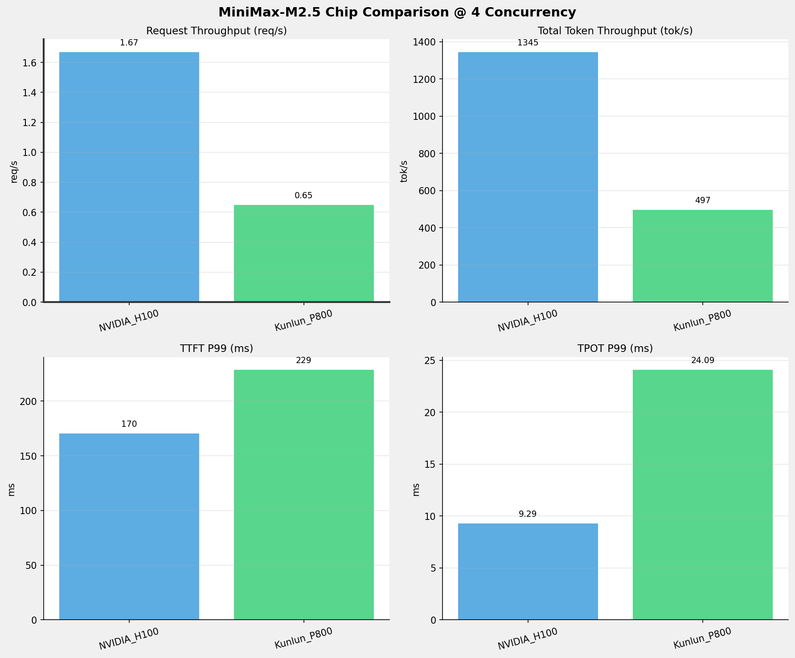
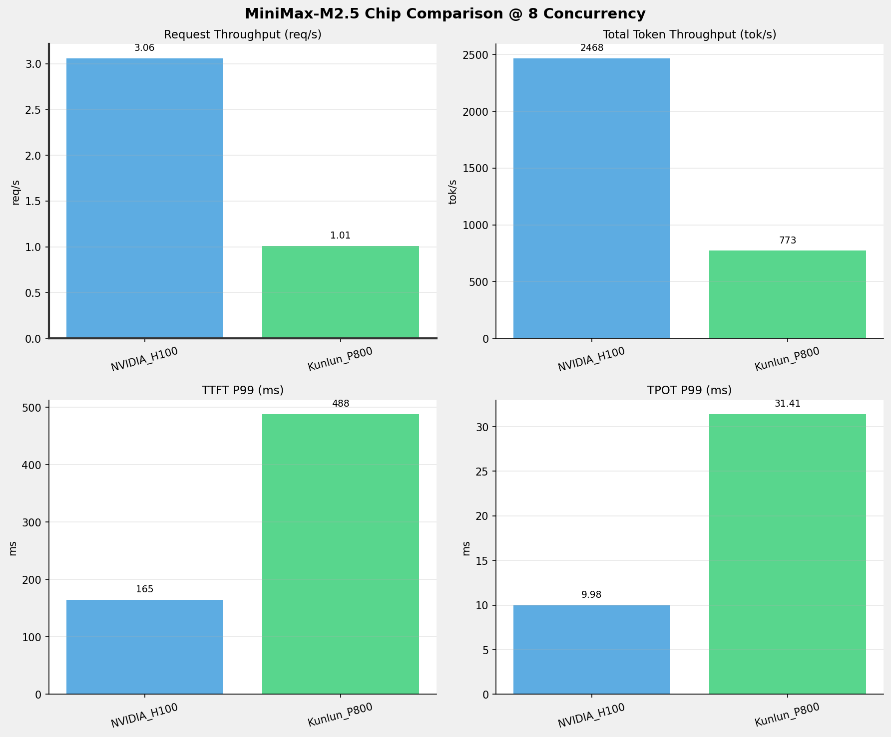
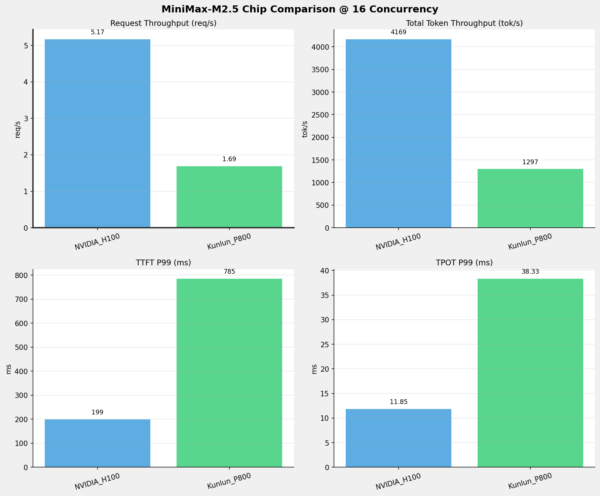
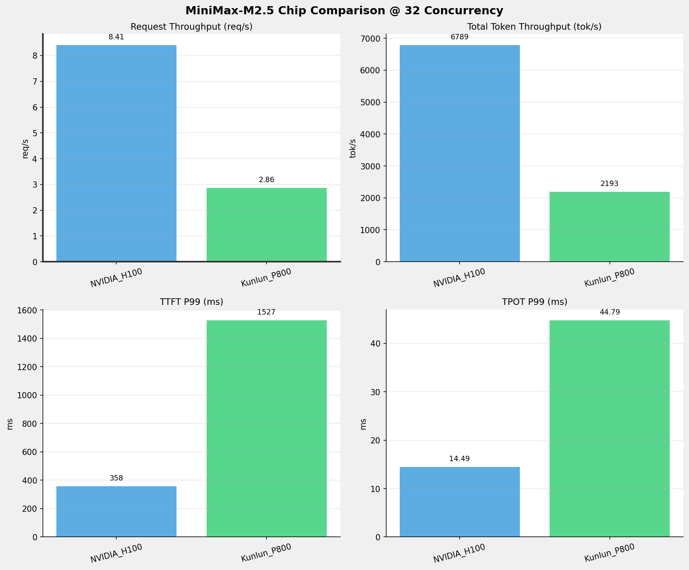
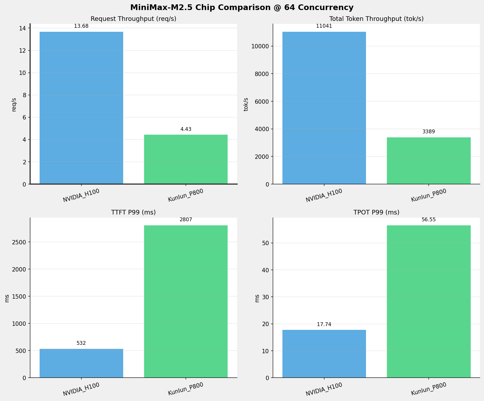
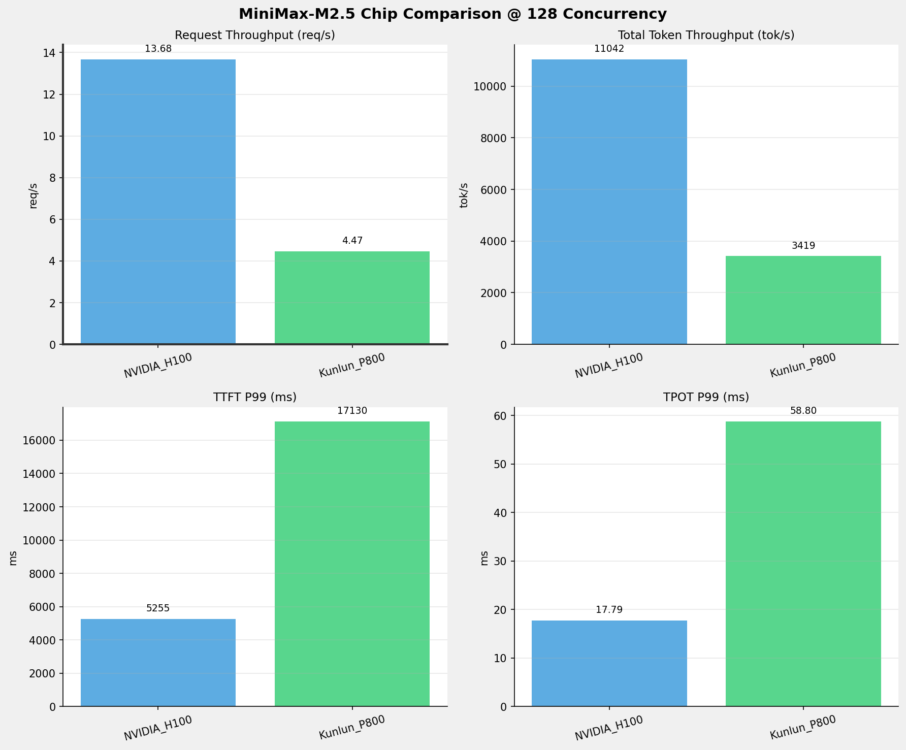
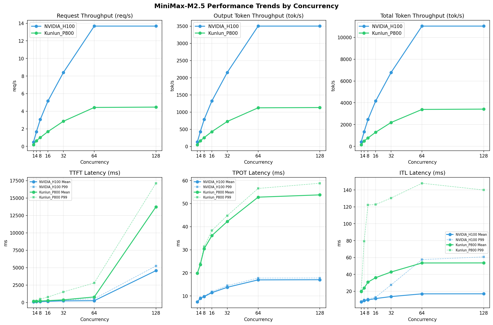

# MiniMax-M2.5模型在不同芯片下的benchmark基准测试报告

**测试日期：** 2026-05-25

---

## 测试场景
在固定请求数，输入上下文和输出上下文长度下，使用vllm bench serve工具对并发数逐级增加场景的性能基准验证。并对比同一模型在不同芯片环境上的性能指标。

**主要采集指标**：

| 指标                  | 单位         | 含义                                 |
|---------------------|------------|------------------------------------|
| TTFT                | ms         | Time To First Token，首 token 延迟     |
| TPOT                | ms/token   | Time Per Output Token，每 token 生成时间 |
| Throughput          | tokens/s   | 系统总吞吐                              |
| QPS                 | requests/s | 请求吞吐                               |
| P50/P95/P99 Latency | ms         | 延迟分位数                              |
    
### 📊 测试概览

| 项目            | 配置                                     | 备注  |
|---------------|----------------------------------------|-----|
| **数据集**       | random                                 |     |
| **并发数**       | 1, 4, 8, 16, 32, 64, 128    |     |
| **总请求数**      | 1000                                    |     |
| **请求输入上下文长度** | 512（0.50k）                             |     |
| **请求输出上下文长度** | 256（0.25k）                             |     |
| **被测芯片**      | NVIDIA_H100, Kunlun_P800 |     |
| **被测模型**      | MiniMax-M2.5 |     |

---

### 🤖 芯片和模型配置信息

| 参数名称 | **NVIDIA_H100** | **Kunlun_P800** |
|----------|----------|----------|
| **max_position_embeddings** | 196608 | 196608 |
| **model_name** | MiniMax-M2.5 | MiniMax-M2.5-W8A8-INT8-Dynamic |
| **model_size** | 215G | 215G |
| **python_version** | 3.12.3 | 3.10.15 |
| **quantization_config** | FP8 | int-8 |
| **temperature** | 1.0 | 1.0 |
| **top_k** | 40 | 40 |
| **top_p** | 0.95 | 0.95 |
| **transformers_version** | 4.46.1 | 4.46.1 |
| **vllm_version** | 0.20.0 | 0.11.0 |

---

### ⚙️ vLLM启动配置信息

| 参数名称 | **NVIDIA_H100** | **Kunlun_P800** |
|----------|----------|----------|
| **Block Size** | default | 128 |
| **Compilation Config** | N/A | {"splitting_ops":["vllm.unified_attention","vllm.unified_attention_with_output","vllm.unified_attention_with_output_kunlun","vllm.mamba_mixer2","vllm.mamba_mixer","vllm.short_conv","vllm.linear_attention","vllm.plamo2_mamba_mixer","vllm.gdn_attention","vllm.sparse_attn_indexer","vllm.sparse_attn_indexer_vllm_kunlun"]} |
| **Dp** | 1 | 1 |
| **Dtype** | default | auto |
| **Enable Auto Tool Choice** | True | True |
| **Enable Export Parallel** | True | False |
| **Gpu Memory Utilization** | 0.85 | 0.95 |
| **Max Model Len** | 196608 | 196608 |
| **Max Num Batched Tokens** | 8192 | 8192 |
| **Max Num Seqs** | 64 | 64 |
| **Model Name** | MiniMax-M2.5 | MiniMax-M2.5-W8A8-INT8-Dynamic |
| **Pp** | 1 | 1 |
| **Reasoning Parser** | minimax_m2 | minimax_m2 (不生效) |
| **Tool Call Parser** | minimax_m2 | minimax_m2 |
| **Tp** | 8 | 8 |

- **NVIDIA_H100**: 英伟达H100标准配置
- **Kunlun_P800**: 昆仑芯不启用专家并行避免通信问题

---

### 📊 芯片性能对比柱状图

**1并发**

**4并发**

**8并发**

**16并发**

**32并发**

**64并发**

**128并发**

### 📈 性能趋势对比图 (所有芯片)

---

### 📈 各指标随并发级别性能对比详情

#### 请求吞吐量（Request throughput (req/s)）

| 并发数 | NVIDIA_H100 | Kunlun_P800 | 差值 | 百分比 |
|-----|----------- | ----------- | ----------- | -----------|
| 1   | 0.50 | 0.19 | -0.31 | -62.0% |
| 4   | 1.67 | 0.65 | -1.02 | -61.1% |
| 8   | 3.06 | 1.01 | -2.05 | -67.0% |
| 16   | 5.17 | 1.69 | -3.48 | -67.3% |
| 32   | 8.41 | 2.86 | -5.55 | -66.0% |
| 64   | 13.68 | 4.43 | -9.25 | -67.6% |
| 128   | 13.68 | 4.47 | -9.21 | -67.3% |

#### 输出token吞吐量（Output token throughput (tok/s)）

| 并发数 | NVIDIA_H100 | Kunlun_P800 | 差值 | 百分比 |
|-----|----------- | ----------- | ----------- | -----------|
| 1   | 129.25 | 48.82 | -80.43 | -62.2% |
| 4   | 426.71 | 164.75 | -261.96 | -61.4% |
| 8   | 782.80 | 256.36 | -526.44 | -67.3% |
| 16   | 1322.61 | 429.77 | -892.84 | -67.5% |
| 32   | 2153.58 | 726.68 | -1426.90 | -66.3% |
| 64   | 3502.52 | 1124.09 | -2378.43 | -67.9% |
| 128   | 3502.84 | 1131.92 | -2370.92 | -67.7% |

#### 总token吞吐量（Total token throughput (tok/s)）

| 并发数 | NVIDIA_H100 | Kunlun_P800 | 差值 | 百分比 |
|-----|----------- | ----------- | ----------- | -----------|
| 1   | 407.43 | 147.45 | -259.98 | -63.8% |
| 4   | 1345.13 | 496.80 | -848.33 | -63.1% |
| 8   | 2467.65 | 772.95 | -1694.70 | -68.7% |
| 16   | 4169.31 | 1297.33 | -2871.98 | -68.9% |
| 32   | 6788.82 | 2192.55 | -4596.27 | -67.7% |
| 64   | 11041.15 | 3389.25 | -7651.90 | -69.3% |
| 128   | 11042.17 | 3419.10 | -7623.07 | -69.0% |

#### 首token延迟（P99 TTFT (ms)）

| 并发数 | NVIDIA_H100 | Kunlun_P800 | 差值 | 百分比 |
|-----|----------- | ----------- | ----------- | -----------|
| 1   | 101.94 | 191.87 | +89.93 | +88.2% |
| 4   | 170.36 | 228.68 | +58.32 | +34.2% |
| 8   | 165.00 | 488.42 | +323.42 | +196.0% |
| 16   | 199.16 | 784.91 | +585.75 | +294.1% |
| 32   | 357.62 | 1527.13 | +1169.51 | +327.0% |
| 64   | 531.95 | 2807.47 | +2275.52 | +427.8% |
| 128   | 5255.30 | 17130.20 | +11874.90 | +226.0% |

#### 每token生成时间（P99 TPOT (ms)）

| 并发数 | NVIDIA_H100 | Kunlun_P800 | 差值 | 百分比 |
|-----|----------- | ----------- | ----------- | -----------|
| 1   | 7.45 | 19.92 | +12.47 | +167.4% |
| 4   | 9.29 | 24.09 | +14.80 | +159.3% |
| 8   | 9.98 | 31.41 | +21.43 | +214.7% |
| 16   | 11.85 | 38.33 | +26.48 | +223.5% |
| 32   | 14.49 | 44.79 | +30.30 | +209.1% |
| 64   | 17.74 | 56.55 | +38.81 | +218.8% |
| 128   | 17.79 | 58.80 | +41.01 | +230.5% |

#### token间延迟（P99 ITL (ms)）

| 并发数 | NVIDIA_H100 | Kunlun_P800 | 差值 | 百分比 |
|-----|----------- | ----------- | ----------- | -----------|
| 1   | 7.97 | 20.42 | +12.45 | +156.2% |
| 4   | 9.95 | 79.23 | +69.28 | +696.3% |
| 8   | 10.91 | 122.22 | +111.31 | +1020.3% |
| 16   | 13.06 | 122.71 | +109.65 | +839.6% |
| 32   | 27.58 | 130.47 | +102.89 | +373.1% |
| 64   | 57.55 | 147.93 | +90.38 | +157.0% |
| 128   | 60.71 | 139.94 | +79.23 | +130.5% |

### 📈 各并发级别性能对比详情

### 1 并发

#### 服务基准结果

| 指标 | NVIDIA_H100 | Kunlun_P800 |
|------|----------- | -----------|
| 成功请求数 | 1000 | 1000 |
| 失败请求数 | 0 | 0 |
| 测试持续时间 (s) | 1980.70 | 5190.01 |
| 总输入 tokens | 551000 | 511867 |
| 总生成 tokens | 256000 | 253377 |
| **请求吞吐量 (req/s)** | **0.50** ⭐ | 0.19 |
| **输出 token 吞吐量 (tok/s)** | **129.25** ⭐ | 48.82 |
| 峰值输出 token 吞吐量 (tok/s) | **136.00** ⭐ | 52.00 |
| 峰值并发请求数 | 2.00 | 2.00 |
| **总 token 吞吐量 (tok/s)** | **407.43** ⭐ | 147.45 |

#### 首Token延迟 (TTFT)

| 指标 | NVIDIA_H100 | Kunlun_P800 |
|------|----------- | -----------|
| 平均 TTFT (ms) | **83.60** ⭐ | 182.34 |
| 中位 TTFT (ms) | **82.89** ⭐ | 184.41 |
| P95 TTFT (ms) | **97.10** ⭐ | 188.81 |
| P99 TTFT (ms) | **101.94** ⭐ | 191.87 |

#### 每Token生成时间 (TPOT)

| 指标 | NVIDIA_H100 | Kunlun_P800 |
|------|----------- | -----------|
| 平均 TPOT (ms) | **7.44** ⭐ | 19.84 |
| 中位 TPOT (ms) | **7.44** ⭐ | 19.84 |
| P95 TPOT (ms) | **7.45** ⭐ | 19.88 |
| P99 TPOT (ms) | **7.45** ⭐ | 19.92 |

#### Token间延迟 (ITL)

| 指标 | NVIDIA_H100 | Kunlun_P800 |
|------|----------- | -----------|
| 平均 ITL (ms) | **7.43** ⭐ | 19.78 |
| 中位 ITL (ms) | **7.43** ⭐ | 19.82 |
| P95 ITL (ms) | **7.55** ⭐ | 19.99 |
| P99 ITL (ms) | **7.97** ⭐ | 20.42 |

---

### 4 并发

#### 服务基准结果

| 指标 | NVIDIA_H100 | Kunlun_P800 |
|------|----------- | -----------|
| 成功请求数 | 1000 | 1000 |
| 失败请求数 | 0 | 0 |
| 测试持续时间 (s) | 599.94 | 1541.56 |
| 总输入 tokens | 551000 | 511867 |
| 总生成 tokens | 256000 | 253974 |
| **请求吞吐量 (req/s)** | **1.67** ⭐ | 0.65 |
| **输出 token 吞吐量 (tok/s)** | **426.71** ⭐ | 164.75 |
| 峰值输出 token 吞吐量 (tok/s) | **463.00** ⭐ | 181.00 |
| 峰值并发请求数 | 8.00 | 7.00 |
| **总 token 吞吐量 (tok/s)** | **1345.13** ⭐ | 496.80 |

#### 首Token延迟 (TTFT)

| 指标 | NVIDIA_H100 | Kunlun_P800 |
|------|----------- | -----------|
| 平均 TTFT (ms) | **113.66** ⭐ | 188.47 |
| 中位 TTFT (ms) | **125.99** ⭐ | 188.04 |
| P95 TTFT (ms) | **158.29** ⭐ | 225.36 |
| P99 TTFT (ms) | **170.36** ⭐ | 228.68 |

#### 每Token生成时间 (TPOT)

| 指标 | NVIDIA_H100 | Kunlun_P800 |
|------|----------- | -----------|
| 平均 TPOT (ms) | **8.96** ⭐ | 23.60 |
| 中位 TPOT (ms) | **8.99** ⭐ | 23.76 |
| P95 TPOT (ms) | **9.25** ⭐ | 23.86 |
| P99 TPOT (ms) | **9.29** ⭐ | 24.09 |

#### Token间延迟 (ITL)

| 指标 | NVIDIA_H100 | Kunlun_P800 |
|------|----------- | -----------|
| 平均 ITL (ms) | **8.95** ⭐ | 23.79 |
| 中位 ITL (ms) | **8.82** ⭐ | 22.61 |
| P95 ITL (ms) | **9.10** ⭐ | 22.98 |
| P99 ITL (ms) | **9.95** ⭐ | 79.23 |

---

### 8 并发

#### 服务基准结果

| 指标 | NVIDIA_H100 | Kunlun_P800 |
|------|----------- | -----------|
| 成功请求数 | 1000 | 1000 |
| 失败请求数 | 0 | 0 |
| 测试持续时间 (s) | 327.03 | 990.85 |
| 总输入 tokens | 551000 | 511867 |
| 总生成 tokens | 256000 | 254016 |
| **请求吞吐量 (req/s)** | **3.06** ⭐ | 1.01 |
| **输出 token 吞吐量 (tok/s)** | **782.80** ⭐ | 256.36 |
| 峰值输出 token 吞吐量 (tok/s) | **838.00** ⭐ | 291.00 |
| 峰值并发请求数 | 16.00 | 16.00 |
| **总 token 吞吐量 (tok/s)** | **2467.65** ⭐ | 772.95 |

#### 首Token延迟 (TTFT)

| 指标 | NVIDIA_H100 | Kunlun_P800 |
|------|----------- | -----------|
| 平均 TTFT (ms) | **125.34** ⭐ | 212.44 |
| 中位 TTFT (ms) | **137.59** ⭐ | 206.09 |
| P95 TTFT (ms) | **154.04** ⭐ | 323.90 |
| P99 TTFT (ms) | **165.00** ⭐ | 488.42 |

#### 每Token生成时间 (TPOT)

| 指标 | NVIDIA_H100 | Kunlun_P800 |
|------|----------- | -----------|
| 平均 TPOT (ms) | **9.77** ⭐ | 30.41 |
| 中位 TPOT (ms) | **9.74** ⭐ | 30.91 |
| P95 TPOT (ms) | **9.95** ⭐ | 31.09 |
| P99 TPOT (ms) | **9.98** ⭐ | 31.41 |

#### Token间延迟 (ITL)

| 指标 | NVIDIA_H100 | Kunlun_P800 |
|------|----------- | -----------|
| 平均 ITL (ms) | **9.76** ⭐ | 30.90 |
| 中位 ITL (ms) | **9.74** ⭐ | 28.44 |
| P95 ITL (ms) | **10.09** ⭐ | 31.95 |
| P99 ITL (ms) | **10.91** ⭐ | 122.22 |

---

### 16 并发

#### 服务基准结果

| 指标 | NVIDIA_H100 | Kunlun_P800 |
|------|----------- | -----------|
| 成功请求数 | 1000 | 1000 |
| 失败请求数 | 0 | 0 |
| 测试持续时间 (s) | 193.56 | 590.01 |
| 总输入 tokens | 551000 | 511867 |
| 总生成 tokens | 256000 | 253573 |
| **请求吞吐量 (req/s)** | **5.17** ⭐ | 1.69 |
| **输出 token 吞吐量 (tok/s)** | **1322.61** ⭐ | 429.77 |
| 峰值输出 token 吞吐量 (tok/s) | **1453.00** ⭐ | 512.00 |
| 峰值并发请求数 | 32.00 | 30.00 |
| **总 token 吞吐量 (tok/s)** | **4169.31** ⭐ | 1297.33 |

#### 首Token延迟 (TTFT)

| 指标 | NVIDIA_H100 | Kunlun_P800 |
|------|----------- | -----------|
| 平均 TTFT (ms) | **164.12** ⭐ | 263.57 |
| 中位 TTFT (ms) | **172.67** ⭐ | 218.00 |
| P95 TTFT (ms) | **194.98** ⭐ | 550.04 |
| P99 TTFT (ms) | **199.16** ⭐ | 784.91 |

#### 每Token生成时间 (TPOT)

| 指标 | NVIDIA_H100 | Kunlun_P800 |
|------|----------- | -----------|
| 平均 TPOT (ms) | **11.42** ⭐ | 36.13 |
| 中位 TPOT (ms) | **11.44** ⭐ | 36.42 |
| P95 TPOT (ms) | **11.76** ⭐ | 38.08 |
| P99 TPOT (ms) | **11.85** ⭐ | 38.33 |

#### Token间延迟 (ITL)

| 指标 | NVIDIA_H100 | Kunlun_P800 |
|------|----------- | -----------|
| 平均 ITL (ms) | **11.41** ⭐ | 36.14 |
| 中位 ITL (ms) | **11.32** ⭐ | 32.65 |
| P95 ITL (ms) | **11.79** ⭐ | 56.60 |
| P99 ITL (ms) | **13.06** ⭐ | 122.71 |

---

### 32 并发

#### 服务基准结果

| 指标 | NVIDIA_H100 | Kunlun_P800 |
|------|----------- | -----------|
| 成功请求数 | 1000 | 1000 |
| 失败请求数 | 0 | 0 |
| 测试持续时间 (s) | 118.87 | 349.19 |
| 总输入 tokens | 551000 | 511867 |
| 总生成 tokens | 256000 | 253748 |
| **请求吞吐量 (req/s)** | **8.41** ⭐ | 2.86 |
| **输出 token 吞吐量 (tok/s)** | **2153.58** ⭐ | 726.68 |
| 峰值输出 token 吞吐量 (tok/s) | **2432.00** ⭐ | 896.00 |
| 峰值并发请求数 | 64.00 | 62.00 |
| **总 token 吞吐量 (tok/s)** | **6788.82** ⭐ | 2192.55 |

#### 首Token延迟 (TTFT)

| 指标 | NVIDIA_H100 | Kunlun_P800 |
|------|----------- | -----------|
| 平均 TTFT (ms) | **231.55** ⭐ | 378.90 |
| 中位 TTFT (ms) | **239.01** ⭐ | 268.99 |
| P95 TTFT (ms) | **329.67** ⭐ | 1128.92 |
| P99 TTFT (ms) | **357.62** ⭐ | 1527.13 |

#### 每Token生成时间 (TPOT)

| 指标 | NVIDIA_H100 | Kunlun_P800 |
|------|----------- | -----------|
| 平均 TPOT (ms) | **13.77** ⭐ | 42.23 |
| 中位 TPOT (ms) | **13.76** ⭐ | 43.07 |
| P95 TPOT (ms) | **14.33** ⭐ | 44.48 |
| P99 TPOT (ms) | **14.49** ⭐ | 44.79 |

#### Token间延迟 (ITL)

| 指标 | NVIDIA_H100 | Kunlun_P800 |
|------|----------- | -----------|
| 平均 ITL (ms) | **13.75** ⭐ | 42.85 |
| 中位 ITL (ms) | **13.39** ⭐ | 37.39 |
| P95 ITL (ms) | **13.92** ⭐ | 124.39 |
| P99 ITL (ms) | **27.58** ⭐ | 130.47 |

---

### 64 并发

#### 服务基准结果

| 指标 | NVIDIA_H100 | Kunlun_P800 |
|------|----------- | -----------|
| 成功请求数 | 1000 | 1000 |
| 失败请求数 | 0 | 0 |
| 测试持续时间 (s) | 73.09 | 225.97 |
| 总输入 tokens | 551000 | 511867 |
| 总生成 tokens | 256000 | 254014 |
| **请求吞吐量 (req/s)** | **13.68** ⭐ | 4.43 |
| **输出 token 吞吐量 (tok/s)** | **3502.52** ⭐ | 1124.09 |
| 峰值输出 token 吞吐量 (tok/s) | **4066.00** ⭐ | 1483.00 |
| 峰值并发请求数 | 128.00 | 116.00 |
| **总 token 吞吐量 (tok/s)** | **11041.15** ⭐ | 3389.25 |

#### 首Token延迟 (TTFT)

| 指标 | NVIDIA_H100 | Kunlun_P800 |
|------|----------- | -----------|
| 平均 TTFT (ms) | **259.04** ⭐ | 793.11 |
| 中位 TTFT (ms) | **256.14** ⭐ | 341.31 |
| P95 TTFT (ms) | **457.44** ⭐ | 2225.45 |
| P99 TTFT (ms) | **531.95** ⭐ | 2807.47 |

#### 每Token生成时间 (TPOT)

| 指标 | NVIDIA_H100 | Kunlun_P800 |
|------|----------- | -----------|
| 平均 TPOT (ms) | **16.97** ⭐ | 52.78 |
| 中位 TPOT (ms) | **17.07** ⭐ | 53.91 |
| P95 TPOT (ms) | **17.45** ⭐ | 56.16 |
| P99 TPOT (ms) | **17.74** ⭐ | 56.55 |

#### Token间延迟 (ITL)

| 指标 | NVIDIA_H100 | Kunlun_P800 |
|------|----------- | -----------|
| 平均 ITL (ms) | **16.97** ⭐ | 53.53 |
| 中位 ITL (ms) | **16.14** ⭐ | 44.78 |
| P95 ITL (ms) | **16.92** ⭐ | 127.90 |
| P99 ITL (ms) | **57.55** ⭐ | 147.93 |

---

### 128 并发

#### 服务基准结果

| 指标 | NVIDIA_H100 | Kunlun_P800 |
|------|----------- | -----------|
| 成功请求数 | 1000 | 1000 |
| 失败请求数 | 0 | 0 |
| 测试持续时间 (s) | 73.08 | 223.80 |
| 总输入 tokens | 551000 | 511867 |
| 总生成 tokens | 256000 | 253321 |
| **请求吞吐量 (req/s)** | **13.68** ⭐ | 4.47 |
| **输出 token 吞吐量 (tok/s)** | **3502.84** ⭐ | 1131.92 |
| 峰值输出 token 吞吐量 (tok/s) | **4045.00** ⭐ | 1508.00 |
| 峰值并发请求数 | 192.00 | 164.00 |
| **总 token 吞吐量 (tok/s)** | **11042.17** ⭐ | 3419.10 |

#### 首Token延迟 (TTFT)

| 指标 | NVIDIA_H100 | Kunlun_P800 |
|------|----------- | -----------|
| 平均 TTFT (ms) | **4575.95** ⭐ | 13743.45 |
| 中位 TTFT (ms) | **4836.70** ⭐ | 14500.80 |
| P95 TTFT (ms) | **4979.31** ⭐ | 16236.65 |
| P99 TTFT (ms) | **5255.30** ⭐ | 17130.20 |

#### 每Token生成时间 (TPOT)

| 指标 | NVIDIA_H100 | Kunlun_P800 |
|------|----------- | -----------|
| 平均 TPOT (ms) | **17.04** ⭐ | 53.77 |
| 中位 TPOT (ms) | **17.12** ⭐ | 55.15 |
| P95 TPOT (ms) | **17.50** ⭐ | 58.00 |
| P99 TPOT (ms) | **17.79** ⭐ | 58.80 |

#### Token间延迟 (ITL)

| 指标 | NVIDIA_H100 | Kunlun_P800 |
|------|----------- | -----------|
| 平均 ITL (ms) | **17.01** ⭐ | 53.60 |
| 中位 ITL (ms) | **16.17** ⭐ | 44.61 |
| P95 ITL (ms) | **16.94** ⭐ | 125.83 |
| P99 ITL (ms) | **60.71** ⭐ | 139.94 |

---

---

*报告生成时间: 2026-05-25*

