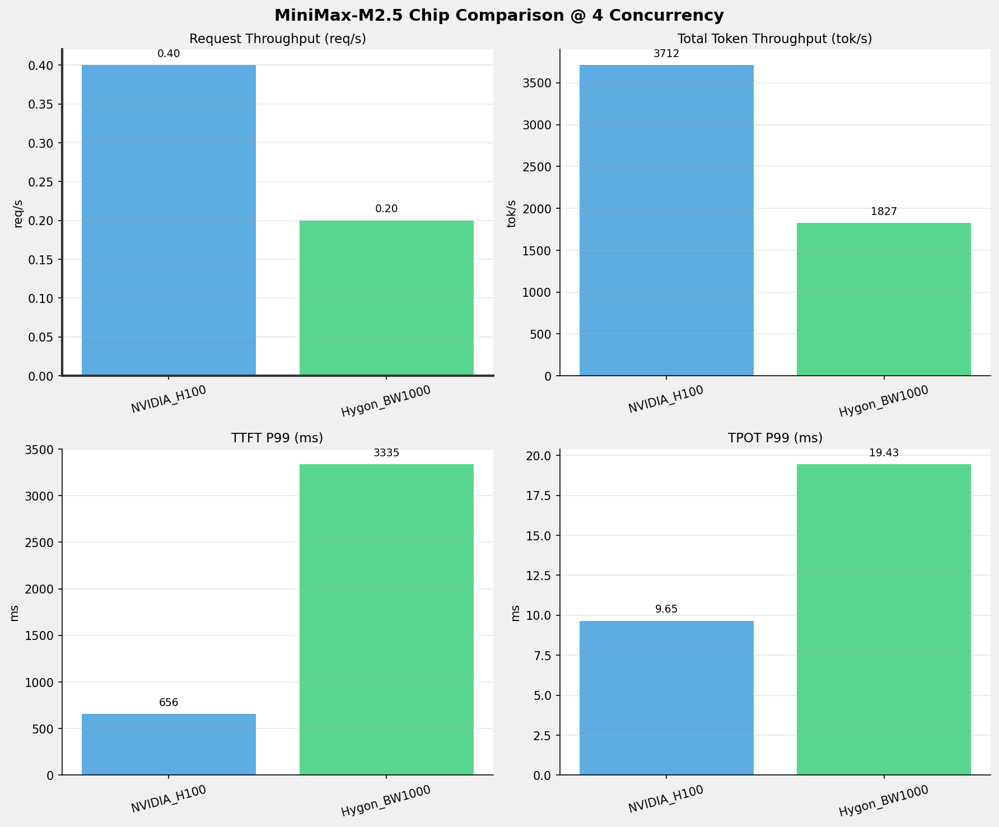
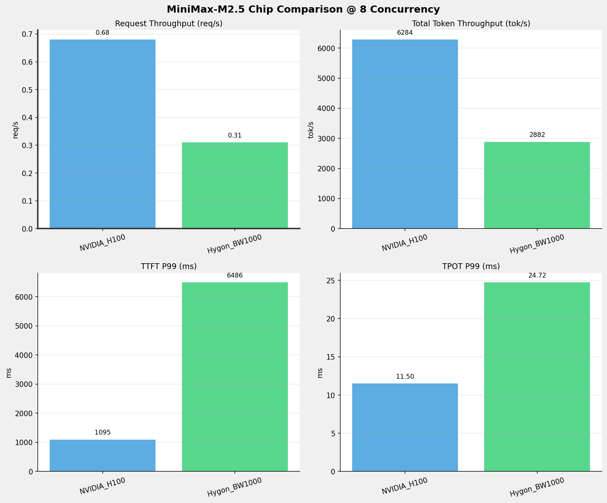
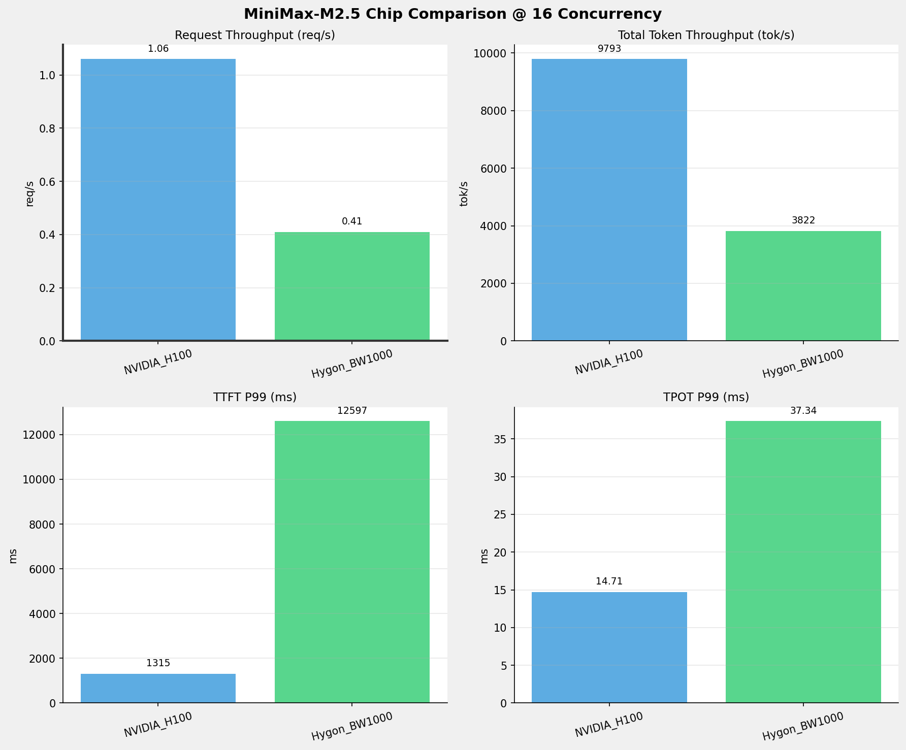
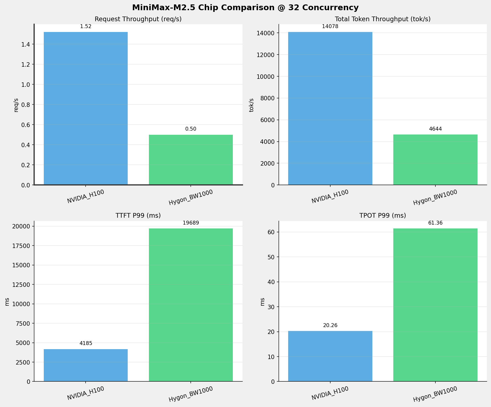
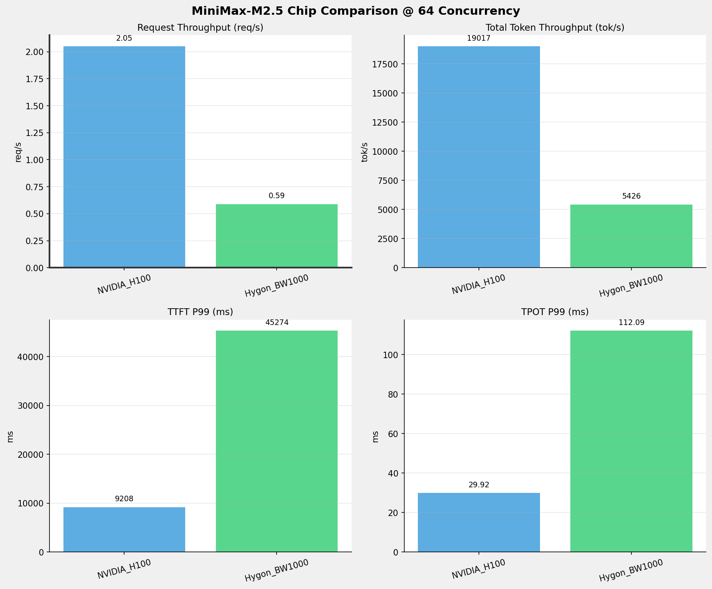
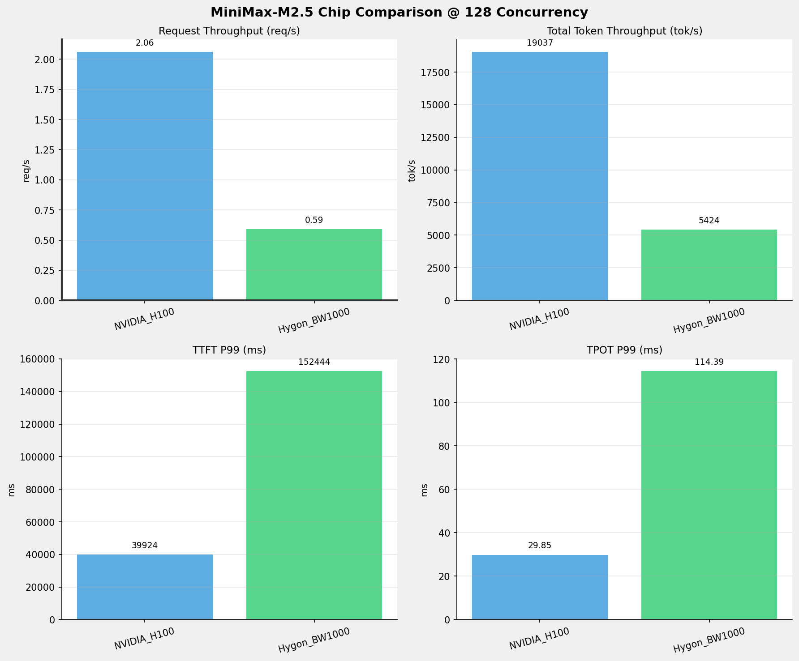
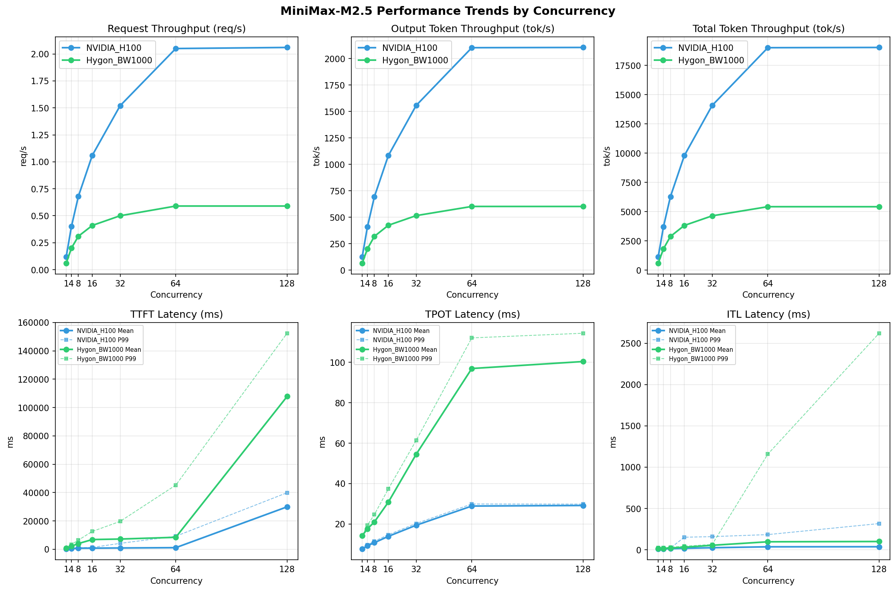

# MiniMax-M2.5模型在不同芯片下的benchmark基准测试报告

**测试日期：** 2026-05-19

---

## 测试场景
在固定请求数，输入上下文和输出上下文长度下，使用vllm bench serve工具对并发数逐级增加场景的性能基准验证。并对比同一模型在不同芯片环境上的性能指标。

**主要采集指标**：

| 指标                  | 单位         | 含义                                 |
|---------------------|------------|------------------------------------|
| TTFT                | ms         | Time To First Token，首 token 延迟     |
| TPOT                | ms/token   | Time Per Output Token，每 token 生成时间 |
| Throughput          | tokens/s   | 系统总吞吐                              |
| QPS                 | requests/s | 请求吞吐                               |
| P50/P95/P99 Latency | ms         | 延迟分位数                              |
    
### 📊 测试概览

| 项目            | 配置                                     | 备注  |
|---------------|----------------------------------------|-----|
| **数据集**       | random                                 |     |
| **并发数**       | 1, 4, 8, 16, 32, 64, 128    |     |
| **总请求数**      | 1000                                    |     |
| **请求输入上下文长度** | 8192（8k）                             |     |
| **请求输出上下文长度** | 1024（1k）                             |     |
| **被测芯片**      | NVIDIA_H100, Hygon_BW1000 |     |
| **被测模型**      | MiniMax-M2.5 |     |

---

### 🤖 芯片和模型配置信息

| 参数名称 | **NVIDIA_H100** | **Hygon_BW1000** |
|----------|----------|----------|
| **max_position_embeddings** | 196608 | 196608 |
| **model_name** | MiniMax-M2.5 | MiniMax-M2.5-W8A8 |
| **model_size** | 215G | 215G |
| **python_version** | 3.12.3 | 3.10.12 |
| **quantization_config** | FP16 | int-8 |
| **temperature** | N/A | N/A |
| **top_k** | N/A | N/A |
| **top_p** | N/A | N/A |
| **transformers_version** | 4.46.1 | 4.57.6 |
| **vllm_version** | 0.15.1 | 0.15.1+das.opt1.alpha.dtk2604 |

---

### ⚙️ vLLM启动配置信息

| 参数名称 | **NVIDIA_H100** | **Hygon_BW1000** |
|----------|----------|----------|
| **Block Size** | default | default |
| **Compilation Config** | N/A | N/A |
| **Dp** | 1 | 1 |
| **Dtype** | default | bfloat16 |
| **Enable Auto Tool Choice** | True | True |
| **Enable Export Parallel** | True | True |
| **Gpu Memory Utilization** | 0.85 | 0.9 |
| **Max Model Len** | 196608 | 196608 |
| **Max Num Batched Tokens** | 8192 | default |
| **Max Num Seqs** | 10 | 64 |
| **Model Name** | MiniMax-M2.5 | MiniMax-M2.5-W8A8 |
| **Pp** | 1 | 1 |
| **Reasoning Parser** | minimax_m2 | minimax_m2 (不生效) |
| **Tool Call Parser** | minimax_m2 | minimax_m2 |
| **Tp** | 8 | 8 |

- **NVIDIA_H100**: 英伟达H100标准配置
- **Hygon_BW1000**: 海光芯片专家并行配置

---

### 📊 芯片性能对比柱状图

**1并发**

**4并发**

**8并发**

**16并发**

**32并发**

**64并发**

**128并发**

### 📈 性能趋势对比图 (所有芯片)

---

### 📈 各指标随并发级别性能对比详情

#### 请求吞吐量（Request throughput (req/s)）

| 并发数 | NVIDIA_H100 | Hygon_BW1000 | 差值 | 百分比 |
|-----|----------- | ----------- | ----------- | -----------|
| 1   | 0.12 | 0.06 | -0.06 | -50.0% |
| 4   | 0.40 | 0.20 | -0.20 | -50.0% |
| 8   | 0.68 | 0.31 | -0.37 | -54.4% |
| 16   | 1.06 | 0.41 | -0.65 | -61.3% |
| 32   | 1.52 | 0.50 | -1.02 | -67.1% |
| 64   | 2.05 | 0.59 | -1.46 | -71.2% |
| 128   | 2.06 | 0.59 | -1.47 | -71.4% |

#### 输出token吞吐量（Output token throughput (tok/s)）

| 并发数 | NVIDIA_H100 | Hygon_BW1000 | 差值 | 百分比 |
|-----|----------- | ----------- | ----------- | -----------|
| 1   | 127.41 | 66.11 | -61.30 | -48.1% |
| 4   | 410.74 | 202.97 | -207.77 | -50.6% |
| 8   | 695.31 | 320.18 | -375.13 | -54.0% |
| 16   | 1083.50 | 424.67 | -658.83 | -60.8% |
| 32   | 1557.65 | 516.05 | -1041.60 | -66.9% |
| 64   | 2104.06 | 602.89 | -1501.17 | -71.3% |
| 128   | 2106.36 | 602.62 | -1503.74 | -71.4% |

#### 总token吞吐量（Total token throughput (tok/s)）

| 并发数 | NVIDIA_H100 | Hygon_BW1000 | 差值 | 百分比 |
|-----|----------- | ----------- | ----------- | -----------|
| 1   | 1151.56 | 594.97 | -556.59 | -48.3% |
| 4   | 3712.34 | 1826.69 | -1885.65 | -50.8% |
| 8   | 6284.28 | 2881.59 | -3402.69 | -54.1% |
| 16   | 9792.79 | 3822.06 | -5970.73 | -61.0% |
| 32   | 14078.15 | 4644.47 | -9433.68 | -67.0% |
| 64   | 19016.63 | 5425.98 | -13590.65 | -71.5% |
| 128   | 19037.48 | 5423.60 | -13613.88 | -71.5% |

#### 首token延迟（P99 TTFT (ms)）

| 并发数 | NVIDIA_H100 | Hygon_BW1000 | 差值 | 百分比 |
|-----|----------- | ----------- | ----------- | -----------|
| 1   | 219.81 | 892.34 | +672.53 | +306.0% |
| 4   | 656.13 | 3335.25 | +2679.12 | +408.3% |
| 8   | 1095.11 | 6485.86 | +5390.75 | +492.3% |
| 16   | 1314.68 | 12596.58 | +11281.90 | +858.1% |
| 32   | 4184.75 | 19688.71 | +15503.96 | +370.5% |
| 64   | 9208.08 | 45274.45 | +36066.37 | +391.7% |
| 128   | 39923.84 | 152443.57 | +112519.73 | +281.8% |

#### 每token生成时间（P99 TPOT (ms)）

| 并发数 | NVIDIA_H100 | Hygon_BW1000 | 差值 | 百分比 |
|-----|----------- | ----------- | ----------- | -----------|
| 1   | 7.67 | 14.31 | +6.64 | +86.6% |
| 4   | 9.65 | 19.43 | +9.78 | +101.3% |
| 8   | 11.50 | 24.72 | +13.22 | +115.0% |
| 16   | 14.71 | 37.34 | +22.63 | +153.8% |
| 32   | 20.26 | 61.36 | +41.10 | +202.9% |
| 64   | 29.92 | 112.09 | +82.17 | +274.6% |
| 128   | 29.85 | 114.39 | +84.54 | +283.2% |

#### token间延迟（P99 ITL (ms)）

| 并发数 | NVIDIA_H100 | Hygon_BW1000 | 差值 | 百分比 |
|-----|----------- | ----------- | ----------- | -----------|
| 1   | 15.53 | 23.17 | +7.64 | +49.2% |
| 4   | 18.64 | 24.63 | +5.99 | +32.1% |
| 8   | 21.33 | 32.22 | +10.89 | +51.1% |
| 16   | 152.01 | 43.69 | -108.32 | -71.3% |
| 32   | 159.35 | 64.07 | -95.28 | -59.8% |
| 64   | 183.86 | 1157.52 | +973.66 | +529.6% |
| 128   | 317.44 | 2621.29 | +2303.85 | +725.8% |

### 📈 各并发级别性能对比详情

### 1 并发

#### 服务基准结果

| 指标 | NVIDIA_H100 | Hygon_BW1000 |
|------|----------- | -----------|
| 成功请求数 | 1000 | 1000 |
| 失败请求数 | 0 | 0 |
| 测试持续时间 (s) | 8036.89 | 15489.87 |
| 总输入 tokens | 8231000 | 8192000 |
| 总生成 tokens | 1024000 | 1024000 |
| **请求吞吐量 (req/s)** | **0.12** ⭐ | 0.06 |
| **输出 token 吞吐量 (tok/s)** | **127.41** ⭐ | 66.11 |
| 峰值输出 token 吞吐量 (tok/s) | **133.00** ⭐ | 75.00 |
| 峰值并发请求数 | 2.00 | 2.00 |
| **总 token 吞吐量 (tok/s)** | **1151.56** ⭐ | 594.97 |

#### 首Token延迟 (TTFT)

| 指标 | NVIDIA_H100 | Hygon_BW1000 |
|------|----------- | -----------|
| 平均 TTFT (ms) | **207.63** ⭐ | 872.96 |
| 中位 TTFT (ms) | **208.15** ⭐ | 874.47 |
| P95 TTFT (ms) | **215.72** ⭐ | 882.31 |
| P99 TTFT (ms) | **219.81** ⭐ | 892.34 |

#### 每Token生成时间 (TPOT)

| 指标 | NVIDIA_H100 | Hygon_BW1000 |
|------|----------- | -----------|
| 平均 TPOT (ms) | **7.65** ⭐ | 14.29 |
| 中位 TPOT (ms) | **7.65** ⭐ | 14.29 |
| P95 TPOT (ms) | **7.67** ⭐ | 14.30 |
| P99 TPOT (ms) | **7.67** ⭐ | 14.31 |

#### Token间延迟 (ITL)

| 指标 | NVIDIA_H100 | Hygon_BW1000 |
|------|----------- | -----------|
| 平均 ITL (ms) | **9.67** ⭐ | 14.33 |
| 中位 ITL (ms) | **7.67** ⭐ | 14.29 |
| P95 ITL (ms) | **15.38** ⭐ | 16.03 |
| P99 ITL (ms) | **15.53** ⭐ | 23.17 |

---

### 4 并发

#### 服务基准结果

| 指标 | NVIDIA_H100 | Hygon_BW1000 |
|------|----------- | -----------|
| 成功请求数 | 1000 | 1000 |
| 失败请求数 | 0 | 0 |
| 测试持续时间 (s) | 2493.04 | 5045.19 |
| 总输入 tokens | 8231000 | 8192000 |
| 总生成 tokens | 1024000 | 1024000 |
| **请求吞吐量 (req/s)** | **0.40** ⭐ | 0.20 |
| **输出 token 吞吐量 (tok/s)** | **410.74** ⭐ | 202.97 |
| 峰值输出 token 吞吐量 (tok/s) | **440.00** ⭐ | 264.00 |
| 峰值并发请求数 | 8.00 | 8.00 |
| **总 token 吞吐量 (tok/s)** | **3712.34** ⭐ | 1826.69 |

#### 首Token延迟 (TTFT)

| 指标 | NVIDIA_H100 | Hygon_BW1000 |
|------|----------- | -----------|
| 平均 TTFT (ms) | **500.30** ⭐ | 2171.51 |
| 中位 TTFT (ms) | **512.44** ⭐ | 1900.23 |
| P95 TTFT (ms) | **651.75** ⭐ | 3322.97 |
| P99 TTFT (ms) | **656.13** ⭐ | 3335.25 |

#### 每Token生成时间 (TPOT)

| 指标 | NVIDIA_H100 | Hygon_BW1000 |
|------|----------- | -----------|
| 平均 TPOT (ms) | **9.26** ⭐ | 17.60 |
| 中位 TPOT (ms) | **9.21** ⭐ | 17.51 |
| P95 TPOT (ms) | **9.62** ⭐ | 19.20 |
| P99 TPOT (ms) | **9.65** ⭐ | 19.43 |

#### Token间延迟 (ITL)

| 指标 | NVIDIA_H100 | Hygon_BW1000 |
|------|----------- | -----------|
| 平均 ITL (ms) | **11.75** ⭐ | 17.63 |
| 中位 ITL (ms) | **9.22** ⭐ | 16.47 |
| P95 ITL (ms) | 18.42 | **17.96** ⭐ |
| P99 ITL (ms) | **18.64** ⭐ | 24.63 |

---

### 8 并发

#### 服务基准结果

| 指标 | NVIDIA_H100 | Hygon_BW1000 |
|------|----------- | -----------|
| 成功请求数 | 1000 | 1000 |
| 失败请求数 | 0 | 0 |
| 测试持续时间 (s) | 1472.72 | 3198.24 |
| 总输入 tokens | 8231000 | 8192000 |
| 总生成 tokens | 1024000 | 1024000 |
| **请求吞吐量 (req/s)** | **0.68** ⭐ | 0.31 |
| **输出 token 吞吐量 (tok/s)** | **695.31** ⭐ | 320.18 |
| 峰值输出 token 吞吐量 (tok/s) | **777.00** ⭐ | 480.00 |
| 峰值并发请求数 | 16.00 | 16.00 |
| **总 token 吞吐量 (tok/s)** | **6284.28** ⭐ | 2881.59 |

#### 首Token延迟 (TTFT)

| 指标 | NVIDIA_H100 | Hygon_BW1000 |
|------|----------- | -----------|
| 平均 TTFT (ms) | **771.22** ⭐ | 4051.63 |
| 中位 TTFT (ms) | **798.01** ⭐ | 3821.29 |
| P95 TTFT (ms) | **1082.72** ⭐ | 6477.20 |
| P99 TTFT (ms) | **1095.11** ⭐ | 6485.86 |

#### 每Token生成时间 (TPOT)

| 指标 | NVIDIA_H100 | Hygon_BW1000 |
|------|----------- | -----------|
| 平均 TPOT (ms) | **10.76** ⭐ | 21.05 |
| 中位 TPOT (ms) | **10.72** ⭐ | 20.93 |
| P95 TPOT (ms) | **11.32** ⭐ | 24.23 |
| P99 TPOT (ms) | **11.50** ⭐ | 24.72 |

#### Token间延迟 (ITL)

| 指标 | NVIDIA_H100 | Hygon_BW1000 |
|------|----------- | -----------|
| 平均 ITL (ms) | **13.60** ⭐ | 21.13 |
| 中位 ITL (ms) | **10.49** ⭐ | 18.80 |
| P95 ITL (ms) | 20.85 | **20.65** ⭐ |
| P99 ITL (ms) | **21.33** ⭐ | 32.22 |

---

### 16 并发

#### 服务基准结果

| 指标 | NVIDIA_H100 | Hygon_BW1000 |
|------|----------- | -----------|
| 成功请求数 | 1000 | 1000 |
| 失败请求数 | 0 | 0 |
| 测试持续时间 (s) | 945.08 | 2411.26 |
| 总输入 tokens | 8231000 | 8192000 |
| 总生成 tokens | 1024000 | 1024000 |
| **请求吞吐量 (req/s)** | **1.06** ⭐ | 0.41 |
| **输出 token 吞吐量 (tok/s)** | **1083.50** ⭐ | 424.67 |
| 峰值输出 token 吞吐量 (tok/s) | **1294.00** ⭐ | 736.00 |
| 峰值并发请求数 | 28.00 | 32.00 |
| **总 token 吞吐量 (tok/s)** | **9792.79** ⭐ | 3822.06 |

#### 首Token延迟 (TTFT)

| 指标 | NVIDIA_H100 | Hygon_BW1000 |
|------|----------- | -----------|
| 平均 TTFT (ms) | **811.15** ⭐ | 6866.31 |
| 中位 TTFT (ms) | **922.18** ⭐ | 6673.56 |
| P95 TTFT (ms) | **1095.33** ⭐ | 12581.30 |
| P99 TTFT (ms) | **1314.68** ⭐ | 12596.58 |

#### 每Token生成时间 (TPOT)

| 指标 | NVIDIA_H100 | Hygon_BW1000 |
|------|----------- | -----------|
| 平均 TPOT (ms) | **13.90** ⭐ | 30.81 |
| 中位 TPOT (ms) | **13.89** ⭐ | 30.81 |
| P95 TPOT (ms) | **14.52** ⭐ | 36.43 |
| P99 TPOT (ms) | **14.71** ⭐ | 37.34 |

#### Token间延迟 (ITL)

| 指标 | NVIDIA_H100 | Hygon_BW1000 |
|------|----------- | -----------|
| 平均 ITL (ms) | **17.68** ⭐ | 30.82 |
| 中位 ITL (ms) | **12.66** ⭐ | 25.16 |
| P95 ITL (ms) | **25.19** ⭐ | 27.09 |
| P99 ITL (ms) | 152.01 | **43.69** ⭐ |

---

### 32 并发

#### 服务基准结果

| 指标 | NVIDIA_H100 | Hygon_BW1000 |
|------|----------- | -----------|
| 成功请求数 | 1000 | 1000 |
| 失败请求数 | 0 | 0 |
| 测试持续时间 (s) | 657.40 | 1984.29 |
| 总输入 tokens | 8231000 | 8192000 |
| 总生成 tokens | 1024000 | 1024000 |
| **请求吞吐量 (req/s)** | **1.52** ⭐ | 0.50 |
| **输出 token 吞吐量 (tok/s)** | **1557.65** ⭐ | 516.05 |
| 峰值输出 token 吞吐量 (tok/s) | **2016.00** ⭐ | 960.00 |
| 峰值并发请求数 | 43.00 | 49.00 |
| **总 token 吞吐量 (tok/s)** | **14078.15** ⭐ | 4644.47 |

#### 首Token延迟 (TTFT)

| 指标 | NVIDIA_H100 | Hygon_BW1000 |
|------|----------- | -----------|
| 平均 TTFT (ms) | **932.96** ⭐ | 7231.83 |
| 中位 TTFT (ms) | **944.24** ⭐ | 5865.37 |
| P95 TTFT (ms) | **1107.73** ⭐ | 16689.00 |
| P99 TTFT (ms) | **4184.75** ⭐ | 19688.71 |

#### 每Token生成时间 (TPOT)

| 指标 | NVIDIA_H100 | Hygon_BW1000 |
|------|----------- | -----------|
| 平均 TPOT (ms) | **19.40** ⭐ | 54.49 |
| 中位 TPOT (ms) | **19.48** ⭐ | 54.71 |
| P95 TPOT (ms) | **19.99** ⭐ | 60.20 |
| P99 TPOT (ms) | **20.26** ⭐ | 61.36 |

#### Token间延迟 (ITL)

| 指标 | NVIDIA_H100 | Hygon_BW1000 |
|------|----------- | -----------|
| 平均 ITL (ms) | **24.93** ⭐ | 54.44 |
| 中位 ITL (ms) | **16.18** ⭐ | 36.40 |
| P95 ITL (ms) | **32.38** ⭐ | 41.93 |
| P99 ITL (ms) | 159.35 | **64.07** ⭐ |

---

### 64 并发

#### 服务基准结果

| 指标 | NVIDIA_H100 | Hygon_BW1000 |
|------|----------- | -----------|
| 成功请求数 | 1000 | 1000 |
| 失败请求数 | 0 | 0 |
| 测试持续时间 (s) | 486.68 | 1698.49 |
| 总输入 tokens | 8231000 | 8192000 |
| 总生成 tokens | 1024000 | 1024000 |
| **请求吞吐量 (req/s)** | **2.05** ⭐ | 0.59 |
| **输出 token 吞吐量 (tok/s)** | **2104.06** ⭐ | 602.89 |
| 峰值输出 token 吞吐量 (tok/s) | **3057.00** ⭐ | 1280.00 |
| 峰值并发请求数 | 74.00 | 76.00 |
| **总 token 吞吐量 (tok/s)** | **19016.63** ⭐ | 5425.98 |

#### 首Token延迟 (TTFT)

| 指标 | NVIDIA_H100 | Hygon_BW1000 |
|------|----------- | -----------|
| 平均 TTFT (ms) | **1148.19** ⭐ | 8453.70 |
| 中位 TTFT (ms) | **804.66** ⭐ | 5829.40 |
| P95 TTFT (ms) | **3057.72** ⭐ | 16467.47 |
| P99 TTFT (ms) | **9208.08** ⭐ | 45274.45 |

#### 每Token生成时间 (TPOT)

| 指标 | NVIDIA_H100 | Hygon_BW1000 |
|------|----------- | -----------|
| 平均 TPOT (ms) | **28.90** ⭐ | 96.94 |
| 中位 TPOT (ms) | **29.30** ⭐ | 97.84 |
| P95 TPOT (ms) | **29.73** ⭐ | 103.28 |
| P99 TPOT (ms) | **29.92** ⭐ | 112.09 |

#### Token间延迟 (ITL)

| 指标 | NVIDIA_H100 | Hygon_BW1000 |
|------|----------- | -----------|
| 平均 ITL (ms) | **36.26** ⭐ | 96.93 |
| 中位 ITL (ms) | **21.50** ⭐ | 53.42 |
| P95 ITL (ms) | 156.98 | **60.88** ⭐ |
| P99 ITL (ms) | **183.86** ⭐ | 1157.52 |

---

### 128 并发

#### 服务基准结果

| 指标 | NVIDIA_H100 | Hygon_BW1000 |
|------|----------- | -----------|
| 成功请求数 | 1000 | 1000 |
| 失败请求数 | 0 | 0 |
| 测试持续时间 (s) | 486.15 | 1699.24 |
| 总输入 tokens | 8231000 | 8192000 |
| 总生成 tokens | 1024000 | 1024000 |
| **请求吞吐量 (req/s)** | **2.06** ⭐ | 0.59 |
| **输出 token 吞吐量 (tok/s)** | **2106.36** ⭐ | 602.62 |
| 峰值输出 token 吞吐量 (tok/s) | **3049.00** ⭐ | 1280.00 |
| 峰值并发请求数 | 135.00 | 135.00 |
| **总 token 吞吐量 (tok/s)** | **19037.48** ⭐ | 5423.60 |

#### 首Token延迟 (TTFT)

| 指标 | NVIDIA_H100 | Hygon_BW1000 |
|------|----------- | -----------|
| 平均 TTFT (ms) | **29955.02** ⭐ | 107832.67 |
| 中位 TTFT (ms) | **31296.38** ⭐ | 111259.10 |
| P95 TTFT (ms) | **33523.35** ⭐ | 118724.93 |
| P99 TTFT (ms) | **39923.84** ⭐ | 152443.57 |

#### 每Token生成时间 (TPOT)

| 指标 | NVIDIA_H100 | Hygon_BW1000 |
|------|----------- | -----------|
| 平均 TPOT (ms) | **29.18** ⭐ | 100.39 |
| 中位 TPOT (ms) | **29.65** ⭐ | 102.43 |
| P95 TPOT (ms) | **29.76** ⭐ | 105.01 |
| P99 TPOT (ms) | **29.85** ⭐ | 114.39 |

#### Token间延迟 (ITL)

| 指标 | NVIDIA_H100 | Hygon_BW1000 |
|------|----------- | -----------|
| 平均 ITL (ms) | **36.96** ⭐ | 100.30 |
| 中位 ITL (ms) | **21.49** ⭐ | 53.44 |
| P95 ITL (ms) | 158.32 | **58.39** ⭐ |
| P99 ITL (ms) | **317.44** ⭐ | 2621.29 |

---

---

*报告生成时间: 2026-05-19*

