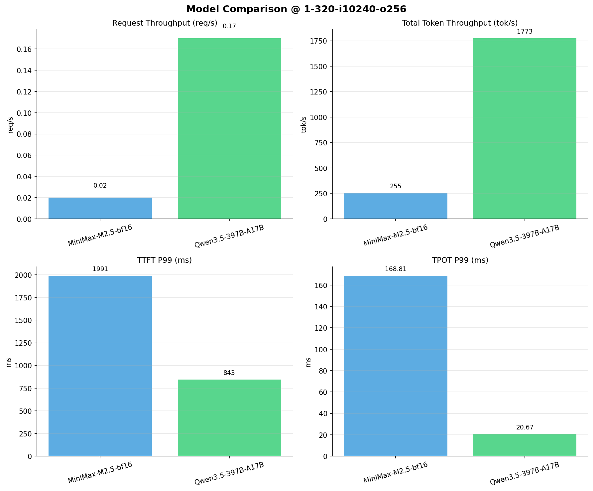

# 多模型性能对比报告

**测试日期：** 2026-04-02

**芯片平台：** hygon_bw1000

**测试套件：** test_01

**Run ID：** 01, 01

**并发级别：** 1并发

**测试配置：** 1-320-i10240-o256

---

## 📊 模型列表

| 模型名称 | Run ID | 状态 |
|----------|--------|------|
| MiniMax-M2.5-bf16 | 01 | ✅ 已加载 |
| Qwen3.5-397B-A17B | 01 | ✅ 已加载 |

---

## 📈 服务基准结果对比

| 指标 | MiniMax-M2.5-bf16 | Qwen3.5-397B-A17B |
|------|----------- | -----------|
| 成功请求数 | 320 | 320 |
| 失败请求数 | 0 | 0 |
| 测试持续时间 (s) | 13148.00 | 1892.60 |
| 总输入 tokens | 3276748 | 3276748 |
| 总生成 tokens | 80226 | 79410 |
| **请求吞吐量 (req/s)** | 0.02 | **0.17** ⭐ |
| **输出 token 吞吐量 (tok/s)** | 6.10 | **41.96** ⭐ |
| 峰值输出 token 吞吐量 (tok/s) | 8.00 | **50.00** ⭐ |
| 峰值并发请求数 | 2.00 | 2.00 |
| **总 token 吞吐量 (tok/s)** | 255.32 | **1773.30** ⭐ |

---

## ⏱️ 首 Token 延迟 (TTFT) 对比

| 指标 | MiniMax-M2.5-bf16 | Qwen3.5-397B-A17B |
|------|----------- | -----------|
| 平均 TTFT (ms) | 1958.35 | **817.94** ⭐ |
| 中位 TTFT (ms) | 1964.30 | **824.23** ⭐ |
| P95 TTFT (ms) | 1977.98 | **835.94** ⭐ |
| P99 TTFT (ms) | 1990.88 | **842.86** ⭐ |

---

## ⚡ 每 Token 生成时间 (TPOT) 对比

| 指标 | MiniMax-M2.5-bf16 | Qwen3.5-397B-A17B |
|------|----------- | -----------|
| 平均 TPOT (ms) | 156.69 | **20.62** ⭐ |
| 中位 TPOT (ms) | 156.16 | **20.62** ⭐ |
| P95 TPOT (ms) | 163.40 | **20.65** ⭐ |
| P99 TPOT (ms) | 168.81 | **20.67** ⭐ |

---

## 🔄 Token 间延迟 (ITL) 对比

| 指标 | MiniMax-M2.5-bf16 | Qwen3.5-397B-A17B |
|------|----------- | -----------|
| 平均 ITL (ms) | 156.23 | **20.56** ⭐ |
| 中位 ITL (ms) | 155.76 | **20.60** ⭐ |
| P95 ITL (ms) | 162.28 | **20.77** ⭐ |
| P99 ITL (ms) | 191.32 | **21.22** ⭐ |

---

## 📊 模型性能对比

---

## 📝 分析小结

- **请求吞吐量**: Qwen3.5-397B-A17B 最高，达 0.17 req/s
- **总token吞吐量**: Qwen3.5-397B-A17B 最高，达 1773 tok/s
- **TTFT P99**: Qwen3.5-397B-A17B 最优，为 842.86ms
- **TPOT P99**: Qwen3.5-397B-A17B 最优，为 20.67ms

---

*报告生成时间: 2026-04-02*

