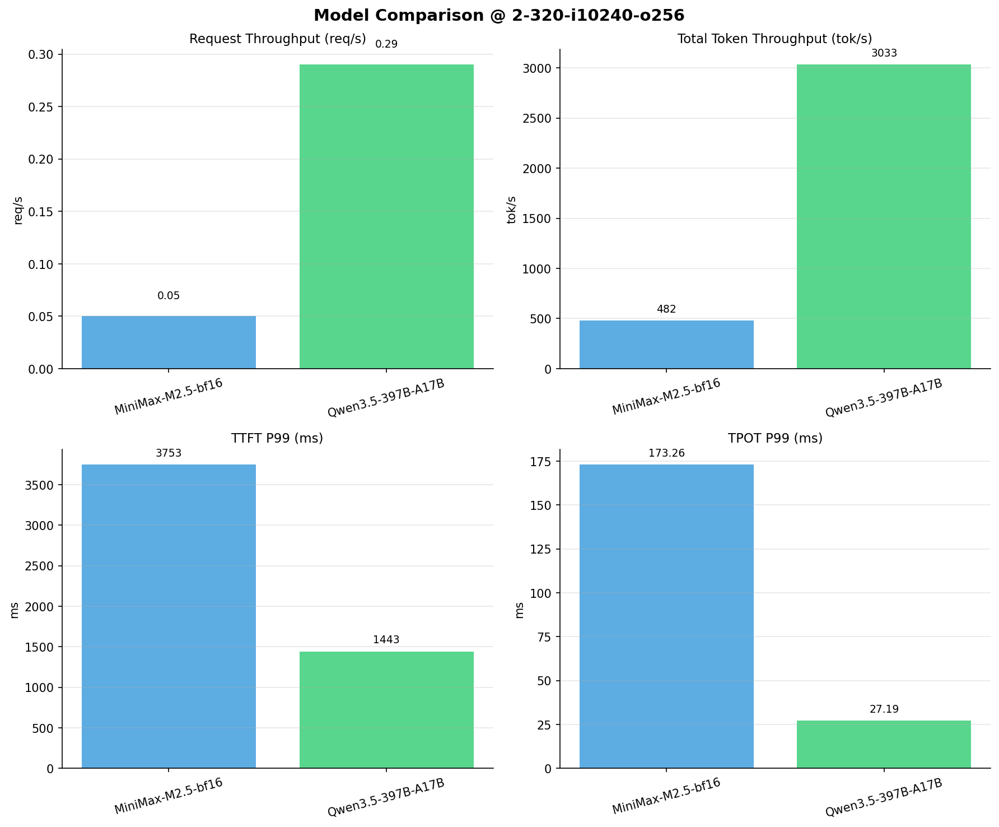

# 多模型性能对比报告

**测试日期：** 2026-04-02

**芯片平台：** hygon_bw1000

**测试套件：** test_01

**Run ID：** 01, 01

**并发级别：** 2并发

**测试配置：** 2-320-i10240-o256

---

## 📊 模型列表

| 模型名称 | Run ID | 状态 |
|----------|--------|------|
| MiniMax-M2.5-bf16 | 01 | ✅ 已加载 |
| Qwen3.5-397B-A17B | 01 | ✅ 已加载 |

---

## 📈 服务基准结果对比

| 指标 | MiniMax-M2.5-bf16 | Qwen3.5-397B-A17B |
|------|----------- | -----------|
| 成功请求数 | 320 | 320 |
| 失败请求数 | 0 | 0 |
| 测试持续时间 (s) | 6965.73 | 1106.64 |
| 总输入 tokens | 3276748 | 3276748 |
| 总生成 tokens | 80297 | 79281 |
| **请求吞吐量 (req/s)** | 0.05 | **0.29** ⭐ |
| **输出 token 吞吐量 (tok/s)** | 11.53 | **71.64** ⭐ |
| 峰值输出 token 吞吐量 (tok/s) | 15.00 | **93.00** ⭐ |
| 峰值并发请求数 | 4.00 | 4.00 |
| **总 token 吞吐量 (tok/s)** | 481.94 | **3032.63** ⭐ |

---

## ⏱️ 首 Token 延迟 (TTFT) 对比

| 指标 | MiniMax-M2.5-bf16 | Qwen3.5-397B-A17B |
|------|----------- | -----------|
| 平均 TTFT (ms) | 2052.00 | **874.08** ⭐ |
| 中位 TTFT (ms) | 2024.87 | **833.51** ⭐ |
| P95 TTFT (ms) | 2038.41 | **1182.06** ⭐ |
| P99 TTFT (ms) | 3752.70 | **1442.65** ⭐ |

---

## ⚡ 每 Token 生成时间 (TPOT) 对比

| 指标 | MiniMax-M2.5-bf16 | Qwen3.5-397B-A17B |
|------|----------- | -----------|
| 平均 TPOT (ms) | 165.84 | **24.43** ⭐ |
| 中位 TPOT (ms) | 166.01 | **24.54** ⭐ |
| P95 TPOT (ms) | 168.30 | **25.69** ⭐ |
| P99 TPOT (ms) | 173.26 | **27.19** ⭐ |

---

## 🔄 Token 间延迟 (ITL) 对比

| 指标 | MiniMax-M2.5-bf16 | Qwen3.5-397B-A17B |
|------|----------- | -----------|
| 平均 ITL (ms) | 165.31 | **24.46** ⭐ |
| 中位 ITL (ms) | 158.87 | **21.87** ⭐ |
| P95 ITL (ms) | 164.70 | **22.10** ⭐ |
| P99 ITL (ms) | 168.68 | **55.05** ⭐ |

---

## 📊 模型性能对比

---

## 📝 分析小结

- **请求吞吐量**: Qwen3.5-397B-A17B 最高，达 0.29 req/s
- **总token吞吐量**: Qwen3.5-397B-A17B 最高，达 3033 tok/s
- **TTFT P99**: Qwen3.5-397B-A17B 最优，为 1442.65ms
- **TPOT P99**: Qwen3.5-397B-A17B 最优，为 27.19ms

---

*报告生成时间: 2026-04-02*

