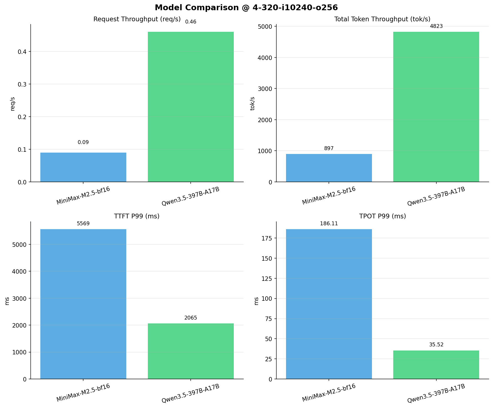

# 多模型性能对比报告

**测试日期：** 2026-04-02

**芯片平台：** hygon_bw1000

**测试套件：** test_01

**Run ID：** 01, 01

**并发级别：** 4并发

**测试配置：** 4-320-i10240-o256

---

## 📊 模型列表

| 模型名称 | Run ID | 状态 |
|----------|--------|------|
| MiniMax-M2.5-bf16 | 01 | ✅ 已加载 |
| Qwen3.5-397B-A17B | 01 | ✅ 已加载 |

---

## 📈 服务基准结果对比

| 指标 | MiniMax-M2.5-bf16 | Qwen3.5-397B-A17B |
|------|----------- | -----------|
| 成功请求数 | 320 | 320 |
| 失败请求数 | 0 | 0 |
| 测试持续时间 (s) | 3741.16 | 696.02 |
| 总输入 tokens | 3276748 | 3276748 |
| 总生成 tokens | 80266 | 79960 |
| **请求吞吐量 (req/s)** | 0.09 | **0.46** ⭐ |
| **输出 token 吞吐量 (tok/s)** | 21.45 | **114.88** ⭐ |
| 峰值输出 token 吞吐量 (tok/s) | 29.00 | **173.00** ⭐ |
| 峰值并发请求数 | 7.00 | 7.00 |
| **总 token 吞吐量 (tok/s)** | 897.32 | **4822.70** ⭐ |

---

## ⏱️ 首 Token 延迟 (TTFT) 对比

| 指标 | MiniMax-M2.5-bf16 | Qwen3.5-397B-A17B |
|------|----------- | -----------|
| 平均 TTFT (ms) | 2185.58 | **930.47** ⭐ |
| 中位 TTFT (ms) | 2038.85 | **843.28** ⭐ |
| P95 TTFT (ms) | 3821.77 | **1458.49** ⭐ |
| P99 TTFT (ms) | 5568.67 | **2064.95** ⭐ |

---

## ⚡ 每 Token 生成时间 (TPOT) 对比

| 指标 | MiniMax-M2.5-bf16 | Qwen3.5-397B-A17B |
|------|----------- | -----------|
| 平均 TPOT (ms) | 177.49 | **31.10** ⭐ |
| 中位 TPOT (ms) | 177.87 | **31.38** ⭐ |
| P95 TPOT (ms) | 183.40 | **34.01** ⭐ |
| P99 TPOT (ms) | 186.11 | **35.52** ⭐ |

---

## 🔄 Token 间延迟 (ITL) 对比

| 指标 | MiniMax-M2.5-bf16 | Qwen3.5-397B-A17B |
|------|----------- | -----------|
| 平均 ITL (ms) | 176.98 | **31.29** ⭐ |
| 中位 ITL (ms) | 157.22 | **23.38** ⭐ |
| P95 ITL (ms) | 162.59 | **24.17** ⭐ |
| P99 ITL (ms) | 1872.44 | **534.67** ⭐ |

---

## 📊 模型性能对比

---

## 📝 分析小结

- **请求吞吐量**: Qwen3.5-397B-A17B 最高，达 0.46 req/s
- **总token吞吐量**: Qwen3.5-397B-A17B 最高，达 4823 tok/s
- **TTFT P99**: Qwen3.5-397B-A17B 最优，为 2064.95ms
- **TPOT P99**: Qwen3.5-397B-A17B 最优，为 35.52ms

---

*报告生成时间: 2026-04-02*

