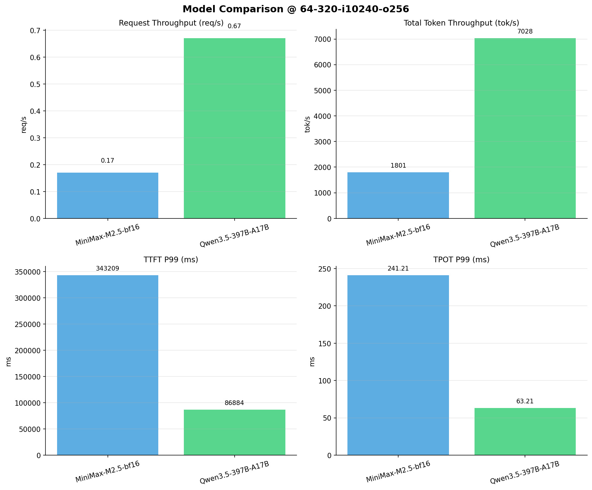

# 多模型性能对比报告

**测试日期：** 2026-04-02

**芯片平台：** hygon_bw1000

**测试套件：** test_01

**Run ID：** 01, 01

**并发级别：** 64并发

**测试配置：** 64-320-i10240-o256

---

## 📊 模型列表

| 模型名称 | Run ID | 状态 |
|----------|--------|------|
| MiniMax-M2.5-bf16 | 01 | ✅ 已加载 |
| Qwen3.5-397B-A17B | 01 | ✅ 已加载 |

---

## 📈 服务基准结果对比

| 指标 | MiniMax-M2.5-bf16 | Qwen3.5-397B-A17B |
|------|----------- | -----------|
| 成功请求数 | 320 | 320 |
| 失败请求数 | 0 | 0 |
| 测试持续时间 (s) | 1864.45 | 477.53 |
| 总输入 tokens | 3276748 | 3276748 |
| 总生成 tokens | 80461 | 79358 |
| **请求吞吐量 (req/s)** | 0.17 | **0.67** ⭐ |
| **输出 token 吞吐量 (tok/s)** | 43.16 | **166.18** ⭐ |
| 峰值输出 token 吞吐量 (tok/s) | 71.00 | **310.00** ⭐ |
| 峰值并发请求数 | 68.00 | 67.00 |
| **总 token 吞吐量 (tok/s)** | 1800.65 | **7027.99** ⭐ |

---

## ⏱️ 首 Token 延迟 (TTFT) 对比

| 指标 | MiniMax-M2.5-bf16 | Qwen3.5-397B-A17B |
|------|----------- | -----------|
| 平均 TTFT (ms) | 284382.45 | **73483.64** ⭐ |
| 中位 TTFT (ms) | 308175.63 | **80355.19** ⭐ |
| P95 TTFT (ms) | 336951.30 | **83007.06** ⭐ |
| P99 TTFT (ms) | 343209.29 | **86884.30** ⭐ |

---

## ⚡ 每 Token 生成时间 (TPOT) 对比

| 指标 | MiniMax-M2.5-bf16 | Qwen3.5-397B-A17B |
|------|----------- | -----------|
| 平均 TPOT (ms) | 218.23 | **56.43** ⭐ |
| 中位 TPOT (ms) | 219.77 | **56.32** ⭐ |
| P95 TPOT (ms) | 231.26 | **61.17** ⭐ |
| P99 TPOT (ms) | 241.21 | **63.21** ⭐ |

---

## 🔄 Token 间延迟 (ITL) 对比

| 指标 | MiniMax-M2.5-bf16 | Qwen3.5-397B-A17B |
|------|----------- | -----------|
| 平均 ITL (ms) | 217.55 | **56.24** ⭐ |
| 中位 ITL (ms) | 157.89 | **32.93** ⭐ |
| P95 ITL (ms) | **168.53** ⭐ | 188.83 |
| P99 ITL (ms) | 1925.72 | **540.19** ⭐ |

---

## 📊 模型性能对比

---

## 📝 分析小结

- **请求吞吐量**: Qwen3.5-397B-A17B 最高，达 0.67 req/s
- **总token吞吐量**: Qwen3.5-397B-A17B 最高，达 7028 tok/s
- **TTFT P99**: Qwen3.5-397B-A17B 最优，为 86884.30ms
- **TPOT P99**: Qwen3.5-397B-A17B 最优，为 63.21ms

---

*报告生成时间: 2026-04-02*

