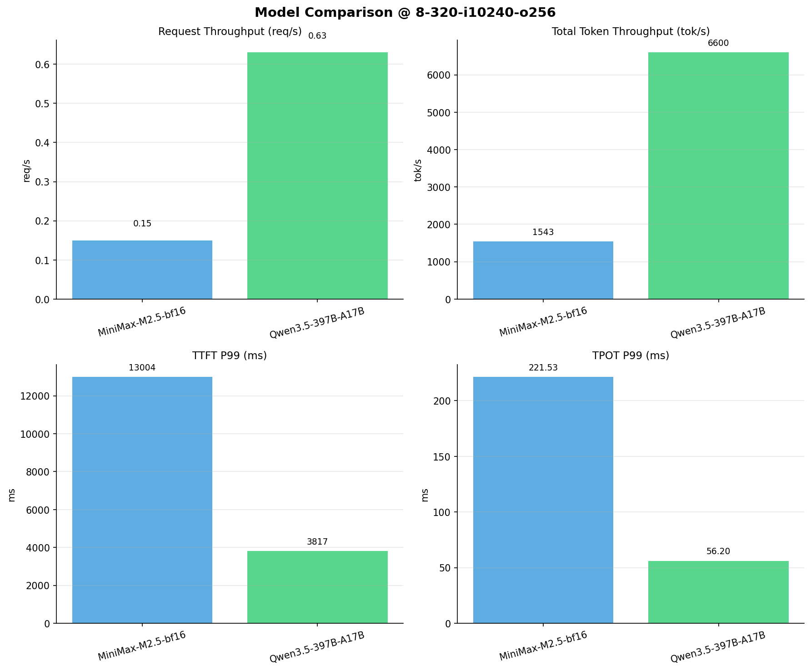

# 多模型性能对比报告

**测试日期：** 2026-04-02

**芯片平台：** hygon_bw1000

**测试套件：** test_01

**Run ID：** 01, 01

**并发级别：** 8并发

**测试配置：** 8-320-i10240-o256

---

## 📊 模型列表

| 模型名称 | Run ID | 状态 |
|----------|--------|------|
| MiniMax-M2.5-bf16 | 01 | ✅ 已加载 |
| Qwen3.5-397B-A17B | 01 | ✅ 已加载 |

---

## 📈 服务基准结果对比

| 指标 | MiniMax-M2.5-bf16 | Qwen3.5-397B-A17B |
|------|----------- | -----------|
| 成功请求数 | 320 | 320 |
| 失败请求数 | 0 | 0 |
| 测试持续时间 (s) | 2176.31 | 508.44 |
| 总输入 tokens | 3276748 | 3276748 |
| 总生成 tokens | 80442 | 78888 |
| **请求吞吐量 (req/s)** | 0.15 | **0.63** ⭐ |
| **输出 token 吞吐量 (tok/s)** | 36.96 | **155.16** ⭐ |
| 峰值输出 token 吞吐量 (tok/s) | 59.00 | **280.00** ⭐ |
| 峰值并发请求数 | 15.00 | 13.00 |
| **总 token 吞吐量 (tok/s)** | 1542.60 | **6599.86** ⭐ |

---

## ⏱️ 首 Token 延迟 (TTFT) 对比

| 指标 | MiniMax-M2.5-bf16 | Qwen3.5-397B-A17B |
|------|----------- | -----------|
| 平均 TTFT (ms) | 3297.61 | **1140.45** ⭐ |
| 中位 TTFT (ms) | 2089.60 | **847.01** ⭐ |
| P95 TTFT (ms) | 10888.09 | **2055.50** ⭐ |
| P99 TTFT (ms) | 13004.02 | **3816.59** ⭐ |

---

## ⚡ 每 Token 生成时间 (TPOT) 对比

| 指标 | MiniMax-M2.5-bf16 | Qwen3.5-397B-A17B |
|------|----------- | -----------|
| 平均 TPOT (ms) | 201.95 | **46.86** ⭐ |
| 中位 TPOT (ms) | 205.98 | **47.37** ⭐ |
| P95 TPOT (ms) | 212.79 | **50.43** ⭐ |
| P99 TPOT (ms) | 221.53 | **56.20** ⭐ |

---

## 🔄 Token 间延迟 (ITL) 对比

| 指标 | MiniMax-M2.5-bf16 | Qwen3.5-397B-A17B |
|------|----------- | -----------|
| 平均 ITL (ms) | 201.36 | **47.59** ⭐ |
| 中位 ITL (ms) | 157.25 | **29.16** ⭐ |
| P95 ITL (ms) | 163.19 | **60.47** ⭐ |
| P99 ITL (ms) | 1931.02 | **541.52** ⭐ |

---

## 📊 模型性能对比

---

## 📝 分析小结

- **请求吞吐量**: Qwen3.5-397B-A17B 最高，达 0.63 req/s
- **总token吞吐量**: Qwen3.5-397B-A17B 最高，达 6600 tok/s
- **TTFT P99**: Qwen3.5-397B-A17B 最优，为 3816.59ms
- **TPOT P99**: Qwen3.5-397B-A17B 最优，为 56.20ms

---

*报告生成时间: 2026-04-02*

