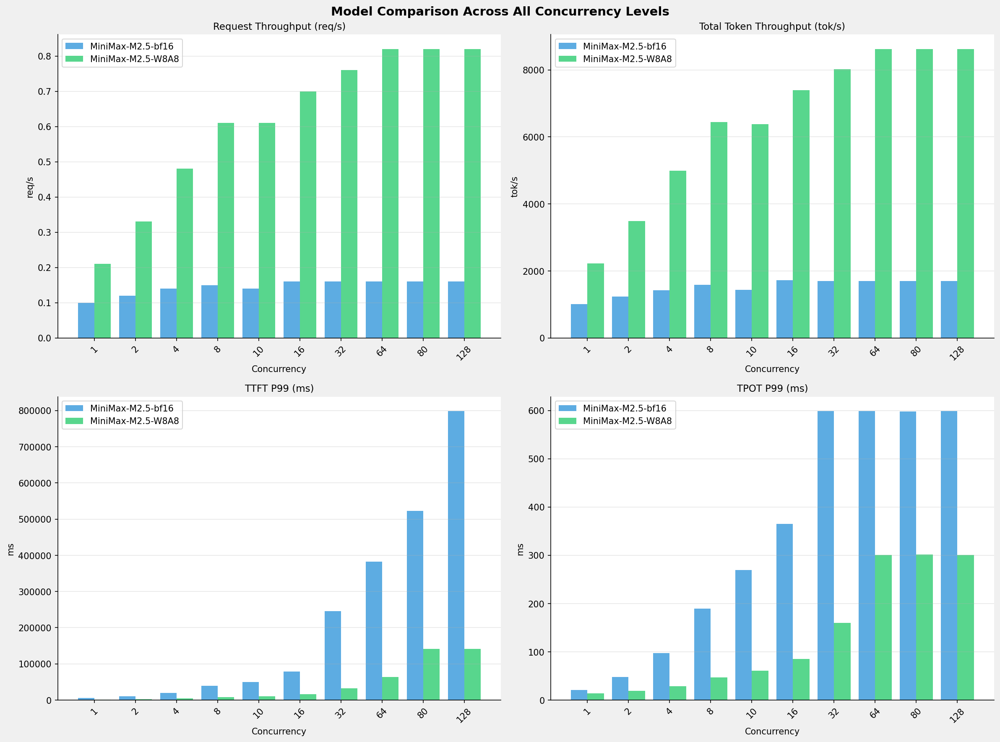

# 多模型性能对比报告 (全并发级别)

**测试日期：** 2026-05-07

**芯片平台：** hygon_bw1000

**测试套件：** test_01

**Run ID：** 01, 01

**测试配置：** 320-i10240-o256

**并发级别：** 1, 2, 4, 8, 10, 16, 32, 64, 80, 128

**对比模型：** MiniMax-M2.5-bf16, MiniMax-M2.5-W8A8

---

## 📊 模型性能对比

---

## 📝 分析小结

- **MiniMax-M2.5-W8A8** 相比 **MiniMax-M2.5-bf16** 请求吞吐量平均提升 **324.8%**
- **MiniMax-M2.5-W8A8** 相比 **MiniMax-M2.5-bf16** 总token吞吐量平均提升 **326.1%**
- **MiniMax-M2.5-W8A8** 相比 **MiniMax-M2.5-bf16** TTFT P99 平均改善 **80.5%** (延迟降低)
- **MiniMax-M2.5-W8A8** 相比 **MiniMax-M2.5-bf16** TPOT P99 平均改善 **61.1%** (延迟降低)

---

## 📊 各并发级别详细对比

### 并发级别: 1

#### 服务基准结果

| 指标 | MiniMax-M2.5-bf16 (基准) | MiniMax-M2.5-W8A8 | 差异 | % |
|------|--------------- | --------- | ------- | -------|
| 成功请求数 | 320 | 320 | 0.00 | 0.0% |
| 失败请求数 | 0 | 0 | 0.00 | 0.0% |
| 测试持续时间 (s) | 3322.61 | 1509.26 | -1813.35 | -54.6% |
| 总输入 tokens | 3276800 | 3276800 | 0.00 | 0.0% |
| 总生成 tokens | 81920 | 81920 | 0.00 | 0.0% |
| 请求吞吐量 (req/s) | 0.10 | 0.21 | +0.11 | +110.0% |
| 输出 token 吞吐量 (tok/s) | 24.66 | 54.28 | +29.62 | +120.1% |
| 峰值输出 token 吞吐量 (tok/s) | 50.00 | 72.00 | +22.00 | +44.0% |
| 峰值并发请求数 | 2.00 | 2.00 | 0.00 | 0.0% |
| 总 token 吞吐量 (tok/s) | 1010.87 | 2225.40 | +1214.53 | +120.1% |

#### 首Token延迟 (TTFT)

| 指标 | MiniMax-M2.5-bf16 (基准) | MiniMax-M2.5-W8A8 | 差异 | % |
|------|--------------- | --------- | ------- | -------|
| 平均 TTFT (ms) | 5026.61 | 1112.21 | -3914.40 | -77.9% |
| 中位 TTFT (ms) | 5041.22 | 1111.97 | -3929.25 | -77.9% |
| P95 TTFT (ms) | 5072.83 | 1127.95 | -3944.88 | -77.8% |
| P99 TTFT (ms) | 5130.17 | 1168.49 | -3961.68 | -77.2% |

#### 每Token生成时间 (TPOT)

| 指标 | MiniMax-M2.5-bf16 (基准) | MiniMax-M2.5-W8A8 | 差异 | % |
|------|--------------- | --------- | ------- | -------|
| 平均 TPOT (ms) | 21.00 | 14.13 | -6.87 | -32.7% |
| 中位 TPOT (ms) | 21.01 | 14.13 | -6.88 | -32.7% |
| P95 TPOT (ms) | 21.05 | 14.15 | -6.90 | -32.8% |
| P99 TPOT (ms) | 21.07 | 14.16 | -6.91 | -32.8% |

#### Token间延迟 (ITL)

| 指标 | MiniMax-M2.5-bf16 (基准) | MiniMax-M2.5-W8A8 | 差异 | % |
|------|--------------- | --------- | ------- | -------|
| 平均 ITL (ms) | 20.97 | 14.14 | -6.83 | -32.6% |
| 中位 ITL (ms) | 21.00 | 14.13 | -6.87 | -32.7% |
| P95 ITL (ms) | 21.70 | 14.47 | -7.23 | -33.3% |
| P99 ITL (ms) | 32.03 | 20.17 | -11.86 | -37.0% |

---

### 并发级别: 2

#### 服务基准结果

| 指标 | MiniMax-M2.5-bf16 (基准) | MiniMax-M2.5-W8A8 | 差异 | % |
|------|--------------- | --------- | ------- | -------|
| 成功请求数 | 320 | 320 | 0.00 | 0.0% |
| 失败请求数 | 0 | 0 | 0.00 | 0.0% |
| 测试持续时间 (s) | 2718.90 | 963.16 | -1755.74 | -64.6% |
| 总输入 tokens | 3276800 | 3276800 | 0.00 | 0.0% |
| 总生成 tokens | 81920 | 81920 | 0.00 | 0.0% |
| 请求吞吐量 (req/s) | 0.12 | 0.33 | +0.21 | +175.0% |
| 输出 token 吞吐量 (tok/s) | 30.13 | 85.05 | +54.92 | +182.3% |
| 峰值输出 token 吞吐量 (tok/s) | 76.00 | 136.00 | +60.00 | +78.9% |
| 峰值并发请求数 | 4.00 | 4.00 | 0.00 | 0.0% |
| 总 token 吞吐量 (tok/s) | 1235.32 | 3487.19 | +2251.87 | +182.3% |

#### 首Token延迟 (TTFT)

| 指标 | MiniMax-M2.5-bf16 (基准) | MiniMax-M2.5-W8A8 | 差异 | % |
|------|--------------- | --------- | ------- | -------|
| 平均 TTFT (ms) | 7501.77 | 1623.93 | -5877.84 | -78.4% |
| 中位 TTFT (ms) | 5186.88 | 1153.37 | -4033.51 | -77.8% |
| P95 TTFT (ms) | 10045.05 | 2156.14 | -7888.91 | -78.5% |
| P99 TTFT (ms) | 10088.82 | 2165.32 | -7923.50 | -78.5% |

#### 每Token生成时间 (TPOT)

| 指标 | MiniMax-M2.5-bf16 (基准) | MiniMax-M2.5-W8A8 | 差异 | % |
|------|--------------- | --------- | ------- | -------|
| 平均 TPOT (ms) | 37.22 | 17.24 | -19.98 | -53.7% |
| 中位 TPOT (ms) | 37.31 | 17.15 | -20.16 | -54.0% |
| P95 TPOT (ms) | 47.30 | 19.37 | -27.93 | -59.0% |
| P99 TPOT (ms) | 47.55 | 19.41 | -28.14 | -59.2% |

#### Token间延迟 (ITL)

| 指标 | MiniMax-M2.5-bf16 (基准) | MiniMax-M2.5-W8A8 | 差异 | % |
|------|--------------- | --------- | ------- | -------|
| 平均 ITL (ms) | 37.12 | 17.23 | -19.89 | -53.6% |
| 中位 ITL (ms) | 27.55 | 15.20 | -12.35 | -44.8% |
| P95 ITL (ms) | 28.71 | 16.13 | -12.58 | -43.8% |
| P99 ITL (ms) | 43.95 | 24.07 | -19.88 | -45.2% |

---

### 并发级别: 4

#### 服务基准结果

| 指标 | MiniMax-M2.5-bf16 (基准) | MiniMax-M2.5-W8A8 | 差异 | % |
|------|--------------- | --------- | ------- | -------|
| 成功请求数 | 320 | 320 | 0.00 | 0.0% |
| 失败请求数 | 0 | 0 | 0.00 | 0.0% |
| 测试持续时间 (s) | 2365.34 | 672.34 | -1693.00 | -71.6% |
| 总输入 tokens | 3276800 | 3276800 | 0.00 | 0.0% |
| 总生成 tokens | 81920 | 81920 | 0.00 | 0.0% |
| 请求吞吐量 (req/s) | 0.14 | 0.48 | +0.34 | +242.9% |
| 输出 token 吞吐量 (tok/s) | 34.63 | 121.84 | +87.21 | +251.8% |
| 峰值输出 token 吞吐量 (tok/s) | 111.00 | 247.00 | +136.00 | +122.5% |
| 峰值并发请求数 | 8.00 | 8.00 | 0.00 | 0.0% |
| 总 token 吞吐量 (tok/s) | 1419.97 | 4995.56 | +3575.59 | +251.8% |

#### 首Token延迟 (TTFT)

| 指标 | MiniMax-M2.5-bf16 (基准) | MiniMax-M2.5-W8A8 | 差异 | % |
|------|--------------- | --------- | ------- | -------|
| 平均 TTFT (ms) | 16214.96 | 3351.54 | -12863.42 | -79.3% |
| 中位 TTFT (ms) | 19806.56 | 4115.92 | -15690.64 | -79.2% |
| P95 TTFT (ms) | 19874.02 | 4129.04 | -15744.98 | -79.2% |
| P99 TTFT (ms) | 19888.60 | 4137.09 | -15751.51 | -79.2% |

#### 每Token生成时间 (TPOT)

| 指标 | MiniMax-M2.5-bf16 (基准) | MiniMax-M2.5-W8A8 | 差异 | % |
|------|--------------- | --------- | ------- | -------|
| 平均 TPOT (ms) | 52.36 | 19.81 | -32.55 | -62.2% |
| 中位 TPOT (ms) | 38.58 | 16.93 | -21.65 | -56.1% |
| P95 TPOT (ms) | 96.58 | 28.78 | -67.80 | -70.2% |
| P99 TPOT (ms) | 97.18 | 28.88 | -68.30 | -70.3% |

#### Token间延迟 (ITL)

| 指标 | MiniMax-M2.5-bf16 (基准) | MiniMax-M2.5-W8A8 | 差异 | % |
|------|--------------- | --------- | ------- | -------|
| 平均 ITL (ms) | 52.22 | 19.76 | -32.46 | -62.2% |
| 中位 ITL (ms) | 38.47 | 16.86 | -21.61 | -56.2% |
| P95 ITL (ms) | 43.58 | 17.85 | -25.73 | -59.0% |
| P99 ITL (ms) | 64.02 | 22.80 | -41.22 | -64.4% |

---

### 并发级别: 8

#### 服务基准结果

| 指标 | MiniMax-M2.5-bf16 (基准) | MiniMax-M2.5-W8A8 | 差异 | % |
|------|--------------- | --------- | ------- | -------|
| 成功请求数 | 320 | 320 | 0.00 | 0.0% |
| 失败请求数 | 0 | 0 | 0.00 | 0.0% |
| 测试持续时间 (s) | 2123.78 | 521.20 | -1602.58 | -75.5% |
| 总输入 tokens | 3276800 | 3276800 | 0.00 | 0.0% |
| 总生成 tokens | 81920 | 81920 | 0.00 | 0.0% |
| 请求吞吐量 (req/s) | 0.15 | 0.61 | +0.46 | +306.7% |
| 输出 token 吞吐量 (tok/s) | 38.57 | 157.18 | +118.61 | +307.5% |
| 峰值输出 token 吞吐量 (tok/s) | 160.00 | 424.00 | +264.00 | +165.0% |
| 峰值并发请求数 | 16.00 | 16.00 | 0.00 | 0.0% |
| 总 token 吞吐量 (tok/s) | 1581.48 | 6444.25 | +4862.77 | +307.5% |

#### 首Token延迟 (TTFT)

| 指标 | MiniMax-M2.5-bf16 (基准) | MiniMax-M2.5-W8A8 | 差异 | % |
|------|--------------- | --------- | ------- | -------|
| 平均 TTFT (ms) | 34975.19 | 7190.37 | -27784.82 | -79.4% |
| 中位 TTFT (ms) | 39435.78 | 8083.99 | -31351.79 | -79.5% |
| P95 TTFT (ms) | 39548.64 | 8094.81 | -31453.83 | -79.5% |
| P99 TTFT (ms) | 39566.34 | 8133.44 | -31432.90 | -79.4% |

#### 每Token生成时间 (TPOT)

| 指标 | MiniMax-M2.5-bf16 (基准) | MiniMax-M2.5-W8A8 | 差异 | % |
|------|--------------- | --------- | ------- | -------|
| 平均 TPOT (ms) | 71.05 | 22.89 | -48.16 | -67.8% |
| 中位 TPOT (ms) | 53.98 | 19.52 | -34.46 | -63.8% |
| P95 TPOT (ms) | 188.73 | 46.86 | -141.87 | -75.2% |
| P99 TPOT (ms) | 189.79 | 46.97 | -142.82 | -75.3% |

#### Token间延迟 (ITL)

| 指标 | MiniMax-M2.5-bf16 (基准) | MiniMax-M2.5-W8A8 | 差异 | % |
|------|--------------- | --------- | ------- | -------|
| 平均 ITL (ms) | 70.79 | 22.82 | -47.97 | -67.8% |
| 中位 ITL (ms) | 53.97 | 19.56 | -34.41 | -63.8% |
| P95 ITL (ms) | 58.48 | 20.53 | -37.95 | -64.9% |
| P99 ITL (ms) | 80.00 | 24.15 | -55.85 | -69.8% |

---

### 并发级别: 10

#### 服务基准结果

| 指标 | MiniMax-M2.5-bf16 (基准) | MiniMax-M2.5-W8A8 | 差异 | % |
|------|--------------- | --------- | ------- | -------|
| 成功请求数 | 320 | 320 | 0.00 | 0.0% |
| 失败请求数 | 0 | 0 | 0.00 | 0.0% |
| 测试持续时间 (s) | 2347.19 | 526.27 | -1820.92 | -77.6% |
| 总输入 tokens | 3276800 | 3276800 | 0.00 | 0.0% |
| 总生成 tokens | 81920 | 81920 | 0.00 | 0.0% |
| 请求吞吐量 (req/s) | 0.14 | 0.61 | +0.47 | +335.7% |
| 输出 token 吞吐量 (tok/s) | 34.90 | 155.66 | +120.76 | +346.0% |
| 峰值输出 token 吞吐量 (tok/s) | 119.00 | 420.00 | +301.00 | +252.9% |
| 峰值并发请求数 | 20.00 | 20.00 | 0.00 | 0.0% |
| 总 token 吞吐量 (tok/s) | 1430.96 | 6382.12 | +4951.16 | +346.0% |

#### 首Token延迟 (TTFT)

| 指标 | MiniMax-M2.5-bf16 (基准) | MiniMax-M2.5-W8A8 | 差异 | % |
|------|--------------- | --------- | ------- | -------|
| 平均 TTFT (ms) | 44636.12 | 9132.16 | -35503.96 | -79.5% |
| 中位 TTFT (ms) | 49274.29 | 10065.22 | -39209.07 | -79.6% |
| P95 TTFT (ms) | 49373.65 | 10076.09 | -39297.56 | -79.6% |
| P99 TTFT (ms) | 49390.74 | 10081.63 | -39309.11 | -79.6% |

#### 每Token生成时间 (TPOT)

| 指标 | MiniMax-M2.5-bf16 (基准) | MiniMax-M2.5-W8A8 | 差异 | % |
|------|--------------- | --------- | ------- | -------|
| 平均 TPOT (ms) | 112.59 | 28.67 | -83.92 | -74.5% |
| 中位 TPOT (ms) | 95.29 | 25.19 | -70.10 | -73.6% |
| P95 TPOT (ms) | 268.35 | 60.21 | -208.14 | -77.6% |
| P99 TPOT (ms) | 269.35 | 60.61 | -208.74 | -77.5% |

#### Token间延迟 (ITL)

| 指标 | MiniMax-M2.5-bf16 (基准) | MiniMax-M2.5-W8A8 | 差异 | % |
|------|--------------- | --------- | ------- | -------|
| 平均 ITL (ms) | 112.15 | 28.65 | -83.50 | -74.5% |
| 中位 ITL (ms) | 95.08 | 25.20 | -69.88 | -73.5% |
| P95 ITL (ms) | 98.28 | 26.22 | -72.06 | -73.3% |
| P99 ITL (ms) | 106.62 | 41.33 | -65.29 | -61.2% |

---

### 并发级别: 16

#### 服务基准结果

| 指标 | MiniMax-M2.5-bf16 (基准) | MiniMax-M2.5-W8A8 | 差异 | % |
|------|--------------- | --------- | ------- | -------|
| 成功请求数 | 320 | 320 | 0.00 | 0.0% |
| 失败请求数 | 0 | 0 | 0.00 | 0.0% |
| 测试持续时间 (s) | 1954.55 | 454.63 | -1499.92 | -76.7% |
| 总输入 tokens | 3276800 | 3276800 | 0.00 | 0.0% |
| 总生成 tokens | 81920 | 81920 | 0.00 | 0.0% |
| 请求吞吐量 (req/s) | 0.16 | 0.70 | +0.54 | +337.5% |
| 输出 token 吞吐量 (tok/s) | 41.91 | 180.19 | +138.28 | +329.9% |
| 峰值输出 token 吞吐量 (tok/s) | 239.00 | 656.00 | +417.00 | +174.5% |
| 峰值并发请求数 | 32.00 | 32.00 | 0.00 | 0.0% |
| 总 token 吞吐量 (tok/s) | 1718.41 | 7387.79 | +5669.38 | +329.9% |

#### 首Token延迟 (TTFT)

| 指标 | MiniMax-M2.5-bf16 (基准) | MiniMax-M2.5-W8A8 | 差异 | % |
|------|--------------- | --------- | ------- | -------|
| 平均 TTFT (ms) | 73920.95 | 15052.83 | -58868.12 | -79.6% |
| 中位 TTFT (ms) | 78728.14 | 16028.53 | -62699.61 | -79.6% |
| P95 TTFT (ms) | 78938.77 | 16056.37 | -62882.40 | -79.7% |
| P99 TTFT (ms) | 79009.53 | 16063.93 | -62945.60 | -79.7% |

#### 每Token生成时间 (TPOT)

| 指标 | MiniMax-M2.5-bf16 (基准) | MiniMax-M2.5-W8A8 | 差异 | % |
|------|--------------- | --------- | ------- | -------|
| 平均 TPOT (ms) | 93.35 | 30.10 | -63.25 | -67.8% |
| 中位 TPOT (ms) | 75.23 | 26.43 | -48.80 | -64.9% |
| P95 TPOT (ms) | 363.25 | 84.67 | -278.58 | -76.7% |
| P99 TPOT (ms) | 365.28 | 85.10 | -280.18 | -76.7% |

#### Token间延迟 (ITL)

| 指标 | MiniMax-M2.5-bf16 (基准) | MiniMax-M2.5-W8A8 | 差异 | % |
|------|--------------- | --------- | ------- | -------|
| 平均 ITL (ms) | 93.00 | 30.01 | -62.99 | -67.7% |
| 中位 ITL (ms) | 75.42 | 26.59 | -48.83 | -64.7% |
| P95 ITL (ms) | 80.18 | 30.25 | -49.93 | -62.3% |
| P99 ITL (ms) | 100.12 | 42.55 | -57.57 | -57.5% |

---

### 并发级别: 32

#### 服务基准结果

| 指标 | MiniMax-M2.5-bf16 (基准) | MiniMax-M2.5-W8A8 | 差异 | % |
|------|--------------- | --------- | ------- | -------|
| 成功请求数 | 320 | 320 | 0.00 | 0.0% |
| 失败请求数 | 0 | 0 | 0.00 | 0.0% |
| 测试持续时间 (s) | 1972.97 | 418.62 | -1554.35 | -78.8% |
| 总输入 tokens | 3276800 | 3276800 | 0.00 | 0.0% |
| 总生成 tokens | 81920 | 81920 | 0.00 | 0.0% |
| 请求吞吐量 (req/s) | 0.16 | 0.76 | +0.60 | +375.0% |
| 输出 token 吞吐量 (tok/s) | 41.52 | 195.69 | +154.17 | +371.3% |
| 峰值输出 token 吞吐量 (tok/s) | 253.00 | 864.00 | +611.00 | +241.5% |
| 峰值并发请求数 | 54.00 | 64.00 | +10.00 | +18.5% |
| 总 token 吞吐量 (tok/s) | 1702.37 | 8023.25 | +6320.88 | +371.3% |

#### 首Token延迟 (TTFT)

| 指标 | MiniMax-M2.5-bf16 (基准) | MiniMax-M2.5-W8A8 | 差异 | % |
|------|--------------- | --------- | ------- | -------|
| 平均 TTFT (ms) | 154015.23 | 30731.82 | -123283.41 | -80.0% |
| 中位 TTFT (ms) | 109747.80 | 31855.15 | -77892.65 | -71.0% |
| P95 TTFT (ms) | 245875.42 | 31914.75 | -213960.67 | -87.0% |
| P99 TTFT (ms) | 246016.06 | 31917.86 | -214098.20 | -87.0% |

#### 每Token生成时间 (TPOT)

| 指标 | MiniMax-M2.5-bf16 (基准) | MiniMax-M2.5-W8A8 | 差异 | % |
|------|--------------- | --------- | ------- | -------|
| 平均 TPOT (ms) | 152.59 | 43.62 | -108.97 | -71.4% |
| 中位 TPOT (ms) | 122.78 | 39.56 | -83.22 | -67.8% |
| P95 TPOT (ms) | 514.14 | 39.90 | -474.24 | -92.2% |
| P99 TPOT (ms) | 598.81 | 160.15 | -438.66 | -73.3% |

#### Token间延迟 (ITL)

| 指标 | MiniMax-M2.5-bf16 (基准) | MiniMax-M2.5-W8A8 | 差异 | % |
|------|--------------- | --------- | ------- | -------|
| 平均 ITL (ms) | 151.99 | 43.45 | -108.54 | -71.4% |
| 中位 ITL (ms) | 103.29 | 39.75 | -63.54 | -61.5% |
| P95 ITL (ms) | 111.32 | 48.15 | -63.17 | -56.7% |
| P99 ITL (ms) | 139.96 | 59.25 | -80.71 | -57.7% |

---

### 并发级别: 64

#### 服务基准结果

| 指标 | MiniMax-M2.5-bf16 (基准) | MiniMax-M2.5-W8A8 | 差异 | % |
|------|--------------- | --------- | ------- | -------|
| 成功请求数 | 320 | 320 | 0.00 | 0.0% |
| 失败请求数 | 0 | 0 | 0.00 | 0.0% |
| 测试持续时间 (s) | 1972.31 | 389.63 | -1582.68 | -80.2% |
| 总输入 tokens | 3276800 | 3276800 | 0.00 | 0.0% |
| 总生成 tokens | 81920 | 81920 | 0.00 | 0.0% |
| 请求吞吐量 (req/s) | 0.16 | 0.82 | +0.66 | +412.5% |
| 输出 token 吞吐量 (tok/s) | 41.54 | 210.25 | +168.71 | +406.1% |
| 峰值输出 token 吞吐量 (tok/s) | 253.00 | 1279.00 | +1026.00 | +405.5% |
| 峰值并发请求数 | 86.00 | 128.00 | +42.00 | +48.8% |
| 总 token 吞吐量 (tok/s) | 1702.94 | 8620.30 | +6917.36 | +406.2% |

#### 首Token延迟 (TTFT)

| 指标 | MiniMax-M2.5-bf16 (基准) | MiniMax-M2.5-W8A8 | 差异 | % |
|------|--------------- | --------- | ------- | -------|
| 平均 TTFT (ms) | 327678.89 | 62196.04 | -265482.85 | -81.0% |
| 中位 TTFT (ms) | 381111.53 | 63499.67 | -317611.86 | -83.3% |
| P95 TTFT (ms) | 382160.76 | 63528.23 | -318632.53 | -83.4% |
| P99 TTFT (ms) | 382166.79 | 63531.55 | -318635.24 | -83.4% |

#### 每Token生成时间 (TPOT)

| 指标 | MiniMax-M2.5-bf16 (基准) | MiniMax-M2.5-W8A8 | 差异 | % |
|------|--------------- | --------- | ------- | -------|
| 平均 TPOT (ms) | 152.48 | 61.63 | -90.85 | -59.6% |
| 中位 TPOT (ms) | 122.23 | 57.08 | -65.15 | -53.3% |
| P95 TPOT (ms) | 513.83 | 57.35 | -456.48 | -88.8% |
| P99 TPOT (ms) | 598.42 | 300.74 | -297.68 | -49.7% |

#### Token间延迟 (ITL)

| 指标 | MiniMax-M2.5-bf16 (基准) | MiniMax-M2.5-W8A8 | 差异 | % |
|------|--------------- | --------- | ------- | -------|
| 平均 ITL (ms) | 151.88 | 61.39 | -90.49 | -59.6% |
| 中位 ITL (ms) | 103.35 | 57.35 | -46.00 | -44.5% |
| P95 ITL (ms) | 118.51 | 59.07 | -59.44 | -50.2% |
| P99 ITL (ms) | 160.09 | 64.72 | -95.37 | -59.6% |

---

### 并发级别: 80

#### 服务基准结果

| 指标 | MiniMax-M2.5-bf16 (基准) | MiniMax-M2.5-W8A8 | 差异 | % |
|------|--------------- | --------- | ------- | -------|
| 成功请求数 | 320 | 320 | 0.00 | 0.0% |
| 失败请求数 | 0 | 0 | 0.00 | 0.0% |
| 测试持续时间 (s) | 1972.05 | 389.49 | -1582.56 | -80.2% |
| 总输入 tokens | 3276800 | 3276800 | 0.00 | 0.0% |
| 总生成 tokens | 81920 | 81920 | 0.00 | 0.0% |
| 请求吞吐量 (req/s) | 0.16 | 0.82 | +0.66 | +412.5% |
| 输出 token 吞吐量 (tok/s) | 41.54 | 210.32 | +168.78 | +406.3% |
| 峰值输出 token 吞吐量 (tok/s) | 253.00 | 1263.00 | +1010.00 | +399.2% |
| 峰值并发请求数 | 102.00 | 143.00 | +41.00 | +40.2% |
| 总 token 吞吐量 (tok/s) | 1703.16 | 8623.30 | +6920.14 | +406.3% |

#### 首Token延迟 (TTFT)

| 指标 | MiniMax-M2.5-bf16 (基准) | MiniMax-M2.5-W8A8 | 差异 | % |
|------|--------------- | --------- | ------- | -------|
| 平均 TTFT (ms) | 407916.98 | 77178.96 | -330738.02 | -81.1% |
| 中位 TTFT (ms) | 382048.62 | 62548.05 | -319500.57 | -83.6% |
| P95 TTFT (ms) | 522195.75 | 140523.49 | -381672.26 | -73.1% |
| P99 TTFT (ms) | 522380.44 | 140904.11 | -381476.33 | -73.0% |

#### 每Token生成时间 (TPOT)

| 指标 | MiniMax-M2.5-bf16 (基准) | MiniMax-M2.5-W8A8 | 差异 | % |
|------|--------------- | --------- | ------- | -------|
| 平均 TPOT (ms) | 152.41 | 64.04 | -88.37 | -58.0% |
| 中位 TPOT (ms) | 122.16 | 61.00 | -61.16 | -50.1% |
| P95 TPOT (ms) | 513.47 | 61.24 | -452.23 | -88.1% |
| P99 TPOT (ms) | 598.27 | 301.17 | -297.10 | -49.7% |

#### Token间延迟 (ITL)

| 指标 | MiniMax-M2.5-bf16 (基准) | MiniMax-M2.5-W8A8 | 差异 | % |
|------|--------------- | --------- | ------- | -------|
| 平均 ITL (ms) | 151.81 | 63.79 | -88.02 | -58.0% |
| 中位 ITL (ms) | 103.26 | 57.15 | -46.11 | -44.7% |
| P95 ITL (ms) | 109.22 | 58.28 | -50.94 | -46.6% |
| P99 ITL (ms) | 131.48 | 60.21 | -71.27 | -54.2% |

---

### 并发级别: 128

#### 服务基准结果

| 指标 | MiniMax-M2.5-bf16 (基准) | MiniMax-M2.5-W8A8 | 差异 | % |
|------|--------------- | --------- | ------- | -------|
| 成功请求数 | 320 | 320 | 0.00 | 0.0% |
| 失败请求数 | 0 | 0 | 0.00 | 0.0% |
| 测试持续时间 (s) | 1972.54 | 389.72 | -1582.82 | -80.2% |
| 总输入 tokens | 3276800 | 3276800 | 0.00 | 0.0% |
| 总生成 tokens | 81920 | 81920 | 0.00 | 0.0% |
| 请求吞吐量 (req/s) | 0.16 | 0.82 | +0.66 | +412.5% |
| 输出 token 吞吐量 (tok/s) | 41.53 | 210.20 | +168.67 | +406.1% |
| 峰值输出 token 吞吐量 (tok/s) | 253.00 | 1279.00 | +1026.00 | +405.5% |
| 峰值并发请求数 | 150.00 | 191.00 | +41.00 | +27.3% |
| 总 token 吞吐量 (tok/s) | 1702.74 | 8618.28 | +6915.54 | +406.1% |

#### 首Token延迟 (TTFT)

| 指标 | MiniMax-M2.5-bf16 (基准) | MiniMax-M2.5-W8A8 | 差异 | % |
|------|--------------- | --------- | ------- | -------|
| 平均 TTFT (ms) | 618139.35 | 124081.37 | -494057.98 | -79.9% |
| 中位 TTFT (ms) | 658558.23 | 140502.36 | -518055.87 | -78.7% |
| P95 TTFT (ms) | 794480.39 | 140895.64 | -653584.75 | -82.3% |
| P99 TTFT (ms) | 798530.33 | 140903.29 | -657627.04 | -82.4% |

#### 每Token生成时间 (TPOT)

| 指标 | MiniMax-M2.5-bf16 (基准) | MiniMax-M2.5-W8A8 | 差异 | % |
|------|--------------- | --------- | ------- | -------|
| 平均 TPOT (ms) | 151.12 | 64.17 | -86.95 | -57.5% |
| 中位 TPOT (ms) | 122.56 | 61.13 | -61.43 | -50.1% |
| P95 TPOT (ms) | 513.83 | 61.49 | -452.34 | -88.0% |
| P99 TPOT (ms) | 598.80 | 300.89 | -297.91 | -49.8% |

#### Token间延迟 (ITL)

| 指标 | MiniMax-M2.5-bf16 (基准) | MiniMax-M2.5-W8A8 | 差异 | % |
|------|--------------- | --------- | ------- | -------|
| 平均 ITL (ms) | 150.60 | 63.92 | -86.68 | -57.6% |
| 中位 ITL (ms) | 103.19 | 57.36 | -45.83 | -44.4% |
| P95 ITL (ms) | 108.58 | 61.86 | -46.72 | -43.0% |
| P99 ITL (ms) | 126.85 | 85.02 | -41.83 | -33.0% |

---

---

*报告生成时间: 2026-05-07*

