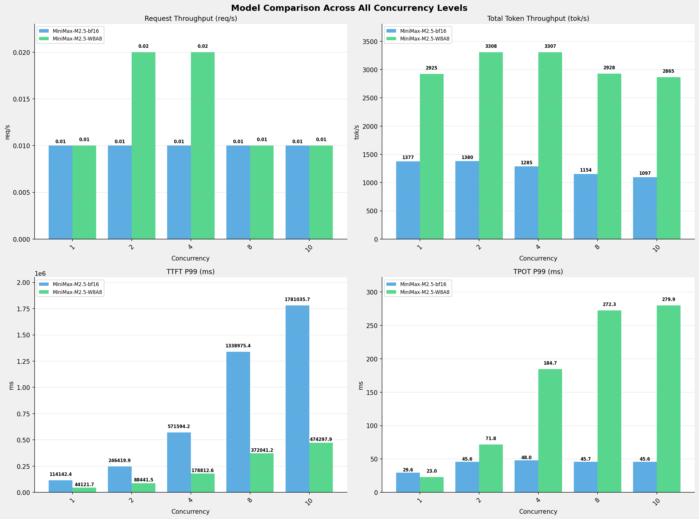

# 多模型性能对比报告 (全并发级别)

**测试日期：** 2026-05-18

**芯片平台：** hygon_bw1000

**测试套件：** test_02

**Run ID：** 01, 01

**测试配置：** 100-i194560-o1024

**并发级别：** 1, 2, 4, 8, 10

**对比模型：** MiniMax-M2.5-bf16, MiniMax-M2.5-W8A8

---

## 🤖 芯片和模型配置信息

| 参数名称 | **MiniMax-M2.5-bf16** | **MiniMax-M2.5-W8A8** |
|----------|----------|----------|
| **max_position_embeddings** | 196608 | 196608 |
| **model_name** | MiniMax-M2.5-bf16 | MiniMax-M2.5-W8A8 |
| **model_size** | 427G | 215G |
| **python_version** | 3.10.12 | 3.10.12 |
| **quantization_config** | bf16 | int-8 |
| **temperature** | N/A | N/A |
| **top_k** | N/A | N/A |
| **top_p** | N/A | N/A |
| **transformers_version** | 4.46.1 | 4.57.6 |
| **vllm_version** | 0.11.0+das.opt1.rc2.dtk2604.20260128.g0bf89b0c | 0.15.1+das.opt1.alpha.dtk2604 |

---

## ⚙️ vLLM 启动配置信息

| 参数名称 | **MiniMax-M2.5-bf16** | **MiniMax-M2.5-W8A8** |
|----------|----------|----------|
| **Block Size** | default | default |
| **Compilation Config** | N/A | N/A |
| **Dp** | 1 | 1 |
| **Dtype** | bfloat16 | bfloat16 |
| **Enable Auto Tool Choice** | True | True |
| **Enable Export Parallel** | True | True |
| **Gpu Memory Utilization** | 0.98 | 0.9 |
| **Max Model Len** | 196608 | 196608 |
| **Max Num Batched Tokens** | default | default |
| **Max Num Seqs** | 64 | 64 |
| **Model Name** | MiniMax-M2.5-bf16 | MiniMax-M2.5-W8A8 |
| **Pp** | 1 | 1 |
| **Reasoning Parser** | minimax_m2 (不生效) | minimax_m2 (不生效) |
| **Tool Call Parser** | minimax_m2 | minimax_m2 |
| **Tp** | 8 | 8 |

---

## 📊 模型列表

| 模型名称 | Run ID | 状态 |
|----------|--------|------|
| MiniMax-M2.5-bf16 | 01 | [OK] |
| MiniMax-M2.5-W8A8 | 01 | [OK] |

---

## 📊 测试概览

| 项目            | 配置                                     | 备注  |
|---------------|----------------------------------------|-----|
| **数据集**       | random                                 |     |
| **并发数**       | 1, 2, 4, 8, 10    |     |
| **总请求数**      | 100                                    |     |
| **输入输出长度** | (194560, 1024) |     |
| **测试套件**     | test_02                           |     |
| **被测芯片**      | hygon_bw1000 |     |
| **vLLM版本**   | 0.15.1                           |     |

---

## 📊 模型性能对比

---

## 📝 分析小结

- **MiniMax-M2.5-W8A8** 相比 **MiniMax-M2.5-bf16** 请求吞吐量平均提升 **40.0%**
- **MiniMax-M2.5-W8A8** 相比 **MiniMax-M2.5-bf16** 总token吞吐量平均提升 **143.6%**
- **MiniMax-M2.5-W8A8** 相比 **MiniMax-M2.5-bf16** TTFT P99平均改善 **71.4%** (延迟降低)
- **MiniMax-M2.5-W8A8** 相比 **MiniMax-M2.5-bf16** TPOT P99平均增加 **287.9%** (延迟增加)

---

## 📊 各并发级别详细对比

### 并发级别: 1

#### 服务基准结果

| 指标 | MiniMax-M2.5-bf16 (基准) | MiniMax-M2.5-W8A8 | 差异 | % |
|------|--------------- | --------- | ------- | -------|
| 成功请求数 | 100 | 100 | 0.00 | 0.0% |
| 失败请求数 | 0 | 0 | 0.00 | 0.0% |
| 测试持续时间 (s) | 14207.97 | 6687.21 | -7520.76 | -52.9% |
| 总输入 tokens | 19456000 | 19456000 | 0.00 | 0.0% |
| 总生成 tokens | 102400 | 102400 | 0.00 | 0.0% |
| 请求吞吐量 (req/s) | 0.01 | 0.01 | 0.00 | 0.0% |
| 输出 token 吞吐量 (tok/s) | 7.21 | 15.31 | +8.10 | +112.3% |
| 峰值输出 token 吞吐量 (tok/s) | 39.00 | 47.00 | +8.00 | +20.5% |
| 峰值并发请求数 | 2.00 | 2.00 | 0.00 | 0.0% |
| 总 token 吞吐量 (tok/s) | 1376.58 | 2924.75 | +1548.17 | +112.5% |

#### 首Token延迟 (TTFT)

| 指标 | MiniMax-M2.5-bf16 (基准) | MiniMax-M2.5-W8A8 | 差异 | % |
|------|--------------- | --------- | ------- | -------|
| 平均 TTFT (ms) | 111977.70 | 43487.80 | -68489.90 | -61.2% |
| 中位 TTFT (ms) | 113467.99 | 43910.38 | -69557.61 | -61.3% |
| P95 TTFT (ms) | 113900.00 | 44091.15 | -69808.85 | -61.3% |
| P99 TTFT (ms) | 114142.41 | 44121.71 | -70020.70 | -61.3% |

#### 每Token生成时间 (TPOT)

| 指标 | MiniMax-M2.5-bf16 (基准) | MiniMax-M2.5-W8A8 | 差异 | % |
|------|--------------- | --------- | ------- | -------|
| 平均 TPOT (ms) | 29.42 | 22.86 | -6.56 | -22.3% |
| 中位 TPOT (ms) | 29.42 | 22.86 | -6.56 | -22.3% |
| P95 TPOT (ms) | 29.55 | 22.96 | -6.59 | -22.3% |
| P99 TPOT (ms) | 29.56 | 22.97 | -6.59 | -22.3% |

#### Token间延迟 (ITL)

| 指标 | MiniMax-M2.5-bf16 (基准) | MiniMax-M2.5-W8A8 | 差异 | % |
|------|--------------- | --------- | ------- | -------|
| 平均 ITL (ms) | 29.51 | 22.88 | -6.63 | -22.5% |
| 中位 ITL (ms) | 29.42 | 22.85 | -6.57 | -22.3% |
| P95 ITL (ms) | 32.11 | 23.57 | -8.54 | -26.6% |
| P99 ITL (ms) | 53.91 | 32.12 | -21.79 | -40.4% |

---

### 并发级别: 2

#### 服务基准结果

| 指标 | MiniMax-M2.5-bf16 (基准) | MiniMax-M2.5-W8A8 | 差异 | % |
|------|--------------- | --------- | ------- | -------|
| 成功请求数 | 100 | 100 | 0.00 | 0.0% |
| 失败请求数 | 0 | 0 | 0.00 | 0.0% |
| 测试持续时间 (s) | 14168.11 | 5911.73 | -8256.38 | -58.3% |
| 总输入 tokens | 19456000 | 19456000 | 0.00 | 0.0% |
| 总生成 tokens | 102400 | 102400 | 0.00 | 0.0% |
| 请求吞吐量 (req/s) | 0.01 | 0.02 | +0.01 | +100.0% |
| 输出 token 吞吐量 (tok/s) | 7.23 | 17.32 | +10.09 | +139.6% |
| 峰值输出 token 吞吐量 (tok/s) | 37.00 | 72.00 | +35.00 | +94.6% |
| 峰值并发请求数 | 3.00 | 4.00 | +1.00 | +33.3% |
| 总 token 吞吐量 (tok/s) | 1380.45 | 3308.40 | +1927.95 | +139.7% |

#### 首Token延迟 (TTFT)

| 指标 | MiniMax-M2.5-bf16 (基准) | MiniMax-M2.5-W8A8 | 差异 | % |
|------|--------------- | --------- | ------- | -------|
| 平均 TTFT (ms) | 240896.75 | 66239.08 | -174657.67 | -72.5% |
| 中位 TTFT (ms) | 244527.82 | 46228.26 | -198299.56 | -81.1% |
| P95 TTFT (ms) | 246067.80 | 88317.83 | -157749.97 | -64.1% |
| P99 TTFT (ms) | 246419.91 | 88441.47 | -157978.44 | -64.1% |

#### 每Token生成时间 (TPOT)

| 指标 | MiniMax-M2.5-bf16 (基准) | MiniMax-M2.5-W8A8 | 差异 | % |
|------|--------------- | --------- | ------- | -------|
| 平均 TPOT (ms) | 40.32 | 50.82 | +10.50 | +26.0% |
| 中位 TPOT (ms) | 40.12 | 49.68 | +9.56 | +23.8% |
| P95 TPOT (ms) | 40.50 | 71.63 | +31.13 | +76.9% |
| P99 TPOT (ms) | 45.59 | 71.79 | +26.20 | +57.5% |

#### Token间延迟 (ITL)

| 指标 | MiniMax-M2.5-bf16 (基准) | MiniMax-M2.5-W8A8 | 差异 | % |
|------|--------------- | --------- | ------- | -------|
| 平均 ITL (ms) | 40.49 | 50.85 | +10.36 | +25.6% |
| 中位 ITL (ms) | 29.48 | 30.34 | +0.86 | +2.9% |
| P95 ITL (ms) | 32.30 | 36.99 | +4.69 | +14.5% |
| P99 ITL (ms) | 57.04 | 69.78 | +12.74 | +22.3% |

---

### 并发级别: 4

#### 服务基准结果

| 指标 | MiniMax-M2.5-bf16 (基准) | MiniMax-M2.5-W8A8 | 差异 | % |
|------|--------------- | --------- | ------- | -------|
| 成功请求数 | 100 | 100 | 0.00 | 0.0% |
| 失败请求数 | 0 | 0 | 0.00 | 0.0% |
| 测试持续时间 (s) | 15215.04 | 5914.77 | -9300.27 | -61.1% |
| 总输入 tokens | 19456000 | 19456000 | 0.00 | 0.0% |
| 总生成 tokens | 102400 | 102400 | 0.00 | 0.0% |
| 请求吞吐量 (req/s) | 0.01 | 0.02 | +0.01 | +100.0% |
| 输出 token 吞吐量 (tok/s) | 6.73 | 17.31 | +10.58 | +157.2% |
| 峰值输出 token 吞吐量 (tok/s) | 42.00 | 96.00 | +54.00 | +128.6% |
| 峰值并发请求数 | 5.00 | 7.00 | +2.00 | +40.0% |
| 总 token 吞吐量 (tok/s) | 1285.46 | 3306.71 | +2021.25 | +157.2% |

#### 首Token延迟 (TTFT)

| 指标 | MiniMax-M2.5-bf16 (基准) | MiniMax-M2.5-W8A8 | 差异 | % |
|------|--------------- | --------- | ------- | -------|
| 平均 TTFT (ms) | 554725.24 | 110901.13 | -443824.11 | -80.0% |
| 中位 TTFT (ms) | 566598.23 | 96467.29 | -470130.94 | -83.0% |
| P95 TTFT (ms) | 570672.93 | 174373.75 | -396299.18 | -69.4% |
| P99 TTFT (ms) | 571594.19 | 178812.59 | -392781.60 | -68.7% |

#### 每Token生成时间 (TPOT)

| 指标 | MiniMax-M2.5-bf16 (基准) | MiniMax-M2.5-W8A8 | 差异 | % |
|------|--------------- | --------- | ------- | -------|
| 平均 TPOT (ms) | 44.79 | 122.83 | +78.04 | +174.2% |
| 中位 TPOT (ms) | 40.22 | 120.64 | +80.42 | +200.0% |
| P95 TPOT (ms) | 45.51 | 184.15 | +138.64 | +304.6% |
| P99 TPOT (ms) | 47.96 | 184.74 | +136.78 | +285.2% |

#### Token间延迟 (ITL)

| 指标 | MiniMax-M2.5-bf16 (基准) | MiniMax-M2.5-W8A8 | 差异 | % |
|------|--------------- | --------- | ------- | -------|
| 平均 ITL (ms) | 44.91 | 122.76 | +77.85 | +173.3% |
| 中位 ITL (ms) | 29.44 | 43.16 | +13.72 | +46.6% |
| P95 ITL (ms) | 32.20 | 52.02 | +19.82 | +61.6% |
| P99 ITL (ms) | 56.06 | 3071.54 | +3015.48 | +5379.0% |

---

### 并发级别: 8

#### 服务基准结果

| 指标 | MiniMax-M2.5-bf16 (基准) | MiniMax-M2.5-W8A8 | 差异 | % |
|------|--------------- | --------- | ------- | -------|
| 成功请求数 | 100 | 100 | 0.00 | 0.0% |
| 失败请求数 | 0 | 0 | 0.00 | 0.0% |
| 测试持续时间 (s) | 16951.44 | 6680.12 | -10271.32 | -60.6% |
| 总输入 tokens | 19456000 | 19456000 | 0.00 | 0.0% |
| 总生成 tokens | 102400 | 102400 | 0.00 | 0.0% |
| 请求吞吐量 (req/s) | 0.01 | 0.01 | 0.00 | 0.0% |
| 输出 token 吞吐量 (tok/s) | 6.04 | 15.33 | +9.29 | +153.8% |
| 峰值输出 token 吞吐量 (tok/s) | 39.00 | 135.00 | +96.00 | +246.2% |
| 峰值并发请求数 | 9.00 | 9.00 | 0.00 | 0.0% |
| 总 token 吞吐量 (tok/s) | 1153.79 | 2927.85 | +1774.06 | +153.8% |

#### 首Token延迟 (TTFT)

| 指标 | MiniMax-M2.5-bf16 (基准) | MiniMax-M2.5-W8A8 | 差异 | % |
|------|--------------- | --------- | ------- | -------|
| 平均 TTFT (ms) | 1274250.30 | 260175.41 | -1014074.89 | -79.6% |
| 中位 TTFT (ms) | 1333646.74 | 280403.12 | -1053243.62 | -79.0% |
| P95 TTFT (ms) | 1338261.01 | 281593.86 | -1056667.15 | -79.0% |
| P99 TTFT (ms) | 1338975.40 | 372041.15 | -966934.25 | -72.2% |

#### 每Token生成时间 (TPOT)

| 指标 | MiniMax-M2.5-bf16 (基准) | MiniMax-M2.5-W8A8 | 差异 | % |
|------|--------------- | --------- | ------- | -------|
| 平均 TPOT (ms) | 40.41 | 263.40 | +222.99 | +551.8% |
| 中位 TPOT (ms) | 40.06 | 269.07 | +229.01 | +571.7% |
| P95 TPOT (ms) | 40.52 | 272.14 | +231.62 | +571.6% |
| P99 TPOT (ms) | 45.71 | 272.32 | +226.61 | +495.8% |

#### Token间延迟 (ITL)

| 指标 | MiniMax-M2.5-bf16 (基准) | MiniMax-M2.5-W8A8 | 差异 | % |
|------|--------------- | --------- | ------- | -------|
| 平均 ITL (ms) | 40.48 | 263.23 | +222.75 | +550.3% |
| 中位 ITL (ms) | 29.44 | 38.61 | +9.17 | +31.1% |
| P95 ITL (ms) | 31.47 | 2683.84 | +2652.37 | +8428.2% |
| P99 ITL (ms) | 51.77 | 4014.05 | +3962.28 | +7653.6% |

---

### 并发级别: 10

#### 服务基准结果

| 指标 | MiniMax-M2.5-bf16 (基准) | MiniMax-M2.5-W8A8 | 差异 | % |
|------|--------------- | --------- | ------- | -------|
| 成功请求数 | 100 | 100 | 0.00 | 0.0% |
| 失败请求数 | 0 | 0 | 0.00 | 0.0% |
| 测试持续时间 (s) | 17832.87 | 6826.46 | -11006.41 | -61.7% |
| 总输入 tokens | 19456000 | 19456000 | 0.00 | 0.0% |
| 总生成 tokens | 102400 | 102400 | 0.00 | 0.0% |
| 请求吞吐量 (req/s) | 0.01 | 0.01 | 0.00 | 0.0% |
| 输出 token 吞吐量 (tok/s) | 5.74 | 15.00 | +9.26 | +161.3% |
| 峰值输出 token 吞吐量 (tok/s) | 39.00 | 145.00 | +106.00 | +271.8% |
| 峰值并发请求数 | 11.00 | 12.00 | +1.00 | +9.1% |
| 总 token 吞吐量 (tok/s) | 1096.76 | 2865.09 | +1768.33 | +161.2% |

#### 首Token延迟 (TTFT)

| 指标 | MiniMax-M2.5-bf16 (基准) | MiniMax-M2.5-W8A8 | 差异 | % |
|------|--------------- | --------- | ------- | -------|
| 平均 TTFT (ms) | 1675058.97 | 399184.25 | -1275874.72 | -76.2% |
| 中位 TTFT (ms) | 1774448.89 | 414031.08 | -1360417.81 | -76.7% |
| P95 TTFT (ms) | 1780264.33 | 441820.31 | -1338444.02 | -75.2% |
| P99 TTFT (ms) | 1781035.71 | 474297.92 | -1306737.79 | -73.4% |

#### 每Token生成时间 (TPOT)

| 指标 | MiniMax-M2.5-bf16 (基准) | MiniMax-M2.5-W8A8 | 差异 | % |
|------|--------------- | --------- | ------- | -------|
| 平均 TPOT (ms) | 40.36 | 266.45 | +226.09 | +560.2% |
| 中位 TPOT (ms) | 40.01 | 276.40 | +236.39 | +590.8% |
| P95 TPOT (ms) | 40.51 | 279.80 | +239.29 | +590.7% |
| P99 TPOT (ms) | 45.57 | 279.90 | +234.33 | +514.2% |

#### Token间延迟 (ITL)

| 指标 | MiniMax-M2.5-bf16 (基准) | MiniMax-M2.5-W8A8 | 差异 | % |
|------|--------------- | --------- | ------- | -------|
| 平均 ITL (ms) | 40.48 | 266.45 | +225.97 | +558.2% |
| 中位 ITL (ms) | 29.39 | 38.64 | +9.25 | +31.5% |
| P95 ITL (ms) | 31.93 | 2679.16 | +2647.23 | +8290.7% |
| P99 ITL (ms) | 55.14 | 4012.34 | +3957.20 | +7176.6% |

---

---

*报告生成时间: 2026-05-18*

