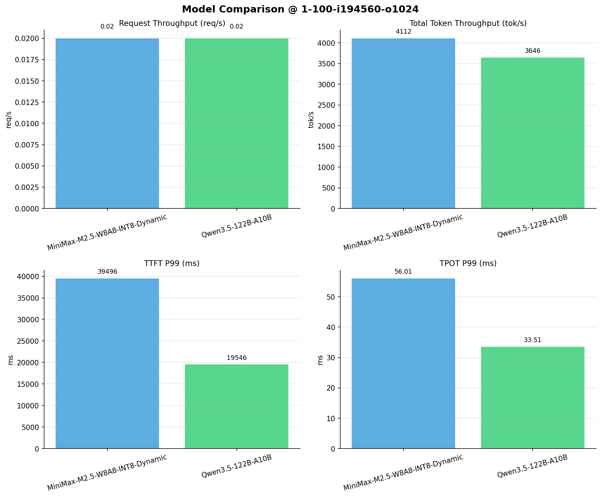

# 多模型性能对比报告

**测试日期：** 2026-04-13

**芯片平台：** kunlun_p800

**测试套件：** test_03

**Run ID：** 01, 01

**并发级别：** 1并发

**测试配置：** 1-100-i194560-o1024

---

## 🤖 芯片和模型配置信息

| 芯片名称                        | **MiniMax-M2.5-W8A8-INT8-Dynamic** | **Qwen3.5-122B-A10B** |
|-----------------------------|-------------------------------|-------------------------------|
| **model_name** | MiniMax-M2.5-W8A8-INT8-Dynamic | Qwen3.5-122B-A10B |
| **quantization_config** | int-8 | N/A |
| **model_size** | 215G | 234G |
| **max_position_embeddings** | 196608 | 262144 |
| **temperature** | 1.0 | 0.6 |
| **top_k** | 40 | 20 |
| **top_p** | 0.95 | 0.95 |
| **transformers_version** | 4.46.1 | 4.57.0.dev0 |
| **vllm_version** | 0.11.0 | 0.15.1 |
| **python_version** | 3.10.15 | 3.10.19 |

---

## 🤖 vLLM启动配置信息

| 参数名称                    | **MiniMax-M2.5-W8A8-INT8-Dynamic** | **Qwen3.5-122B-A10B** |
|-------------------------|-------------------|-------------------|
| model_name | MiniMax-M2.5-W8A8-INT8-Dynamic | MiniMax-M2.5-W8A8-INT8-Dynamic |
| max-model-len | 196608 | 196608 |
| max-num-seqs | 64 | 64 |
| max-num-batched-tokens | 8192 | 8192 |
| gpu-memory-utilization | 0.95 | 0.95 |
| dtype | auto | auto |
| block_size | 128 | 128 |
| dp | 1 | 1 |
| tp | 8 | 8 |
| pp | 1 | 1 |
| enable-export-parallel | False | False |
| enable-auto-tool-choice | True | True |
| tool-call-parser | minimax_m2 | minimax_m2 |
| reasoning-parser | minimax_m2 (不生效) | minimax_m2 (不生效) |

---

## 📊 模型列表

| 模型名称 | Run ID | 状态 |
|----------|--------|------|
| MiniMax-M2.5-W8A8-INT8-Dynamic | 01 | [OK] |
| Qwen3.5-122B-A10B | 01 | [OK] |

---

## 📈 服务基准结果对比

| 指标 | MiniMax-M2.5-W8A8-INT8-Dynamic (基准) | Qwen3.5-122B-A10B | 差异 | % |
|------|--------------- | --------- | ------- | -------|
| 成功请求数 | 100 | 100 | 0.00 | 0.0% |
| 失败请求数 |  | 0 | N/A | N/A |
| 测试持续时间 (s) | 4735.72 | 5364.26 | +628.54 | +13.3% |
| 总输入 tokens | 19456000 | 19456000 | 0.00 | 0.0% |
| 总生成 tokens | 15277 | 102400 | +87123.00 | +570.3% |
| **请求吞吐量 (req/s)** | 0.02 | 0.02 | 0.00 | 0.0% |
| **输出 token 吞吐量 (tok/s)** | 3.23 | 19.09 | +15.86 | +491.0% |
| 峰值输出 token 吞吐量 (tok/s) | 20.00 | 32.00 | +12.00 | +60.0% |
| 峰值并发请求数 | 2.00 | 2.00 | 0.00 | 0.0% |
| **总 token 吞吐量 (tok/s)** | 4111.58 | 3646.06 | -465.52 | -11.3% |

---

## ⏱️ 首 Token 延迟 (TTFT) 对比

| 指标 | MiniMax-M2.5-W8A8-INT8-Dynamic (基准) | Qwen3.5-122B-A10B | 差异 | % |
|------|--------------- | --------- | ------- | -------|
| 平均 TTFT (ms) | 39047.26 | 19471.46 | -19575.80 | -50.1% |
| 中位 TTFT (ms) | 39430.52 | 19472.62 | -19957.90 | -50.6% |
| P95 TTFT (ms) | 39464.93 | 19531.05 | -19933.88 | -50.5% |
| P99 TTFT (ms) | 39495.63 | 19546.21 | -19949.42 | -50.5% |

---

## ⚡ 每 Token 生成时间 (TPOT) 对比

| 指标 | MiniMax-M2.5-W8A8-INT8-Dynamic (基准) | Qwen3.5-122B-A10B | 差异 | % |
|------|--------------- | --------- | ------- | -------|
| 平均 TPOT (ms) | 54.79 | 33.40 | -21.39 | -39.0% |
| 中位 TPOT (ms) | 54.76 | 33.40 | -21.36 | -39.0% |
| P95 TPOT (ms) | 54.81 | 33.43 | -21.38 | -39.0% |
| P99 TPOT (ms) | 56.01 | 33.51 | -22.50 | -40.2% |

---

## 🔄 Token 间延迟 (ITL) 对比

| 指标 | MiniMax-M2.5-W8A8-INT8-Dynamic (基准) | Qwen3.5-122B-A10B | 差异 | % |
|------|--------------- | --------- | ------- | -------|
| 平均 ITL (ms) | 54.75 | 33.37 | -21.38 | -39.1% |
| 中位 ITL (ms) | 54.74 | 33.39 | -21.35 | -39.0% |
| P95 ITL (ms) | 54.99 | 33.64 | -21.35 | -38.8% |
| P99 ITL (ms) | 57.01 | 34.11 | -22.90 | -40.2% |

---

## 📊 模型性能对比

---

## 📝 分析小结

- **请求吞吐量**: MiniMax-M2.5-W8A8-INT8-Dynamic 最高，达 0.02 req/s
- **总token吞吐量**: MiniMax-M2.5-W8A8-INT8-Dynamic 最高，达 4112 tok/s
- **TTFT P99**: Qwen3.5-122B-A10B 最优，为 19546.21ms
- **TPOT P99**: Qwen3.5-122B-A10B 最优，为 33.51ms

---

*报告生成时间: 2026-04-13*

