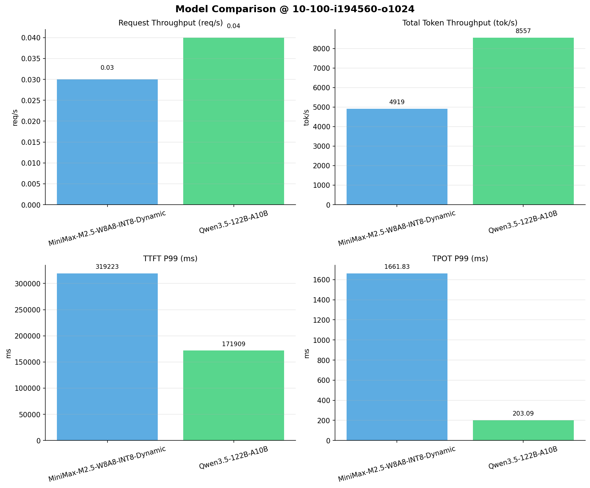

# 多模型性能对比报告

**测试日期：** 2026-04-13

**芯片平台：** kunlun_p800

**测试套件：** test_03

**Run ID：** 01, 01

**并发级别：** 10并发

**测试配置：** 10-100-i194560-o1024

---

## 🤖 芯片和模型配置信息

| 芯片名称                        | **MiniMax-M2.5-W8A8-INT8-Dynamic** | **Qwen3.5-122B-A10B** |
|-----------------------------|-------------------------------|-------------------------------|
| **model_name** | MiniMax-M2.5-W8A8-INT8-Dynamic | Qwen3.5-122B-A10B |
| **quantization_config** | int-8 | N/A |
| **model_size** | 215G | 234G |
| **max_position_embeddings** | 196608 | 262144 |
| **temperature** | 1.0 | 0.6 |
| **top_k** | 40 | 20 |
| **top_p** | 0.95 | 0.95 |
| **transformers_version** | 4.46.1 | 4.57.0.dev0 |
| **vllm_version** | 0.11.0 | 0.15.1 |
| **python_version** | 3.10.15 | 3.10.19 |

---

## 🤖 vLLM启动配置信息

| 参数名称                    | **MiniMax-M2.5-W8A8-INT8-Dynamic** | **Qwen3.5-122B-A10B** |
|-------------------------|-------------------|-------------------|
| model_name | MiniMax-M2.5-W8A8-INT8-Dynamic | MiniMax-M2.5-W8A8-INT8-Dynamic |
| max-model-len | 196608 | 196608 |
| max-num-seqs | 64 | 64 |
| max-num-batched-tokens | 8192 | 8192 |
| gpu-memory-utilization | 0.95 | 0.95 |
| dtype | auto | auto |
| block_size | 128 | 128 |
| dp | 1 | 1 |
| tp | 8 | 8 |
| pp | 1 | 1 |
| enable-export-parallel | False | False |
| enable-auto-tool-choice | True | True |
| tool-call-parser | minimax_m2 | minimax_m2 |
| reasoning-parser | minimax_m2 (不生效) | minimax_m2 (不生效) |

---

## 📊 模型列表

| 模型名称 | Run ID | 状态 |
|----------|--------|------|
| MiniMax-M2.5-W8A8-INT8-Dynamic | 01 | [OK] |
| Qwen3.5-122B-A10B | 01 | [OK] |

---

## 📈 服务基准结果对比

| 指标 | MiniMax-M2.5-W8A8-INT8-Dynamic (基准) | Qwen3.5-122B-A10B | 差异 | % |
|------|--------------- | --------- | ------- | -------|
| 成功请求数 | 100 | 100 | 0.00 | 0.0% |
| 失败请求数 |  | 0 | N/A | N/A |
| 测试持续时间 (s) | 3958.73 | 2285.71 | -1673.02 | -42.3% |
| 总输入 tokens | 19456000 | 19456000 | 0.00 | 0.0% |
| 总生成 tokens | 16821 | 102400 | +85579.00 | +508.8% |
| **请求吞吐量 (req/s)** | 0.03 | 0.04 | +0.01 | +33.3% |
| **输出 token 吞吐量 (tok/s)** | 4.25 | 44.80 | +40.55 | +954.1% |
| 峰值输出 token 吞吐量 (tok/s) | 127.00 | 230.00 | +103.00 | +81.1% |
| 峰值并发请求数 | 12.00 | 11.00 | -1.00 | -8.3% |
| **总 token 吞吐量 (tok/s)** | 4918.95 | 8556.83 | +3637.88 | +74.0% |

---

## ⏱️ 首 Token 延迟 (TTFT) 对比

| 指标 | MiniMax-M2.5-W8A8-INT8-Dynamic (基准) | Qwen3.5-122B-A10B | 差异 | % |
|------|--------------- | --------- | ------- | -------|
| 平均 TTFT (ms) | 146180.13 | 41664.46 | -104515.67 | -71.5% |
| 中位 TTFT (ms) | 148167.77 | 36083.01 | -112084.76 | -75.6% |
| P95 TTFT (ms) | 230342.85 | 96512.81 | -133830.04 | -58.1% |
| P99 TTFT (ms) | 319223.30 | 171909.46 | -147313.84 | -46.1% |

---

## ⚡ 每 Token 生成时间 (TPOT) 对比

| 指标 | MiniMax-M2.5-W8A8-INT8-Dynamic (基准) | Qwen3.5-122B-A10B | 差异 | % |
|------|--------------- | --------- | ------- | -------|
| 平均 TPOT (ms) | 1563.07 | 182.31 | -1380.76 | -88.3% |
| 中位 TPOT (ms) | 1626.53 | 187.39 | -1439.14 | -88.5% |
| P95 TPOT (ms) | 1659.06 | 203.01 | -1456.05 | -87.8% |
| P99 TPOT (ms) | 1661.83 | 203.09 | -1458.74 | -87.8% |

---

## 🔄 Token 间延迟 (ITL) 对比

| 指标 | MiniMax-M2.5-W8A8-INT8-Dynamic (基准) | Qwen3.5-122B-A10B | 差异 | % |
|------|--------------- | --------- | ------- | -------|
| 平均 ITL (ms) | 1473.37 | 182.13 | -1291.24 | -87.6% |
| 中位 ITL (ms) | 1497.41 | 44.73 | -1452.68 | -97.0% |
| P95 ITL (ms) | 2628.68 | 918.14 | -1710.54 | -65.1% |
| P99 ITL (ms) | 2738.47 | 1038.65 | -1699.82 | -62.1% |

---

## 📊 模型性能对比

---

## 📝 分析小结

- **请求吞吐量**: Qwen3.5-122B-A10B 最高，达 0.04 req/s
- **总token吞吐量**: Qwen3.5-122B-A10B 最高，达 8557 tok/s
- **TTFT P99**: Qwen3.5-122B-A10B 最优，为 171909.46ms
- **TPOT P99**: Qwen3.5-122B-A10B 最优，为 203.09ms

---

*报告生成时间: 2026-04-13*

