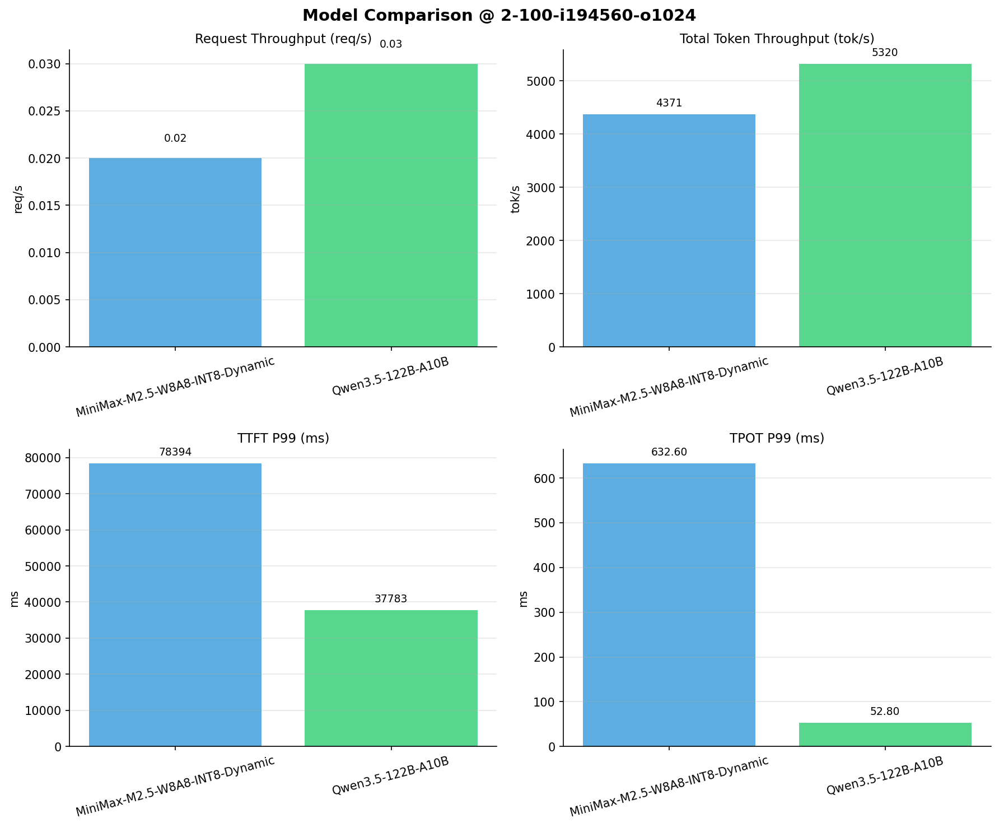

# 多模型性能对比报告

**测试日期：** 2026-04-13

**芯片平台：** kunlun_p800

**测试套件：** test_03

**Run ID：** 01, 01

**并发级别：** 2并发

**测试配置：** 2-100-i194560-o1024

---

## 🤖 芯片和模型配置信息

| 芯片名称                        | **MiniMax-M2.5-W8A8-INT8-Dynamic** | **Qwen3.5-122B-A10B** |
|-----------------------------|-------------------------------|-------------------------------|
| **model_name** | MiniMax-M2.5-W8A8-INT8-Dynamic | Qwen3.5-122B-A10B |
| **quantization_config** | int-8 | N/A |
| **model_size** | 215G | 234G |
| **max_position_embeddings** | 196608 | 262144 |
| **temperature** | 1.0 | 0.6 |
| **top_k** | 40 | 20 |
| **top_p** | 0.95 | 0.95 |
| **transformers_version** | 4.46.1 | 4.57.0.dev0 |
| **vllm_version** | 0.11.0 | 0.15.1 |
| **python_version** | 3.10.15 | 3.10.19 |

---

## 🤖 vLLM启动配置信息

| 参数名称                    | **MiniMax-M2.5-W8A8-INT8-Dynamic** | **Qwen3.5-122B-A10B** |
|-------------------------|-------------------|-------------------|
| model_name | MiniMax-M2.5-W8A8-INT8-Dynamic | MiniMax-M2.5-W8A8-INT8-Dynamic |
| max-model-len | 196608 | 196608 |
| max-num-seqs | 64 | 64 |
| max-num-batched-tokens | 8192 | 8192 |
| gpu-memory-utilization | 0.95 | 0.95 |
| dtype | auto | auto |
| block_size | 128 | 128 |
| dp | 1 | 1 |
| tp | 8 | 8 |
| pp | 1 | 1 |
| enable-export-parallel | False | False |
| enable-auto-tool-choice | True | True |
| tool-call-parser | minimax_m2 | minimax_m2 |
| reasoning-parser | minimax_m2 (不生效) | minimax_m2 (不生效) |

---

## 📊 模型列表

| 模型名称 | Run ID | 状态 |
|----------|--------|------|
| MiniMax-M2.5-W8A8-INT8-Dynamic | 01 | [OK] |
| Qwen3.5-122B-A10B | 01 | [OK] |

---

## 📈 服务基准结果对比

| 指标 | MiniMax-M2.5-W8A8-INT8-Dynamic (基准) | Qwen3.5-122B-A10B | 差异 | % |
|------|--------------- | --------- | ------- | -------|
| 成功请求数 | 100 | 100 | 0.00 | 0.0% |
| 失败请求数 |  | 0 | N/A | N/A |
| 测试持续时间 (s) | 4456.34 | 3676.71 | -779.63 | -17.5% |
| 总输入 tokens | 19456000 | 19456000 | 0.00 | 0.0% |
| 总生成 tokens | 20670 | 102400 | +81730.00 | +395.4% |
| **请求吞吐量 (req/s)** | 0.02 | 0.03 | +0.01 | +50.0% |
| **输出 token 吞吐量 (tok/s)** | 4.64 | 27.85 | +23.21 | +500.2% |
| 峰值输出 token 吞吐量 (tok/s) | 37.00 | 59.00 | +22.00 | +59.5% |
| 峰值并发请求数 | 3.00 | 4.00 | +1.00 | +33.3% |
| **总 token 吞吐量 (tok/s)** | 4370.55 | 5319.53 | +948.98 | +21.7% |

---

## ⏱️ 首 Token 延迟 (TTFT) 对比

| 指标 | MiniMax-M2.5-W8A8-INT8-Dynamic (基准) | Qwen3.5-122B-A10B | 差异 | % |
|------|--------------- | --------- | ------- | -------|
| 平均 TTFT (ms) | 44931.50 | 28648.90 | -16282.60 | -36.2% |
| 中位 TTFT (ms) | 40375.08 | 28401.26 | -11973.82 | -29.7% |
| P95 TTFT (ms) | 75502.31 | 37741.49 | -37760.82 | -50.0% |
| P99 TTFT (ms) | 78394.34 | 37783.08 | -40611.26 | -51.8% |

---

## ⚡ 每 Token 生成时间 (TPOT) 对比

| 指标 | MiniMax-M2.5-W8A8-INT8-Dynamic (基准) | Qwen3.5-122B-A10B | 差异 | % |
|------|--------------- | --------- | ------- | -------|
| 平均 TPOT (ms) | 207.16 | 43.87 | -163.29 | -78.8% |
| 中位 TPOT (ms) | 134.72 | 44.08 | -90.64 | -67.3% |
| P95 TPOT (ms) | 546.28 | 52.75 | -493.53 | -90.3% |
| P99 TPOT (ms) | 632.60 | 52.80 | -579.80 | -91.7% |

---

## 🔄 Token 间延迟 (ITL) 对比

| 指标 | MiniMax-M2.5-W8A8-INT8-Dynamic (基准) | Qwen3.5-122B-A10B | 差异 | % |
|------|--------------- | --------- | ------- | -------|
| 平均 ITL (ms) | 214.50 | 43.83 | -170.67 | -79.6% |
| 中位 ITL (ms) | 56.01 | 35.00 | -21.01 | -37.5% |
| P95 ITL (ms) | 1622.96 | 35.33 | -1587.63 | -97.8% |
| P99 ITL (ms) | 2481.47 | 608.47 | -1873.00 | -75.5% |

---

## 📊 模型性能对比

---

## 📝 分析小结

- **请求吞吐量**: Qwen3.5-122B-A10B 最高，达 0.03 req/s
- **总token吞吐量**: Qwen3.5-122B-A10B 最高，达 5320 tok/s
- **TTFT P99**: Qwen3.5-122B-A10B 最优，为 37783.08ms
- **TPOT P99**: Qwen3.5-122B-A10B 最优，为 52.80ms

---

*报告生成时间: 2026-04-13*

