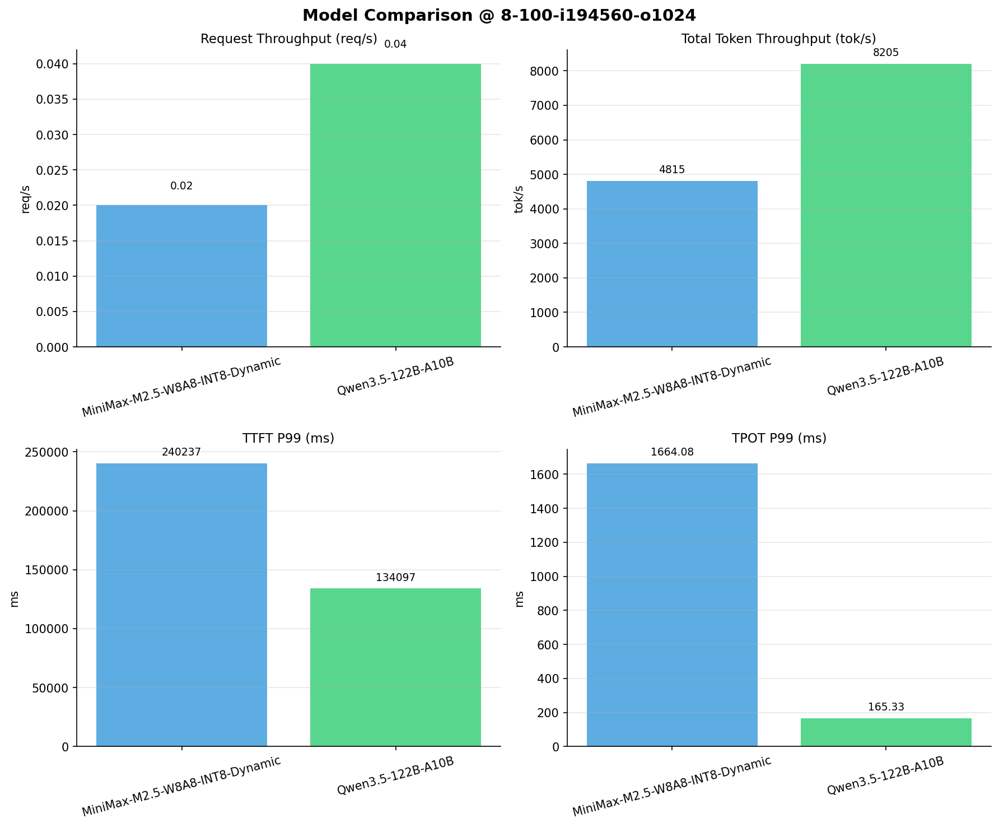

# 多模型性能对比报告

**测试日期：** 2026-04-13

**芯片平台：** kunlun_p800

**测试套件：** test_03

**Run ID：** 01, 01

**并发级别：** 8并发

**测试配置：** 8-100-i194560-o1024

---

## 🤖 芯片和模型配置信息

| 芯片名称                        | **MiniMax-M2.5-W8A8-INT8-Dynamic** | **Qwen3.5-122B-A10B** |
|-----------------------------|-------------------------------|-------------------------------|
| **model_name** | MiniMax-M2.5-W8A8-INT8-Dynamic | Qwen3.5-122B-A10B |
| **quantization_config** | int-8 | N/A |
| **model_size** | 215G | 234G |
| **max_position_embeddings** | 196608 | 262144 |
| **temperature** | 1.0 | 0.6 |
| **top_k** | 40 | 20 |
| **top_p** | 0.95 | 0.95 |
| **transformers_version** | 4.46.1 | 4.57.0.dev0 |
| **vllm_version** | 0.11.0 | 0.15.1 |
| **python_version** | 3.10.15 | 3.10.19 |

---

## 🤖 vLLM启动配置信息

| 参数名称                    | **MiniMax-M2.5-W8A8-INT8-Dynamic** | **Qwen3.5-122B-A10B** |
|-------------------------|-------------------|-------------------|
| model_name | MiniMax-M2.5-W8A8-INT8-Dynamic | MiniMax-M2.5-W8A8-INT8-Dynamic |
| max-model-len | 196608 | 196608 |
| max-num-seqs | 64 | 64 |
| max-num-batched-tokens | 8192 | 8192 |
| gpu-memory-utilization | 0.95 | 0.95 |
| dtype | auto | auto |
| block_size | 128 | 128 |
| dp | 1 | 1 |
| tp | 8 | 8 |
| pp | 1 | 1 |
| enable-export-parallel | False | False |
| enable-auto-tool-choice | True | True |
| tool-call-parser | minimax_m2 | minimax_m2 |
| reasoning-parser | minimax_m2 (不生效) | minimax_m2 (不生效) |

---

## 📊 模型列表

| 模型名称 | Run ID | 状态 |
|----------|--------|------|
| MiniMax-M2.5-W8A8-INT8-Dynamic | 01 | [OK] |
| Qwen3.5-122B-A10B | 01 | [OK] |

---

## 📈 服务基准结果对比

| 指标 | MiniMax-M2.5-W8A8-INT8-Dynamic (基准) | Qwen3.5-122B-A10B | 差异 | % |
|------|--------------- | --------- | ------- | -------|
| 成功请求数 | 100 | 100 | 0.00 | 0.0% |
| 失败请求数 |  | 0 | N/A | N/A |
| 测试持续时间 (s) | 4046.25 | 2383.58 | -1662.67 | -41.1% |
| 总输入 tokens | 19456000 | 19456000 | 0.00 | 0.0% |
| 总生成 tokens | 26139 | 102400 | +76261.00 | +291.8% |
| **请求吞吐量 (req/s)** | 0.02 | 0.04 | +0.02 | +100.0% |
| **输出 token 吞吐量 (tok/s)** | 6.46 | 42.96 | +36.50 | +565.0% |
| 峰值输出 token 吞吐量 (tok/s) | 136.00 | 200.00 | +64.00 | +47.1% |
| 峰值并发请求数 | 11.00 | 9.00 | -2.00 | -18.2% |
| **总 token 吞吐量 (tok/s)** | 4814.86 | 8205.48 | +3390.62 | +70.4% |

---

## ⏱️ 首 Token 延迟 (TTFT) 对比

| 指标 | MiniMax-M2.5-W8A8-INT8-Dynamic (基准) | Qwen3.5-122B-A10B | 差异 | % |
|------|--------------- | --------- | ------- | -------|
| 平均 TTFT (ms) | 91164.54 | 38685.27 | -52479.27 | -57.6% |
| 中位 TTFT (ms) | 80497.31 | 36639.93 | -43857.38 | -54.5% |
| P95 TTFT (ms) | 161053.87 | 58803.42 | -102250.45 | -63.5% |
| P99 TTFT (ms) | 240236.55 | 134097.09 | -106139.46 | -44.2% |

---

## ⚡ 每 Token 生成时间 (TPOT) 对比

| 指标 | MiniMax-M2.5-W8A8-INT8-Dynamic (基准) | Qwen3.5-122B-A10B | 差异 | % |
|------|--------------- | --------- | ------- | -------|
| 平均 TPOT (ms) | 1222.97 | 146.93 | -1076.04 | -88.0% |
| 中位 TPOT (ms) | 1352.12 | 149.04 | -1203.08 | -89.0% |
| P95 TPOT (ms) | 1655.50 | 165.24 | -1490.26 | -90.0% |
| P99 TPOT (ms) | 1664.08 | 165.33 | -1498.75 | -90.1% |

---

## 🔄 Token 间延迟 (ITL) 对比

| 指标 | MiniMax-M2.5-W8A8-INT8-Dynamic (基准) | Qwen3.5-122B-A10B | 差异 | % |
|------|--------------- | --------- | ------- | -------|
| 平均 ITL (ms) | 881.62 | 146.79 | -734.83 | -83.3% |
| 中位 ITL (ms) | 638.32 | 41.76 | -596.56 | -93.5% |
| P95 ITL (ms) | 2524.13 | 872.31 | -1651.82 | -65.4% |
| P99 ITL (ms) | 2711.55 | 1030.51 | -1681.04 | -62.0% |

---

## 📊 模型性能对比

---

## 📝 分析小结

- **请求吞吐量**: Qwen3.5-122B-A10B 最高，达 0.04 req/s
- **总token吞吐量**: Qwen3.5-122B-A10B 最高，达 8205 tok/s
- **TTFT P99**: Qwen3.5-122B-A10B 最优，为 134097.09ms
- **TPOT P99**: Qwen3.5-122B-A10B 最优，为 165.33ms

---

*报告生成时间: 2026-04-13*

