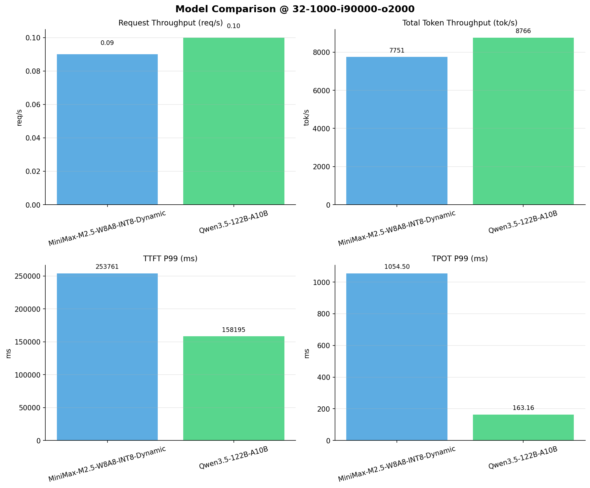

# 多模型性能对比报告

**测试日期：** 2026-04-13

**芯片平台：** kunlun_p800

**测试套件：** test_05

**Run ID：** 01, 01

**并发级别：** 32并发

**测试配置：** 32-1000-i90000-o2000

---

## 🤖 芯片和模型配置信息

| 芯片名称                        | **MiniMax-M2.5-W8A8-INT8-Dynamic** | **Qwen3.5-122B-A10B** |
|-----------------------------|-------------------------------|-------------------------------|
| **model_name** | MiniMax-M2.5-W8A8-INT8-Dynamic | Qwen3.5-122B-A10B |
| **quantization_config** | int-8 | N/A |
| **model_size** | 215G | 234G |
| **max_position_embeddings** | 196608 | 262144 |
| **temperature** | 1.0 | 0.6 |
| **top_k** | 40 | 20 |
| **top_p** | 0.95 | 0.95 |
| **transformers_version** | 4.46.1 | 4.57.0.dev0 |
| **vllm_version** | 0.11.0 | 0.15.1 |
| **python_version** | 3.10.15 | 3.10.19 |

---

## 🤖 vLLM启动配置信息

| 参数名称                    | **MiniMax-M2.5-W8A8-INT8-Dynamic** | **Qwen3.5-122B-A10B** |
|-------------------------|-------------------|-------------------|
| model_name | MiniMax-M2.5-W8A8-INT8-Dynamic | MiniMax-M2.5-W8A8-INT8-Dynamic |
| max-model-len | 196608 | 196608 |
| max-num-seqs | 64 | 64 |
| max-num-batched-tokens | 8192 | 8192 |
| gpu-memory-utilization | 0.95 | 0.95 |
| dtype | auto | auto |
| block_size | 128 | 128 |
| dp | 1 | 1 |
| tp | 8 | 8 |
| pp | 1 | 1 |
| enable-export-parallel | False | False |
| enable-auto-tool-choice | True | True |
| tool-call-parser | minimax_m2 | minimax_m2 |
| reasoning-parser | minimax_m2 (不生效) | minimax_m2 (不生效) |

---

## 📊 模型列表

| 模型名称 | Run ID | 状态 |
|----------|--------|------|
| MiniMax-M2.5-W8A8-INT8-Dynamic | 01 | [OK] |
| Qwen3.5-122B-A10B | 01 | [OK] |

---

## 📈 服务基准结果对比

| 指标 | MiniMax-M2.5-W8A8-INT8-Dynamic (基准) | Qwen3.5-122B-A10B | 差异 | % |
|------|--------------- | --------- | ------- | -------|
| 成功请求数 | 1000 | 1000 | 0.00 | 0.0% |
| 失败请求数 |  | 0 | N/A | N/A |
| 测试持续时间 (s) | 11642.33 | 10495.51 | -1146.82 | -9.9% |
| 总输入 tokens | 90000000 | 90000000 | 0.00 | 0.0% |
| 总生成 tokens | 245458 | 2000000 | +1754542.00 | +714.8% |
| **请求吞吐量 (req/s)** | 0.09 | 0.10 | +0.01 | +11.1% |
| **输出 token 吞吐量 (tok/s)** | 21.08 | 190.56 | +169.48 | +804.0% |
| 峰值输出 token 吞吐量 (tok/s) | 345.00 | 576.00 | +231.00 | +67.0% |
| 峰值并发请求数 | 34.00 | 33.00 | -1.00 | -2.9% |
| **总 token 吞吐量 (tok/s)** | 7751.49 | 8765.65 | +1014.16 | +13.1% |

---

## ⏱️ 首 Token 延迟 (TTFT) 对比

| 指标 | MiniMax-M2.5-W8A8-INT8-Dynamic (基准) | Qwen3.5-122B-A10B | 差异 | % |
|------|--------------- | --------- | ------- | -------|
| 平均 TTFT (ms) | 136676.31 | 17390.14 | -119286.17 | -87.3% |
| 中位 TTFT (ms) | 132208.13 | 14186.67 | -118021.46 | -89.3% |
| P95 TTFT (ms) | 174965.55 | 14777.11 | -160188.44 | -91.6% |
| P99 TTFT (ms) | 253761.11 | 158194.78 | -95566.33 | -37.7% |

---

## ⚡ 每 Token 生成时间 (TPOT) 对比

| 指标 | MiniMax-M2.5-W8A8-INT8-Dynamic (基准) | Qwen3.5-122B-A10B | 差异 | % |
|------|--------------- | --------- | ------- | -------|
| 平均 TPOT (ms) | 962.85 | 158.52 | -804.33 | -83.5% |
| 中位 TPOT (ms) | 991.56 | 160.17 | -831.39 | -83.8% |
| P95 TPOT (ms) | 1050.24 | 160.62 | -889.62 | -84.7% |
| P99 TPOT (ms) | 1054.50 | 163.16 | -891.34 | -84.5% |

---

## 🔄 Token 间延迟 (ITL) 对比

| 指标 | MiniMax-M2.5-W8A8-INT8-Dynamic (基准) | Qwen3.5-122B-A10B | 差异 | % |
|------|--------------- | --------- | ------- | -------|
| 平均 ITL (ms) | 959.55 | 158.50 | -801.05 | -83.5% |
| 中位 ITL (ms) | 998.70 | 58.81 | -939.89 | -94.1% |
| P95 ITL (ms) | 1479.19 | 714.77 | -764.42 | -51.7% |
| P99 ITL (ms) | 1524.63 | 770.67 | -753.96 | -49.5% |

---

## 📊 模型性能对比

---

## 📝 分析小结

- **请求吞吐量**: Qwen3.5-122B-A10B 最高，达 0.10 req/s
- **总token吞吐量**: Qwen3.5-122B-A10B 最高，达 8766 tok/s
- **TTFT P99**: Qwen3.5-122B-A10B 最优，为 158194.78ms
- **TPOT P99**: Qwen3.5-122B-A10B 最优，为 163.16ms

---

*报告生成时间: 2026-04-13*

