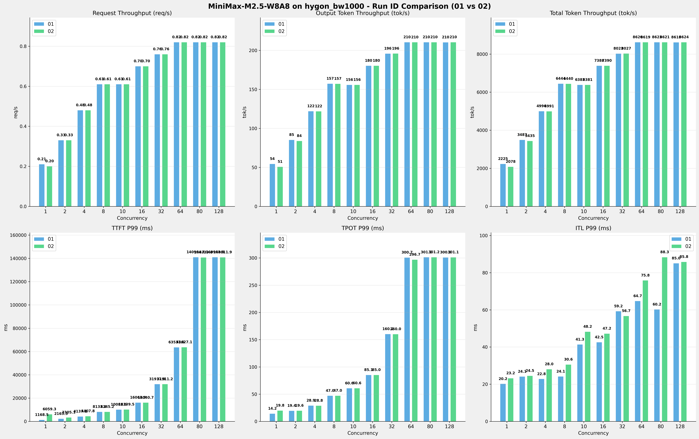

# MiniMax-M2.5-W8A8模型在hygon_bw1000上多次运行结果对比报告

**测试日期：** 2026-05-18

**对比RUN-ID：** 01 vs 02

---

## 测试场景
对比同一芯片、同一测试套件下,同一模型优化前后测试结果比对，分析性能差异。

**测试模型**  
第1轮测试（RUN-01）: MiniMax-M2.5-W8A8  第2轮测试（RUN-02）: MiniMax-M2.5-W8A8  

## 🤖 芯片和模型配置信息

| 参数名称                    | hygon_bw1000 |
|------------------------|-------------|
| **model_name** | MiniMax-M2.5-W8A8 |
| **quantization_config** | int-8 |
| **model_size** | 215G |
| **max_position_embeddings** | 196608 |
| **temperature** | N/A |
| **top_k** | N/A |
| **top_p** | N/A |
| **transformers_version** | 4.57.6 |
| **vllm_version** | 0.15.1+das.opt1.alpha.dtk2604 |
| **python_version** | 3.10.12 |

---

## ⚙️ vLLM启动配置信息

| 参数名称                    | hygon_bw1000 |
|------------------------|-------------|
| **Model Name** | MiniMax-M2.5-W8A8 |
| **Max Model Len** | 196608 |
| **Max Num Seqs** | 64 |
| **Max Num Batched Tokens** | default |
| **Gpu Memory Utilization** | 0.9 |
| **Dtype** | bfloat16 |
| **Block Size** | default |
| **Dp** | 1 |
| **Tp** | 8 |
| **Pp** | 1 |
| **Enable Export Parallel** | True |
| **Enable Auto Tool Choice** | True |
| **Tool Call Parser** | minimax_m2 |
| **Reasoning Parser** | minimax_m2 (不生效) |
| **Compilation Config** | N/A |

---

## 📊 测试概览

| 项目            | 配置                                    | 备注  |
|---------------|---------------------------------------|-----|
| **测试套件**     | test_01                           |     |
| **数据集**       | random                                |     |
| **并发数**       | [1, 2, 4, 8, 10, 16, 32, 64, 80, 128] |     |
| **总请求数**      | [320]                                 |     |
| **请求输入上下文长度** | [10240]                               |     |
| **请求输出上下文长度** | [256]                               |     |
| **模型**        | MiniMax-M2.5-W8A8                          |     |
| **被测芯片**      | hygon_bw1000                          |     |
| **测试场景**      | 单I/O测试                          |     |

**主要采集指标**：

| 指标                  | 单位         | 含义                                 |
|---------------------|------------|------------------------------------|
| TTFT                | ms         | Time To First Token，首 token 延迟     |
| TPOT                | ms/token   | Time Per Output Token，每 token 生成时间 |
| Throughput          | tokens/s   | 系统总吞吐                              |
| QPS                 | requests/s | 请求吞吐                               |
| P50/P95/P99 Latency | ms         | 延迟分位数                              |

---

## 📊 RUN-ID对比柱状图

---

## 各并发级别详细对比

### 并发级别: 1

#### 服务基准结果

| 指标                       | RUN-01  | RUN-02  | 差异      | 百分比   |
|--------------------------|---------|---------|---------|-------|
| 成功请求数                    | 320     | 320     | 0.00    | 0.0%  |
| 失败请求数                    | 0       | 0       | 0.00    | 0.0%  |
| 测试持续时间 (s)               | 1509.26 | 1616.10 | +106.84 | +7.1% |
| 总输入 tokens               | 3276800 | 3276800 | 0.00    | 0.0%  |
| 总生成 tokens               | 81920   | 81920   | 0.00    | 0.0%  |
| 峰值并发请求数                  | 2.00    | 2.00    | 0.00    | 0.0%  |
| **请求吞吐量 (req/s)**        | 0.21    | 0.20    | -0.01   | -4.8% |
| **输出 token 吞吐量 (tok/s)** | 54.28   | 50.69   | -3.59   | -6.6% |
| 峰值输出 token 吞吐量 (tok/s)   | 72.00   | 73.00   | +1.00   | +1.4% |
| **总 token 吞吐量 (tok/s)**  | 2225.40 | 2078.29 | -147.11 | -6.6% |

#### 首Token延迟 (TTFT)

| 指标            | RUN-01  | RUN-02  | 差异       | 百分比     |
|---------------|---------|---------|----------|---------|
| 平均 TTFT (ms)  | 1112.21 | 1399.35 | +287.14  | +25.8%  |
| 中位 TTFT (ms)  | 1111.97 | 1118.54 | +6.57    | +0.6%   |
| P95 TTFT (ms) | 1127.95 | 3085.38 | +1957.43 | +173.5% |
| P99 TTFT (ms) | 1168.49 | 6059.30 | +4890.81 | +418.6% |

#### 每Token生成时间 (TPOT)

| 指标            | RUN-01 | RUN-02 | 差异    | 百分比    |
|---------------|--------|--------|-------|--------|
| 平均 TPOT (ms)  | 14.13  | 14.32  | +0.19 | +1.3%  |
| 中位 TPOT (ms)  | 14.13  | 14.19  | +0.06 | +0.4%  |
| P95 TPOT (ms) | 14.15  | 14.22  | +0.07 | +0.5%  |
| P99 TPOT (ms) | 14.16  | 19.77  | +5.61 | +39.6% |

#### Token间延迟 (ITL)

| 指标           | RUN-01 | RUN-02 | 差异    | 百分比    |
|--------------|--------|--------|-------|--------|
| 平均 ITL (ms)  | 14.14  | 14.44  | +0.30 | +2.1%  |
| 中位 ITL (ms)  | 14.13  | 14.18  | +0.05 | +0.4%  |
| P95 ITL (ms) | 14.47  | 16.07  | +1.60 | +11.1% |
| P99 ITL (ms) | 20.17  | 23.18  | +3.01 | +14.9% |

### 并发级别: 2

#### 服务基准结果

| 指标                       | RUN-01  | RUN-02  | 差异     | 百分比   |
|--------------------------|---------|---------|--------|-------|
| 成功请求数                    | 320     | 320     | 0.00   | 0.0%  |
| 失败请求数                    | 0       | 0       | 0.00   | 0.0%  |
| 测试持续时间 (s)               | 963.16  | 977.81  | +14.65 | +1.5% |
| 总输入 tokens               | 3276800 | 3276800 | 0.00   | 0.0%  |
| 总生成 tokens               | 81920   | 81920   | 0.00   | 0.0%  |
| 峰值并发请求数                  | 4.00    | 4.00    | 0.00   | 0.0%  |
| **请求吞吐量 (req/s)**        | 0.33    | 0.33    | 0.00   | 0.0%  |
| **输出 token 吞吐量 (tok/s)** | 85.05   | 83.78   | -1.27  | -1.5% |
| 峰值输出 token 吞吐量 (tok/s)   | 136.00  | 136.00  | 0.00   | 0.0%  |
| **总 token 吞吐量 (tok/s)**  | 3487.19 | 3434.93 | -52.26 | -1.5% |

#### 首Token延迟 (TTFT)

| 指标 | RUN-01 | RUN-02 | 差异 | 百分比 |
|------|----------|---------|---------|---------|
| 平均 TTFT (ms) | 1623.93 | 1689.08 | +65.15 | +4.0% |
| 中位 TTFT (ms) | 1153.37 | 2109.04 | +955.67 | +82.9% |
| P95 TTFT (ms) | 2156.14 | 2157.93 | +1.79 | +0.1% |
| P99 TTFT (ms) | 2165.32 | 3305.13 | +1139.81 | +52.6% |

#### 每Token生成时间 (TPOT)

| 指标 | RUN-01 | RUN-02 | 差异 | 百分比 |
|------|----------|---------|---------|---------|
| 平均 TPOT (ms) | 17.24 | 17.34 | +0.10 | +0.6% |
| 中位 TPOT (ms) | 17.15 | 16.85 | -0.30 | -1.7% |
| P95 TPOT (ms) | 19.37 | 19.49 | +0.12 | +0.6% |
| P99 TPOT (ms) | 19.41 | 19.59 | +0.18 | +0.9% |

#### Token间延迟 (ITL)

| 指标 | RUN-01 | RUN-02 | 差异 | 百分比 |
|------|----------|---------|---------|---------|
| 平均 ITL (ms) | 17.23 | 17.62 | +0.39 | +2.3% |
| 中位 ITL (ms) | 15.20 | 15.31 | +0.11 | +0.7% |
| P95 ITL (ms) | 16.13 | 17.00 | +0.87 | +5.4% |
| P99 ITL (ms) | 24.07 | 24.49 | +0.42 | +1.7% |

### 并发级别: 4

#### 服务基准结果

| 指标 | RUN-01 | RUN-02 | 差异 | 百分比 |
|------|----------|---------|---------|---------|
| 成功请求数 | 320 | 320 | 0.00 | 0.0% |
| 失败请求数 | 0 | 0 | 0.00 | 0.0% |
| 测试持续时间 (s) | 672.34 | 673.00 | +0.66 | +0.1% |
| 总输入 tokens | 3276800 | 3276800 | 0.00 | 0.0% |
| 总生成 tokens | 81920 | 81920 | 0.00 | 0.0% |
| 峰值并发请求数 | 8.00 | 8.00 | 0.00 | 0.0% |
| **请求吞吐量 (req/s)** | 0.48 | 0.48 | 0.00 | 0.0% |
| **输出 token 吞吐量 (tok/s)** | 121.84 | 121.72 | -0.12 | -0.1% |
| 峰值输出 token 吞吐量 (tok/s) | 247.00 | 244.00 | -3.00 | -1.2% |
| **总 token 吞吐量 (tok/s)** | 4995.56 | 4990.68 | -4.88 | -0.1% |

#### 首Token延迟 (TTFT)

| 指标 | RUN-01 | RUN-02 | 差异 | 百分比 |
|------|----------|---------|---------|---------|
| 平均 TTFT (ms) | 3351.54 | 3042.57 | -308.97 | -9.2% |
| 中位 TTFT (ms) | 4115.92 | 3109.96 | -1005.96 | -24.4% |
| P95 TTFT (ms) | 4129.04 | 4132.83 | +3.79 | +0.1% |
| P99 TTFT (ms) | 4137.09 | 4407.83 | +270.74 | +6.5% |

#### 每Token生成时间 (TPOT)

| 指标 | RUN-01 | RUN-02 | 差异 | 百分比 |
|------|----------|---------|---------|---------|
| 平均 TPOT (ms) | 19.81 | 21.05 | +1.24 | +6.3% |
| 中位 TPOT (ms) | 16.93 | 20.74 | +3.81 | +22.5% |
| P95 TPOT (ms) | 28.78 | 28.59 | -0.19 | -0.7% |
| P99 TPOT (ms) | 28.88 | 28.75 | -0.13 | -0.5% |

#### Token间延迟 (ITL)

| 指标 | RUN-01 | RUN-02 | 差异 | 百分比 |
|------|----------|---------|---------|---------|
| 平均 ITL (ms) | 19.76 | 21.30 | +1.54 | +7.8% |
| 中位 ITL (ms) | 16.86 | 16.72 | -0.14 | -0.8% |
| P95 ITL (ms) | 17.85 | 18.77 | +0.92 | +5.2% |
| P99 ITL (ms) | 22.80 | 28.03 | +5.23 | +22.9% |

### 并发级别: 8

#### 服务基准结果

| 指标 | RUN-01 | RUN-02 | 差异 | 百分比 |
|------|----------|---------|---------|---------|
| 成功请求数 | 320 | 320 | 0.00 | 0.0% |
| 失败请求数 | 0 | 0 | 0.00 | 0.0% |
| 测试持续时间 (s) | 521.20 | 521.50 | +0.30 | +0.1% |
| 总输入 tokens | 3276800 | 3276800 | 0.00 | 0.0% |
| 总生成 tokens | 81920 | 81920 | 0.00 | 0.0% |
| 峰值并发请求数 | 16.00 | 16.00 | 0.00 | 0.0% |
| **请求吞吐量 (req/s)** | 0.61 | 0.61 | 0.00 | 0.0% |
| **输出 token 吞吐量 (tok/s)** | 157.18 | 157.08 | -0.10 | -0.1% |
| 峰值输出 token 吞吐量 (tok/s) | 424.00 | 432.00 | +8.00 | +1.9% |
| **总 token 吞吐量 (tok/s)** | 6444.25 | 6440.47 | -3.78 | -0.1% |

#### 首Token延迟 (TTFT)

| 指标 | RUN-01 | RUN-02 | 差异 | 百分比 |
|------|----------|---------|---------|---------|
| 平均 TTFT (ms) | 7190.37 | 7193.59 | +3.22 | +0.0% |
| 中位 TTFT (ms) | 8083.99 | 8082.67 | -1.32 | -0.0% |
| P95 TTFT (ms) | 8094.81 | 8110.99 | +16.18 | +0.2% |
| P99 TTFT (ms) | 8133.44 | 8145.19 | +11.75 | +0.1% |

#### 每Token生成时间 (TPOT)

| 指标 | RUN-01 | RUN-02 | 差异 | 百分比 |
|------|----------|---------|---------|---------|
| 平均 TPOT (ms) | 22.89 | 22.91 | +0.02 | +0.1% |
| 中位 TPOT (ms) | 19.52 | 19.50 | -0.02 | -0.1% |
| P95 TPOT (ms) | 46.86 | 46.83 | -0.03 | -0.1% |
| P99 TPOT (ms) | 46.97 | 47.00 | +0.03 | +0.1% |

#### Token间延迟 (ITL)

| 指标 | RUN-01 | RUN-02 | 差异 | 百分比 |
|------|----------|---------|---------|---------|
| 平均 ITL (ms) | 22.82 | 22.91 | +0.09 | +0.4% |
| 中位 ITL (ms) | 19.56 | 19.56 | 0.00 | 0.0% |
| P95 ITL (ms) | 20.53 | 21.21 | +0.68 | +3.3% |
| P99 ITL (ms) | 24.15 | 30.55 | +6.40 | +26.5% |

### 并发级别: 10

#### 服务基准结果

| 指标 | RUN-01 | RUN-02 | 差异 | 百分比 |
|------|----------|---------|---------|---------|
| 成功请求数 | 320 | 320 | 0.00 | 0.0% |
| 失败请求数 | 0 | 0 | 0.00 | 0.0% |
| 测试持续时间 (s) | 526.27 | 526.37 | +0.10 | +0.0% |
| 总输入 tokens | 3276800 | 3276800 | 0.00 | 0.0% |
| 总生成 tokens | 81920 | 81920 | 0.00 | 0.0% |
| 峰值并发请求数 | 20.00 | 20.00 | 0.00 | 0.0% |
| **请求吞吐量 (req/s)** | 0.61 | 0.61 | 0.00 | 0.0% |
| **输出 token 吞吐量 (tok/s)** | 155.66 | 155.63 | -0.03 | -0.0% |
| 峰值输出 token 吞吐量 (tok/s) | 420.00 | 429.00 | +9.00 | +2.1% |
| **总 token 吞吐量 (tok/s)** | 6382.12 | 6380.86 | -1.26 | -0.0% |

#### 首Token延迟 (TTFT)

| 指标 | RUN-01 | RUN-02 | 差异 | 百分比 |
|------|----------|---------|---------|---------|
| 平均 TTFT (ms) | 9132.16 | 9160.58 | +28.42 | +0.3% |
| 中位 TTFT (ms) | 10065.22 | 10069.62 | +4.40 | +0.0% |
| P95 TTFT (ms) | 10076.09 | 10111.02 | +34.93 | +0.3% |
| P99 TTFT (ms) | 10081.63 | 10139.53 | +57.90 | +0.6% |

#### 每Token生成时间 (TPOT)

| 指标 | RUN-01 | RUN-02 | 差异 | 百分比 |
|------|----------|---------|---------|---------|
| 平均 TPOT (ms) | 28.67 | 28.58 | -0.09 | -0.3% |
| 中位 TPOT (ms) | 25.19 | 25.13 | -0.06 | -0.2% |
| P95 TPOT (ms) | 60.21 | 60.14 | -0.07 | -0.1% |
| P99 TPOT (ms) | 60.61 | 60.64 | +0.03 | +0.0% |

#### Token间延迟 (ITL)

| 指标 | RUN-01 | RUN-02 | 差异 | 百分比 |
|------|----------|---------|---------|---------|
| 平均 ITL (ms) | 28.65 | 28.55 | -0.10 | -0.3% |
| 中位 ITL (ms) | 25.20 | 25.12 | -0.08 | -0.3% |
| P95 ITL (ms) | 26.22 | 30.21 | +3.99 | +15.2% |
| P99 ITL (ms) | 41.33 | 48.23 | +6.90 | +16.7% |

### 并发级别: 16

#### 服务基准结果

| 指标 | RUN-01 | RUN-02 | 差异 | 百分比 |
|------|----------|---------|---------|---------|
| 成功请求数 | 320 | 320 | 0.00 | 0.0% |
| 失败请求数 | 0 | 0 | 0.00 | 0.0% |
| 测试持续时间 (s) | 454.63 | 454.51 | -0.12 | -0.0% |
| 总输入 tokens | 3276800 | 3276800 | 0.00 | 0.0% |
| 总生成 tokens | 81920 | 81920 | 0.00 | 0.0% |
| 峰值并发请求数 | 32.00 | 32.00 | 0.00 | 0.0% |
| **请求吞吐量 (req/s)** | 0.70 | 0.70 | 0.00 | 0.0% |
| **输出 token 吞吐量 (tok/s)** | 180.19 | 180.24 | +0.05 | +0.0% |
| 峰值输出 token 吞吐量 (tok/s) | 656.00 | 640.00 | -16.00 | -2.4% |
| **总 token 吞吐量 (tok/s)** | 7387.79 | 7389.73 | +1.94 | +0.0% |

#### 首Token延迟 (TTFT)

| 指标            | RUN-01   | RUN-02   | 差异     | 百分比   |
|---------------|----------|----------|--------|-------|
| 平均 TTFT (ms)  | 15052.83 | 15004.90 | -47.93 | -0.3% |
| 中位 TTFT (ms)  | 16028.53 | 16017.67 | -10.86 | -0.1% |
| P95 TTFT (ms) | 16056.37 | 16037.12 | -19.25 | -0.1% |
| P99 TTFT (ms) | 16063.93 | 16040.73 | -23.20 | -0.1% |

#### 每Token生成时间 (TPOT)

| 指标 | RUN-01 | RUN-02 | 差异 | 百分比 |
|------|----------|---------|---------|---------|
| 平均 TPOT (ms) | 30.10 | 30.27 | +0.17 | +0.6% |
| 中位 TPOT (ms) | 26.43 | 26.44 | +0.01 | +0.0% |
| P95 TPOT (ms) | 84.67 | 84.67 | 0.00 | 0.0% |
| P99 TPOT (ms) | 85.10 | 85.03 | -0.07 | -0.1% |

#### Token间延迟 (ITL)

| 指标 | RUN-01 | RUN-02 | 差异 | 百分比 |
|------|----------|---------|---------|---------|
| 平均 ITL (ms) | 30.01 | 30.24 | +0.23 | +0.8% |
| 中位 ITL (ms) | 26.59 | 26.58 | -0.01 | -0.0% |
| P95 ITL (ms) | 30.25 | 32.13 | +1.88 | +6.2% |
| P99 ITL (ms) | 42.55 | 47.17 | +4.62 | +10.9% |

### 并发级别: 32

#### 服务基准结果

| 指标 | RUN-01 | RUN-02 | 差异 | 百分比 |
|------|----------|---------|---------|---------|
| 成功请求数 | 320 | 320 | 0.00 | 0.0% |
| 失败请求数 | 0 | 0 | 0.00 | 0.0% |
| 测试持续时间 (s) | 418.62 | 418.41 | -0.21 | -0.1% |
| 总输入 tokens | 3276800 | 3276800 | 0.00 | 0.0% |
| 总生成 tokens | 81920 | 81920 | 0.00 | 0.0% |
| 峰值并发请求数 | 64.00 | 64.00 | 0.00 | 0.0% |
| **请求吞吐量 (req/s)** | 0.76 | 0.76 | 0.00 | 0.0% |
| **输出 token 吞吐量 (tok/s)** | 195.69 | 195.79 | +0.10 | +0.1% |
| 峰值输出 token 吞吐量 (tok/s) | 864.00 | 896.00 | +32.00 | +3.7% |
| **总 token 吞吐量 (tok/s)** | 8023.25 | 8027.43 | +4.18 | +0.1% |

#### 首Token延迟 (TTFT)

| 指标 | RUN-01 | RUN-02 | 差异 | 百分比 |
|------|----------|---------|---------|---------|
| 平均 TTFT (ms) | 30731.82 | 30804.99 | +73.17 | +0.2% |
| 中位 TTFT (ms) | 31855.15 | 31839.56 | -15.59 | -0.0% |
| P95 TTFT (ms) | 31914.75 | 31905.06 | -9.69 | -0.0% |
| P99 TTFT (ms) | 31917.86 | 31911.16 | -6.70 | -0.0% |

#### 每Token生成时间 (TPOT)

| 指标 | RUN-01 | RUN-02 | 差异 | 百分比 |
|------|----------|---------|---------|---------|
| 平均 TPOT (ms) | 43.62 | 43.25 | -0.37 | -0.8% |
| 中位 TPOT (ms) | 39.56 | 39.39 | -0.17 | -0.4% |
| P95 TPOT (ms) | 39.90 | 40.01 | +0.11 | +0.3% |
| P99 TPOT (ms) | 160.15 | 160.02 | -0.13 | -0.1% |

#### Token间延迟 (ITL)

| 指标 | RUN-01 | RUN-02 | 差异 | 百分比 |
|------|----------|---------|---------|---------|
| 平均 ITL (ms) | 43.45 | 43.10 | -0.35 | -0.8% |
| 中位 ITL (ms) | 39.75 | 39.84 | +0.09 | +0.2% |
| P95 ITL (ms) | 48.15 | 45.80 | -2.35 | -4.9% |
| P99 ITL (ms) | 59.25 | 56.67 | -2.58 | -4.4% |

### 并发级别: 64

#### 服务基准结果

| 指标 | RUN-01 | RUN-02 | 差异 | 百分比 |
|------|----------|---------|---------|---------|
| 成功请求数 | 320 | 320 | 0.00 | 0.0% |
| 失败请求数 | 0 | 0 | 0.00 | 0.0% |
| 测试持续时间 (s) | 389.63 | 389.69 | +0.06 | +0.0% |
| 总输入 tokens | 3276800 | 3276800 | 0.00 | 0.0% |
| 总生成 tokens | 81920 | 81920 | 0.00 | 0.0% |
| 峰值并发请求数 | 128.00 | 128.00 | 0.00 | 0.0% |
| **请求吞吐量 (req/s)** | 0.82 | 0.82 | 0.00 | 0.0% |
| **输出 token 吞吐量 (tok/s)** | 210.25 | 210.22 | -0.03 | -0.0% |
| 峰值输出 token 吞吐量 (tok/s) | 1279.00 | 1279.00 | 0.00 | 0.0% |
| **总 token 吞吐量 (tok/s)** | 8620.30 | 8619.00 | -1.30 | -0.0% |

#### 首Token延迟 (TTFT)

| 指标 | RUN-01 | RUN-02 | 差异 | 百分比 |
|------|----------|---------|---------|---------|
| 平均 TTFT (ms) | 62196.04 | 62371.11 | +175.07 | +0.3% |
| 中位 TTFT (ms) | 63499.67 | 63469.29 | -30.38 | -0.0% |
| P95 TTFT (ms) | 63528.23 | 63616.42 | +88.19 | +0.1% |
| P99 TTFT (ms) | 63531.55 | 63627.13 | +95.58 | +0.2% |

#### 每Token生成时间 (TPOT)

| 指标 | RUN-01 | RUN-02 | 差异 | 百分比 |
|------|----------|---------|---------|---------|
| 平均 TPOT (ms) | 61.63 | 60.99 | -0.64 | -1.0% |
| 中位 TPOT (ms) | 57.08 | 57.26 | +0.18 | +0.3% |
| P95 TPOT (ms) | 57.35 | 57.49 | +0.14 | +0.2% |
| P99 TPOT (ms) | 300.74 | 296.70 | -4.04 | -1.3% |

#### Token间延迟 (ITL)

| 指标 | RUN-01 | RUN-02 | 差异 | 百分比 |
|------|----------|---------|---------|---------|
| 平均 ITL (ms) | 61.39 | 60.75 | -0.64 | -1.0% |
| 中位 ITL (ms) | 57.35 | 57.41 | +0.06 | +0.1% |
| P95 ITL (ms) | 59.07 | 62.06 | +2.99 | +5.1% |
| P99 ITL (ms) | 64.72 | 75.79 | +11.07 | +17.1% |

### 并发级别: 80

#### 服务基准结果

| 指标 | RUN-01 | RUN-02 | 差异 | 百分比 |
|------|----------|---------|---------|---------|
| 成功请求数 | 320 | 320 | 0.00 | 0.0% |
| 失败请求数 | 0 | 0 | 0.00 | 0.0% |
| 测试持续时间 (s) | 389.49 | 389.59 | +0.10 | +0.0% |
| 总输入 tokens | 3276800 | 3276800 | 0.00 | 0.0% |
| 总生成 tokens | 81920 | 81920 | 0.00 | 0.0% |
| 峰值并发请求数 | 143.00 | 143.00 | 0.00 | 0.0% |
| **请求吞吐量 (req/s)** | 0.82 | 0.82 | 0.00 | 0.0% |
| **输出 token 吞吐量 (tok/s)** | 210.32 | 210.27 | -0.05 | -0.0% |
| 峰值输出 token 吞吐量 (tok/s) | 1263.00 | 1216.00 | -47.00 | -3.7% |
| **总 token 吞吐量 (tok/s)** | 8623.30 | 8621.21 | -2.09 | -0.0% |

#### 首Token延迟 (TTFT)

| 指标 | RUN-01 | RUN-02 | 差异 | 百分比 |
|------|----------|---------|---------|---------|
| 平均 TTFT (ms) | 77178.96 | 77135.00 | -43.96 | -0.1% |
| 中位 TTFT (ms) | 62548.05 | 62416.47 | -131.58 | -0.2% |
| P95 TTFT (ms) | 140523.49 | 140491.14 | -32.35 | -0.0% |
| P99 TTFT (ms) | 140904.11 | 140739.82 | -164.29 | -0.1% |

#### 每Token生成时间 (TPOT)

| 指标 | RUN-01 | RUN-02 | 差异 | 百分比 |
|------|----------|---------|---------|---------|
| 平均 TPOT (ms) | 64.04 | 64.29 | +0.25 | +0.4% |
| 中位 TPOT (ms) | 61.00 | 61.30 | +0.30 | +0.5% |
| P95 TPOT (ms) | 61.24 | 61.49 | +0.25 | +0.4% |
| P99 TPOT (ms) | 301.17 | 301.23 | +0.06 | +0.0% |

#### Token间延迟 (ITL)

| 指标 | RUN-01 | RUN-02 | 差异 | 百分比 |
|------|----------|---------|---------|---------|
| 平均 ITL (ms) | 63.79 | 64.14 | +0.35 | +0.5% |
| 中位 ITL (ms) | 57.15 | 57.24 | +0.09 | +0.2% |
| P95 ITL (ms) | 58.28 | 75.78 | +17.50 | +30.0% |
| P99 ITL (ms) | 60.21 | 88.27 | +28.06 | +46.6% |

### 并发级别: 128

#### 服务基准结果

| 指标 | RUN-01 | RUN-02 | 差异 | 百分比 |
|------|----------|---------|---------|---------|
| 成功请求数 | 320 | 320 | 0.00 | 0.0% |
| 失败请求数 | 0 | 0 | 0.00 | 0.0% |
| 测试持续时间 (s) | 389.72 | 389.47 | -0.25 | -0.1% |
| 总输入 tokens | 3276800 | 3276800 | 0.00 | 0.0% |
| 总生成 tokens | 81920 | 81920 | 0.00 | 0.0% |
| 峰值并发请求数 | 191.00 | 191.00 | 0.00 | 0.0% |
| **请求吞吐量 (req/s)** | 0.82 | 0.82 | 0.00 | 0.0% |
| **输出 token 吞吐量 (tok/s)** | 210.20 | 210.34 | +0.14 | +0.1% |
| 峰值输出 token 吞吐量 (tok/s) | 1279.00 | 1216.00 | -63.00 | -4.9% |
| **总 token 吞吐量 (tok/s)** | 8618.28 | 8623.79 | +5.51 | +0.1% |

#### 首Token延迟 (TTFT)

| 指标 | RUN-01 | RUN-02 | 差异 | 百分比 |
|------|----------|---------|---------|---------|
| 平均 TTFT (ms) | 124081.37 | 124022.36 | -59.01 | -0.0% |
| 中位 TTFT (ms) | 140502.36 | 140427.90 | -74.46 | -0.1% |
| P95 TTFT (ms) | 140895.64 | 140802.39 | -93.25 | -0.1% |
| P99 TTFT (ms) | 140903.29 | 140811.86 | -91.43 | -0.1% |

#### 每Token生成时间 (TPOT)

| 指标 | RUN-01 | RUN-02 | 差异 | 百分比 |
|------|----------|---------|---------|---------|
| 平均 TPOT (ms) | 64.17 | 64.09 | -0.08 | -0.1% |
| 中位 TPOT (ms) | 61.13 | 61.02 | -0.11 | -0.2% |
| P95 TPOT (ms) | 61.49 | 61.52 | +0.03 | +0.0% |
| P99 TPOT (ms) | 300.89 | 301.11 | +0.22 | +0.1% |

#### Token间延迟 (ITL)

| 指标 | RUN-01 | RUN-02 | 差异 | 百分比 |
|------|----------|---------|---------|---------|
| 平均 ITL (ms) | 63.92 | 63.89 | -0.03 | -0.0% |
| 中位 ITL (ms) | 57.36 | 57.18 | -0.18 | -0.3% |
| P95 ITL (ms) | 61.86 | 64.73 | +2.87 | +4.6% |
| P99 ITL (ms) | 85.02 | 85.76 | +0.74 | +0.9% |

---

## 📝 分析总结

### 吞吐量对比

**请求吞吐量**: RUN-02 相比 RUN-01 平均变化 **-0.5%**

**输出Token吞吐量**: RUN-02 相比 RUN-01 平均变化 **-0.8%**

**总Token吞吐量**: RUN-02 相比 RUN-01 平均变化 **-0.8%**

### 延迟对比

**TTFT P99**: RUN-02 相比 RUN-01 平均增加 **47.8%** (延迟增加)

**TPOT P99**: RUN-02 相比 RUN-01 平均增加 **3.9%** (延迟增加)

**ITL P99**: RUN-02 相比 RUN-01 平均增加 **15.4%** (延迟增加)

---

*报告生成时间: 2026-05-18*

