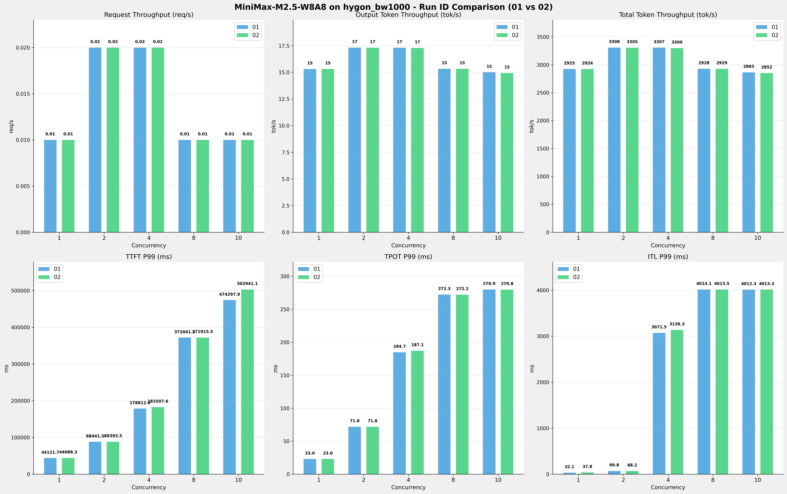

# MiniMax-M2.5-W8A8模型在hygon_bw1000上多次运行结果对比报告

**测试日期：** 2026-05-18

**对比RUN-ID：** 01 vs 02

---

## 测试场景
对比同一芯片、同一测试套件下,同一模型优化前后测试结果比对，分析性能差异。

**测试模型**  
第1轮测试（RUN-01）: MiniMax-M2.5-W8A8  第2轮测试（RUN-02）: MiniMax-M2.5-W8A8  

## 🤖 芯片和模型配置信息

| 参数名称                    | hygon_bw1000 |
|------------------------|-------------|
| **model_name** | MiniMax-M2.5-W8A8 |
| **quantization_config** | int-8 |
| **model_size** | 215G |
| **max_position_embeddings** | 196608 |
| **temperature** | N/A |
| **top_k** | N/A |
| **top_p** | N/A |
| **transformers_version** | 4.57.6 |
| **vllm_version** | 0.15.1+das.opt1.alpha.dtk2604 |
| **python_version** | 3.10.12 |

---

## ⚙️ vLLM启动配置信息

| 参数名称                    | hygon_bw1000 |
|------------------------|-------------|
| **Model Name** | MiniMax-M2.5-W8A8 |
| **Max Model Len** | 196608 |
| **Max Num Seqs** | 64 |
| **Max Num Batched Tokens** | default |
| **Gpu Memory Utilization** | 0.9 |
| **Dtype** | bfloat16 |
| **Block Size** | default |
| **Dp** | 1 |
| **Tp** | 8 |
| **Pp** | 1 |
| **Enable Export Parallel** | True |
| **Enable Auto Tool Choice** | True |
| **Tool Call Parser** | minimax_m2 |
| **Reasoning Parser** | minimax_m2 (不生效) |
| **Compilation Config** | N/A |

---

## 📊 测试概览

| 项目            | 配置                                    | 备注  |
|---------------|---------------------------------------|-----|
| **测试套件**     | test_02                           |     |
| **数据集**       | random                                |     |
| **并发数**       | [1, 2, 4, 8, 10] |     |
| **总请求数**      | [100]                                 |     |
| **请求输入上下文长度** | [194560]                               |     |
| **请求输出上下文长度** | [1024]                               |     |
| **模型**        | MiniMax-M2.5-W8A8                          |     |
| **被测芯片**      | hygon_bw1000                          |     |
| **测试场景**      | 单I/O测试                          |     |

**主要采集指标**：

| 指标                  | 单位         | 含义                                 |
|---------------------|------------|------------------------------------|
| TTFT                | ms         | Time To First Token，首 token 延迟     |
| TPOT                | ms/token   | Time Per Output Token，每 token 生成时间 |
| Throughput          | tokens/s   | 系统总吞吐                              |
| QPS                 | requests/s | 请求吞吐                               |
| P50/P95/P99 Latency | ms         | 延迟分位数                              |

---

## 📊 RUN-ID对比柱状图

---

## 各并发级别详细对比

### 并发级别: 1

#### 服务基准结果

| 指标 | RUN-01 | RUN-02 | 差异 | 百分比 |
|------|----------|---------|---------|---------|
| 成功请求数 | 100 | 100 | 0.00 | 0.0% |
| 失败请求数 | 0 | 0 | 0.00 | 0.0% |
| 测试持续时间 (s) | 6687.21 | 6689.43 | +2.22 | +0.0% |
| 总输入 tokens | 19456000 | 19456000 | 0.00 | 0.0% |
| 总生成 tokens | 102400 | 102400 | 0.00 | 0.0% |
| 峰值并发请求数 | 2.00 | 2.00 | 0.00 | 0.0% |
| **请求吞吐量 (req/s)** | 0.01 | 0.01 | 0.00 | 0.0% |
| **输出 token 吞吐量 (tok/s)** | 15.31 | 15.31 | 0.00 | 0.0% |
| 峰值输出 token 吞吐量 (tok/s) | 47.00 | 47.00 | 0.00 | 0.0% |
| **总 token 吞吐量 (tok/s)** | 2924.75 | 2923.78 | -0.97 | -0.0% |

#### 首Token延迟 (TTFT)

| 指标 | RUN-01 | RUN-02 | 差异 | 百分比 |
|------|----------|---------|---------|---------|
| 平均 TTFT (ms) | 43487.80 | 43517.44 | +29.64 | +0.1% |
| 中位 TTFT (ms) | 43910.38 | 43934.61 | +24.23 | +0.1% |
| P95 TTFT (ms) | 44091.15 | 44076.95 | -14.20 | -0.0% |
| P99 TTFT (ms) | 44121.71 | 44088.26 | -33.45 | -0.1% |

#### 每Token生成时间 (TPOT)

| 指标 | RUN-01 | RUN-02 | 差异 | 百分比 |
|------|----------|---------|---------|---------|
| 平均 TPOT (ms) | 22.86 | 22.85 | -0.01 | -0.0% |
| 中位 TPOT (ms) | 22.86 | 22.86 | 0.00 | 0.0% |
| P95 TPOT (ms) | 22.96 | 22.97 | +0.01 | +0.0% |
| P99 TPOT (ms) | 22.97 | 22.98 | +0.01 | +0.0% |

#### Token间延迟 (ITL)

| 指标 | RUN-01 | RUN-02 | 差异 | 百分比 |
|------|----------|---------|---------|---------|
| 平均 ITL (ms) | 22.88 | 22.89 | +0.01 | +0.0% |
| 中位 ITL (ms) | 22.85 | 22.85 | 0.00 | 0.0% |
| P95 ITL (ms) | 23.57 | 24.95 | +1.38 | +5.9% |
| P99 ITL (ms) | 32.12 | 37.78 | +5.66 | +17.6% |

### 并发级别: 2

#### 服务基准结果

| 指标 | RUN-01 | RUN-02 | 差异 | 百分比 |
|------|----------|---------|---------|---------|
| 成功请求数 | 100 | 100 | 0.00 | 0.0% |
| 失败请求数 | 0 | 0 | 0.00 | 0.0% |
| 测试持续时间 (s) | 5911.73 | 5916.95 | +5.22 | +0.1% |
| 总输入 tokens | 19456000 | 19456000 | 0.00 | 0.0% |
| 总生成 tokens | 102400 | 102400 | 0.00 | 0.0% |
| 峰值并发请求数 | 4.00 | 4.00 | 0.00 | 0.0% |
| **请求吞吐量 (req/s)** | 0.02 | 0.02 | 0.00 | 0.0% |
| **输出 token 吞吐量 (tok/s)** | 17.32 | 17.31 | -0.01 | -0.1% |
| 峰值输出 token 吞吐量 (tok/s) | 72.00 | 70.00 | -2.00 | -2.8% |
| **总 token 吞吐量 (tok/s)** | 3308.40 | 3305.49 | -2.91 | -0.1% |

#### 首Token延迟 (TTFT)

| 指标 | RUN-01 | RUN-02 | 差异 | 百分比 |
|------|----------|---------|---------|---------|
| 平均 TTFT (ms) | 66239.08 | 66294.86 | +55.78 | +0.1% |
| 中位 TTFT (ms) | 46228.26 | 46212.70 | -15.56 | -0.0% |
| P95 TTFT (ms) | 88317.83 | 88350.08 | +32.25 | +0.0% |
| P99 TTFT (ms) | 88441.47 | 88393.51 | -47.96 | -0.1% |

#### 每Token生成时间 (TPOT)

| 指标 | RUN-01 | RUN-02 | 差异 | 百分比 |
|------|----------|---------|---------|---------|
| 平均 TPOT (ms) | 50.82 | 50.87 | +0.05 | +0.1% |
| 中位 TPOT (ms) | 49.68 | 49.59 | -0.09 | -0.2% |
| P95 TPOT (ms) | 71.63 | 71.75 | +0.12 | +0.2% |
| P99 TPOT (ms) | 71.79 | 71.78 | -0.01 | -0.0% |

#### Token间延迟 (ITL)

| 指标 | RUN-01 | RUN-02 | 差异 | 百分比 |
|------|----------|---------|---------|---------|
| 平均 ITL (ms) | 50.85 | 50.88 | +0.03 | +0.1% |
| 中位 ITL (ms) | 30.34 | 30.39 | +0.05 | +0.2% |
| P95 ITL (ms) | 36.99 | 36.75 | -0.24 | -0.6% |
| P99 ITL (ms) | 69.78 | 68.25 | -1.53 | -2.2% |

### 并发级别: 4

#### 服务基准结果

| 指标 | RUN-01 | RUN-02 | 差异 | 百分比 |
|------|----------|---------|---------|---------|
| 成功请求数 | 100 | 100 | 0.00 | 0.0% |
| 失败请求数 | 0 | 0 | 0.00 | 0.0% |
| 测试持续时间 (s) | 5914.77 | 5927.25 | +12.48 | +0.2% |
| 总输入 tokens | 19456000 | 19456000 | 0.00 | 0.0% |
| 总生成 tokens | 102400 | 102400 | 0.00 | 0.0% |
| 峰值并发请求数 | 7.00 | 6.00 | -1.00 | -14.3% |
| **请求吞吐量 (req/s)** | 0.02 | 0.02 | 0.00 | 0.0% |
| **输出 token 吞吐量 (tok/s)** | 17.31 | 17.28 | -0.03 | -0.2% |
| 峰值输出 token 吞吐量 (tok/s) | 96.00 | 100.00 | +4.00 | +4.2% |
| **总 token 吞吐量 (tok/s)** | 3306.71 | 3299.74 | -6.97 | -0.2% |

#### 首Token延迟 (TTFT)

| 指标 | RUN-01 | RUN-02 | 差异 | 百分比 |
|------|----------|---------|---------|---------|
| 平均 TTFT (ms) | 110901.13 | 110513.99 | -387.14 | -0.3% |
| 中位 TTFT (ms) | 96467.29 | 93983.73 | -2483.56 | -2.6% |
| P95 TTFT (ms) | 174373.75 | 174489.36 | +115.61 | +0.1% |
| P99 TTFT (ms) | 178812.59 | 182507.61 | +3695.02 | +2.1% |

#### 每Token生成时间 (TPOT)

| 指标 | RUN-01 | RUN-02 | 差异 | 百分比 |
|------|----------|---------|---------|---------|
| 平均 TPOT (ms) | 122.83 | 123.70 | +0.87 | +0.7% |
| 中位 TPOT (ms) | 120.64 | 140.75 | +20.11 | +16.7% |
| P95 TPOT (ms) | 184.15 | 183.79 | -0.36 | -0.2% |
| P99 TPOT (ms) | 184.74 | 187.08 | +2.34 | +1.3% |

#### Token间延迟 (ITL)

| 指标 | RUN-01 | RUN-02 | 差异 | 百分比 |
|------|----------|---------|---------|---------|
| 平均 ITL (ms) | 122.76 | 123.69 | +0.93 | +0.8% |
| 中位 ITL (ms) | 43.16 | 42.95 | -0.21 | -0.5% |
| P95 ITL (ms) | 52.02 | 56.20 | +4.18 | +8.0% |
| P99 ITL (ms) | 3071.54 | 3136.29 | +64.75 | +2.1% |

### 并发级别: 8

#### 服务基准结果

| 指标 | RUN-01 | RUN-02 | 差异 | 百分比 |
|------|----------|---------|---------|---------|
| 成功请求数 | 100 | 100 | 0.00 | 0.0% |
| 失败请求数 | 0 | 0 | 0.00 | 0.0% |
| 测试持续时间 (s) | 6680.12 | 6678.14 | -1.98 | -0.0% |
| 总输入 tokens | 19456000 | 19456000 | 0.00 | 0.0% |
| 总生成 tokens | 102400 | 102400 | 0.00 | 0.0% |
| 峰值并发请求数 | 9.00 | 9.00 | 0.00 | 0.0% |
| **请求吞吐量 (req/s)** | 0.01 | 0.01 | 0.00 | 0.0% |
| **输出 token 吞吐量 (tok/s)** | 15.33 | 15.33 | 0.00 | 0.0% |
| 峰值输出 token 吞吐量 (tok/s) | 135.00 | 135.00 | 0.00 | 0.0% |
| **总 token 吞吐量 (tok/s)** | 2927.85 | 2928.72 | +0.87 | +0.0% |

#### 首Token延迟 (TTFT)

| 指标 | RUN-01 | RUN-02 | 差异 | 百分比 |
|------|----------|---------|---------|---------|
| 平均 TTFT (ms) | 260175.41 | 260108.83 | -66.58 | -0.0% |
| 中位 TTFT (ms) | 280403.12 | 280394.91 | -8.21 | -0.0% |
| P95 TTFT (ms) | 281593.86 | 281501.70 | -92.16 | -0.0% |
| P99 TTFT (ms) | 372041.15 | 371915.54 | -125.61 | -0.0% |

#### 每Token生成时间 (TPOT)

| 指标 | RUN-01 | RUN-02 | 差异 | 百分比 |
|------|----------|---------|---------|---------|
| 平均 TPOT (ms) | 263.40 | 263.31 | -0.09 | -0.0% |
| 中位 TPOT (ms) | 269.07 | 268.95 | -0.12 | -0.0% |
| P95 TPOT (ms) | 272.14 | 272.06 | -0.08 | -0.0% |
| P99 TPOT (ms) | 272.32 | 272.16 | -0.16 | -0.1% |

#### Token间延迟 (ITL)

| 指标 | RUN-01 | RUN-02 | 差异 | 百分比 |
|------|----------|---------|---------|---------|
| 平均 ITL (ms) | 263.23 | 263.14 | -0.09 | -0.0% |
| 中位 ITL (ms) | 38.61 | 38.57 | -0.04 | -0.1% |
| P95 ITL (ms) | 2683.84 | 2682.50 | -1.34 | -0.0% |
| P99 ITL (ms) | 4014.05 | 4013.51 | -0.54 | -0.0% |

### 并发级别: 10

#### 服务基准结果

| 指标 | RUN-01 | RUN-02 | 差异 | 百分比 |
|------|----------|---------|---------|---------|
| 成功请求数 | 100 | 100 | 0.00 | 0.0% |
| 失败请求数 | 0 | 0 | 0.00 | 0.0% |
| 测试持续时间 (s) | 6826.46 | 6858.22 | +31.76 | +0.5% |
| 总输入 tokens | 19456000 | 19456000 | 0.00 | 0.0% |
| 总生成 tokens | 102400 | 102400 | 0.00 | 0.0% |
| 峰值并发请求数 | 12.00 | 11.00 | -1.00 | -8.3% |
| **请求吞吐量 (req/s)** | 0.01 | 0.01 | 0.00 | 0.0% |
| **输出 token 吞吐量 (tok/s)** | 15.00 | 14.93 | -0.07 | -0.5% |
| 峰值输出 token 吞吐量 (tok/s) | 145.00 | 135.00 | -10.00 | -6.9% |
| **总 token 吞吐量 (tok/s)** | 2865.09 | 2851.82 | -13.27 | -0.5% |

#### 首Token延迟 (TTFT)

| 指标 | RUN-01 | RUN-02 | 差异 | 百分比 |
|------|----------|---------|---------|---------|
| 平均 TTFT (ms) | 399184.25 | 398442.70 | -741.55 | -0.2% |
| 中位 TTFT (ms) | 414031.08 | 413422.93 | -608.15 | -0.1% |
| P95 TTFT (ms) | 441820.31 | 414399.49 | -27420.82 | -6.2% |
| P99 TTFT (ms) | 474297.92 | 502941.13 | +28643.21 | +6.0% |

#### 每Token生成时间 (TPOT)

| 指标 | RUN-01 | RUN-02 | 差异 | 百分比 |
|------|----------|---------|---------|---------|
| 平均 TPOT (ms) | 266.45 | 270.29 | +3.84 | +1.4% |
| 中位 TPOT (ms) | 276.40 | 276.68 | +0.28 | +0.1% |
| P95 TPOT (ms) | 279.80 | 279.74 | -0.06 | -0.0% |
| P99 TPOT (ms) | 279.90 | 279.82 | -0.08 | -0.0% |

#### Token间延迟 (ITL)

| 指标 | RUN-01 | RUN-02 | 差异 | 百分比 |
|------|----------|---------|---------|---------|
| 平均 ITL (ms) | 266.45 | 270.16 | +3.71 | +1.4% |
| 中位 ITL (ms) | 38.64 | 38.58 | -0.06 | -0.2% |
| P95 ITL (ms) | 2679.16 | 2682.82 | +3.66 | +0.1% |
| P99 ITL (ms) | 4012.34 | 4013.32 | +0.98 | +0.0% |

---

## 📝 分析总结

### 吞吐量对比

**请求吞吐量**: RUN-02 相比 RUN-01 平均变化 **0.0%**

**输出Token吞吐量**: RUN-02 相比 RUN-01 平均变化 **-0.1%**

**总Token吞吐量**: RUN-02 相比 RUN-01 平均变化 **-0.2%**

### 延迟对比

**TTFT P99**: RUN-02 相比 RUN-01 平均增加 **1.6%** (延迟增加)

**TPOT P99**: RUN-02 相比 RUN-01 平均增加 **0.2%** (延迟增加)

**ITL P99**: RUN-02 相比 RUN-01 平均增加 **3.5%** (延迟增加)

---

*报告生成时间: 2026-05-18*

