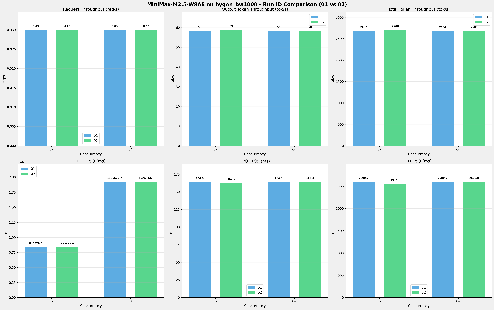

# MiniMax-M2.5-W8A8模型在hygon_bw1000上多次运行结果对比报告

**测试日期：** 2026-05-18

**对比RUN-ID：** 01 vs 02

---

## 测试场景
对比同一芯片、同一测试套件下,同一模型优化前后测试结果比对，分析性能差异。

**测试模型**  
第1轮测试（RUN-01）: MiniMax-M2.5-W8A8  第2轮测试（RUN-02）: MiniMax-M2.5-W8A8  

## 🤖 芯片和模型配置信息

| 参数名称                    | hygon_bw1000 |
|------------------------|-------------|
| **model_name** | MiniMax-M2.5-W8A8 |
| **quantization_config** | int-8 |
| **model_size** | 215G |
| **max_position_embeddings** | 196608 |
| **temperature** | N/A |
| **top_k** | N/A |
| **top_p** | N/A |
| **transformers_version** | 4.57.6 |
| **vllm_version** | 0.15.1+das.opt1.alpha.dtk2604 |
| **python_version** | 3.10.12 |

---

## ⚙️ vLLM启动配置信息

| 参数名称                    | hygon_bw1000 |
|------------------------|-------------|
| **Model Name** | MiniMax-M2.5-W8A8 |
| **Max Model Len** | 196608 |
| **Max Num Seqs** | 64 |
| **Max Num Batched Tokens** | default |
| **Gpu Memory Utilization** | 0.9 |
| **Dtype** | bfloat16 |
| **Block Size** | default |
| **Dp** | 1 |
| **Tp** | 8 |
| **Pp** | 1 |
| **Enable Export Parallel** | True |
| **Enable Auto Tool Choice** | True |
| **Tool Call Parser** | minimax_m2 |
| **Reasoning Parser** | minimax_m2 (不生效) |
| **Compilation Config** | N/A |

---

## 📊 测试概览

| 项目            | 配置                                    | 备注  |
|---------------|---------------------------------------|-----|
| **测试套件**     | test_03                           |     |
| **数据集**       | random                                |     |
| **并发数**       | [32, 64] |     |
| **总请求数**      | [1000]                                 |     |
| **请求输入上下文长度** | [90000]                               |     |
| **请求输出上下文长度** | [2000]                               |     |
| **模型**        | MiniMax-M2.5-W8A8                          |     |
| **被测芯片**      | hygon_bw1000                          |     |
| **测试场景**      | 单I/O测试                          |     |

**主要采集指标**：

| 指标                  | 单位         | 含义                                 |
|---------------------|------------|------------------------------------|
| TTFT                | ms         | Time To First Token，首 token 延迟     |
| TPOT                | ms/token   | Time Per Output Token，每 token 生成时间 |
| Throughput          | tokens/s   | 系统总吞吐                              |
| QPS                 | requests/s | 请求吞吐                               |
| P50/P95/P99 Latency | ms         | 延迟分位数                              |

---

## 📊 RUN-ID对比柱状图

---

## 各并发级别详细对比

### 并发级别: 32

#### 服务基准结果

| 指标 | RUN-01 | RUN-02 | 差异 | 百分比 |
|------|----------|---------|---------|---------|
| 成功请求数 | 1000 | 1000 | 0.00 | 0.0% |
| 失败请求数 | 0 | 0 | 0.00 | 0.0% |
| 测试持续时间 (s) | 34237.41 | 33968.26 | -269.15 | -0.8% |
| 总输入 tokens | 90000000 | 90000000 | 0.00 | 0.0% |
| 总生成 tokens | 2000000 | 2000000 | 0.00 | 0.0% |
| 峰值并发请求数 | 33.00 | 33.00 | 0.00 | 0.0% |
| **请求吞吐量 (req/s)** | 0.03 | 0.03 | 0.00 | 0.0% |
| **输出 token 吞吐量 (tok/s)** | 58.42 | 58.88 | +0.46 | +0.8% |
| 峰值输出 token 吞吐量 (tok/s) | 270.00 | 280.00 | +10.00 | +3.7% |
| **总 token 吞吐量 (tok/s)** | 2687.12 | 2708.41 | +21.29 | +0.8% |

#### 首Token延迟 (TTFT)

| 指标 | RUN-01 | RUN-02 | 差异 | 百分比 |
|------|----------|---------|---------|---------|
| 平均 TTFT (ms) | 763172.93 | 757205.36 | -5967.57 | -0.8% |
| 中位 TTFT (ms) | 758207.30 | 751670.60 | -6536.70 | -0.9% |
| P95 TTFT (ms) | 838778.34 | 833071.44 | -5706.90 | -0.7% |
| P99 TTFT (ms) | 840076.37 | 834489.39 | -5586.98 | -0.7% |

#### 每Token生成时间 (TPOT)

| 指标 | RUN-01 | RUN-02 | 差异 | 百分比 |
|------|----------|---------|---------|---------|
| 平均 TPOT (ms) | 161.97 | 160.68 | -1.29 | -0.8% |
| 中位 TPOT (ms) | 162.90 | 161.64 | -1.26 | -0.8% |
| P95 TPOT (ms) | 163.67 | 162.58 | -1.09 | -0.7% |
| P99 TPOT (ms) | 164.03 | 162.91 | -1.12 | -0.7% |

#### Token间延迟 (ITL)

| 指标 | RUN-01 | RUN-02 | 差异 | 百分比 |
|------|----------|---------|---------|---------|
| 平均 ITL (ms) | 161.96 | 160.68 | -1.28 | -0.8% |
| 中位 ITL (ms) | 41.24 | 41.19 | -0.05 | -0.1% |
| P95 ITL (ms) | 56.02 | 55.96 | -0.06 | -0.1% |
| P99 ITL (ms) | 2600.66 | 2548.09 | -52.57 | -2.0% |

### 并发级别: 64

#### 服务基准结果

| 指标 | RUN-01 | RUN-02 | 差异 | 百分比 |
|------|----------|---------|---------|---------|
| 成功请求数 | 1000 | 1000 | 0.00 | 0.0% |
| 失败请求数 | 0 | 0 | 0.00 | 0.0% |
| 测试持续时间 (s) | 34277.62 | 34264.32 | -13.30 | -0.0% |
| 总输入 tokens | 90000000 | 90000000 | 0.00 | 0.0% |
| 总生成 tokens | 2000000 | 2000000 | 0.00 | 0.0% |
| 峰值并发请求数 | 65.00 | 65.00 | 0.00 | 0.0% |
| **请求吞吐量 (req/s)** | 0.03 | 0.03 | 0.00 | 0.0% |
| **输出 token 吞吐量 (tok/s)** | 58.35 | 58.37 | +0.02 | +0.0% |
| 峰值输出 token 吞吐量 (tok/s) | 260.00 | 266.00 | +6.00 | +2.3% |
| **总 token 吞吐量 (tok/s)** | 2683.97 | 2685.01 | +1.04 | +0.0% |

#### 首Token延迟 (TTFT)

| 指标 | RUN-01 | RUN-02 | 差异 | 百分比 |
|------|----------|---------|---------|---------|
| 平均 TTFT (ms) | 1819207.46 | 1818494.99 | -712.47 | -0.0% |
| 中位 TTFT (ms) | 1843948.68 | 1843238.45 | -710.23 | -0.0% |
| P95 TTFT (ms) | 1923340.65 | 1922653.02 | -687.63 | -0.0% |
| P99 TTFT (ms) | 1925575.70 | 1924644.26 | -931.44 | -0.0% |

#### 每Token生成时间 (TPOT)

| 指标 | RUN-01 | RUN-02 | 差异 | 百分比 |
|------|----------|---------|---------|---------|
| 平均 TPOT (ms) | 162.03 | 161.96 | -0.07 | -0.0% |
| 中位 TPOT (ms) | 162.94 | 162.87 | -0.07 | -0.0% |
| P95 TPOT (ms) | 163.72 | 163.70 | -0.02 | -0.0% |
| P99 TPOT (ms) | 164.14 | 164.41 | +0.27 | +0.2% |

#### Token间延迟 (ITL)

| 指标 | RUN-01 | RUN-02 | 差异 | 百分比 |
|------|----------|---------|---------|---------|
| 平均 ITL (ms) | 162.02 | 162.01 | -0.01 | -0.0% |
| 中位 ITL (ms) | 41.29 | 41.27 | -0.02 | -0.0% |
| P95 ITL (ms) | 55.61 | 57.35 | +1.74 | +3.1% |
| P99 ITL (ms) | 2600.66 | 2600.94 | +0.28 | +0.0% |

---

## 📝 分析总结

### 吞吐量对比

**请求吞吐量**: RUN-02 相比 RUN-01 平均变化 **0.0%**

**输出Token吞吐量**: RUN-02 相比 RUN-01 平均提升 **0.4%**

**总Token吞吐量**: RUN-02 相比 RUN-01 平均提升 **0.4%**

### 延迟对比

**TTFT P99**: RUN-02 相比 RUN-01 平均改善 **0.4%** (延迟降低)

**TPOT P99**: RUN-02 相比 RUN-01 平均改善 **0.3%** (延迟降低)

**ITL P99**: RUN-02 相比 RUN-01 平均改善 **1.0%** (延迟降低)

---

*报告生成时间: 2026-05-18*

