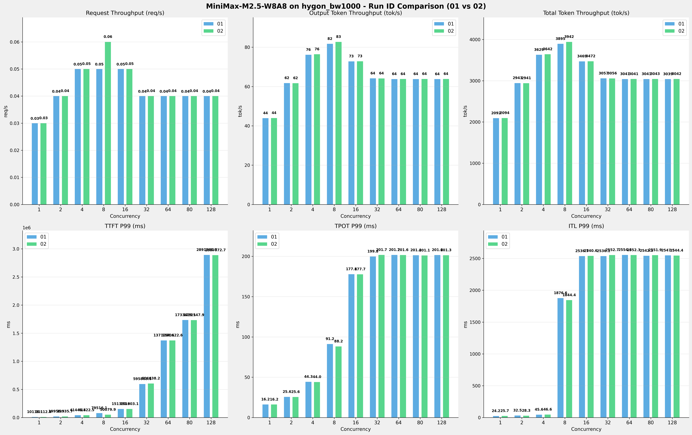

# MiniMax-M2.5-W8A8模型在hygon_bw1000上多次运行结果对比报告

**测试日期：** 2026-05-18

**对比RUN-ID：** 01 vs 02

---

## 测试场景
对比同一芯片、同一测试套件下,同一模型优化前后测试结果比对，分析性能差异。

**测试模型**  
第1轮测试（RUN-01）: MiniMax-M2.5-W8A8  第2轮测试（RUN-02）: MiniMax-M2.5-W8A8  

## 🤖 芯片和模型配置信息

| 参数名称                    | hygon_bw1000 |
|------------------------|-------------|
| **model_name** | MiniMax-M2.5-W8A8 |
| **quantization_config** | int-8 |
| **model_size** | 215G |
| **max_position_embeddings** | 196608 |
| **temperature** | N/A |
| **top_k** | N/A |
| **top_p** | N/A |
| **transformers_version** | 4.57.6 |
| **vllm_version** | 0.15.1+das.opt1.alpha.dtk2604 |
| **python_version** | 3.10.12 |

---

## ⚙️ vLLM启动配置信息

| 参数名称                    | hygon_bw1000 |
|------------------------|-------------|
| **Model Name** | MiniMax-M2.5-W8A8 |
| **Max Model Len** | 196608 |
| **Max Num Seqs** | 64 |
| **Max Num Batched Tokens** | default |
| **Gpu Memory Utilization** | 0.9 |
| **Dtype** | bfloat16 |
| **Block Size** | default |
| **Dp** | 1 |
| **Tp** | 8 |
| **Pp** | 1 |
| **Enable Export Parallel** | True |
| **Enable Auto Tool Choice** | True |
| **Tool Call Parser** | minimax_m2 |
| **Reasoning Parser** | minimax_m2 (不生效) |
| **Compilation Config** | N/A |

---

## 📊 测试概览

| 项目            | 配置                                    | 备注  |
|---------------|---------------------------------------|-----|
| **测试套件**     | test_04                           |     |
| **数据集**       | random                                |     |
| **并发数**       | [1, 2, 4, 8, 16, 32, 64, 80, 128] |     |
| **总请求数**      | [300]                                 |     |
| **请求输入上下文长度** | [70000]                               |     |
| **请求输出上下文长度** | [1500]                               |     |
| **模型**        | MiniMax-M2.5-W8A8                          |     |
| **被测芯片**      | hygon_bw1000                          |     |
| **测试场景**      | 单I/O测试                          |     |

**主要采集指标**：

| 指标                  | 单位         | 含义                                 |
|---------------------|------------|------------------------------------|
| TTFT                | ms         | Time To First Token，首 token 延迟     |
| TPOT                | ms/token   | Time Per Output Token，每 token 生成时间 |
| Throughput          | tokens/s   | 系统总吞吐                              |
| QPS                 | requests/s | 请求吞吐                               |
| P50/P95/P99 Latency | ms         | 延迟分位数                              |

---

## 📊 RUN-ID对比柱状图

---

## 各并发级别详细对比

### 并发级别: 1

#### 服务基准结果

| 指标 | RUN-01 | RUN-02 | 差异 | 百分比 |
|------|----------|---------|---------|---------|
| 成功请求数 | 300 | 300 | 0.00 | 0.0% |
| 失败请求数 | 0 | 0 | 0.00 | 0.0% |
| 测试持续时间 (s) | 10253.33 | 10241.67 | -11.66 | -0.1% |
| 总输入 tokens | 21000000 | 21000000 | 0.00 | 0.0% |
| 总生成 tokens | 450000 | 450000 | 0.00 | 0.0% |
| 峰值并发请求数 | 2.00 | 2.00 | 0.00 | 0.0% |
| **请求吞吐量 (req/s)** | 0.03 | 0.03 | 0.00 | 0.0% |
| **输出 token 吞吐量 (tok/s)** | 43.89 | 43.94 | +0.05 | +0.1% |
| 峰值输出 token 吞吐量 (tok/s) | 66.00 | 66.00 | 0.00 | 0.0% |
| **总 token 吞吐量 (tok/s)** | 2092.00 | 2094.39 | +2.39 | +0.1% |

#### 首Token延迟 (TTFT)

| 指标 | RUN-01 | RUN-02 | 差异 | 百分比 |
|------|----------|---------|---------|---------|
| 平均 TTFT (ms) | 9993.33 | 10021.30 | +27.97 | +0.3% |
| 中位 TTFT (ms) | 10014.96 | 10051.42 | +36.46 | +0.4% |
| P95 TTFT (ms) | 10107.89 | 10097.69 | -10.20 | -0.1% |
| P99 TTFT (ms) | 10118.14 | 10112.88 | -5.26 | -0.1% |

#### 每Token生成时间 (TPOT)

| 指标 | RUN-01 | RUN-02 | 差异 | 百分比 |
|------|----------|---------|---------|---------|
| 平均 TPOT (ms) | 16.13 | 16.09 | -0.04 | -0.2% |
| 中位 TPOT (ms) | 16.13 | 16.08 | -0.05 | -0.3% |
| P95 TPOT (ms) | 16.20 | 16.16 | -0.04 | -0.2% |
| P99 TPOT (ms) | 16.22 | 16.17 | -0.05 | -0.3% |

#### Token间延迟 (ITL)

| 指标 | RUN-01 | RUN-02 | 差异 | 百分比 |
|------|----------|---------|---------|---------|
| 平均 ITL (ms) | 16.18 | 16.14 | -0.04 | -0.2% |
| 中位 ITL (ms) | 16.13 | 16.08 | -0.05 | -0.3% |
| P95 ITL (ms) | 16.87 | 17.97 | +1.10 | +6.5% |
| P99 ITL (ms) | 24.24 | 25.67 | +1.43 | +5.9% |

### 并发级别: 2

#### 服务基准结果

| 指标 | RUN-01 | RUN-02 | 差异 | 百分比 |
|------|----------|---------|---------|---------|
| 成功请求数 | 300 | 300 | 0.00 | 0.0% |
| 失败请求数 | 0 | 0 | 0.00 | 0.0% |
| 测试持续时间 (s) | 7287.61 | 7293.73 | +6.12 | +0.1% |
| 总输入 tokens | 21000000 | 21000000 | 0.00 | 0.0% |
| 总生成 tokens | 450000 | 450000 | 0.00 | 0.0% |
| 峰值并发请求数 | 4.00 | 4.00 | 0.00 | 0.0% |
| **请求吞吐量 (req/s)** | 0.04 | 0.04 | 0.00 | 0.0% |
| **输出 token 吞吐量 (tok/s)** | 61.75 | 61.70 | -0.05 | -0.1% |
| 峰值输出 token 吞吐量 (tok/s) | 112.00 | 108.00 | -4.00 | -3.6% |
| **总 token 吞吐量 (tok/s)** | 2943.35 | 2940.88 | -2.47 | -0.1% |

#### 首Token延迟 (TTFT)

| 指标 | RUN-01 | RUN-02 | 差异 | 百分比 |
|------|----------|---------|---------|---------|
| 平均 TTFT (ms) | 15464.15 | 15455.90 | -8.25 | -0.1% |
| 中位 TTFT (ms) | 11251.28 | 11237.33 | -13.95 | -0.1% |
| P95 TTFT (ms) | 19940.45 | 19914.29 | -26.16 | -0.1% |
| P99 TTFT (ms) | 19956.91 | 19935.72 | -21.19 | -0.1% |

#### 每Token生成时间 (TPOT)

| 指标 | RUN-01 | RUN-02 | 差异 | 百分比 |
|------|----------|---------|---------|---------|
| 平均 TPOT (ms) | 22.09 | 22.13 | +0.04 | +0.2% |
| 中位 TPOT (ms) | 22.05 | 22.03 | -0.02 | -0.1% |
| P95 TPOT (ms) | 25.16 | 25.22 | +0.06 | +0.2% |
| P99 TPOT (ms) | 25.58 | 25.55 | -0.03 | -0.1% |

#### Token间延迟 (ITL)

| 指标 | RUN-01 | RUN-02 | 差异 | 百分比 |
|------|----------|---------|---------|---------|
| 平均 ITL (ms) | 22.15 | 22.14 | -0.01 | -0.0% |
| 中位 ITL (ms) | 19.15 | 19.17 | +0.02 | +0.1% |
| P95 ITL (ms) | 20.52 | 20.39 | -0.13 | -0.6% |
| P99 ITL (ms) | 32.46 | 28.30 | -4.16 | -12.8% |

### 并发级别: 4

#### 服务基准结果

| 指标 | RUN-01 | RUN-02 | 差异 | 百分比 |
|------|----------|---------|---------|---------|
| 成功请求数 | 300 | 300 | 0.00 | 0.0% |
| 失败请求数 | 0 | 0 | 0.00 | 0.0% |
| 测试持续时间 (s) | 5910.16 | 5889.92 | -20.24 | -0.3% |
| 总输入 tokens | 21000000 | 21000000 | 0.00 | 0.0% |
| 总生成 tokens | 450000 | 450000 | 0.00 | 0.0% |
| 峰值并发请求数 | 8.00 | 8.00 | 0.00 | 0.0% |
| **请求吞吐量 (req/s)** | 0.05 | 0.05 | 0.00 | 0.0% |
| **输出 token 吞吐量 (tok/s)** | 76.14 | 76.40 | +0.26 | +0.3% |
| 峰值输出 token 吞吐量 (tok/s) | 168.00 | 172.00 | +4.00 | +2.4% |
| **总 token 吞吐量 (tok/s)** | 3629.34 | 3641.82 | +12.48 | +0.3% |

#### 首Token延迟 (TTFT)

| 指标 | RUN-01 | RUN-02 | 差异 | 百分比 |
|------|----------|---------|---------|---------|
| 平均 TTFT (ms) | 26798.16 | 26898.34 | +100.18 | +0.4% |
| 中位 TTFT (ms) | 22159.57 | 22419.33 | +259.76 | +1.2% |
| P95 TTFT (ms) | 41423.66 | 41401.53 | -22.13 | -0.1% |
| P99 TTFT (ms) | 41446.48 | 41422.52 | -23.96 | -0.1% |

#### 每Token生成时间 (TPOT)

| 指标 | RUN-01 | RUN-02 | 差异 | 百分比 |
|------|----------|---------|---------|---------|
| 平均 TPOT (ms) | 34.69 | 34.44 | -0.25 | -0.7% |
| 中位 TPOT (ms) | 37.38 | 35.03 | -2.35 | -6.3% |
| P95 TPOT (ms) | 44.05 | 43.87 | -0.18 | -0.4% |
| P99 TPOT (ms) | 44.26 | 44.05 | -0.21 | -0.5% |

#### Token间延迟 (ITL)

| 指标 | RUN-01 | RUN-02 | 差异 | 百分比 |
|------|----------|---------|---------|---------|
| 平均 ITL (ms) | 34.71 | 34.47 | -0.24 | -0.7% |
| 中位 ITL (ms) | 25.13 | 24.96 | -0.17 | -0.7% |
| P95 ITL (ms) | 26.22 | 27.62 | +1.40 | +5.3% |
| P99 ITL (ms) | 45.65 | 46.59 | +0.94 | +2.1% |

### 并发级别: 8

#### 服务基准结果

| 指标 | RUN-01 | RUN-02 | 差异 | 百分比 |
|------|----------|---------|---------|---------|
| 成功请求数 | 300 | 300 | 0.00 | 0.0% |
| 失败请求数 | 0 | 0 | 0.00 | 0.0% |
| 测试持续时间 (s) | 5507.22 | 5440.96 | -66.26 | -1.2% |
| 总输入 tokens | 21000000 | 21000000 | 0.00 | 0.0% |
| 总生成 tokens | 450000 | 450000 | 0.00 | 0.0% |
| 峰值并发请求数 | 16.00 | 11.00 | -5.00 | -31.2% |
| **请求吞吐量 (req/s)** | 0.05 | 0.06 | +0.01 | +20.0% |
| **输出 token 吞吐量 (tok/s)** | 81.71 | 82.71 | +1.00 | +1.2% |
| 峰值输出 token 吞吐量 (tok/s) | 240.00 | 233.00 | -7.00 | -2.9% |
| **总 token 吞吐量 (tok/s)** | 3894.89 | 3942.32 | +47.43 | +1.2% |

#### 首Token延迟 (TTFT)

| 指标 | RUN-01 | RUN-02 | 差异 | 百分比 |
|------|----------|---------|---------|---------|
| 平均 TTFT (ms) | 34962.62 | 34351.35 | -611.27 | -1.7% |
| 中位 TTFT (ms) | 36884.00 | 37569.26 | +685.26 | +1.9% |
| P95 TTFT (ms) | 47070.20 | 42808.32 | -4261.88 | -9.1% |
| P99 TTFT (ms) | 79516.10 | 50079.90 | -29436.20 | -37.0% |

#### 每Token生成时间 (TPOT)

| 指标 | RUN-01 | RUN-02 | 差异 | 百分比 |
|------|----------|---------|---------|---------|
| 平均 TPOT (ms) | 74.22 | 73.45 | -0.77 | -1.0% |
| 中位 TPOT (ms) | 72.90 | 71.40 | -1.50 | -2.1% |
| P95 TPOT (ms) | 88.17 | 87.48 | -0.69 | -0.8% |
| P99 TPOT (ms) | 91.25 | 88.16 | -3.09 | -3.4% |

#### Token间延迟 (ITL)

| 指标 | RUN-01 | RUN-02 | 差异 | 百分比 |
|------|----------|---------|---------|---------|
| 平均 ITL (ms) | 76.39 | 73.45 | -2.94 | -3.8% |
| 中位 ITL (ms) | 35.95 | 35.87 | -0.08 | -0.2% |
| P95 ITL (ms) | 42.84 | 43.74 | +0.90 | +2.1% |
| P99 ITL (ms) | 1876.60 | 1844.40 | -32.20 | -1.7% |

### 并发级别: 16

#### 服务基准结果

| 指标 | RUN-01 | RUN-02 | 差异 | 百分比 |
|------|----------|---------|---------|---------|
| 成功请求数 | 300 | 300 | 0.00 | 0.0% |
| 失败请求数 | 0 | 0 | 0.00 | 0.0% |
| 测试持续时间 (s) | 6182.87 | 6177.38 | -5.49 | -0.1% |
| 总输入 tokens | 21000000 | 21000000 | 0.00 | 0.0% |
| 总生成 tokens | 450000 | 450000 | 0.00 | 0.0% |
| 峰值并发请求数 | 17.00 | 17.00 | 0.00 | 0.0% |
| **请求吞吐量 (req/s)** | 0.05 | 0.05 | 0.00 | 0.0% |
| **输出 token 吞吐量 (tok/s)** | 72.78 | 72.85 | +0.07 | +0.1% |
| 峰值输出 token 吞吐量 (tok/s) | 312.00 | 312.00 | 0.00 | 0.0% |
| **总 token 吞吐量 (tok/s)** | 3469.26 | 3472.35 | +3.09 | +0.1% |

#### 首Token延迟 (TTFT)

| 指标 | RUN-01 | RUN-02 | 差异 | 百分比 |
|------|----------|---------|---------|---------|
| 平均 TTFT (ms) | 73879.33 | 73906.45 | +27.12 | +0.0% |
| 中位 TTFT (ms) | 57063.63 | 57046.21 | -17.42 | -0.0% |
| P95 TTFT (ms) | 124074.69 | 123946.19 | -128.50 | -0.1% |
| P99 TTFT (ms) | 151330.77 | 151903.07 | +572.30 | +0.4% |

#### 每Token生成时间 (TPOT)

| 指标 | RUN-01 | RUN-02 | 差异 | 百分比 |
|------|----------|---------|---------|---------|
| 平均 TPOT (ms) | 169.45 | 169.24 | -0.21 | -0.1% |
| 中位 TPOT (ms) | 173.08 | 173.05 | -0.03 | -0.0% |
| P95 TPOT (ms) | 176.30 | 176.11 | -0.19 | -0.1% |
| P99 TPOT (ms) | 177.85 | 177.71 | -0.14 | -0.1% |

#### Token间延迟 (ITL)

| 指标 | RUN-01 | RUN-02 | 差异 | 百分比 |
|------|----------|---------|---------|---------|
| 平均 ITL (ms) | 169.38 | 169.19 | -0.19 | -0.1% |
| 中位 ITL (ms) | 46.77 | 46.73 | -0.04 | -0.1% |
| P95 ITL (ms) | 67.88 | 70.97 | +3.09 | +4.6% |
| P99 ITL (ms) | 2536.68 | 2540.63 | +3.95 | +0.2% |

### 并发级别: 32

#### 服务基准结果

| 指标 | RUN-01 | RUN-02 | 差异 | 百分比 |
|------|----------|---------|---------|---------|
| 成功请求数 | 300 | 300 | 0.00 | 0.0% |
| 失败请求数 | 0 | 0 | 0.00 | 0.0% |
| 测试持续时间 (s) | 7017.50 | 7019.43 | +1.93 | +0.0% |
| 总输入 tokens | 21000000 | 21000000 | 0.00 | 0.0% |
| 总生成 tokens | 450000 | 450000 | 0.00 | 0.0% |
| 峰值并发请求数 | 33.00 | 33.00 | 0.00 | 0.0% |
| **请求吞吐量 (req/s)** | 0.04 | 0.04 | 0.00 | 0.0% |
| **输出 token 吞吐量 (tok/s)** | 64.13 | 64.11 | -0.02 | -0.0% |
| 峰值输出 token 吞吐量 (tok/s) | 299.00 | 299.00 | 0.00 | 0.0% |
| **总 token 吞吐量 (tok/s)** | 3056.64 | 3055.80 | -0.84 | -0.0% |

#### 首Token延迟 (TTFT)

| 指标 | RUN-01 | RUN-02 | 差异 | 百分比 |
|------|----------|---------|---------|---------|
| 平均 TTFT (ms) | 444260.49 | 443786.76 | -473.73 | -0.1% |
| 中位 TTFT (ms) | 433702.94 | 433890.34 | +187.40 | +0.0% |
| P95 TTFT (ms) | 502220.59 | 501859.72 | -360.87 | -0.1% |
| P99 TTFT (ms) | 595863.60 | 604638.18 | +8774.58 | +1.5% |

#### 每Token生成时间 (TPOT)

| 指标 | RUN-01 | RUN-02 | 差异 | 百分比 |
|------|----------|---------|---------|---------|
| 平均 TPOT (ms) | 191.15 | 191.64 | +0.49 | +0.3% |
| 中位 TPOT (ms) | 196.19 | 196.04 | -0.15 | -0.1% |
| P95 TPOT (ms) | 198.52 | 200.41 | +1.89 | +1.0% |
| P99 TPOT (ms) | 199.76 | 201.71 | +1.95 | +1.0% |

#### Token间延迟 (ITL)

| 指标 | RUN-01 | RUN-02 | 差异 | 百分比 |
|------|----------|---------|---------|---------|
| 平均 ITL (ms) | 191.17 | 191.59 | +0.42 | +0.2% |
| 中位 ITL (ms) | 46.84 | 46.75 | -0.09 | -0.2% |
| P95 ITL (ms) | 72.93 | 70.95 | -1.98 | -2.7% |
| P99 ITL (ms) | 2536.06 | 2552.73 | +16.67 | +0.7% |

### 并发级别: 64

#### 服务基准结果

| 指标 | RUN-01 | RUN-02 | 差异 | 百分比 |
|------|----------|---------|---------|---------|
| 成功请求数 | 300 | 300 | 0.00 | 0.0% |
| 失败请求数 | 0 | 0 | 0.00 | 0.0% |
| 测试持续时间 (s) | 7054.61 | 7052.69 | -1.92 | -0.0% |
| 总输入 tokens | 21000000 | 21000000 | 0.00 | 0.0% |
| 总生成 tokens | 450000 | 450000 | 0.00 | 0.0% |
| 峰值并发请求数 | 65.00 | 65.00 | 0.00 | 0.0% |
| **请求吞吐量 (req/s)** | 0.04 | 0.04 | 0.00 | 0.0% |
| **输出 token 吞吐量 (tok/s)** | 63.79 | 63.81 | +0.02 | +0.0% |
| 峰值输出 token 吞吐量 (tok/s) | 299.00 | 299.00 | 0.00 | 0.0% |
| **总 token 吞吐量 (tok/s)** | 3040.56 | 3041.39 | +0.83 | +0.0% |

#### 首Token延迟 (TTFT)

| 指标 | RUN-01 | RUN-02 | 差异 | 百分比 |
|------|----------|---------|---------|---------|
| 平均 TTFT (ms) | 1108159.06 | 1107837.90 | -321.16 | -0.0% |
| 中位 TTFT (ms) | 1220686.40 | 1220348.02 | -338.38 | -0.0% |
| P95 TTFT (ms) | 1237901.88 | 1236867.85 | -1034.03 | -0.1% |
| P99 TTFT (ms) | 1371298.09 | 1370622.65 | -675.44 | -0.0% |

#### 每Token生成时间 (TPOT)

| 指标 | RUN-01 | RUN-02 | 差异 | 百分比 |
|------|----------|---------|---------|---------|
| 平均 TPOT (ms) | 191.81 | 191.74 | -0.07 | -0.0% |
| 中位 TPOT (ms) | 196.12 | 196.08 | -0.04 | -0.0% |
| P95 TPOT (ms) | 200.43 | 200.29 | -0.14 | -0.1% |
| P99 TPOT (ms) | 201.71 | 201.59 | -0.12 | -0.1% |

#### Token间延迟 (ITL)

| 指标 | RUN-01 | RUN-02 | 差异 | 百分比 |
|------|----------|---------|---------|---------|
| 平均 ITL (ms) | 191.72 | 191.98 | +0.26 | +0.1% |
| 中位 ITL (ms) | 46.79 | 46.72 | -0.07 | -0.1% |
| P95 ITL (ms) | 67.60 | 68.14 | +0.54 | +0.8% |
| P99 ITL (ms) | 2554.58 | 2552.29 | -2.29 | -0.1% |

### 并发级别: 80

#### 服务基准结果

| 指标 | RUN-01 | RUN-02 | 差异 | 百分比 |
|------|----------|---------|---------|---------|
| 成功请求数 | 300 | 300 | 0.00 | 0.0% |
| 失败请求数 | 0 | 0 | 0.00 | 0.0% |
| 测试持续时间 (s) | 7053.10 | 7050.05 | -3.05 | -0.0% |
| 总输入 tokens | 21000000 | 21000000 | 0.00 | 0.0% |
| 总生成 tokens | 450000 | 450000 | 0.00 | 0.0% |
| 峰值并发请求数 | 81.00 | 81.00 | 0.00 | 0.0% |
| **请求吞吐量 (req/s)** | 0.04 | 0.04 | 0.00 | 0.0% |
| **输出 token 吞吐量 (tok/s)** | 63.80 | 63.83 | +0.03 | +0.0% |
| 峰值输出 token 吞吐量 (tok/s) | 299.00 | 286.00 | -13.00 | -4.3% |
| **总 token 吞吐量 (tok/s)** | 3041.22 | 3042.53 | +1.31 | +0.0% |

#### 首Token延迟 (TTFT)

| 指标 | RUN-01 | RUN-02 | 差异 | 百分比 |
|------|----------|---------|---------|---------|
| 平均 TTFT (ms) | 1408070.53 | 1407443.94 | -626.59 | -0.0% |
| 中位 TTFT (ms) | 1583304.98 | 1582367.64 | -937.34 | -0.1% |
| P95 TTFT (ms) | 1649490.58 | 1648936.44 | -554.14 | -0.0% |
| P99 TTFT (ms) | 1733428.13 | 1732547.94 | -880.19 | -0.1% |

#### 每Token生成时间 (TPOT)

| 指标 | RUN-01 | RUN-02 | 差异 | 百分比 |
|------|----------|---------|---------|---------|
| 平均 TPOT (ms) | 191.75 | 191.68 | -0.07 | -0.0% |
| 中位 TPOT (ms) | 196.16 | 196.06 | -0.10 | -0.1% |
| P95 TPOT (ms) | 200.11 | 200.01 | -0.10 | -0.0% |
| P99 TPOT (ms) | 201.38 | 201.07 | -0.31 | -0.2% |

#### Token间延迟 (ITL)

| 指标 | RUN-01 | RUN-02 | 差异 | 百分比 |
|------|----------|---------|---------|---------|
| 平均 ITL (ms) | 191.68 | 191.67 | -0.01 | -0.0% |
| 中位 ITL (ms) | 46.66 | 46.70 | +0.04 | +0.1% |
| P95 ITL (ms) | 61.67 | 69.03 | +7.36 | +11.9% |
| P99 ITL (ms) | 2542.31 | 2551.90 | +9.59 | +0.4% |

### 并发级别: 128

#### 服务基准结果

| 指标 | RUN-01 | RUN-02 | 差异 | 百分比 |
|------|----------|---------|---------|---------|
| 成功请求数 | 300 | 300 | 0.00 | 0.0% |
| 失败请求数 | 0 | 0 | 0.00 | 0.0% |
| 测试持续时间 (s) | 7057.54 | 7050.21 | -7.33 | -0.1% |
| 总输入 tokens | 21000000 | 21000000 | 0.00 | 0.0% |
| 总生成 tokens | 450000 | 450000 | 0.00 | 0.0% |
| 峰值并发请求数 | 130.00 | 129.00 | -1.00 | -0.8% |
| **请求吞吐量 (req/s)** | 0.04 | 0.04 | 0.00 | 0.0% |
| **输出 token 吞吐量 (tok/s)** | 63.76 | 63.83 | +0.07 | +0.1% |
| 峰值输出 token 吞吐量 (tok/s) | 325.00 | 286.00 | -39.00 | -12.0% |
| **总 token 吞吐量 (tok/s)** | 3039.30 | 3042.46 | +3.16 | +0.1% |

#### 首Token延迟 (TTFT)

| 指标 | RUN-01 | RUN-02 | 差异 | 百分比 |
|------|----------|---------|---------|---------|
| 平均 TTFT (ms) | 2189682.78 | 2186513.87 | -3168.91 | -0.1% |
| 中位 TTFT (ms) | 2733185.09 | 2731041.06 | -2144.03 | -0.1% |
| P95 TTFT (ms) | 2762727.46 | 2748592.78 | -14134.68 | -0.5% |
| P99 TTFT (ms) | 2891361.47 | 2887072.73 | -4288.74 | -0.1% |

#### 每Token生成时间 (TPOT)

| 指标 | RUN-01 | RUN-02 | 差异 | 百分比 |
|------|----------|---------|---------|---------|
| 平均 TPOT (ms) | 191.42 | 191.67 | +0.25 | +0.1% |
| 中位 TPOT (ms) | 196.14 | 196.01 | -0.13 | -0.1% |
| P95 TPOT (ms) | 199.27 | 200.02 | +0.75 | +0.4% |
| P99 TPOT (ms) | 201.55 | 201.32 | -0.23 | -0.1% |

#### Token间延迟 (ITL)

| 指标 | RUN-01 | RUN-02 | 差异 | 百分比 |
|------|----------|---------|---------|---------|
| 平均 ITL (ms) | 191.41 | 191.64 | +0.23 | +0.1% |
| 中位 ITL (ms) | 46.80 | 46.69 | -0.11 | -0.2% |
| P95 ITL (ms) | 69.18 | 64.55 | -4.63 | -6.7% |
| P99 ITL (ms) | 2547.46 | 2544.38 | -3.08 | -0.1% |

---

## 📝 分析总结

### 吞吐量对比

**请求吞吐量**: RUN-02 相比 RUN-01 平均提升 **2.2%**

**输出Token吞吐量**: RUN-02 相比 RUN-01 平均提升 **0.2%**

**总Token吞吐量**: RUN-02 相比 RUN-01 平均提升 **0.2%**

### 延迟对比

**TTFT P99**: RUN-02 相比 RUN-01 平均改善 **4.0%** (延迟降低)

**TPOT P99**: RUN-02 相比 RUN-01 平均改善 **0.4%** (延迟降低)

**ITL P99**: RUN-02 相比 RUN-01 平均改善 **0.6%** (延迟降低)

---

*报告生成时间: 2026-05-18*

