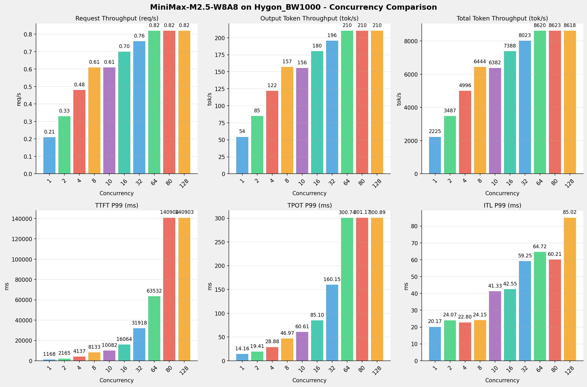
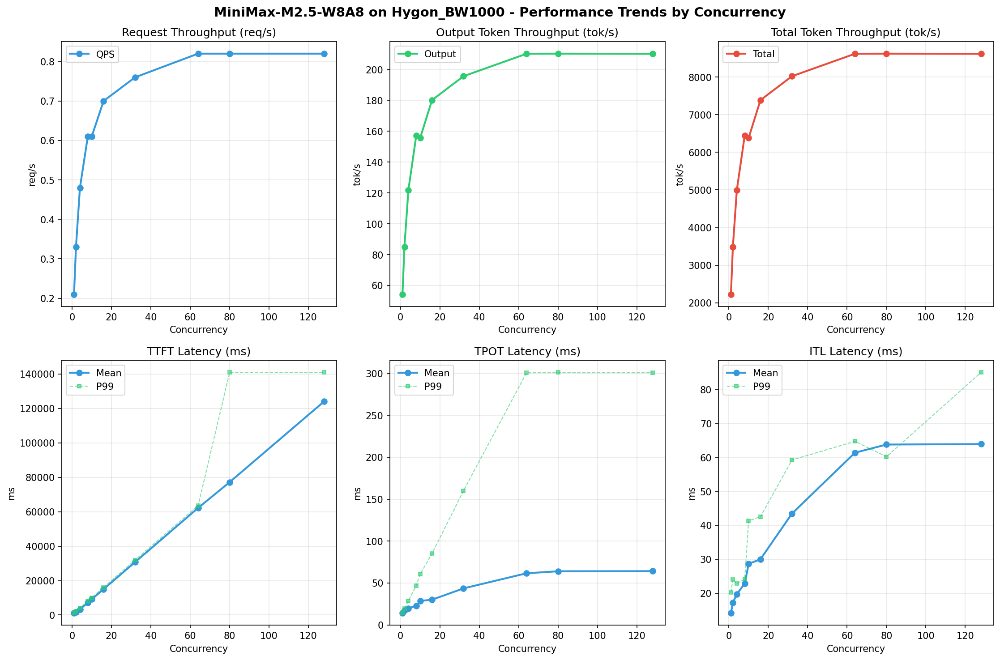

# MiniMax-M2.5-W8A8模型在Hygon_BW1000上的Benchmark基准测试报告

**测试日期：** 2026-05-18

---

## 测试场景
使用vllm bench serve基准测试工具对不同并发数，请求上下文长度下的性能变化趋势。

**主要采集指标**：

| 指标                  | 单位         | 含义                                 |
|---------------------|------------|------------------------------------|
| Request throughput  | req/s      | 请求吞吐量                              |
| Output token throughput | tok/s  | 输出token吞吐量                        |
| Total token throughput | tok/s   | 总token吞吐量                         |
| TTFT                | ms         | Time To First Token，首 token 延迟     |
| TPOT                | ms/token   | Time Per Output Token，每 token 生成时间 |
| ITL                 | ms         | Inter-Token Latency，token间延迟       |

## 🤖 芯片和模型配置信息

| 参数名称                    | Hygon_BW1000 |
|------------------------|-------------|
| **model_name** | MiniMax-M2.5-W8A8 |
| **quantization_config** | int-8 |
| **model_size** | 215G |
| **max_position_embeddings** | 196608 |
| **temperature** | N/A |
| **top_k** | N/A |
| **top_p** | N/A |
| **transformers_version** | 4.57.6 |
| **vllm_version** | 0.15.1+das.opt1.alpha.dtk2604 |
| **python_version** | 3.10.12 |

## 🤖 vLLM启动配置信息

| 参数名称                   | Hygon_BW1000 |
|------------------------|-------------|
| **Model Name** | MiniMax-M2.5-W8A8 |
| **Max Model Len** | 196608 |
| **Max Num Seqs** | 64 |
| **Max Num Batched Tokens** | default |
| **Gpu Memory Utilization** | 0.9 |
| **Dtype** | bfloat16 |
| **Block Size** | default |
| **Dp** | 1 |
| **Tp** | 8 |
| **Pp** | 1 |
| **Enable Export Parallel** | True |
| **Enable Auto Tool Choice** | True |
| **Tool Call Parser** | minimax_m2 |
| **Reasoning Parser** | minimax_m2 (不生效) |
| **Compilation Config** | N/A |

- **Hygon_BW1000**: 海光芯片专家并行配置

## 📊 测试概览

| 项目            | 配置                                     | 备注  |
|---------------|----------------------------------------|-----|
| **数据集**       | random                                 |     |
| **并发数**       | 1, 2, 4, 8, 10, 16, 32, 64, 80, 128    |     |
| **总请求数**      | 320                                    |     |
| **请求输入上下文长度** | 10240（10k）                             |     |
| **请求输出上下文长度** | 256（0.25k）                             |     |
| **模型**        | MiniMax-M2.5-W8A8                           |     |
| **被测芯片**      | Hygon_BW1000 |     |

---

## 📋 测试结果汇总

| 并发数 | 请求吞吐量 (req/s) | 输出Token吞吐量 (tok/s) | 总Token吞吐量 (tok/s) | TTFT P99 (ms) | TPOT P99 (ms) | ITL P99 (ms) |
| ----------- | ----------- | ----------- | ----------- | ----------- | ----------- | ----------- |
| 1 | 0.21 | 54.28 | 2225.40 | 1168.49 | 14.16 | 20.17 |
| 2 | 0.33 | 85.05 | 3487.19 | 2165.32 | 19.41 | 24.07 |
| 4 | 0.48 | 121.84 | 4995.56 | 4137.09 | 28.88 | 22.80 |
| 8 | 0.61 | 157.18 | 6444.25 | 8133.44 | 46.97 | 24.15 |
| 10 | 0.61 | 155.66 | 6382.12 | 10081.63 | 60.61 | 41.33 |
| 16 | 0.70 | 180.19 | 7387.79 | 16063.93 | 85.10 | 42.55 |
| 32 | 0.76 | 195.69 | 8023.25 | 31917.86 | 160.15 | 59.25 |
| 64 | 0.82 | 210.25 | 8620.30 | 63531.55 | 300.74 | 64.72 |
| 80 | 0.82 | 210.32 | 8623.30 | 140904.11 | 301.17 | 60.21 |
| 128 | 0.82 | 210.20 | 8618.28 | 140903.29 | 300.89 | 85.02 |

## 📊 各并发级别性能柱状图

## 📈 性能趋势分析

---

### 🎯 服务基准结果详情

| 指标 | 1 并发 | 2 并发 | 4 并发 | 8 并发 | 10 并发 | 16 并发 | 32 并发 | 64 并发 | 80 并发 | 128 并发 |
|------|----------- | ----------- | ----------- | ----------- | ----------- | ----------- | ----------- | ----------- | ----------- | -----------|
| 成功请求数 | 320 | 320 | 320 | 320 | 320 | 320 | 320 | 320 | 320 | 320 |
| 失败请求数 | 0 | 0 | 0 | 0 | 0 | 0 | 0 | 0 | 0 | 0 |
| 测试持续时间 (s) | 1509.26 | 963.16 | 672.34 | 521.20 | 526.27 | 454.63 | 418.62 | 389.63 | 389.49 | 389.72 |
| 总输入 tokens | 3276800 | 3276800 | 3276800 | 3276800 | 3276800 | 3276800 | 3276800 | 3276800 | 3276800 | 3276800 |
| 总生成 tokens | 81920 | 81920 | 81920 | 81920 | 81920 | 81920 | 81920 | 81920 | 81920 | 81920 |
| **请求吞吐量 (req/s)** | 0.21 | 0.33 | 0.48 | 0.61 | 0.61 | 0.70 | 0.76 | 0.82 | 0.82 | 0.82 |
| **输出 token 吞吐量 (tok/s)** | 54.28 | 85.05 | 121.84 | 157.18 | 155.66 | 180.19 | 195.69 | 210.25 | 210.32 | 210.20 |
| 峰值输出 token 吞吐量 (tok/s) | 72.00 | 136.00 | 247.00 | 424.00 | 420.00 | 656.00 | 864.00 | 1279.00 | 1263.00 | 1279.00 |
| 峰值并发请求数 | 2.00 | 4.00 | 8.00 | 16.00 | 20.00 | 32.00 | 64.00 | 128.00 | 143.00 | 191.00 |
| **总 token 吞吐量 (tok/s)** | 2225.40 | 3487.19 | 4995.56 | 6444.25 | 6382.12 | 7387.79 | 8023.25 | 8620.30 | 8623.30 | 8618.28 |

### ⏱️ 首Token延迟 (TTFT)

| 指标 | 1 并发 | 2 并发 | 4 并发 | 8 并发 | 10 并发 | 16 并发 | 32 并发 | 64 并发 | 80 并发 | 128 并发 |
|------|----------- | ----------- | ----------- | ----------- | ----------- | ----------- | ----------- | ----------- | ----------- | -----------|
| 平均 TTFT (ms) | 1112.21 | 1623.93 | 3351.54 | 7190.37 | 9132.16 | 15052.83 | 30731.82 | 62196.04 | 77178.96 | 124081.37 |
| 中位 TTFT (ms) | 1111.97 | 1153.37 | 4115.92 | 8083.99 | 10065.22 | 16028.53 | 31855.15 | 63499.67 | 62548.05 | 140502.36 |
| P95 TTFT (ms) | 1127.95 | 2156.14 | 4129.04 | 8094.81 | 10076.09 | 16056.37 | 31914.75 | 63528.23 | 140523.49 | 140895.64 |
| P99 TTFT (ms) | 1168.49 | 2165.32 | 4137.09 | 8133.44 | 10081.63 | 16063.93 | 31917.86 | 63531.55 | 140904.11 | 140903.29 |

### ⚡ 每Token生成时间 (TPOT)

| 指标 | 1 并发 | 2 并发 | 4 并发 | 8 并发 | 10 并发 | 16 并发 | 32 并发 | 64 并发 | 80 并发 | 128 并发 |
|------|----------- | ----------- | ----------- | ----------- | ----------- | ----------- | ----------- | ----------- | ----------- | -----------|
| 平均 TPOT (ms) | 14.13 | 17.24 | 19.81 | 22.89 | 28.67 | 30.10 | 43.62 | 61.63 | 64.04 | 64.17 |
| 中位 TPOT (ms) | 14.13 | 17.15 | 16.93 | 19.52 | 25.19 | 26.43 | 39.56 | 57.08 | 61.00 | 61.13 |
| P95 TPOT (ms) | 14.15 | 19.37 | 28.78 | 46.86 | 60.21 | 84.67 | 39.90 | 57.35 | 61.24 | 61.49 |
| P99 TPOT (ms) | 14.16 | 19.41 | 28.88 | 46.97 | 60.61 | 85.10 | 160.15 | 300.74 | 301.17 | 300.89 |

### 🔄 Token间延迟 (ITL)

| 指标 | 1 并发 | 2 并发 | 4 并发 | 8 并发 | 10 并发 | 16 并发 | 32 并发 | 64 并发 | 80 并发 | 128 并发 |
|------|----------- | ----------- | ----------- | ----------- | ----------- | ----------- | ----------- | ----------- | ----------- | -----------|
| 平均 ITL (ms) | 14.14 | 17.23 | 19.76 | 22.82 | 28.65 | 30.01 | 43.45 | 61.39 | 63.79 | 63.92 |
| 中位 ITL (ms) | 14.13 | 15.20 | 16.86 | 19.56 | 25.20 | 26.59 | 39.75 | 57.35 | 57.15 | 57.36 |
| P95 ITL (ms) | 14.47 | 16.13 | 17.85 | 20.53 | 26.22 | 30.25 | 48.15 | 59.07 | 58.28 | 61.86 |
| P99 ITL (ms) | 20.17 | 24.07 | 22.80 | 24.15 | 41.33 | 42.55 | 59.25 | 64.72 | 60.21 | 85.02 |

---

## 📝 分析总结

### 1. 吞吐量性能分析

**请求吞吐量 (QPS)**: 随着并发级别增加，QPS持续上升。
低并发(1,2,4)平均 QPS: 0.34 req/s；
中并发(8,10,16,32)平均 QPS: 0.67 req/s；
高并发(64,80,128)平均 QPS: 0.82 req/s；
最高 QPS 出现在 64 并发，达到 0.82 req/s。

**Token总吞吐量**: 最高达到 8623 tok/s (80 并发)。

### 2. 首Token延迟 (TTFT) 分析

TTFT随并发增加显著上升。
低并发平均 P99 TTFT: 2490ms；
高并发平均 P99 TTFT: 115113ms；
最高 P99 TTFT 出现在 80 并发，达到 140904ms。

### 3. Token生成时间 (TPOT) 分析

TPOT随并发增加也呈上升趋势。
低并发平均 P99 TPOT: 20.82ms；
高并发平均 P99 TPOT: 300.93ms；
最高 P99 TPOT 出现在 80 并发，达到 301.17ms。

### 4. Token间延迟 (ITL) 分析

ITL随并发增加呈上升趋势。
低并发平均 P99 ITL: 22.35ms；
高并发平均 P99 ITL: 69.98ms；
最高 P99 ITL 出现在 128 并发，达到 85.02ms。

### 5. 综合评估

**吞吐量增长**: 从最低并发到最高并发，QPS增长了 290.5%。
**TTFT延迟恶化**: 高并发相比低并发，TTFT P99增加了 5558.1%。
**TPOT延迟恶化**: 高并发相比低并发，TPOT P99增加了 1346.8%。

---

*报告生成时间: 2026-05-18*

