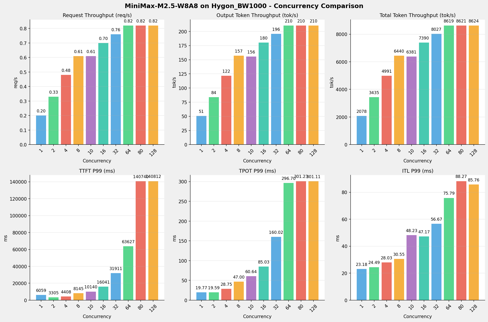
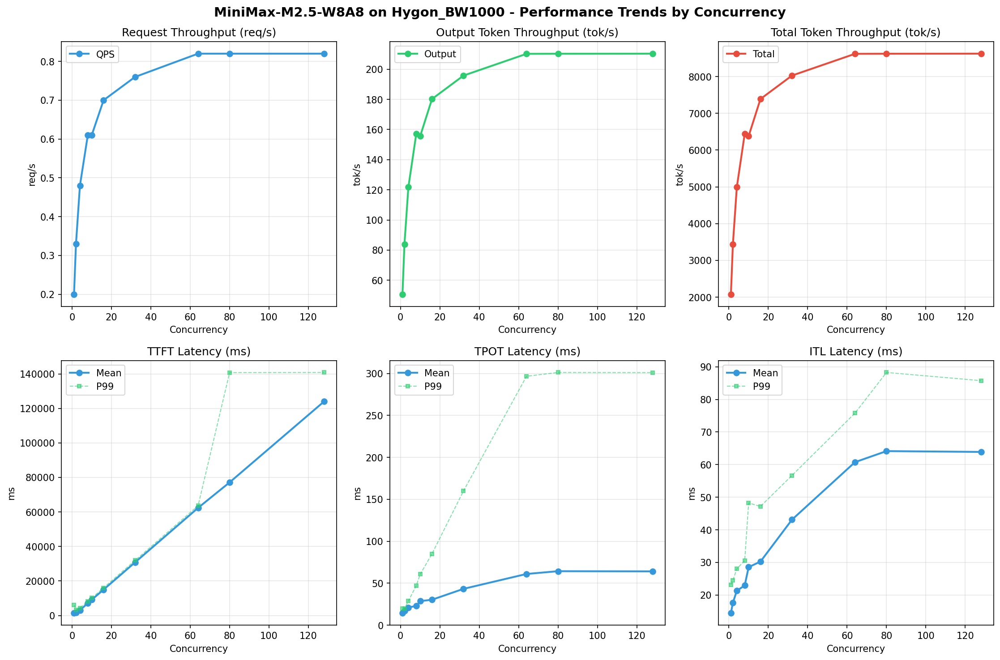

# MiniMax-M2.5-W8A8模型在Hygon_BW1000上的Benchmark基准测试报告

**测试日期：** 2026-05-18

---

## 测试场景
使用vllm bench serve基准测试工具对不同并发数，请求上下文长度下的性能变化趋势。

**主要采集指标**：

| 指标                  | 单位         | 含义                                 |
|---------------------|------------|------------------------------------|
| Request throughput  | req/s      | 请求吞吐量                              |
| Output token throughput | tok/s  | 输出token吞吐量                        |
| Total token throughput | tok/s   | 总token吞吐量                         |
| TTFT                | ms         | Time To First Token，首 token 延迟     |
| TPOT                | ms/token   | Time Per Output Token，每 token 生成时间 |
| ITL                 | ms         | Inter-Token Latency，token间延迟       |

## 🤖 芯片和模型配置信息

| 参数名称                    | Hygon_BW1000 |
|------------------------|-------------|
| **model_name** | MiniMax-M2.5-W8A8 |
| **quantization_config** | int-8 |
| **model_size** | 215G |
| **max_position_embeddings** | 196608 |
| **temperature** | N/A |
| **top_k** | N/A |
| **top_p** | N/A |
| **transformers_version** | 4.57.6 |
| **vllm_version** | 0.15.1+das.opt1.alpha.dtk2604 |
| **python_version** | 3.10.12 |

## 🤖 vLLM启动配置信息

| 参数名称                   | Hygon_BW1000 |
|------------------------|-------------|
| **Model Name** | MiniMax-M2.5-W8A8 |
| **Max Model Len** | 196608 |
| **Max Num Seqs** | 64 |
| **Max Num Batched Tokens** | default |
| **Gpu Memory Utilization** | 0.9 |
| **Dtype** | bfloat16 |
| **Block Size** | default |
| **Dp** | 1 |
| **Tp** | 8 |
| **Pp** | 1 |
| **Enable Export Parallel** | True |
| **Enable Auto Tool Choice** | True |
| **Tool Call Parser** | minimax_m2 |
| **Reasoning Parser** | minimax_m2 (不生效) |
| **Compilation Config** | N/A |

- **Hygon_BW1000**: 海光芯片专家并行配置

## 📊 测试概览

| 项目            | 配置                                     | 备注  |
|---------------|----------------------------------------|-----|
| **数据集**       | random                                 |     |
| **并发数**       | 1, 2, 4, 8, 10, 16, 32, 64, 80, 128    |     |
| **总请求数**      | 320                                    |     |
| **请求输入上下文长度** | 10240（10k）                             |     |
| **请求输出上下文长度** | 256（0.25k）                             |     |
| **模型**        | MiniMax-M2.5-W8A8                           |     |
| **被测芯片**      | Hygon_BW1000 |     |

---

## 📋 测试结果汇总

| 并发数 | 请求吞吐量 (req/s) | 输出Token吞吐量 (tok/s) | 总Token吞吐量 (tok/s) | TTFT P99 (ms) | TPOT P99 (ms) | ITL P99 (ms) |
| ----------- | ----------- | ----------- | ----------- | ----------- | ----------- | ----------- |
| 1 | 0.20 | 50.69 | 2078.29 | 6059.30 | 19.77 | 23.18 |
| 2 | 0.33 | 83.78 | 3434.93 | 3305.13 | 19.59 | 24.49 |
| 4 | 0.48 | 121.72 | 4990.68 | 4407.83 | 28.75 | 28.03 |
| 8 | 0.61 | 157.08 | 6440.47 | 8145.19 | 47.00 | 30.55 |
| 10 | 0.61 | 155.63 | 6380.86 | 10139.53 | 60.64 | 48.23 |
| 16 | 0.70 | 180.24 | 7389.73 | 16040.73 | 85.03 | 47.17 |
| 32 | 0.76 | 195.79 | 8027.43 | 31911.16 | 160.02 | 56.67 |
| 64 | 0.82 | 210.22 | 8619.00 | 63627.13 | 296.70 | 75.79 |
| 80 | 0.82 | 210.27 | 8621.21 | 140739.82 | 301.23 | 88.27 |
| 128 | 0.82 | 210.34 | 8623.79 | 140811.86 | 301.11 | 85.76 |

## 📊 各并发级别性能柱状图

## 📈 性能趋势分析

---

### 🎯 服务基准结果详情

| 指标 | 1 并发 | 2 并发 | 4 并发 | 8 并发 | 10 并发 | 16 并发 | 32 并发 | 64 并发 | 80 并发 | 128 并发 |
|------|----------- | ----------- | ----------- | ----------- | ----------- | ----------- | ----------- | ----------- | ----------- | -----------|
| 成功请求数 | 320 | 320 | 320 | 320 | 320 | 320 | 320 | 320 | 320 | 320 |
| 失败请求数 | 0 | 0 | 0 | 0 | 0 | 0 | 0 | 0 | 0 | 0 |
| 测试持续时间 (s) | 1616.10 | 977.81 | 673.00 | 521.50 | 526.37 | 454.51 | 418.41 | 389.69 | 389.59 | 389.47 |
| 总输入 tokens | 3276800 | 3276800 | 3276800 | 3276800 | 3276800 | 3276800 | 3276800 | 3276800 | 3276800 | 3276800 |
| 总生成 tokens | 81920 | 81920 | 81920 | 81920 | 81920 | 81920 | 81920 | 81920 | 81920 | 81920 |
| **请求吞吐量 (req/s)** | 0.20 | 0.33 | 0.48 | 0.61 | 0.61 | 0.70 | 0.76 | 0.82 | 0.82 | 0.82 |
| **输出 token 吞吐量 (tok/s)** | 50.69 | 83.78 | 121.72 | 157.08 | 155.63 | 180.24 | 195.79 | 210.22 | 210.27 | 210.34 |
| 峰值输出 token 吞吐量 (tok/s) | 73.00 | 136.00 | 244.00 | 432.00 | 429.00 | 640.00 | 896.00 | 1279.00 | 1216.00 | 1216.00 |
| 峰值并发请求数 | 2.00 | 4.00 | 8.00 | 16.00 | 20.00 | 32.00 | 64.00 | 128.00 | 143.00 | 191.00 |
| **总 token 吞吐量 (tok/s)** | 2078.29 | 3434.93 | 4990.68 | 6440.47 | 6380.86 | 7389.73 | 8027.43 | 8619.00 | 8621.21 | 8623.79 |

### ⏱️ 首Token延迟 (TTFT)

| 指标 | 1 并发 | 2 并发 | 4 并发 | 8 并发 | 10 并发 | 16 并发 | 32 并发 | 64 并发 | 80 并发 | 128 并发 |
|------|----------- | ----------- | ----------- | ----------- | ----------- | ----------- | ----------- | ----------- | ----------- | -----------|
| 平均 TTFT (ms) | 1399.35 | 1689.08 | 3042.57 | 7193.59 | 9160.58 | 15004.90 | 30804.99 | 62371.11 | 77135.00 | 124022.36 |
| 中位 TTFT (ms) | 1118.54 | 2109.04 | 3109.96 | 8082.67 | 10069.62 | 16017.67 | 31839.56 | 63469.29 | 62416.47 | 140427.90 |
| P95 TTFT (ms) | 3085.38 | 2157.93 | 4132.83 | 8110.99 | 10111.02 | 16037.12 | 31905.06 | 63616.42 | 140491.14 | 140802.39 |
| P99 TTFT (ms) | 6059.30 | 3305.13 | 4407.83 | 8145.19 | 10139.53 | 16040.73 | 31911.16 | 63627.13 | 140739.82 | 140811.86 |

### ⚡ 每Token生成时间 (TPOT)

| 指标 | 1 并发 | 2 并发 | 4 并发 | 8 并发 | 10 并发 | 16 并发 | 32 并发 | 64 并发 | 80 并发 | 128 并发 |
|------|----------- | ----------- | ----------- | ----------- | ----------- | ----------- | ----------- | ----------- | ----------- | -----------|
| 平均 TPOT (ms) | 14.32 | 17.34 | 21.05 | 22.91 | 28.58 | 30.27 | 43.25 | 60.99 | 64.29 | 64.09 |
| 中位 TPOT (ms) | 14.19 | 16.85 | 20.74 | 19.50 | 25.13 | 26.44 | 39.39 | 57.26 | 61.30 | 61.02 |
| P95 TPOT (ms) | 14.22 | 19.49 | 28.59 | 46.83 | 60.14 | 84.67 | 40.01 | 57.49 | 61.49 | 61.52 |
| P99 TPOT (ms) | 19.77 | 19.59 | 28.75 | 47.00 | 60.64 | 85.03 | 160.02 | 296.70 | 301.23 | 301.11 |

### 🔄 Token间延迟 (ITL)

| 指标 | 1 并发 | 2 并发 | 4 并发 | 8 并发 | 10 并发 | 16 并发 | 32 并发 | 64 并发 | 80 并发 | 128 并发 |
|------|----------- | ----------- | ----------- | ----------- | ----------- | ----------- | ----------- | ----------- | ----------- | -----------|
| 平均 ITL (ms) | 14.44 | 17.62 | 21.30 | 22.91 | 28.55 | 30.24 | 43.10 | 60.75 | 64.14 | 63.89 |
| 中位 ITL (ms) | 14.18 | 15.31 | 16.72 | 19.56 | 25.12 | 26.58 | 39.84 | 57.41 | 57.24 | 57.18 |
| P95 ITL (ms) | 16.07 | 17.00 | 18.77 | 21.21 | 30.21 | 32.13 | 45.80 | 62.06 | 75.78 | 64.73 |
| P99 ITL (ms) | 23.18 | 24.49 | 28.03 | 30.55 | 48.23 | 47.17 | 56.67 | 75.79 | 88.27 | 85.76 |

---

## 📝 分析总结

### 1. 吞吐量性能分析

**请求吞吐量 (QPS)**: 随着并发级别增加，QPS持续上升。
低并发(1,2,4)平均 QPS: 0.34 req/s；
中并发(8,10,16,32)平均 QPS: 0.67 req/s；
高并发(64,80,128)平均 QPS: 0.82 req/s；
最高 QPS 出现在 64 并发，达到 0.82 req/s。

**Token总吞吐量**: 最高达到 8624 tok/s (128 并发)。

### 2. 首Token延迟 (TTFT) 分析

TTFT随并发增加显著上升。
低并发平均 P99 TTFT: 4591ms；
高并发平均 P99 TTFT: 115060ms；
最高 P99 TTFT 出现在 128 并发，达到 140812ms。

### 3. Token生成时间 (TPOT) 分析

TPOT随并发增加也呈上升趋势。
低并发平均 P99 TPOT: 22.70ms；
高并发平均 P99 TPOT: 299.68ms；
最高 P99 TPOT 出现在 80 并发，达到 301.23ms。

### 4. Token间延迟 (ITL) 分析

ITL随并发增加呈上升趋势。
低并发平均 P99 ITL: 25.23ms；
高并发平均 P99 ITL: 83.27ms；
最高 P99 ITL 出现在 80 并发，达到 88.27ms。

### 5. 综合评估

**吞吐量增长**: 从最低并发到最高并发，QPS增长了 310.0%。
**TTFT延迟恶化**: 高并发相比低并发，TTFT P99增加了 2967.3%。
**TPOT延迟恶化**: 高并发相比低并发，TPOT P99增加了 1226.8%。

---

*报告生成时间: 2026-05-18*

