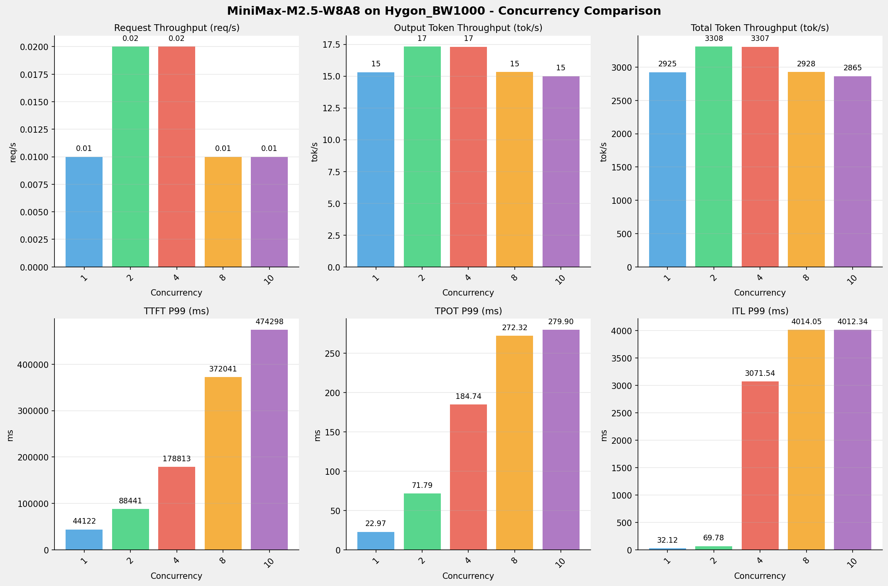
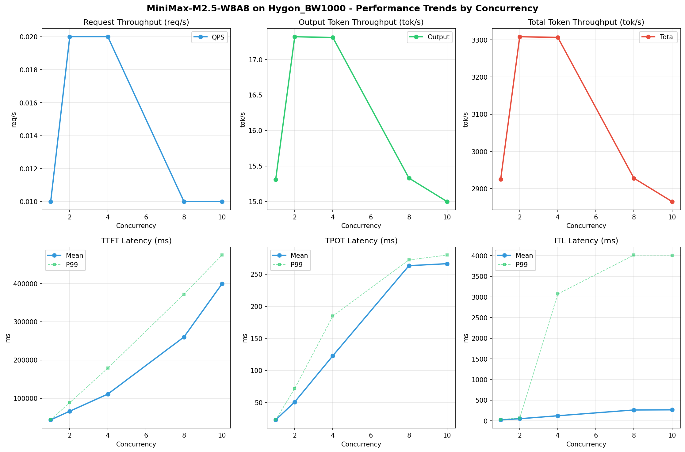

# MiniMax-M2.5-W8A8模型在Hygon_BW1000上的Benchmark基准测试报告

**测试日期：** 2026-05-18

---

## 测试场景
使用vllm bench serve基准测试工具对不同并发数，请求上下文长度下的性能变化趋势。

**主要采集指标**：

| 指标                  | 单位         | 含义                                 |
|---------------------|------------|------------------------------------|
| Request throughput  | req/s      | 请求吞吐量                              |
| Output token throughput | tok/s  | 输出token吞吐量                        |
| Total token throughput | tok/s   | 总token吞吐量                         |
| TTFT                | ms         | Time To First Token，首 token 延迟     |
| TPOT                | ms/token   | Time Per Output Token，每 token 生成时间 |
| ITL                 | ms         | Inter-Token Latency，token间延迟       |

## 🤖 芯片和模型配置信息

| 参数名称                    | Hygon_BW1000 |
|------------------------|-------------|
| **model_name** | MiniMax-M2.5-W8A8 |
| **quantization_config** | int-8 |
| **model_size** | 215G |
| **max_position_embeddings** | 196608 |
| **temperature** | N/A |
| **top_k** | N/A |
| **top_p** | N/A |
| **transformers_version** | 4.57.6 |
| **vllm_version** | 0.15.1+das.opt1.alpha.dtk2604 |
| **python_version** | 3.10.12 |

## 🤖 vLLM启动配置信息

| 参数名称                   | Hygon_BW1000 |
|------------------------|-------------|
| **Model Name** | MiniMax-M2.5-W8A8 |
| **Max Model Len** | 196608 |
| **Max Num Seqs** | 64 |
| **Max Num Batched Tokens** | default |
| **Gpu Memory Utilization** | 0.9 |
| **Dtype** | bfloat16 |
| **Block Size** | default |
| **Dp** | 1 |
| **Tp** | 8 |
| **Pp** | 1 |
| **Enable Export Parallel** | True |
| **Enable Auto Tool Choice** | True |
| **Tool Call Parser** | minimax_m2 |
| **Reasoning Parser** | minimax_m2 (不生效) |
| **Compilation Config** | N/A |

- **Hygon_BW1000**: 海光芯片专家并行配置

## 📊 测试概览

| 项目            | 配置                                     | 备注  |
|---------------|----------------------------------------|-----|
| **数据集**       | random                                 |     |
| **并发数**       | 1, 2, 4, 8, 10    |     |
| **总请求数**      | 100                                    |     |
| **请求输入上下文长度** | 194560（190k）                             |     |
| **请求输出上下文长度** | 1024（1k）                             |     |
| **模型**        | MiniMax-M2.5-W8A8                           |     |
| **被测芯片**      | Hygon_BW1000 |     |

---

## 📋 测试结果汇总

| 并发数 | 请求吞吐量 (req/s) | 输出Token吞吐量 (tok/s) | 总Token吞吐量 (tok/s) | TTFT P99 (ms) | TPOT P99 (ms) | ITL P99 (ms) |
| ----------- | ----------- | ----------- | ----------- | ----------- | ----------- | ----------- |
| 1 | 0.01 | 15.31 | 2924.75 | 44121.71 | 22.97 | 32.12 |
| 2 | 0.02 | 17.32 | 3308.40 | 88441.47 | 71.79 | 69.78 |
| 4 | 0.02 | 17.31 | 3306.71 | 178812.59 | 184.74 | 3071.54 |
| 8 | 0.01 | 15.33 | 2927.85 | 372041.15 | 272.32 | 4014.05 |
| 10 | 0.01 | 15.00 | 2865.09 | 474297.92 | 279.90 | 4012.34 |

## 📊 各并发级别性能柱状图

## 📈 性能趋势分析

---

### 🎯 服务基准结果详情

| 指标 | 1 并发 | 2 并发 | 4 并发 | 8 并发 | 10 并发 |
|------|----------- | ----------- | ----------- | ----------- | -----------|
| 成功请求数 | 100 | 100 | 100 | 100 | 100 |
| 失败请求数 | 0 | 0 | 0 | 0 | 0 |
| 测试持续时间 (s) | 6687.21 | 5911.73 | 5914.77 | 6680.12 | 6826.46 |
| 总输入 tokens | 19456000 | 19456000 | 19456000 | 19456000 | 19456000 |
| 总生成 tokens | 102400 | 102400 | 102400 | 102400 | 102400 |
| **请求吞吐量 (req/s)** | 0.01 | 0.02 | 0.02 | 0.01 | 0.01 |
| **输出 token 吞吐量 (tok/s)** | 15.31 | 17.32 | 17.31 | 15.33 | 15.00 |
| 峰值输出 token 吞吐量 (tok/s) | 47.00 | 72.00 | 96.00 | 135.00 | 145.00 |
| 峰值并发请求数 | 2.00 | 4.00 | 7.00 | 9.00 | 12.00 |
| **总 token 吞吐量 (tok/s)** | 2924.75 | 3308.40 | 3306.71 | 2927.85 | 2865.09 |

### ⏱️ 首Token延迟 (TTFT)

| 指标 | 1 并发 | 2 并发 | 4 并发 | 8 并发 | 10 并发 |
|------|----------- | ----------- | ----------- | ----------- | -----------|
| 平均 TTFT (ms) | 43487.80 | 66239.08 | 110901.13 | 260175.41 | 399184.25 |
| 中位 TTFT (ms) | 43910.38 | 46228.26 | 96467.29 | 280403.12 | 414031.08 |
| P95 TTFT (ms) | 44091.15 | 88317.83 | 174373.75 | 281593.86 | 441820.31 |
| P99 TTFT (ms) | 44121.71 | 88441.47 | 178812.59 | 372041.15 | 474297.92 |

### ⚡ 每Token生成时间 (TPOT)

| 指标 | 1 并发 | 2 并发 | 4 并发 | 8 并发 | 10 并发 |
|------|----------- | ----------- | ----------- | ----------- | -----------|
| 平均 TPOT (ms) | 22.86 | 50.82 | 122.83 | 263.40 | 266.45 |
| 中位 TPOT (ms) | 22.86 | 49.68 | 120.64 | 269.07 | 276.40 |
| P95 TPOT (ms) | 22.96 | 71.63 | 184.15 | 272.14 | 279.80 |
| P99 TPOT (ms) | 22.97 | 71.79 | 184.74 | 272.32 | 279.90 |

### 🔄 Token间延迟 (ITL)

| 指标 | 1 并发 | 2 并发 | 4 并发 | 8 并发 | 10 并发 |
|------|----------- | ----------- | ----------- | ----------- | -----------|
| 平均 ITL (ms) | 22.88 | 50.85 | 122.76 | 263.23 | 266.45 |
| 中位 ITL (ms) | 22.85 | 30.34 | 43.16 | 38.61 | 38.64 |
| P95 ITL (ms) | 23.57 | 36.99 | 52.02 | 2683.84 | 2679.16 |
| P99 ITL (ms) | 32.12 | 69.78 | 3071.54 | 4014.05 | 4012.34 |

---

## 📝 分析总结

### 1. 吞吐量性能分析

**请求吞吐量 (QPS)**: 随着并发级别增加，QPS持续上升。
低并发(1,2,4)平均 QPS: 0.02 req/s；
中并发(8,10)平均 QPS: 0.01 req/s；
最高 QPS 出现在 2 并发，达到 0.02 req/s。

**Token总吞吐量**: 最高达到 3308 tok/s (2 并发)。

### 2. 首Token延迟 (TTFT) 分析

TTFT随并发增加显著上升。
低并发平均 P99 TTFT: 103792ms；
最高 P99 TTFT 出现在 10 并发，达到 474298ms。

### 3. Token生成时间 (TPOT) 分析

TPOT随并发增加也呈上升趋势。
低并发平均 P99 TPOT: 93.17ms；
最高 P99 TPOT 出现在 10 并发，达到 279.90ms。

### 4. Token间延迟 (ITL) 分析

ITL随并发增加呈上升趋势。
低并发平均 P99 ITL: 1057.81ms；
最高 P99 ITL 出现在 8 并发，达到 4014.05ms。

### 5. 综合评估

**吞吐量增长**: 从最低并发到最高并发，QPS增长了 0.0%。
**TTFT延迟恶化**: 高并发相比低并发，TTFT P99增加了 357.0%。
**TPOT延迟恶化**: 高并发相比低并发，TPOT P99增加了 200.4%。

---

*报告生成时间: 2026-05-18*

