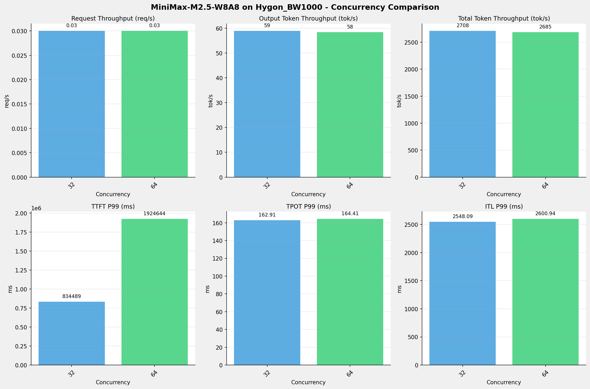
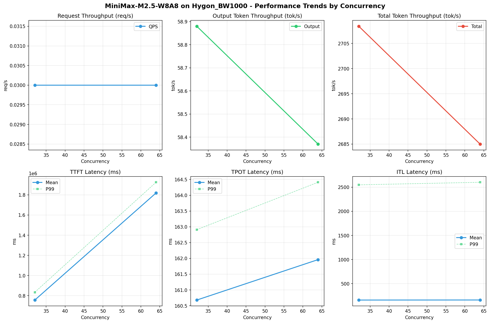

# MiniMax-M2.5-W8A8模型在Hygon_BW1000上的Benchmark基准测试报告

**测试日期：** 2026-05-18

---

## 测试场景
使用vllm bench serve基准测试工具对不同并发数，请求上下文长度下的性能变化趋势。

**主要采集指标**：

| 指标                  | 单位         | 含义                                 |
|---------------------|------------|------------------------------------|
| Request throughput  | req/s      | 请求吞吐量                              |
| Output token throughput | tok/s  | 输出token吞吐量                        |
| Total token throughput | tok/s   | 总token吞吐量                         |
| TTFT                | ms         | Time To First Token，首 token 延迟     |
| TPOT                | ms/token   | Time Per Output Token，每 token 生成时间 |
| ITL                 | ms         | Inter-Token Latency，token间延迟       |

## 🤖 芯片和模型配置信息

| 参数名称                    | Hygon_BW1000 |
|------------------------|-------------|
| **model_name** | MiniMax-M2.5-W8A8 |
| **quantization_config** | int-8 |
| **model_size** | 215G |
| **max_position_embeddings** | 196608 |
| **temperature** | N/A |
| **top_k** | N/A |
| **top_p** | N/A |
| **transformers_version** | 4.57.6 |
| **vllm_version** | 0.15.1+das.opt1.alpha.dtk2604 |
| **python_version** | 3.10.12 |

## 🤖 vLLM启动配置信息

| 参数名称                   | Hygon_BW1000 |
|------------------------|-------------|
| **Model Name** | MiniMax-M2.5-W8A8 |
| **Max Model Len** | 196608 |
| **Max Num Seqs** | 64 |
| **Max Num Batched Tokens** | default |
| **Gpu Memory Utilization** | 0.9 |
| **Dtype** | bfloat16 |
| **Block Size** | default |
| **Dp** | 1 |
| **Tp** | 8 |
| **Pp** | 1 |
| **Enable Export Parallel** | True |
| **Enable Auto Tool Choice** | True |
| **Tool Call Parser** | minimax_m2 |
| **Reasoning Parser** | minimax_m2 (不生效) |
| **Compilation Config** | N/A |

- **Hygon_BW1000**: 海光芯片专家并行配置

## 📊 测试概览

| 项目            | 配置                                     | 备注  |
|---------------|----------------------------------------|-----|
| **数据集**       | random                                 |     |
| **并发数**       | 32, 64    |     |
| **总请求数**      | 1000                                    |     |
| **请求输入上下文长度** | 90000（87k）                             |     |
| **请求输出上下文长度** | 2000（1k）                             |     |
| **模型**        | MiniMax-M2.5-W8A8                           |     |
| **被测芯片**      | Hygon_BW1000 |     |

---

## 📋 测试结果汇总

| 并发数 | 请求吞吐量 (req/s) | 输出Token吞吐量 (tok/s) | 总Token吞吐量 (tok/s) | TTFT P99 (ms) | TPOT P99 (ms) | ITL P99 (ms) |
| ----------- | ----------- | ----------- | ----------- | ----------- | ----------- | ----------- |
| 32 | 0.03 | 58.88 | 2708.41 | 834489.39 | 162.91 | 2548.09 |
| 64 | 0.03 | 58.37 | 2685.01 | 1924644.26 | 164.41 | 2600.94 |

## 📊 各并发级别性能柱状图

## 📈 性能趋势分析

---

### 🎯 服务基准结果详情

| 指标 | 32 并发 | 64 并发 |
|------|----------- | -----------|
| 成功请求数 | 1000 | 1000 |
| 失败请求数 | 0 | 0 |
| 测试持续时间 (s) | 33968.26 | 34264.32 |
| 总输入 tokens | 90000000 | 90000000 |
| 总生成 tokens | 2000000 | 2000000 |
| **请求吞吐量 (req/s)** | 0.03 | 0.03 |
| **输出 token 吞吐量 (tok/s)** | 58.88 | 58.37 |
| 峰值输出 token 吞吐量 (tok/s) | 280.00 | 266.00 |
| 峰值并发请求数 | 33.00 | 65.00 |
| **总 token 吞吐量 (tok/s)** | 2708.41 | 2685.01 |

### ⏱️ 首Token延迟 (TTFT)

| 指标 | 32 并发 | 64 并发 |
|------|----------- | -----------|
| 平均 TTFT (ms) | 757205.36 | 1818494.99 |
| 中位 TTFT (ms) | 751670.60 | 1843238.45 |
| P95 TTFT (ms) | 833071.44 | 1922653.02 |
| P99 TTFT (ms) | 834489.39 | 1924644.26 |

### ⚡ 每Token生成时间 (TPOT)

| 指标 | 32 并发 | 64 并发 |
|------|----------- | -----------|
| 平均 TPOT (ms) | 160.68 | 161.96 |
| 中位 TPOT (ms) | 161.64 | 162.87 |
| P95 TPOT (ms) | 162.58 | 163.70 |
| P99 TPOT (ms) | 162.91 | 164.41 |

### 🔄 Token间延迟 (ITL)

| 指标 | 32 并发 | 64 并发 |
|------|----------- | -----------|
| 平均 ITL (ms) | 160.68 | 162.01 |
| 中位 ITL (ms) | 41.19 | 41.27 |
| P95 ITL (ms) | 55.96 | 57.35 |
| P99 ITL (ms) | 2548.09 | 2600.94 |

---

## 📝 分析总结

### 1. 吞吐量性能分析

**请求吞吐量 (QPS)**: 随着并发级别增加，QPS持续上升。
中并发(32)平均 QPS: 0.03 req/s；
高并发(64)平均 QPS: 0.03 req/s；
最高 QPS 出现在 32 并发，达到 0.03 req/s。

**Token总吞吐量**: 最高达到 2708 tok/s (32 并发)。

### 2. 首Token延迟 (TTFT) 分析

TTFT随并发增加显著上升。
高并发平均 P99 TTFT: 1924644ms；
最高 P99 TTFT 出现在 64 并发，达到 1924644ms。

### 3. Token生成时间 (TPOT) 分析

TPOT随并发增加也呈上升趋势。
高并发平均 P99 TPOT: 164.41ms；
最高 P99 TPOT 出现在 64 并发，达到 164.41ms。

### 4. Token间延迟 (ITL) 分析

ITL随并发增加呈上升趋势。
高并发平均 P99 ITL: 2600.94ms；
最高 P99 ITL 出现在 64 并发，达到 2600.94ms。

### 5. 综合评估

**吞吐量增长**: 从最低并发到最高并发，QPS增长了 0.0%。

---

*报告生成时间: 2026-05-18*

